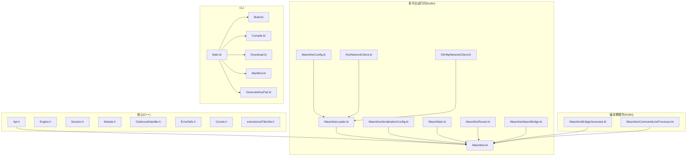
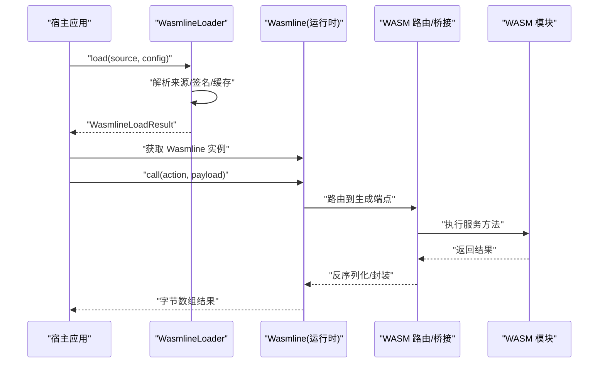
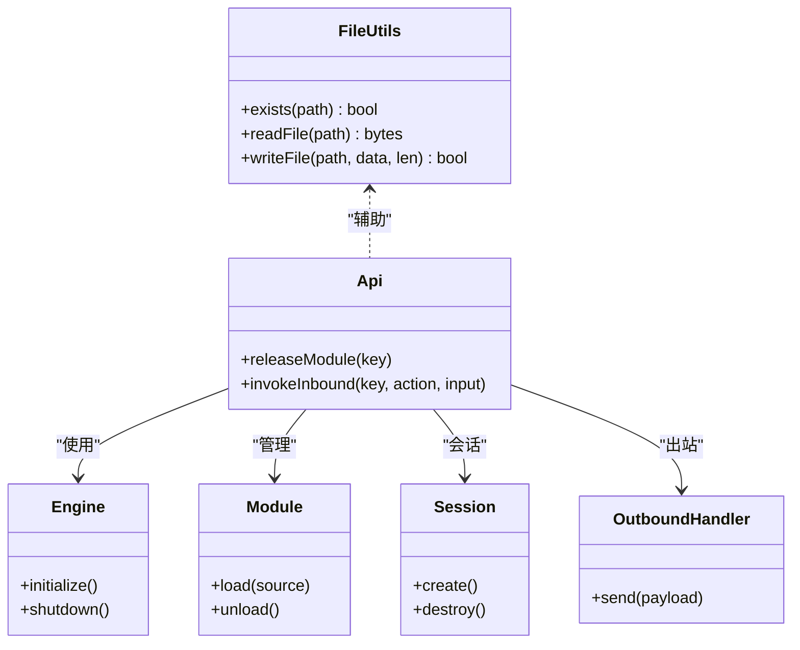
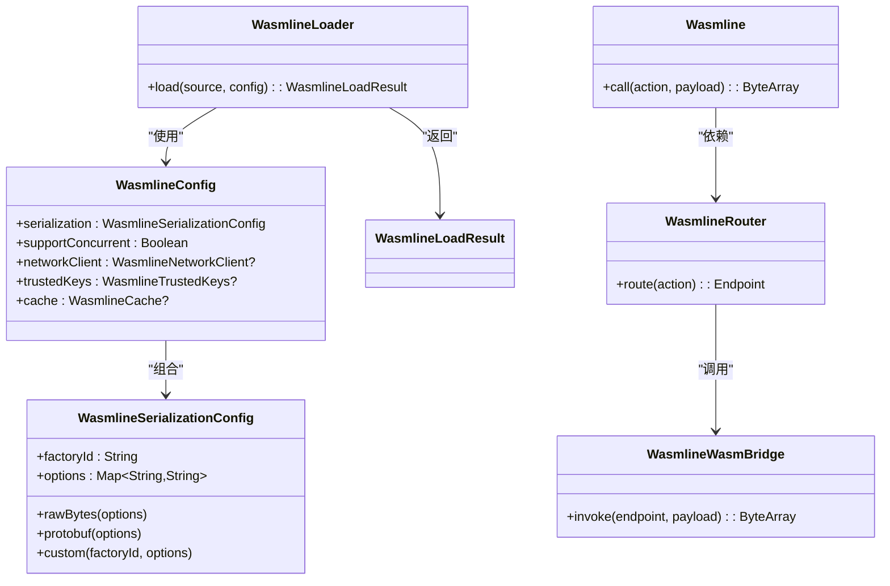
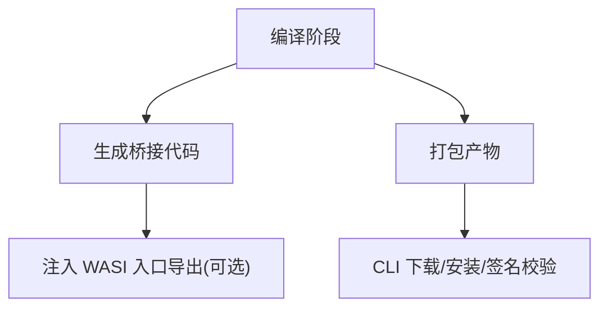
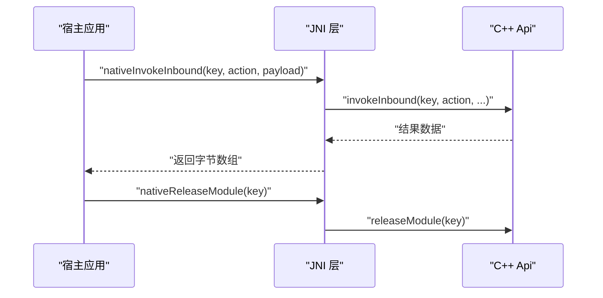
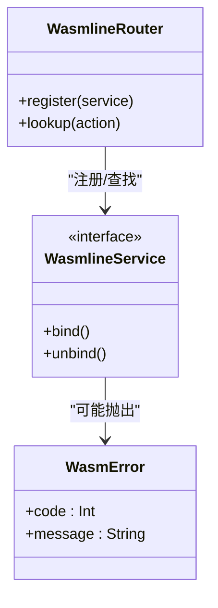
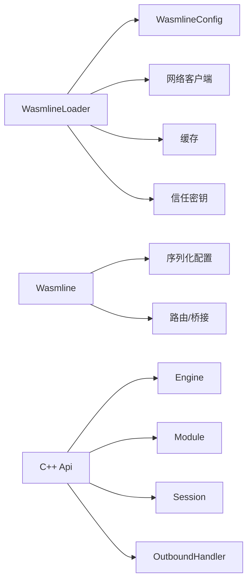

# API 参考

<cite>
**本文引用的文件**
- [Api.h](file://wasmline-core/include/Api.h)
- [Engine.h](file://wasmline-core/include/Engine.h)
- [Session.h](file://wasmline-core/include/Session.h)
- [Module.h](file://wasmline-core/include/Module.h)
- [OutboundHandler.h](file://wasmline-core/include/OutboundHandler.h)
- [ErrorDefs.h](file://wasmline-core/include/ErrorDefs.h)
- [Consts.h](file://wasmline-core/include/Consts.h)
- [FileUtils.h](file://wasmline-core/include/extensions/FileUtils.h)
- [FileUtils.cpp](file://wasmline-core/src/extensions/FileUtils.cpp)
- [Wasmline.kt](file://wasmline-multiplatform/wasmline/src/hostMain/kotlin/crow/wasmline/Wasmline.kt)
- [WasmlineService.kt](file://wasmline-multiplatform/wasmline/src/commonMain/kotlin/crow/wasmline/WasmlineService.kt)
- [WasmlineConfig.kt](file://wasmline-multiplatform/wasmline/src/commonMain/kotlin/crow/wasmline/WasmlineConfig.kt)
- [WasmlineLoadResult.kt](file://wasmline-multiplatform/wasmline/src/hostMain/kotlin/crow/wasmline/WasmlineLoadResult.kt)
- [WasmlineLoader.kt](file://wasmline-multiplatform/wasmline-loader/src/hostMain/kotlin/crow/wasmline/loader/WasmlineLoader.kt)
- [WasmlineSerializationConfig.kt](file://wasmline-multiplatform/wasmline/src/commonMain/kotlin/crow/wasmline/serialization/WasmlineSerializationConfig.kt)
- [KtorNetworkClient.kt](file://wasmline-multiplatform/wasmline-network-ktor/src/commonMain/kotlin/crow/wasmline/network/ktor/KtorNetworkClient.kt)
- [OkHttpNetworkClient.kt](file://wasmline-multiplatform/wasmline-network-okhttp/src/commonMain/kotlin/crow/wasmline/network/okhttp/OkHttpNetworkClient.kt)
- [WasmlineJni.cpp](file://wasmline-multiplatform/wasmline/src/jniMain/native/WasmlineJni.cpp)
- [WasmlineNative.cpp](file://wasmline-multiplatform/wasmline/src/iosMain/native/WasmlineNative.cpp)
- [WasmlineNative.h](file://wasmline-multiplatform/wasmline/src/iosMain/native/WasmlineNative.h)
- [JniHostHandler.cpp](file://wasmline-multiplatform/wasmline/src/jniMain/native/JniHostHandler.cpp)
- [JniHostHandler.h](file://wasmline-multiplatform/wasmline/src/jniMain/native/JniHostHandler.h)
- [WasmError.kt](file://wasmline-multiplatform/wasmline/src/wasmWasiMain/kotlin/crow/wasmline/model/WasmError.kt)
- [WasmMain.kt](file://wasmline-multiplatform/wasmline/src/wasmWasiMain/kotlin/crow/wasmline/WasmMain.kt)
- [Wasmline.wasmWasi.kt](file://wasmline-multiplatform/wasmline/src/wasmWasiMain/kotlin/crow/wasmline/Wasmline.wasmWasi.kt)
- [WasmlineRouter.kt](file://wasmline-multiplatform/wasmline/src/wasmWasiMain/kotlin/crow/wasmline/WasmlineRouter.kt)
- [WasmlineServices.wasmWasi.kt](file://wasmline-multiplatform/wasmline/src/wasmWasiMain/kotlin/crow/wasmline/WasmlineServices.wasmWasi.kt)
- [WasmlineWasmBridge.kt](file://wasmline-multiplatform/wasmline/src/wasmWasiMain/kotlin/crow/wasmline/WasmlineWasmBridge.kt)
- [WasmlineBridgeGenerator.kt](file://wasmline-multiplatform/wasmline-kotlin-plugin/src/main/kotlin/crow/wasmline/kotlin/WasmlineBridgeGenerator.kt)
- [WasmlineCommandLineProcessor.kt](file://wasmline-multiplatform/wasmline-kotlin-plugin/src/main/kotlin/crow/wasmline/kotlin/WasmlineCommandLineProcessor.kt)
- [Manifest.kt](file://wasmline-multiplatform/wasmline-cli/src/main/kotlin/crow/wasmline/cli/Manifest.kt)
- [Build.kt](file://wasmline-multiplatform/wasmline-cli/src/main/kotlin/crow/wasmline/cli/Build.kt)
- [Compile.kt](file://wasmline-multiplatform/wasmline-cli/src/main/kotlin/crow/wasmline/cli/Compile.kt)
- [Download.kt](file://wasmline-multiplatform/wasmline-cli/src/main/kotlin/crow/wasmline/cli/Download.kt)
- [GenerateKeyPair.kt](file://wasmline-multiplatform/wasmline-cli/src/main/kotlin/crow/wasmline/cli/GenerateKeyPair.kt)
- [Main.kt](file://wasmline-multiplatform/wasmline-cli/src/main/kotlin/crow/wasmline/cli/Main.kt)
- [WasmlineSerializationConfigTest.kt](file://wasmline-multiplatform/wasmline/src/commonTest/kotlin/crow/wasmline/WasmlineSerializationConfigTest.kt)
- [WasmlineHostApiCompileTest.kt](file://wasmline-multiplatform/wasmline/src/hostTest/kotlin/crow/wasmline/WasmlineHostApiCompileTest.kt)
- [README.md](file://README.md)
</cite>

## 目录
1. [简介](#简介)
2. [项目结构](#项目结构)
3. [核心组件](#核心组件)
4. [架构总览](#架构总览)
5. [详细组件分析](#详细组件分析)
6. [依赖关系分析](#依赖关系分析)
7. [性能与限制](#性能与限制)
8. [故障排查指南](#故障排查指南)
9. [结论](#结论)
10. [附录](#附录)

## 简介
本文件为 Wasmline 的完整 API 参考，覆盖跨平台运行时、加载器、网络客户端、序列化配置、桥接与服务绑定等核心能力。内容包含：
- 核心 API：模块加载、调用、会话管理、引擎生命周期
- 扩展 API：文件系统工具、网络传输适配
- 配置选项：统一配置对象、序列化策略、并发支持、信任密钥与缓存
- 错误码与异常模型：错误定义、WASM 端错误类型
- 版本与变更：编译期插件选项、CLI 命令与行为变更
- 异步与回调：跨语言桥接与回调机制
- 性能特性与限制：并发模式、序列化开销、网络与缓存策略
- 集成指导：多平台加载流程、服务绑定与路由

## 项目结构
Wasmline 采用多模块分层设计：
- 核心库（C++）：提供引擎、模块、会话、错误定义与常量
- 多平台运行时（Kotlin）：统一的加载器、配置、网络客户端、序列化工厂与桥接
- 编译期插件（Kotlin）：生成桥接代码、注入 WASI 入口导出
- CLI 工具：构建、下载、密钥生成、清单管理
- 示例工程：Android、iOS、Web、桌面等多端集成样例

图表来源
- [Api.h](file://wasmline-core/include/Api.h)
- [Wasmline.kt](file://wasmline-multiplatform/wasmline/src/hostMain/kotlin/crow/wasmline/Wasmline.kt)
- [WasmlineLoader.kt](file://wasmline-multiplatform/wasmline-loader/src/hostMain/kotlin/crow/wasmline/loader/WasmlineLoader.kt)
- [WasmlineConfig.kt](file://wasmline-multiplatform/wasmline/src/commonMain/kotlin/crow/wasmline/WasmlineConfig.kt)
- [WasmlineSerializationConfig.kt](file://wasmline-multiplatform/wasmline/src/commonMain/kotlin/crow/wasmline/serialization/WasmlineSerializationConfig.kt)
- [KtorNetworkClient.kt](file://wasmline-multiplatform/wasmline-network-ktor/src/commonMain/kotlin/crow/wasmline/network/ktor/KtorNetworkClient.kt)
- [OkHttpNetworkClient.kt](file://wasmline-multiplatform/wasmline-network-okhttp/src/commonMain/kotlin/crow/wasmline/network/okhttp/OkHttpNetworkClient.kt)
- [WasmMain.kt](file://wasmline-multiplatform/wasmline/src/wasmWasiMain/kotlin/crow/wasmline/WasmMain.kt)
- [WasmlineRouter.kt](file://wasmline-multiplatform/wasmline/src/wasmWasiMain/kotlin/crow/wasmline/WasmlineRouter.kt)
- [WasmlineWasmBridge.kt](file://wasmline-multiplatform/wasmline/src/wasmWasiMain/kotlin/crow/wasmline/WasmlineWasmBridge.kt)
- [WasmlineBridgeGenerator.kt](file://wasmline-multiplatform/wasmline-kotlin-plugin/src/main/kotlin/crow/wasmline/kotlin/WasmlineBridgeGenerator.kt)
- [WasmlineCommandLineProcessor.kt](file://wasmline-multiplatform/wasmline-kotlin-plugin/src/main/kotlin/crow/wasmline/kotlin/WasmlineCommandLineProcessor.kt)
- [Main.kt](file://wasmline-multiplatform/wasmline-cli/src/main/kotlin/crow/wasmline/cli/Main.kt)
- [Build.kt](file://wasmline-multiplatform/wasmline-cli/src/main/kotlin/crow/wasmline/cli/Build.kt)
- [Compile.kt](file://wasmline-multiplatform/wasmline-cli/src/main/kotlin/crow/wasmline/cli/Compile.kt)
- [Download.kt](file://wasmline-multiplatform/wasmline-cli/src/main/kotlin/crow/wasmline/cli/Download.kt)
- [Manifest.kt](file://wasmline-multiplatform/wasmline-cli/src/main/kotlin/crow/wasmline/cli/Manifest.kt)
- [GenerateKeyPair.kt](file://wasmline-multiplatform/wasmline-cli/src/main/kotlin/crow/wasmline/cli/GenerateKeyPair.kt)

章节来源
- [README.md](file://README.md)

## 核心组件
- 核心 API（C++）
  - 模块加载与释放、入站调用、引擎初始化与入口导出名常量
- 运行时 API（Kotlin）
  - 统一加载器、配置对象、序列化配置、网络客户端、缓存与信任密钥
- WASM 端桥接与路由
  - 生成的宿主端端点、WASM 路由与桥接
- 编译期插件
  - 桥接生成器、命令行处理器（含 WASI 入口导出开关）

章节来源
- [Api.h](file://wasmline-core/include/Api.h)
- [Engine.h](file://wasmline-core/include/Engine.h)
- [Session.h](file://wasmline-core/include/Session.h)
- [Module.h](file://wasmline-core/include/Module.h)
- [OutboundHandler.h](file://wasmline-core/include/OutboundHandler.h)
- [Consts.h](file://wasmline-core/include/Consts.h)
- [Wasmline.kt](file://wasmline-multiplatform/wasmline/src/hostMain/kotlin/crow/wasmline/Wasmline.kt)
- [WasmlineConfig.kt](file://wasmline-multiplatform/wasmline/src/commonMain/kotlin/crow/wasmline/WasmlineConfig.kt)
- [WasmlineSerializationConfig.kt](file://wasmline-multiplatform/wasmline/src/commonMain/kotlin/crow/wasmline/serialization/WasmlineSerializationConfig.kt)
- [WasmlineLoader.kt](file://wasmline-multiplatform/wasmline-loader/src/hostMain/kotlin/crow/wasmline/loader/WasmlineLoader.kt)
- [Wasmline.wasmWasi.kt](file://wasmline-multiplatform/wasmline/src/wasmWasiMain/kotlin/crow/wasmline/Wasmline.wasmWasi.kt)
- [WasmlineRouter.kt](file://wasmline-multiplatform/wasmline/src/wasmWasiMain/kotlin/crow/wasmline/WasmlineRouter.kt)
- [WasmlineWasmBridge.kt](file://wasmline-multiplatform/wasmline/src/wasmWasiMain/kotlin/crow/wasmline/WasmlineWasmBridge.kt)
- [WasmlineBridgeGenerator.kt](file://wasmline-multiplatform/wasmline-kotlin-plugin/src/main/kotlin/crow/wasmline/kotlin/WasmlineBridgeGenerator.kt)
- [WasmlineCommandLineProcessor.kt](file://wasmline-multiplatform/wasmline-kotlin-plugin/src/main/kotlin/crow/wasmline/kotlin/WasmlineCommandLineProcessor.kt)

## 架构总览
Wasmline 的调用链路从宿主侧发起，通过统一加载器解析来源、验证签名、拉取/缓存资源，随后在目标平台执行 WASM 模块并通过桥接进行服务调用。

图表来源
- [WasmlineLoader.kt](file://wasmline-multiplatform/wasmline-loader/src/hostMain/kotlin/crow/wasmline/loader/WasmlineLoader.kt)
- [Wasmline.kt](file://wasmline-multiplatform/wasmline/src/hostMain/kotlin/crow/wasmline/Wasmline.kt)
- [WasmlineRouter.kt](file://wasmline-multiplatform/wasmline/src/wasmWasiMain/kotlin/crow/wasmline/WasmlineRouter.kt)
- [WasmlineWasmBridge.kt](file://wasmline-multiplatform/wasmline/src/wasmWasiMain/kotlin/crow/wasmline/WasmlineWasmBridge.kt)

## 详细组件分析

### 核心 API（C++）
- 模块与引擎
  - 引擎生命周期与导出常量（WASI 初始化与入口导出名）
  - 模块加载、释放、会话管理
- 出站处理器与错误定义
  - 定义错误码与错误模型，供宿主与 WASM 互通
- 文件系统扩展
  - 文件存在性检查、读取、写入（二进制安全）

图表来源
- [Api.h](file://wasmline-core/include/Api.h)
- [Engine.h](file://wasmline-core/include/Engine.h)
- [Module.h](file://wasmline-core/include/Module.h)
- [Session.h](file://wasmline-core/include/Session.h)
- [OutboundHandler.h](file://wasmline-core/include/OutboundHandler.h)
- [FileUtils.h](file://wasmline-core/include/extensions/FileUtils.h)

章节来源
- [Api.h](file://wasmline-core/include/Api.h)
- [Engine.h](file://wasmline-core/include/Engine.h)
- [Session.h](file://wasmline-core/include/Session.h)
- [Module.h](file://wasmline-core/include/Module.h)
- [OutboundHandler.h](file://wasmline-core/include/OutboundHandler.h)
- [ErrorDefs.h](file://wasmline-core/include/ErrorDefs.h)
- [Consts.h](file://wasmline-core/include/Consts.h)
- [FileUtils.h](file://wasmline-core/include/extensions/FileUtils.h)
- [FileUtils.cpp](file://wasmline-core/src/extensions/FileUtils.cpp)

### 运行时 API（Kotlin）
- 加载器
  - 统一入口：接收来源与配置，返回加载结果（成功或失败）
- 配置对象
  - 序列化策略、并发支持、网络客户端、信任密钥、缓存
- 序列化配置
  - 内置原生字节与 Protobuf 工厂，支持自定义工厂 ID 与选项
- 网络客户端
  - Ktor 与 OkHttp 两种实现，屏蔽平台差异
- WASM 端桥接
  - 生成宿主端端点、路由与桥接，暴露 call(action, payload) 接口

图表来源
- [WasmlineConfig.kt](file://wasmline-multiplatform/wasmline/src/commonMain/kotlin/crow/wasmline/WasmlineConfig.kt)
- [WasmlineSerializationConfig.kt](file://wasmline-multiplatform/wasmline/src/commonMain/kotlin/crow/wasmline/serialization/WasmlineSerializationConfig.kt)
- [WasmlineLoader.kt](file://wasmline-multiplatform/wasmline-loader/src/hostMain/kotlin/crow/wasmline/loader/WasmlineLoader.kt)
- [WasmlineLoadResult.kt](file://wasmline-multiplatform/wasmline/src/hostMain/kotlin/crow/wasmline/WasmlineLoadResult.kt)
- [Wasmline.kt](file://wasmline-multiplatform/wasmline/src/hostMain/kotlin/crow/wasmline/Wasmline.kt)
- [WasmlineRouter.kt](file://wasmline-multiplatform/wasmline/src/wasmWasiMain/kotlin/crow/wasmline/WasmlineRouter.kt)
- [WasmlineWasmBridge.kt](file://wasmline-multiplatform/wasmline/src/wasmWasiMain/kotlin/crow/wasmline/WasmlineWasmBridge.kt)

章节来源
- [WasmlineLoader.kt](file://wasmline-multiplatform/wasmline-loader/src/hostMain/kotlin/crow/wasmline/loader/WasmlineLoader.kt)
- [WasmlineLoadResult.kt](file://wasmline-multiplatform/wasmline/src/hostMain/kotlin/crow/wasmline/WasmlineLoadResult.kt)
- [WasmlineConfig.kt](file://wasmline-multiplatform/wasmline/src/commonMain/kotlin/crow/wasmline/WasmlineConfig.kt)
- [WasmlineSerializationConfig.kt](file://wasmline-multiplatform/wasmline/src/commonMain/kotlin/crow/wasmline/serialization/WasmlineSerializationConfig.kt)
- [Wasmline.kt](file://wasmline-multiplatform/wasmline/src/hostMain/kotlin/crow/wasmline/Wasmline.kt)
- [WasmlineRouter.kt](file://wasmline-multiplatform/wasmline/src/wasmWasiMain/kotlin/crow/wasmline/WasmlineRouter.kt)
- [WasmlineWasmBridge.kt](file://wasmline-multiplatform/wasmline/src/wasmWasiMain/kotlin/crow/wasmline/WasmlineWasmBridge.kt)

### 编译期插件与 CLI
- 插件
  - 生成桥接代码、注入 WASI 入口导出（可选）
- CLI
  - 构建、编译、下载、清单管理、密钥对生成

图表来源
- [WasmlineBridgeGenerator.kt](file://wasmline-multiplatform/wasmline-kotlin-plugin/src/main/kotlin/crow/wasmline/kotlin/WasmlineBridgeGenerator.kt)
- [WasmlineCommandLineProcessor.kt](file://wasmline-multiplatform/wasmline-kotlin-plugin/src/main/kotlin/crow/wasmline/kotlin/WasmlineCommandLineProcessor.kt)
- [Compile.kt](file://wasmline-multiplatform/wasmline-cli/src/main/kotlin/crow/wasmline/cli/Compile.kt)
- [Download.kt](file://wasmline-multiplatform/wasmline-cli/src/main/kotlin/crow/wasmline/cli/Download.kt)
- [Manifest.kt](file://wasmline-multiplatform/wasmline-cli/src/main/kotlin/crow/wasmline/cli/Manifest.kt)
- [GenerateKeyPair.kt](file://wasmline-multiplatform/wasmline-cli/src/main/kotlin/crow/wasmline/cli/GenerateKeyPair.kt)

章节来源
- [WasmlineBridgeGenerator.kt](file://wasmline-multiplatform/wasmline-kotlin-plugin/src/main/kotlin/crow/wasmline/kotlin/WasmlineBridgeGenerator.kt)
- [WasmlineCommandLineProcessor.kt](file://wasmline-multiplatform/wasmline-kotlin-plugin/src/main/kotlin/crow/wasmline/kotlin/WasmlineCommandLineProcessor.kt)
- [Compile.kt](file://wasmline-multiplatform/wasmline-cli/src/main/kotlin/crow/wasmline/cli/Compile.kt)
- [Download.kt](file://wasmline-multiplatform/wasmline-cli/src/main/kotlin/crow/wasmline/cli/Download.kt)
- [Manifest.kt](file://wasmline-multiplatform/wasmline-cli/src/main/kotlin/crow/wasmline/cli/Manifest.kt)
- [GenerateKeyPair.kt](file://wasmline-multiplatform/wasmline-cli/src/main/kotlin/crow/wasmline/cli/GenerateKeyPair.kt)

### 跨语言桥接与 JNI
- JNI 层
  - 提供模块释放、入站调用的本地桥接函数
- iOS 原生桥接
  - 对应的原生头文件与实现

图表来源
- [WasmlineJni.cpp](file://wasmline-multiplatform/wasmline/src/jniMain/native/WasmlineJni.cpp)
- [Api.h](file://wasmline-core/include/Api.h)
- [JniHostHandler.cpp](file://wasmline-multiplatform/wasmline/src/jniMain/native/JniHostHandler.cpp)
- [JniHostHandler.h](file://wasmline-multiplatform/wasmline/src/jniMain/native/JniHostHandler.h)
- [WasmlineNative.cpp](file://wasmline-multiplatform/wasmline/src/iosMain/native/WasmlineNative.cpp)
- [WasmlineNative.h](file://wasmline-multiplatform/wasmline/src/iosMain/native/WasmlineNative.h)

章节来源
- [WasmlineJni.cpp](file://wasmline-multiplatform/wasmline/src/jniMain/native/WasmlineJni.cpp)
- [Api.h](file://wasmline-core/include/Api.h)
- [JniHostHandler.cpp](file://wasmline-multiplatform/wasmline/src/jniMain/native/JniHostHandler.cpp)
- [JniHostHandler.h](file://wasmline-multiplatform/wasmline/src/jniMain/native/JniHostHandler.h)
- [WasmlineNative.cpp](file://wasmline-multiplatform/wasmline/src/iosMain/native/WasmlineNative.cpp)
- [WasmlineNative.h](file://wasmline-multiplatform/wasmline/src/iosMain/native/WasmlineNative.h)

### WASM 端服务与路由
- 服务绑定与路由
  - 将宿主端服务映射到 WASM 端，提供统一调用入口
- 错误模型
  - WASM 端错误类型封装，便于跨边界传播

图表来源
- [WasmlineService.kt](file://wasmline-multiplatform/wasmline/src/commonMain/kotlin/crow/wasmline/WasmlineService.kt)
- [WasmlineRouter.kt](file://wasmline-multiplatform/wasmline/src/wasmWasiMain/kotlin/crow/wasmline/WasmlineRouter.kt)
- [WasmError.kt](file://wasmline-multiplatform/wasmline/src/wasmWasiMain/kotlin/crow/wasmline/model/WasmError.kt)

章节来源
- [WasmlineService.kt](file://wasmline-multiplatform/wasmline/src/commonMain/kotlin/crow/wasmline/WasmlineService.kt)
- [WasmlineRouter.kt](file://wasmline-multiplatform/wasmline/src/wasmWasiMain/kotlin/crow/wasmline/WasmlineRouter.kt)
- [WasmError.kt](file://wasmline-multiplatform/wasmline/src/wasmWasiMain/kotlin/crow/wasmline/model/WasmError.kt)

## 依赖关系分析
- 运行时依赖
  - 加载器依赖配置、网络客户端、缓存与信任密钥
  - 运行时依赖序列化配置与路由/桥接
- 核心依赖
  - C++ Api 依赖引擎、模块、会话与出站处理器
- 平台适配
  - JNI/原生桥接用于 Android/iOS，Ktor/OkHttp 用于网络

图表来源
- [WasmlineLoader.kt](file://wasmline-multiplatform/wasmline-loader/src/hostMain/kotlin/crow/wasmline/loader/WasmlineLoader.kt)
- [WasmlineConfig.kt](file://wasmline-multiplatform/wasmline/src/commonMain/kotlin/crow/wasmline/WasmlineConfig.kt)
- [Wasmline.kt](file://wasmline-multiplatform/wasmline/src/hostMain/kotlin/crow/wasmline/Wasmline.kt)
- [Api.h](file://wasmline-core/include/Api.h)
- [Engine.h](file://wasmline-core/include/Engine.h)
- [Module.h](file://wasmline-core/include/Module.h)
- [Session.h](file://wasmline-core/include/Session.h)
- [OutboundHandler.h](file://wasmline-core/include/OutboundHandler.h)

章节来源
- [WasmlineLoader.kt](file://wasmline-multiplatform/wasmline-loader/src/hostMain/kotlin/crow/wasmline/loader/WasmlineLoader.kt)
- [WasmlineConfig.kt](file://wasmline-multiplatform/wasmline/src/commonMain/kotlin/crow/wasmline/WasmlineConfig.kt)
- [Wasmline.kt](file://wasmline-multiplatform/wasmline/src/hostMain/kotlin/crow/wasmline/Wasmline.kt)
- [Api.h](file://wasmline-core/include/Api.h)

## 性能与限制
- 并发支持
  - 支持并发加载路径（线程安全），默认锁自由；可通过配置开启互斥保护
- 序列化开销
  - Protobuf 默认启用，适合结构化数据；原生字节适合低开销场景
- 网络与缓存
  - 远程加载需网络客户端；缓存可显著降低重复下载成本
- 平台差异
  - JNI/原生桥接存在跨边界调用成本；建议批量调用与合并负载
- WASI 入口导出
  - 可选的 WASI 入口导出提升模块可发现性与集成便利性

章节来源
- [WasmlineConfig.kt](file://wasmline-multiplatform/wasmline/src/commonMain/kotlin/crow/wasmline/WasmlineConfig.kt)
- [WasmlineSerializationConfig.kt](file://wasmline-multiplatform/wasmline/src/commonMain/kotlin/crow/wasmline/serialization/WasmlineSerializationConfig.kt)
- [KtorNetworkClient.kt](file://wasmline-multiplatform/wasmline-network-ktor/src/commonMain/kotlin/crow/wasmline/network/ktor/KtorNetworkClient.kt)
- [OkHttpNetworkClient.kt](file://wasmline-multiplatform/wasmline-network-okhttp/src/commonMain/kotlin/crow/wasmline/network/okhttp/OkHttpNetworkClient.kt)
- [WasmlineCommandLineProcessor.kt](file://wasmline-multiplatform/wasmline-kotlin-plugin/src/main/kotlin/crow/wasmline/kotlin/WasmlineCommandLineProcessor.kt)

## 故障排查指南
- 加载失败
  - 检查来源合法性、签名验证与信任密钥配置
  - 查看加载结果中的失败原因
- 序列化问题
  - 确认序列化工厂 ID 与选项一致，测试内置工厂
- 网络错误
  - 切换网络客户端实现（Ktor/OkHttp），检查代理与证书
- 平台桥接
  - JNI/原生桥接需确保导出符号与平台匹配
- WASM 端错误
  - 捕获并解析 WASM 错误类型，定位服务端异常

章节来源
- [WasmlineLoadResult.kt](file://wasmline-multiplatform/wasmline/src/hostMain/kotlin/crow/wasmline/WasmlineLoadResult.kt)
- [WasmlineSerializationConfigTest.kt](file://wasmline-multiplatform/wasmline/src/commonTest/kotlin/crow/wasmline/WasmlineSerializationConfigTest.kt)
- [WasmlineHostApiCompileTest.kt](file://wasmline-multiplatform/wasmline/src/hostTest/kotlin/crow/wasmline/WasmlineHostApiCompileTest.kt)
- [WasmError.kt](file://wasmline-multiplatform/wasmline/src/wasmWasiMain/kotlin/crow/wasmline/model/WasmError.kt)

## 结论
Wasmline 提供了统一的跨平台模块加载与调用框架，结合灵活的序列化、网络与缓存策略，以及完善的编译期与运行时工具链，能够满足多端集成需求。建议在生产环境优先启用签名验证与缓存，并根据数据特征选择合适的序列化方案。

## 附录

### API 一览与说明

- 核心 API（C++）
  - releaseModule(key)
    - 功能：释放已加载的模块
    - 参数：模块键（字符串）
    - 返回：无
    - 使用场景：模块卸载、资源回收
  - invokeInbound(key, action, input)
    - 功能：向指定模块的入站通道发送调用
    - 参数：模块键、动作名、输入字节
    - 返回：字节数组结果
    - 使用场景：跨边界调用、服务代理

- 运行时 API（Kotlin）
  - WasmlineLoader.load(source, config)
    - 功能：加载模块
    - 参数：来源、配置
    - 返回：加载结果（成功/失败）
    - 使用场景：统一加载入口
  - Wasmline.call(action, payload)
    - 功能：调用已加载模块的服务
    - 参数：动作名、载荷字节数组
    - 返回：字节数组结果
    - 使用场景：业务调用、数据交换
  - WasmlineConfig(serialization, supportConcurrent, networkClient, trustedKeys, cache)
    - 功能：统一配置对象
    - 参数：序列化策略、并发支持、网络客户端、信任密钥、缓存
    - 返回：配置实例
    - 使用场景：集中式配置
  - WasmlineSerializationConfig.protobuf(options)/rawBytes(options)/custom(factoryId, options)
    - 功能：序列化策略选择
    - 参数：选项映射
    - 返回：序列化配置
    - 使用场景：结构化/二进制数据传输
  - KtorNetworkClient/OkHttpNetworkClient
    - 功能：网络传输适配
    - 参数：平台默认
    - 返回：网络客户端实例
    - 使用场景：远程包加载
  - FileUtils.exists/readFile/writeFile
    - 功能：文件系统工具
    - 参数：路径/数据
    - 返回：布尔/字节向量/布尔
    - 使用场景：本地资源读写

- 编译期与 CLI
  - WasmlineBridgeGenerator
    - 功能：生成桥接代码
    - 参数：无
    - 返回：桥接文件
    - 使用场景：服务绑定
  - WasmlineCommandLineProcessor
    - 功能：编译期选项处理（如 WASI 入口导出）
    - 参数：选项值
    - 返回：配置项
    - 使用场景：构建优化
  - CLI 命令
    - 功能：构建、编译、下载、清单管理、密钥生成
    - 参数：命令行参数
    - 返回：执行结果
    - 使用场景：自动化流水线

- 错误与异常
  - 错误定义（C++）
    - 功能：统一错误码与错误模型
    - 使用场景：跨边界错误传播
  - WASM 错误类型
    - 功能：封装错误码与消息
    - 使用场景：服务端异常捕获与上报

章节来源
- [Api.h](file://wasmline-core/include/Api.h)
- [WasmlineLoader.kt](file://wasmline-multiplatform/wasmline-loader/src/hostMain/kotlin/crow/wasmline/loader/WasmlineLoader.kt)
- [Wasmline.kt](file://wasmline-multiplatform/wasmline/src/hostMain/kotlin/crow/wasmline/Wasmline.kt)
- [WasmlineConfig.kt](file://wasmline-multiplatform/wasmline/src/commonMain/kotlin/crow/wasmline/WasmlineConfig.kt)
- [WasmlineSerializationConfig.kt](file://wasmline-multiplatform/wasmline/src/commonMain/kotlin/crow/wasmline/serialization/WasmlineSerializationConfig.kt)
- [KtorNetworkClient.kt](file://wasmline-multiplatform/wasmline-network-ktor/src/commonMain/kotlin/crow/wasmline/network/ktor/KtorNetworkClient.kt)
- [OkHttpNetworkClient.kt](file://wasmline-multiplatform/wasmline-network-okhttp/src/commonMain/kotlin/crow/wasmline/network/okhttp/OkHttpNetworkClient.kt)
- [FileUtils.h](file://wasmline-core/include/extensions/FileUtils.h)
- [ErrorDefs.h](file://wasmline-core/include/ErrorDefs.h)
- [WasmError.kt](file://wasmline-multiplatform/wasmline/src/wasmWasiMain/kotlin/crow/wasmline/model/WasmError.kt)
- [WasmlineBridgeGenerator.kt](file://wasmline-multiplatform/wasmline-kotlin-plugin/src/main/kotlin/crow/wasmline/kotlin/WasmlineBridgeGenerator.kt)
- [WasmlineCommandLineProcessor.kt](file://wasmline-multiplatform/wasmline-kotlin-plugin/src/main/kotlin/crow/wasmline/kotlin/WasmlineCommandLineProcessor.kt)
- [Compile.kt](file://wasmline-multiplatform/wasmline-cli/src/main/kotlin/crow/wasmline/cli/Compile.kt)
- [Download.kt](file://wasmline-multiplatform/wasmline-cli/src/main/kotlin/crow/wasmline/cli/Download.kt)
- [Manifest.kt](file://wasmline-multiplatform/wasmline-cli/src/main/kotlin/crow/wasmline/cli/Manifest.kt)
- [GenerateKeyPair.kt](file://wasmline-multiplatform/wasmline-cli/src/main/kotlin/crow/wasmline/cli/GenerateKeyPair.kt)

### 版本与变更记录
- 编译期选项
  - 启用 WASI 入口导出：通过命令行处理器设置，影响最终模块导出
- CLI 行为
  - 清单管理、密钥生成、下载与构建流程逐步完善
- 测试与验证
  - 提供序列化配置与主机 API 编译期测试，保障兼容性

章节来源
- [WasmlineCommandLineProcessor.kt](file://wasmline-multiplatform/wasmline-kotlin-plugin/src/main/kotlin/crow/wasmline/kotlin/WasmlineCommandLineProcessor.kt)
- [Manifest.kt](file://wasmline-multiplatform/wasmline-cli/src/main/kotlin/crow/wasmline/cli/Manifest.kt)
- [WasmlineSerializationConfigTest.kt](file://wasmline-multiplatform/wasmline/src/commonTest/kotlin/crow/wasmline/WasmlineSerializationConfigTest.kt)
- [WasmlineHostApiCompileTest.kt](file://wasmline-multiplatform/wasmline/src/hostTest/kotlin/crow/wasmline/WasmlineHostApiCompileTest.kt)