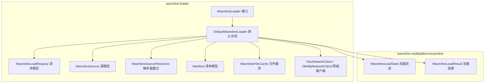
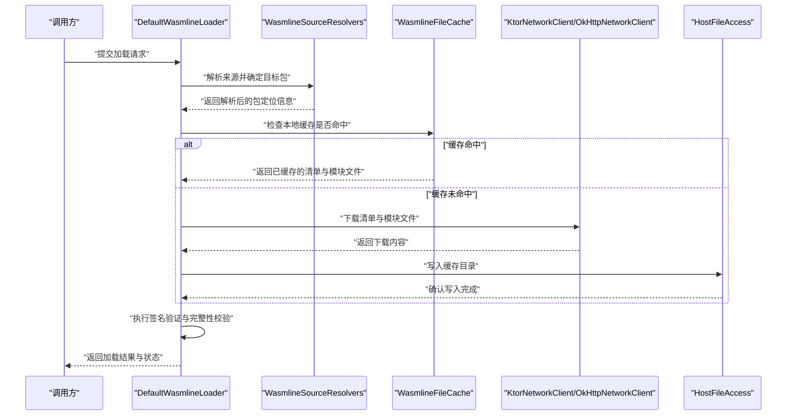
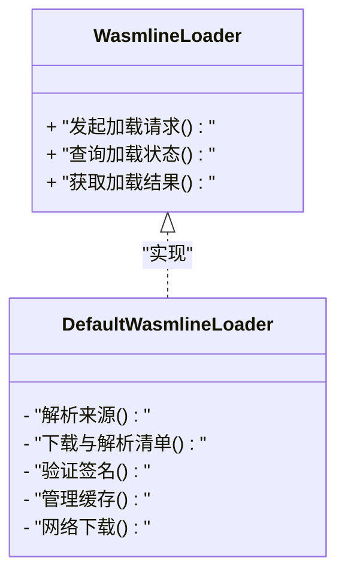
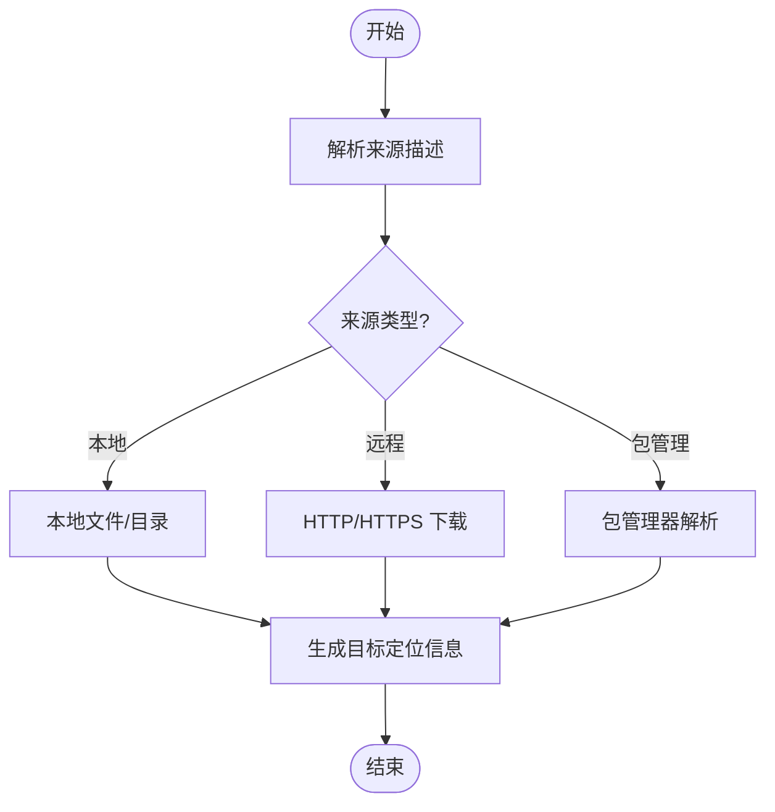
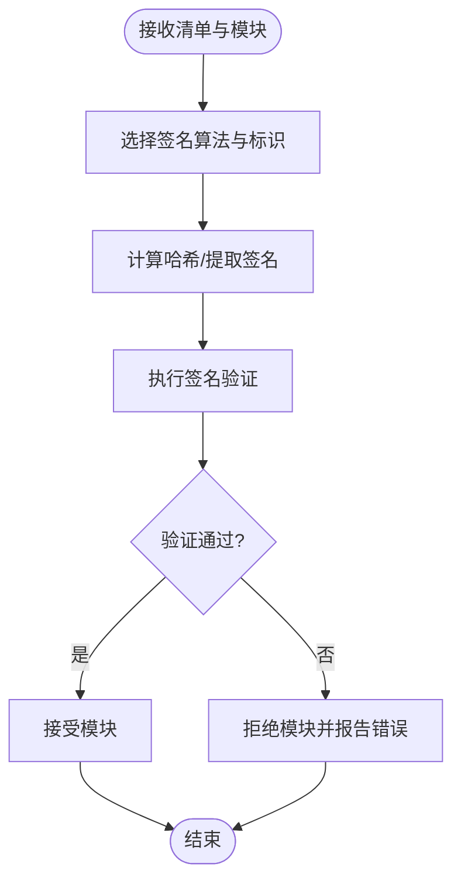
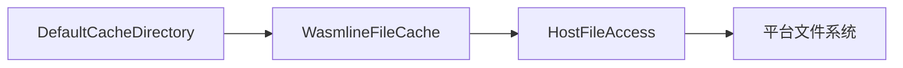
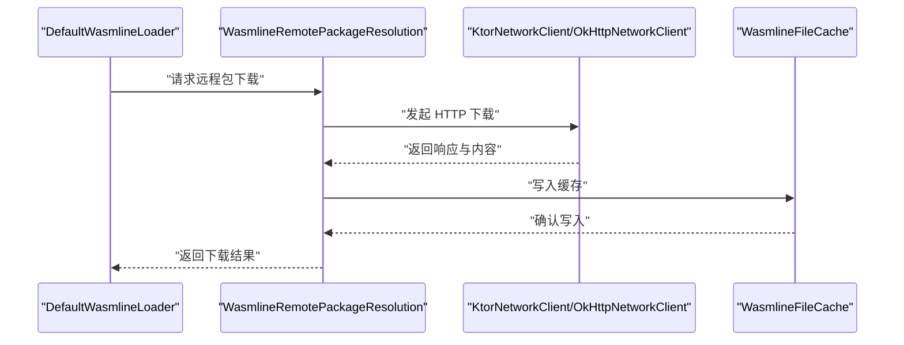
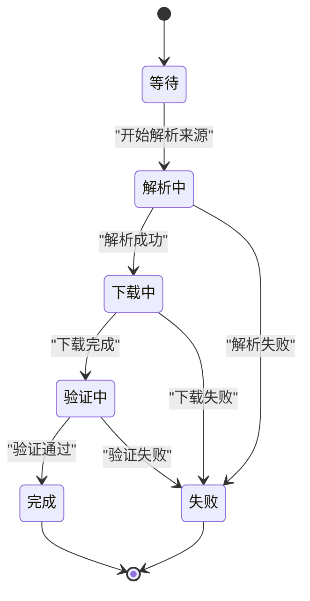
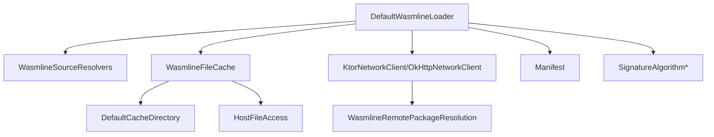

# 加载器 API

<cite>
**本文引用的文件**
- [WasmlineLoader.kt](file://wasmline-multiplatform/wasmline-loader/src/hostMain/kotlin/crow/wasmline/loader/WasmlineLoader.kt)
- [DefaultWasmlineLoader.kt](file://wasmline-multiplatform/wasmline-loader/src/hostMain/kotlin/crow/wasmline/loader/DefaultWasmlineLoader.kt)
- [WasmlineLoadRequest.kt](file://wasmline-multiplatform/wasmline-loader/src/commonMain/kotlin/crow/wasmline/loader/WasmlineLoadRequest.kt)
- [WasmlineSource.kt](file://wasmline-multiplatform/wasmline-loader/src/commonMain/kotlin/crow/wasmline/loader/WasmlineSource.kt)
- [WasmlineSourceResolution.kt](file://wasmline-multiplatform/wasmline-loader/src/commonMain/kotlin/crow/wasmline/loader/WasmlineSourceResolution.kt)
- [WasmlineSourceResolvers.kt](file://wasmline-multiplatform/wasmline-loader/src/commonMain/kotlin/crow/wasmline/loader/WasmlineSourceResolvers.kt)
- [Manifest.kt](file://wasmline-multiplatform/wasmline-loader/src/commonMain/kotlin/crow/wasmline/loader/model/Manifest.kt)
- [WasmlineLoadState.kt](file://wasmline-multiplatform/wasmline/src/hostMain/kotlin/crow/wasmline/WasmlineLoadState.kt)
- [WasmlineLoadResult.kt](file://wasmline-multiplatform/wasmline/src/hostMain/kotlin/crow/wasmline/WasmlineLoadResult.kt)
- [DefaultWasmlineLoaderTest.kt](file://wasmline-multiplatform/wasmline-loader/src/jvmTest/kotlin/crow/wasmline/loader/DefaultWasmlineLoaderTest.kt)
- [WasmlineRemotePackageResolution.kt](file://wasmline-multiplatform/wasmline-loader/src/hostMain/kotlin/crow/wasmline/loader/internal/WasmlineRemotePackageResolution.kt)
- [WasmlineLocalPackageResolution.kt](file://wasmline-multiplatform/wasmline-loader/src/hostMain/kotlin/crow/wasmline/loader/internal/WasmlineLocalPackageResolution.kt)
- [WasmlineFileCache.kt](file://wasmline-multiplatform/wasmline-loader/src/hostMain/kotlin/crow/wasmline/loader/internal/WasmlineFileCache.kt)
- [DefaultCacheDirectory.kt](file://wasmline-multiplatform/wasmline-loader/src/hostMain/kotlin/crow/wasmline/loader/internal/DefaultCacheDirectory.kt)
- [HostFileAccess.kt](file://wasmline-multiplatform/wasmline-loader/src/hostMain/kotlin/crow/wasmline/loader/internal/HostFileAccess.kt)
- [KtorNetworkClient.kt](file://wasmline-multiplatform/wasmline-network-ktor/src/commonMain/kotlin/crow/wasmline/network/ktor/KtorNetworkClient.kt)
- [OkHttpNetworkClient.kt](file://wasmline-multiplatform/wasmline-network-okhttp/src/commonMain/kotlin/crow/wasmline/network/okhttp/OkHttpNetworkClient.kt)
- [Curve25519.kt](file://wasmline-multiplatform/wasmline-loader/src/commonMain/kotlin/crow/wasmline/loader/internal/crypto/Curve25519.kt)
- [Ed25519.kt](file://wasmline-multiplatform/wasmline-loader/src/commonMain/kotlin/crow/wasmline/loader/internal/crypto/Ed25519.kt)
- [SignatureAlgorithm.kt](file://wasmline-multiplatform/wasmline-loader/src/commonMain/kotlin/crow/wasmline/loader/internal/crypto/SignatureAlgorithm.kt)
- [SignatureAlgorithmId.kt](file://wasmline-multiplatform/wasmline-loader/src/commonMain/kotlin/crow/wasmline/loader/internal/crypto/SignatureAlgorithmId.kt)
- [EcdsaP256.kt](file://wasmline-multiplatform/wasmline-loader/src/androidMain/kotlin/crow/wasmline/loader/internal/crypto/EcdsaP256.kt)
- [KeyGenerate.kt](file://wasmline-multiplatform/wasmline-loader/src/jvmMain/kotlin/crow/wasmline/loader/internal/crypto/KeyGenerate.kt)
- [Loader.md](file://wasmline-multiplatform/wasmline-loader/Loader.md)
</cite>

## 目录
1. [简介](#简介)
2. [项目结构](#项目结构)
3. [核心组件](#核心组件)
4. [架构总览](#架构总览)
5. [详细组件分析](#详细组件分析)
6. [依赖关系分析](#依赖关系分析)
7. [性能考虑](#性能考虑)
8. [故障排除指南](#故障排除指南)
9. [结论](#结论)
10. [附录](#附录)

## 简介
本文件为 Wasmline 加载器 API 的权威参考文档，聚焦于 WasmlineLoader 接口与 DefaultWasmlineLoader 实现，系统性阐述模块加载请求、清单解析、签名验证、缓存机制、加载状态与结果数据结构、配置选项与自定义加载器实现指南，并覆盖多平台行为差异、模块来源解析、远程下载与本地缓存实践、错误处理与故障恢复策略。

## 项目结构
加载器相关代码主要分布在以下模块：
- wasmline-loader：加载器接口、默认实现、源解析、清单模型、缓存与网络客户端抽象
- wasmline-network-ktor / wasmline-network-okhttp：网络客户端实现（Ktor 与 OkHttp）
- wasmline-multiplatform/wasmline：运行时 API、加载状态与结果、主机侧扩展

**图表来源**
- [WasmlineLoader.kt](file://wasmline-multiplatform/wasmline-loader/src/hostMain/kotlin/crow/wasmline/loader/WasmlineLoader.kt)
- [DefaultWasmlineLoader.kt](file://wasmline-multiplatform/wasmline-loader/src/hostMain/kotlin/crow/wasmline/loader/DefaultWasmlineLoader.kt)
- [WasmlineLoadRequest.kt](file://wasmline-multiplatform/wasmline-loader/src/commonMain/kotlin/crow/wasmline/loader/WasmlineLoadRequest.kt)
- [WasmlineSource.kt](file://wasmline-multiplatform/wasmline-loader/src/commonMain/kotlin/crow/wasmline/loader/WasmlineSource.kt)
- [WasmlineSourceResolvers.kt](file://wasmline-multiplatform/wasmline-loader/src/commonMain/kotlin/crow/wasmline/loader/WasmlineSourceResolvers.kt)
- [Manifest.kt](file://wasmline-multiplatform/wasmline-loader/src/commonMain/kotlin/crow/wasmline/loader/model/Manifest.kt)
- [WasmlineFileCache.kt](file://wasmline-multiplatform/wasmline-loader/src/hostMain/kotlin/crow/wasmline/loader/internal/WasmlineFileCache.kt)
- [KtorNetworkClient.kt](file://wasmline-multiplatform/wasmline-network-ktor/src/commonMain/kotlin/crow/wasmline/network/ktor/KtorNetworkClient.kt)
- [OkHttpNetworkClient.kt](file://wasmline-multiplatform/wasmline-network-okhttp/src/commonMain/kotlin/crow/wasmline/network/okhttp/OkHttpNetworkClient.kt)
- [WasmlineLoadState.kt](file://wasmline-multiplatform/wasmline/src/hostMain/kotlin/crow/wasmline/WasmlineLoadState.kt)
- [WasmlineLoadResult.kt](file://wasmline-multiplatform/wasmline/src/hostMain/kotlin/crow/wasmline/WasmlineLoadResult.kt)

**章节来源**
- [Loader.md](file://wasmline-multiplatform/wasmline-loader/Loader.md)

## 核心组件
- WasmlineLoader 接口：定义加载器对外能力契约，包括发起加载请求、查询状态、获取结果等。
- DefaultWasmlineLoader 实现：提供默认加载流程，包含源解析、清单下载与解析、签名验证、缓存管理、网络下载与本地存储。
- WasmlineLoadRequest：封装一次加载请求的输入参数（如来源、版本约束、超时、重试策略等）。
- WasmlineSource / WasmlineSourceResolvers：定义模块来源类型与解析策略，支持本地路径、远程 URL、包管理器等。
- Manifest：模块清单数据结构，承载模块元信息、依赖、签名与校验信息。
- WasmlineLoadState / WasmlineLoadResult：加载状态枚举与最终结果数据结构，用于跟踪与汇报加载进度与结果。
- 缓存与网络：WasmlineFileCache、DefaultCacheDirectory、HostFileAccess 提供跨平台缓存目录与文件访问；KtorNetworkClient/OkHttpNetworkClient 提供网络下载能力。
- 签名验证：Curve25519、Ed25519、EcdsaP256、KeyGenerate、SignatureAlgorithm、SignatureAlgorithmId 等算法与标识，保障模块完整性与可信来源。

**章节来源**
- [WasmlineLoader.kt](file://wasmline-multiplatform/wasmline-loader/src/hostMain/kotlin/crow/wasmline/loader/WasmlineLoader.kt)
- [DefaultWasmlineLoader.kt](file://wasmline-multiplatform/wasmline-loader/src/hostMain/kotlin/crow/wasmline/loader/DefaultWasmlineLoader.kt)
- [WasmlineLoadRequest.kt](file://wasmline-multiplatform/wasmline-loader/src/commonMain/kotlin/crow/wasmline/loader/WasmlineLoadRequest.kt)
- [WasmlineSource.kt](file://wasmline-multiplatform/wasmline-loader/src/commonMain/kotlin/crow/wasmline/loader/WasmlineSource.kt)
- [WasmlineSourceResolvers.kt](file://wasmline-multiplatform/wasmline-loader/src/commonMain/kotlin/crow/wasmline/loader/WasmlineSourceResolvers.kt)
- [Manifest.kt](file://wasmline-multiplatform/wasmline-loader/src/commonMain/kotlin/crow/wasmline/loader/model/Manifest.kt)
- [WasmlineLoadState.kt](file://wasmline-multiplatform/wasmline/src/hostMain/kotlin/crow/wasmline/WasmlineLoadState.kt)
- [WasmlineLoadResult.kt](file://wasmline-multiplatform/wasmline/src/hostMain/kotlin/crow/wasmline/WasmlineLoadResult.kt)
- [WasmlineFileCache.kt](file://wasmline-multiplatform/wasmline-loader/src/hostMain/kotlin/crow/wasmline/loader/internal/WasmlineFileCache.kt)
- [DefaultCacheDirectory.kt](file://wasmline-multiplatform/wasmline-loader/src/hostMain/kotlin/crow/wasmline/loader/internal/DefaultCacheDirectory.kt)
- [HostFileAccess.kt](file://wasmline-multiplatform/wasmline-loader/src/hostMain/kotlin/crow/wasmline/loader/internal/HostFileAccess.kt)
- [KtorNetworkClient.kt](file://wasmline-multiplatform/wasmline-network-ktor/src/commonMain/kotlin/crow/wasmline/network/ktor/KtorNetworkClient.kt)
- [OkHttpNetworkClient.kt](file://wasmline-multiplatform/wasmline-network-okhttp/src/commonMain/kotlin/crow/wasmline/network/okhttp/OkHttpNetworkClient.kt)
- [Curve25519.kt](file://wasmline-multiplatform/wasmline-loader/src/commonMain/kotlin/crow/wasmline/loader/internal/crypto/Curve25519.kt)
- [Ed25519.kt](file://wasmline-multiplatform/wasmline-loader/src/commonMain/kotlin/crow/wasmline/loader/internal/crypto/Ed25519.kt)
- [SignatureAlgorithm.kt](file://wasmline-multiplatform/wasmline-loader/src/commonMain/kotlin/crow/wasmline/loader/internal/crypto/SignatureAlgorithm.kt)
- [SignatureAlgorithmId.kt](file://wasmline-multiplatform/wasmline-loader/src/commonMain/kotlin/crow/wasmline/loader/internal/crypto/SignatureAlgorithmId.kt)
- [EcdsaP256.kt](file://wasmline-multiplatform/wasmline-loader/src/androidMain/kotlin/crow/wasmline/loader/internal/crypto/EcdsaP256.kt)
- [KeyGenerate.kt](file://wasmline-multiplatform/wasmline-loader/src/jvmMain/kotlin/crow/wasmline/loader/internal/crypto/KeyGenerate.kt)

## 架构总览
下图展示加载器从请求到完成的整体流程，涵盖源解析、清单下载与解析、签名验证、缓存命中与更新、网络下载以及结果返回。

**图表来源**
- [DefaultWasmlineLoader.kt](file://wasmline-multiplatform/wasmline-loader/src/hostMain/kotlin/crow/wasmline/loader/DefaultWasmlineLoader.kt)
- [WasmlineSourceResolvers.kt](file://wasmline-multiplatform/wasmline-loader/src/commonMain/kotlin/crow/wasmline/loader/WasmlineSourceResolvers.kt)
- [WasmlineFileCache.kt](file://wasmline-multiplatform/wasmline-loader/src/hostMain/kotlin/crow/wasmline/loader/internal/WasmlineFileCache.kt)
- [KtorNetworkClient.kt](file://wasmline-multiplatform/wasmline-network-ktor/src/commonMain/kotlin/crow/wasmline/network/ktor/KtorNetworkClient.kt)
- [OkHttpNetworkClient.kt](file://wasmline-multiplatform/wasmline-network-okhttp/src/commonMain/kotlin/crow/wasmline/network/okhttp/OkHttpNetworkClient.kt)
- [HostFileAccess.kt](file://wasmline-multiplatform/wasmline-loader/src/hostMain/kotlin/crow/wasmline/loader/internal/HostFileAccess.kt)

## 详细组件分析

### WasmlineLoader 接口与 DefaultWasmlineLoader 实现
- WasmlineLoader 定义了加载器的核心契约，包括发起异步加载、查询当前状态、获取最终结果等方法。
- DefaultWasmlineLoader 是接口的默认实现，负责编排整个加载流程：解析来源、下载与解析清单、验证签名、管理缓存、进行网络下载与本地持久化，并通过状态与结果对象向调用方反馈进度与最终结果。

**图表来源**
- [WasmlineLoader.kt](file://wasmline-multiplatform/wasmline-loader/src/hostMain/kotlin/crow/wasmline/loader/WasmlineLoader.kt)
- [DefaultWasmlineLoader.kt](file://wasmline-multiplatform/wasmline-loader/src/hostMain/kotlin/crow/wasmline/loader/DefaultWasmlineLoader.kt)

**章节来源**
- [WasmlineLoader.kt](file://wasmline-multiplatform/wasmline-loader/src/hostMain/kotlin/crow/wasmline/loader/WasmlineLoader.kt)
- [DefaultWasmlineLoader.kt](file://wasmline-multiplatform/wasmline-loader/src/hostMain/kotlin/crow/wasmline/loader/DefaultWasmlineLoader.kt)

### 加载请求与来源解析
- WasmlineLoadRequest：封装加载请求参数，如来源、版本约束、超时、重试策略、是否允许离线等。
- WasmlineSource：定义模块来源类型（例如本地路径、远程 URL、包标识符等），作为统一抽象。
- WasmlineSourceResolvers：提供多种来源解析策略，将高层来源描述映射为具体可下载或可读取的目标包定位信息。

**图表来源**
- [WasmlineLoadRequest.kt](file://wasmline-multiplatform/wasmline-loader/src/commonMain/kotlin/crow/wasmline/loader/WasmlineLoadRequest.kt)
- [WasmlineSource.kt](file://wasmline-multiplatform/wasmline-loader/src/commonMain/kotlin/crow/wasmline/loader/WasmlineSource.kt)
- [WasmlineSourceResolvers.kt](file://wasmline-multiplatform/wasmline-loader/src/commonMain/kotlin/crow/wasmline/loader/WasmlineSourceResolvers.kt)

**章节来源**
- [WasmlineLoadRequest.kt](file://wasmline-multiplatform/wasmline-loader/src/commonMain/kotlin/crow/wasmline/loader/WasmlineLoadRequest.kt)
- [WasmlineSource.kt](file://wasmline-multiplatform/wasmline-loader/src/commonMain/kotlin/crow/wasmline/loader/WasmlineSource.kt)
- [WasmlineSourceResolvers.kt](file://wasmline-multiplatform/wasmline-loader/src/commonMain/kotlin/crow/wasmline/loader/WasmlineSourceResolvers.kt)

### 清单解析与签名验证
- Manifest：模块清单数据结构，包含模块元信息、依赖列表、签名与校验字段等。
- 签名验证：基于多种算法（Ed25519、Curve25519、EcdsaP256 等）与算法标识（SignatureAlgorithmId）对清单与模块进行完整性与来源可信性校验。
- KeyGenerate（JVM 平台）：在 JVM 上生成密钥对以支持签名与验证流程。

**图表来源**
- [Manifest.kt](file://wasmline-multiplatform/wasmline-loader/src/commonMain/kotlin/crow/wasmline/loader/model/Manifest.kt)
- [Ed25519.kt](file://wasmline-multiplatform/wasmline-loader/src/commonMain/kotlin/crow/wasmline/loader/internal/crypto/Ed25519.kt)
- [Curve25519.kt](file://wasmline-multiplatform/wasmline-loader/src/commonMain/kotlin/crow/wasmline/loader/internal/crypto/Curve25519.kt)
- [EcdsaP256.kt](file://wasmline-multiplatform/wasmline-loader/src/androidMain/kotlin/crow/wasmline/loader/internal/crypto/EcdsaP256.kt)
- [SignatureAlgorithm.kt](file://wasmline-multiplatform/wasmline-loader/src/commonMain/kotlin/crow/wasmline/loader/internal/crypto/SignatureAlgorithm.kt)
- [SignatureAlgorithmId.kt](file://wasmline-multiplatform/wasmline-loader/src/commonMain/kotlin/crow/wasmline/loader/internal/crypto/SignatureAlgorithmId.kt)
- [KeyGenerate.kt](file://wasmline-multiplatform/wasmline-loader/src/jvmMain/kotlin/crow/wasmline/loader/internal/crypto/KeyGenerate.kt)

**章节来源**
- [Manifest.kt](file://wasmline-multiplatform/wasmline-loader/src/commonMain/kotlin/crow/wasmline/loader/model/Manifest.kt)
- [Ed25519.kt](file://wasmline-multiplatform/wasmline-loader/src/commonMain/kotlin/crow/wasmline/loader/internal/crypto/Ed25519.kt)
- [Curve25519.kt](file://wasmline-multiplatform/wasmline-loader/src/commonMain/kotlin/crow/wasmline/loader/internal/crypto/Curve25519.kt)
- [EcdsaP256.kt](file://wasmline-multiplatform/wasmline-loader/src/androidMain/kotlin/crow/wasmline/loader/internal/crypto/EcdsaP256.kt)
- [SignatureAlgorithm.kt](file://wasmline-multiplatform/wasmline-loader/src/commonMain/kotlin/crow/wasmline/loader/internal/crypto/SignatureAlgorithm.kt)
- [SignatureAlgorithmId.kt](file://wasmline-multiplatform/wasmline-loader/src/commonMain/kotlin/crow/wasmline/loader/internal/crypto/SignatureAlgorithmId.kt)
- [KeyGenerate.kt](file://wasmline-multiplatform/wasmline-loader/src/jvmMain/kotlin/crow/wasmline/loader/internal/crypto/KeyGenerate.kt)

### 缓存机制与文件访问
- WasmlineFileCache：统一的文件缓存抽象，负责缓存清单与模块文件，支持跨平台一致的缓存策略。
- DefaultCacheDirectory：为不同平台（Android、iOS、JS、JVM、Web、Wasm 等）提供默认缓存目录策略。
- HostFileAccess：主机侧文件访问抽象，屏蔽平台差异，提供读写、删除、存在性检查等操作。

**图表来源**
- [DefaultCacheDirectory.kt](file://wasmline-multiplatform/wasmline-loader/src/hostMain/kotlin/crow/wasmline/loader/internal/DefaultCacheDirectory.kt)
- [WasmlineFileCache.kt](file://wasmline-multiplatform/wasmline-loader/src/hostMain/kotlin/crow/wasmline/loader/internal/WasmlineFileCache.kt)
- [HostFileAccess.kt](file://wasmline-multiplatform/wasmline-loader/src/hostMain/kotlin/crow/wasmline/loader/internal/HostFileAccess.kt)

**章节来源**
- [DefaultCacheDirectory.kt](file://wasmline-multiplatform/wasmline-loader/src/hostMain/kotlin/crow/wasmline/loader/internal/DefaultCacheDirectory.kt)
- [WasmlineFileCache.kt](file://wasmline-multiplatform/wasmline-loader/src/hostMain/kotlin/crow/wasmline/loader/internal/WasmlineFileCache.kt)
- [HostFileAccess.kt](file://wasmline-multiplatform/wasmline-loader/src/hostMain/kotlin/crow/wasmline/loader/internal/HostFileAccess.kt)

### 网络客户端与远程下载
- KtorNetworkClient：基于 Ktor 的网络客户端实现，提供异步下载、超时控制、重试策略等。
- OkHttpNetworkClient：基于 OkHttp 的网络客户端实现，适配 JVM/Android 等平台。
- WasmlineRemotePackageResolution：远程包解析与下载逻辑，结合网络客户端完成清单与模块的远程获取。

**图表来源**
- [WasmlineRemotePackageResolution.kt](file://wasmline-multiplatform/wasmline-loader/src/hostMain/kotlin/crow/wasmline/loader/internal/WasmlineRemotePackageResolution.kt)
- [KtorNetworkClient.kt](file://wasmline-multiplatform/wasmline-network-ktor/src/commonMain/kotlin/crow/wasmline/network/ktor/KtorNetworkClient.kt)
- [OkHttpNetworkClient.kt](file://wasmline-multiplatform/wasmline-network-okhttp/src/commonMain/kotlin/crow/wasmline/network/okhttp/OkHttpNetworkClient.kt)
- [WasmlineFileCache.kt](file://wasmline-multiplatform/wasmline-loader/src/hostMain/kotlin/crow/wasmline/loader/internal/WasmlineFileCache.kt)

**章节来源**
- [WasmlineRemotePackageResolution.kt](file://wasmline-multiplatform/wasmline-loader/src/hostMain/kotlin/crow/wasmline/loader/internal/WasmlineRemotePackageResolution.kt)
- [KtorNetworkClient.kt](file://wasmline-multiplatform/wasmline-network-ktor/src/commonMain/kotlin/crow/wasmline/network/ktor/KtorNetworkClient.kt)
- [OkHttpNetworkClient.kt](file://wasmline-multiplatform/wasmline-network-okhttp/src/commonMain/kotlin/crow/wasmline/network/okhttp/OkHttpNetworkClient.kt)
- [WasmlineFileCache.kt](file://wasmline-multiplatform/wasmline-loader/src/hostMain/kotlin/crow/wasmline/loader/internal/WasmlineFileCache.kt)

### 加载状态与结果数据结构
- WasmlineLoadState：加载过程中的状态枚举，如等待、解析中、下载中、验证中、完成、失败等。
- WasmlineLoadResult：加载完成后返回的结果数据结构，包含成功/失败标志、错误信息、模块句柄或错误详情等。

**图表来源**
- [WasmlineLoadState.kt](file://wasmline-multiplatform/wasmline/src/hostMain/kotlin/crow/wasmline/WasmlineLoadState.kt)
- [WasmlineLoadResult.kt](file://wasmline-multiplatform/wasmline/src/hostMain/kotlin/crow/wasmline/WasmlineLoadResult.kt)

**章节来源**
- [WasmlineLoadState.kt](file://wasmline-multiplatform/wasmline/src/hostMain/kotlin/crow/wasmline/WasmlineLoadState.kt)
- [WasmlineLoadResult.kt](file://wasmline-multiplatform/wasmline/src/hostMain/kotlin/crow/wasmline/WasmlineLoadResult.kt)

### 配置选项与自定义加载器实现指南
- 配置项建议：
  - 超时与重试：设置网络下载超时与最大重试次数。
  - 缓存策略：启用/禁用缓存、缓存清理策略、缓存目录位置。
  - 签名策略：允许的签名算法、信任根/白名单公钥、严格模式开关。
  - 来源白名单：限制允许的来源类型与域名/IP。
- 自定义加载器实现步骤：
  1) 实现 WasmlineLoader 接口，定义加载生命周期钩子。
  2) 自定义 WasmlineSourceResolvers，支持新的来源类型。
  3) 替换网络客户端为自定义实现（如基于特定协议或代理）。
  4) 自定义缓存策略，实现 WasmlineFileCache 的替代方案。
  5) 扩展签名验证逻辑，支持新的算法或信任模型。
  6) 在多平台适配层提供平台特定的 DefaultCacheDirectory 与 HostFileAccess 实现。

**章节来源**
- [WasmlineLoader.kt](file://wasmline-multiplatform/wasmline-loader/src/hostMain/kotlin/crow/wasmline/loader/WasmlineLoader.kt)
- [WasmlineSourceResolvers.kt](file://wasmline-multiplatform/wasmline-loader/src/commonMain/kotlin/crow/wasmline/loader/WasmlineSourceResolvers.kt)
- [DefaultCacheDirectory.kt](file://wasmline-multiplatform/wasmline-loader/src/hostMain/kotlin/crow/wasmline/loader/internal/DefaultCacheDirectory.kt)
- [HostFileAccess.kt](file://wasmline-multiplatform/wasmline-loader/src/hostMain/kotlin/crow/wasmline/loader/internal/HostFileAccess.kt)
- [KtorNetworkClient.kt](file://wasmline-multiplatform/wasmline-network-ktor/src/commonMain/kotlin/crow/wasmline/network/ktor/KtorNetworkClient.kt)
- [OkHttpNetworkClient.kt](file://wasmline-multiplatform/wasmline-network-okhttp/src/commonMain/kotlin/crow/wasmline/network/okhttp/OkHttpNetworkClient.kt)

### 不同平台下的加载器行为差异
- Android：使用 Android 特定的缓存目录与文件访问，签名算法支持 EcdsaP256。
- iOS：使用 iOS 特定的缓存目录与文件访问，桥接原生加载能力。
- JS/JVM/Web/Wasm：使用通用的 Ktor 或 OkHttp 客户端，缓存目录由 DefaultCacheDirectory 提供平台默认值。
- 关键差异点：缓存目录策略、文件系统访问权限、可用的加密算法与密钥生成方式。

**章节来源**
- [DefaultCacheDirectory.kt](file://wasmline-multiplatform/wasmline-loader/src/hostMain/kotlin/crow/wasmline/loader/internal/DefaultCacheDirectory.kt)
- [HostFileAccess.kt](file://wasmline-multiplatform/wasmline-loader/src/hostMain/kotlin/crow/wasmline/loader/internal/HostFileAccess.kt)
- [EcdsaP256.kt](file://wasmline-multiplatform/wasmline-loader/src/androidMain/kotlin/crow/wasmline/loader/internal/crypto/EcdsaP256.kt)

### 典型使用场景与示例
- 模块来源解析：将用户提供的来源描述（如包名、URL、本地路径）解析为可下载/可读取的目标定位信息。
- 远程下载：当缓存未命中时，通过网络客户端下载清单与模块文件，并写入缓存。
- 本地缓存：优先使用本地缓存，减少网络开销与提升启动速度。
- 示例参考（路径）：
  - [DefaultWasmlineLoaderTest.kt](file://wasmline-multiplatform/wasmline-loader/src/jvmTest/kotlin/crow/wasmline/loader/DefaultWasmlineLoaderTest.kt)

**章节来源**
- [DefaultWasmlineLoaderTest.kt](file://wasmline-multiplatform/wasmline-loader/src/jvmTest/kotlin/crow/wasmline/loader/DefaultWasmlineLoaderTest.kt)

## 依赖关系分析
加载器各组件之间的依赖关系如下：

**图表来源**
- [DefaultWasmlineLoader.kt](file://wasmline-multiplatform/wasmline-loader/src/hostMain/kotlin/crow/wasmline/loader/DefaultWasmlineLoader.kt)
- [WasmlineSourceResolvers.kt](file://wasmline-multiplatform/wasmline-loader/src/commonMain/kotlin/crow/wasmline/loader/WasmlineSourceResolvers.kt)
- [WasmlineFileCache.kt](file://wasmline-multiplatform/wasmline-loader/src/hostMain/kotlin/crow/wasmline/loader/internal/WasmlineFileCache.kt)
- [DefaultCacheDirectory.kt](file://wasmline-multiplatform/wasmline-loader/src/hostMain/kotlin/crow/wasmline/loader/internal/DefaultCacheDirectory.kt)
- [HostFileAccess.kt](file://wasmline-multiplatform/wasmline-loader/src/hostMain/kotlin/crow/wasmline/loader/internal/HostFileAccess.kt)
- [KtorNetworkClient.kt](file://wasmline-multiplatform/wasmline-network-ktor/src/commonMain/kotlin/crow/wasmline/network/ktor/KtorNetworkClient.kt)
- [OkHttpNetworkClient.kt](file://wasmline-multiplatform/wasmline-network-okhttp/src/commonMain/kotlin/crow/wasmline/network/okhttp/OkHttpNetworkClient.kt)
- [WasmlineRemotePackageResolution.kt](file://wasmline-multiplatform/wasmline-loader/src/hostMain/kotlin/crow/wasmline/loader/internal/WasmlineRemotePackageResolution.kt)
- [Manifest.kt](file://wasmline-multiplatform/wasmline-loader/src/commonMain/kotlin/crow/wasmline/loader/model/Manifest.kt)
- [SignatureAlgorithm.kt](file://wasmline-multiplatform/wasmline-loader/src/commonMain/kotlin/crow/wasmline/loader/internal/crypto/SignatureAlgorithm.kt)

**章节来源**
- [DefaultWasmlineLoader.kt](file://wasmline-multiplatform/wasmline-loader/src/hostMain/kotlin/crow/wasmline/loader/DefaultWasmlineLoader.kt)
- [WasmlineSourceResolvers.kt](file://wasmline-multiplatform/wasmline-loader/src/commonMain/kotlin/crow/wasmline/loader/WasmlineSourceResolvers.kt)
- [WasmlineFileCache.kt](file://wasmline-multiplatform/wasmline-loader/src/hostMain/kotlin/crow/wasmline/loader/internal/WasmlineFileCache.kt)
- [DefaultCacheDirectory.kt](file://wasmline-multiplatform/wasmline-loader/src/hostMain/kotlin/crow/wasmline/loader/internal/DefaultCacheDirectory.kt)
- [HostFileAccess.kt](file://wasmline-multiplatform/wasmline-loader/src/hostMain/kotlin/crow/wasmline/loader/internal/HostFileAccess.kt)
- [KtorNetworkClient.kt](file://wasmline-multiplatform/wasmline-network-ktor/src/commonMain/kotlin/crow/wasmline/network/ktor/KtorNetworkClient.kt)
- [OkHttpNetworkClient.kt](file://wasmline-multiplatform/wasmline-network-okhttp/src/commonMain/kotlin/crow/wasmline/network/okhttp/OkHttpNetworkClient.kt)
- [WasmlineRemotePackageResolution.kt](file://wasmline-multiplatform/wasmline-loader/src/hostMain/kotlin/crow/wasmline/loader/internal/WasmlineRemotePackageResolution.kt)
- [Manifest.kt](file://wasmline-multiplatform/wasmline-loader/src/commonMain/kotlin/crow/wasmline/loader/model/Manifest.kt)
- [SignatureAlgorithm.kt](file://wasmline-multiplatform/wasmline-loader/src/commonMain/kotlin/crow/wasmline/loader/internal/crypto/SignatureAlgorithm.kt)

## 性能考虑
- 缓存优先：优先使用本地缓存，避免重复网络下载；合理设置缓存过期策略与清理机制。
- 并发与重试：在网络客户端层面配置合理的并发数与指数退避重试，降低弱网环境下的失败率。
- 增量验证：仅在清单或模块变更时重新验证签名，避免重复计算。
- 跨平台优化：在不同平台选择最优的网络库与文件系统访问方式，减少上下文切换成本。

## 故障排除指南
- 常见错误与恢复：
  - 来源解析失败：检查来源类型与格式，确认解析器支持该类型。
  - 下载失败：检查网络连通性、代理设置与证书链；启用重试与降级策略。
  - 验证失败：检查签名算法与公钥配置，确认清单未被篡改。
  - 缓存异常：清理缓存目录或调整缓存策略，确保磁盘空间充足。
- 测试与调试：
  - 参考测试用例路径以复现问题与验证修复：[DefaultWasmlineLoaderTest.kt](file://wasmline-multiplatform/wasmline-loader/src/jvmTest/kotlin/crow/wasmline/loader/DefaultWasmlineLoaderTest.kt)

**章节来源**
- [DefaultWasmlineLoaderTest.kt](file://wasmline-multiplatform/wasmline-loader/src/jvmTest/kotlin/crow/wasmline/loader/DefaultWasmlineLoaderTest.kt)

## 结论
Wasmline 加载器 API 通过清晰的接口设计与默认实现，提供了从来源解析、清单下载与解析、签名验证到缓存与网络下载的完整加载链路。借助多平台适配与可插拔的网络与缓存实现，开发者可以灵活定制加载策略，满足不同场景下的性能与安全需求。

## 附录
- 更多加载器说明与使用指导请参阅：[Loader.md](file://wasmline-multiplatform/wasmline-loader/Loader.md)