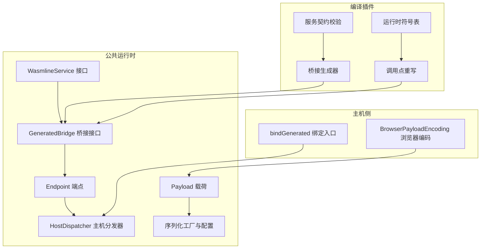
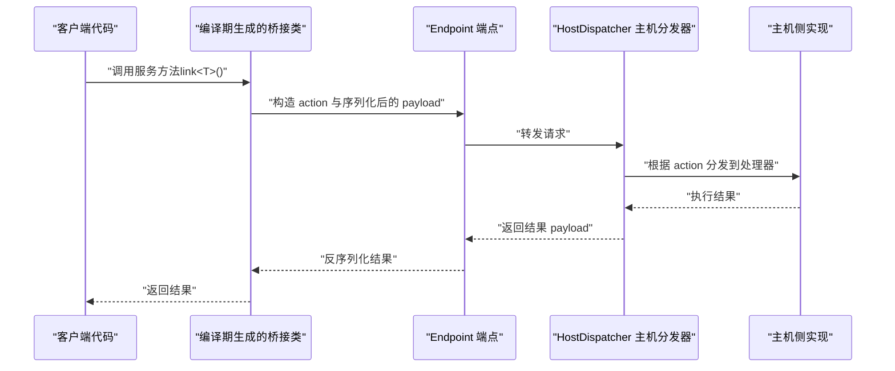
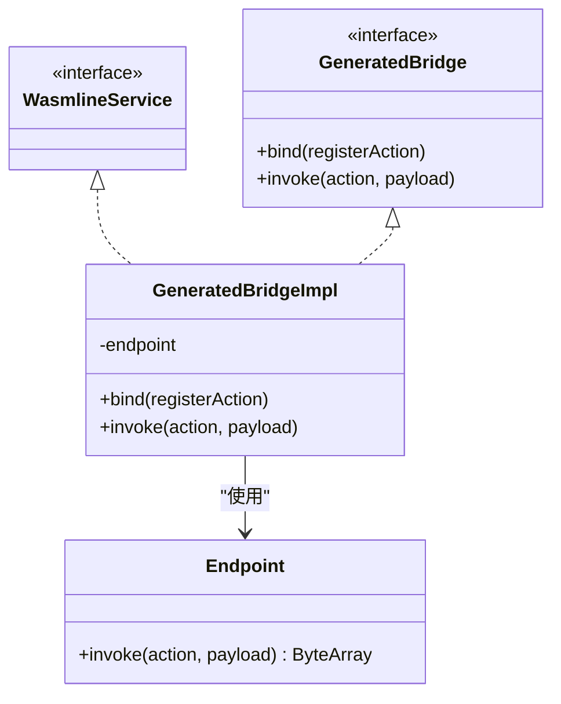
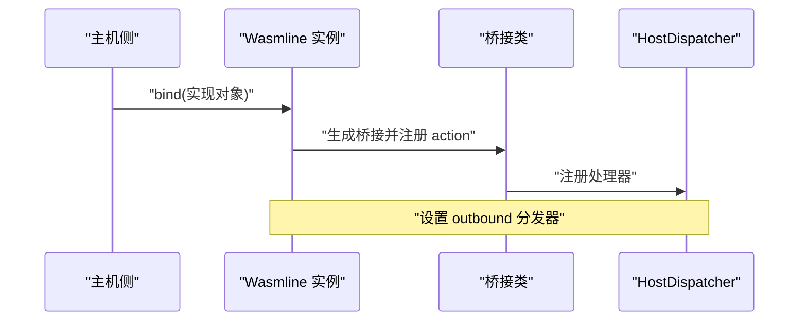
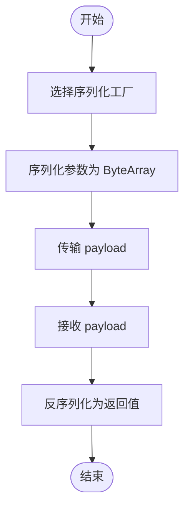
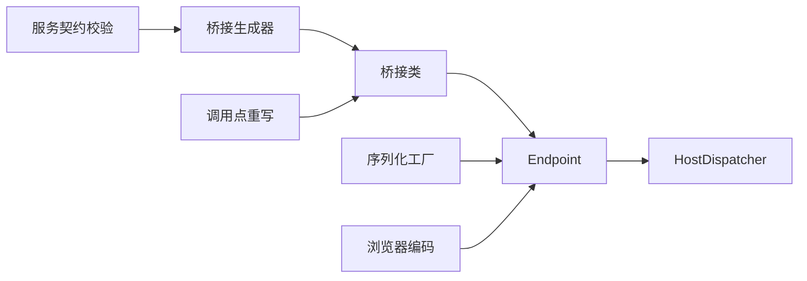

# 服务 API

<cite>
**本文引用的文件**
- [WasmlineService.kt](file://wasmline-multiplatform/wasmline/src/commonMain/kotlin/crow/wasmline/WasmlineService.kt)
- [WasmlineServices.host.kt](file://wasmline-multiplatform/wasmline/src/hostMain/kotlin/crow/wasmline/WasmlineServices.host.kt)
- [Payload.kt](file://wasmline-multiplatform/wasmline/src/commonMain/kotlin/crow/wasmline/internal/bridge/Payload.kt)
- [GeneratedBridge.kt](file://wasmline-multiplatform/wasmline/src/commonMain/kotlin/crow/wasmline/internal/bridge/GeneratedBridge.kt)
- [Endpoint.kt](file://wasmline-multiplatform/wasmline/src/commonMain/kotlin/crow/wasmline/internal/bridge/Endpoint.kt)
- [HostDispatcher.kt](file://wasmline-multiplatform/wasmline/src/commonMain/kotlin/crow/wasmline/internal/bridge/HostDispatcher.kt)
- [BrowserPayloadEncoding.kt](file://wasmline-multiplatform/wasmline/src/hostMain/kotlin/crow/wasmline/BrowserPayloadEncoding.kt)
- [WasmlineSerializationConfig.kt](file://wasmline-multiplatform/wasmline/src/commonMain/kotlin/crow/wasmline/serialization/WasmlineSerializationConfig.kt)
- [WasmlineSerializationFactory.kt](file://wasmline-multiplatform/wasmline/src/commonMain/kotlin/crow/wasmline/serialization/WasmlineSerializationFactory.kt)
- [WasmlineSerializationRegistry.kt](file://wasmline-multiplatform/wasmline/src/commonMain/kotlin/crow/wasmline/serialization/WasmlineSerializationRegistry.kt)
- [WasmlineBridgeGenerator.kt](file://wasmline-multiplatform/wasmline-kotlin-plugin/src/main/kotlin/crow/wasmline/kotlin/WasmlineBridgeGenerator.kt)
- [WasmlineServiceContractValidator.kt](file://wasmline-multiplatform/wasmline-kotlin-plugin/src/main/kotlin/crow/wasmline/kotlin/WasmlineServiceContractValidator.kt)
- [WasmlineTypedEntryPointRewriter.kt](file://wasmline-multiplatform/wasmline-kotlin-plugin/src/main/kotlin/crow/wasmline/kotlin/WasmlineTypedEntryPointRewriter.kt)
- [WasmlineRuntimeSymbols.kt](file://wasmline-multiplatform/wasmline-kotlin-plugin/src/main/kotlin/crow/wasmline/kotlin/WasmlineRuntimeSymbols.kt)
- [WasmLoader.kt](file://wasmline-samples/kotlin/sample-apps/multiplatform/shared/src/commonMain/kotlin/crow/wasmline/sample/WasmLoader.kt)
- [mind.md（GitHub 文档）](file://wasmline/.github/docs/mind.md)
- [mind.md（项目文档）](file://wasmline-multiplatform/mind.md)
</cite>

## 目录
1. [引言](#引言)
2. [项目结构](#项目结构)
3. [核心组件](#核心组件)
4. [架构总览](#架构总览)
5. [详细组件分析](#详细组件分析)
6. [依赖关系分析](#依赖关系分析)
7. [性能考量](#性能考量)
8. [故障排查指南](#故障排查指南)
9. [结论](#结论)
10. [附录](#附录)

## 引言
本文件为 Wasmline 服务 API 的完整参考文档，聚焦以下主题：
- WasmlineService 接口与服务契约的定义与约束
- link<T>() 与 bind() 的使用方法与编译期重写机制
- 桥接生成机制与类型安全保证
- 服务调用的完整流程：序列化、传输、反序列化
- Payload 数据结构与编码格式
- 服务注册、发现与调用示例
- 生命周期管理与错误处理
- 多平台环境下的使用差异

## 项目结构
Wasmline 的服务 API 分布在多平台模块与 Kotlin 编译插件中：
- 运行时与桥接层：commonMain 中的 internal/bridge 与 serialization 子包
- 主机侧扩展：hostMain 中的绑定与序列化工厂解析
- 编译插件：负责服务契约校验、桥接类生成与调用点重写
- 示例与文档：samples 与 mind.md 提供使用范式与生命周期说明

**图表来源**
- [WasmlineService.kt:1-24](file://wasmline-multiplatform/wasmline/src/commonMain/kotlin/crow/wasmline/WasmlineService.kt#L1-L24)
- [GeneratedBridge.kt](file://wasmline-multiplatform/wasmline/src/commonMain/kotlin/crow/wasmline/internal/bridge/GeneratedBridge.kt)
- [Endpoint.kt](file://wasmline-multiplatform/wasmline/src/commonMain/kotlin/crow/wasmline/internal/bridge/Endpoint.kt)
- [HostDispatcher.kt](file://wasmline-multiplatform/wasmline/src/commonMain/kotlin/crow/wasmline/internal/bridge/HostDispatcher.kt)
- [Payload.kt](file://wasmline-multiplatform/wasmline/src/commonMain/kotlin/crow/wasmline/internal/bridge/Payload.kt)
- [WasmlineSerializationConfig.kt:1-39](file://wasmline-multiplatform/wasmline/src/commonMain/kotlin/crow/wasmline/serialization/WasmlineSerializationConfig.kt#L1-L39)
- [WasmlineSerializationFactory.kt:32-66](file://wasmline-multiplatform/wasmline/src/commonMain/kotlin/crow/wasmline/serialization/WasmlineSerializationFactory.kt#L32-L66)
- [WasmlineServices.host.kt:26-38](file://wasmline-multiplatform/wasmline/src/hostMain/kotlin/crow/wasmline/WasmlineServices.host.kt#L26-L38)
- [BrowserPayloadEncoding.kt:1-14](file://wasmline-multiplatform/wasmline/src/hostMain/kotlin/crow/wasmline/BrowserPayloadEncoding.kt#L1-L14)
- [WasmlineBridgeGenerator.kt:52-80](file://wasmline-multiplatform/wasmline-kotlin-plugin/src/main/kotlin/crow/wasmline/kotlin/WasmlineBridgeGenerator.kt#L52-L80)
- [WasmlineServiceContractValidator.kt:160-186](file://wasmline-multiplatform/wasmline-kotlin-plugin/src/main/kotlin/crow/wasmline/kotlin/WasmlineServiceContractValidator.kt#L160-L186)
- [WasmlineTypedEntryPointRewriter.kt:158-198](file://wasmline-multiplatform/wasmline-kotlin-plugin/src/main/kotlin/crow/wasmline/kotlin/WasmlineTypedEntryPointRewriter.kt#L158-L198)
- [WasmlineRuntimeSymbols.kt:109-228](file://wasmline-multiplatform/wasmline-kotlin-plugin/src/main/kotlin/crow/wasmline/kotlin/WasmlineRuntimeSymbols.kt#L109-L228)

**章节来源**
- [mind.md（项目文档）:210-260](file://wasmline-multiplatform/mind.md#L210-L260)

## 核心组件
- WasmlineService：服务契约标记接口，定义了受支持的函数签名与限制（如不支持重载、属性、泛型等），由编译插件进行严格校验。
- GeneratedBridge：编译期生成的桥接类实现，承载 link() 与 bind() 的具体行为，并通过 Endpoint 与 HostDispatcher 完成跨边界调用。
- Endpoint：抽象的跨边界调用端点，负责将 action 与 payload 发送到目标环境。
- HostDispatcher：主机侧的请求分发器，将收到的 action 映射到已绑定的处理器。
- Payload：服务调用的二进制载荷，承载序列化后的参数与返回值。
- 序列化子系统：WasmlineSerializationConfig、WasmlineSerializationFactory、WasmlineSerializationRegistry，支持内置工厂（raw、protobuf）与自定义工厂注册。

**章节来源**
- [WasmlineService.kt:1-24](file://wasmline-multiplatform/wasmline/src/commonMain/kotlin/crow/wasmline/WasmlineService.kt#L1-L24)
- [GeneratedBridge.kt](file://wasmline-multiplatform/wasmline/src/commonMain/kotlin/crow/wasmline/internal/bridge/GeneratedBridge.kt)
- [Endpoint.kt](file://wasmline-multiplatform/wasmline/src/commonMain/kotlin/crow/wasmline/internal/bridge/Endpoint.kt)
- [HostDispatcher.kt](file://wasmline-multiplatform/wasmline/src/commonMain/kotlin/crow/wasmline/internal/bridge/HostDispatcher.kt)
- [Payload.kt](file://wasmline-multiplatform/wasmline/src/commonMain/kotlin/crow/wasmline/internal/bridge/Payload.kt)
- [WasmlineSerializationConfig.kt:1-39](file://wasmline-multiplatform/wasmline/src/commonMain/kotlin/crow/wasmline/serialization/WasmlineSerializationConfig.kt#L1-L39)
- [WasmlineSerializationFactory.kt:32-66](file://wasmline-multiplatform/wasmline/src/commonMain/kotlin/crow/wasmline/serialization/WasmlineSerializationFactory.kt#L32-L66)
- [WasmlineSerializationRegistry.kt:1-20](file://wasmline-multiplatform/wasmline/src/commonMain/kotlin/crow/wasmline/serialization/WasmlineSerializationRegistry.kt#L1-L20)

## 架构总览
下图展示了服务调用从客户端到主机侧的完整链路，包括编译期桥接生成与运行时序列化/反序列化：

**图表来源**
- [WasmlineServices.host.kt:26-38](file://wasmline-multiplatform/wasmline/src/hostMain/kotlin/crow/wasmline/WasmlineServices.host.kt#L26-L38)
- [Endpoint.kt](file://wasmline-multiplatform/wasmline/src/commonMain/kotlin/crow/wasmline/internal/bridge/Endpoint.kt)
- [HostDispatcher.kt](file://wasmline-multiplatform/wasmline/src/commonMain/kotlin/crow/wasmline/internal/bridge/HostDispatcher.kt)
- [WasmlineSerializationFactory.kt:32-66](file://wasmline-multiplatform/wasmline/src/commonMain/kotlin/crow/wasmline/serialization/WasmlineSerializationFactory.kt#L32-L66)

## 详细组件分析

### WasmlineService 接口与服务契约
- 契约要求
  - 必须是接口；成员应为公开函数；不支持重载、属性、泛型、suspend、默认参数、vararg；当前最多支持一个常规参数。
  - 编译插件会验证上述规则，否则在编译期报错。
- 类型安全
  - 通过编译期重写 link<T>() 与 bind()，将调用直接替换为生成的桥接类，确保类型与签名在编译期确定。
- 使用建议
  - 将业务服务以接口形式声明，仅暴露必要的函数签名；避免使用不受支持的特性以免导致编译失败。

**章节来源**
- [WasmlineService.kt:4-24](file://wasmline-multiplatform/wasmline/src/commonMain/kotlin/crow/wasmline/WasmlineService.kt#L4-L24)
- [WasmlineServiceContractValidator.kt:160-186](file://wasmline-multiplatform/wasmline-kotlin-plugin/src/main/kotlin/crow/wasmline/kotlin/WasmlineServiceContractValidator.kt#L160-L186)

### 桥接生成机制与类型安全保证
- 生成策略
  - 针对每个符合契约的服务接口，编译插件生成一个 *_WasmlineBridge 类，实现 GeneratedBridge 并持有 Endpoint 或实现。
  - 生成的桥接类在编译期被 link()/bind() 调用点替换，从而消除反射与动态分派带来的不确定性。
- 符号与重写
  - 运行时符号表用于定位 bindGenerated、generatedSerializationFactory 等扩展函数，确保重写与调用点替换正确。
- 错误处理
  - 若未应用插件或替换失败，link() 会在运行时报错，提示插件未生效。

**图表来源**
- [WasmlineService.kt:1-24](file://wasmline-multiplatform/wasmline/src/commonMain/kotlin/crow/wasmline/WasmlineService.kt#L1-L24)
- [GeneratedBridge.kt](file://wasmline-multiplatform/wasmline/src/commonMain/kotlin/crow/wasmline/internal/bridge/GeneratedBridge.kt)
- [Endpoint.kt](file://wasmline-multiplatform/wasmline/src/commonMain/kotlin/crow/wasmline/internal/bridge/Endpoint.kt)

**章节来源**
- [WasmlineBridgeGenerator.kt:52-80](file://wasmline-multiplatform/wasmline-kotlin-plugin/src/main/kotlin/crow/wasmline/kotlin/WasmlineBridgeGenerator.kt#L52-L80)
- [WasmlineRuntimeSymbols.kt:109-228](file://wasmline-multiplatform/wasmline-kotlin-plugin/src/main/kotlin/crow/wasmline/kotlin/WasmlineRuntimeSymbols.kt#L109-L228)
- [WasmlineServices.host.kt:36-38](file://wasmline-multiplatform/wasmline/src/hostMain/kotlin/crow/wasmline/WasmlineServices.host.kt#L36-L38)

### link<T>() 与 bind() 的使用方法
- link<T>()
  - 用于在客户端侧创建强类型的代理实例，该实例通过编译期生成的桥接类转发调用至目标环境。
  - 若插件未生效，运行时会抛出错误，提示插件替换失败。
- bind()
  - 在主机侧将实现对象绑定到服务契约，生成 action 到处理器的映射，并设置 HostDispatcher。
  - 支持单参数或多参数实现（受契约限制），编译期会解析具体契约类型并生成对应桥接。

**图表来源**
- [WasmlineServices.host.kt:26-38](file://wasmline-multiplatform/wasmline/src/hostMain/kotlin/crow/wasmline/WasmlineServices.host.kt#L26-L38)
- [WasmlineTypedEntryPointRewriter.kt:158-198](file://wasmline-multiplatform/wasmline-kotlin-plugin/src/main/kotlin/crow/wasmline/kotlin/WasmlineTypedEntryPointRewriter.kt#L158-L198)

**章节来源**
- [WasmlineServices.host.kt:26-38](file://wasmline-multiplatform/wasmline/src/hostMain/kotlin/crow/wasmline/WasmlineServices.host.kt#L26-L38)
- [WasmlineTypedEntryPointRewriter.kt:158-198](file://wasmline-multiplatform/wasmline-kotlin-plugin/src/main/kotlin/crow/wasmline/kotlin/WasmlineTypedEntryPointRewriter.kt#L158-L198)

### 服务调用流程：序列化、传输与反序列化
- 序列化配置
  - 通过 WasmlineSerializationConfig 指定工厂 ID 与选项；内置工厂包括 raw 与 protobuf。
  - 工厂选择在模块加载时协商，若双方工厂 ID 不一致，接收方会解码失败。
- 编码与传输
  - 参数与返回值经序列化后作为 ByteArray 传输；在 Kotlin/JS 环境下，可能进一步进行 Base64 编码以便线性内存边界传递。
- 反序列化
  - 主机侧根据 action 查找处理器，执行后将结果序列化回 ByteArray 返回给客户端。

**图表来源**
- [WasmlineSerializationConfig.kt:1-39](file://wasmline-multiplatform/wasmline/src/commonMain/kotlin/crow/wasmline/serialization/WasmlineSerializationConfig.kt#L1-L39)
- [WasmlineSerializationFactory.kt:32-66](file://wasmline-multiplatform/wasmline/src/commonMain/kotlin/crow/wasmline/serialization/WasmlineSerializationFactory.kt#L32-L66)
- [BrowserPayloadEncoding.kt:1-14](file://wasmline-multiplatform/wasmline/src/hostMain/kotlin/crow/wasmline/BrowserPayloadEncoding.kt#L1-L14)

**章节来源**
- [mind.md（GitHub 文档）:236-260](file://wasmline/.github/docs/mind.md#L236-L260)
- [mind.md（项目文档）:236-260](file://wasmline-multiplatform/mind.md#L236-L260)

### Payload 数据结构与编码格式
- 结构
  - Payload 为二进制字节数组，承载序列化后的参数与返回值。
- 编码
  - 原生传输采用 ByteArray；在浏览器 JS 环境下，可能通过 Base64 字符串进行编码/解码，再还原为 ByteArray。
- 行为
  - 生成的桥接在调用前将参数序列化为 ByteArray，在返回后将结果反序列化为期望类型。

**章节来源**
- [Payload.kt](file://wasmline-multiplatform/wasmline/src/commonMain/kotlin/crow/wasmline/internal/bridge/Payload.kt)
- [BrowserPayloadEncoding.kt:1-14](file://wasmline-multiplatform/wasmline/src/hostMain/kotlin/crow/wasmline/BrowserPayloadEncoding.kt#L1-L14)

### 服务注册、发现与调用示例
- 注册
  - 主机侧通过 bind(实现对象) 完成服务注册，生成 action 与处理器映射，并设置 HostDispatcher。
- 发现
  - action 名称由“包名+接口名#方法名”构成，桥接生成器与重写器确保名称稳定且可解析。
- 调用
  - 客户端通过 link<T>() 获取强类型代理，调用即触发序列化、传输、执行与反序列化。

**章节来源**
- [WasmlineServices.host.kt:26-38](file://wasmline-multiplatform/wasmline/src/hostMain/kotlin/crow/wasmline/WasmlineServices.host.kt#L26-L38)
- [WasmlineBridgeGenerator.kt:52-80](file://wasmline-multiplatform/wasmline-kotlin-plugin/src/main/kotlin/crow/wasmline/kotlin/WasmlineBridgeGenerator.kt#L52-L80)

### 生命周期管理与错误处理
- 生命周期
  - 加载：wasmline-loader 在加载模块时进行签名验证、产物选择与状态返回。
  - 运行：通过 HostDispatcher 管理 action 的注册与分发；序列化工厂在加载时协商并持久化。
- 错误处理
  - 插件未生效：link<T>() 运行时报错，提示插件替换失败。
  - 工厂不匹配：接收方解码失败，需检查双方工厂 ID 是否一致。
  - 动作重复：同一作用域内重复绑定会触发异常，防止覆盖。

**章节来源**
- [mind.md（GitHub 文档）:210-260](file://wasmline/.github/docs/mind.md#L210-L260)
- [WasmLoader.kt:160-184](file://wasmline-samples/kotlin/sample-apps/multiplatform/shared/src/commonMain/kotlin/crow/wasmline/sample/WasmLoader.kt#L160-L184)
- [WasmlineServices.host.kt:26-38](file://wasmline-multiplatform/wasmline/src/hostMain/kotlin/crow/wasmline/WasmlineServices.host.kt#L26-L38)

### 多平台环境下的使用差异
- JVM/Android/iOS/JS/Web/WasmWasi
  - 各平台通过统一的桥接与序列化机制工作；浏览器平台额外引入 Base64 编解码以适配线性内存边界。
- 加载与缓存
  - 样例展示了加载失败时的日志与报告生成，以及复用缓存运行时的逻辑。

**章节来源**
- [BrowserPayloadEncoding.kt:1-14](file://wasmline-multiplatform/wasmline/src/hostMain/kotlin/crow/wasmline/BrowserPayloadEncoding.kt#L1-L14)
- [WasmLoader.kt:160-184](file://wasmline-samples/kotlin/sample-apps/multiplatform/shared/src/commonMain/kotlin/crow/wasmline/sample/WasmLoader.kt#L160-L184)

## 依赖关系分析
- 组件耦合
  - GeneratedBridge 依赖 Endpoint；HostDispatcher 依赖已注册的 action 处理器映射。
  - 编译插件通过运行时符号表定位扩展函数，确保 link()/bind() 的重写与替换。
- 外部依赖
  - 序列化依赖 kotlinx.serialization（protobuf）与 Kotlin 内置 ByteArray/Unit 支持。
  - 浏览器平台依赖 Base64 编解码工具。

**图表来源**
- [WasmlineServiceContractValidator.kt:160-186](file://wasmline-multiplatform/wasmline-kotlin-plugin/src/main/kotlin/crow/wasmline/kotlin/WasmlineServiceContractValidator.kt#L160-L186)
- [WasmlineBridgeGenerator.kt:52-80](file://wasmline-multiplatform/wasmline-kotlin-plugin/src/main/kotlin/crow/wasmline/kotlin/WasmlineBridgeGenerator.kt#L52-L80)
- [WasmlineTypedEntryPointRewriter.kt:158-198](file://wasmline-multiplatform/wasmline-kotlin-plugin/src/main/kotlin/crow/wasmline/kotlin/WasmlineTypedEntryPointRewriter.kt#L158-L198)
- [Endpoint.kt](file://wasmline-multiplatform/wasmline/src/commonMain/kotlin/crow/wasmline/internal/bridge/Endpoint.kt)
- [HostDispatcher.kt](file://wasmline-multiplatform/wasmline/src/commonMain/kotlin/crow/wasmline/internal/bridge/HostDispatcher.kt)
- [WasmlineSerializationFactory.kt:32-66](file://wasmline-multiplatform/wasmline/src/commonMain/kotlin/crow/wasmline/serialization/WasmlineSerializationFactory.kt#L32-L66)
- [BrowserPayloadEncoding.kt:1-14](file://wasmline-multiplatform/wasmline/src/hostMain/kotlin/crow/wasmline/BrowserPayloadEncoding.kt#L1-L14)

**章节来源**
- [WasmlineRuntimeSymbols.kt:109-228](file://wasmline-multiplatform/wasmline-kotlin-plugin/src/main/kotlin/crow/wasmline/kotlin/WasmlineRuntimeSymbols.kt#L109-L228)

## 性能考量
- 编译期优化
  - 通过桥接生成与调用点重写，避免运行时反射与动态分派，提升调用性能。
- 序列化开销
  - 选择合适的工厂（raw/protobuf）与参数大小，减少序列化/反序列化成本。
- 平台差异
  - 浏览器平台的 Base64 编解码带来额外开销，建议尽量减少跨边界传输的数据量。

## 故障排查指南
- 插件未生效
  - 症状：运行时调用 link<T>() 抛错。
  - 排查：确认已启用编译插件并成功替换 link()/bind()。
- 工厂 ID 不匹配
  - 症状：接收方解码失败。
  - 排查：核对双方 WasmlineSerializationConfig 的 factoryId 是否一致。
- 动作重复绑定
  - 症状：在同一绑定范围内重复注册相同 action 导致异常。
  - 排查：确保每个 action 在同一作用域内仅注册一次。
- 加载失败
  - 症状：Wasm 加载失败，无法进入服务调用阶段。
  - 排查：查看日志与错误信息，确认签名验证与产物选择是否成功。

**章节来源**
- [WasmlineServices.host.kt:26-38](file://wasmline-multiplatform/wasmline/src/hostMain/kotlin/crow/wasmline/WasmlineServices.host.kt#L26-L38)
- [mind.md（GitHub 文档）:210-260](file://wasmline/.github/docs/mind.md#L210-L260)
- [WasmLoader.kt:160-184](file://wasmline-samples/kotlin/sample-apps/multiplatform/shared/src/commonMain/kotlin/crow/wasmline/sample/WasmLoader.kt#L160-L184)

## 结论
Wasmline 通过严格的契约约束、编译期桥接生成与调用点重写，实现了类型安全与高性能的服务调用。结合统一的序列化协议与多平台适配（含浏览器 Base64 编解码），开发者可以在多种平台上以一致的方式构建与调用服务。遵循本文档的使用规范与排障建议，可有效降低集成复杂度并提升稳定性。

## 附录
- 关键 API 速查
  - 契约接口：WasmlineService
  - 客户端代理：link<T>()
  - 主机绑定：bind(实现对象)
  - 序列化配置：WasmlineSerializationConfig
  - 序列化工厂：WasmlineSerializationFactory（raw、protobuf）
  - 工厂注册：WasmlineSerializationRegistry.register()