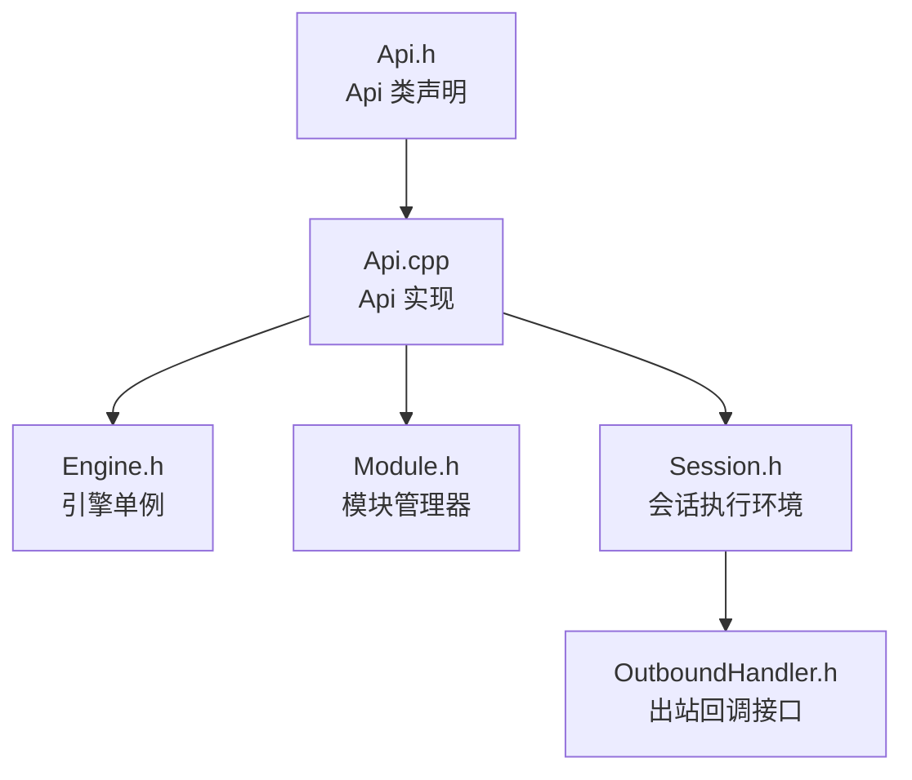
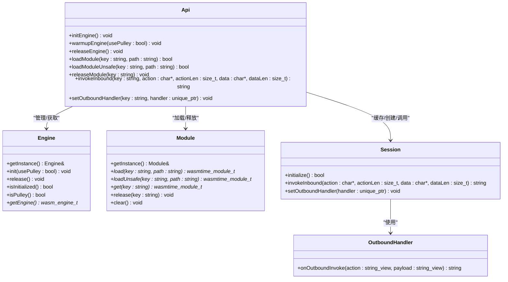
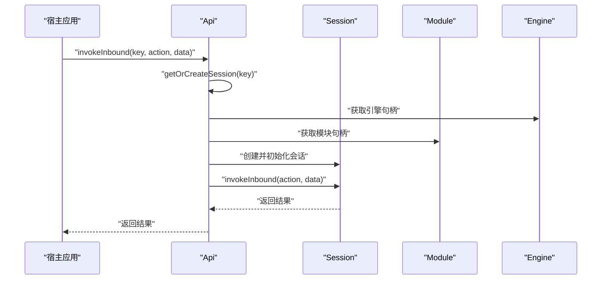
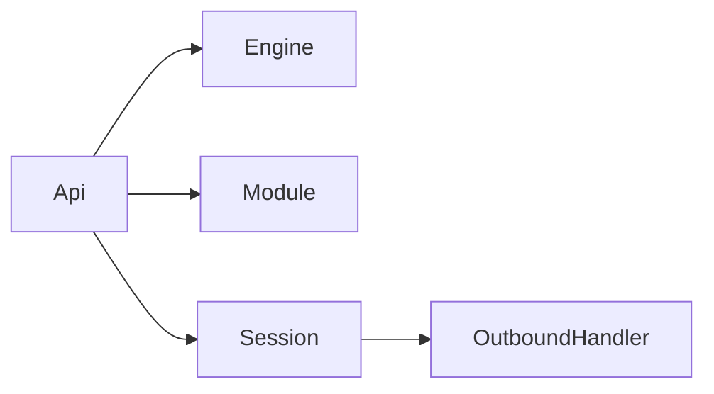

# 核心 API

<cite>
**本文引用的文件**
- [Api.h](file://wasmline-core/include/Api.h)
- [Api.cpp](file://wasmline-core/src/Api.cpp)
- [Engine.h](file://wasmline-core/include/Engine.h)
- [Module.h](file://wasmline-core/include/Module.h)
- [Session.h](file://wasmline-core/include/Session.h)
- [OutboundHandler.h](file://wasmline-core/include/OutboundHandler.h)
</cite>

## 目录
1. [简介](#简介)
2. [项目结构](#项目结构)
3. [核心组件](#核心组件)
4. [架构总览](#架构总览)
5. [详细组件分析](#详细组件分析)
6. [依赖关系分析](#依赖关系分析)
7. [性能与线程安全](#性能与线程安全)
8. [故障排查指南](#故障排查指南)
9. [结论](#结论)
10. [附录：API 使用示例与最佳实践](#附录api-使用示例与最佳实践)

## 简介
本文件为 Wasmline 核心 API 的权威参考文档，聚焦于 Api 类提供的静态方法，系统性阐述其功能、参数、返回值、使用场景与内部协作机制。内容覆盖引擎初始化、预编译模块加载、会话管理与函数调用的完整流程，并对线程安全性与性能特性进行深入解析。同时给出 API 之间的依赖关系与调用顺序，帮助开发者正确、高效地集成与扩展。

## 项目结构
Wasmline 的核心 API 位于 C++ 核心库中，对外提供统一的静态入口，内部通过 Engine、Module、Session 三层协作完成生命周期管理与执行调度。下图展示了核心头文件与实现文件的关系：

图表来源
- [Api.h:21-82](file://wasmline-core/include/Api.h#L21-L82)
- [Api.cpp:16-186](file://wasmline-core/src/Api.cpp#L16-L186)
- [Engine.h:16-72](file://wasmline-core/include/Engine.h#L16-L72)
- [Module.h:21-100](file://wasmline-core/include/Module.h#L21-L100)
- [Session.h:20-79](file://wasmline-core/include/Session.h#L20-L79)
- [OutboundHandler.h:6-23](file://wasmline-core/include/OutboundHandler.h#L6-L23)

章节来源
- [Api.h:1-83](file://wasmline-core/include/Api.h#L1-L83)
- [Api.cpp:1-186](file://wasmline-core/src/Api.cpp#L1-L186)
- [Engine.h:1-73](file://wasmline-core/include/Engine.h#L1-L73)
- [Module.h:1-101](file://wasmline-core/include/Module.h#L1-L101)
- [Session.h:1-80](file://wasmline-core/include/Session.h#L1-L80)
- [OutboundHandler.h:1-24](file://wasmline-core/include/OutboundHandler.h#L1-L24)

## 核心组件
- Api：统一的静态 API 外观，负责引擎初始化、模块加载、会话缓存与入站调用分发，以及出站处理器设置。
- Engine：全局 Wasmtime 引擎单例，负责引擎创建、配置（含 Pulley/CWASM 模式）、释放与状态查询。
- Module：模块管理器，负责模块加载（原生 wasm 编译或预编译 cwasm/pwasm 反序列化）、缓存、并发安全与清理。
- Session：单实例执行环境，封装 Store/Linker/Instance/WASI/内存等，提供入站调用与出站回调桥接。
- OutboundHandler：抽象出站回调接口，供 Session 在 Wasm 调用宿主时使用。

章节来源
- [Api.h:21-82](file://wasmline-core/include/Api.h#L21-L82)
- [Engine.h:16-72](file://wasmline-core/include/Engine.h#L16-L72)
- [Module.h:21-100](file://wasmline-core/include/Module.h#L21-L100)
- [Session.h:20-79](file://wasmline-core/include/Session.h#L20-L79)
- [OutboundHandler.h:6-23](file://wasmline-core/include/OutboundHandler.h#L6-L23)

## 架构总览
下图展示了 Api 与 Engine/Module/Session 的交互关系与职责边界：

图表来源
- [Api.h:21-82](file://wasmline-core/include/Api.h#L21-L82)
- [Api.cpp:16-186](file://wasmline-core/src/Api.cpp#L16-L186)
- [Engine.h:16-72](file://wasmline-core/include/Engine.h#L16-L72)
- [Module.h:21-100](file://wasmline-core/include/Module.h#L21-L100)
- [Session.h:20-79](file://wasmline-core/include/Session.h#L20-L79)
- [OutboundHandler.h:6-23](file://wasmline-core/include/OutboundHandler.h#L6-L23)

## 详细组件分析

### Api 类静态方法详解
- initEngine
  - 功能：初始化全局引擎，启用 Android 优化配置。
  - 参数：无
  - 返回值：无
  - 使用场景：应用启动时首次调用，确保后续模块加载与执行可用。
  - 注意：重复调用不会产生副作用；若已初始化则直接返回。
  - 章节来源
    - [Api.h:26](file://wasmline-core/include/Api.h#L26)
    - [Api.cpp:41-43](file://wasmline-core/src/Api.cpp#L41-L43)
    - [Engine.h:32](file://wasmline-core/include/Engine.h#L32)

- warmupEngine
  - 功能：按指定后端模式预热引擎（Pulley 或 CWASM），若当前模式不匹配则自动释放并重建。
  - 参数：usePulley（是否使用 Pulley 后端）
  - 返回值：无
  - 使用场景：在加载特定后缀（.pwasm/.cwasm）的模块前，确保引擎后端与模块类型一致。
  - 章节来源
    - [Api.h:31](file://wasmline-core/include/Api.h#L31)
    - [Api.cpp:45-56](file://wasmline-core/src/Api.cpp#L45-L56)
    - [Api.cpp:87-114](file://wasmline-core/src/Api.cpp#L87-L114)
    - [Engine.h:32](file://wasmline-core/include/Engine.h#L32)

- releaseEngine
  - 功能：释放全局引擎及其资源，包括销毁所有会话、清空模块缓存、最终释放引擎。
  - 参数：无
  - 返回值：无
  - 使用场景：应用退出或不再使用 Wasm 时调用，确保资源回收。
  - 章节来源
    - [Api.h:36](file://wasmline-core/include/Api.h#L36)
    - [Api.cpp:58-73](file://wasmline-core/src/Api.cpp#L58-L73)

- loadModule
  - 功能：加载预编译模块（支持 .wasm/.cwasm/.pwasm），线程安全，避免重复 IO/反序列化。
  - 参数：
    - key：模块唯一标识
    - path：模块文件绝对路径
  - 返回值：布尔，成功返回真
  - 使用场景：常规场景下的模块加载，内部自动选择后端并确保引擎就绪。
  - 章节来源
    - [Api.h:41](file://wasmline-core/include/Api.h#L41)
    - [Api.cpp:75-79](file://wasmline-core/src/Api.cpp#L75-L79)
    - [Api.cpp:87-114](file://wasmline-core/src/Api.cpp#L87-L114)
    - [Module.h:45](file://wasmline-core/include/Module.h#L45)

- loadModuleUnsafe
  - 功能：不加锁的模块加载，仅在单线程初始化阶段或已保证无并发访问时使用。
  - 参数：
    - key：模块唯一标识
    - path：模块文件绝对路径
  - 返回值：布尔，成功返回真
  - 使用场景：极端性能要求下的初始化路径，需自行确保线程安全。
  - 章节来源
    - [Api.h:46](file://wasmline-core/include/Api.h#L46)
    - [Api.cpp:81-85](file://wasmline-core/src/Api.cpp#L81-L85)
    - [Module.h:59](file://wasmline-core/include/Module.h#L59)

- releaseModule
  - 功能：释放指定模块并移除其关联的会话。
  - 参数：key
  - 返回值：无
  - 使用场景：模块不再使用或需要切换版本时调用。
  - 章节来源
    - [Api.h:52](file://wasmline-core/include/Api.h#L52)
    - [Api.cpp:117-129](file://wasmline-core/src/Api.cpp#L117-L129)
    - [Module.h:70](file://wasmline-core/include/Module.h#L70)

- invokeInbound
  - 功能：在指定模块上执行入站调用（Host -> Wasm），内部管理会话创建与缓存。
  - 参数：
    - key：模块标识
    - action/actionLen：动作名及其长度
    - data/dataLen：输入二进制数据及其长度
  - 返回值：输出二进制数据字符串
  - 使用场景：向 Wasm 发起函数调用，传递序列化后的参数。
  - 章节来源
    - [Api.h:63](file://wasmline-core/include/Api.h#L63)
    - [Api.cpp:138-146](file://wasmline-core/src/Api.cpp#L138-L146)
    - [Session.h:30](file://wasmline-core/include/Session.h#L30)

- setOutboundHandler
  - 功能：为指定会话注册出站回调处理器。
  - 参数：
    - key：模块标识
    - handler：出站处理器智能指针
  - 返回值：无
  - 使用场景：在 Wasm 内发起对宿主的出站调用时，由宿主提供响应。
  - 章节来源
    - [Api.h:65](file://wasmline-core/include/Api.h#L65)
    - [Api.cpp:132-135](file://wasmline-core/src/Api.cpp#L132-L135)
    - [Session.h:33](file://wasmline-core/include/Session.h#L33)
    - [OutboundHandler.h:22](file://wasmline-core/include/OutboundHandler.h#L22)

### 会话管理与调用流程
下图展示了从调用 Api::invokeInbound 到 Session 执行的具体步骤：

图表来源
- [Api.cpp:138-146](file://wasmline-core/src/Api.cpp#L138-L146)
- [Api.cpp:149-185](file://wasmline-core/src/Api.cpp#L149-L185)
- [Session.h:22-30](file://wasmline-core/include/Session.h#L22-L30)
- [Module.h:65](file://wasmline-core/include/Module.h#L65)
- [Engine.h:55](file://wasmline-core/include/Engine.h#L55)

## 依赖关系分析
- Api 对 Engine/Module/Session 的依赖是单向且清晰的：Api 作为门面协调三者，Session 依赖 OutboundHandler 进行出站通信。
- 模块加载与引擎后端一致性由 Api::ensureEngineForArtifact 保障，避免 .pwasm 与 .cwasm 与引擎模式不匹配导致的运行时错误。
- 会话缓存采用读写锁保护，降低并发创建会话的开销。

图表来源
- [Api.h:21-82](file://wasmline-core/include/Api.h#L21-L82)
- [Api.cpp:16-186](file://wasmline-core/src/Api.cpp#L16-L186)
- [Session.h:20-79](file://wasmline-core/include/Session.h#L20-L79)
- [OutboundHandler.h:6-23](file://wasmline-core/include/OutboundHandler.h#L6-L23)

章节来源
- [Api.cpp:87-114](file://wasmline-core/src/Api.cpp#L87-L114)
- [Api.cpp:149-185](file://wasmline-core/src/Api.cpp#L149-L185)

## 性能与线程安全
- 线程安全
  - 会话缓存：使用共享互斥量（shared_mutex）实现读多写少的高效并发，getOrCreateSession 采用“先读锁快速路径 + 必要时升级为写锁”的策略，避免热点竞争。
  - 模块管理：使用普通互斥量与条件变量，短临界区设计，减少锁开销；支持 loadUnsafe 提供无锁路径用于单线程初始化。
  - 引擎管理：引擎单例通过互斥量保护初始化与释放阶段，避免重复初始化与竞态。
- 性能特性
  - 模块加载：避免重复 IO 与反序列化，命中缓存即返回；loadUnsafe 在已知无并发时提供极致性能。
  - 会话复用：同一 key 的多次调用复用同一 Session，减少 Store/Linker/Instance 初始化成本。
  - 后端自适配：根据模块后缀自动选择引擎模式，必要时触发引擎重建，确保兼容性与性能平衡。

章节来源
- [Api.h:74-81](file://wasmline-core/include/Api.h#L74-L81)
- [Api.cpp:149-185](file://wasmline-core/src/Api.cpp#L149-L185)
- [Module.h:93-99](file://wasmline-core/include/Module.h#L93-L99)
- [Engine.h:70-71](file://wasmline-core/include/Engine.h#L70-L71)

## 故障排查指南
- “无法创建会话”：当引擎或模块为空时，Api::getOrCreateSession 将记录错误并返回空指针。请确认已调用 initEngine/loadModule 并传入正确的 key。
- “引擎模式不匹配”：加载 .pwasm/.cwasm 时若引擎后端不一致，Api::ensureEngineForArtifact 会触发引擎释放并重建，请检查 warmupEngine/usePulley 的调用时机。
- “未设置出站处理器”：若 Wasm 发起出站调用但未注册 OutboundHandler，将无法获得响应。请在调用 invokeInbound 前调用 setOutboundHandler。
- “释放顺序不当”：releaseEngine 会先释放所有会话再释放模块与引擎，若在引擎释放后再调用模块/会话相关操作可能导致崩溃。

章节来源
- [Api.cpp:167-181](file://wasmline-core/src/Api.cpp#L167-L181)
- [Api.cpp:107-113](file://wasmline-core/src/Api.cpp#L107-L113)
- [Api.cpp:132-135](file://wasmline-core/src/Api.cpp#L132-L135)
- [Api.cpp:58-73](file://wasmline-core/src/Api.cpp#L58-L73)

## 结论
Api 类提供了简洁而强大的静态入口，将引擎、模块与会话的复杂生命周期管理封装为易用接口。通过合理的调用顺序与线程安全设计，开发者可以在多平台、多后端环境下稳定地执行 Wasm 函数调用，并在性能与可靠性之间取得良好平衡。

## 附录：API 使用示例与最佳实践
以下为常见使用路径与建议，便于快速集成与验证：

- 典型调用顺序
  - 初始化引擎：initEngine 或 warmupEngine
  - 加载模块：loadModule（或 loadModuleUnsafe 于单线程初始化）
  - 注册出站处理器：setOutboundHandler
  - 执行入站调用：invokeInbound
  - 释放资源：releaseModule（按需），最后 releaseEngine（应用退出）

- 最佳实践
  - 在应用启动阶段调用 warmupEngine，确保引擎后端与目标模块类型一致。
  - 使用 loadModule 进行常规加载；仅在确定无并发访问时使用 loadModuleUnsafe。
  - 为每个模块 key 维护稳定的生命周期，避免频繁创建/销毁会话。
  - 在 releaseEngine 前确保所有会话与模块已释放，防止悬挂引用。

- 错误处理建议
  - 对 loadModule 的返回值进行判断；失败时检查路径与后端模式。
  - 若 invokeInbound 返回空字符串，检查会话创建与模块加载是否成功。
  - 未设置 OutboundHandler 时，Wasm 的出站调用将阻塞或失败，务必提前注册。

章节来源
- [Api.h:26](file://wasmline-core/include/Api.h#L26)
- [Api.h:31](file://wasmline-core/include/Api.h#L31)
- [Api.h:36](file://wasmline-core/include/Api.h#L36)
- [Api.h:41](file://wasmline-core/include/Api.h#L41)
- [Api.h:46](file://wasmline-core/include/Api.h#L46)
- [Api.h:52](file://wasmline-core/include/Api.h#L52)
- [Api.h:63](file://wasmline-core/include/Api.h#L63)
- [Api.h:65](file://wasmline-core/include/Api.h#L65)
- [Api.cpp:41-56](file://wasmline-core/src/Api.cpp#L41-L56)
- [Api.cpp:75-85](file://wasmline-core/src/Api.cpp#L75-L85)
- [Api.cpp:117-129](file://wasmline-core/src/Api.cpp#L117-L129)
- [Api.cpp:132-146](file://wasmline-core/src/Api.cpp#L132-L146)
- [Api.cpp:58-73](file://wasmline-core/src/Api.cpp#L58-L73)