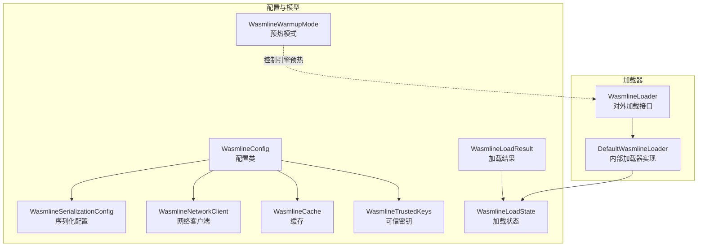
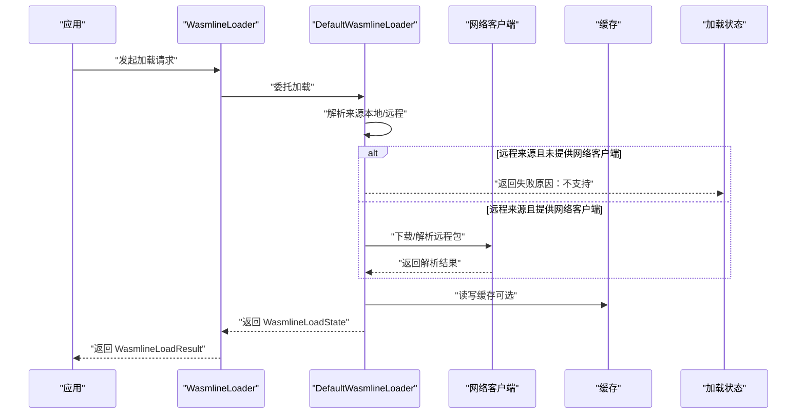
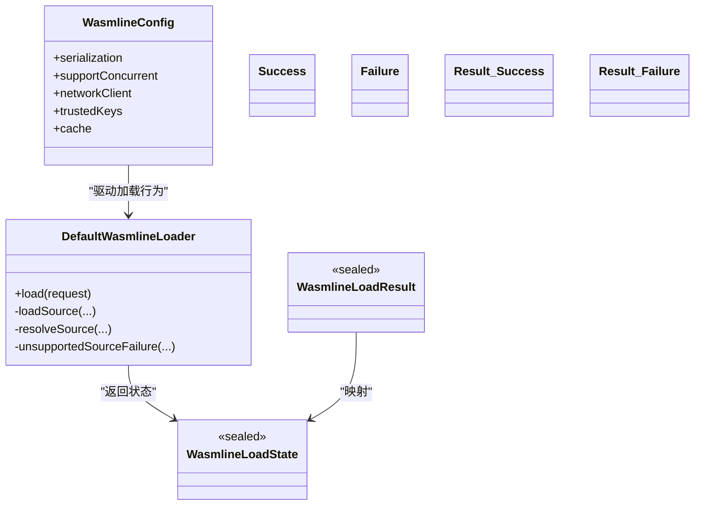

# 配置 API

<cite>
**本文引用的文件**
- [WasmlineConfig.kt](file://wasmline-multiplatform/wasmline/src/commonMain/kotlin/crow/wasmline/WasmlineConfig.kt)
- [WasmlineLoadState.kt](file://wasmline-multiplatform/wasmline/src/hostMain/kotlin/crow/wasmline/WasmlineLoadState.kt)
- [WasmlineLoadResult.kt](file://wasmline-multiplatform/wasmline/src/hostMain/kotlin/crow/wasmline/WasmlineLoadResult.kt)
- [WasmlineWarmupMode.kt](file://wasmline-multiplatform/wasmline/src/hostMain/kotlin/crow/wasmline/WasmlineWarmupMode.kt)
- [DefaultWasmlineLoader.kt](file://wasmline-multiplatform/wasmline-loader/src/hostMain/kotlin/crow/wasmline/loader/DefaultWasmlineLoader.kt)
- [WasmlineSerializationConfig.kt](file://wasmline-multiplatform/wasmline/src/commonMain/kotlin/crow/wasmline/serialization/WasmlineSerializationConfig.kt)
- [WasmlineNetworkClient.kt](file://wasmline-multiplatform/wasmline/src/commonMain/kotlin/crow/wasmline/WasmlineNetworkClient.kt)
- [WasmlineCache.kt](file://wasmline-multiplatform/wasmline/src/commonMain/kotlin/crow/wasmline/WasmlineCache.kt)
- [WasmlineTrustedKeys.kt](file://wasmline-multiplatform/wasmline/src/commonMain/kotlin/crow/wasmline/WasmlineTrustedKeys.kt)
- [WasmlineLoader.kt（host）](file://wasmline-multiplatform/wasmline/src/hostMain/kotlin/crow/wasmline/WasmlineLoader.kt)
- [WasmlineLoader.kt（loader）](file://wasmline-multiplatform/wasmline-loader/src/hostMain/kotlin/crow/wasmline/loader/WasmlineLoader.kt)
</cite>

## 目录
1. [简介](#简介)
2. [项目结构](#项目结构)
3. [核心组件](#核心组件)
4. [架构总览](#架构总览)
5. [详细组件分析](#详细组件分析)
6. [依赖分析](#依赖分析)
7. [性能考虑](#性能考虑)
8. [故障排查指南](#故障排查指南)
9. [结论](#结论)
10. [附录](#附录)

## 简介
本文件为 Wasmline 配置 API 的完整参考文档，聚焦于 WasmlineConfig 配置类及其相关数据结构与加载流程。内容涵盖：
- WasmlineConfig 所有属性与默认值
- 预热模式（Warmup Mode）与加载状态/结果的数据结构
- 配置项的语义、依赖关系与冲突处理
- 性能优化参数与调试建议
- 实时生效机制与最佳实践
- 配置验证与错误提示

## 项目结构
与配置 API 相关的核心文件分布于多平台模块与加载器模块中，主要涉及：
- 配置定义：WasmlineConfig 及其依赖（序列化、网络、缓存、可信密钥）
- 加载状态与结果：WasmlineLoadState、WasmlineLoadResult
- 预热模式：WasmlineWarmupMode
- 加载器实现：DefaultWasmlineLoader 与对外 Loader 接口

图表来源
- [WasmlineConfig.kt:18-24](file://wasmline-multiplatform/wasmline/src/commonMain/kotlin/crow/wasmline/WasmlineConfig.kt#L18-L24)
- [WasmlineSerializationConfig.kt](file://wasmline-multiplatform/wasmline/src/commonMain/kotlin/crow/wasmline/serialization/WasmlineSerializationConfig.kt)
- [WasmlineNetworkClient.kt](file://wasmline-multiplatform/wasmline/src/commonMain/kotlin/crow/wasmline/WasmlineNetworkClient.kt)
- [WasmlineCache.kt](file://wasmline-multiplatform/wasmline/src/commonMain/kotlin/crow/wasmline/WasmlineCache.kt)
- [WasmlineTrustedKeys.kt](file://wasmline-multiplatform/wasmline/src/commonMain/kotlin/crow/wasmline/WasmlineTrustedKeys.kt)
- [DefaultWasmlineLoader.kt:13-75](file://wasmline-multiplatform/wasmline-loader/src/hostMain/kotlin/crow/wasmline/loader/DefaultWasmlineLoader.kt#L13-L75)
- [WasmlineLoader.kt（host）](file://wasmline-multiplatform/wasmline/src/hostMain/kotlin/crow/wasmline/WasmlineLoader.kt)
- [WasmlineLoader.kt（loader）](file://wasmline-multiplatform/wasmline-loader/src/hostMain/kotlin/crow/wasmline/loader/WasmlineLoader.kt)
- [WasmlineLoadState.kt:13-23](file://wasmline-multiplatform/wasmline/src/hostMain/kotlin/crow/wasmline/WasmlineLoadState.kt#L13-L23)
- [WasmlineLoadResult.kt:9-12](file://wasmline-multiplatform/wasmline/src/hostMain/kotlin/crow/wasmline/WasmlineLoadResult.kt#L9-L12)
- [WasmlineWarmupMode.kt:10-13](file://wasmline-multiplatform/wasmline/src/hostMain/kotlin/crow/wasmline/WasmlineWarmupMode.kt#L10-L13)

章节来源
- [WasmlineConfig.kt:1-25](file://wasmline-multiplatform/wasmline/src/commonMain/kotlin/crow/wasmline/WasmlineConfig.kt#L1-L25)
- [DefaultWasmlineLoader.kt:1-110](file://wasmline-multiplatform/wasmline-loader/src/hostMain/kotlin/crow/wasmline/loader/DefaultWasmlineLoader.kt#L1-L110)

## 核心组件
本节对配置 API 的核心组件进行深入解析，重点覆盖 WasmlineConfig 的属性、默认值、行为语义及与加载流程的关系。

- WasmlineConfig 属性与默认值
  - serialization: 默认采用 Protobuf 序列化配置；可通过工厂方法切换到其他格式。
  - supportConcurrent: 默认关闭并发支持，即无锁加载路径；开启后启用内部互斥以保证线程安全。
  - networkClient: 默认为空，表示不支持远程包加载；若提供网络客户端，则可启用内置远程解析。
  - trustedKeys: 默认为空，表示跳过签名验证（宽松模式）；提供可信公钥集合可启用签名校验。
  - cache: 默认为空，使用平台默认文件系统缓存；可自定义缓存以控制下载与缓存策略。

- 预热模式（Warmup Mode）
  - PULLEY 与 AOT 两种模式用于提前创建后端引擎，将成本转移到应用生命周期早期。
  - Wasmline.load(...) 仍会根据产物后缀自动选择后端，该枚举仅控制是否提前创建引擎。

- 加载状态与结果
  - WasmlineLoadState：封装成功/失败两类状态，包含状态码与原因字符串；提供 onSuccess/onFailure 扩展函数便于链式处理。
  - WasmlineLoadResult：对外公开的加载结果类型，成功返回 Wasmline 实例，失败返回错误描述。

- 加载器与解析链
  - DefaultWasmlineLoader 负责根据 WasmlineLoadRequest 的来源（本地工件、本地清单、远程清单）进行解析与递归解析。
  - 支持本地/远程解析器与网络客户端组合，超过最大解析深度将触发失败。

章节来源
- [WasmlineConfig.kt:5-24](file://wasmline-multiplatform/wasmline/src/commonMain/kotlin/crow/wasmline/WasmlineConfig.kt#L5-L24)
- [WasmlineWarmupMode.kt:3-13](file://wasmline-multiplatform/wasmline/src/hostMain/kotlin/crow/wasmline/WasmlineWarmupMode.kt#L3-L13)
- [WasmlineLoadState.kt:7-32](file://wasmline-multiplatform/wasmline/src/hostMain/kotlin/crow/wasmline/WasmlineLoadState.kt#L7-L32)
- [WasmlineLoadResult.kt:3-12](file://wasmline-multiplatform/wasmline/src/hostMain/kotlin/crow/wasmline/WasmlineLoadResult.kt#L3-L12)
- [DefaultWasmlineLoader.kt:13-110](file://wasmline-multiplatform/wasmline-loader/src/hostMain/kotlin/crow/wasmline/loader/DefaultWasmlineLoader.kt#L13-L110)

## 架构总览
下图展示了配置如何贯穿加载流程：从 WasmlineLoader 到 DefaultWasmlineLoader，再到具体加载实现与状态返回。

图表来源
- [WasmlineLoader.kt（host）](file://wasmline-multiplatform/wasmline/src/hostMain/kotlin/crow/wasmline/WasmlineLoader.kt)
- [WasmlineLoader.kt（loader）](file://wasmline-multiplatform/wasmline-loader/src/hostMain/kotlin/crow/wasmline/loader/WasmlineLoader.kt)
- [DefaultWasmlineLoader.kt:13-75](file://wasmline-multiplatform/wasmline-loader/src/hostMain/kotlin/crow/wasmline/loader/DefaultWasmlineLoader.kt#L13-L75)
- [WasmlineLoadState.kt:13-23](file://wasmline-multiplatform/wasmline/src/hostMain/kotlin/crow/wasmline/WasmlineLoadState.kt#L13-L23)
- [WasmlineLoadResult.kt:9-12](file://wasmline-multiplatform/wasmline/src/hostMain/kotlin/crow/wasmline/WasmlineLoadResult.kt#L9-L12)

## 详细组件分析

### WasmlineConfig 配置类
- 类型与职责
  - 统一承载 Wasmline 模块加载与运行所需的配置项，包括序列化、并发支持、网络、缓存与可信密钥等。
- 关键属性与默认值
  - serialization: 默认使用 Protobuf 序列化配置；可通过工厂方法切换。
  - supportConcurrent: 默认 false，无锁加载；true 时启用内部互斥。
  - networkClient: 默认 null，不支持远程加载；提供后启用内置远程解析。
  - trustedKeys: 默认 null，宽松模式；提供后启用签名验证。
  - cache: 默认 null，使用平台默认文件系统缓存；可自定义缓存。
- 依赖关系
  - 与序列化配置、网络客户端、缓存、可信密钥均为组合关系。
  - 影响加载器的行为：当 networkClient 为 null 时，远程来源将无法解析。
- 冲突与约束
  - 若未提供 networkClient，远程来源将被拒绝，需通过自定义解析器或提供网络客户端解决。
  - trustedKeys 与签名验证相关，若未提供则跳过校验，存在安全风险。
- 实时生效机制
  - 配置在加载请求（WasmlineLoadRequest）中传递，加载器按请求配置执行；因此修改配置后需重新发起加载请求以生效。
- 最佳实践
  - 生产环境建议显式提供 networkClient、trustedKeys 与 cache，确保远程加载、签名验证与缓存命中。
  - 多线程场景开启 supportConcurrent 以避免竞态。
  - 使用预热模式（PULLEY/AOT）将引擎初始化成本前移到应用启动阶段。

章节来源
- [WasmlineConfig.kt:5-24](file://wasmline-multiplatform/wasmline/src/commonMain/kotlin/crow/wasmline/WasmlineConfig.kt#L5-L24)
- [WasmlineSerializationConfig.kt](file://wasmline-multiplatform/wasmline/src/commonMain/kotlin/crow/wasmline/serialization/WasmlineSerializationConfig.kt)
- [WasmlineNetworkClient.kt](file://wasmline-multiplatform/wasmline/src/commonMain/kotlin/crow/wasmline/WasmlineNetworkClient.kt)
- [WasmlineCache.kt](file://wasmline-multiplatform/wasmline/src/commonMain/kotlin/crow/wasmline/WasmlineCache.kt)
- [WasmlineTrustedKeys.kt](file://wasmline-multiplatform/wasmline/src/commonMain/kotlin/crow/wasmline/WasmlineTrustedKeys.kt)

### 预热模式（WasmlineWarmupMode）
- 枚举值
  - PULLEY：预热拉力后端。
  - AOT：预热 AOT 后端。
- 行为说明
  - 仅控制是否提前创建后端引擎，实际后端选择仍由产物后缀决定。
  - 适合需要将首次延迟成本转移到启动阶段的场景。

章节来源
- [WasmlineWarmupMode.kt:3-13](file://wasmline-multiplatform/wasmline/src/hostMain/kotlin/crow/wasmline/WasmlineWarmupMode.kt#L3-L13)

### 加载状态与结果（WasmlineLoadState / WasmlineLoadResult）
- WasmlineLoadState
  - 成功：包含状态码与 Wasmline 实例。
  - 失败：包含状态码与错误原因字符串。
  - 提供 onSuccess/onFailure 扩展函数，便于链式处理。
- WasmlineLoadResult
  - 对外公开的结果类型，成功返回 Wasmline，失败返回错误描述。
- 状态码
  - CODE_SUCCESS_PULLEY、CODE_SUCCESS_AOT、CODE_FAILURE、CODE_SUCCESS_WASM 等常量用于标识不同后端与成功/失败状态。

章节来源
- [WasmlineLoadState.kt:7-32](file://wasmline-multiplatform/wasmline/src/hostMain/kotlin/crow/wasmline/WasmlineLoadState.kt#L7-L32)
- [WasmlineLoadResult.kt:3-12](file://wasmline-multiplatform/wasmline/src/hostMain/kotlin/crow/wasmline/WasmlineLoadResult.kt#L3-L12)

### 加载器与解析链（DefaultWasmlineLoader）
- 解析来源
  - 本地工件路径：直接加载工件。
  - 本地清单路径：通过本地解析器解析为本地工件。
  - 远程清单 URL：优先尝试自定义远程解析器；否则在提供 networkClient 时使用内置远程解析；否则报“不支持”。
- 递归解析
  - 支持 ContinueWith 继续解析，最大解析深度限制为 8，超限返回失败。
- 错误处理
  - 不支持的来源：返回失败并给出解析器提示。
  - 解析失败：返回失败并携带原因。

章节来源
- [DefaultWasmlineLoader.kt:13-110](file://wasmline-multiplatform/wasmline-loader/src/hostMain/kotlin/crow/wasmline/loader/DefaultWasmlineLoader.kt#L13-L110)

## 依赖分析
- 组件耦合
  - WasmlineConfig 与序列化、网络、缓存、可信密钥为组合关系，影响加载器行为。
  - DefaultWasmlineLoader 依赖 WasmlineConfig 中的 networkClient 与解析器链。
- 外部依赖
  - 网络客户端：用于远程包下载与解析。
  - 缓存：用于下载与工件缓存，提升重复加载性能。
  - 可信密钥：用于清单签名验证，保障来源可信。
- 循环依赖
  - 当前设计为单向依赖（配置驱动加载器），未见循环依赖迹象。

图表来源
- [WasmlineConfig.kt:18-24](file://wasmline-multiplatform/wasmline/src/commonMain/kotlin/crow/wasmline/WasmlineConfig.kt#L18-L24)
- [DefaultWasmlineLoader.kt:13-75](file://wasmline-multiplatform/wasmline-loader/src/hostMain/kotlin/crow/wasmline/loader/DefaultWasmlineLoader.kt#L13-L75)
- [WasmlineLoadState.kt:13-23](file://wasmline-multiplatform/wasmline/src/hostMain/kotlin/crow/wasmline/WasmlineLoadState.kt#L13-L23)
- [WasmlineLoadResult.kt:9-12](file://wasmline-multiplatform/wasmline/src/hostMain/kotlin/crow/wasmline/WasmlineLoadResult.kt#L9-L12)

## 性能考虑
- 并发支持（supportConcurrent）
  - 在高并发场景开启可避免竞态，但会引入互斥开销；应结合业务并发度评估。
- 预热模式（Warmup Mode）
  - 将引擎初始化成本前移，降低首次调用延迟，适合启动阶段对首帧/首调用敏感的应用。
- 缓存（cache）
  - 启用缓存可显著减少重复下载与解析时间；建议在生产环境提供持久化缓存。
- 网络客户端（networkClient）
  - 提供稳定可靠的网络客户端可减少重试与失败带来的性能抖动。
- 序列化（serialization）
  - Protobuf 通常具备较好的性能与兼容性；如需更小体积或更快速度，可评估其他序列化方案。

## 故障排查指南
- 远程来源加载失败
  - 症状：返回“不支持”的失败状态。
  - 原因：未提供 networkClient 或未配置远程解析器。
  - 处理：提供网络客户端或自定义远程解析器。
- 解析深度超限
  - 症状：返回“解析深度超限”的失败状态。
  - 原因：解析链存在循环或复杂嵌套。
  - 处理：检查解析器链，避免无限递归。
- 签名验证失败（若启用）
  - 症状：加载失败并提示签名问题。
  - 原因：清单签名与可信密钥不匹配。
  - 处理：更新可信密钥或修正清单签名。
- 并发竞态导致异常
  - 症状：多线程环境下出现不稳定行为。
  - 处理：开启 supportConcurrent，确保互斥保护。
- 预热模式与后端选择
  - 症状：预热后端与产物后缀不一致。
  - 说明：预热模式仅控制是否提前创建引擎，后端仍由产物后缀决定。

章节来源
- [DefaultWasmlineLoader.kt:27-32](file://wasmline-multiplatform/wasmline-loader/src/hostMain/kotlin/crow/wasmline/loader/DefaultWasmlineLoader.kt#L27-L32)
- [DefaultWasmlineLoader.kt:84-87](file://wasmline-multiplatform/wasmline-loader/src/hostMain/kotlin/crow/wasmline/loader/DefaultWasmlineLoader.kt#L84-L87)
- [DefaultWasmlineLoader.kt:102-106](file://wasmline-multiplatform/wasmline-loader/src/hostMain/kotlin/crow/wasmline/loader/DefaultWasmlineLoader.kt#L102-L106)
- [WasmlineLoadState.kt:14-19](file://wasmline-multiplatform/wasmline/src/hostMain/kotlin/crow/wasmline/WasmlineLoadState.kt#L14-L19)

## 结论
- WasmlineConfig 提供了统一、可扩展的配置入口，涵盖序列化、并发、网络、缓存与可信密钥等关键能力。
- 加载器通过解析链与状态机清晰地分离了来源解析、网络下载与结果返回逻辑。
- 预热模式与并发支持为性能与稳定性提供了重要抓手。
- 建议在生产环境启用网络客户端、可信密钥与缓存，并根据并发度开启并发支持。

## 附录
- 配置项速查
  - serialization：默认 Protobuf；可切换其他格式。
  - supportConcurrent：默认 false；高并发场景建议开启。
  - networkClient：默认 null；远程加载需提供。
  - trustedKeys：默认 null；生产环境建议提供。
  - cache：默认 null；建议提供持久化缓存。
- 最佳实践场景
  - 移动端启动优化：启用预热模式与缓存，提供网络客户端与可信密钥。
  - 多线程服务端：开启并发支持，使用稳定网络客户端与持久化缓存。
  - 开发调试：可暂时关闭签名验证与并发互斥，便于快速迭代。