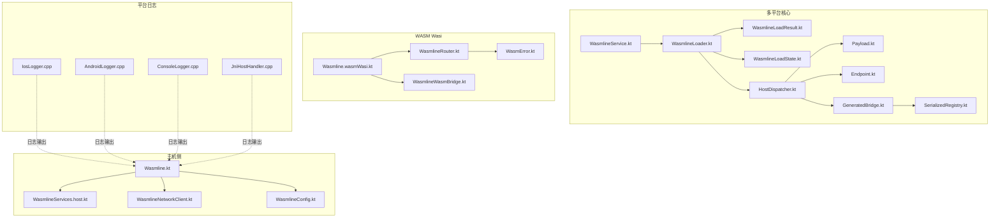
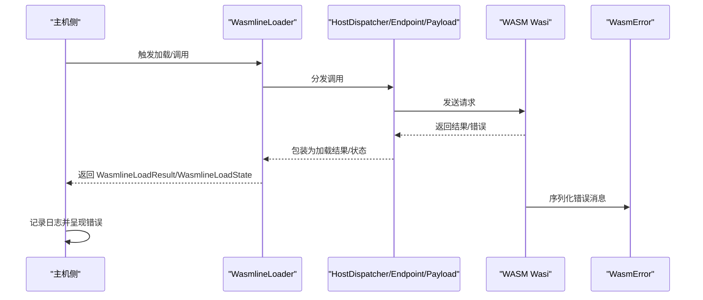
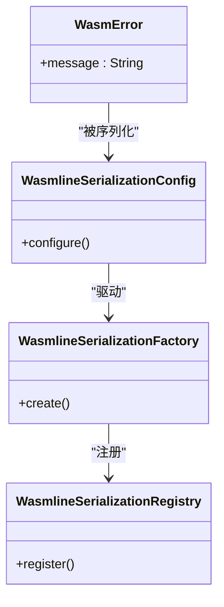
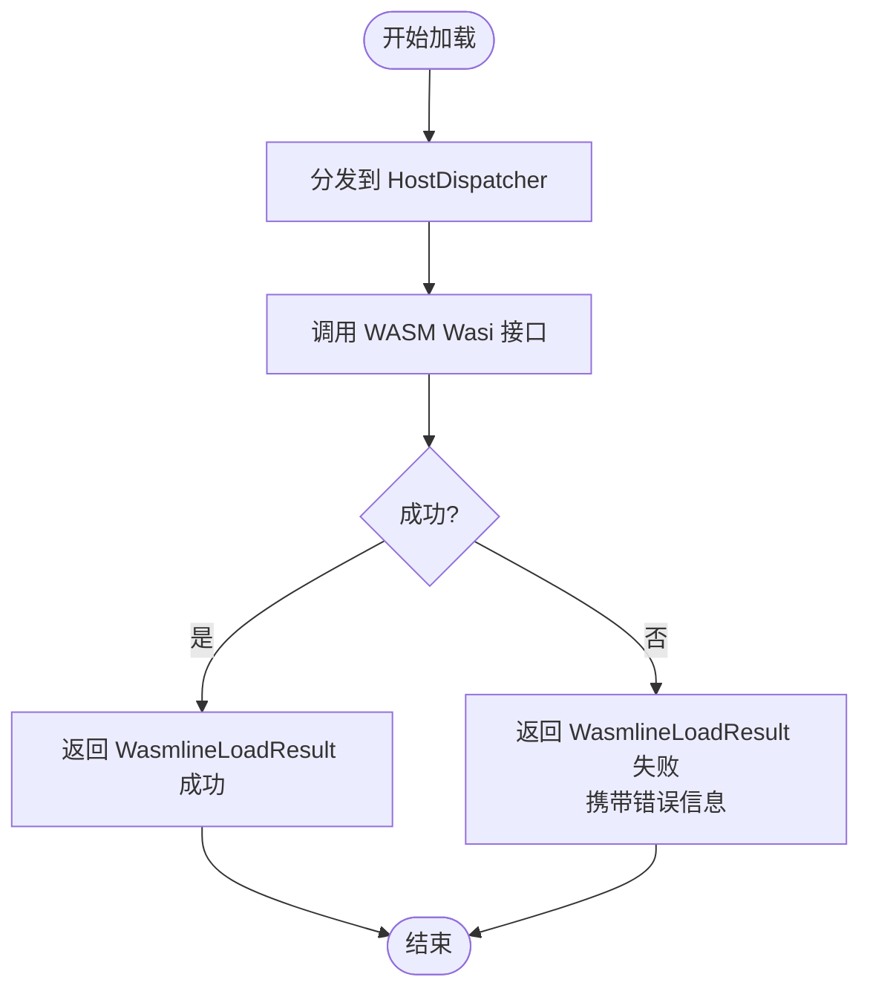
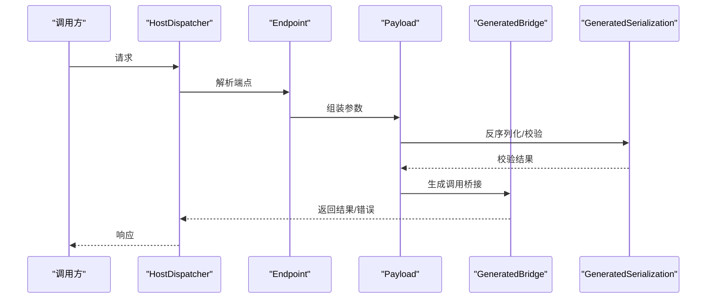
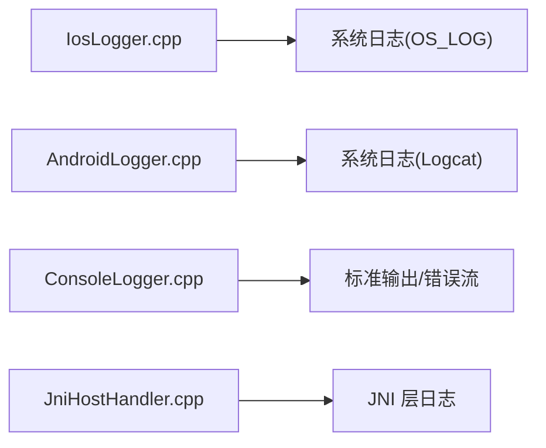
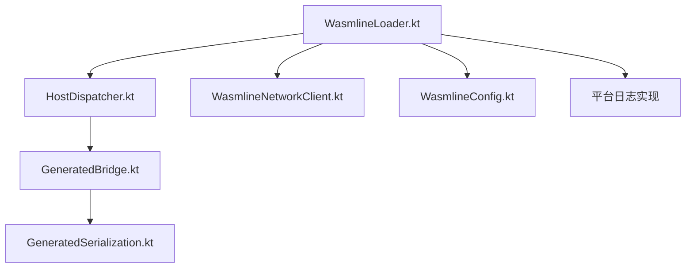

# 错误码参考

<cite>
**本文引用的文件**
- [wasmline-core/include/ErrorDefs.h](file://wasmline-core/include/ErrorDefs.h)
- [wasmline-multiplatform/wasmline/src/wasmWasiMain/kotlin/crow/wasmline/model/WasmError.kt](file://wasmline-multiplatform/wasmline/src/wasmWasiMain/kotlin/crow/wasmline/model/WasmError.kt)
- [wasmline-multiplatform/wasmline/src/iosMain/native/IosLogger.cpp](file://wasmline-multiplatform/wasmline/src/iosMain/native/IosLogger.cpp)
- [wasmline-multiplatform/wasmline/src/jvmMain/native/ConsoleLogger.cpp](file://wasmline-multiplatform/wasmline/src/jvmMain/native/ConsoleLogger.cpp)
- [wasmline-multiplatform/wasmline-android/src/androidMain/native/AndroidLogger.cpp](file://wasmline-multiplatform/wasmline-android/src/androidMain/native/AndroidLogger.cpp)
- [wasmline-multiplatform/wasmline/src/hostMain/kotlin/crow/wasmline/Wasmline.kt](file://wasmline-multiplatform/wasmline/src/hostMain/kotlin/crow/wasmline/Wasmline.kt)
- [wasmline-multiplatform/wasmline/src/hostMain/kotlin/crow/wasmline/WasmlineLoadResult.kt](file://wasmline-multiplatform/wasmline/src/hostMain/kotlin/crow/wasmline/WasmlineLoadResult.kt)
- [wasmline-multiplatform/wasmline/src/hostMain/kotlin/crow/wasmline/WasmlineLoadState.kt](file://wasmline-multiplatform/wasmline/src/hostMain/kotlin/crow/wasmline/WasmlineLoadState.kt)
- [wasmline-multiplatform/wasmline/src/hostMain/kotlin/crow/wasmline/WasmlineLoader.kt](file://wasmline-multiplatform/wasmline/src/hostMain/kotlin/crow/wasmline/WasmlineLoader.kt)
- [wasmline-multiplatform/wasmline/src/hostMain/kotlin/crow/wasmline/WasmlineServices.host.kt](file://wasmline-multiplatform/wasmline/src/hostMain/kotlin/crow/wasmline/WasmlineServices.host.kt)
- [wasmline-multiplatform/wasmline/src/wasmWasiMain/kotlin/crow/wasmline/Wasmline.wasmWasi.kt](file://wasmline-multiplatform/wasmline/src/wasmWasiMain/kotlin/crow/wasmline/Wasmline.wasmWasi.kt)
- [wasmline-multiplatform/wasmline/src/wasmWasiMain/kotlin/crow/wasmline/WasmlineRouter.kt](file://wasmline-multiplatform/wasmline/src/wasmWasiMain/kotlin/crow/wasmline/WasmlineRouter.kt)
- [wasmline-multiplatform/wasmline/src/wasmWasiMain/kotlin/crow/wasmline/WasmlineWasmBridge.kt](file://wasmline-multiplatform/wasmline/src/wasmWasiMain/kotlin/crow/wasmline/WasmlineWasmBridge.kt)
- [wasmline-multiplatform/wasmline/src/wasmWasiMain/kotlin/crow/wasmline/WasmlineServices.wasmWasi.kt](file://wasmline-multiplatform/wasmline/src/wasmWasiMain/kotlin/crow/wasmline/WasmlineServices.wasmWasi.kt)
- [wasmline-multiplatform/wasmline/src/wasmWasiMain/kotlin/crow/wasmline/model/WasmError.kt](file://wasmline-multiplatform/wasmline/src/wasmWasiMain/kotlin/crow/wasmline/model/WasmError.kt)
- [wasmline-multiplatform/wasmline/src/commonMain/kotlin/crow/wasmline/WasmlineService.kt](file://wasmline-multiplatform/wasmline/src/commonMain/kotlin/crow/wasmline/WasmlineService.kt)
- [wasmline-multiplatform/wasmline/src/commonMain/kotlin/crow/wasmline/WasmlineConfig.kt](file://wasmline-multiplatform/wasmline/src/commonMain/kotlin/crow/wasmline/WasmlineConfig.kt)
- [wasmline-multiplatform/wasmline/src/commonMain/kotlin/crow/wasmline/WasmlineNetworkClient.kt](file://wasmline-multiplatform/wasmline/src/commonMain/kotlin/crow/wasmline/WasmlineNetworkClient.kt)
- [wasmline-multiplatform/wasmline/src/commonMain/kotlin/crow/wasmline/internal/bridge/HostDispatcher.kt](file://wasmline-multiplatform/wasmline/src/commonMain/kotlin/crow/wasmline/internal/bridge/HostDispatcher.kt)
- [wasmline-multiplatform/wasmline/src/commonMain/kotlin/crow/wasmline/internal/bridge/Payload.kt](file://wasmline-multiplatform/wasmline/src/commonMain/kotlin/crow/wasmline/internal/bridge/Payload.kt)
- [wasmline-multiplatform/wasmline/src/commonMain/kotlin/crow/wasmline/internal/bridge/Endpoint.kt](file://wasmline-multiplatform/wasmline/src/commonMain/kotlin/crow/wasmline/internal/bridge/Endpoint.kt)
- [wasmline-multiplatform/wasmline/src/commonMain/kotlin/crow/wasmline/internal/bridge/GeneratedBridge.kt](file://wasmline-multiplatform/wasmline/src/commonMain/kotlin/crow/wasmline/internal/bridge/GeneratedBridge.kt)
- [wasmline-multiplatform/wasmline/src/commonMain/kotlin/crow/wasmline/internal/bridge/GeneratedSerialization.kt](file://wasmline-multiplatform/wasmline/src/commonMain/kotlin/crow/wasmline/internal/bridge/GeneratedSerialization.kt)
- [wasmline-multiplatform/wasmline/src/commonMain/kotlin/crow/wasmline/serialization/WasmlineSerializationConfig.kt](file://wasmline-multiplatform/wasmline/src/commonMain/kotlin/crow/wasmline/serialization/WasmlineSerializationConfig.kt)
- [wasmline-multiplatform/wasmline/src/commonMain/kotlin/crow/wasmline/serialization/WasmlineSerializationFactory.kt](file://wasmline-multiplatform/wasmline/src/commonMain/kotlin/crow/wasmline/serialization/WasmlineSerializationFactory.kt)
- [wasmline-multiplatform/wasmline/src/commonMain/kotlin/crow/wasmline/serialization/WasmlineSerializationRegistry.kt](file://wasmline-multiplatform/wasmline/src/commonMain/kotlin/crow/wasmline/serialization/WasmlineSerializationRegistry.kt)
- [wasmline-multiplatform/wasmline/src/hostMain/kotlin/crow/wasmline/WasmlineNative.cpp](file://wasmline-multiplatform/wasmline/src/hostMain/kotlin/crow/wasmline/WasmlineNative.cpp)
- [wasmline-multiplatform/wasmline/src/hostMain/kotlin/crow/wasmline/WasmlineNative.h](file://wasmline-multiplatform/wasmline/src/hostMain/kotlin/crow/wasmline/WasmlineNative.h)
- [wasmline-multiplatform/wasmline/src/jniMain/native/WasmlineJni.cpp](file://wasmline-multiplatform/wasmline/src/jniMain/native/WasmlineJni.cpp)
- [wasmline-multiplatform/wasmline/src/jniMain/native/WasmlineJni.h](file://wasmline-multiplatform/wasmline/src/jniMain/native/WasmlineJni.h)
- [wasmline-multiplatform/wasmline/src/jniMain/native/JniHostHandler.cpp](file://wasmline-multiplatform/wasmline/src/jniMain/native/JniHostHandler.cpp)
- [wasmline-multiplatform/wasmline/src/jniMain/native/JniHostHandler.h](file://wasmline-multiplatform/wasmline/src/jniMain/native/JniHostHandler.h)
- [wasmline-multiplatform/wasmline/src/iosMain/native/WasmlineNative.cpp](file://wasmline-multiplatform/wasmline/src/iosMain/native/WasmlineNative.cpp)
- [wasmline-multiplatform/wasmline/src/iosMain/native/WasmlineNative.h](file://wasmline-multiplatform/wasmline/src/iosMain/native/WasmlineNative.h)
- [wasmline-multiplatform/wasmline/src/iosMain/native/IosLogger.cpp](file://wasmline-multiplatform/wasmline/src/iosMain/native/IosLogger.cpp)
- [wasmline-multiplatform/wasmline/src/jvmMain/native/ConsoleLogger.cpp](file://wasmline-multiplatform/wasmline/src/jvmMain/native/ConsoleLogger.cpp)
- [wasmline-multiplatform/wasmline-android/src/androidMain/native/AndroidLogger.cpp](file://wasmline-multiplatform/wasmline-android/src/androidMain/native/AndroidLogger.cpp)
</cite>

## 目录
1. [简介](#简介)
2. [项目结构](#项目结构)
3. [核心组件](#核心组件)
4. [架构总览](#架构总览)
5. [详细组件分析](#详细组件分析)
6. [依赖分析](#依赖分析)
7. [性能考虑](#性能考虑)
8. [故障排查指南](#故障排查指南)
9. [结论](#结论)
10. [附录](#附录)

## 简介
本参考文档面向 Wasmline 的使用者与维护者，系统化梳理错误码体系与错误处理机制。当前仓库中未发现集中式的错误码枚举或常量定义文件；错误信息主要通过日志输出、序列化模型以及跨平台桥接层传递。本文将基于现有实现，对错误的来源、传播路径、格式约定与排查方法进行说明，并给出分类建议与最佳实践。

## 项目结构
围绕错误码与错误处理的关键目录与文件：
- 核心头文件：wasmline-core/include/ErrorDefs.h（当前为空）
- 平台日志与错误输出：各平台原生日志实现（iOS、Android、JVM、JNI、WASM Wasi）
- 多平台错误模型：WasmError 数据类（WASM Wasi）
- 加载与服务桥接：WasmlineLoadResult、WasmlineLoadState、HostDispatcher、Payload、Endpoint、GeneratedBridge、GeneratedSerialization
- 序列化配置与注册：WasmlineSerializationConfig、WasmlineSerializationFactory、WasmlineSerializationRegistry
- 网络客户端接口：WasmlineNetworkClient
- 主机侧入口与服务：Wasmline.kt、WasmlineServices.host.kt、Wasmline.wasmWasi.kt、WasmlineRouter.kt、WasmlineWasmBridge.kt

图表来源
- [wasmline-multiplatform/wasmline/src/commonMain/kotlin/crow/wasmline/WasmlineService.kt](file://wasmline-multiplatform/wasmline/src/commonMain/kotlin/crow/wasmline/WasmlineService.kt)
- [wasmline-multiplatform/wasmline/src/hostMain/kotlin/crow/wasmline/WasmlineLoader.kt](file://wasmline-multiplatform/wasmline/src/hostMain/kotlin/crow/wasmline/WasmlineLoader.kt)
- [wasmline-multiplatform/wasmline/src/hostMain/kotlin/crow/wasmline/WasmlineLoadResult.kt](file://wasmline-multiplatform/wasmline/src/hostMain/kotlin/crow/wasmline/WasmlineLoadResult.kt)
- [wasmline-multiplatform/wasmline/src/hostMain/kotlin/crow/wasmline/WasmlineLoadState.kt](file://wasmline-multiplatform/wasmline/src/hostMain/kotlin/crow/wasmline/WasmlineLoadState.kt)
- [wasmline-multiplatform/wasmline/src/commonMain/kotlin/crow/wasmline/internal/bridge/HostDispatcher.kt](file://wasmline-multiplatform/wasmline/src/commonMain/kotlin/crow/wasmline/internal/bridge/HostDispatcher.kt)
- [wasmline-multiplatform/wasmline/src/commonMain/kotlin/crow/wasmline/internal/bridge/Payload.kt](file://wasmline-multiplatform/wasmline/src/commonMain/kotlin/crow/wasmline/internal/bridge/Payload.kt)
- [wasmline-multiplatform/wasmline/src/commonMain/kotlin/crow/wasmline/internal/bridge/Endpoint.kt](file://wasmline-multiplatform/wasmline/src/commonMain/kotlin/crow/wasmline/internal/bridge/Endpoint.kt)
- [wasmline-multiplatform/wasmline/src/commonMain/kotlin/crow/wasmline/internal/bridge/GeneratedBridge.kt](file://wasmline-multiplatform/wasmline/src/commonMain/kotlin/crow/wasmline/internal/bridge/GeneratedBridge.kt)
- [wasmline-multiplatform/wasmline/src/commonMain/kotlin/crow/wasmline/serialization/WasmlineSerializationRegistry.kt](file://wasmline-multiplatform/wasmline/src/commonMain/kotlin/crow/wasmline/serialization/WasmlineSerializationRegistry.kt)
- [wasmline-multiplatform/wasmline/src/wasmWasiMain/kotlin/crow/wasmline/Wasmline.wasmWasi.kt](file://wasmline-multiplatform/wasmline/src/wasmWasiMain/kotlin/crow/wasmline/Wasmline.wasmWasi.kt)
- [wasmline-multiplatform/wasmline/src/wasmWasiMain/kotlin/crow/wasmline/WasmlineRouter.kt](file://wasmline-multiplatform/wasmline/src/wasmWasiMain/kotlin/crow/wasmline/WasmlineRouter.kt)
- [wasmline-multiplatform/wasmline/src/wasmWasiMain/kotlin/crow/wasmline/WasmlineWasmBridge.kt](file://wasmline-multiplatform/wasmline/src/wasmWasiMain/kotlin/crow/wasmline/WasmlineWasmBridge.kt)
- [wasmline-multiplatform/wasmline/src/wasmWasiMain/kotlin/crow/wasmline/model/WasmError.kt](file://wasmline-multiplatform/wasmline/src/wasmWasiMain/kotlin/crow/wasmline/model/WasmError.kt)
- [wasmline-multiplatform/wasmline/src/hostMain/kotlin/crow/wasmline/Wasmline.kt](file://wasmline-multiplatform/wasmline/src/hostMain/kotlin/crow/wasmline/Wasmline.kt)
- [wasmline-multiplatform/wasmline/src/hostMain/kotlin/crow/wasmline/WasmlineServices.host.kt](file://wasmline-multiplatform/wasmline/src/hostMain/kotlin/crow/wasmline/WasmlineServices.host.kt)
- [wasmline-multiplatform/wasmline/src/commonMain/kotlin/crow/wasmline/WasmlineNetworkClient.kt](file://wasmline-multiplatform/wasmline/src/commonMain/kotlin/crow/wasmline/WasmlineNetworkClient.kt)
- [wasmline-multiplatform/wasmline/src/commonMain/kotlin/crow/wasmline/WasmlineConfig.kt](file://wasmline-multiplatform/wasmline/src/commonMain/kotlin/crow/wasmline/WasmlineConfig.kt)
- [wasmline-multiplatform/wasmline/src/iosMain/native/IosLogger.cpp](file://wasmline-multiplatform/wasmline/src/iosMain/native/IosLogger.cpp)
- [wasmline-multiplatform/wasmline-android/src/androidMain/native/AndroidLogger.cpp](file://wasmline-multiplatform/wasmline-android/src/androidMain/native/AndroidLogger.cpp)
- [wasmline-multiplatform/wasmline/src/jvmMain/native/ConsoleLogger.cpp](file://wasmline-multiplatform/wasmline/src/jvmMain/native/ConsoleLogger.cpp)
- [wasmline-multiplatform/wasmline/src/jniMain/native/JniHostHandler.cpp](file://wasmline-multiplatform/wasmline/src/jniMain/native/JniHostHandler.cpp)

章节来源
- [wasmline-core/include/ErrorDefs.h](file://wasmline-core/include/ErrorDefs.h)
- [wasmline-multiplatform/wasmline/src/wasmWasiMain/kotlin/crow/wasmline/model/WasmError.kt](file://wasmline-multiplatform/wasmline/src/wasmWasiMain/kotlin/crow/wasmline/model/WasmError.kt)

## 核心组件
- 错误模型与序列化
  - WASM Wasi 平台使用 WasmError 数据类承载错误消息，便于序列化与跨边界传递。
  - 通用序列化配置与工厂用于统一序列化行为，确保错误对象在不同平台间一致传输。
- 加载与状态
  - WasmlineLoadResult 与 WasmlineLoadState 提供加载阶段的状态与结果抽象，可作为错误传播的载体之一。
- 桥接与路由
  - HostDispatcher 负责跨语言/跨平台调用分发；Endpoint、Payload、GeneratedBridge、GeneratedSerialization 组成桥接链路，任何一环异常都会影响调用结果。
- 平台日志
  - 各平台原生日志实现负责将错误信息输出到系统日志或控制台，便于定位问题。

章节来源
- [wasmline-multiplatform/wasmline/src/wasmWasiMain/kotlin/crow/wasmline/model/WasmError.kt](file://wasmline-multiplatform/wasmline/src/wasmWasiMain/kotlin/crow/wasmline/model/WasmError.kt)
- [wasmline-multiplatform/wasmline/src/commonMain/kotlin/crow/wasmline/WasmlineLoadResult.kt](file://wasmline-multiplatform/wasmline/src/commonMain/kotlin/crow/wasmline/WasmlineLoadResult.kt)
- [wasmline-multiplatform/wasmline/src/commonMain/kotlin/crow/wasmline/WasmlineLoadState.kt](file://wasmline-multiplatform/wasmline/src/commonMain/kotlin/crow/wasmline/WasmlineLoadState.kt)
- [wasmline-multiplatform/wasmline/src/commonMain/kotlin/crow/wasmline/internal/bridge/HostDispatcher.kt](file://wasmline-multiplatform/wasmline/src/commonMain/kotlin/crow/wasmline/internal/bridge/HostDispatcher.kt)
- [wasmline-multiplatform/wasmline/src/commonMain/kotlin/crow/wasmline/internal/bridge/Endpoint.kt](file://wasmline-multiplatform/wasmline/src/commonMain/kotlin/crow/wasmline/internal/bridge/Endpoint.kt)
- [wasmline-multiplatform/wasmline/src/commonMain/kotlin/crow/wasmline/internal/bridge/Payload.kt](file://wasmline-multiplatform/wasmline/src/commonMain/kotlin/crow/wasmline/internal/bridge/Payload.kt)
- [wasmline-multiplatform/wasmline/src/commonMain/kotlin/crow/wasmline/internal/bridge/GeneratedBridge.kt](file://wasmline-multiplatform/wasmline/src/commonMain/kotlin/crow/wasmline/internal/bridge/GeneratedBridge.kt)
- [wasmline-multiplatform/wasmline/src/commonMain/kotlin/crow/wasmline/internal/bridge/GeneratedSerialization.kt](file://wasmline-multiplatform/wasmline/src/commonMain/kotlin/crow/wasmline/internal/bridge/GeneratedSerialization.kt)
- [wasmline-multiplatform/wasmline/src/commonMain/kotlin/crow/wasmline/serialization/WasmlineSerializationConfig.kt](file://wasmline-multiplatform/wasmline/src/commonMain/kotlin/crow/wasmline/serialization/WasmlineSerializationConfig.kt)
- [wasmline-multiplatform/wasmline/src/commonMain/kotlin/crow/wasmline/serialization/WasmlineSerializationFactory.kt](file://wasmline-multiplatform/wasmline/src/commonMain/kotlin/crow/wasmline/serialization/WasmlineSerializationFactory.kt)
- [wasmline-multiplatform/wasmline/src/commonMain/kotlin/crow/wasmline/serialization/WasmlineSerializationRegistry.kt](file://wasmline-multiplatform/wasmline/src/commonMain/kotlin/crow/wasmline/serialization/WasmlineSerializationRegistry.kt)

## 架构总览
下图展示错误从平台日志到序列化模型再到桥接与路由的整体流转过程。

图表来源
- [wasmline-multiplatform/wasmline/src/hostMain/kotlin/crow/wasmline/WasmlineLoader.kt](file://wasmline-multiplatform/wasmline/src/hostMain/kotlin/crow/wasmline/WasmlineLoader.kt)
- [wasmline-multiplatform/wasmline/src/commonMain/kotlin/crow/wasmline/internal/bridge/HostDispatcher.kt](file://wasmline-multiplatform/wasmline/src/commonMain/kotlin/crow/wasmline/internal/bridge/HostDispatcher.kt)
- [wasmline-multiplatform/wasmline/src/commonMain/kotlin/crow/wasmline/internal/bridge/Endpoint.kt](file://wasmline-multiplatform/wasmline/src/commonMain/kotlin/crow/wasmline/internal/bridge/Endpoint.kt)
- [wasmline-multiplatform/wasmline/src/commonMain/kotlin/crow/wasmline/internal/bridge/Payload.kt](file://wasmline-multiplatform/wasmline/src/commonMain/kotlin/crow/wasmline/internal/bridge/Payload.kt)
- [wasmline-multiplatform/wasmline/src/wasmWasiMain/kotlin/crow/wasmline/model/WasmError.kt](file://wasmline-multiplatform/wasmline/src/wasmWasiMain/kotlin/crow/wasmline/model/WasmError.kt)

## 详细组件分析

### 错误模型与序列化
- WasmError：WASM Wasi 平台的错误数据模型，包含 message 字段，用于序列化与跨边界传递。
- 序列化配置：通过 WasmlineSerializationConfig、WasmlineSerializationFactory、WasmlineSerializationRegistry 统一管理序列化策略，保证错误对象在不同平台的一致性。

图表来源
- [wasmline-multiplatform/wasmline/src/wasmWasiMain/kotlin/crow/wasmline/model/WasmError.kt](file://wasmline-multiplatform/wasmline/src/wasmWasiMain/kotlin/crow/wasmline/model/WasmError.kt)
- [wasmline-multiplatform/wasmline/src/commonMain/kotlin/crow/wasmline/serialization/WasmlineSerializationConfig.kt](file://wasmline-multiplatform/wasmline/src/commonMain/kotlin/crow/wasmline/serialization/WasmlineSerializationConfig.kt)
- [wasmline-multiplatform/wasmline/src/commonMain/kotlin/crow/wasmline/serialization/WasmlineSerializationFactory.kt](file://wasmline-multiplatform/wasmline/src/commonMain/kotlin/crow/wasmline/serialization/WasmlineSerializationFactory.kt)
- [wasmline-multiplatform/wasmline/src/commonMain/kotlin/crow/wasmline/serialization/WasmlineSerializationRegistry.kt](file://wasmline-multiplatform/wasmline/src/commonMain/kotlin/crow/wasmline/serialization/WasmlineSerializationRegistry.kt)

章节来源
- [wasmline-multiplatform/wasmline/src/wasmWasiMain/kotlin/crow/wasmline/model/WasmError.kt](file://wasmline-multiplatform/wasmline/src/wasmWasiMain/kotlin/crow/wasmline/model/WasmError.kt)
- [wasmline-multiplatform/wasmline/src/commonMain/kotlin/crow/wasmline/serialization/WasmlineSerializationConfig.kt](file://wasmline-multiplatform/wasmline/src/commonMain/kotlin/crow/wasmline/serialization/WasmlineSerializationConfig.kt)
- [wasmline-multiplatform/wasmline/src/commonMain/kotlin/crow/wasmline/serialization/WasmlineSerializationFactory.kt](file://wasmline-multiplatform/wasmline/src/commonMain/kotlin/crow/wasmline/serialization/WasmlineSerializationFactory.kt)
- [wasmline-multiplatform/wasmline/src/commonMain/kotlin/crow/wasmline/serialization/WasmlineSerializationRegistry.kt](file://wasmline-multiplatform/wasmline/src/commonMain/kotlin/crow/wasmline/serialization/WasmlineSerializationRegistry.kt)

### 加载与状态
- WasmlineLoadResult/WasmlineLoadState：封装加载阶段的结果与状态，可作为错误传播的载体，承载失败原因与上下文信息。
- WasmlineLoader：协调加载流程，将错误以结果形式返回给调用方。

图表来源
- [wasmline-multiplatform/wasmline/src/hostMain/kotlin/crow/wasmline/WasmlineLoader.kt](file://wasmline-multiplatform/wasmline/src/hostMain/kotlin/crow/wasmline/WasmlineLoader.kt)
- [wasmline-multiplatform/wasmline/src/commonMain/kotlin/crow/wasmline/WasmlineLoadResult.kt](file://wasmline-multiplatform/wasmline/src/commonMain/kotlin/crow/wasmline/WasmlineLoadResult.kt)
- [wasmline-multiplatform/wasmline/src/commonMain/kotlin/crow/wasmline/WasmlineLoadState.kt](file://wasmline-multiplatform/wasmline/src/commonMain/kotlin/crow/wasmline/WasmlineLoadState.kt)

章节来源
- [wasmline-multiplatform/wasmline/src/hostMain/kotlin/crow/wasmline/WasmlineLoader.kt](file://wasmline-multiplatform/wasmline/src/hostMain/kotlin/crow/wasmline/WasmlineLoader.kt)
- [wasmline-multiplatform/wasmline/src/commonMain/kotlin/crow/wasmline/WasmlineLoadResult.kt](file://wasmline-multiplatform/wasmline/src/commonMain/kotlin/crow/wasmline/WasmlineLoadResult.kt)
- [wasmline-multiplatform/wasmline/src/commonMain/kotlin/crow/wasmline/WasmlineLoadState.kt](file://wasmline-multiplatform/wasmline/src/commonMain/kotlin/crow/wasmline/WasmlineLoadState.kt)

### 桥接与路由
- HostDispatcher：负责跨语言/跨平台调用分发，是错误传播的关键节点。
- Endpoint/Payload：承载调用参数与返回值，错误可能出现在序列化、反序列化或参数校验阶段。
- GeneratedBridge/GeneratedSerialization：自动生成的桥接与序列化代码，错误可能由签名不匹配、类型不兼容导致。

图表来源
- [wasmline-multiplatform/wasmline/src/commonMain/kotlin/crow/wasmline/internal/bridge/HostDispatcher.kt](file://wasmline-multiplatform/wasmline/src/commonMain/kotlin/crow/wasmline/internal/bridge/HostDispatcher.kt)
- [wasmline-multiplatform/wasmline/src/commonMain/kotlin/crow/wasmline/internal/bridge/Endpoint.kt](file://wasmline-multiplatform/wasmline/src/commonMain/kotlin/crow/wasmline/internal/bridge/Endpoint.kt)
- [wasmline-multiplatform/wasmline/src/commonMain/kotlin/crow/wasmline/internal/bridge/Payload.kt](file://wasmline-multiplatform/wasmline/src/commonMain/kotlin/crow/wasmline/internal/bridge/Payload.kt)
- [wasmline-multiplatform/wasmline/src/commonMain/kotlin/crow/wasmline/internal/bridge/GeneratedBridge.kt](file://wasmline-multiplatform/wasmline/src/commonMain/kotlin/crow/wasmline/internal/bridge/GeneratedBridge.kt)
- [wasmline-multiplatform/wasmline/src/commonMain/kotlin/crow/wasmline/internal/bridge/GeneratedSerialization.kt](file://wasmline-multiplatform/wasmline/src/commonMain/kotlin/crow/wasmline/internal/bridge/GeneratedSerialization.kt)

章节来源
- [wasmline-multiplatform/wasmline/src/commonMain/kotlin/crow/wasmline/internal/bridge/HostDispatcher.kt](file://wasmline-multiplatform/wasmline/src/commonMain/kotlin/crow/wasmline/internal/bridge/HostDispatcher.kt)
- [wasmline-multiplatform/wasmline/src/commonMain/kotlin/crow/wasmline/internal/bridge/Endpoint.kt](file://wasmline-multiplatform/wasmline/src/commonMain/kotlin/crow/wasmline/internal/bridge/Endpoint.kt)
- [wasmline-multiplatform/wasmline/src/commonMain/kotlin/crow/wasmline/internal/bridge/Payload.kt](file://wasmline-multiplatform/wasmline/src/commonMain/kotlin/crow/wasmline/internal/bridge/Payload.kt)
- [wasmline-multiplatform/wasmline/src/commonMain/kotlin/crow/wasmline/internal/bridge/GeneratedBridge.kt](file://wasmline-multiplatform/wasmline/src/commonMain/kotlin/crow/wasmline/internal/bridge/GeneratedBridge.kt)
- [wasmline-multiplatform/wasmline/src/commonMain/kotlin/crow/wasmline/internal/bridge/GeneratedSerialization.kt](file://wasmline-multiplatform/wasmline/src/commonMain/kotlin/crow/wasmline/internal/bridge/GeneratedSerialization.kt)

### 平台日志与错误输出
- iOS/Android/JVM/JS/WASM：各平台原生日志实现负责将错误信息输出到系统日志或控制台，便于定位问题。
- 日志前缀与级别：不同平台采用不同的日志前缀与级别，便于区分 Wasmline 相关错误与其他系统日志。

图表来源
- [wasmline-multiplatform/wasmline/src/iosMain/native/IosLogger.cpp](file://wasmline-multiplatform/wasmline/src/iosMain/native/IosLogger.cpp)
- [wasmline-multiplatform/wasmline-android/src/androidMain/native/AndroidLogger.cpp](file://wasmline-multiplatform/wasmline-android/src/androidMain/native/AndroidLogger.cpp)
- [wasmline-multiplatform/wasmline/src/jvmMain/native/ConsoleLogger.cpp](file://wasmline-multiplatform/wasmline/src/jvmMain/native/ConsoleLogger.cpp)
- [wasmline-multiplatform/wasmline/src/jniMain/native/JniHostHandler.cpp](file://wasmline-multiplatform/wasmline/src/jniMain/native/JniHostHandler.cpp)

章节来源
- [wasmline-multiplatform/wasmline/src/iosMain/native/IosLogger.cpp](file://wasmline-multiplatform/wasmline/src/iosMain/native/IosLogger.cpp)
- [wasmline-multiplatform/wasmline-android/src/androidMain/native/AndroidLogger.cpp](file://wasmline-multiplatform/wasmline-android/src/androidMain/native/AndroidLogger.cpp)
- [wasmline-multiplatform/wasmline/src/jvmMain/native/ConsoleLogger.cpp](file://wasmline-multiplatform/wasmline/src/jvmMain/native/ConsoleLogger.cpp)
- [wasmline-multiplatform/wasmline/src/jniMain/native/JniHostHandler.cpp](file://wasmline-multiplatform/wasmline/src/jniMain/native/JniHostHandler.cpp)

## 依赖分析
- 组件耦合
  - 加载器与桥接层紧密耦合，错误通常沿着这条链路传播。
  - 序列化配置与工厂/注册表形成稳定的依赖关系，确保错误对象在不同平台一致。
- 外部依赖
  - 平台日志实现依赖各自系统的日志框架（OS_LOG、Logcat、标准输出等）。
  - 网络客户端接口为加载流程提供网络能力，网络异常会直接影响加载结果。

图表来源
- [wasmline-multiplatform/wasmline/src/hostMain/kotlin/crow/wasmline/WasmlineLoader.kt](file://wasmline-multiplatform/wasmline/src/hostMain/kotlin/crow/wasmline/WasmlineLoader.kt)
- [wasmline-multiplatform/wasmline/src/commonMain/kotlin/crow/wasmline/internal/bridge/HostDispatcher.kt](file://wasmline-multiplatform/wasmline/src/commonMain/kotlin/crow/wasmline/internal/bridge/HostDispatcher.kt)
- [wasmline-multiplatform/wasmline/src/commonMain/kotlin/crow/wasmline/internal/bridge/GeneratedBridge.kt](file://wasmline-multiplatform/wasmline/src/commonMain/kotlin/crow/wasmline/internal/bridge/GeneratedBridge.kt)
- [wasmline-multiplatform/wasmline/src/commonMain/kotlin/crow/wasmline/internal/bridge/GeneratedSerialization.kt](file://wasmline-multiplatform/wasmline/src/commonMain/kotlin/crow/wasmline/internal/bridge/GeneratedSerialization.kt)
- [wasmline-multiplatform/wasmline/src/commonMain/kotlin/crow/wasmline/WasmlineNetworkClient.kt](file://wasmline-multiplatform/wasmline/src/commonMain/kotlin/crow/wasmline/WasmlineNetworkClient.kt)
- [wasmline-multiplatform/wasmline/src/commonMain/kotlin/crow/wasmline/WasmlineConfig.kt](file://wasmline-multiplatform/wasmline/src/commonMain/kotlin/crow/wasmline/WasmlineConfig.kt)

章节来源
- [wasmline-multiplatform/wasmline/src/hostMain/kotlin/crow/wasmline/WasmlineLoader.kt](file://wasmline-multiplatform/wasmline/src/hostMain/kotlin/crow/wasmline/WasmlineLoader.kt)
- [wasmline-multiplatform/wasmline/src/commonMain/kotlin/crow/wasmline/internal/bridge/HostDispatcher.kt](file://wasmline-multiplatform/wasmline/src/commonMain/kotlin/crow/wasmline/internal/bridge/HostDispatcher.kt)
- [wasmline-multiplatform/wasmline/src/commonMain/kotlin/crow/wasmline/internal/bridge/GeneratedBridge.kt](file://wasmline-multiplatform/wasmline/src/commonMain/kotlin/crow/wasmline/internal/bridge/GeneratedBridge.kt)
- [wasmline-multiplatform/wasmline/src/commonMain/kotlin/crow/wasmline/internal/bridge/GeneratedSerialization.kt](file://wasmline-multiplatform/wasmline/src/commonMain/kotlin/crow/wasmline/internal/bridge/GeneratedSerialization.kt)
- [wasmline-multiplatform/wasmline/src/commonMain/kotlin/crow/wasmline/WasmlineNetworkClient.kt](file://wasmline-multiplatform/wasmline/src/commonMain/kotlin/crow/wasmline/WasmlineNetworkClient.kt)
- [wasmline-multiplatform/wasmline/src/commonMain/kotlin/crow/wasmline/WasmlineConfig.kt](file://wasmline-multiplatform/wasmline/src/commonMain/kotlin/crow/wasmline/WasmlineConfig.kt)

## 性能考虑
- 序列化开销：错误对象的序列化与反序列化可能带来额外开销，建议在高频错误场景下减少不必要的序列化层级。
- 日志输出：平台日志输出在错误频发时可能成为瓶颈，建议在生产环境降低错误日志级别或采样输出。
- 桥接链路：桥接与路由的调用链越短越好，避免在错误路径上引入额外的中间层。

## 故障排查指南
- 定位步骤
  - 检查平台日志：确认错误是否被正确输出到系统日志或控制台。
  - 验证加载状态：检查 WasmlineLoadResult/WasmlineLoadState 是否包含明确的失败原因。
  - 校验桥接与序列化：确认 Endpoint/Payload/GeneratedBridge/GeneratedSerialization 的签名与类型匹配。
  - 复现最小样本：在本地复现错误，逐步缩小范围至具体模块。
- 常见问题
  - 网络超时/连接失败：检查网络客户端配置与目标可达性。
  - 序列化失败：检查序列化配置与对象字段是否一致。
  - 平台差异：某些错误在特定平台表现不同，需分别验证。

章节来源
- [wasmline-multiplatform/wasmline/src/iosMain/native/IosLogger.cpp](file://wasmline-multiplatform/wasmline/src/iosMain/native/IosLogger.cpp)
- [wasmline-multiplatform/wasmline-android/src/androidMain/native/AndroidLogger.cpp](file://wasmline-multiplatform/wasmline-android/src/androidMain/native/AndroidLogger.cpp)
- [wasmline-multiplatform/wasmline/src/jvmMain/native/ConsoleLogger.cpp](file://wasmline-multiplatform/wasmline/src/jvmMain/native/ConsoleLogger.cpp)
- [wasmline-multiplatform/wasmline/src/jniMain/native/JniHostHandler.cpp](file://wasmline-multiplatform/wasmline/src/jniMain/native/JniHostHandler.cpp)
- [wasmline-multiplatform/wasmline/src/commonMain/kotlin/crow/wasmline/WasmlineLoadResult.kt](file://wasmline-multiplatform/wasmline/src/commonMain/kotlin/crow/wasmline/WasmlineLoadResult.kt)
- [wasmline-multiplatform/wasmline/src/commonMain/kotlin/crow/wasmline/WasmlineLoadState.kt](file://wasmline-multiplatform/wasmline/src/commonMain/kotlin/crow/wasmline/WasmlineLoadState.kt)
- [wasmline-multiplatform/wasmline/src/commonMain/kotlin/crow/wasmline/internal/bridge/Endpoint.kt](file://wasmline-multiplatform/wasmline/src/commonMain/kotlin/crow/wasmline/internal/bridge/Endpoint.kt)
- [wasmline-multiplatform/wasmline/src/commonMain/kotlin/crow/wasmline/internal/bridge/Payload.kt](file://wasmline-multiplatform/wasmline/src/commonMain/kotlin/crow/wasmline/internal/bridge/Payload.kt)
- [wasmline-multiplatform/wasmline/src/commonMain/kotlin/crow/wasmline/internal/bridge/GeneratedBridge.kt](file://wasmline-multiplatform/wasmline/src/commonMain/kotlin/crow/wasmline/internal/bridge/GeneratedBridge.kt)
- [wasmline-multiplatform/wasmline/src/commonMain/kotlin/crow/wasmline/internal/bridge/GeneratedSerialization.kt](file://wasmline-multiplatform/wasmline/src/commonMain/kotlin/crow/wasmline/internal/bridge/GeneratedSerialization.kt)

## 结论
- 当前仓库未提供集中式错误码枚举；错误信息主要通过日志、序列化模型与桥接链路传递。
- 建议在后续版本中补充统一的错误码定义与分类体系，以便于跨平台一致性与自动化处理。
- 本文提供的排查与最佳实践可帮助快速定位与解决常见问题。

## 附录
- 错误信息格式
  - WASM Wasi 平台：WasmError.message 字段承载错误文本，便于序列化与跨边界传递。
- 平台差异
  - iOS：使用 OS_LOG 输出带前缀的日志。
  - Android：使用 Logcat 输出带前缀的日志。
  - JVM：输出到标准输出/错误流。
  - JS/WASM：依赖宿主环境的日志输出能力。
- 最佳实践
  - 在开发阶段开启详细日志，在生产阶段适度降级。
  - 对高频错误进行采样或聚合，避免日志风暴。
  - 使用统一的序列化配置，确保错误对象在多平台一致。