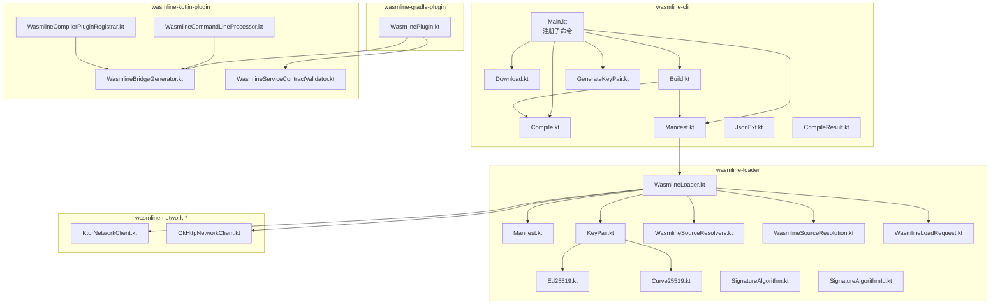
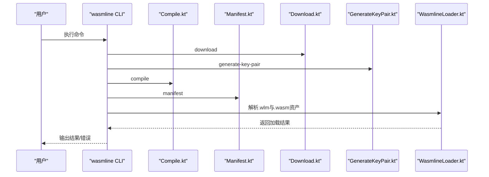
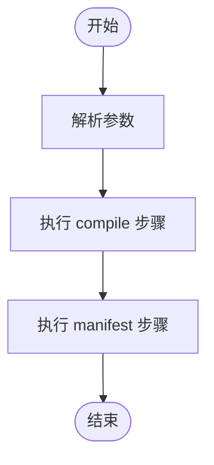
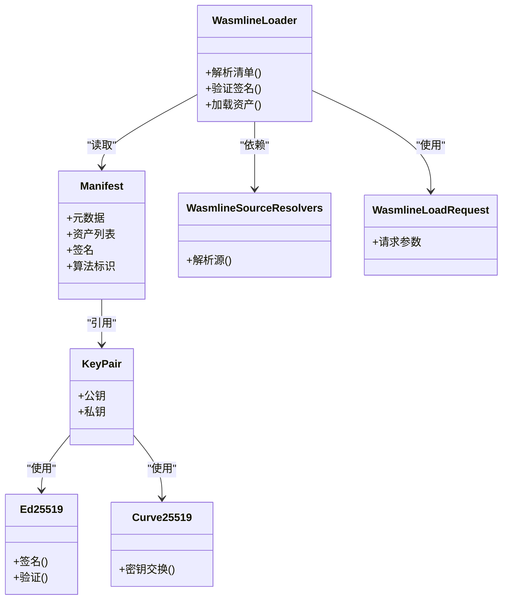
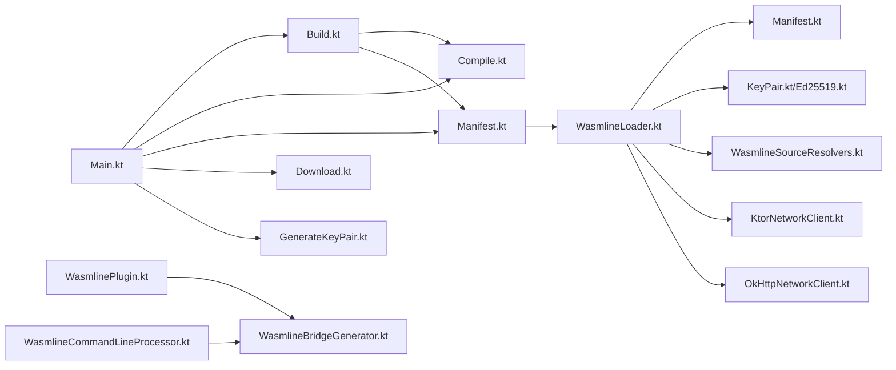

# CLI 工具链

<cite>
**本文引用的文件**
- [Main.kt](file://wasmline-multiplatform/wasmline-cli/src/main/kotlin/crow/wasmline/cli/Main.kt)
- [Build.kt](file://wasmline-multiplatform/wasmline-cli/src/main/kotlin/crow/wasmline/cli/Build.kt)
- [Compile.kt](file://wasmline-multiplatform/wasmline-cli/src/main/kotlin/crow/wasmline/cli/Compile.kt)
- [Manifest.kt](file://wasmline-multiplatform/wasmline-cli/src/main/kotlin/crow/wasmline/cli/Manifest.kt)
- [Download.kt](file://wasmline-multiplatform/wasmline-cli/src/main/kotlin/crow/wasmline/cli/Download.kt)
- [GenerateKeyPair.kt](file://wasmline-multiplatform/wasmline-cli/src/main/kotlin/crow/wasmline/cli/GenerateKeyPair.kt)
- [JsonExt.kt](file://wasmline-multiplatform/wasmline-cli/src/main/kotlin/crow/wasmline/cli/extensions/JsonExt.kt)
- [CompileResult.kt](file://wasmline-multiplatform/wasmline-cli/src/main/kotlin/crow/wasmline/cli/models/CompileResult.kt)
- [cli.sh](file://wasmline-multiplatform/wasmline-cli/cli.sh)
- [download.md](file://wasmline-multiplatform/wasmline-cli/download.md)
- [compile.md](file://wasmline-multiplatform/wasmline-cli/compile.md)
- [manifest.md](file://wasmline-multiplatform/wasmline-cli/manifest.md)
- [keys.md](file://wasmline-multiplatform/wasmline-cli/keys.md)
- [README.md](file://README.md)
- [README_zh.md](file://README_zh.md)
- [WasmlineLoader.kt](file://wasmline-multiplatform/wasmline-loader/src/commonMain/kotlin/crow/wasmline/loader/WasmlineLoader.kt)
- [Manifest.kt](file://wasmline-multiplatform/wasmline-loader/src/commonMain/kotlin/crow/wasmline/loader/model/Manifest.kt)
- [KeyPair.kt](file://wasmline-multiplatform/wasmline-loader/src/commonMain/kotlin/crow/wasmline/loader/internal/crypto/KeyPair.kt)
- [Ed25519.kt](file://wasmline-multiplatform/wasmline-loader/src/commonMain/kotlin/crow/wasmline/loader/internal/crypto/Ed25519.kt)
- [Curve25519.kt](file://wasmline-multiplatform/wasmline-loader/src/commonMain/kotlin/crow/wasmline/loader/internal/crypto/Curve25519.kt)
- [SignatureAlgorithm.kt](file://wasmline-multiplatform/wasmline-loader/src/commonMain/kotlin/crow/wasmline/loader/internal/crypto/SignatureAlgorithm.kt)
- [SignatureAlgorithmId.kt](file://wasmline-multiplatform/wasmline-loader/src/commonMain/kotlin/crow/wasmline/loader/internal/crypto/SignatureAlgorithmId.kt)
- [DefaultWasmlineLoader.kt](file://wasmline-multiplatform/wasmline-loader/src/hostMain/kotlin/crow/wasmline/loader/DefaultWasmlineLoader.kt)
- [WasmlineSource.kt](file://wasmline-multiplatform/wasmline-loader/src/commonMain/kotlin/crow/wasmline/loader/WasmlineSource.kt)
- [WasmlineSourceResolvers.kt](file://wasmline-multiplatform/wasmline-loader/src/commonMain/kotlin/crow/wasmline/loader/WasmlineSourceResolvers.kt)
- [WasmlineSourceResolution.kt](file://wasmline-multiplatform/wasmline-loader/src/commonMain/kotlin/crow/wasmline/loader/WasmlineSourceResolution.kt)
- [WasmlineLoadRequest.kt](file://wasmline-multiplatform/wasmline-loader/src/commonMain/kotlin/crow/wasmline/loader/WasmlineLoadRequest.kt)
- [KtorNetworkClient.kt](file://wasmline-multiplatform/wasmline-network-ktor/src/commonMain/kotlin/crow/wasmline/network/ktor/KtorNetworkClient.kt)
- [OkHttpNetworkClient.kt](file://wasmline-multiplatform/wasmline-network-okhttp/src/commonMain/kotlin/crow/wasmline/network/okhttp/OkHttpNetworkClient.kt)
- [WasmlinePlugin.kt](file://wasmline-multiplatform/wasmline-gradle-plugin/src/main/kotlin/crow/wasmline/WasmlinePlugin.kt)
- [WasmlineCommandLineProcessor.kt](file://wasmline-multiplatform/wasmline-kotlin-plugin/src/main/kotlin/crow/wasmline/kotlin/WasmlineCommandLineProcessor.kt)
- [WasmlineCompilerPluginRegistrar.kt](file://wasmline-multiplatform/wasmline-kotlin-plugin/src/main/kotlin/crow/wasmline/kotlin/WasmlineCompilerPluginRegistrar.kt)
- [WasmlineBridgeGenerator.kt](file://wasmline-multiplatform/wasmline-kotlin-plugin/src/main/kotlin/crow/wasmline/kotlin/WasmlineBridgeGenerator.kt)
- [WasmlineServiceContractValidator.kt](file://wasmline-multiplatform/wasmline-kotlin-plugin/src/main/kotlin/crow/wasmline/kotlin/WasmlineServiceContractValidator.kt)
- [GenerateKeyPairTest.kt](file://wasmline-multiplatform/wasmline-cli/src/test/kotlin/crow/wasmline/cli/GenerateKeyPairTest.kt)
</cite>

## 目录
1. [简介](#简介)
2. [项目结构](#项目结构)
3. [核心组件](#核心组件)
4. [架构总览](#架构总览)
5. [详细组件分析](#详细组件分析)
6. [依赖关系分析](#依赖关系分析)
7. [性能考虑](#性能考虑)
8. [故障排除指南](#故障排除指南)
9. [结论](#结论)
10. [附录](#附录)

## 简介
本文件面向 Wasmline CLI 工具链的使用者与开发者，系统性阐述命令行工具的功能、用法、构建流水线、配置选项、安全与密钥管理、扩展与自定义机制，并提供针对不同平台与部署场景的最佳实践、故障排除与常见问题解答。Wasmline CLI 提供 download、compile、manifest、build、generate-key-pair 等命令，支持多平台打包与签名，配合 Gradle 插件与 Kotlin 编译器插件实现端到端的 WASM 插件构建与加载。

## 项目结构
Wasmline CLI 工具链位于 wasmline-multiplatform/wasmline-cli 模块中，采用 Kotlin/Gradle 构建，命令通过 Clikt 注册为子命令；同时配套有 Gradle 插件与 Kotlin 编译器插件以在构建阶段集成桥接生成与服务绑定校验等能力。CLI 还包含一组 Bash 脚本与 Markdown 文档用于生成帮助与示例。

**图表来源**
- [Main.kt:10-25](file://wasmline-multiplatform/wasmline-cli/src/main/kotlin/crow/wasmline/cli/Main.kt#L10-L25)
- [Build.kt:51-120](file://wasmline-multiplatform/wasmline-cli/src/main/kotlin/crow/wasmline/cli/Build.kt#L51-L120)
- [Compile.kt:41-100](file://wasmline-multiplatform/wasmline-cli/src/main/kotlin/crow/wasmline/cli/Compile.kt#L41-L100)
- [Manifest.kt:39-90](file://wasmline-multiplatform/wasmline-cli/src/main/kotlin/crow/wasmline/cli/Manifest.kt#L39-L90)
- [Download.kt:44-100](file://wasmline-multiplatform/wasmline-cli/src/main/kotlin/crow/wasmline/cli/Download.kt#L44-L100)
- [GenerateKeyPair.kt:1-200](file://wasmline-multiplatform/wasmline-cli/src/main/kotlin/crow/wasmline/cli/GenerateKeyPair.kt#L1-L200)
- [WasmlineLoader.kt:1-200](file://wasmline-multiplatform/wasmline-loader/src/commonMain/kotlin/crow/wasmline/loader/WasmlineLoader.kt#L1-L200)
- [Manifest.kt:1-200](file://wasmline-multiplatform/wasmline-loader/src/commonMain/kotlin/crow/wasmline/loader/model/Manifest.kt#L1-L200)
- [KeyPair.kt:1-200](file://wasmline-multiplatform/wasmline-loader/src/commonMain/kotlin/crow/wasmline/loader/internal/crypto/KeyPair.kt#L1-L200)
- [Ed25519.kt:1-200](file://wasmline-multiplatform/wasmline-loader/src/commonMain/kotlin/crow/wasmline/loader/internal/crypto/Ed25519.kt#L1-L200)
- [Curve25519.kt:1-200](file://wasmline-multiplatform/wasmline-loader/src/commonMain/kotlin/crow/wasmline/loader/internal/crypto/Curve25519.kt#L1-L200)
- [SignatureAlgorithm.kt:1-200](file://wasmline-multiplatform/wasmline-loader/src/commonMain/kotlin/crow/wasmline/loader/internal/crypto/SignatureAlgorithm.kt#L1-L200)
- [SignatureAlgorithmId.kt:1-200](file://wasmline-multiplatform/wasmline-loader/src/commonMain/kotlin/crow/wasmline/loader/internal/crypto/SignatureAlgorithmId.kt#L1-L200)
- [WasmlineSourceResolvers.kt:1-200](file://wasmline-multiplatform/wasmline-loader/src/commonMain/kotlin/crow/wasmline/loader/WasmlineSourceResolvers.kt#L1-L200)
- [WasmlineSourceResolution.kt:1-200](file://wasmline-multiplatform/wasmline-loader/src/commonMain/kotlin/crow/wasmline/loader/WasmlineSourceResolution.kt#L1-L200)
- [WasmlineLoadRequest.kt:1-200](file://wasmline-multiplatform/wasmline-loader/src/commonMain/kotlin/crow/wasmline/loader/WasmlineLoadRequest.kt#L1-L200)
- [KtorNetworkClient.kt:1-200](file://wasmline-multiplatform/wasmline-network-ktor/src/commonMain/kotlin/crow/wasmline/network/ktor/KtorNetworkClient.kt#L1-L200)
- [OkHttpNetworkClient.kt:1-200](file://wasmline-multiplatform/wasmline-network-okhttp/src/commonMain/kotlin/crow/wasmline/network/okhttp/OkHttpNetworkClient.kt#L1-L200)
- [WasmlinePlugin.kt:1-200](file://wasmline-multiplatform/wasmline-gradle-plugin/src/main/kotlin/crow/wasmline/WasmlinePlugin.kt#L1-L200)
- [WasmlineCommandLineProcessor.kt:1-120](file://wasmline-multiplatform/wasmline-kotlin-plugin/src/main/kotlin/crow/wasmline/kotlin/WasmlineCommandLineProcessor.kt#L1-L120)
- [WasmlineCompilerPluginRegistrar.kt:1-120](file://wasmline-multiplatform/wasmline-kotlin-plugin/src/main/kotlin/crow/wasmline/kotlin/WasmlineCompilerPluginRegistrar.kt#L1-L120)
- [WasmlineBridgeGenerator.kt:1-200](file://wasmline-multiplatform/wasmline-kotlin-plugin/src/main/kotlin/crow/wasmline/kotlin/WasmlineBridgeGenerator.kt#L1-L200)
- [WasmlineServiceContractValidator.kt:1-200](file://wasmline-multiplatform/wasmline-kotlin-plugin/src/main/kotlin/crow/wasmline/kotlin/WasmlineServiceContractValidator.kt#L1-L200)

**章节来源**
- [Main.kt:10-25](file://wasmline-multiplatform/wasmline-cli/src/main/kotlin/crow/wasmline/cli/Main.kt#L10-L25)
- [README.md:266-292](file://README.md#L266-L292)
- [README_zh.md:237-263](file://README_zh.md#L237-L263)

## 核心组件
- 命令入口与子命令注册：主程序注册 build、compile、manifest、download、generate-key-pair 五个子命令，并输出版本信息。
- 构建流水线：build 命令串联 compile 与 manifest，完成从 .wasm 到 .cwasm/.pwasm 产物与 .wlm 清单的生成。
- 密钥与签名：generate-key-pair 生成 Ed25519 密钥对；manifest 使用 Ed25519 对清单进行签名。
- 加载与解析：loader 模块负责从本地或远程解析 .wlm 清单与 .cwasm/.pwasm 资产，验证签名与可信密钥列表。
- 网络层：提供基于 Ktor 与 OkHttp 的网络客户端，支持跨平台下载与传输。
- Gradle 插件与 Kotlin 插件：在构建阶段生成桥接代码、校验服务契约、参与打包流程。

**章节来源**
- [Main.kt:10-25](file://wasmline-multiplatform/wasmline-cli/src/main/kotlin/crow/wasmline/cli/Main.kt#L10-L25)
- [Build.kt:51-120](file://wasmline-multiplatform/wasmline-cli/src/main/kotlin/crow/wasmline/cli/Build.kt#L51-L120)
- [Manifest.kt:39-90](file://wasmline-multiplatform/wasmline-cli/src/main/kotlin/crow/wasmline/cli/Manifest.kt#L39-L90)
- [GenerateKeyPair.kt:1-200](file://wasmline-multiplatform/wasmline-cli/src/main/kotlin/crow/wasmline/cli/GenerateKeyPair.kt#L1-L200)
- [WasmlineLoader.kt:1-200](file://wasmline-multiplatform/wasmline-loader/src/commonMain/kotlin/crow/wasmline/loader/WasmlineLoader.kt#L1-L200)
- [KtorNetworkClient.kt:1-200](file://wasmline-multiplatform/wasmline-network-ktor/src/commonMain/kotlin/crow/wasmline/network/ktor/KtorNetworkClient.kt#L1-L200)
- [OkHttpNetworkClient.kt:1-200](file://wasmline-multiplatform/wasmline-network-okhttp/src/commonMain/kotlin/crow/wasmline/network/okhttp/OkHttpNetworkClient.kt#L1-L200)
- [WasmlinePlugin.kt:1-200](file://wasmline-multiplatform/wasmline-gradle-plugin/src/main/kotlin/crow/wasmline/WasmlinePlugin.kt#L1-L200)
- [WasmlineBridgeGenerator.kt:1-200](file://wasmline-multiplatform/wasmline-kotlin-plugin/src/main/kotlin/crow/wasmline/kotlin/WasmlineBridgeGenerator.kt#L1-L200)
- [WasmlineServiceContractValidator.kt:1-200](file://wasmline-multiplatform/wasmline-kotlin-plugin/src/main/kotlin/crow/wasmline/kotlin/WasmlineServiceContractValidator.kt#L1-L200)

## 架构总览
下图展示 CLI 命令与核心模块之间的交互关系，以及构建流水线的关键步骤。

**图表来源**
- [Main.kt:10-25](file://wasmline-multiplatform/wasmline-cli/src/main/kotlin/crow/wasmline/cli/Main.kt#L10-L25)
- [Download.kt:44-100](file://wasmline-multiplatform/wasmline-cli/src/main/kotlin/crow/wasmline/cli/Download.kt#L44-L100)
- [GenerateKeyPair.kt:1-200](file://wasmline-multiplatform/wasmline-cli/src/main/kotlin/crow/wasmline/cli/GenerateKeyPair.kt#L1-L200)
- [Compile.kt:41-100](file://wasmline-multiplatform/wasmline-cli/src/main/kotlin/crow/wasmline/cli/Compile.kt#L41-L100)
- [Manifest.kt:39-90](file://wasmline-multiplatform/wasmline-cli/src/main/kotlin/crow/wasmline/cli/Manifest.kt#L39-L90)
- [WasmlineLoader.kt:1-200](file://wasmline-multiplatform/wasmline-loader/src/commonMain/kotlin/crow/wasmline/loader/WasmlineLoader.kt#L1-L200)

## 详细组件分析

### 命令入口与版本控制
- 入口函数注册 wasmline 主命令，添加子命令数组，并通过版本选项输出版本号。
- 版本来源于构建配置常量，确保 CLI 与构建产物一致。

**章节来源**
- [Main.kt:10-25](file://wasmline-multiplatform/wasmline-cli/src/main/kotlin/crow/wasmline/cli/Main.kt#L10-L25)

### download 命令
- 功能：按指定版本与架构下载 Wasmtime 发行版二进制，支持强制重下。
- 关键参数：版本列表、目标架构、输出目录、是否强制重下。
- 平台默认目标：pulley64、x86_64-linux、aarch64-linux、aarch64-android、aarch64-macos、aarch64-ios、x86_64-windows。
- 使用建议：在 CI 中缓存下载产物，避免重复下载；在多架构场景下明确指定 --arch。

**章节来源**
- [download.md:1-200](file://wasmline-multiplatform/wasmline-cli/download.md#L1-L200)
- [cli.sh:665-673](file://wasmline-multiplatform/wasmline-cli/cli.sh#L665-L673)

### compile 命令
- 功能：将原始 .wasm 编译为平台特定 .cwasm 产物与可移植 .pwasm 镜像。
- 关键参数：输入 .wasm 路径、wasmtime 工具链目录、产品名称、版本、输出根目录、目标架构列表。
- 输出：产物目录包含各架构的 .cwasm 与统一的 .pwasm。
- 最佳实践：在本地与 CI 中分别设置 OUTPUT_DIR 与 NAME/VERSION，便于归档与检索。

**章节来源**
- [compile.md:1-200](file://wasmline-multiplatform/wasmline-cli/compile.md#L1-L200)
- [cli.sh:520-540](file://wasmline-multiplatform/wasmline-cli/cli.sh#L520-L540)

### manifest 命令
- 功能：基于编译产物生成带签名的 .wlm 清单文件。
- 关键参数：编译产物目录、密钥文件路径、算法类型、输出目录。
- 安全要点：使用 Ed25519 签名，清单包含元数据与资产摘要，加载时需校验签名与可信密钥。

**章节来源**
- [manifest.md:1-200](file://wasmline-multiplatform/wasmline-cli/manifest.md#L1-L200)
- [GenerateKeyPair.kt:1-200](file://wasmline-multiplatform/wasmline-cli/src/main/kotlin/crow/wasmline/cli/GenerateKeyPair.kt#L1-L200)

### build 命令
- 功能：执行完整流水线，依次调用 compile 与 manifest。
- 参数：与 compile 和 manifest 的参数组合，如输入、wasmtime 目录、密钥、输出目录、版本等。
- 流程：先 compile，再 manifest，最后可选打包（由上层脚本或 Gradle 插件处理）。

**图表来源**
- [Build.kt:51-120](file://wasmline-multiplatform/wasmline-cli/src/main/kotlin/crow/wasmline/cli/Build.kt#L51-L120)
- [Compile.kt:41-100](file://wasmline-multiplatform/wasmline-cli/src/main/kotlin/crow/wasmline/cli/Compile.kt#L41-L100)
- [Manifest.kt:39-90](file://wasmline-multiplatform/wasmline-cli/src/main/kotlin/crow/wasmline/cli/Manifest.kt#L39-L90)

**章节来源**
- [Build.kt:51-120](file://wasmline-multiplatform/wasmline-cli/src/main/kotlin/crow/wasmline/cli/Build.kt#L51-L120)
- [README.md:276-292](file://README.md#L276-L292)
- [README_zh.md:247-263](file://README_zh.md#L247-L263)

### generate-key-pair 命令
- 功能：生成 Ed25519 密钥对，支持打印到控制台或保存到文件，可指定算法与输出目录。
- 适用场景：首次初始化、CI 中生成并安全存储私钥、多环境密钥轮换。
- 安全建议：私钥仅在受控环境中生成与分发，避免硬编码到仓库。

**章节来源**
- [keys.md:1-200](file://wasmline-multiplatform/wasmline-cli/keys.md#L1-L200)
- [GenerateKeyPair.kt:1-200](file://wasmline-multiplatform/wasmline-cli/src/main/kotlin/crow/wasmline/cli/GenerateKeyPair.kt#L1-L200)

### 加载与解析（loader）
- 清单模型：包含元数据、资产列表、签名与算法标识。
- 密钥与签名：支持 Ed25519 与 Curve25519 等算法，签名算法枚举与标识定义清晰。
- 源解析：支持本地与远程源解析，提供加载请求与解析结果抽象。
- 网络客户端：Ktor 与 OkHttp 实现，适配不同运行时环境。

**图表来源**
- [Manifest.kt:1-200](file://wasmline-multiplatform/wasmline-loader/src/commonMain/kotlin/crow/wasmline/loader/model/Manifest.kt#L1-L200)
- [KeyPair.kt:1-200](file://wasmline-multiplatform/wasmline-loader/src/commonMain/kotlin/crow/wasmline/loader/internal/crypto/KeyPair.kt#L1-L200)
- [Ed25519.kt:1-200](file://wasmline-multiplatform/wasmline-loader/src/commonMain/kotlin/crow/wasmline/loader/internal/crypto/Ed25519.kt#L1-L200)
- [Curve25519.kt:1-200](file://wasmline-multiplatform/wasmline-loader/src/commonMain/kotlin/crow/wasmline/loader/internal/crypto/Curve25519.kt#L1-L200)
- [WasmlineLoader.kt:1-200](file://wasmline-multiplatform/wasmline-loader/src/commonMain/kotlin/crow/wasmline/loader/WasmlineLoader.kt#L1-L200)
- [WasmlineSourceResolvers.kt:1-200](file://wasmline-multiplatform/wasmline-loader/src/commonMain/kotlin/crow/wasmline/loader/WasmlineSourceResolvers.kt#L1-L200)
- [WasmlineLoadRequest.kt:1-200](file://wasmline-multiplatform/wasmline-loader/src/commonMain/kotlin/crow/wasmline/loader/WasmlineLoadRequest.kt#L1-L200)

**章节来源**
- [Manifest.kt:1-200](file://wasmline-multiplatform/wasmline-loader/src/commonMain/kotlin/crow/wasmline/loader/model/Manifest.kt#L1-L200)
- [KeyPair.kt:1-200](file://wasmline-multiplatform/wasmline-loader/src/commonMain/kotlin/crow/wasmline/loader/internal/crypto/KeyPair.kt#L1-L200)
- [Ed25519.kt:1-200](file://wasmline-multiplatform/wasmline-loader/src/commonMain/kotlin/crow/wasmline/loader/internal/crypto/Ed25519.kt#L1-L200)
- [Curve25519.kt:1-200](file://wasmline-multiplatform/wasmline-loader/src/commonMain/kotlin/crow/wasmline/loader/internal/crypto/Curve25519.kt#L1-L200)
- [WasmlineLoader.kt:1-200](file://wasmline-multiplatform/wasmline-loader/src/commonMain/kotlin/crow/wasmline/loader/WasmlineLoader.kt#L1-L200)
- [WasmlineSourceResolvers.kt:1-200](file://wasmline-multiplatform/wasmline-loader/src/commonMain/kotlin/crow/wasmline/loader/WasmlineSourceResolvers.kt#L1-L200)
- [WasmlineLoadRequest.kt:1-200](file://wasmline-multiplatform/wasmline-loader/src/commonMain/kotlin/crow/wasmline/loader/WasmlineLoadRequest.kt#L1-L200)

### Gradle 插件与 Kotlin 插件
- Gradle 插件：提供任务与配置项，参与桥接生成与服务契约校验，驱动打包流程。
- Kotlin 插件：在编译期生成桥接代码、注册命令行处理器、校验服务契约，确保类型安全与运行时兼容。

**章节来源**
- [WasmlinePlugin.kt:1-200](file://wasmline-multiplatform/wasmline-gradle-plugin/src/main/kotlin/crow/wasmline/WasmlinePlugin.kt#L1-L200)
- [WasmlineCommandLineProcessor.kt:1-120](file://wasmline-multiplatform/wasmline-kotlin-plugin/src/main/kotlin/crow/wasmline/kotlin/WasmlineCommandLineProcessor.kt#L1-L120)
- [WasmlineCompilerPluginRegistrar.kt:1-120](file://wasmline-multiplatform/wasmline-kotlin-plugin/src/main/kotlin/crow/wasmline/kotlin/WasmlineCompilerPluginRegistrar.kt#L1-L120)
- [WasmlineBridgeGenerator.kt:1-200](file://wasmline-multiplatform/wasmline-kotlin-plugin/src/main/kotlin/crow/wasmline/kotlin/WasmlineBridgeGenerator.kt#L1-L200)
- [WasmlineServiceContractValidator.kt:1-200](file://wasmline-multiplatform/wasmline-kotlin-plugin/src/main/kotlin/crow/wasmline/kotlin/WasmlineServiceContractValidator.kt#L1-L200)

## 依赖关系分析
- 命令层依赖：Main.kt 依赖各子命令类；build 命令顺序依赖 compile 与 manifest。
- 加载层依赖：loader 依赖清单模型、密钥与签名算法、源解析器与网络客户端。
- 插件层依赖：Gradle 与 Kotlin 插件依赖桥接生成器与契约校验器。

**图表来源**
- [Main.kt:10-25](file://wasmline-multiplatform/wasmline-cli/src/main/kotlin/crow/wasmline/cli/Main.kt#L10-L25)
- [Build.kt:51-120](file://wasmline-multiplatform/wasmline-cli/src/main/kotlin/crow/wasmline/cli/Build.kt#L51-L120)
- [Compile.kt:41-100](file://wasmline-multiplatform/wasmline-cli/src/main/kotlin/crow/wasmline/cli/Compile.kt#L41-L100)
- [Manifest.kt:39-90](file://wasmline-multiplatform/wasmline-cli/src/main/kotlin/crow/wasmline/cli/Manifest.kt#L39-L90)
- [Download.kt:44-100](file://wasmline-multiplatform/wasmline-cli/src/main/kotlin/crow/wasmline/cli/Download.kt#L44-L100)
- [GenerateKeyPair.kt:1-200](file://wasmline-multiplatform/wasmline-cli/src/main/kotlin/crow/wasmline/cli/GenerateKeyPair.kt#L1-L200)
- [WasmlineLoader.kt:1-200](file://wasmline-multiplatform/wasmline-loader/src/commonMain/kotlin/crow/wasmline/loader/WasmlineLoader.kt#L1-L200)
- [Manifest.kt:1-200](file://wasmline-multiplatform/wasmline-loader/src/commonMain/kotlin/crow/wasmline/loader/model/Manifest.kt#L1-L200)
- [KeyPair.kt:1-200](file://wasmline-multiplatform/wasmline-loader/src/commonMain/kotlin/crow/wasmline/loader/internal/crypto/KeyPair.kt#L1-L200)
- [Ed25519.kt:1-200](file://wasmline-multiplatform/wasmline-loader/src/commonMain/kotlin/crow/wasmline/loader/internal/crypto/Ed25519.kt#L1-L200)
- [WasmlineSourceResolvers.kt:1-200](file://wasmline-multiplatform/wasmline-loader/src/commonMain/kotlin/crow/wasmline/loader/WasmlineSourceResolvers.kt#L1-L200)
- [KtorNetworkClient.kt:1-200](file://wasmline-multiplatform/wasmline-network-ktor/src/commonMain/kotlin/crow/wasmline/network/ktor/KtorNetworkClient.kt#L1-L200)
- [OkHttpNetworkClient.kt:1-200](file://wasmline-multiplatform/wasmline-network-okhttp/src/commonMain/kotlin/crow/wasmline/network/okhttp/OkHttpNetworkClient.kt#L1-L200)
- [WasmlinePlugin.kt:1-200](file://wasmline-multiplatform/wasmline-gradle-plugin/src/main/kotlin/crow/wasmline/WasmlinePlugin.kt#L1-L200)
- [WasmlineBridgeGenerator.kt:1-200](file://wasmline-multiplatform/wasmline-kotlin-plugin/src/main/kotlin/crow/wasmline/kotlin/WasmlineBridgeGenerator.kt#L1-L200)
- [WasmlineCommandLineProcessor.kt:1-120](file://wasmline-multiplatform/wasmline-kotlin-plugin/src/main/kotlin/crow/wasmline/kotlin/WasmlineCommandLineProcessor.kt#L1-L120)

**章节来源**
- [Main.kt:10-25](file://wasmline-multiplatform/wasmline-cli/src/main/kotlin/crow/wasmline/cli/Main.kt#L10-L25)
- [Build.kt:51-120](file://wasmline-multiplatform/wasmline-cli/src/main/kotlin/crow/wasmline/cli/Build.kt#L51-L120)
- [Manifest.kt:39-90](file://wasmline-multiplatform/wasmline-cli/src/main/kotlin/crow/wasmline/cli/Manifest.kt#L39-L90)
- [WasmlineLoader.kt:1-200](file://wasmline-multiplatform/wasmline-loader/src/commonMain/kotlin/crow/wasmline/loader/WasmlineLoader.kt#L1-L200)

## 性能考虑
- 缓存策略：download 命令支持强制重下，建议在 CI 中缓存下载产物，减少网络开销。
- 多架构编译：compile 命令支持选择架构列表，建议仅编译必要架构，缩短构建时间。
- 清单签名：manifest 命令使用 Ed25519，签名与验证性能良好，适合高频加载场景。
- 网络传输：根据运行时选择合适的网络客户端（Ktor 或 OkHttp），在移动端与桌面端优化连接池与超时设置。

[本节为通用性能建议，不直接分析具体文件]

## 故障排除指南
- 无法找到 Wasmtime 工具链：确认 download 命令已成功下载对应版本与架构，并正确传递 --wasmtime 参数。
- 密钥文件权限问题：generate-key-pair 生成的私钥应妥善保管，避免权限泄露；加载时确保路径可访问。
- 清单签名验证失败：检查密钥算法与清单算法一致性，确认清单未被篡改且在可信密钥列表中。
- 多架构产物缺失：compile 命令未包含所需架构时，重新执行并明确 --arch 参数。
- CI 缓存命中率低：统一设置 OUTPUT_DIR、NAME 与 VERSION，确保产物命名稳定，提升缓存命中。

**章节来源**
- [GenerateKeyPairTest.kt:60-120](file://wasmline-multiplatform/wasmline-cli/src/test/kotlin/crow/wasmline/cli/GenerateKeyPairTest.kt#L60-L120)
- [WasmlineLoader.kt:1-200](file://wasmline-multiplatform/wasmline-loader/src/commonMain/kotlin/crow/wasmline/loader/WasmlineLoader.kt#L1-L200)

## 结论
Wasmline CLI 工具链提供了从下载工具链、编译产物、生成清单到加载验证的完整能力，结合 Gradle 与 Kotlin 插件实现了端到端的多平台 WASM 插件开发体验。通过合理的参数配置、密钥管理与缓存策略，可在不同平台与部署场景中高效、安全地交付 WASM 插件。

[本节为总结性内容，不直接分析具体文件]

## 附录

### 命令参考与示例
- 命令集与流水线执行示例见项目根目录文档。
- 各命令的帮助与参数详见对应 Markdown 文档与 Bash 脚本生成的帮助页。

**章节来源**
- [README.md:266-292](file://README.md#L266-L292)
- [README_zh.md:237-263](file://README_zh.md#L237-L263)
- [download.md:1-200](file://wasmline-multiplatform/wasmline-cli/download.md#L1-L200)
- [compile.md:1-200](file://wasmline-multiplatform/wasmline-cli/compile.md#L1-L200)
- [manifest.md:1-200](file://wasmline-multiplatform/wasmline-cli/manifest.md#L1-L200)
- [keys.md:1-200](file://wasmline-multiplatform/wasmline-cli/keys.md#L1-L200)