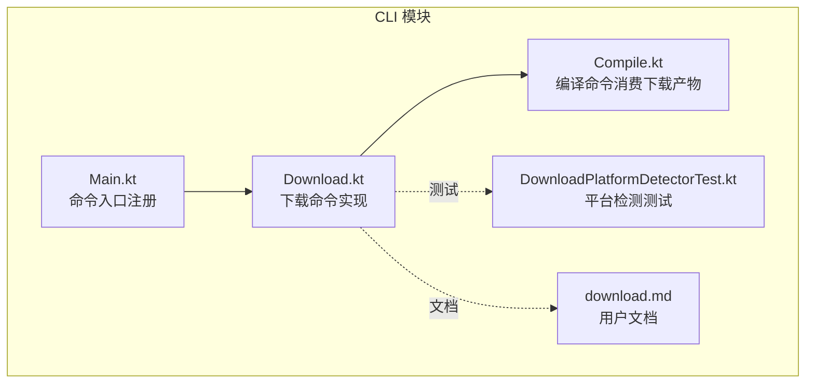
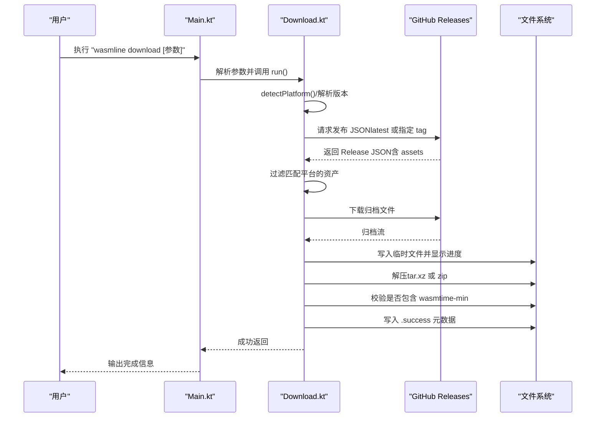
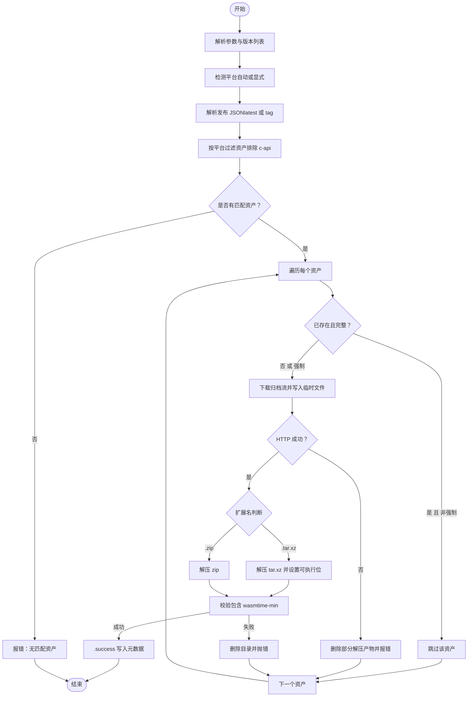
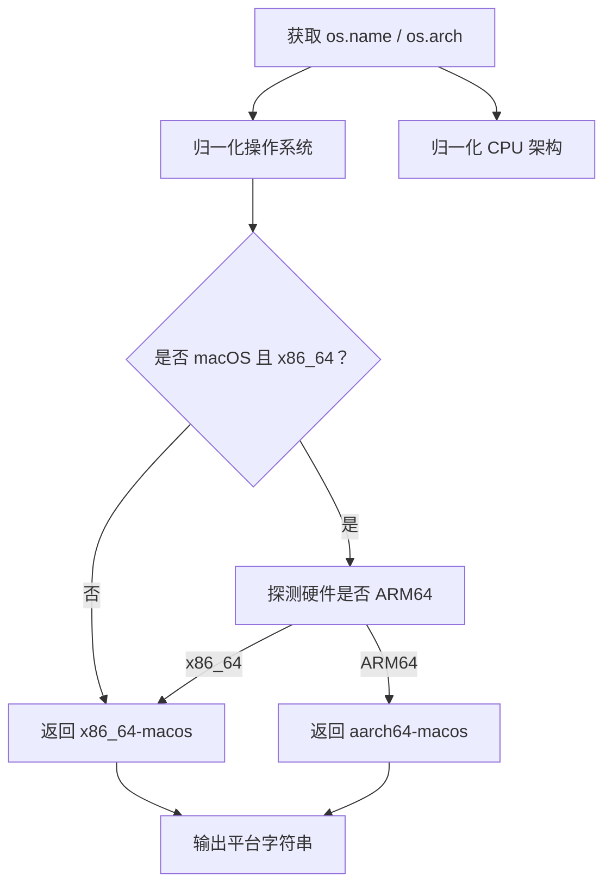
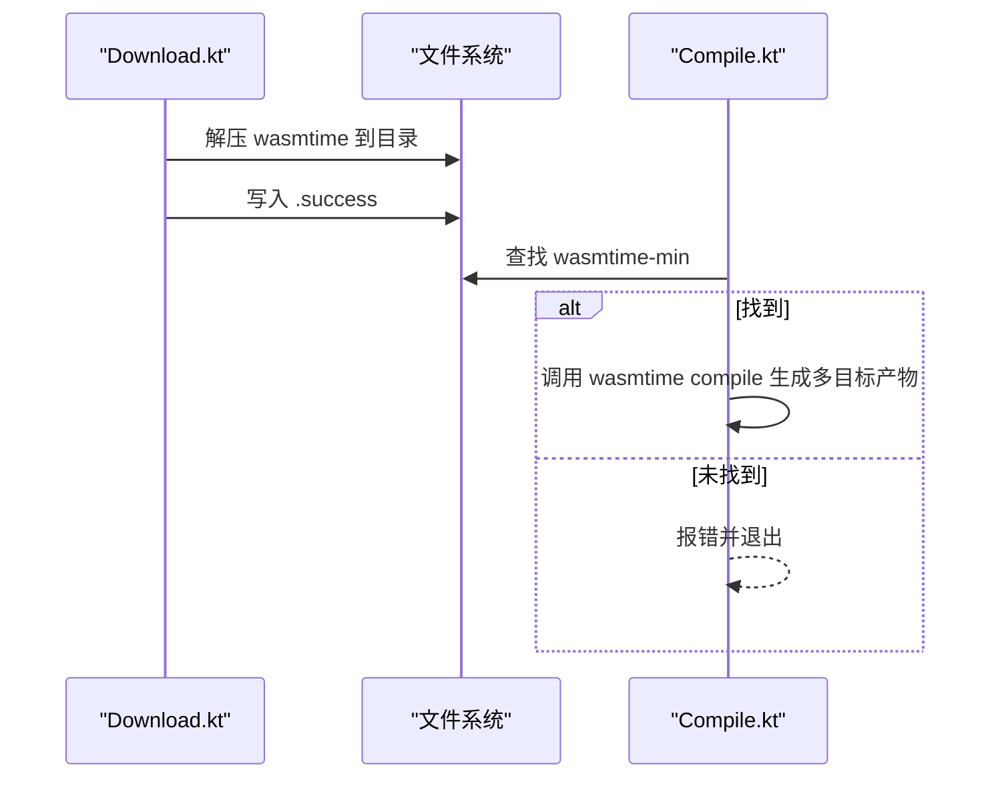
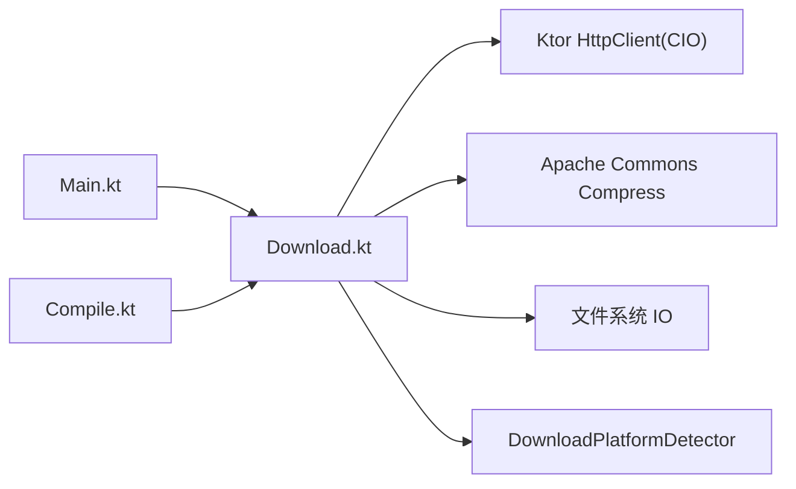

# 下载命令

<cite>
**本文引用的文件**
- [Download.kt](file://wasmline-multiplatform/wasmline-cli/src/main/kotlin/crow/wasmline/cli/Download.kt)
- [download.md](file://wasmline-multiplatform/wasmline-cli/download.md)
- [DownloadPlatformDetectorTest.kt](file://wasmline-multiplatform/wasmline-cli/src/test/kotlin/crow/wasmline/cli/DownloadPlatformDetectorTest.kt)
- [Compile.kt](file://wasmline-multiplatform/wasmline-cli/src/main/kotlin/crow/wasmline/cli/Compile.kt)
- [Main.kt](file://wasmline-multiplatform/wasmline-cli/src/main/kotlin/crow/wasmline/cli/Main.kt)
</cite>

## 目录
1. [简介](#简介)
2. [项目结构](#项目结构)
3. [核心组件](#核心组件)
4. [架构总览](#架构总览)
5. [详细组件分析](#详细组件分析)
6. [依赖关系分析](#依赖关系分析)
7. [性能考虑](#性能考虑)
8. [故障排除指南](#故障排除指南)
9. [结论](#结论)
10. [附录](#附录)

## 简介
本文件面向开发者与使用者，系统化说明 Wasmline CLI 的 download 子命令：如何下载并解压 Wasmtime 工具链（wasmtime-min）到本地，支持多版本、多平台、自定义输出目录与强制重下。文档覆盖平台检测与自动适配、下载参数与行为、错误处理与排障、最佳实践与性能优化建议，并提供完整使用示例与参考路径。

## 项目结构
download 命令位于 wasmline-cli 模块中，核心实现与文档如下：
- 命令实现：wasmline-multiplatform/wasmline-cli/src/main/kotlin/crow/wasmline/cli/Download.kt
- 使用文档：wasmline-multiplatform/wasmline-cli/download.md
- 平台检测单元测试：wasmline-multiplatform/wasmline-cli/src/test/kotlin/crow/wasmline/cli/DownloadPlatformDetectorTest.kt
- 编译命令（与下载结果配合使用）：wasmline-multiplatform/wasmline-cli/src/main/kotlin/crow/wasmline/cli/Compile.kt
- CLI 入口注册：wasmline-multiplatform/wasmline-cli/src/main/kotlin/crow/wasmline/cli/Main.kt

**图示来源**
- [Download.kt:45-335](file://wasmline-multiplatform/wasmline-cli/src/main/kotlin/crow/wasmline/cli/Download.kt#L45-L335)
- [Main.kt:10-25](file://wasmline-multiplatform/wasmline-cli/src/main/kotlin/crow/wasmline/cli/Main.kt#L10-L25)
- [Compile.kt:42-349](file://wasmline-multiplatform/wasmline-cli/src/main/kotlin/crow/wasmline/cli/Compile.kt#L42-L349)
- [DownloadPlatformDetectorTest.kt:1-55](file://wasmline-multiplatform/wasmline-cli/src/test/kotlin/crow/wasmline/cli/DownloadPlatformDetectorTest.kt#L1-L55)
- [download.md:1-65](file://wasmline-multiplatform/wasmline-cli/download.md#L1-L65)

**章节来源**
- [Main.kt:10-25](file://wasmline-multiplatform/wasmline-cli/src/main/kotlin/crow/wasmline/cli/Main.kt#L10-L25)
- [download.md:1-65](file://wasmline-multiplatform/wasmline-cli/download.md#L1-L65)

## 核心组件
- 下载命令类：负责解析参数、执行版本解析、过滤资产、下载与解压、写入成功标记、失败回滚与进度展示。
- 平台检测器：根据系统属性与硬件信息推导当前平台字符串，用于资产筛选。
- 编译命令：消费下载得到的 wasmtime-min 可执行文件进行多目标 AOT/Pulley 编译。
- CLI 入口：注册 download 子命令供全局调用。

关键职责与行为要点：
- 版本管理：支持 latest、具体版本号（含 v 前缀与 release- 前缀变体）；可一次指定多个版本。
- 平台选择：默认自动检测；支持显式指定架构或“all”下载全部。
- 输出布局：每个版本解压到独立子目录，包含 .success 文件记录元数据。
- 强制重下：当启用 -f/--force 时，即使存在成功标记也会重新下载与校验。
- 错误处理：网络失败、资产缺失、解压失败、未包含期望可执行文件等均会抛出异常并清理临时目录。

**章节来源**
- [Download.kt:45-335](file://wasmline-multiplatform/wasmline-cli/src/main/kotlin/crow/wasmline/cli/Download.kt#L45-L335)
- [Compile.kt:42-349](file://wasmline-multiplatform/wasmline-cli/src/main/kotlin/crow/wasmline/cli/Compile.kt#L42-L349)

## 架构总览
download 命令在 CLI 中作为子命令运行，其内部通过 HTTP 客户端访问 GitHub Releases，解析 JSON 获取资产列表，按平台筛选后下载对应归档，再解压到输出目录。下载产物由编译命令消费以生成多平台二进制产物。

**图示来源**
- [Main.kt:10-25](file://wasmline-multiplatform/wasmline-cli/src/main/kotlin/crow/wasmline/cli/Main.kt#L10-L25)
- [Download.kt:73-189](file://wasmline-multiplatform/wasmline-cli/src/main/kotlin/crow/wasmline/cli/Download.kt#L73-L189)

## 详细组件分析

### 下载命令类（Download）
职责与流程：
- 参数解析：版本列表、架构、输出目录、强制重下。
- 平台检测：若未显式指定架构，则自动推导当前平台字符串。
- 版本解析：latest 或具体 tag；支持多种 tag 变体；逐个尝试直到找到包含 assets 的发布。
- 资产筛选：排除 c-api 类型，按平台字符串匹配；支持 “all” 下载全部。
- 下载与解压：基于扩展名选择 tar.xz 或 zip 解压；设置可执行权限（非 Windows）。
- 成功标记：写入 .success 文件记录版本、平台与下载地址。
- 失败处理：删除部分解压产物、抛出异常并清理临时文件。

**图示来源**
- [Download.kt:73-189](file://wasmline-multiplatform/wasmline-cli/src/main/kotlin/crow/wasmline/cli/Download.kt#L73-L189)

**章节来源**
- [Download.kt:45-335](file://wasmline-multiplatform/wasmline-cli/src/main/kotlin/crow/wasmline/cli/Download.kt#L45-L335)

### 平台检测器（DownloadPlatformDetector）
能力与规则：
- 归一化操作系统名称：Windows、macOS、Linux、Android 映射为统一标识。
- 归一化 CPU 架构：x86_64、aarch64 统一映射。
- Apple Silicon 特判：当检测到 macOS 且 JVM 为 x86_64 但硬件为 ARM64 时，优先返回 aarch64-macos，确保与宿主一致。
- 输出格式：形如 “架构-操作系统”，例如 “aarch64-macos”、“x86_64-linux”。

**图示来源**
- [Download.kt:337-390](file://wasmline-multiplatform/wasmline-cli/src/main/kotlin/crow/wasmline/cli/Download.kt#L337-L390)

**章节来源**
- [Download.kt:337-390](file://wasmline-multiplatform/wasmline-cli/src/main/kotlin/crow/wasmline/cli/Download.kt#L337-L390)
- [DownloadPlatformDetectorTest.kt:8-53](file://wasmline-multiplatform/wasmline-cli/src/test/kotlin/crow/wasmline/cli/DownloadPlatformDetectorTest.kt#L8-L53)

### 编译命令（Compile）与下载产物的关系
- 下载命令产出的 wasmtime-min 可执行文件，由编译命令消费，用于将 .wasm 编译为多平台 AOT/Pulley 产物。
- 编译命令会先在指定目录内查找 wasmtime-min，找不到则报错并退出。
- 下载命令与编译命令共同构成“下载工具 + 编译产物”的完整工作流。

**图示来源**
- [Download.kt:120-189](file://wasmline-multiplatform/wasmline-cli/src/main/kotlin/crow/wasmline/cli/Download.kt#L120-L189)
- [Compile.kt:77-108](file://wasmline-multiplatform/wasmline-cli/src/main/kotlin/crow/wasmline/cli/Compile.kt#L77-L108)

**章节来源**
- [Compile.kt:42-349](file://wasmline-multiplatform/wasmline-cli/src/main/kotlin/crow/wasmline/cli/Compile.kt#L42-L349)

## 依赖关系分析
- 下载命令依赖：
  - HTTP 客户端（Ktor CIO）用于请求 GitHub Releases。
  - Apache Commons Compress 用于 tar.xz 与 zip 解压。
  - 本地文件系统 IO 与进度打印。
- 平台检测依赖系统属性与可选的硬件探测命令。
- CLI 注册依赖 Ajalt Clikt，Main.kt 将 Download 作为子命令注册。

**图示来源**
- [Download.kt:14-36](file://wasmline-multiplatform/wasmline-cli/src/main/kotlin/crow/wasmline/cli/Download.kt#L14-L36)
- [Main.kt:13-22](file://wasmline-multiplatform/wasmline-cli/src/main/kotlin/crow/wasmline/cli/Main.kt#L13-L22)
- [Compile.kt:42-108](file://wasmline-multiplatform/wasmline-cli/src/main/kotlin/crow/wasmline/cli/Compile.kt#L42-L108)

**章节来源**
- [Download.kt:14-36](file://wasmline-multiplatform/wasmline-cli/src/main/kotlin/crow/wasmline/cli/Download.kt#L14-L36)
- [Main.kt:13-22](file://wasmline-multiplatform/wasmline-cli/src/main/kotlin/crow/wasmline/cli/Main.kt#L13-L22)

## 性能考虑
- 并发与调度：下载过程在 IO 调度器上运行，避免阻塞主线程；单次下载采用流式读取与缓冲写入，降低内存峰值。
- 进度显示：基于响应头中的内容长度计算百分比，实时刷新进度条，便于长耗时网络环境下的反馈。
- 解压策略：按归档类型分别处理，保持解压路径与权限设置的一致性。
- 多版本批量：对每个版本独立处理，失败不影响其他版本的继续尝试。
- 建议：
  - 在弱网环境下，适当增大缓冲区或减少同时并发任务数。
  - 若仅需特定平台，建议显式指定 -a 以减少无效下载与解压。
  - 使用 -f 强制重下前确认缓存损坏或需要替换，避免不必要的重复下载。

**章节来源**
- [Download.kt:73-189](file://wasmline-multiplatform/wasmline-cli/src/main/kotlin/crow/wasmline/cli/Download.kt#L73-L189)

## 故障排除指南
常见问题与定位思路：
- 无法解析版本
  - 现象：提示无法解析指定版本或缺少 assets。
  - 排查：确认版本标签格式（支持 v 前缀与 release- 前缀）；检查网络连通性与 GitHub API 可达性。
  - 参考路径：[Download.kt:191-215](file://wasmline-multiplatform/wasmline-cli/src/main/kotlin/crow/wasmline/cli/Download.kt#L191-L215)
- 无匹配资产
  - 现象：提示没有匹配当前平台的资产。
  - 排查：确认平台字符串（-a 显式指定）或检查自动检测结果；确认下载的是非 c-api 类型资产。
  - 参考路径：[Download.kt:109-118](file://wasmline-multiplatform/wasmline-cli/src/main/kotlin/crow/wasmline/cli/Download.kt#L109-L118)
- 下载失败（HTTP 非成功状态）
  - 现象：下载响应非成功状态码。
  - 排查：检查网络代理、证书、速率限制；必要时更换镜像源或稍后重试。
  - 参考路径：[Download.kt:140-144](file://wasmline-multiplatform/wasmline-cli/src/main/kotlin/crow/wasmline/cli/Download.kt#L140-L144)
- 解压失败或未包含 wasmtime-min
  - 现象：解压后未发现 wasmtime-min 可执行文件。
  - 排查：确认归档类型正确；检查 .success 文件是否存在；必要时使用 -f 强制重下。
  - 参考路径：[Download.kt:161-188](file://wasmline-multiplatform/wasmline-cli/src/main/kotlin/crow/wasmline/cli/Download.kt#L161-L188)
- 平台检测不符合预期
  - 现象：Apple Silicon 上仍被识别为 x86_64。
  - 排查：确认系统属性与硬件探测命令可用；必要时显式传入 -a aarch64-macos。
  - 参考路径：[Download.kt:337-390](file://wasmline-multiplatform/wasmline-cli/src/main/kotlin/crow/wasmline/cli/Download.kt#L337-L390)
  - 单元测试参考：[DownloadPlatformDetectorTest.kt:8-53](file://wasmline-multiplatform/wasmline-cli/src/test/kotlin/crow/wasmline/cli/DownloadPlatformDetectorTest.kt#L8-L53)

**章节来源**
- [Download.kt:109-188](file://wasmline-multiplatform/wasmline-cli/src/main/kotlin/crow/wasmline/cli/Download.kt#L109-L188)
- [DownloadPlatformDetectorTest.kt:8-53](file://wasmline-multiplatform/wasmline-cli/src/test/kotlin/crow/wasmline/cli/DownloadPlatformDetectorTest.kt#L8-L53)

## 结论
download 子命令提供了稳定、可复现的 Wasmtime 工具链下载能力，具备完善的平台检测、版本管理、资产筛选与解压校验机制。结合编译命令，可形成从工具链到多平台产物的完整流水线。建议在 CI 与本地开发中统一使用 -a 显式指定平台、合理利用 -f 控制缓存策略，并关注网络与权限问题以提升稳定性与性能。

## 附录

### 使用示例与参数说明
- 下载最新版本（当前平台）
  - 示例：./gradlew :wasmline-cli:run --args="download"
  - 参考路径：[download.md:3-7](file://wasmline-multiplatform/wasmline-cli/download.md#L3-L7)
- 下载指定版本
  - 示例：./gradlew :wasmline-cli:run --args="download -v v45.0.0"
  - 参考路径：[download.md:11-15](file://wasmline-multiplatform/wasmline-cli/download.md#L11-L15)
- 下载多个版本
  - 示例：./gradlew :wasmline-cli:run --args="download -v v45.0.0,latest"
  - 参考路径：[download.md:17-21](file://wasmline-multiplatform/wasmline-cli/download.md#L17-L21)
- 指定架构
  - 示例：./gradlew :wasmline-cli:run --args="download -a aarch64-macos"
  - 参考路径：[download.md:23-27](file://wasmline-multiplatform/wasmline-cli/download.md#L23-L27)
- 下载全部架构
  - 示例：./gradlew :wasmline-cli:run --args="download -a all"
  - 参考路径：[download.md:29-33](file://wasmline-multiplatform/wasmline-cli/download.md#L29-L33)
- 自定义输出目录
  - 示例：./gradlew :wasmline-cli:run --args="download -o build/wasmline/wasmtime"
  - 参考路径：[download.md:35-39](file://wasmline-multiplatform/wasmline-cli/download.md#L35-L39)
- 强制重下
  - 示例：./gradlew :wasmline-cli:run --args="download -v v45.0.0 -f"
  - 参考路径：[download.md:41-45](file://wasmline-multiplatform/wasmline-cli/download.md#L41-L45)
- 输出布局示例
  - 参考路径：[download.md:47-55](file://wasmline-multiplatform/wasmline-cli/download.md#L47-L55)

参数表（来自文档）：
- -v, --versions：要下载的 Wasmtime 版本（可重复、逗号分隔，默认 latest）
- -a, --arch：目标架构（如 aarch64-macos、x86_64-linux、all，默认自动检测）
- -o, --output：输出目录（默认 build/wasmline/wasmtime）
- -f, --force：强制重下（默认 false）

**章节来源**
- [download.md:1-65](file://wasmline-multiplatform/wasmline-cli/download.md#L1-L65)