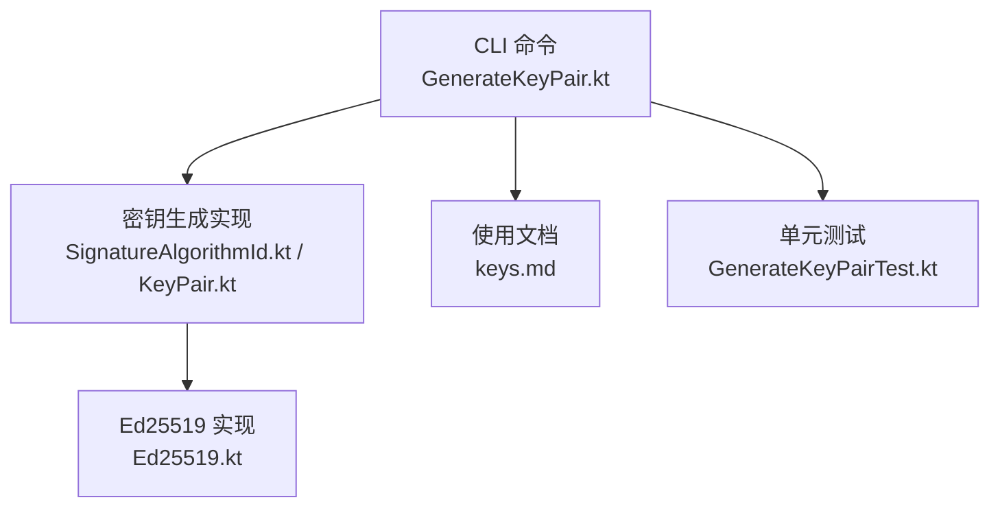
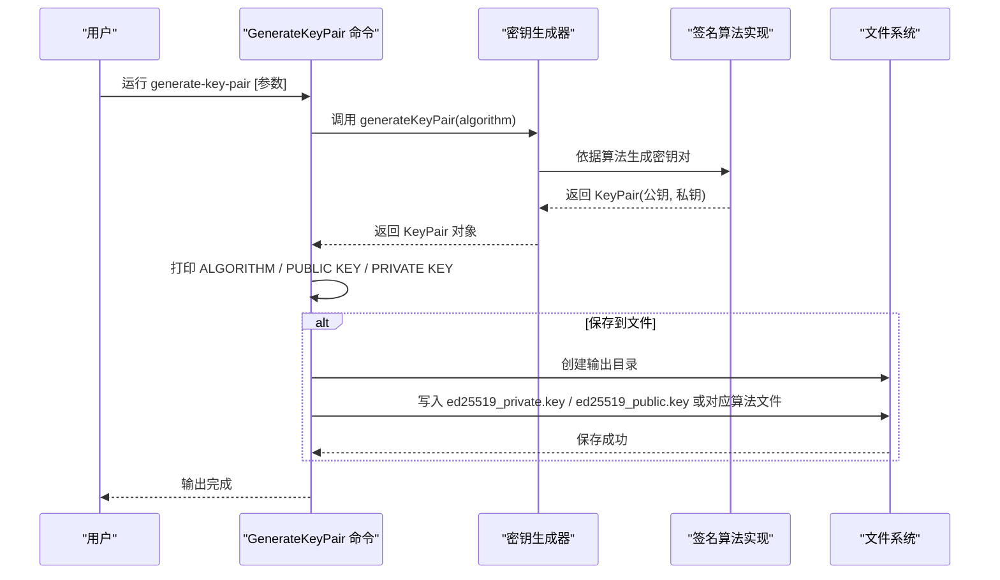
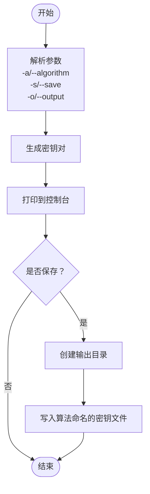
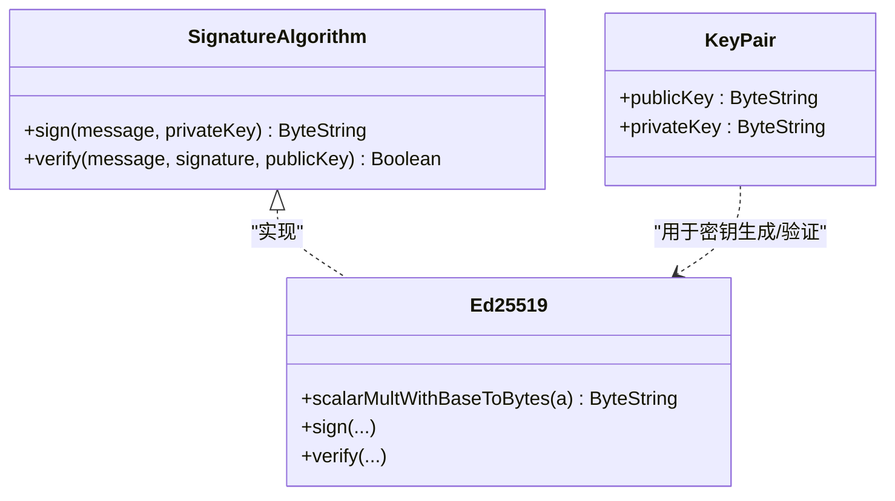
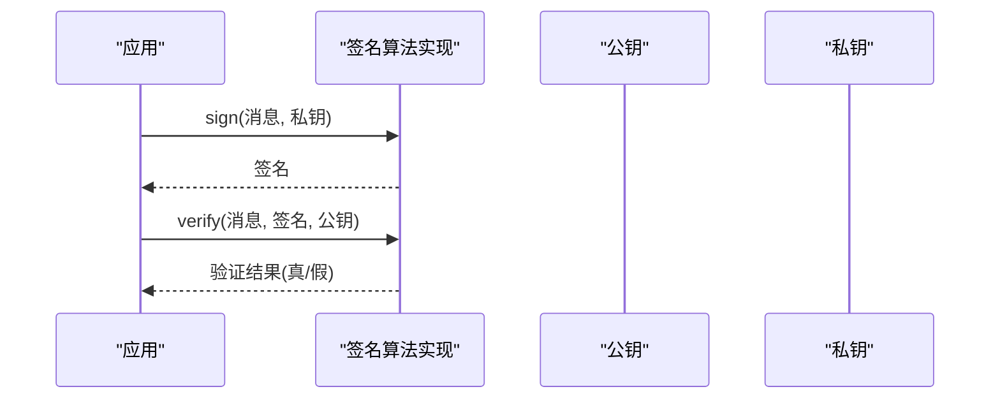
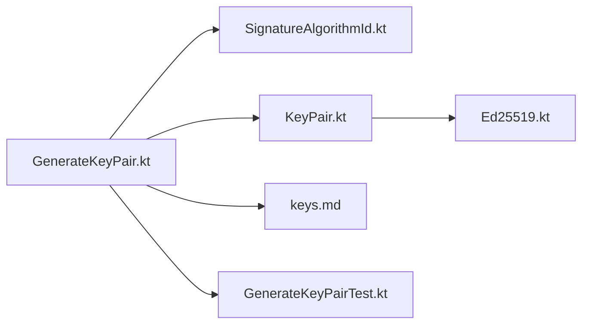

# 密钥管理

<cite>
**本文引用的文件**
- [GenerateKeyPair.kt](file://wasmline-multiplatform/wasmline-cli/src/main/kotlin/crow/wasmline/cli/GenerateKeyPair.kt)
- [keys.md](file://wasmline-multiplatform/wasmline-cli/keys.md)
- [GenerateKeyPairTest.kt](file://wasmline-multiplatform/wasmline-cli/src/test/kotlin/crow/wasmline/cli/GenerateKeyPairTest.kt)
- [SignatureAlgorithmId.kt](file://wasmline-multiplatform/wasmline-loader/src/commonMain/kotlin/crow/wasmline/loader/internal/crypto/SignatureAlgorithmId.kt)
- [SignatureAlgorithm.kt](file://wasmline-multiplatform/wasmline-loader/src/commonMain/kotlin/crow/wasmline/loader/internal/crypto/SignatureAlgorithm.kt)
- [KeyPair.kt](file://wasmline-multiplatform/wasmline-loader/src/commonMain/kotlin/crow/wasmline/loader/internal/crypto/KeyPair.kt)
- [Ed25519.kt](file://wasmline-multiplatform/wasmline-loader/src/commonMain/kotlin/crow/wasmline/loader/internal/crypto/Ed25519.kt)
</cite>

## 目录
1. [简介](#简介)
2. [项目结构](#项目结构)
3. [核心组件](#核心组件)
4. [架构总览](#架构总览)
5. [详细组件分析](#详细组件分析)
6. [依赖关系分析](#依赖关系分析)
7. [性能考量](#性能考量)
8. [故障排查指南](#故障排查指南)
9. [结论](#结论)
10. [附录](#附录)

## 简介
本文件面向 Wasmline 的密钥管理功能，聚焦于命令行工具 generate-key-pair 的使用与实现，覆盖以下主题：
- 命令功能与用法：密钥生成、密钥输出、密钥保存到文件
- 算法与参数：密钥类型（Ed25519、EcdsaP256）选择、默认行为、输出格式
- 密钥存储与命名：保存目录、文件命名规则
- 密钥验证与签名流程：签名接口契约、验证流程概览
- 最佳实践与安全建议：密钥长度、编码格式、安全参数
- 生命周期与故障恢复：密钥生成、存储、验证、轮换与备份策略

## 项目结构
与密钥管理直接相关的模块与文件如下：
- CLI 命令：GenerateKeyPair.kt 提供 generate-key-pair 子命令
- 文档：keys.md 提供命令使用说明与示例
- 测试：GenerateKeyPairTest.kt 验证输出格式与算法行为
- 加密实现：SignatureAlgorithmId.kt、SignatureAlgorithm.kt、KeyPair.kt、Ed25519.kt 定义算法与密钥对模型

**图表来源**
- [GenerateKeyPair.kt:1-82](file://wasmline-multiplatform/wasmline-cli/src/main/kotlin/crow/wasmline/cli/GenerateKeyPair.kt#L1-L82)
- [keys.md:1-50](file://wasmline-multiplatform/wasmline-cli/keys.md#L1-L50)
- [GenerateKeyPairTest.kt:1-65](file://wasmline-multiplatform/wasmline-cli/src/test/kotlin/crow/wasmline/cli/GenerateKeyPairTest.kt#L1-L65)
- [SignatureAlgorithmId.kt:1-50](file://wasmline-multiplatform/wasmline-loader/src/commonMain/kotlin/crow/wasmline/loader/internal/crypto/SignatureAlgorithmId.kt#L1-L50)
- [KeyPair.kt:1-34](file://wasmline-multiplatform/wasmline-loader/src/commonMain/kotlin/crow/wasmline/loader/internal/crypto/KeyPair.kt#L1-L34)
- [Ed25519.kt:1-1200](file://wasmline-multiplatform/wasmline-loader/src/commonMain/kotlin/crow/wasmline/loader/internal/crypto/Ed25519.kt#L1-L1200)

**章节来源**
- [GenerateKeyPair.kt:1-82](file://wasmline-multiplatform/wasmline-cli/src/main/kotlin/crow/wasmline/cli/GenerateKeyPair.kt#L1-L82)
- [keys.md:1-50](file://wasmline-multiplatform/wasmline-cli/keys.md#L1-L50)
- [GenerateKeyPairTest.kt:1-65](file://wasmline-multiplatform/wasmline-cli/src/test/kotlin/crow/wasmline/cli/GenerateKeyPairTest.kt#L1-L65)

## 核心组件
- generate-key-pair 命令：负责解析参数、调用密钥生成器、打印结果或保存到文件
- 签名算法枚举：定义可用算法（Ed25519、EcdsaP256）
- 密钥对模型：封装公钥与私钥字节串
- Ed25519 实现：提供签名与验证接口（实现签名算法接口）

**章节来源**
- [GenerateKeyPair.kt:34-82](file://wasmline-multiplatform/wasmline-cli/src/main/kotlin/crow/wasmline/cli/GenerateKeyPair.kt#L34-L82)
- [SignatureAlgorithmId.kt:20-49](file://wasmline-multiplatform/wasmline-loader/src/commonMain/kotlin/crow/wasmline/loader/internal/crypto/SignatureAlgorithmId.kt#L20-L49)
- [KeyPair.kt:20-34](file://wasmline-multiplatform/wasmline-loader/src/commonMain/kotlin/crow/wasmline/loader/internal/crypto/KeyPair.kt#L20-L34)
- [Ed25519.kt:41-41](file://wasmline-multiplatform/wasmline-loader/src/commonMain/kotlin/crow/wasmline/loader/internal/crypto/Ed25519.kt#L41-L41)

## 架构总览
下图展示 generate-key-pair 命令从输入到输出的整体流程，以及与加密实现的关系。

**图表来源**
- [GenerateKeyPair.kt:52-75](file://wasmline-multiplatform/wasmline-cli/src/main/kotlin/crow/wasmline/cli/GenerateKeyPair.kt#L52-L75)
- [SignatureAlgorithmId.kt:20-49](file://wasmline-multiplatform/wasmline-loader/src/commonMain/kotlin/crow/wasmline/loader/internal/crypto/SignatureAlgorithmId.kt#L20-L49)
- [KeyPair.kt:20-24](file://wasmline-multiplatform/wasmline-loader/src/commonMain/kotlin/crow/wasmline/loader/internal/crypto/KeyPair.kt#L20-L24)

## 详细组件分析

### 命令行：generate-key-pair
- 功能概述
  - 生成指定算法的密钥对并在控制台输出
  - 可选将密钥保存到文件（自动创建输出目录）
- 关键参数
  - -a/--algorithm：签名算法（默认 Ed25519）
  - -s/--save：是否保存到文件
  - -o/--output：输出目录（默认 build/wasmline/keys）
- 输出格式
  - 控制台输出包含算法名称与公钥/私钥十六进制字符串
  - 保存文件时按算法命名：算法小写 + _private.key / _public.key
- 行为细节
  - 若未指定算法，默认使用 Ed25519
  - 保存时若目录不存在会自动创建
  - 文件内容为十六进制字符串

**图表来源**
- [GenerateKeyPair.kt:38-51](file://wasmline-multiplatform/wasmline-cli/src/main/kotlin/crow/wasmline/cli/GenerateKeyPair.kt#L38-L51)
- [GenerateKeyPair.kt:52-75](file://wasmline-multiplatform/wasmline-cli/src/main/kotlin/crow/wasmline/cli/GenerateKeyPair.kt#L52-L75)

**章节来源**
- [GenerateKeyPair.kt:34-82](file://wasmline-multiplatform/wasmline-cli/src/main/kotlin/crow/wasmline/cli/GenerateKeyPair.kt#L34-L82)
- [keys.md:43-50](file://wasmline-multiplatform/wasmline-cli/keys.md#L43-L50)

### 算法与密钥模型
- 签名算法枚举
  - Ed25519：曲线为 Edwards 曲线，公私钥均为 32 字节，签名 64 字节
  - EcdsaP256：使用 P-256 曲线，公钥采用特定紧凑格式（65 字节），私钥采用 PKCS#8 编码
- 密钥对模型
  - KeyPair 封装公钥与私钥字节串
  - 支持从种子生成密钥对的工厂方法
- Ed25519 实现
  - 实现签名算法接口，提供签名与验证能力
  - 包含点运算、滑动窗口、常量时间比较等底层实现

**图表来源**
- [SignatureAlgorithm.kt:20-25](file://wasmline-multiplatform/wasmline-loader/src/commonMain/kotlin/crow/wasmline/loader/internal/crypto/SignatureAlgorithm.kt#L20-L25)
- [Ed25519.kt:41-41](file://wasmline-multiplatform/wasmline-loader/src/commonMain/kotlin/crow/wasmline/loader/internal/crypto/Ed25519.kt#L41-L41)
- [KeyPair.kt:20-24](file://wasmline-multiplatform/wasmline-loader/src/commonMain/kotlin/crow/wasmline/loader/internal/crypto/KeyPair.kt#L20-L24)

**章节来源**
- [SignatureAlgorithmId.kt:20-49](file://wasmline-multiplatform/wasmline-loader/src/commonMain/kotlin/crow/wasmline/loader/internal/crypto/SignatureAlgorithmId.kt#L20-L49)
- [KeyPair.kt:20-34](file://wasmline-multiplatform/wasmline-loader/src/commonMain/kotlin/crow/wasmline/loader/internal/crypto/KeyPair.kt#L20-L34)
- [Ed25519.kt:1-1200](file://wasmline-multiplatform/wasmline-loader/src/commonMain/kotlin/crow/wasmline/loader/internal/crypto/Ed25519.kt#L1-L1200)

### 使用示例与最佳实践
- 示例路径
  - 生成密钥对并打印到控制台：参考 keys.md 中“generate key pair and print to console”
  - 指定算法：参考 keys.md 中“generate key pair with specific algorithm”
  - 保存到文件：参考 keys.md 中“generate key pair and save to files”
  - 自定义输出目录：参考 keys.md 中“generate key pair and save to custom directory”
- 输出示例
  - 控制台输出包含算法、公钥、私钥三行信息
  - 保存文件后输出保存位置
- 最佳实践与安全建议
  - 优先使用 Ed25519：在移动端与跨平台环境中性能优异且安全性高
  - EcdsaP256 适合需要兼容传统椭圆曲线生态的场景
  - 私钥严格保密，避免明文存储；如需持久化，建议结合平台安全存储（如钥匙串/Keystore）
  - 公钥可公开分发，但应确保来源可信
  - 使用随机源生成种子或密钥材料，避免弱随机性
  - 定期轮换密钥，建立备份与恢复流程

**章节来源**
- [keys.md:1-50](file://wasmline-multiplatform/wasmline-cli/keys.md#L1-L50)
- [GenerateKeyPairTest.kt:32-54](file://wasmline-multiplatform/wasmline-cli/src/test/kotlin/crow/wasmline/cli/GenerateKeyPairTest.kt#L32-L54)

### 密钥签名与验证流程
- 签名流程
  - 输入消息与私钥
  - 算法实现对消息进行哈希与曲线运算，生成固定长度签名
- 验证流程
  - 输入消息、签名与公钥
  - 算法实现验证签名与公钥的一致性，返回布尔值
- 在 CLI 中的应用
  - generate-key-pair 仅生成密钥对并输出，不执行签名/验证
  - 签名与验证能力由底层算法实现提供，可在应用层调用

**图表来源**
- [SignatureAlgorithm.kt:20-25](file://wasmline-multiplatform/wasmline-loader/src/commonMain/kotlin/crow/wasmline/loader/internal/crypto/SignatureAlgorithm.kt#L20-L25)
- [Ed25519.kt:41-41](file://wasmline-multiplatform/wasmline-loader/src/commonMain/kotlin/crow/wasmline/loader/internal/crypto/Ed25519.kt#L41-L41)

## 依赖关系分析
- CLI 命令依赖密钥生成器与算法枚举
- 密钥生成器依赖算法实现与密钥对模型
- 测试覆盖命令行为与输出格式

**图表来源**
- [GenerateKeyPair.kt:28-31](file://wasmline-multiplatform/wasmline-cli/src/main/kotlin/crow/wasmline/cli/GenerateKeyPair.kt#L28-L31)
- [SignatureAlgorithmId.kt:20-49](file://wasmline-multiplatform/wasmline-loader/src/commonMain/kotlin/crow/wasmline/loader/internal/crypto/SignatureAlgorithmId.kt#L20-L49)
- [KeyPair.kt:20-24](file://wasmline-multiplatform/wasmline-loader/src/commonMain/kotlin/crow/wasmline/loader/internal/crypto/KeyPair.kt#L20-L24)
- [Ed25519.kt:41-41](file://wasmline-multiplatform/wasmline-loader/src/commonMain/kotlin/crow/wasmline/loader/internal/crypto/Ed25519.kt#L41-L41)

**章节来源**
- [GenerateKeyPair.kt:19-31](file://wasmline-multiplatform/wasmline-cli/src/main/kotlin/crow/wasmline/cli/GenerateKeyPair.kt#L19-L31)
- [GenerateKeyPairTest.kt:20-27](file://wasmline-multiplatform/wasmline-cli/src/test/kotlin/crow/wasmline/cli/GenerateKeyPairTest.kt#L20-L27)

## 性能考量
- Ed25519 在多平台上的优化实现，具备常量时间与较低开销
- 密钥生成主要为一次性操作，对运行时性能影响较小
- 大规模批量生成时建议复用随机源，避免频繁初始化

## 故障排查指南
- 常见问题
  - 输出目录权限不足：检查 -o 指定目录的写权限
  - 算法参数无效：确认 -a 传入的算法名称有效（Ed25519、EcdsaP256）
  - 保存失败：确认磁盘空间与目标路径可写
- 验证输出
  - 使用测试用例思路核对输出格式：算法行、公钥行、私钥行
  - 不同算法的公私钥长度符合预期（Ed25519：各 32 字节；EcdsaP256：公钥约 65 字节，私钥约 32 字节）
- 回滚与恢复
  - 保留原始密钥文件副本
  - 使用相同算法重新生成密钥对以替换损坏文件
  - 在 CI/CD 中将密钥文件纳入受控备份策略

**章节来源**
- [GenerateKeyPairTest.kt:32-54](file://wasmline-multiplatform/wasmline-cli/src/test/kotlin/crow/wasmline/cli/GenerateKeyPairTest.kt#L32-L54)
- [keys.md:27-41](file://wasmline-multiplatform/wasmline-cli/keys.md#L27-L41)

## 结论
generate-key-pair 命令提供了简洁高效的密钥生成与保存能力，配合 Ed25519 与 EcdsaP256 算法，满足多场景的安全需求。通过规范的输出与文件命名约定，便于集成到构建与部署流程中。建议在生产环境遵循最小暴露原则与定期轮换策略，并结合平台安全存储与备份机制保障密钥全生命周期安全。

## 附录
- 命令速查
  - 默认生成：generate-key-pair
  - 指定算法：generate-key-pair -a Ed25519
  - 保存到文件：generate-key-pair --save
  - 自定义目录：generate-key-pair --save -o build/wasmline/keys
- 输出字段说明
  - ALGORITHM：所用算法名称
  - PUBLIC KEY：公钥十六进制字符串
  - PRIVATE KEY：私钥十六进制字符串