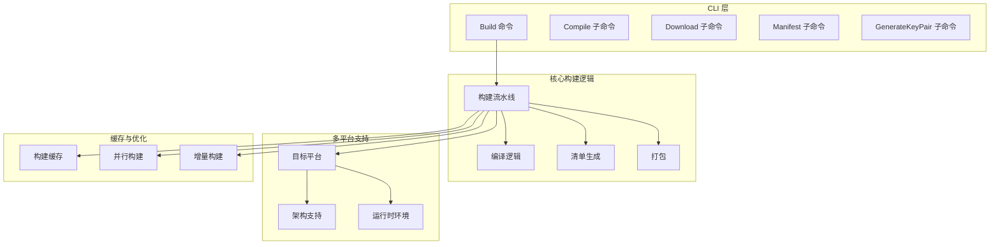
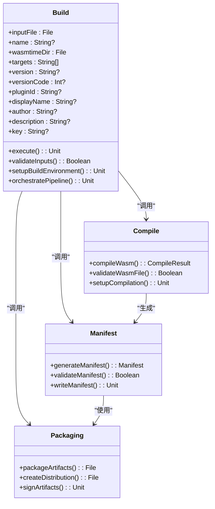
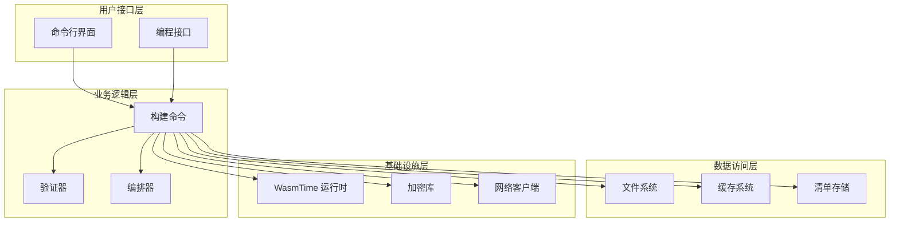
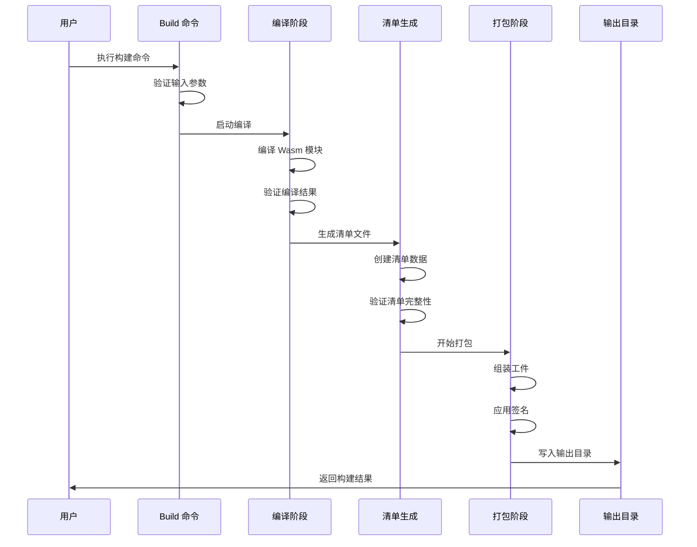
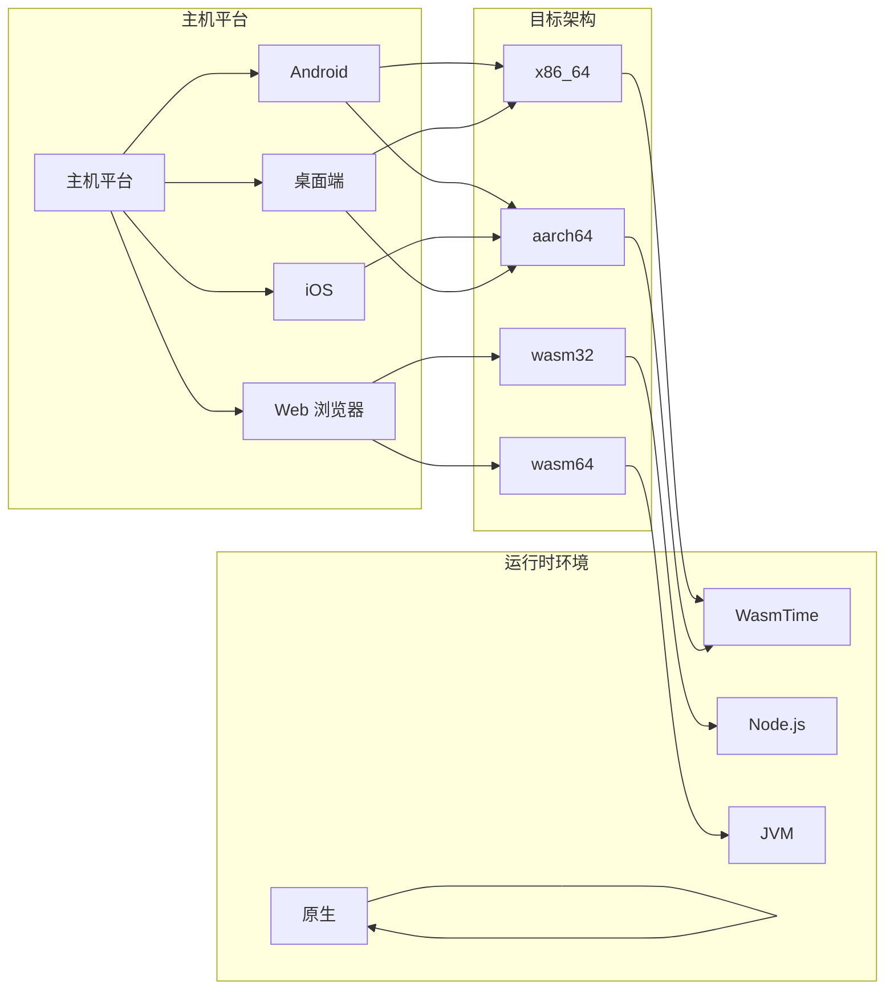
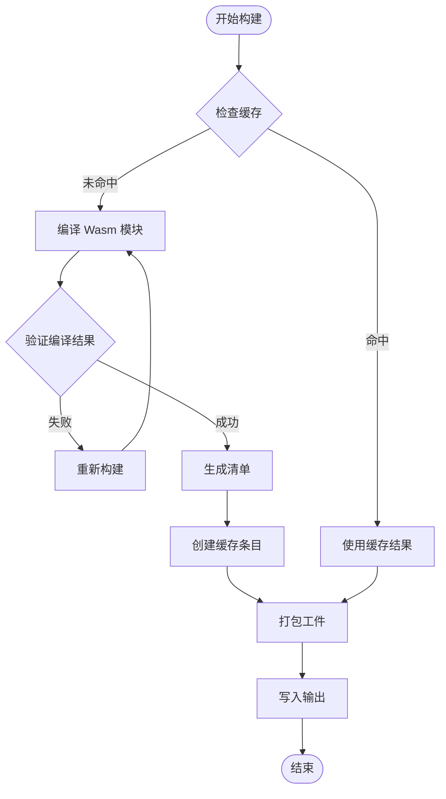
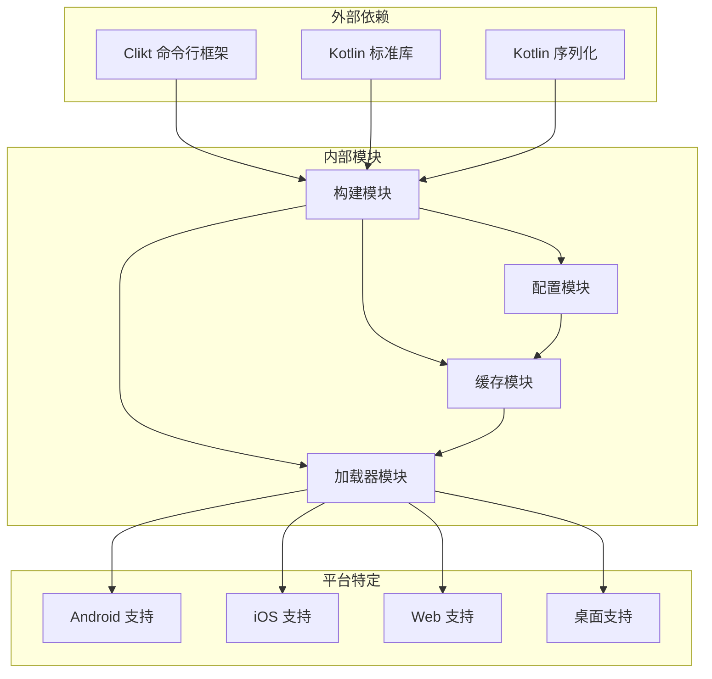

# 构建命令

<cite>
**本文档引用的文件**
- [Build.kt](file://wasmline-multiplatform/wasmline-cli/src/main/kotlin/crow/wasmline/cli/Build.kt)
- [cli.sh](file://wasmline-multiplatform/wasmline-cli/cli.sh)
- [manifest.md](file://wasmline-multiplatform/wasmline-cli/manifest.md)
- [download.md](file://wasmline-multiplatform/wasmline-cli/download.md)
- [compile.md](file://wasmline-multiplatform/wasmline-cli/compile.md)
- [keys.md](file://wasmline-multiplatform/wasmline-cli/keys.md)
- [build.md](file://wasmline-multiplatform/wasmline-cli/build.md)
- [README.md](file://README.md)
- [build.gradle.kts](file://wasmline-multiplatform/wasmline-cli/build.gradle.kts)
- [gradle-build.md](file://wasmline-multiplatform/wasmline-cli/gradle-build.md)
- [build.zig](file://wasmline-multiplatform/wasmline/build.zig)
- [build.zig.zon](file://wasmline-multiplatform/wasmline/build.zig.zon)
- [build.md](file://wasmline-multiplatform/wasmline/build.md)
- [zig-build.md](file://wasmline-multiplatform/wasmline/zig-build.md)
- [WasmlineConfig.kt](file://wasmline-multiplatform/wasmline/src/commonMain/kotlin/crow/wasmline/WasmlineConfig.kt)
- [WasmlineCache.kt](file://wasmline-multiplatform/wasmline/src/commonMain/kotlin/crow/wasmline/WasmlineCache.kt)
- [WasmlineService.kt](file://wasmline-multiplatform/wasmline/src/commonMain/kotlin/crow/wasmline/WasmlineService.kt)
- [WasmlineLoader.kt](file://wasmline-multiplatform/wasmline/src/hostMain/kotlin/crow/wasmline/WasmlineLoader.kt)
- [Manifest.kt](file://wasmline-multiplatform/wasmline-loader/src/commonMain/kotlin/crow/wasmline/loader/model/Manifest.kt)
- [DefaultWasmlineLoader.kt](file://wasmline-multiplatform/wasmline-loader/src/hostMain/kotlin/crow/wasmline/loader/DefaultWasmlineLoader.kt)
- [WasmlineHostArtifactTarget.kt](file://wasmline-multiplatform/wasmline-loader/src/commonMain/kotlin/crow/wasmline/loader/internal/WasmlineHostArtifactTarget.kt)
- [WasmlineFileCache.kt](file://wasmline-multiplatform/wasmline-loader/src/hostMain/kotlin/crow/wasmline/loader/internal/WasmlineFileCache.kt)
- [Download.kt](file://wasmline-multiplatform/wasmline-cli/src/main/kotlin/crow/wasmline/cli/Download.kt)
- [Compile.kt](file://wasmline-multiplatform/wasmline-cli/src/main/kotlin/crow/wasmline/cli/Compile.kt)
- [Manifest.kt](file://wasmline-multiplatform/wasmline-cli/src/main/kotlin/crow/wasmline/cli/Manifest.kt)
- [GenerateKeyPair.kt](file://wasmline-multiplatform/wasmline-cli/src/main/kotlin/crow/wasmline/cli/GenerateKeyPair.kt)
- [Main.kt](file://wasmline-multiplatform/wasmline-cli/src/main/kotlin/crow/wasmline/cli/Main.kt)
</cite>

## 目录
1. [简介](#简介)
2. [项目结构](#项目结构)
3. [核心组件](#核心组件)
4. [架构概览](#架构概览)
5. [详细组件分析](#详细组件分析)
6. [依赖关系分析](#依赖关系分析)
7. [性能考虑](#性能考虑)
8. [故障排除指南](#故障排除指南)
9. [结论](#结论)
10. [附录](#附录)

## 简介

Wasmline 构建命令是 Wasmline 多平台框架的核心构建工具，负责将编译后的 WebAssembly 模块转换为可分发的 Wasmline 包。该命令实现了完整的构建流水线，包括编译、清单生成和打包三个主要阶段，支持多种目标平台和架构。

构建命令提供了丰富的配置选项，包括输入文件指定、产品名称设置、WasmTime 运行时配置、目标架构选择等。它还集成了密钥管理、缓存机制和并行构建优化功能，为 CI/CD 工程师提供了完整的自动化构建解决方案。

## 项目结构

Wasmline 构建系统采用模块化设计，主要由以下组件构成：



**图表来源**
- [Build.kt](file://wasmline-multiplatform/wasmline-cli/src/main/kotlin/crow/wasmline/cli/Build.kt)
- [cli.sh](file://wasmline-multiplatform/wasmline-cli/cli.sh)

**章节来源**
- [Build.kt:29-72](file://wasmline-multiplatform/wasmline-cli/src/main/kotlin/crow/wasmline/cli/Build.kt#L29-L72)
- [cli.sh:383-429](file://wasmline-multiplatform/wasmline-cli/cli.sh#L383-L429)

## 核心组件

### Build 命令类

Build 命令类是整个构建系统的入口点，继承自 CliktCommand 并实现了完整的构建流水线：



**图表来源**
- [Build.kt](file://wasmline-multiplatform/wasmline-cli/src/main/kotlin/crow/wasmline/cli/Build.kt)
- [Compile.kt](file://wasmline-multiplatform/wasmline-cli/src/main/kotlin/crow/wasmline/cli/Compile.kt)
- [Manifest.kt](file://wasmline-multiplatform/wasmline-cli/src/main/kotlin/crow/wasmline/cli/Manifest.kt)

### 构建参数配置

构建命令支持丰富的参数配置选项：

| 参数 | 类型 | 必需 | 默认值 | 描述 |
|------|------|------|--------|------|
| `-i, --input` | 文件路径 | 是 | 无 | 输入的 .wasm 文件路径 |
| `-n, --name` | 字符串 | 否 | 输入文件名（去扩展名） | 产品名称用于输出工件 |
| `-wt, --wasmtime` | 文件路径 | 是 | 无 | 包含 wasmtime-min 可执行文件的目录 |
| `-a, --arch` | 字符串列表 | 否 | 所有常见目标 | 目标架构列表 |
| `--version` | 字符串 | 否 | 无 | 版本号 |
| `--version-code` | 整数 | 否 | 无 | 版本代码 |
| `--plugin-id` | 字符串 | 否 | 无 | 插件 ID |
| `--display-name` | 字符串 | 否 | 无 | 显示名称 |
| `--author` | 字符串 | 否 | 无 | 作者信息 |
| `--description` | 字符串 | 否 | 无 | 描述信息 |
| `--key` | 字符串 | 否 | 无 | 密钥文件或十六进制字符串 |

**章节来源**
- [Build.kt:56-72](file://wasmline-multiplatform/wasmline-cli/src/main/kotlin/crow/wasmline/cli/Build.kt#L56-L72)

## 架构概览

Wasmline 构建系统采用分层架构设计，确保了良好的可维护性和扩展性：



**图表来源**
- [Main.kt](file://wasmline-multiplatform/wasmline-cli/src/main/kotlin/crow/wasmline/cli/Main.kt)
- [Build.kt](file://wasmline-multiplatform/wasmline-cli/src/main/kotlin/crow/wasmline/cli/Build.kt)

## 详细组件分析

### 构建流水线执行流程

构建命令实现了完整的三阶段流水线，每个阶段都有明确的职责和输出：



**图表来源**
- [Build.kt](file://wasmline-multiplatform/wasmline-cli/src/main/kotlin/crow/wasmline/cli/Build.kt)
- [Compile.kt](file://wasmline-multiplatform/wasmline-cli/src/main/kotlin/crow/wasmline/cli/Compile.kt)
- [Manifest.kt](file://wasmline-multiplatform/wasmline-cli/src/main/kotlin/crow/wasmline/cli/Manifest.kt)

### 多平台支持架构

Wasmline 构建系统支持多种目标平台和架构，通过统一的接口抽象实现跨平台兼容：



**图表来源**
- [WasmlineHostArtifactTarget.kt](file://wasmline-multiplatform/wasmline-loader/src/commonMain/kotlin/crow/wasmline/loader/internal/WasmlineHostArtifactTarget.kt)
- [build.zig](file://wasmline-multiplatform/wasmline/build.zig)

### 构建缓存机制

构建系统实现了智能缓存机制，显著提升构建性能：



**图表来源**
- [WasmlineFileCache.kt](file://wasmline-multiplatform/wasmline-loader/src/hostMain/kotlin/crow/wasmline/loader/internal/WasmlineFileCache.kt)
- [WasmlineCache.kt](file://wasmline-multiplatform/wasmline/src/commonMain/kotlin/crow/wasmline/WasmlineCache.kt)

**章节来源**
- [WasmlineFileCache.kt](file://wasmline-multiplatform/wasmline-loader/src/hostMain/kotlin/crow/wasmline/loader/internal/WasmlineFileCache.kt)
- [WasmlineCache.kt](file://wasmline-multiplatform/wasmline/src/commonMain/kotlin/crow/wasmline/WasmlineCache.kt)

## 依赖关系分析

构建系统的依赖关系体现了清晰的关注点分离：



**图表来源**
- [build.gradle.kts](file://wasmline-multiplatform/wasmline-cli/build.gradle.kts)
- [Main.kt](file://wasmline-multiplatform/wasmline-cli/src/main/kotlin/crow/wasmline/cli/Main.kt)

**章节来源**
- [build.gradle.kts](file://wasmline-multiplatform/wasmline-cli/build.gradle.kts)
- [Main.kt](file://wasmline-multiplatform/wasmline-cli/src/main/kotlin/crow/wasmline/cli/Main.kt)

## 性能考虑

### 并行构建优化

构建系统采用了多项性能优化策略：

1. **并行编译**: 支持同时编译多个目标架构
2. **增量构建**: 智能检测文件变更，仅重新构建受影响的模块
3. **缓存利用**: 利用编译缓存减少重复工作
4. **内存管理**: 优化内存使用，避免不必要的对象创建

### 构建时间优化建议

- 使用增量构建模式进行开发阶段的快速迭代
- 在 CI/CD 环境中启用缓存以复用之前的构建结果
- 合理选择目标架构，避免不必要的多架构构建
- 使用并行构建选项充分利用多核处理器

## 故障排除指南

### 常见问题及解决方案

| 问题类型 | 症状 | 解决方案 |
|----------|------|----------|
| 编译失败 | 编译错误或崩溃 | 检查 WasmTime 版本兼容性，验证输入文件格式 |
| 清单生成错误 | 清单文件损坏或缺失 | 验证必需字段完整性，检查权限设置 |
| 打包失败 | 工件无法创建或签名失败 | 检查输出目录权限，验证密钥配置 |
| 缓存问题 | 缓存损坏或构建异常 | 清理缓存目录，重新构建 |

### 调试模式

构建命令支持调试模式，可以提供更多详细信息：

```bash
# 启用详细日志输出
./wasmline build -i input.wasm -wt /path/to/wasmtime -n myapp --debug

# 查看帮助信息
./wasmline build --help
```

**章节来源**
- [cli.sh:383-429](file://wasmline-multiplatform/wasmline-cli/cli.sh#L383-L429)

## 结论

Wasmline 构建命令提供了一个完整、高效且易于使用的构建解决方案。它不仅支持多平台和多架构构建，还集成了智能缓存、并行构建和增量构建等高级特性。对于 CI/CD 工程师而言，该构建系统提供了可靠的自动化构建能力，能够满足各种复杂场景的需求。

通过合理的配置和最佳实践，开发者可以充分利用构建系统的各项功能，实现高效的多平台应用发布流程。

## 附录

### 构建示例

以下是一些常用的构建示例：

```bash
# 基础构建（使用所有默认配置）
./wasmline build -i build/wasm/app.wasm -wt ~/.wasmtime

# 自定义名称和版本
./wasmline build -i build/wasm/app.wasm -wt ~/.wasmtime -n myapp --version 1.0.0

# 指定特定目标架构
./wasmline build -i build/wasm/app.wasm -wt ~/.wasmtime -n myapp -a x86_64 -a aarch64

# 完整清单元数据
./wasmline build -i build/wasm/app.wasm -wt ~/.wasmtime \
  -n myapp --version 1.0.0 --version-code 1000 \
  --plugin-id com.example.myapp --display-name "My App" \
  --author "Developer Name" --description "My awesome app"
```

### CI/CD 最佳实践

1. **缓存配置**: 在 CI/CD 环境中配置构建缓存
2. **并行执行**: 利用并行构建选项加速构建过程
3. **增量构建**: 在开发分支使用增量构建模式
4. **测试集成**: 将构建过程集成到测试流水线中
5. **版本管理**: 使用语义化版本控制管理发布版本