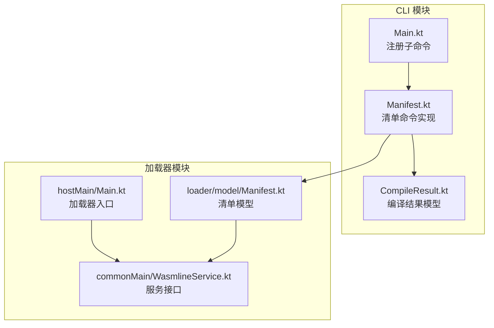
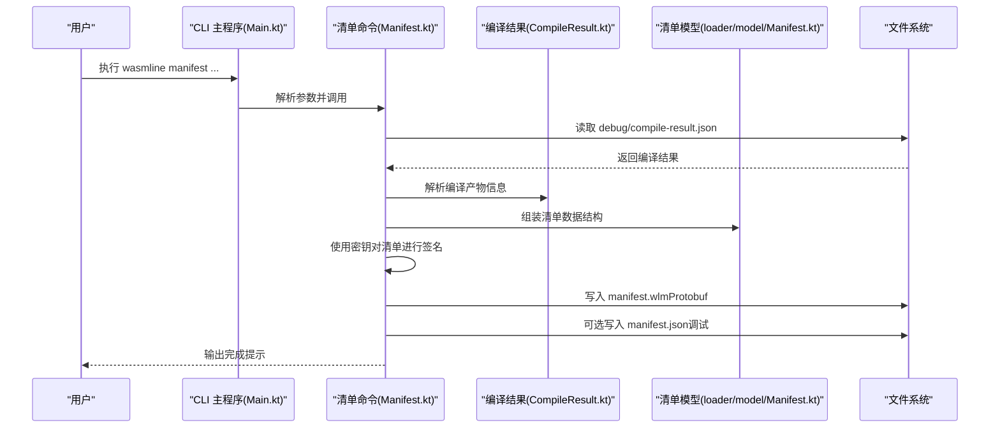
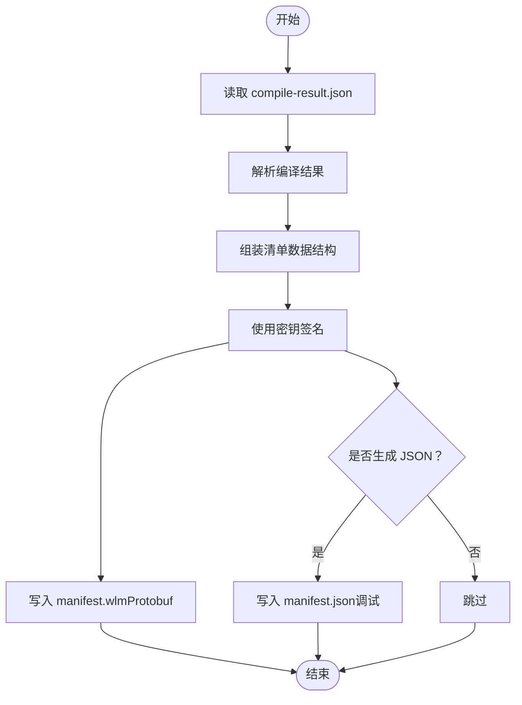
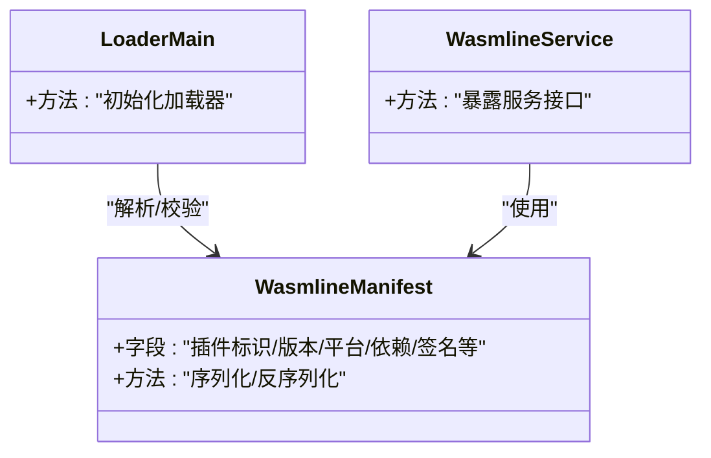
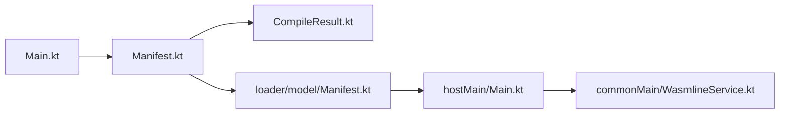

# 清单命令

<cite>
**本文引用的文件**
- [Manifest.kt](file://wasmline-multiplatform/wasmline-cli/src/main/kotlin/crow/wasmline/cli/Manifest.kt)
- [Main.kt](file://wasmline-multiplatform/wasmline-cli/src/main/kotlin/crow/wasmline/cli/Main.kt)
- [Manifest.kt（加载器模型）](file://wasmline-multiplatform/wasmline-loader/src/commonMain/kotlin/crow/wasmline/loader/model/Manifest.kt)
- [CompileResult.kt](file://wasmline-multiplatform/wasmline-cli/src/main/kotlin/crow/wasmline/cli/models/CompileResult.kt)
- [manifest.md](file://wasmline-multiplatform/wasmline-cli/manifest.md)
- [Main.kt（加载器）](file://wasmline-multiplatform/wasmline-loader/src/hostMain/kotlin/crow/wasmline/loader/Main.kt)
- [WasmlineService.kt](file://wasmline-multiplatform/wasmline-loader/src/commonMain/kotlin/crow/wasmline/WasmlineService.kt)
</cite>

## 目录
1. [简介](#简介)
2. [项目结构](#项目结构)
3. [核心组件](#核心组件)
4. [架构总览](#架构总览)
5. [详细组件分析](#详细组件分析)
6. [依赖关系分析](#依赖关系分析)
7. [性能考量](#性能考量)
8. [故障排查指南](#故障排查指南)
9. [结论](#结论)
10. [附录](#附录)

## 简介
本章节面向插件开发者与运维人员，系统性说明 Wasmline 的清单命令（manifest）功能与使用方法。该命令负责从编译结果中提取元数据并生成已签名的清单文件（默认 Protobuf 格式），同时可选生成调试用的 JSON 版本。清单用于描述插件的元信息、版本、目标平台、依赖关系以及安全签名，是插件分发与加载的关键载体。

## 项目结构
清单命令位于 CLI 模块中，通过主入口注册为子命令；清单模型定义在加载器模块中，供运行时加载与校验使用。CLI 侧负责读取编译产物与用户输入的元数据，生成最终的清单文件。

**图表来源**
- [Main.kt:10-25](file://wasmline-multiplatform/wasmline-cli/src/main/kotlin/crow/wasmline/cli/Main.kt#L10-L25)
- [Manifest.kt:1-40](file://wasmline-multiplatform/wasmline-cli/src/main/kotlin/crow/wasmline/cli/Manifest.kt#L1-L40)
- [CompileResult.kt:1-200](file://wasmline-multiplatform/wasmline-cli/src/main/kotlin/crow/wasmline/cli/models/CompileResult.kt#L1-L200)
- [Manifest.kt（加载器模型）:1-200](file://wasmline-multiplatform/wasmline-loader/src/commonMain/kotlin/crow/wasmline/loader/model/Manifest.kt#L1-L200)
- [Main.kt（加载器）:1-200](file://wasmline-multiplatform/wasmline-loader/src/hostMain/kotlin/crow/wasmline/loader/Main.kt#L1-L200)
- [WasmlineService.kt:1-200](file://wasmline-multiplatform/wasmline-loader/src/commonMain/kotlin/crow/wasmline/WasmlineService.kt#L1-L200)

**章节来源**
- [Main.kt:10-25](file://wasmline-multiplatform/wasmline-cli/src/main/kotlin/crow/wasmline/cli/Main.kt#L10-L25)
- [Manifest.kt:24-40](file://wasmline-multiplatform/wasmline-cli/src/main/kotlin/crow/wasmline/cli/Manifest.kt#L24-L40)

## 核心组件
- 清单命令（Manifest）
  - 负责读取编译结果与用户提供的元数据，生成已签名的清单文件（默认 Protobuf，可选 JSON 调试版）。
  - 预期输入目录布局包含 WASM 插件与 debug 目录中的 compile-result.json。
- 清单模型（加载器侧）
  - 定义了清单的数据结构，供加载器在运行时解析、校验与使用。
- 编译结果模型（CLI 侧）
  - 描述编译阶段的产物信息，作为清单生成的基础数据源之一。

**章节来源**
- [Manifest.kt:24-40](file://wasmline-multiplatform/wasmline-cli/src/main/kotlin/crow/wasmline/cli/Manifest.kt#L24-L40)
- [Manifest.kt（加载器模型）:1-200](file://wasmline-multiplatform/wasmline-loader/src/commonMain/kotlin/crow/wasmline/loader/model/Manifest.kt#L1-L200)
- [CompileResult.kt:1-200](file://wasmline-multiplatform/wasmline-cli/src/main/kotlin/crow/wasmline/cli/models/CompileResult.kt#L1-L200)

## 架构总览
清单命令的执行流程如下：CLI 主程序注册子命令，Manifest 命令读取编译结果与元数据，构造清单对象，进行签名并输出 Protobuf 与可选 JSON 文件。

**图表来源**
- [Main.kt:10-25](file://wasmline-multiplatform/wasmline-cli/src/main/kotlin/crow/wasmline/cli/Main.kt#L10-L25)
- [Manifest.kt:24-40](file://wasmline-multiplatform/wasmline-cli/src/main/kotlin/crow/wasmline/cli/Manifest.kt#L24-L40)
- [CompileResult.kt:1-200](file://wasmline-multiplatform/wasmline-cli/src/main/kotlin/crow/wasmline/cli/models/CompileResult.kt#L1-L200)
- [Manifest.kt（加载器模型）:1-200](file://wasmline-multiplatform/wasmline-loader/src/commonMain/kotlin/crow/wasmline/loader/model/Manifest.kt#L1-L200)

## 详细组件分析

### 清单命令（Manifest）
- 功能职责
  - 读取编译结果与用户元数据，生成已签名的清单文件。
  - 默认输出 Protobuf 格式的 manifest.wlm，便于运行时高效解析；可选输出 JSON 格式的 manifest.json 用于调试。
- 输入期望
  - 目录布局需包含 WASM 插件文件与 debug/compile-result.json。
- 关键处理步骤
  - 解析编译结果，提取插件元信息。
  - 组装清单数据结构。
  - 使用密钥算法对清单进行签名。
  - 将清单写入磁盘。

**图表来源**
- [Manifest.kt:24-40](file://wasmline-multiplatform/wasmline-cli/src/main/kotlin/crow/wasmline/cli/Manifest.kt#L24-L40)
- [CompileResult.kt:1-200](file://wasmline-multiplatform/wasmline-cli/src/main/kotlin/crow/wasmline/cli/models/CompileResult.kt#L1-L200)
- [Manifest.kt（加载器模型）:1-200](file://wasmline-multiplatform/wasmline-loader/src/commonMain/kotlin/crow/wasmline/loader/model/Manifest.kt#L1-L200)

**章节来源**
- [Manifest.kt:24-40](file://wasmline-multiplatform/wasmline-cli/src/main/kotlin/crow/wasmline/cli/Manifest.kt#L24-L40)

### 清单模型（加载器侧）
- 角色定位
  - 定义了清单的数据结构，供加载器在运行时解析、校验与使用。
- 关联关系
  - 与加载器入口与服务接口共同构成运行时的清单消费链路。

**图表来源**
- [Manifest.kt（加载器模型）:1-200](file://wasmline-multiplatform/wasmline-loader/src/commonMain/kotlin/crow/wasmline/loader/model/Manifest.kt#L1-L200)
- [Main.kt（加载器）:1-200](file://wasmline-multiplatform/wasmline-loader/src/hostMain/kotlin/crow/wasmline/loader/Main.kt#L1-L200)
- [WasmlineService.kt:1-200](file://wasmline-multiplatform/wasmline-loader/src/commonMain/kotlin/crow/wasmline/WasmlineService.kt#L1-L200)

**章节来源**
- [Manifest.kt（加载器模型）:1-200](file://wasmline-multiplatform/wasmline-loader/src/commonMain/kotlin/crow/wasmline/loader/model/Manifest.kt#L1-L200)
- [Main.kt（加载器）:1-200](file://wasmline-multiplatform/wasmline-loader/src/hostMain/kotlin/crow/wasmline/loader/Main.kt#L1-L200)
- [WasmlineService.kt:1-200](file://wasmline-multiplatform/wasmline-loader/src/commonMain/kotlin/crow/wasmline/WasmlineService.kt#L1-L200)

### 编译结果模型（CLI 侧）
- 角色定位
  - 描述编译阶段的产物信息，作为清单生成的基础数据源之一。
- 作用
  - 提供插件名称、版本、目标平台、产物路径等关键字段，驱动清单字段填充。

**章节来源**
- [CompileResult.kt:1-200](file://wasmline-multiplatform/wasmline-cli/src/main/kotlin/crow/wasmline/cli/models/CompileResult.kt#L1-L200)

## 依赖关系分析
- 命令注册
  - CLI 主程序将 Manifest 注册为子命令，确保用户可通过 wasmline manifest ... 调用。
- 数据流
  - Manifest 命令依赖编译结果模型与清单模型，最终输出到文件系统。
- 运行时集成
  - 加载器侧的清单模型与服务接口共同消费清单，完成插件加载与校验。

**图表来源**
- [Main.kt:10-25](file://wasmline-multiplatform/wasmline-cli/src/main/kotlin/crow/wasmline/cli/Main.kt#L10-L25)
- [Manifest.kt:24-40](file://wasmline-multiplatform/wasmline-cli/src/main/kotlin/crow/wasmline/cli/Manifest.kt#L24-L40)
- [CompileResult.kt:1-200](file://wasmline-multiplatform/wasmline-cli/src/main/kotlin/crow/wasmline/cli/models/CompileResult.kt#L1-L200)
- [Manifest.kt（加载器模型）:1-200](file://wasmline-multiplatform/wasmline-loader/src/commonMain/kotlin/crow/wasmline/loader/model/Manifest.kt#L1-L200)
- [Main.kt（加载器）:1-200](file://wasmline-multiplatform/wasmline-loader/src/hostMain/kotlin/crow/wasmline/loader/Main.kt#L1-L200)
- [WasmlineService.kt:1-200](file://wasmline-multiplatform/wasmline-loader/src/commonMain/kotlin/crow/wasmline/WasmlineService.kt#L1-L200)

**章节来源**
- [Main.kt:10-25](file://wasmline-multiplatform/wasmline-cli/src/main/kotlin/crow/wasmline/cli/Main.kt#L10-L25)
- [Manifest.kt:24-40](file://wasmline-multiplatform/wasmline-cli/src/main/kotlin/crow/wasmline/cli/Manifest.kt#L24-L40)
- [CompileResult.kt:1-200](file://wasmline-multiplatform/wasmline-cli/src/main/kotlin/crow/wasmline/cli/models/CompileResult.kt#L1-L200)
- [Manifest.kt（加载器模型）:1-200](file://wasmline-multiplatform/wasmline-loader/src/commonMain/kotlin/crow/wasmline/loader/model/Manifest.kt#L1-L200)
- [Main.kt（加载器）:1-200](file://wasmline-multiplatform/wasmline-loader/src/hostMain/kotlin/crow/wasmline/loader/Main.kt#L1-L200)
- [WasmlineService.kt:1-200](file://wasmline-multiplatform/wasmline-loader/src/commonMain/kotlin/crow/wasmline/WasmlineService.kt#L1-L200)

## 性能考量
- 输出格式选择
  - 默认使用 Protobuf（manifest.wlm）以获得更小体积与更快解析速度；仅在调试场景下生成 JSON（manifest.json）。
- I/O 优化
  - 优先复用编译结果中的元信息，避免重复扫描文件系统。
- 签名效率
  - 使用高效的签名算法（如 Ed25519）以平衡安全性与性能。

[本节为通用指导，不直接分析具体文件]

## 故障排查指南
- 目录布局错误
  - 确保 debug/compile-result.json 存在且可读，否则清单命令无法读取编译结果。
- 密钥配置问题
  - 若未提供有效密钥或算法不匹配，签名过程会失败；请检查密钥文件与算法参数。
- 平台与版本不兼容
  - 确认清单中的目标平台与版本号与实际产物一致，避免加载阶段出现不匹配。
- JSON 调试输出缺失
  - 仅在明确启用调试输出时才会生成 manifest.json，请检查相关参数。

**章节来源**
- [Manifest.kt:24-40](file://wasmline-multiplatform/wasmline-cli/src/main/kotlin/crow/wasmline/cli/Manifest.kt#L24-L40)
- [CompileResult.kt:1-200](file://wasmline-multiplatform/wasmline-cli/src/main/kotlin/crow/wasmline/cli/models/CompileResult.kt#L1-L200)

## 结论
清单命令是 Wasmline 插件生态中的关键环节，它将编译结果与元数据整合为可签名、可分发、可加载的标准化清单。通过合理的参数配置与目录布局，开发者可以快速生成符合规范的清单文件，并在多平台与多部署场景中稳定运行。

[本节为总结性内容，不直接分析具体文件]

## 附录

### 使用示例与最佳实践
- 示例一：基础清单生成
  - 步骤：准备编译产物与 debug/compile-result.json，执行清单命令，默认输出 manifest.wlm。
  - 建议：在 CI 中固定版本号与目标平台，确保可重复构建。
- 示例二：调试模式
  - 步骤：在清单命令中启用 JSON 输出，生成 manifest.json 以便人工核验。
  - 建议：仅在开发与测试环境开启，生产环境保持 Protobuf 输出。
- 示例三：多平台打包
  - 步骤：针对不同平台分别生成清单，统一由下载与加载流程分发。
  - 建议：在清单中明确标注平台与架构，避免运行时加载冲突。

**章节来源**
- [manifest.md:1-200](file://wasmline-multiplatform/wasmline-cli/manifest.md#L1-L200)
- [Manifest.kt:24-40](file://wasmline-multiplatform/wasmline-cli/src/main/kotlin/crow/wasmline/cli/Manifest.kt#L24-L40)

### 清单格式规范与验证机制
- 格式规范
  - 默认采用 Protobuf（manifest.wlm）存储，包含插件标识、版本、平台、依赖、签名等字段。
  - 可选 JSON（manifest.json）用于调试，字段与 Protobuf 对应。
- 验证机制
  - 运行时加载器根据清单模型解析并校验签名，确保来源可信与内容未被篡改。
  - 若清单字段缺失或签名不匹配，加载流程将拒绝加载并返回错误。

**章节来源**
- [Manifest.kt（加载器模型）:1-200](file://wasmline-multiplatform/wasmline-loader/src/commonMain/kotlin/crow/wasmline/loader/model/Manifest.kt#L1-L200)
- [Main.kt（加载器）:1-200](file://wasmline-multiplatform/wasmline-loader/src/hostMain/kotlin/crow/wasmline/loader/Main.kt#L1-L200)
- [WasmlineService.kt:1-200](file://wasmline-multiplatform/wasmline-loader/src/commonMain/kotlin/crow/wasmline/WasmlineService.kt#L1-L200)