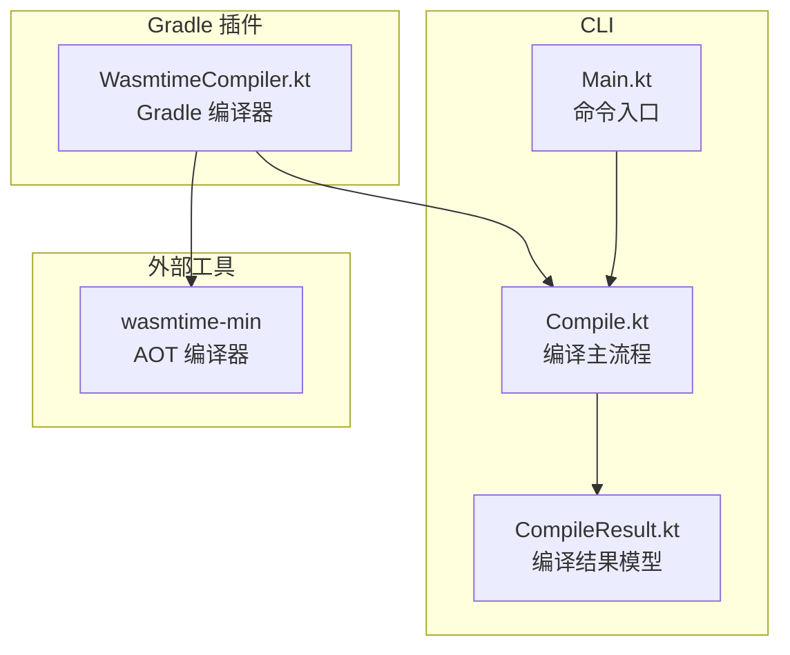
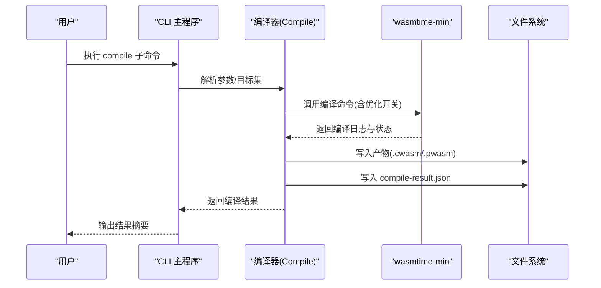
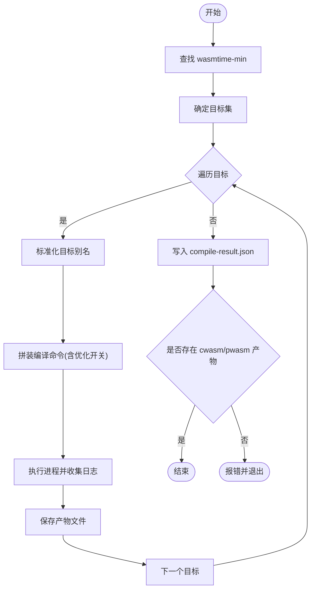
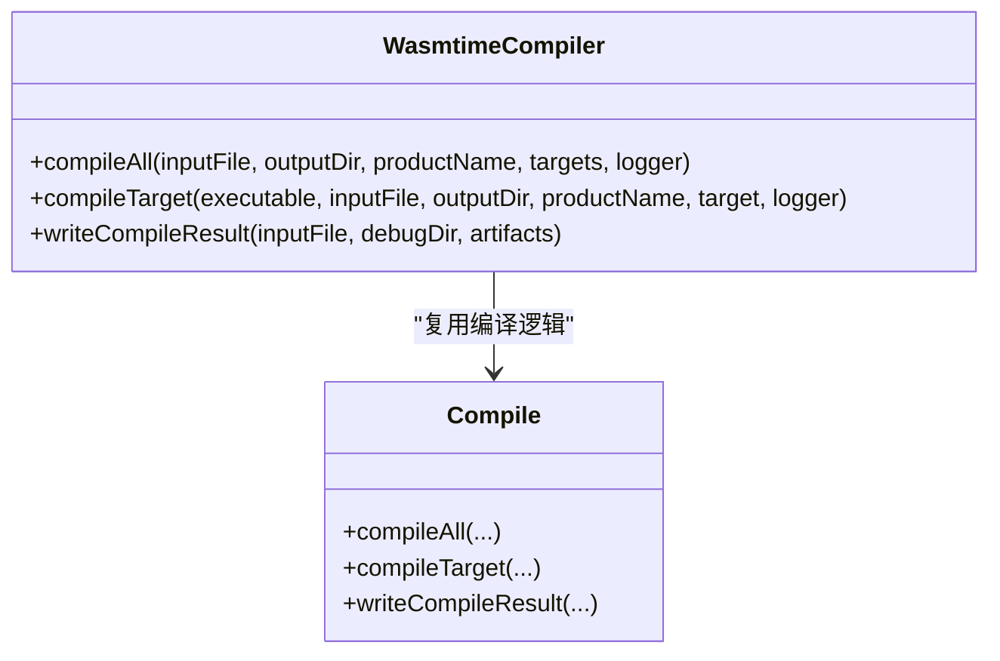
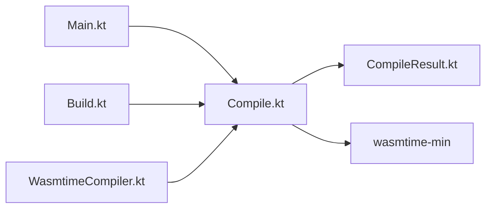

# 编译命令

<cite>
**本文引用的文件**
- [wasmline-multiplatform/wasmline-cli/src/main/kotlin/crow/wasmline/cli/Compile.kt](file://wasmline-multiplatform/wasmline-cli/src/main/kotlin/crow/wasmline/cli/Compile.kt)
- [wasmline-multiplatform/wasmline-cli/src/main/kotlin/crow/wasmline/cli/Build.kt](file://wasmline-multiplatform/wasmline-cli/src/main/kotlin/crow/wasmline/cli/Build.kt)
- [wasmline-multiplatform/wasmline-cli/src/main/kotlin/crow/wasmline/cli/Main.kt](file://wasmline-multiplatform/wasmline-cli/src/main/kotlin/crow/wasmline/cli/Main.kt)
- [wasmline-multiplatform/wasmline-cli/src/main/kotlin/crow/wasmline/cli/models/CompileResult.kt](file://wasmline-multiplatform/wasmline-cli/src/main/kotlin/crow/wasmline/cli/models/CompileResult.kt)
- [wasmline-multiplatform/wasmline-gradle-plugin/src/main/kotlin/crow/wasmline/gradle/internal/WasmtimeCompiler.kt](file://wasmline-multiplatform/wasmline-gradle-plugin/src/main/kotlin/crow/wasmline/gradle/internal/WasmtimeCompiler.kt)
- [wasmline-multiplatform/wasmline-cli/compile.md](file://wasmline-multiplatform/wasmline-cli/compile.md)
- [wasmline-multiplatform/wasmline-cli/build.md](file://wasmline-multiplatform/wasmline-cli/build.md)
</cite>

## 目录
1. [简介](#简介)
2. [项目结构](#项目结构)
3. [核心组件](#核心组件)
4. [架构总览](#架构总览)
5. [详细组件分析](#详细组件分析)
6. [依赖关系分析](#依赖关系分析)
7. [性能与优化](#性能与优化)
8. [故障排查指南](#故障排查指南)
9. [结论](#结论)
10. [附录：编译示例与最佳实践](#附录编译示例与最佳实践)

## 简介
本章节面向 Wasmline 的编译命令（compile 子命令），系统性说明其功能、参数、输出格式、优化策略以及在多平台与多部署场景中的使用方式。同时解释 AOT 编译与 JIT 编译的区别，并给出插件开发者在编译流程中的最佳实践与调试方法。

## 项目结构
Wasmline 的编译能力由 CLI 与 Gradle 插件共同提供：
- CLI 模块提供了独立的编译入口与结果写入逻辑
- Gradle 插件封装了编译流程并集成到构建生命周期
- 编译器后端基于 Wasmtime 的 wasmtime-min 可执行文件进行 AOT 编译

图表来源
- [wasmline-multiplatform/wasmline-cli/src/main/kotlin/crow/wasmline/cli/Main.kt](file://wasmline-multiplatform/wasmline-cli/src/main/kotlin/crow/wasmline/cli/Main.kt)
- [wasmline-multiplatform/wasmline-cli/src/main/kotlin/crow/wasmline/cli/Compile.kt](file://wasmline-multiplatform/wasmline-cli/src/main/kotlin/crow/wasmline/cli/Compile.kt)
- [wasmline-multiplatform/wasmline-cli/src/main/kotlin/crow/wasmline/cli/models/CompileResult.kt](file://wasmline-multiplatform/wasmline-cli/src/main/kotlin/crow/wasmline/cli/models/CompileResult.kt)
- [wasmline-multiplatform/wasmline-gradle-plugin/src/main/kotlin/crow/wasmline/gradle/internal/WasmtimeCompiler.kt](file://wasmline-multiplatform/wasmline-gradle-plugin/src/main/kotlin/crow/wasmline/gradle/internal/WasmtimeCompiler.kt)

章节来源
- [wasmline-multiplatform/wasmline-cli/src/main/kotlin/crow/wasmline/cli/Main.kt](file://wasmline-multiplatform/wasmline-cli/src/main/kotlin/crow/wasmline/cli/Main.kt)
- [wasmline-multiplatform/wasmline-cli/src/main/kotlin/crow/wasmline/cli/Compile.kt](file://wasmline-multiplatform/wasmline-cli/src/main/kotlin/crow/wasmline/cli/Compile.kt)
- [wasmline-multiplatform/wasmline-gradle-plugin/src/main/kotlin/crow/wasmline/gradle/internal/WasmtimeCompiler.kt](file://wasmline-multiplatform/wasmline-gradle-plugin/src/main/kotlin/crow/wasmline/gradle/internal/WasmtimeCompiler.kt)

## 核心组件
- 命令入口与子命令注册：CLI 入口负责解析子命令（如 compile、build）并分发到对应处理器。
- 编译主流程：负责定位 wasmtime-min、解析目标平台、执行 AOT 编译、生成产物与调试信息。
- 编译结果模型：定义 compile-result.json 的结构，记录输入文件、产物列表等元数据。
- Gradle 集成：Gradle 插件内部复用编译逻辑，统一目标集与优化开关，将编译嵌入构建任务。

章节来源
- [wasmline-multiplatform/wasmline-cli/src/main/kotlin/crow/wasmline/cli/Main.kt](file://wasmline-multiplatform/wasmline-cli/src/main/kotlin/crow/wasmline/cli/Main.kt)
- [wasmline-multiplatform/wasmline-cli/src/main/kotlin/crow/wasmline/cli/Compile.kt](file://wasmline-multiplatform/wasmline-cli/src/main/kotlin/crow/wasmline/cli/Compile.kt)
- [wasmline-multiplatform/wasmline-cli/src/main/kotlin/crow/wasmline/cli/models/CompileResult.kt](file://wasmline-multiplatform/wasmline-cli/src/main/kotlin/crow/wasmline/cli/models/CompileResult.kt)
- [wasmline-multiplatform/wasmline-gradle-plugin/src/main/kotlin/crow/wasmline/gradle/internal/WasmtimeCompiler.kt](file://wasmline-multiplatform/wasmline-gradle-plugin/src/main/kotlin/crow/wasmline/gradle/internal/WasmtimeCompiler.kt)

## 架构总览
编译命令的核心流程如下：
- CLI 解析参数，定位 wasmtime-min
- 依据目标集逐个编译，生成 cwasm/pwasm 等产物
- 写入 compile-result.json 便于后续加载与调试
- Gradle 插件复用相同逻辑，统一优化与目标集

图表来源
- [wasmline-multiplatform/wasmline-cli/src/main/kotlin/crow/wasmline/cli/Compile.kt](file://wasmline-multiplatform/wasmline-cli/src/main/kotlin/crow/wasmline/cli/Compile.kt)
- [wasmline-multiplatform/wasmline-gradle-plugin/src/main/kotlin/crow/wasmline/gradle/internal/WasmtimeCompiler.kt](file://wasmline-multiplatform/wasmline-gradle-plugin/src/main/kotlin/crow/wasmline/gradle/internal/WasmtimeCompiler.kt)

## 详细组件分析

### 组件一：CLI 编译主流程（Compile.kt）
- 功能要点
  - 定位 wasmtime-min 可执行文件
  - 解析目标集（默认目标集可被覆盖）
  - 对每个目标执行 AOT 编译，产出 cwasm/pwasm
  - 将编译结果写入 debug 目录的 compile-result.json
  - 若无 cwasm/pwasm 成功产物，返回错误码并终止
- 关键行为
  - 目标标准化与扩展名选择（pulley 目标生成 pwasm，否则 cwasm）
  - 命令行参数拼装（包含目标、优化开关等）
  - 进程执行与日志流式输出
- 输出产物
  - 各目标产物文件（命名规则：产品名-目标.扩展名）
  - compile-result.json（记录输入文件与产物列表）

图表来源
- [wasmline-multiplatform/wasmline-cli/src/main/kotlin/crow/wasmline/cli/Compile.kt](file://wasmline-multiplatform/wasmline-cli/src/main/kotlin/crow/wasmline/cli/Compile.kt)

章节来源
- [wasmline-multiplatform/wasmline-cli/src/main/kotlin/crow/wasmline/cli/Compile.kt](file://wasmline-multiplatform/wasmline-cli/src/main/kotlin/crow/wasmline/cli/Compile.kt)

### 组件二：Gradle 插件编译器（WasmtimeCompiler.kt）
- 功能要点
  - 复用 CLI 的编译逻辑，统一目标集与优化开关
  - 将编译过程的日志通过 Gradle logger 输出
  - 生成 compile-result.json 并写入构建目录
- 关键行为
  - 默认目标集与优化参数与 CLI 保持一致
  - 逐目标编译并聚合产物
  - 错误处理与日志打印
- 集成点
  - 作为 Gradle 任务的一部分运行
  - 与构建产物目录、缓存目录协同工作

图表来源
- [wasmline-multiplatform/wasmline-gradle-plugin/src/main/kotlin/crow/wasmline/gradle/internal/WasmtimeCompiler.kt](file://wasmline-multiplatform/wasmline-gradle-plugin/src/main/kotlin/crow/wasmline/gradle/internal/WasmtimeCompiler.kt)
- [wasmline-multiplatform/wasmline-cli/src/main/kotlin/crow/wasmline/cli/Compile.kt](file://wasmline-multiplatform/wasmline-cli/src/main/kotlin/crow/wasmline/cli/Compile.kt)

章节来源
- [wasmline-multiplatform/wasmline-gradle-plugin/src/main/kotlin/crow/wasmline/gradle/internal/WasmtimeCompiler.kt](file://wasmline-multiplatform/wasmline-gradle-plugin/src/main/kotlin/crow/wasmline/gradle/internal/WasmtimeCompiler.kt)

### 组件三：编译结果模型（CompileResult.kt）
- 结构说明
  - 记录输入文件名与产物列表
  - 用于后续加载器与调试工具读取
- 使用场景
  - CLI/Gradle 插件在编译完成后写入该 JSON
  - 加载器根据该文件定位与验证产物

章节来源
- [wasmline-multiplatform/wasmline-cli/src/main/kotlin/crow/wasmline/cli/models/CompileResult.kt](file://wasmline-multiplatform/wasmline-cli/src/main/kotlin/crow/wasmline/cli/models/CompileResult.kt)

### 组件四：命令入口与构建流程（Main.kt、Build.kt）
- 命令入口
  - 注册 compile、build 等子命令
  - 参数解析与子命令分发
- 构建流程
  - build 子命令内部调用编译逻辑
  - 统一输出目录与调试信息写入

章节来源
- [wasmline-multiplatform/wasmline-cli/src/main/kotlin/crow/wasmline/cli/Main.kt](file://wasmline-multiplatform/wasmline-cli/src/main/kotlin/crow/wasmline/cli/Main.kt)
- [wasmline-multiplatform/wasmline-cli/src/main/kotlin/crow/wasmline/cli/Build.kt](file://wasmline-multiplatform/wasmline-cli/src/main/kotlin/crow/wasmline/cli/Build.kt)

## 依赖关系分析
- CLI 与 Gradle 插件共享编译实现，确保行为一致性
- 编译流程依赖 wasmtime-min 可执行文件
- 产物与调试信息写入文件系统，供后续加载与诊断使用

图表来源
- [wasmline-multiplatform/wasmline-cli/src/main/kotlin/crow/wasmline/cli/Main.kt](file://wasmline-multiplatform/wasmline-cli/src/main/kotlin/crow/wasmline/cli/Main.kt)
- [wasmline-multiplatform/wasmline-cli/src/main/kotlin/crow/wasmline/cli/Build.kt](file://wasmline-multiplatform/wasmline-cli/src/main/kotlin/crow/wasmline/cli/Build.kt)
- [wasmline-multiplatform/wasmline-cli/src/main/kotlin/crow/wasmline/cli/Compile.kt](file://wasmline-multiplatform/wasmline-cli/src/main/kotlin/crow/wasmline/cli/Compile.kt)
- [wasmline-multiplatform/wasmline-cli/src/main/kotlin/crow/wasmline/cli/models/CompileResult.kt](file://wasmline-multiplatform/wasmline-cli/src/main/kotlin/crow/wasmline/cli/models/CompileResult.kt)
- [wasmline-multiplatform/wasmline-gradle-plugin/src/main/kotlin/crow/wasmline/gradle/internal/WasmtimeCompiler.kt](file://wasmline-multiplatform/wasmline-gradle-plugin/src/main/kotlin/crow/wasmline/gradle/internal/WasmtimeCompiler.kt)

## 性能与优化
- 优化开关（来自 Gradle 编译器的默认参数）
  - 启用垃圾回收、函数引用、异常支持
  - 禁用线程、SIMD、Relaxed SIMD
  - 关闭静态/动态内存保护页
  - 关闭基于信号的陷阱
  - 优化等级 2
  - 关闭 Cranelift 调试校验
- 影响与权衡
  - 启用异常与函数引用提升兼容性，但可能增加体积与开销
  - 禁用 SIMD/线程可减少跨平台差异，提高稳定性
  - 关闭内存保护页与信号陷阱可降低运行时开销，但需自行保证内存安全
  - 优化等级 2 在体积与速度间取得平衡
- 调优建议
  - 针对特定平台微调目标别名与优化开关
  - 在开发阶段启用更严格的校验，在发布阶段关闭以减小体积
  - 对大体量模块优先考虑增量编译与缓存策略

章节来源
- [wasmline-multiplatform/wasmline-gradle-plugin/src/main/kotlin/crow/wasmline/gradle/internal/WasmtimeCompiler.kt](file://wasmline-multiplatform/wasmline-gradle-plugin/src/main/kotlin/crow/wasmline/gradle/internal/WasmtimeCompiler.kt)

## 故障排查指南
- 常见问题
  - 未找到 wasmtime-min：检查 wasmtime 目录是否正确配置
  - 无 cwasm/pwasm 产物：确认输入文件类型与目标集，查看编译日志
  - 编译失败或警告：根据 wasmtime 输出定位具体目标与参数问题
- 排查步骤
  - 查看 debug 目录下的 compile-result.json，确认输入与产物映射
  - 逐目标编译，缩小问题范围
  - 对照默认优化开关，逐步调整参数验证影响
- 日志与输出
  - CLI/Gradle 插件均会将 wasmtime 的编译日志流式输出，便于快速定位

章节来源
- [wasmline-multiplatform/wasmline-cli/src/main/kotlin/crow/wasmline/cli/Compile.kt](file://wasmline-multiplatform/wasmline-cli/src/main/kotlin/crow/wasmline/cli/Compile.kt)
- [wasmline-multiplatform/wasmline-cli/src/main/kotlin/crow/wasmline/cli/Build.kt](file://wasmline-multiplatform/wasmline-cli/src/main/kotlin/crow/wasmline/cli/Build.kt)
- [wasmline-multiplatform/wasmline-gradle-plugin/src/main/kotlin/crow/wasmline/gradle/internal/WasmtimeCompiler.kt](file://wasmline-multiplatform/wasmline-gradle-plugin/src/main/kotlin/crow/wasmline/gradle/internal/WasmtimeCompiler.kt)

## 结论
Wasmline 的编译命令以 CLI 与 Gradle 插件为核心，统一调用 wasmtime-min 实现 AOT 编译。通过标准化的目标集、一致的优化开关与结果模型，实现了跨平台、可重复、可诊断的编译体验。结合本文提供的参数说明、优化建议与排障方法，可在不同平台与部署场景中高效完成编译任务。

## 附录：编译示例与最佳实践
- 示例场景
  - 多平台产物：指定多个目标，生成对应 cwasm/pwasm
  - 自定义输出目录：在构建脚本中设置输出路径
  - 开发与发布：开发阶段启用严格校验，发布阶段关闭以减小体积
- 最佳实践
  - 明确输入文件类型（Kotlin/其他语言生成的中间产物）
  - 固化目标集与优化开关，避免频繁变更导致的不一致
  - 将 compile-result.json 作为调试与回溯依据
  - 对于插件开发：遵循统一的编译流程与命名规范，便于加载器识别与验证
- 参考文档
  - CLI 编译说明：[compile.md](file://wasmline-multiplatform/wasmline-cli/compile.md)
  - CLI 构建说明：[build.md](file://wasmline-multiplatform/wasmline-cli/build.md)

章节来源
- [wasmline-multiplatform/wasmline-cli/compile.md](file://wasmline-multiplatform/wasmline-cli/compile.md)
- [wasmline-multiplatform/wasmline-cli/build.md](file://wasmline-multiplatform/wasmline-cli/build.md)