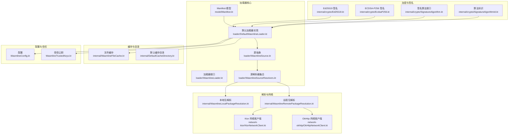
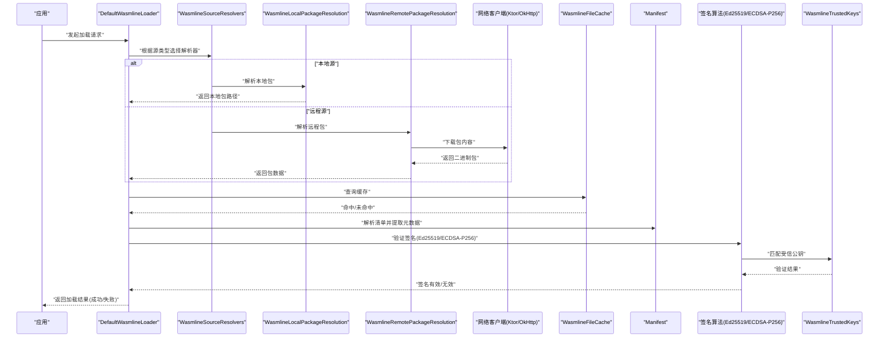
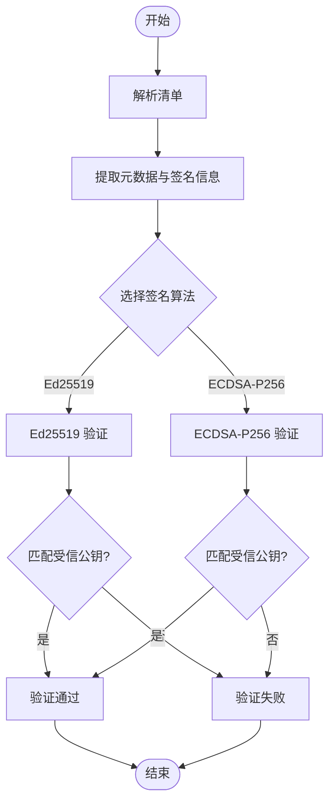
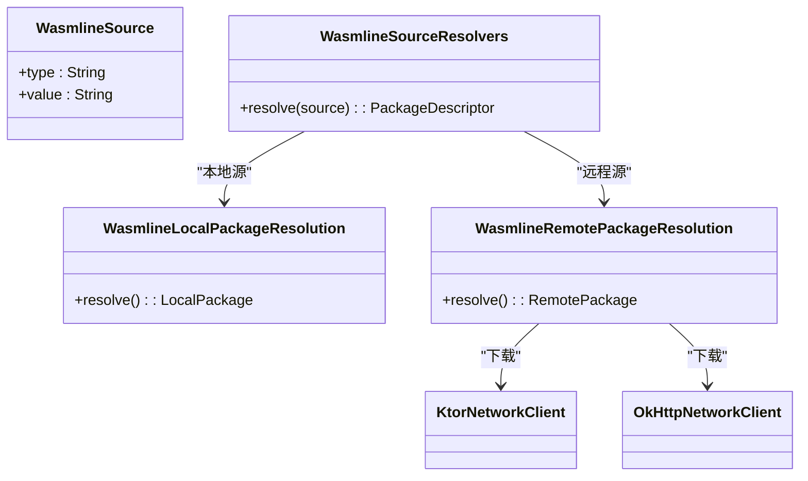
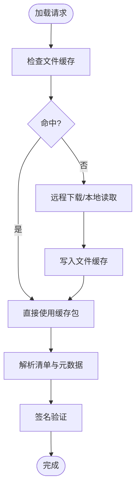
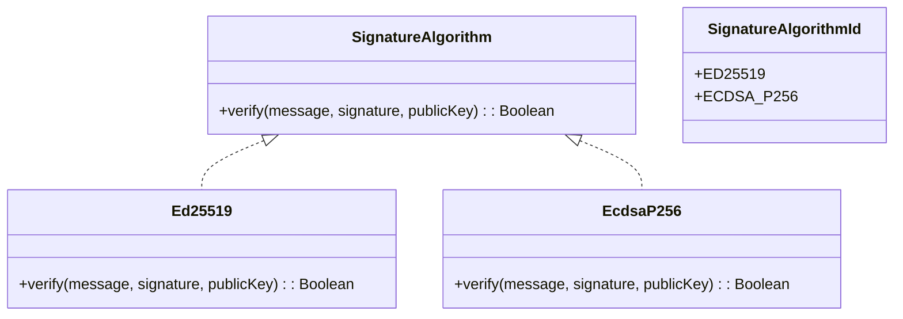
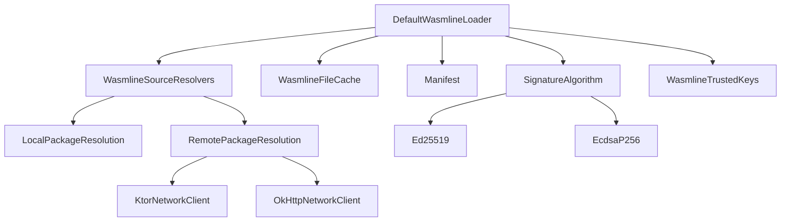

# 加载器系统

<cite>
**本文引用的文件**
- [Manifest.kt](file://wasmline-multiplatform/wasmline-loader/src/commonMain/kotlin/crow/wasmline/loader/model/Manifest.kt)
- [WasmlineLoader.kt](file://wasmline-multiplatform/wasmline-loader/src/hostMain/kotlin/crow/wasmline/loader/WasmlineLoader.kt)
- [DefaultWasmlineLoader.kt](file://wasmline-multiplatform/wasmline-loader/src/hostMain/kotlin/crow/wasmline/loader/DefaultWasmlineLoader.kt)
- [WasmlineSource.kt](file://wasmline-multiplatform/wasmline-loader/src/commonMain/kotlin/crow/wasmline/loader/WasmlineSource.kt)
- [WasmlineSourceResolvers.kt](file://wasmline-multiplatform/wasmline-loader/src/commonMain/kotlin/crow/wasmline/loader/WasmlineSourceResolvers.kt)
- [Ed25519.kt](file://wasmline-multiplatform/wasmline-loader/src/commonMain/kotlin/crow/wasmline/loader/internal/crypto/Ed25519.kt)
- [EcdsaP256.kt](file://wasmline-multiplatform/wasmline-loader/src/commonMain/kotlin/crow/wasmline/loader/internal/crypto/EcdsaP256.kt)
- [SignatureAlgorithm.kt](file://wasmline-multiplatform/wasmline-loader/src/commonMain/kotlin/crow/wasmline/loader/internal/crypto/SignatureAlgorithm.kt)
- [SignatureAlgorithmId.kt](file://wasmline-multiplatform/wasmline-loader/src/commonMain/kotlin/crow/wasmline/loader/internal/crypto/SignatureAlgorithmId.kt)
- [WasmlineFileCache.kt](file://wasmline-multiplatform/wasmline-loader/src/hostMain/kotlin/crow/wasmline/loader/internal/WasmlineFileCache.kt)
- [DefaultCacheDirectory.kt](file://wasmline-multiplatform/wasmline-loader/src/commonMain/kotlin/crow/wasmline/loader/internal/DefaultCacheDirectory.kt)
- [WasmlineLocalPackageResolution.kt](file://wasmline-multiplatform/wasmline-loader/src/hostMain/kotlin/crow/wasmline/loader/internal/WasmlineLocalPackageResolution.kt)
- [WasmlineRemotePackageResolution.kt](file://wasmline-multiplatform/wasmline-loader/src/hostMain/kotlin/crow/wasmline/loader/internal/WasmlineRemotePackageResolution.kt)
- [KtorNetworkClient.kt](file://wasmline-multiplatform/wasmline-network-ktor/src/commonMain/kotlin/crow/wasmline/network/ktor/KtorNetworkClient.kt)
- [OkHttpNetworkClient.kt](file://wasmline-multiplatform/wasmline-network-okhttp/src/commonMain/kotlin/crow/wasmline/network/okhttp/OkHttpNetworkClient.kt)
- [WasmlineConfig.kt](file://wasmline-multiplatform/wasmline/src/commonMain/kotlin/crow/wasmline/WasmlineConfig.kt)
- [WasmlineService.kt](file://wasmline-multiplatform/wasmline/src/commonMain/kotlin/crow/wasmline/WasmlineService.kt)
- [WasmlineCache.kt](file://wasmline-multiplatform/wasmline/src/commonMain/kotlin/crow/wasmline/WasmlineCache.kt)
- [WasmlineTrustedKeys.kt](file://wasmline-multiplatform/wasmline/src/commonMain/kotlin/crow/wasmline/WasmlineTrustedKeys.kt)
- [Manifest.kt（CLI）](file://wasmline-multiplatform/wasmline-cli/src/main/kotlin/crow/wasmline/cli/Manifest.kt)
- [Loader.md](file://wasmline-multiplatform/wasmline-loader/Loader.md)
</cite>

## 目录
1. [简介](#简介)
2. [项目结构](#项目结构)
3. [核心组件](#核心组件)
4. [架构总览](#架构总览)
5. [详细组件分析](#详细组件分析)
6. [依赖关系分析](#依赖关系分析)
7. [性能考量](#性能考量)
8. [故障排查指南](#故障排查指南)
9. [结论](#结论)
10. [附录](#附录)

## 简介
本技术文档围绕 Wasmline 加载器系统，系统性阐述模块加载的完整流程：从源解析、清单（Manifest）解析与签名验证、缓存策略（内存与文件），到最终模块实例化与服务绑定。文档同时覆盖多源解析器（本地文件、远程下载）、加密签名算法（Ed25519、ECDSA-P256）、配置与扩展机制，并提供插件分发与部署的最佳实践。

## 项目结构
Wasmline 多平台加载器位于 wasmline-multiplatform/wasmline-loader 模块中，采用 Kotlin Multiplatform 组织方式，按平台划分实现细节，同时在 commonMain 中定义跨平台接口与模型。核心文件包括：
- 清单模型与解析：model/Manifest.kt
- 加载器接口与默认实现：loader/WasmlineLoader.kt、loader/DefaultWasmlineLoader.kt
- 源抽象与解析器：loader/WasmlineSource.kt、loader/WasmlineSourceResolvers.kt
- 加密签名算法：internal/crypto/*（Ed25519、EcdsaP256）
- 缓存与目录：internal/WasmlineFileCache.kt、internal/DefaultCacheDirectory.kt
- 本地/远程包解析：internal/WasmlineLocalPackageResolution.kt、internal/WasmlineRemotePackageResolution.kt
- 网络客户端：network-ktor/KtorNetworkClient.kt、network-okhttp/OkHttpNetworkClient.kt
- 配置与信任密钥：WasmlineConfig.kt、WasmlineTrustedKeys.kt
- CLI 清单：cli/Manifest.kt
- 文档：Loader.md

图表来源
- [Manifest.kt:1-200](file://wasmline-multiplatform/wasmline-loader/src/commonMain/kotlin/crow/wasmline/loader/model/Manifest.kt#L1-L200)
- [WasmlineLoader.kt:1-200](file://wasmline-multiplatform/wasmline-loader/src/hostMain/kotlin/crow/wasmline/loader/WasmlineLoader.kt#L1-L200)
- [DefaultWasmlineLoader.kt:1-200](file://wasmline-multiplatform/wasmline-loader/src/hostMain/kotlin/crow/wasmline/loader/DefaultWasmlineLoader.kt#L1-L200)
- [WasmlineSource.kt:1-200](file://wasmline-multiplatform/wasmline-loader/src/commonMain/kotlin/crow/wasmline/loader/WasmlineSource.kt#L1-L200)
- [WasmlineSourceResolvers.kt:1-200](file://wasmline-multiplatform/wasmline-loader/src/commonMain/kotlin/crow/wasmline/loader/WasmlineSourceResolvers.kt#L1-L200)
- [Ed25519.kt:1-200](file://wasmline-multiplatform/wasmline-loader/src/commonMain/kotlin/crow/wasmline/loader/internal/crypto/Ed25519.kt#L1-L200)
- [EcdsaP256.kt:1-200](file://wasmline-multiplatform/wasmline-loader/src/commonMain/kotlin/crow/wasmline/loader/internal/crypto/EcdsaP256.kt#L1-L200)
- [SignatureAlgorithm.kt:1-200](file://wasmline-multiplatform/wasmline-loader/src/commonMain/kotlin/crow/wasmline/loader/internal/crypto/SignatureAlgorithm.kt#L1-L200)
- [SignatureAlgorithmId.kt:1-200](file://wasmline-multiplatform/wasmline-loader/src/commonMain/kotlin/crow/wasmline/loader/internal/crypto/SignatureAlgorithmId.kt#L1-L200)
- [WasmlineFileCache.kt:1-200](file://wasmline-multiplatform/wasmline-loader/src/hostMain/kotlin/crow/wasmline/loader/internal/WasmlineFileCache.kt#L1-L200)
- [DefaultCacheDirectory.kt:1-200](file://wasmline-multiplatform/wasmline-loader/src/commonMain/kotlin/crow/wasmline/loader/internal/DefaultCacheDirectory.kt#L1-L200)
- [WasmlineLocalPackageResolution.kt:1-200](file://wasmline-multiplatform/wasmline-loader/src/hostMain/kotlin/crow/wasmline/loader/internal/WasmlineLocalPackageResolution.kt#L1-L200)
- [WasmlineRemotePackageResolution.kt:1-200](file://wasmline-multiplatform/wasmline-loader/src/hostMain/kotlin/crow/wasmline/loader/internal/WasmlineRemotePackageResolution.kt#L1-L200)
- [KtorNetworkClient.kt:1-200](file://wasmline-multiplatform/wasmline-network-ktor/src/commonMain/kotlin/crow/wasmline/network/ktor/KtorNetworkClient.kt#L1-L200)
- [OkHttpNetworkClient.kt:1-200](file://wasmline-multiplatform/wasmline-network-okhttp/src/commonMain/kotlin/crow/wasmline/network/okhttp/OkHttpNetworkClient.kt#L1-L200)
- [WasmlineConfig.kt:1-200](file://wasmline-multiplatform/wasmline/src/commonMain/kotlin/crow/wasmline/WasmlineConfig.kt#L1-L200)
- [WasmlineTrustedKeys.kt:1-200](file://wasmline-multiplatform/wasmline/src/commonMain/kotlin/crow/wasmline/WasmlineTrustedKeys.kt#L1-L200)

章节来源
- [Loader.md:1-200](file://wasmline-multiplatform/wasmline-loader/Loader.md#L1-L200)

## 核心组件
- 清单模型（Manifest）：定义插件元数据、版本、入口点、签名信息等，用于加载前校验与元数据提取。
- 加载器接口与默认实现：对外暴露统一加载 API，内部协调源解析、网络下载、缓存、签名验证与模块实例化。
- 源抽象与解析器：抽象“源”概念，支持本地文件、远程 URL 等；解析器负责将源转换为可下载或可读取的包。
- 加密签名算法：提供 Ed25519 与 ECDSA-P256 的签名验证能力，结合受信公钥列表进行可信度判定。
- 缓存系统：文件缓存持久化已下载包，减少重复下载；默认缓存目录按平台提供。
- 网络客户端：Ktor 与 OkHttp 两种网络实现，供远程包解析使用。
- 配置与信任：全局配置项与受信公钥集合，决定加载行为与安全边界。

章节来源
- [Manifest.kt:1-200](file://wasmline-multiplatform/wasmline-loader/src/commonMain/kotlin/crow/wasmline/loader/model/Manifest.kt#L1-L200)
- [WasmlineLoader.kt:1-200](file://wasmline-multiplatform/wasmline-loader/src/hostMain/kotlin/crow/wasmline/loader/WasmlineLoader.kt#L1-L200)
- [DefaultWasmlineLoader.kt:1-200](file://wasmline-multiplatform/wasmline-loader/src/hostMain/kotlin/crow/wasmline/loader/DefaultWasmlineLoader.kt#L1-L200)
- [WasmlineSource.kt:1-200](file://wasmline-multiplatform/wasmline-loader/src/commonMain/kotlin/crow/wasmline/loader/WasmlineSource.kt#L1-L200)
- [WasmlineSourceResolvers.kt:1-200](file://wasmline-multiplatform/wasmline-loader/src/commonMain/kotlin/crow/wasmline/loader/WasmlineSourceResolvers.kt#L1-L200)
- [Ed25519.kt:1-200](file://wasmline-multiplatform/wasmline-loader/src/commonMain/kotlin/crow/wasmline/loader/internal/crypto/Ed25519.kt#L1-L200)
- [EcdsaP256.kt:1-200](file://wasmline-multiplatform/wasmline-loader/src/commonMain/kotlin/crow/wasmline/loader/internal/crypto/EcdsaP256.kt#L1-L200)
- [SignatureAlgorithm.kt:1-200](file://wasmline-multiplatform/wasmline-loader/src/commonMain/kotlin/crow/wasmline/loader/internal/crypto/SignatureAlgorithm.kt#L1-L200)
- [SignatureAlgorithmId.kt:1-200](file://wasmline-multiplatform/wasmline-loader/src/commonMain/kotlin/crow/wasmline/loader/internal/crypto/SignatureAlgorithmId.kt#L1-L200)
- [WasmlineFileCache.kt:1-200](file://wasmline-multiplatform/wasmline-loader/src/hostMain/kotlin/crow/wasmline/loader/internal/WasmlineFileCache.kt#L1-L200)
- [DefaultCacheDirectory.kt:1-200](file://wasmline-multiplatform/wasmline-loader/src/commonMain/kotlin/crow/wasmline/loader/internal/DefaultCacheDirectory.kt#L1-L200)
- [WasmlineLocalPackageResolution.kt:1-200](file://wasmline-multiplatform/wasmline-loader/src/hostMain/kotlin/crow/wasmline/loader/internal/WasmlineLocalPackageResolution.kt#L1-L200)
- [WasmlineRemotePackageResolution.kt:1-200](file://wasmline-multiplatform/wasmline-loader/src/hostMain/kotlin/crow/wasmline/loader/internal/WasmlineRemotePackageResolution.kt#L1-L200)
- [KtorNetworkClient.kt:1-200](file://wasmline-multiplatform/wasmline-network-ktor/src/commonMain/kotlin/crow/wasmline/network/ktor/KtorNetworkClient.kt#L1-L200)
- [OkHttpNetworkClient.kt:1-200](file://wasmline-multiplatform/wasmline-network-okhttp/src/commonMain/kotlin/crow/wasmline/network/okhttp/OkHttpNetworkClient.kt#L1-L200)
- [WasmlineConfig.kt:1-200](file://wasmline-multiplatform/wasmline/src/commonMain/kotlin/crow/wasmline/WasmlineConfig.kt#L1-L200)
- [WasmlineTrustedKeys.kt:1-200](file://wasmline-multiplatform/wasmline/src/commonMain/kotlin/crow/wasmline/WasmlineTrustedKeys.kt#L1-L200)

## 架构总览
下图展示从“请求加载”到“模块可用”的端到端流程，包括源解析、清单解析、签名验证、缓存命中、网络下载与模块实例化。

图表来源
- [DefaultWasmlineLoader.kt:1-200](file://wasmline-multiplatform/wasmline-loader/src/hostMain/kotlin/crow/wasmline/loader/DefaultWasmlineLoader.kt#L1-L200)
- [WasmlineSourceResolvers.kt:1-200](file://wasmline-multiplatform/wasmline-loader/src/commonMain/kotlin/crow/wasmline/loader/WasmlineSourceResolvers.kt#L1-L200)
- [WasmlineLocalPackageResolution.kt:1-200](file://wasmline-multiplatform/wasmline-loader/src/hostMain/kotlin/crow/wasmline/loader/internal/WasmlineLocalPackageResolution.kt#L1-L200)
- [WasmlineRemotePackageResolution.kt:1-200](file://wasmline-multiplatform/wasmline-loader/src/hostMain/kotlin/crow/wasmline/loader/internal/WasmlineRemotePackageResolution.kt#L1-L200)
- [KtorNetworkClient.kt:1-200](file://wasmline-multiplatform/wasmline-network-ktor/src/commonMain/kotlin/crow/wasmline/network/ktor/KtorNetworkClient.kt#L1-L200)
- [OkHttpNetworkClient.kt:1-200](file://wasmline-multiplatform/wasmline-network-okhttp/src/commonMain/kotlin/crow/wasmline/network/okhttp/OkHttpNetworkClient.kt#L1-L200)
- [WasmlineFileCache.kt:1-200](file://wasmline-multiplatform/wasmline-loader/src/hostMain/kotlin/crow/wasmline/loader/internal/WasmlineFileCache.kt#L1-L200)
- [Manifest.kt:1-200](file://wasmline-multiplatform/wasmline-loader/src/commonMain/kotlin/crow/wasmline/loader/model/Manifest.kt#L1-L200)
- [Ed25519.kt:1-200](file://wasmline-multiplatform/wasmline-loader/src/commonMain/kotlin/crow/wasmline/loader/internal/crypto/Ed25519.kt#L1-L200)
- [EcdsaP256.kt:1-200](file://wasmline-multiplatform/wasmline-loader/src/commonMain/kotlin/crow/wasmline/loader/internal/crypto/EcdsaP256.kt#L1-L200)
- [WasmlineTrustedKeys.kt:1-200](file://wasmline-multiplatform/wasmline/src/commonMain/kotlin/crow/wasmline/WasmlineTrustedKeys.kt#L1-L200)

## 详细组件分析

### 清单（Manifest）解析与签名验证
- 结构与字段：清单包含插件名称、版本、入口函数、目标平台、依赖声明、签名信息等。加载前通过清单提取元数据，决定后续加载策略。
- 解析流程：读取清单文本/JSON，反序列化为强类型对象，校验必要字段完整性。
- 签名验证：根据清单中的签名算法标识选择对应算法（Ed25519 或 ECDSA-P256），使用受信公钥集合进行验证，确保来源可信且内容未被篡改。
- 可信公钥管理：受信公钥集合由配置注入，支持动态更新与平台特定策略。

图表来源
- [Manifest.kt:1-200](file://wasmline-multiplatform/wasmline-loader/src/commonMain/kotlin/crow/wasmline/loader/model/Manifest.kt#L1-L200)
- [Ed25519.kt:1-200](file://wasmline-multiplatform/wasmline-loader/src/commonMain/kotlin/crow/wasmline/loader/internal/crypto/Ed25519.kt#L1-L200)
- [EcdsaP256.kt:1-200](file://wasmline-multiplatform/wasmline-loader/src/commonMain/kotlin/crow/wasmline/loader/internal/crypto/EcdsaP256.kt#L1-L200)
- [SignatureAlgorithm.kt:1-200](file://wasmline-multiplatform/wasmline-loader/src/commonMain/kotlin/crow/wasmline/loader/internal/crypto/SignatureAlgorithm.kt#L1-L200)
- [SignatureAlgorithmId.kt:1-200](file://wasmline-multiplatform/wasmline-loader/src/commonMain/kotlin/crow/wasmline/loader/internal/crypto/SignatureAlgorithmId.kt#L1-L200)
- [WasmlineTrustedKeys.kt:1-200](file://wasmline-multiplatform/wasmline/src/commonMain/kotlin/crow/wasmline/WasmlineTrustedKeys.kt#L1-L200)

章节来源
- [Manifest.kt:1-200](file://wasmline-multiplatform/wasmline-loader/src/commonMain/kotlin/crow/wasmline/loader/model/Manifest.kt#L1-L200)
- [Manifest.kt（CLI）:1-200](file://wasmline-multiplatform/wasmline-cli/src/main/kotlin/crow/wasmline/cli/Manifest.kt#L1-L200)

### 源解析器与多源支持
- 源抽象：统一表示“源”，支持本地文件路径、远程 URL、平台特定标识等。
- 解析器集合：根据源类型选择本地或远程解析器；本地解析器负责路径合法性与包定位；远程解析器负责下载与校验。
- 远程下载：优先使用 Ktor 实现，也可替换为 OkHttp；支持断点续传、超时控制与重试策略（由网络客户端配置决定）。

图表来源
- [WasmlineSource.kt:1-200](file://wasmline-multiplatform/wasmline-loader/src/commonMain/kotlin/crow/wasmline/loader/WasmlineSource.kt#L1-L200)
- [WasmlineSourceResolvers.kt:1-200](file://wasmline-multiplatform/wasmline-loader/src/commonMain/kotlin/crow/wasmline/loader/WasmlineSourceResolvers.kt#L1-L200)
- [WasmlineLocalPackageResolution.kt:1-200](file://wasmline-multiplatform/wasmline-loader/src/hostMain/kotlin/crow/wasmline/loader/internal/WasmlineLocalPackageResolution.kt#L1-L200)
- [WasmlineRemotePackageResolution.kt:1-200](file://wasmline-multiplatform/wasmline-loader/src/hostMain/kotlin/crow/wasmline/loader/internal/WasmlineRemotePackageResolution.kt#L1-L200)
- [KtorNetworkClient.kt:1-200](file://wasmline-multiplatform/wasmline-network-ktor/src/commonMain/kotlin/crow/wasmline/network/ktor/KtorNetworkClient.kt#L1-L200)
- [OkHttpNetworkClient.kt:1-200](file://wasmline-multiplatform/wasmline-network-okhttp/src/commonMain/kotlin/crow/wasmline/network/okhttp/OkHttpNetworkClient.kt#L1-L200)

章节来源
- [WasmlineSource.kt:1-200](file://wasmline-multiplatform/wasmline-loader/src/commonMain/kotlin/crow/wasmline/loader/WasmlineSource.kt#L1-L200)
- [WasmlineSourceResolvers.kt:1-200](file://wasmline-multiplatform/wasmline-loader/src/commonMain/kotlin/crow/wasmline/loader/WasmlineSourceResolvers.kt#L1-L200)
- [WasmlineLocalPackageResolution.kt:1-200](file://wasmline-multiplatform/wasmline-loader/src/hostMain/kotlin/crow/wasmline/loader/internal/WasmlineLocalPackageResolution.kt#L1-L200)
- [WasmlineRemotePackageResolution.kt:1-200](file://wasmline-multiplatform/wasmline-loader/src/hostMain/kotlin/crow/wasmline/loader/internal/WasmlineRemotePackageResolution.kt#L1-L200)

### 缓存系统设计（内存与文件）
- 文件缓存：对已下载的包进行持久化存储，避免重复下载；支持清理策略与容量上限（由平台默认目录与配置共同决定）。
- 默认缓存目录：按平台提供默认路径，确保跨平台一致性与可维护性。
- 内存缓存：对近期访问的清单与元数据进行内存缓存，降低重复解析成本。

图表来源
- [WasmlineFileCache.kt:1-200](file://wasmline-multiplatform/wasmline-loader/src/hostMain/kotlin/crow/wasmline/loader/internal/WasmlineFileCache.kt#L1-L200)
- [DefaultCacheDirectory.kt:1-200](file://wasmline-multiplatform/wasmline-loader/src/commonMain/kotlin/crow/wasmline/loader/internal/DefaultCacheDirectory.kt#L1-L200)
- [DefaultWasmlineLoader.kt:1-200](file://wasmline-multiplatform/wasmline-loader/src/hostMain/kotlin/crow/wasmline/loader/DefaultWasmlineLoader.kt#L1-L200)

章节来源
- [WasmlineFileCache.kt:1-200](file://wasmline-multiplatform/wasmline-loader/src/hostMain/kotlin/crow/wasmline/loader/internal/WasmlineFileCache.kt#L1-L200)
- [DefaultCacheDirectory.kt:1-200](file://wasmline-multiplatform/wasmline-loader/src/commonMain/kotlin/crow/wasmline/loader/internal/DefaultCacheDirectory.kt#L1-L200)

### 加密签名验证（Ed25519 与 ECDSA-P256）
- 算法选择：根据清单中的算法标识自动选择 Ed25519 或 ECDSA-P256。
- 公钥匹配：使用受信公钥集合进行匹配，仅接受白名单内的公钥签名。
- 性能与安全性：Ed25519 提供高性能与强安全性；ECDSA-P256 在兼容性场景下作为补充方案。

图表来源
- [SignatureAlgorithm.kt:1-200](file://wasmline-multiplatform/wasmline-loader/src/commonMain/kotlin/crow/wasmline/loader/internal/crypto/SignatureAlgorithm.kt#L1-L200)
- [Ed25519.kt:1-200](file://wasmline-multiplatform/wasmline-loader/src/commonMain/kotlin/crow/wasmline/loader/internal/crypto/Ed25519.kt#L1-L200)
- [EcdsaP256.kt:1-200](file://wasmline-multiplatform/wasmline-loader/src/commonMain/kotlin/crow/wasmline/loader/internal/crypto/EcdsaP256.kt#L1-L200)
- [SignatureAlgorithmId.kt:1-200](file://wasmline-multiplatform/wasmline-loader/src/commonMain/kotlin/crow/wasmline/loader/internal/crypto/SignatureAlgorithmId.kt#L1-L200)

章节来源
- [Ed25519.kt:1-200](file://wasmline-multiplatform/wasmline-loader/src/commonMain/kotlin/crow/wasmline/loader/internal/crypto/Ed25519.kt#L1-L200)
- [EcdsaP256.kt:1-200](file://wasmline-multiplatform/wasmline-loader/src/commonMain/kotlin/crow/wasmline/loader/internal/crypto/EcdsaP256.kt#L1-L200)
- [SignatureAlgorithm.kt:1-200](file://wasmline-multiplatform/wasmline-loader/src/commonMain/kotlin/crow/wasmline/loader/internal/crypto/SignatureAlgorithm.kt#L1-L200)
- [SignatureAlgorithmId.kt:1-200](file://wasmline-multiplatform/wasmline-loader/src/commonMain/kotlin/crow/wasmline/loader/internal/crypto/SignatureAlgorithmId.kt#L1-L200)

### 加载器配置与扩展机制
- 配置项：包括网络超时、重试次数、缓存策略、是否启用严格签名验证等。
- 扩展点：可通过替换网络客户端、自定义缓存目录、注册新的源解析器等方式扩展加载器能力。
- 平台适配：针对 JVM、Android、iOS、Web、Wasm 等平台提供差异化实现与默认行为。

章节来源
- [WasmlineConfig.kt:1-200](file://wasmline-multiplatform/wasmline/src/commonMain/kotlin/crow/wasmline/WasmlineConfig.kt#L1-L200)
- [DefaultWasmlineLoader.kt:1-200](file://wasmline-multiplatform/wasmline-loader/src/hostMain/kotlin/crow/wasmline/loader/DefaultWasmlineLoader.kt#L1-L200)

### 插件分发与部署最佳实践
- 清单规范：确保清单字段完整、签名正确、入口函数与平台兼容。
- 分发渠道：优先使用 HTTPS 下载，配合签名验证；可提供多平台产物与独立清单。
- 版本管理：通过清单版本号与哈希值保证一致性；发布新版本时保留旧版本以支持回滚。
- 安全建议：仅允许受信公钥签名；在生产环境启用严格验证；定期轮换密钥与更新受信公钥列表。

章节来源
- [Manifest.kt（CLI）:1-200](file://wasmline-multiplatform/wasmline-cli/src/main/kotlin/crow/wasmline/cli/Manifest.kt#L1-L200)
- [WasmlineTrustedKeys.kt:1-200](file://wasmline-multiplatform/wasmline/src/commonMain/kotlin/crow/wasmline/WasmlineTrustedKeys.kt#L1-L200)

## 依赖关系分析
- 耦合与内聚：加载器核心与网络、缓存、加密模块松耦合，通过接口与配置连接；解析器与网络客户端可替换。
- 外部依赖：Ktor 与 OkHttp 作为网络传输层；平台文件系统与日志系统。
- 循环依赖：未见循环依赖迹象；各模块职责清晰。

图表来源
- [DefaultWasmlineLoader.kt:1-200](file://wasmline-multiplatform/wasmline-loader/src/hostMain/kotlin/crow/wasmline/loader/DefaultWasmlineLoader.kt#L1-L200)
- [WasmlineSourceResolvers.kt:1-200](file://wasmline-multiplatform/wasmline-loader/src/commonMain/kotlin/crow/wasmline/loader/WasmlineSourceResolvers.kt#L1-L200)
- [WasmlineLocalPackageResolution.kt:1-200](file://wasmline-multiplatform/wasmline-loader/src/hostMain/kotlin/crow/wasmline/loader/internal/WasmlineLocalPackageResolution.kt#L1-L200)
- [WasmlineRemotePackageResolution.kt:1-200](file://wasmline-multiplatform/wasmline-loader/src/hostMain/kotlin/crow/wasmline/loader/internal/WasmlineRemotePackageResolution.kt#L1-L200)
- [KtorNetworkClient.kt:1-200](file://wasmline-multiplatform/wasmline-network-ktor/src/commonMain/kotlin/crow/wasmline/network/ktor/KtorNetworkClient.kt#L1-L200)
- [OkHttpNetworkClient.kt:1-200](file://wasmline-multiplatform/wasmline-network-okhttp/src/commonMain/kotlin/crow/wasmline/network/okhttp/OkHttpNetworkClient.kt#L1-L200)
- [WasmlineFileCache.kt:1-200](file://wasmline-multiplatform/wasmline-loader/src/hostMain/kotlin/crow/wasmline/loader/internal/WasmlineFileCache.kt#L1-L200)
- [Manifest.kt:1-200](file://wasmline-multiplatform/wasmline-loader/src/commonMain/kotlin/crow/wasmline/loader/model/Manifest.kt#L1-L200)
- [Ed25519.kt:1-200](file://wasmline-multiplatform/wasmline-loader/src/commonMain/kotlin/crow/wasmline/loader/internal/crypto/Ed25519.kt#L1-L200)
- [EcdsaP256.kt:1-200](file://wasmline-multiplatform/wasmline-loader/src/commonMain/kotlin/crow/wasmline/loader/internal/crypto/EcdsaP256.kt#L1-L200)
- [WasmlineTrustedKeys.kt:1-200](file://wasmline-multiplatform/wasmline/src/commonMain/kotlin/crow/wasmline/WasmlineTrustedKeys.kt#L1-L200)

## 性能考量
- 缓存命中率：合理设置缓存目录与清理策略，提升重复加载性能。
- 并行下载：在多源场景下并行处理多个远程包，缩短整体加载时间。
- 增量验证：对已验证过的包跳过重复签名验证，减少 CPU 开销。
- 网络优化：配置合适的超时与重试参数，避免阻塞主线程。

## 故障排查指南
- 清单解析失败：检查清单格式与字段完整性；确认清单与代码签名一致。
- 签名验证失败：核对受信公钥列表是否包含对应公钥；确认算法标识与实际签名一致。
- 缓存问题：清理缓存后重试；检查缓存目录权限与磁盘空间。
- 网络错误：检查网络客户端配置与代理设置；确认目标域名可达。
- 平台差异：在不同平台观察到的行为差异需参考平台特定实现与默认配置。

章节来源
- [Manifest.kt:1-200](file://wasmline-multiplatform/wasmline-loader/src/commonMain/kotlin/crow/wasmline/loader/model/Manifest.kt#L1-L200)
- [Ed25519.kt:1-200](file://wasmline-multiplatform/wasmline-loader/src/commonMain/kotlin/crow/wasmline/loader/internal/crypto/Ed25519.kt#L1-L200)
- [EcdsaP256.kt:1-200](file://wasmline-multiplatform/wasmline-loader/src/commonMain/kotlin/crow/wasmline/loader/internal/crypto/EcdsaP256.kt#L1-L200)
- [WasmlineFileCache.kt:1-200](file://wasmline-multiplatform/wasmline-loader/src/hostMain/kotlin/crow/wasmline/loader/internal/WasmlineFileCache.kt#L1-L200)
- [KtorNetworkClient.kt:1-200](file://wasmline-multiplatform/wasmline-network-ktor/src/commonMain/kotlin/crow/wasmline/network/ktor/KtorNetworkClient.kt#L1-L200)
- [OkHttpNetworkClient.kt:1-200](file://wasmline-multiplatform/wasmline-network-okhttp/src/commonMain/kotlin/crow/wasmline/network/okhttp/OkHttpNetworkClient.kt#L1-L200)

## 结论
Wasmline 加载器系统通过清晰的模块化设计与多平台适配，提供了从源解析、清单验证、签名校验到缓存与网络下载的完整链路。借助 Ed25519 与 ECDSA-P256 等现代密码学算法与受信公钥管理，系统在保证安全性的同时兼顾性能与可扩展性。结合本文提供的最佳实践与排障指南，可在多平台上稳定地分发与部署插件。

## 附录
- 更多实现细节与平台差异请参考 Loader.md 文档与各平台源码实现。

章节来源
- [Loader.md:1-200](file://wasmline-multiplatform/wasmline-loader/Loader.md#L1-L200)