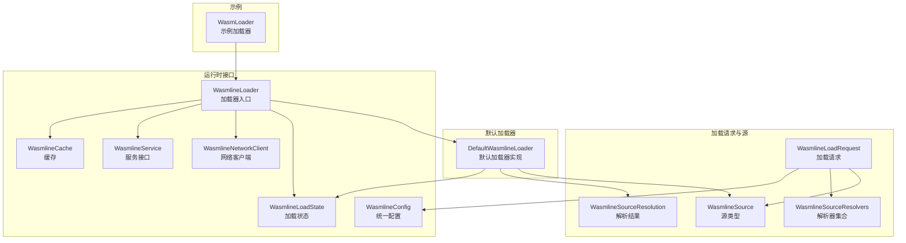
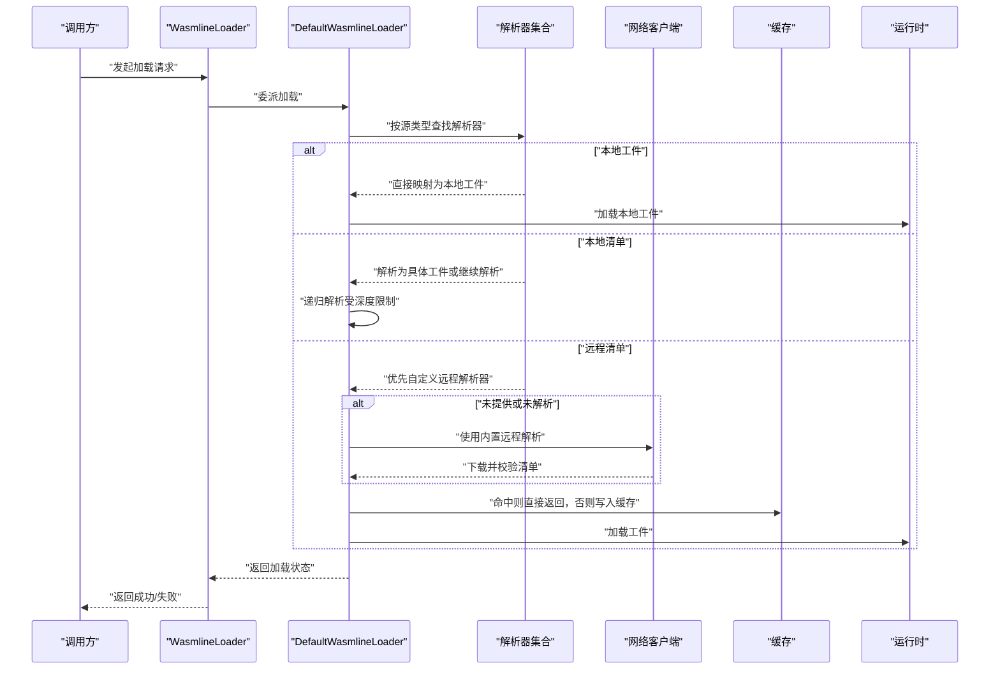
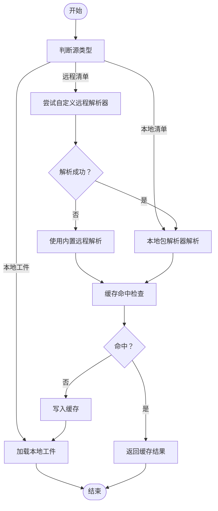
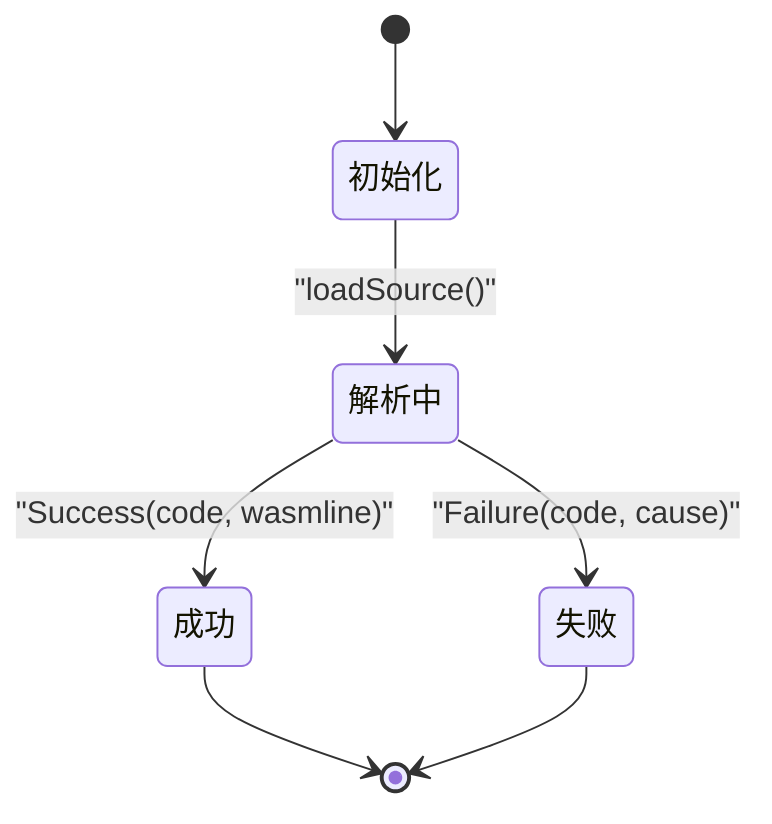
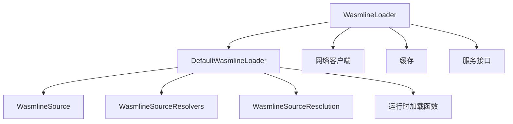
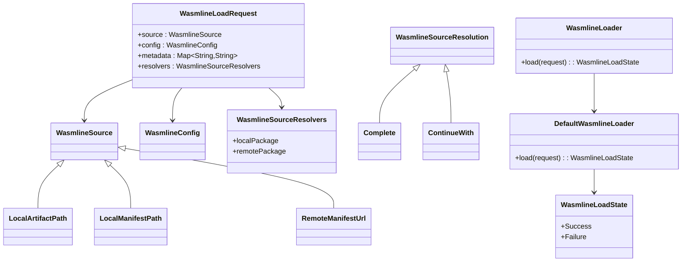

# 模块加载流程

<cite>
**本文引用的文件**
- [WasmlineLoadRequest.kt](file://wasmline-multiplatform/wasmline-loader/src/commonMain/kotlin/crow/wasmline/loader/WasmlineLoadRequest.kt)
- [WasmlineSource.kt](file://wasmline-multiplatform/wasmline-loader/src/commonMain/kotlin/crow/wasmline/loader/WasmlineSource.kt)
- [WasmlineSourceResolution.kt](file://wasmline-multiplatform/wasmline-loader/src/commonMain/kotlin/crow/wasmline/loader/WasmlineSourceResolution.kt)
- [WasmlineSourceResolvers.kt](file://wasmline-multiplatform/wasmline-loader/src/commonMain/kotlin/crow/wasmline/loader/WasmlineSourceResolvers.kt)
- [DefaultWasmlineLoader.kt](file://wasmline-multiplatform/wasmline-loader/src/hostMain/kotlin/crow/wasmline/loader/DefaultWasmlineLoader.kt)
- [WasmlineLoader.kt](file://wasmline-multiplatform/wasmline/src/hostMain/kotlin/crow/wasmline/WasmlineLoader.kt)
- [WasmlineLoadState.kt](file://wasmline-multiplatform/wasmline/src/hostMain/kotlin/crow/wasmline/WasmlineLoadState.kt)
- [WasmlineConfig.kt](file://wasmline-multiplatform/wasmline/src/hostMain/kotlin/crow/wasmline/WasmlineConfig.kt)
- [WasmlineCache.kt](file://wasmline-multiplatform/wasmline/src/hostMain/kotlin/crow/wasmline/WasmlineCache.kt)
- [WasmlineNetworkClient.kt](file://wasmline-multiplatform/wasmline/src/hostMain/kotlin/crow/wasmline/WasmlineNetworkClient.kt)
- [WasmlineService.kt](file://wasmline-multiplatform/wasmline/src/hostMain/kotlin/crow/wasmline/WasmlineService.kt)
- [WasmLoader.kt](file://wasmline-samples/kotlin/sample-apps/multiplatform/shared/src/commonMain/kotlin/crow/wasmline/sample/WasmLoader.kt)
</cite>

## 目录
1. [引言](#引言)
2. [项目结构](#项目结构)
3. [核心组件](#核心组件)
4. [架构总览](#架构总览)
5. [详细组件分析](#详细组件分析)
6. [依赖关系分析](#依赖关系分析)
7. [性能考虑](#性能考虑)
8. [故障排查指南](#故障排查指南)
9. [结论](#结论)
10. [附录](#附录)

## 引言
本技术文档围绕 wasmline 的模块加载流程展开，系统性阐述从请求发起到模块实例化的完整过程，覆盖加载状态管理、错误处理与超时机制、加载请求的构建与配置（源选择、参数传递、回调设置）、加载状态转换机制（初始化到完成或失败）、并发加载策略与资源管理、性能优化建议与监控指标，以及实际代码示例路径，帮助开发者正确使用加载器进行模块加载。

## 项目结构
wasmline 将“加载”能力拆分为多模块协作：
- 加载请求与源定义：在 loader 模块中定义加载请求、源类型、解析结果与解析器集合。
- 默认加载器实现：在 hostMain 中实现默认加载器，负责根据源类型分派到本地/远程解析链路。
- 运行时接口与状态：在主模块中定义加载状态、加载器入口、配置与网络客户端等。
- 示例与用法：在 samples 中提供跨平台加载示例。

图表来源
- [WasmlineLoadRequest.kt:1-19](file://wasmline-multiplatform/wasmline-loader/src/commonMain/kotlin/crow/wasmline/loader/WasmlineLoadRequest.kt#L1-L19)
- [WasmlineSource.kt:1-15](file://wasmline-multiplatform/wasmline-loader/src/commonMain/kotlin/crow/wasmline/loader/WasmlineSource.kt#L1-L15)
- [WasmlineSourceResolvers.kt](file://wasmline-multiplatform/wasmline-loader/src/commonMain/kotlin/crow/wasmline/loader/WasmlineSourceResolvers.kt)
- [WasmlineSourceResolution.kt](file://wasmline-multiplatform/wasmline-loader/src/commonMain/kotlin/crow/wasmline/loader/WasmlineSourceResolution.kt)
- [DefaultWasmlineLoader.kt:1-110](file://wasmline-multiplatform/wasmline-loader/src/hostMain/kotlin/crow/wasmline/loader/DefaultWasmlineLoader.kt#L1-L110)
- [WasmlineLoader.kt](file://wasmline-multiplatform/wasmline/src/hostMain/kotlin/crow/wasmline/WasmlineLoader.kt)
- [WasmlineLoadState.kt:1-32](file://wasmline-multiplatform/wasmline/src/hostMain/kotlin/crow/wasmline/WasmlineLoadState.kt#L1-L32)
- [WasmlineConfig.kt](file://wasmline-multiplatform/wasmline/src/hostMain/kotlin/crow/wasmline/WasmlineConfig.kt)
- [WasmlineNetworkClient.kt](file://wasmline-multiplatform/wasmline/src/hostMain/kotlin/crow/wasmline/WasmlineNetworkClient.kt)
- [WasmlineService.kt](file://wasmline-multiplatform/wasmline/src/hostMain/kotlin/crow/wasmline/WasmlineService.kt)
- [WasmlineCache.kt](file://wasmline-multiplatform/wasmline/src/hostMain/kotlin/crow/wasmline/WasmlineCache.kt)
- [WasmLoader.kt](file://wasmline-samples/kotlin/sample-apps/multiplatform/shared/src/commonMain/kotlin/crow/wasmline/sample/WasmLoader.kt)

章节来源
- [WasmlineLoadRequest.kt:1-19](file://wasmline-multiplatform/wasmline-loader/src/commonMain/kotlin/crow/wasmline/loader/WasmlineLoadRequest.kt#L1-L19)
- [WasmlineSource.kt:1-15](file://wasmline-multiplatform/wasmline-loader/src/commonMain/kotlin/crow/wasmline/loader/WasmlineSource.kt#L1-L15)
- [DefaultWasmlineLoader.kt:1-110](file://wasmline-multiplatform/wasmline-loader/src/hostMain/kotlin/crow/wasmline/loader/DefaultWasmlineLoader.kt#L1-L110)
- [WasmlineLoader.kt](file://wasmline-multiplatform/wasmline/src/hostMain/kotlin/crow/wasmline/WasmlineLoader.kt)
- [WasmlineLoadState.kt:1-32](file://wasmline-multiplatform/wasmline/src/hostMain/kotlin/crow/wasmline/WasmlineLoadState.kt#L1-L32)

## 核心组件
- 加载请求（WasmlineLoadRequest）：封装源信息、统一配置、元数据与自定义解析器钩子。
- 源类型（WasmlineSource）：支持本地工件路径、本地清单路径、远程清单 URL 三种来源。
- 解析器集合（WasmlineSourceResolvers）：可注入本地包解析器与远程包解析器。
- 解析结果（WasmlineSourceResolution）：Complete 表示已完成，ContinueWith 表示继续递归解析新源。
- 默认加载器（DefaultWasmlineLoader）：根据源类型分派到本地/远程解析链路，处理解析深度限制与失败回退。
- 加载状态（WasmlineLoadState）：Success/Failure，携带状态码与原因；提供 onXxx 扩展以简化分支处理。
- 统一配置（WasmlineConfig）：承载网络客户端、缓存策略、信任密钥等运行时行为。
- 网络客户端（WasmlineNetworkClient）：用于远程包下载与校验。
- 缓存（WasmlineCache）：本地缓存以提升重复加载性能。
- 加载器入口（WasmlineLoader）：对外暴露的加载 API，协调默认加载器与运行时环境。
- 示例加载器（WasmLoader）：跨平台示例，演示如何构造请求并发起加载。

章节来源
- [WasmlineLoadRequest.kt:1-19](file://wasmline-multiplatform/wasmline-loader/src/commonMain/kotlin/crow/wasmline/loader/WasmlineLoadRequest.kt#L1-L19)
- [WasmlineSource.kt:1-15](file://wasmline-multiplatform/wasmline-loader/src/commonMain/kotlin/crow/wasmline/loader/WasmlineSource.kt#L1-L15)
- [WasmlineSourceResolvers.kt](file://wasmline-multiplatform/wasmline-loader/src/commonMain/kotlin/crow/wasmline/loader/WasmlineSourceResolvers.kt)
- [WasmlineSourceResolution.kt](file://wasmline-multiplatform/wasmline-loader/src/commonMain/kotlin/crow/wasmline/loader/WasmlineSourceResolution.kt)
- [DefaultWasmlineLoader.kt:1-110](file://wasmline-multiplatform/wasmline-loader/src/hostMain/kotlin/crow/wasmline/loader/DefaultWasmlineLoader.kt#L1-L110)
- [WasmlineLoadState.kt:1-32](file://wasmline-multiplatform/wasmline/src/hostMain/kotlin/crow/wasmline/WasmlineLoadState.kt#L1-L32)
- [WasmlineConfig.kt](file://wasmline-multiplatform/wasmline/src/hostMain/kotlin/crow/wasmline/WasmlineConfig.kt)
- [WasmlineNetworkClient.kt](file://wasmline-multiplatform/wasmline/src/hostMain/kotlin/crow/wasmline/WasmlineNetworkClient.kt)
- [WasmlineCache.kt](file://wasmline-multiplatform/wasmline/src/hostMain/kotlin/crow/wasmline/WasmlineCache.kt)
- [WasmlineLoader.kt](file://wasmline-multiplatform/wasmline/src/hostMain/kotlin/crow/wasmline/WasmlineLoader.kt)
- [WasmLoader.kt](file://wasmline-samples/kotlin/sample-apps/multiplatform/shared/src/commonMain/kotlin/crow/wasmline/sample/WasmLoader.kt)

## 架构总览
下图展示了从调用方到模块实例化的端到端流程，包括请求构建、源解析、远程下载与校验、本地加载、状态返回与缓存更新。

图表来源
- [DefaultWasmlineLoader.kt:1-110](file://wasmline-multiplatform/wasmline-loader/src/hostMain/kotlin/crow/wasmline/loader/DefaultWasmlineLoader.kt#L1-L110)
- [WasmlineSourceResolvers.kt](file://wasmline-multiplatform/wasmline-loader/src/commonMain/kotlin/crow/wasmline/loader/WasmlineSourceResolvers.kt)
- [WasmlineNetworkClient.kt](file://wasmline-multiplatform/wasmline/src/hostMain/kotlin/crow/wasmline/WasmlineNetworkClient.kt)
- [WasmlineCache.kt](file://wasmline-multiplatform/wasmline/src/hostMain/kotlin/crow/wasmline/WasmlineCache.kt)
- [WasmlineLoader.kt](file://wasmline-multiplatform/wasmline/src/hostMain/kotlin/crow/wasmline/WasmlineLoader.kt)

## 详细组件分析

### 加载请求构建与配置
- 请求字段
  - 源（source）：指定本地工件、本地清单或远程清单 URL。
  - 配置（config）：统一控制网络客户端、信任密钥、缓存策略等。
  - 元数据（metadata）：透传给解析链，便于自定义解析逻辑。
  - 解析器（resolvers）：可注入本地包解析器与远程包解析器，实现扩展。
- 参数传递
  - 通过 WasmlineLoadRequest 将上述参数一次性传递给加载器。
  - 解析器可通过 metadata 获取上下文信息，实现灵活的源选择。
- 回调设置
  - 当前模型以同步返回 WasmlineLoadState 为主，若需异步回调，可在上层封装协程或事件总线。

章节来源
- [WasmlineLoadRequest.kt:1-19](file://wasmline-multiplatform/wasmline-loader/src/commonMain/kotlin/crow/wasmline/loader/WasmlineLoadRequest.kt#L1-L19)
- [WasmlineSource.kt:1-15](file://wasmline-multiplatform/wasmline-loader/src/commonMain/kotlin/crow/wasmline/loader/WasmlineSource.kt#L1-L15)
- [WasmlineSourceResolvers.kt](file://wasmline-multiplatform/wasmline-loader/src/commonMain/kotlin/crow/wasmline/loader/WasmlineSourceResolvers.kt)
- [WasmlineConfig.kt](file://wasmline-multiplatform/wasmline/src/hostMain/kotlin/crow/wasmline/WasmlineConfig.kt)

### 源选择与解析链
- 本地工件（LocalArtifactPath）
  - 直接映射为本地文件路径，交由运行时加载。
- 本地清单（LocalManifestPath）
  - 通过本地包解析器解析为具体工件，支持递归解析（受最大深度限制）。
- 远程清单（RemoteManifestUrl）
  - 优先使用自定义远程解析器；若未提供或未解析，则使用内置远程解析（需要网络客户端）。
  - 解析完成后进入缓存命中检查，命中则直接返回，否则写入缓存。

图表来源
- [DefaultWasmlineLoader.kt:22-96](file://wasmline-multiplatform/wasmline-loader/src/hostMain/kotlin/crow/wasmline/loader/DefaultWasmlineLoader.kt#L22-L96)
- [WasmlineSourceResolvers.kt](file://wasmline-multiplatform/wasmline-loader/src/commonMain/kotlin/crow/wasmline/loader/WasmlineSourceResolvers.kt)
- [WasmlineCache.kt](file://wasmline-multiplatform/wasmline/src/hostMain/kotlin/crow/wasmline/WasmlineCache.kt)

章节来源
- [DefaultWasmlineLoader.kt:22-96](file://wasmline-multiplatform/wasmline-loader/src/hostMain/kotlin/crow/wasmline/loader/DefaultWasmlineLoader.kt#L22-L96)

### 加载状态管理与转换
- 状态模型
  - 成功：携带状态码与 Wasmline 实例。
  - 失败：携带状态码与错误原因字符串。
- 转换机制
  - 初始化：接收 WasmlineLoadRequest 后进入 loadSource。
  - 解析阶段：根据源类型调用对应解析器，可能递归继续解析。
  - 完成阶段：返回 Success 或 Failure。
- 分支处理
  - 提供 onSuccess/onFailure 扩展方法，简化上层分支处理。

图表来源
- [WasmlineLoadState.kt:13-32](file://wasmline-multiplatform/wasmline/src/hostMain/kotlin/crow/wasmline/WasmlineLoadState.kt#L13-L32)
- [DefaultWasmlineLoader.kt:14-20](file://wasmline-multiplatform/wasmline-loader/src/hostMain/kotlin/crow/wasmline/loader/DefaultWasmlineLoader.kt#L14-L20)

章节来源
- [WasmlineLoadState.kt:13-32](file://wasmline-multiplatform/wasmline/src/hostMain/kotlin/crow/wasmline/WasmlineLoadState.kt#L13-L32)
- [DefaultWasmlineLoader.kt:14-20](file://wasmline-multiplatform/wasmline-loader/src/hostMain/kotlin/crow/wasmline/loader/DefaultWasmlineLoader.kt#L14-L20)

### 错误处理与超时机制
- 错误处理
  - 解析深度超限：返回固定失败状态码与提示信息，避免无限递归。
  - 不支持的源：当未提供相应解析器且无法内置解析时，返回失败状态码与提示信息。
  - 远程解析失败：若网络客户端不可用或下载/校验失败，返回失败状态码与原因。
- 超时机制
  - 默认加载器未内置超时控制；如需超时，应在上层封装（例如协程超时、网络客户端超时配置）或在网络客户端实现中注入超时策略。

章节来源
- [DefaultWasmlineLoader.kt:27-32](file://wasmline-multiplatform/wasmline-loader/src/hostMain/kotlin/crow/wasmline/loader/DefaultWasmlineLoader.kt#L27-L32)
- [DefaultWasmlineLoader.kt:67-72](file://wasmline-multiplatform/wasmline-loader/src/hostMain/kotlin/crow/wasmline/loader/DefaultWasmlineLoader.kt#L67-L72)
- [DefaultWasmlineLoader.kt:102-106](file://wasmline-multiplatform/wasmline-loader/src/hostMain/kotlin/crow/wasmline/loader/DefaultWasmlineLoader.kt#L102-L106)

### 并发加载与资源管理
- 并发策略
  - 默认加载器未显式提供并发队列或锁；建议在上层应用维护并发控制（如信号量或串行队列），避免同时发起大量远程下载导致资源争用。
- 资源管理
  - 缓存：命中则直接返回，未命中则写入缓存，减少重复 IO 与网络请求。
  - 网络：远程解析依赖网络客户端；建议在配置中设置合理的连接/读取超时与重试策略。
  - 文件访问：不同宿主平台提供不同的文件访问实现，确保在各平台正确初始化。

章节来源
- [WasmlineCache.kt](file://wasmline-multiplatform/wasmline/src/hostMain/kotlin/crow/wasmline/WasmlineCache.kt)
- [WasmlineNetworkClient.kt](file://wasmline-multiplatform/wasmline/src/hostMain/kotlin/crow/wasmline/WasmlineNetworkClient.kt)
- [DefaultWasmlineLoader.kt:58-66](file://wasmline-multiplatform/wasmline-loader/src/hostMain/kotlin/crow/wasmline/loader/DefaultWasmlineLoader.kt#L58-L66)

### 性能优化与监控指标
- 优化建议
  - 使用缓存：优先命中缓存，减少网络与磁盘 IO。
  - 合理并发：对远程加载进行节流，避免过多并发请求。
  - 预热：在空闲时段预加载常用模块，降低首帧延迟。
  - 压缩与分片：远程清单与工件采用压缩传输，必要时支持分片下载。
- 监控指标
  - 加载耗时（总时长、解析时长、下载时长、校验时长、实例化时长）。
  - 命中率（缓存命中次数/总加载次数）。
  - 失败率与失败原因分布。
  - 并发度与等待时间。

[本节为通用指导，不直接分析具体文件]

### 实际使用示例
以下示例路径展示了如何正确使用加载器进行模块加载：
- 构建加载请求：参考 [WasmlineLoadRequest.kt:13-18](file://wasmline-multiplatform/wasmline-loader/src/commonMain/kotlin/crow/wasmline/loader/WasmlineLoadRequest.kt#L13-L18)
- 选择源类型：参考 [WasmlineSource.kt:10-14](file://wasmline-multiplatform/wasmline-loader/src/commonMain/kotlin/crow/wasmline/loader/WasmlineSource.kt#L10-L14)
- 注入解析器与配置：参考 [WasmlineSourceResolvers.kt](file://wasmline-multiplatform/wasmline-loader/src/commonMain/kotlin/crow/wasmline/loader/WasmlineSourceResolvers.kt) 与 [WasmlineConfig.kt](file://wasmline-multiplatform/wasmline/src/hostMain/kotlin/crow/wasmline/WasmlineConfig.kt)
- 发起加载并处理状态：参考 [WasmlineLoader.kt](file://wasmline-multiplatform/wasmline/src/hostMain/kotlin/crow/wasmline/WasmlineLoader.kt) 与 [WasmlineLoadState.kt:25-31](file://wasmline-multiplatform/wasmline/src/hostMain/kotlin/crow/wasmline/WasmlineLoadState.kt#L25-L31)
- 示例加载器：参考 [WasmLoader.kt](file://wasmline-samples/kotlin/sample-apps/multiplatform/shared/src/commonMain/kotlin/crow/wasmline/sample/WasmLoader.kt)

章节来源
- [WasmlineLoadRequest.kt:13-18](file://wasmline-multiplatform/wasmline-loader/src/commonMain/kotlin/crow/wasmline/loader/WasmlineLoadRequest.kt#L13-L18)
- [WasmlineSource.kt:10-14](file://wasmline-multiplatform/wasmline-loader/src/commonMain/kotlin/crow/wasmline/loader/WasmlineSource.kt#L10-L14)
- [WasmlineSourceResolvers.kt](file://wasmline-multiplatform/wasmline-loader/src/commonMain/kotlin/crow/wasmline/loader/WasmlineSourceResolvers.kt)
- [WasmlineConfig.kt](file://wasmline-multiplatform/wasmline/src/hostMain/kotlin/crow/wasmline/WasmlineConfig.kt)
- [WasmlineLoader.kt](file://wasmline-multiplatform/wasmline/src/hostMain/kotlin/crow/wasmline/WasmlineLoader.kt)
- [WasmlineLoadState.kt:25-31](file://wasmline-multiplatform/wasmline/src/hostMain/kotlin/crow/wasmline/WasmlineLoadState.kt#L25-L31)
- [WasmLoader.kt](file://wasmline-samples/kotlin/sample-apps/multiplatform/shared/src/commonMain/kotlin/crow/wasmline/sample/WasmLoader.kt)

## 依赖关系分析
- 组件耦合
  - DefaultWasmlineLoader 依赖 WasmlineSource、WasmlineSourceResolvers、WasmlineSourceResolution 与运行时加载函数。
  - WasmlineLoader 作为门面，依赖 DefaultWasmlineLoader 与运行时组件（网络、缓存、服务）。
- 外部依赖
  - 网络客户端：用于远程包下载与校验。
  - 缓存：用于本地缓存与命中检查。
  - 平台适配：不同宿主平台提供不同的文件访问与加密实现。

图表来源
- [DefaultWasmlineLoader.kt:1-110](file://wasmline-multiplatform/wasmline-loader/src/hostMain/kotlin/crow/wasmline/loader/DefaultWasmlineLoader.kt#L1-L110)
- [WasmlineLoader.kt](file://wasmline-multiplatform/wasmline/src/hostMain/kotlin/crow/wasmline/WasmlineLoader.kt)
- [WasmlineNetworkClient.kt](file://wasmline-multiplatform/wasmline/src/hostMain/kotlin/crow/wasmline/WasmlineNetworkClient.kt)
- [WasmlineCache.kt](file://wasmline-multiplatform/wasmline/src/hostMain/kotlin/crow/wasmline/WasmlineCache.kt)
- [WasmlineService.kt](file://wasmline-multiplatform/wasmline/src/hostMain/kotlin/crow/wasmline/WasmlineService.kt)

章节来源
- [DefaultWasmlineLoader.kt:1-110](file://wasmline-multiplatform/wasmline-loader/src/hostMain/kotlin/crow/wasmline/loader/DefaultWasmlineLoader.kt#L1-L110)
- [WasmlineLoader.kt](file://wasmline-multiplatform/wasmline/src/hostMain/kotlin/crow/wasmline/WasmlineLoader.kt)

## 性能考虑
- 缓存策略：优先命中缓存，未命中时写入缓存；合理设置缓存目录与清理策略。
- 并发控制：对远程加载进行节流，避免过多并发请求导致带宽与 CPU 抖动。
- 预热：在应用空闲时段预加载常用模块，降低首帧延迟。
- 网络优化：启用压缩传输，必要时支持断点续传与分片下载。
- 监控与告警：采集加载耗时、命中率、失败率等指标，建立告警阈值。

[本节为通用指导，不直接分析具体文件]

## 故障排查指南
- 解析深度超限
  - 现象：返回失败状态码与提示信息，提示检查解析器链是否存在循环。
  - 排查：检查自定义解析器是否正确终止递归。
- 不支持的源
  - 现象：返回失败状态码与提示信息，提示提供相应解析器。
  - 排查：确认已注入本地包解析器或远程包解析器，或配置网络客户端。
- 远程解析失败
  - 现象：网络客户端不可用或下载/校验失败。
  - 排查：检查网络连通性、证书与信任密钥配置、URL 正确性。

章节来源
- [DefaultWasmlineLoader.kt:27-32](file://wasmline-multiplatform/wasmline-loader/src/hostMain/kotlin/crow/wasmline/loader/DefaultWasmlineLoader.kt#L27-L32)
- [DefaultWasmlineLoader.kt:67-72](file://wasmline-multiplatform/wasmline-loader/src/hostMain/kotlin/crow/wasmline/loader/DefaultWasmlineLoader.kt#L67-L72)
- [DefaultWasmlineLoader.kt:102-106](file://wasmline-multiplatform/wasmline-loader/src/hostMain/kotlin/crow/wasmline/loader/DefaultWasmlineLoader.kt#L102-L106)

## 结论
wasmline 的模块加载流程以清晰的请求-解析-加载-状态返回为核心，通过可插拔的解析器与统一配置实现灵活的源选择与行为控制。默认加载器在保证安全性的同时提供了良好的扩展性，结合缓存与网络客户端，能够满足多平台场景下的模块加载需求。建议在生产环境中配合并发控制、预热与监控体系，持续优化加载性能与稳定性。

[本节为总结，不直接分析具体文件]

## 附录
- 关键类关系概览

图表来源
- [WasmlineLoadRequest.kt:13-18](file://wasmline-multiplatform/wasmline-loader/src/commonMain/kotlin/crow/wasmline/loader/WasmlineLoadRequest.kt#L13-L18)
- [WasmlineSource.kt:10-14](file://wasmline-multiplatform/wasmline-loader/src/commonMain/kotlin/crow/wasmline/loader/WasmlineSource.kt#L10-L14)
- [WasmlineSourceResolvers.kt](file://wasmline-multiplatform/wasmline-loader/src/commonMain/kotlin/crow/wasmline/loader/WasmlineSourceResolvers.kt)
- [WasmlineSourceResolution.kt](file://wasmline-multiplatform/wasmline-loader/src/commonMain/kotlin/crow/wasmline/loader/WasmlineSourceResolution.kt)
- [DefaultWasmlineLoader.kt:13-20](file://wasmline-multiplatform/wasmline-loader/src/hostMain/kotlin/crow/wasmline/loader/DefaultWasmlineLoader.kt#L13-L20)
- [WasmlineLoader.kt](file://wasmline-multiplatform/wasmline/src/hostMain/kotlin/crow/wasmline/WasmlineLoader.kt)
- [WasmlineLoadState.kt:21-22](file://wasmline-multiplatform/wasmline/src/hostMain/kotlin/crow/wasmline/WasmlineLoadState.kt#L21-L22)