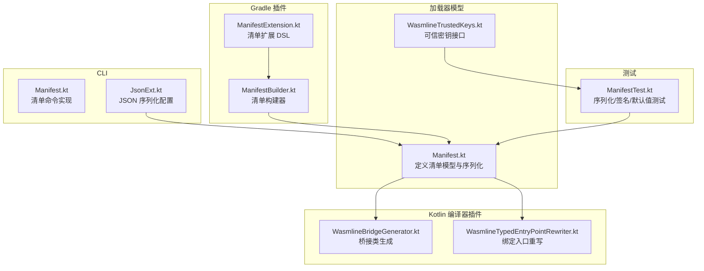
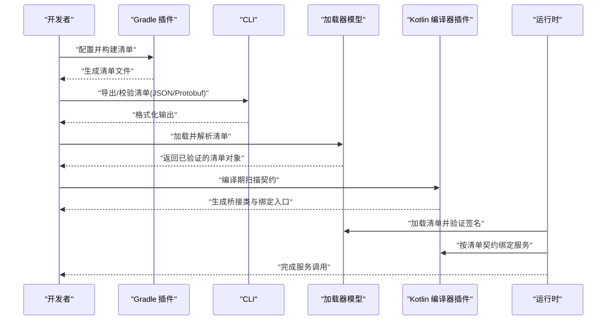
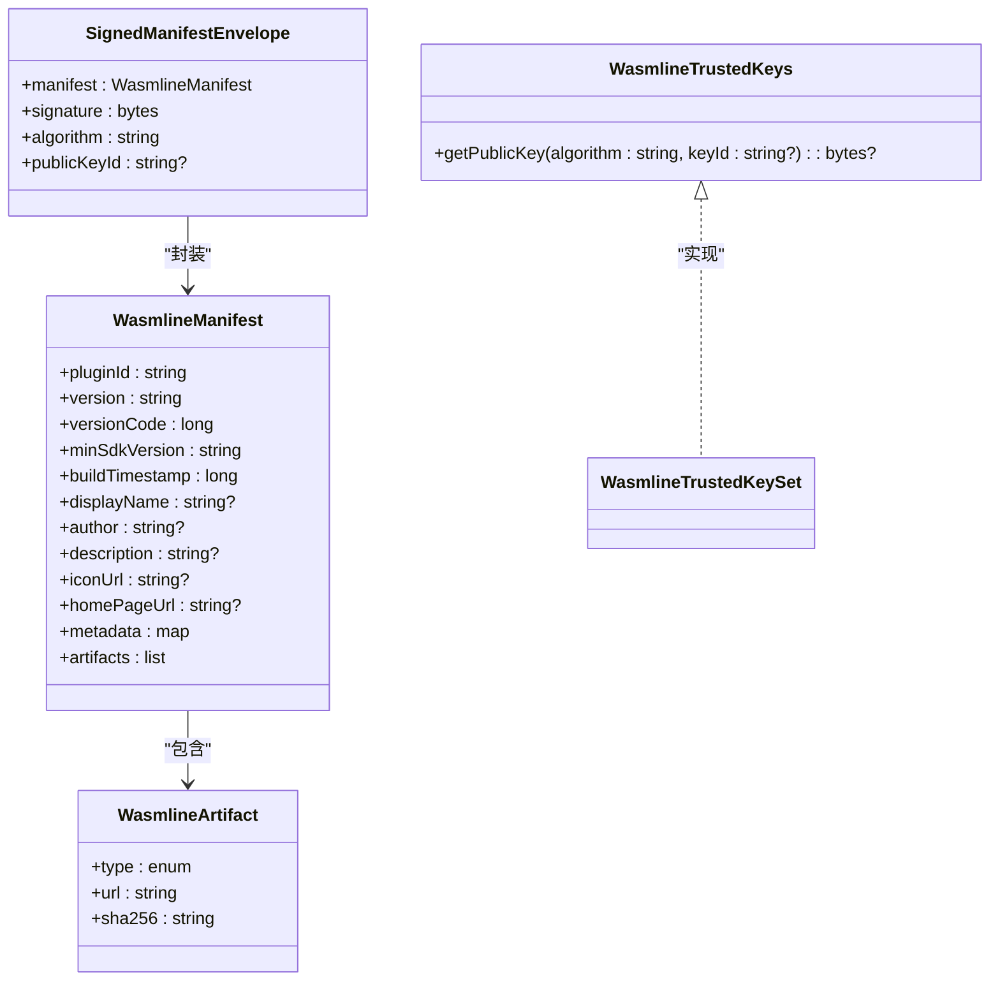
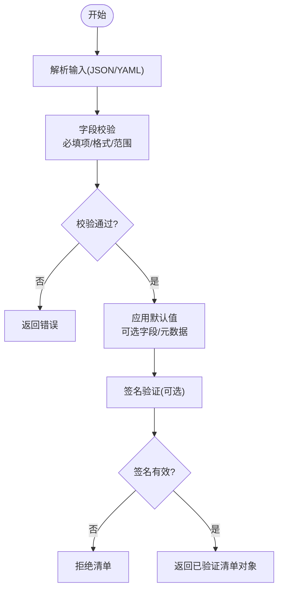
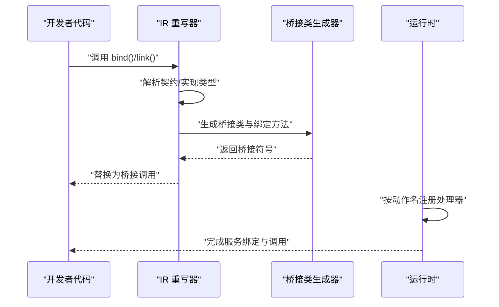
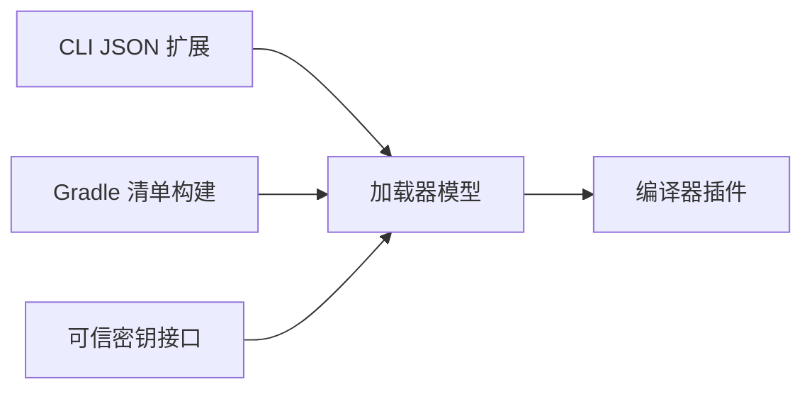

# 清单解析

<cite>
**本文引用的文件**
- [Manifest.kt](file://wasmline-multiplatform/wasmline-loader/src/commonMain/kotlin/crow/wasmline/loader/model/Manifest.kt)
- [ManifestTest.kt](file://wasmline-multiplatform/wasmline-loader/src/commonTest/kotlin/crow/wasmline/ManifestTest.kt)
- [Manifest.kt](file://wasmline-multiplatform/wasmline-cli/src/main/kotlin/crow/wasmline/cli/Manifest.kt)
- [JsonExt.kt](file://wasmline-multiplatform/wasmline-cli/src/main/kotlin/crow/wasmline/cli/extensions/JsonExt.kt)
- [ManifestBuilder.kt](file://wasmline-multiplatform/wasmline-gradle-plugin/src/main/kotlin/crow/wasmline/gradle/internal/ManifestBuilder.kt)
- [ManifestExtension.kt](file://wasmline-multiplatform/wasmline-gradle-plugin/src/main/kotlin/crow/wasmline/gradle/extensions/ManifestExtension.kt)
- [WasmlineBridgeGenerator.kt](file://wasmline-multiplatform/wasmline-kotlin-plugin/src/main/kotlin/crow/wasmline/kotlin/WasmlineBridgeGenerator.kt)
- [WasmlineTypedEntryPointRewriter.kt](file://wasmline-multiplatform/wasmline-kotlin-plugin/src/main/kotlin/crow/wasmline/kotlin/WasmlineTypedEntryPointRewriter.kt)
- [WasmlineTrustedKeys.kt](file://wasmline-multiplatform/wasmline/src/commonMain/kotlin/crow/wasmline/WasmlineTrustedKeys.kt)
- [sync_versions.py](file://scripts/sync_versions.py)
</cite>

## 目录
1. [简介](#简介)
2. [项目结构](#项目结构)
3. [核心组件](#核心组件)
4. [架构总览](#架构总览)
5. [详细组件分析](#详细组件分析)
6. [依赖分析](#依赖分析)
7. [性能考虑](#性能考虑)
8. [故障排查指南](#故障排查指南)
9. [结论](#结论)
10. [附录](#附录)

## 简介
本技术文档围绕“清单解析系统”展开，目标是帮助开发者理解并正确使用 Wasmline 的清单（Manifest）模型与解析流程。内容覆盖：
- Manifest 数据结构设计与字段语义（服务契约、依赖、元数据、签名等）
- 清单解析算法（JSON/YAML 支持、字段校验、默认值处理）
- 清单中的服务声明与绑定信息，以及与编译器插件生成桥接代码的对应关系
- 版本兼容性与迁移策略
- 最佳实践与常见问题排查
- 完整的清单示例与解析流程演示

## 项目结构
与清单解析直接相关的核心模块分布如下：
- 加载器模型层：定义 Manifest 及其序列化/反序列化、签名验证接口
- CLI 层：提供清单生成、JSON 扩展配置
- Gradle 插件层：构建清单、扩展清单能力
- Kotlin 编译器插件层：根据清单中的契约生成桥接代码，并在运行时进行绑定
- 测试层：覆盖 JSON/Protobuf 序列化往返、签名验证、默认值等

图表来源
- [Manifest.kt](file://wasmline-multiplatform/wasmline-loader/src/commonMain/kotlin/crow/wasmline/loader/model/Manifest.kt)
- [WasmlineTrustedKeys.kt](file://wasmline-multiplatform/wasmline/src/commonMain/kotlin/crow/wasmline/WasmlineTrustedKeys.kt)
- [Manifest.kt](file://wasmline-multiplatform/wasmline-cli/src/main/kotlin/crow/wasmline/cli/Manifest.kt)
- [JsonExt.kt](file://wasmline-multiplatform/wasmline-cli/src/main/kotlin/crow/wasmline/cli/extensions/JsonExt.kt)
- [ManifestBuilder.kt](file://wasmline-multiplatform/wasmline-gradle-plugin/src/main/kotlin/crow/wasmline/gradle/internal/ManifestBuilder.kt)
- [ManifestExtension.kt](file://wasmline-multiplatform/wasmline-gradle-plugin/src/main/kotlin/crow/wasmline/gradle/extensions/ManifestExtension.kt)
- [WasmlineBridgeGenerator.kt](file://wasmline-multiplatform/wasmline-kotlin-plugin/src/main/kotlin/crow/wasmline/kotlin/WasmlineBridgeGenerator.kt)
- [WasmlineTypedEntryPointRewriter.kt](file://wasmline-multiplatform/wasmline-kotlin-plugin/src/main/kotlin/crow/wasmline/kotlin/WasmlineTypedEntryPointRewriter.kt)
- [ManifestTest.kt](file://wasmline-multiplatform/wasmline-loader/src/commonTest/kotlin/crow/wasmline/ManifestTest.kt)

章节来源
- [Manifest.kt](file://wasmline-multiplatform/wasmline-loader/src/commonMain/kotlin/crow/wasmline/loader/model/Manifest.kt)
- [Manifest.kt](file://wasmline-multiplatform/wasmline-cli/src/main/kotlin/crow/wasmline/cli/Manifest.kt)
- [JsonExt.kt](file://wasmline-multiplatform/wasmline-cli/src/main/kotlin/crow/wasmline/cli/extensions/JsonExt.kt)
- [ManifestBuilder.kt](file://wasmline-multiplatform/wasmline-gradle-plugin/src/main/kotlin/crow/wasmline/gradle/internal/ManifestBuilder.kt)
- [ManifestExtension.kt](file://wasmline-multiplatform/wasmline-gradle-plugin/src/main/kotlin/crow/wasmline/gradle/extensions/ManifestExtension.kt)
- [WasmlineBridgeGenerator.kt](file://wasmline-multiplatform/wasmline-kotlin-plugin/src/main/kotlin/crow/wasmline/kotlin/WasmlineBridgeGenerator.kt)
- [WasmlineTypedEntryPointRewriter.kt](file://wasmline-multiplatform/wasmline-kotlin-plugin/src/main/kotlin/crow/wasmline/kotlin/WasmlineTypedEntryPointRewriter.kt)
- [WasmlineTrustedKeys.kt](file://wasmline-multiplatform/wasmline/src/commonMain/kotlin/crow/wasmline/WasmlineTrustedKeys.kt)
- [ManifestTest.kt](file://wasmline-multiplatform/wasmline-loader/src/commonTest/kotlin/crow/wasmline/ManifestTest.kt)

## 核心组件
- 清单模型与序列化：在加载器模型中定义了清单的数据结构、序列化/反序列化方式（JSON/Protobuf），以及签名封装体（SignedManifestEnvelope）用于完整性与来源验证。
- 可信密钥接口：提供按算法与可选 keyId 查找公钥的能力，用于验证清单签名。
- CLI JSON 配置：统一的 JSON 序列化配置，便于输出格式化、默认值编码等。
- Gradle 清单构建：通过构建器与扩展 DSL 生成清单，便于多平台打包与发布。
- 编译器插件桥接：根据清单中的服务契约生成桥接类与绑定入口，使运行时可以正确调用。

章节来源
- [Manifest.kt](file://wasmline-multiplatform/wasmline-loader/src/commonMain/kotlin/crow/wasmline/loader/model/Manifest.kt)
- [WasmlineTrustedKeys.kt](file://wasmline-multiplatform/wasmline/src/commonMain/kotlin/crow/wasmline/WasmlineTrustedKeys.kt)
- [JsonExt.kt](file://wasmline-multiplatform/wasmline-cli/src/main/kotlin/crow/wasmline/cli/extensions/JsonExt.kt)
- [ManifestBuilder.kt](file://wasmline-multiplatform/wasmline-gradle-plugin/src/main/kotlin/crow/wasmline/gradle/internal/ManifestBuilder.kt)
- [ManifestExtension.kt](file://wasmline-multiplatform/wasmline-gradle-plugin/src/main/kotlin/crow/wasmline/gradle/extensions/ManifestExtension.kt)
- [WasmlineBridgeGenerator.kt](file://wasmline-multiplatform/wasmline-kotlin-plugin/src/main/kotlin/crow/wasmline/kotlin/WasmlineBridgeGenerator.kt)
- [WasmlineTypedEntryPointRewriter.kt](file://wasmline-multiplatform/wasmline-kotlin-plugin/src/main/kotlin/crow/wasmline/kotlin/WasmlineTypedEntryPointRewriter.kt)

## 架构总览
下图展示了从“清单生成/解析”到“运行时桥接”的端到端流程：

图表来源
- [ManifestBuilder.kt](file://wasmline-multiplatform/wasmline-gradle-plugin/src/main/kotlin/crow/wasmline/gradle/internal/ManifestBuilder.kt)
- [Manifest.kt](file://wasmline-multiplatform/wasmline-cli/src/main/kotlin/crow/wasmline/cli/Manifest.kt)
- [Manifest.kt](file://wasmline-multiplatform/wasmline-loader/src/commonMain/kotlin/crow/wasmline/loader/model/Manifest.kt)
- [WasmlineBridgeGenerator.kt](file://wasmline-multiplatform/wasmline-kotlin-plugin/src/main/kotlin/crow/wasmline/kotlin/WasmlineBridgeGenerator.kt)
- [WasmlineTypedEntryPointRewriter.kt](file://wasmline-multiplatform/wasmline-kotlin-plugin/src/main/kotlin/crow/wasmline/kotlin/WasmlineTypedEntryPointRewriter.kt)

## 详细组件分析

### 清单数据结构与字段语义
- 基本字段
  - pluginId：包标识符，唯一且稳定
  - version/versionCode：版本号与内部版本码
  - minSdkVersion：最低兼容版本
  - buildTimestamp：构建时间戳
  - displayName/author/description/iconUrl/homePageUrl：元数据
  - metadata：键值对形式的扩展元数据
- 艺术品与依赖
  - artifacts：包含类型、URL、哈希等
  - 依赖关系：通过 artifacts 或其他字段表达（具体以模型为准）
- 签名与可信密钥
  - SignedManifestEnvelope：封装清单与签名、算法、可选公钥ID
  - WasmlineTrustedKeys：按算法与可选 keyId 查找公钥，支持精确匹配与通配匹配

图表来源
- [Manifest.kt](file://wasmline-multiplatform/wasmline-loader/src/commonMain/kotlin/crow/wasmline/loader/model/Manifest.kt)
- [WasmlineTrustedKeys.kt](file://wasmline-multiplatform/wasmline/src/commonMain/kotlin/crow/wasmline/WasmlineTrustedKeys.kt)

章节来源
- [Manifest.kt](file://wasmline-multiplatform/wasmline-loader/src/commonMain/kotlin/crow/wasmline/loader/model/Manifest.kt)
- [WasmlineTrustedKeys.kt](file://wasmline-multiplatform/wasmline/src/commonMain/kotlin/crow/wasmline/WasmlineTrustedKeys.kt)

### 清单解析算法与格式支持
- JSON 支持
  - 使用统一的 JSON 配置进行序列化/反序列化，支持默认值编码与美化输出
  - CLI 提供 JSON 扩展配置，保证跨平台一致的输出风格
- YAML 支持
  - 仓库未发现 YAML 解析实现；建议通过外部工具转换或在上层适配
- 字段验证与默认值
  - 测试覆盖了 JSON 与 Protobuf 的往返序列化
  - 可选字段默认为 null，metadata 默认为空映射
  - 签名验证失败时应拒绝接受清单

图表来源
- [JsonExt.kt](file://wasmline-multiplatform/wasmline-cli/src/main/kotlin/crow/wasmline/cli/extensions/JsonExt.kt)
- [ManifestTest.kt](file://wasmline-multiplatform/wasmline-loader/src/commonTest/kotlin/crow/wasmline/ManifestTest.kt)
- [Manifest.kt](file://wasmline-multiplatform/wasmline-loader/src/commonMain/kotlin/crow/wasmline/loader/model/Manifest.kt)

章节来源
- [JsonExt.kt](file://wasmline-multiplatform/wasmline-cli/src/main/kotlin/crow/wasmline/cli/extensions/JsonExt.kt)
- [ManifestTest.kt](file://wasmline-multiplatform/wasmline-loader/src/commonTest/kotlin/crow/wasmline/ManifestTest.kt)
- [Manifest.kt](file://wasmline-multiplatform/wasmline-loader/src/commonMain/kotlin/crow/wasmline/loader/model/Manifest.kt)

### 服务声明与绑定信息及桥接代码对应
- 服务契约
  - 编译器插件基于契约生成桥接类，确保运行时可按动作名注册处理器
- 绑定流程
  - 运行时通过“绑定入口重写”将用户调用转换为桥接调用
  - 每个契约函数对应一个动作名，由桥接类注册到 ActionRegistrar
- 与清单的对应
  - 清单中的服务声明与绑定信息在编译期被插件解析，生成桥接类并在运行时按清单契约进行绑定

图表来源
- [WasmlineTypedEntryPointRewriter.kt](file://wasmline-multiplatform/wasmline-kotlin-plugin/src/main/kotlin/crow/wasmline/kotlin/WasmlineTypedEntryPointRewriter.kt)
- [WasmlineBridgeGenerator.kt](file://wasmline-multiplatform/wasmline-kotlin-plugin/src/main/kotlin/crow/wasmline/kotlin/WasmlineBridgeGenerator.kt)

章节来源
- [WasmlineTypedEntryPointRewriter.kt](file://wasmline-multiplatform/wasmline-kotlin-plugin/src/main/kotlin/crow/wasmline/kotlin/WasmlineTypedEntryPointRewriter.kt)
- [WasmlineBridgeGenerator.kt](file://wasmline-multiplatform/wasmline-kotlin-plugin/src/main/kotlin/crow/wasmline/kotlin/WasmlineBridgeGenerator.kt)

### 版本兼容性与迁移策略
- 版本字段
  - version 与 versionCode 用于版本管理与兼容性判断
  - minSdkVersion 用于约束最低兼容版本
- 迁移策略
  - 新增字段时保持向后兼容，旧字段保留默认值
  - 对于破坏性变更，建议引入新版本号并提供迁移脚本
- 工具化支持
  - 仓库提供版本清单同步脚本，可用于统一管理版本引用

章节来源
- [Manifest.kt](file://wasmline-multiplatform/wasmline-loader/src/commonMain/kotlin/crow/wasmline/loader/model/Manifest.kt)
- [sync_versions.py](file://scripts/sync_versions.py)

## 依赖分析
- 组件耦合
  - 加载器模型依赖序列化库（JSON/Protobuf）
  - 编译器插件依赖加载器模型中的契约信息
  - Gradle 插件负责生成清单，CLI 负责导出与格式化
- 外部依赖
  - JSON 序列化配置来自 CLI 扩展
  - 签名算法（如 Ed25519）用于清单完整性验证

图表来源
- [JsonExt.kt](file://wasmline-multiplatform/wasmline-cli/src/main/kotlin/crow/wasmline/cli/extensions/JsonExt.kt)
- [ManifestBuilder.kt](file://wasmline-multiplatform/wasmline-gradle-plugin/src/main/kotlin/crow/wasmline/gradle/internal/ManifestBuilder.kt)
- [Manifest.kt](file://wasmline-multiplatform/wasmline-loader/src/commonMain/kotlin/crow/wasmline/loader/model/Manifest.kt)
- [WasmlineTrustedKeys.kt](file://wasmline-multiplatform/wasmline/src/commonMain/kotlin/crow/wasmline/WasmlineTrustedKeys.kt)

章节来源
- [JsonExt.kt](file://wasmline-multiplatform/wasmline-cli/src/main/kotlin/crow/wasmline/cli/extensions/JsonExt.kt)
- [ManifestBuilder.kt](file://wasmline-multiplatform/wasmline-gradle-plugin/src/main/kotlin/crow/wasmline/gradle/internal/ManifestBuilder.kt)
- [Manifest.kt](file://wasmline-multiplatform/wasmline-loader/src/commonMain/kotlin/crow/wasmline/loader/model/Manifest.kt)
- [WasmlineTrustedKeys.kt](file://wasmline-multiplatform/wasmline/src/commonMain/kotlin/crow/wasmline/WasmlineTrustedKeys.kt)

## 性能考虑
- 序列化开销
  - Protobuf 在二进制体积与解析速度上通常优于 JSON
  - JSON 适合人类可读与调试场景
- 签名验证
  - 签名验证应在加载阶段尽早执行，避免后续重复计算
- 默认值处理
  - 尽量减少不必要的默认值分配，保持数据结构紧凑

## 故障排查指南
- JSON 解析错误
  - 检查 JSON 语法与字段类型是否符合模型定义
  - 使用 CLI 的 JSON 扩展配置进行格式化输出以便定位
- 签名验证失败
  - 确认使用的公钥算法与 keyId 是否匹配
  - 核对签名字节与清单序列化后的字节是否一致
- 可选字段为空
  - 确认清单中是否遗漏了可选字段
  - 测试用例显示可选字段默认为 null，metadata 默认为空映射
- 编译期绑定错误
  - 检查契约实现是否明确，避免歧义
  - 确保编译器插件正确生成桥接类并注册动作

章节来源
- [ManifestTest.kt](file://wasmline-multiplatform/wasmline-loader/src/commonTest/kotlin/crow/wasmline/ManifestTest.kt)
- [WasmlineTypedEntryPointRewriter.kt](file://wasmline-multiplatform/wasmline-kotlin-plugin/src/main/kotlin/crow/wasmline/kotlin/WasmlineTypedEntryPointRewriter.kt)

## 结论
清单解析系统通过清晰的数据模型、严格的序列化与签名验证机制，以及编译期与运行时的协同工作，实现了跨平台的服务契约绑定与安全加载。遵循本文档的最佳实践与排错方法，可显著提升开发效率与系统稳定性。

## 附录

### 清单示例与解析流程演示
- 示例清单字段
  - 包标识符、版本号、最低兼容版本、构建时间戳
  - 元数据（名称、作者、描述、图标、主页）、扩展元数据
  - 艺术品列表（类型、URL、哈希）
  - 签名封装体（算法、签名、可选公钥ID）
- 解析流程
  - 输入：JSON/YAML
  - 输出：已验证的清单对象（含签名验证与默认值应用）

章节来源
- [Manifest.kt](file://wasmline-multiplatform/wasmline-loader/src/commonMain/kotlin/crow/wasmline/loader/model/Manifest.kt)
- [ManifestTest.kt](file://wasmline-multiplatform/wasmline-loader/src/commonTest/kotlin/crow/wasmline/ManifestTest.kt)
- [JsonExt.kt](file://wasmline-multiplatform/wasmline-cli/src/main/kotlin/crow/wasmline/cli/extensions/JsonExt.kt)