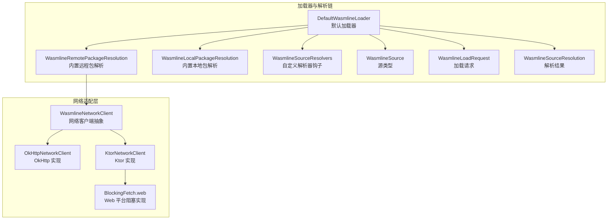
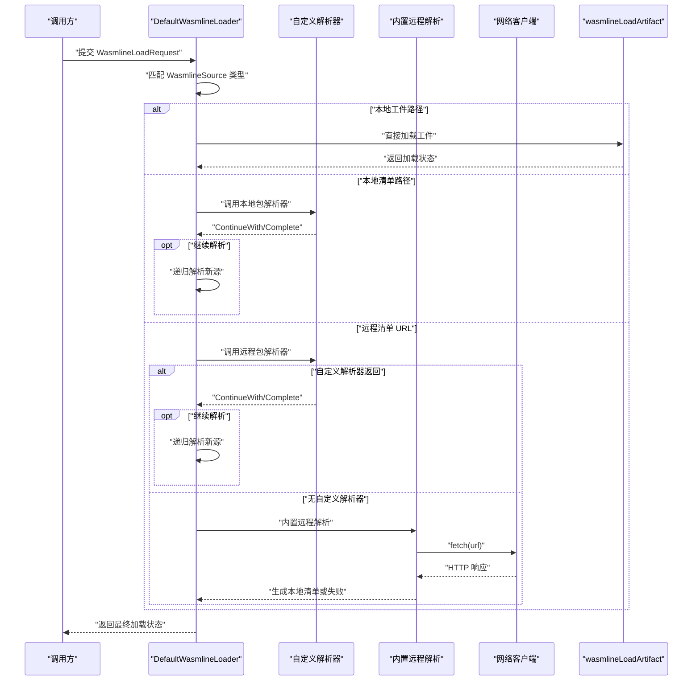
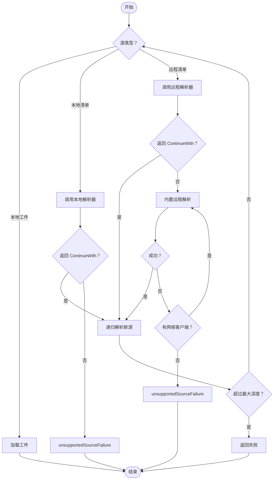
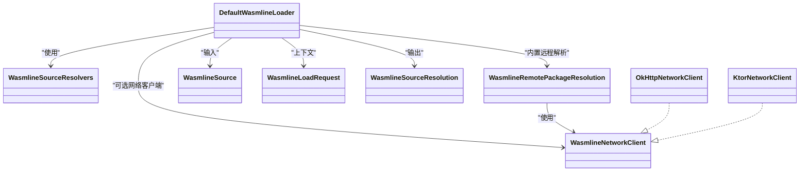

# 源解析器

<cite>
**本文引用的文件**
- [DefaultWasmlineLoader.kt](file://wasmline-multiplatform/wasmline-loader/src/hostMain/kotlin/crow/wasmline/loader/DefaultWasmlineLoader.kt)
- [WasmlineSourceResolvers.kt](file://wasmline-multiplatform/wasmline-loader/src/commonMain/kotlin/crow/wasmline/loader/WasmlineSourceResolvers.kt)
- [WasmlineSourceResolution.kt](file://wasmline-multiplatform/wasmline-loader/src/commonMain/kotlin/crow/wasmline/loader/WasmlineSourceResolution.kt)
- [WasmlineSource.kt](file://wasmline-multiplatform/wasmline-loader/src/commonMain/kotlin/crow/wasmline/loader/WasmlineSource.kt)
- [WasmlineLoadRequest.kt](file://wasmline-multiplatform/wasmline-loader/src/commonMain/kotlin/crow/wasmline/loader/WasmlineLoadRequest.kt)
- [WasmlineRemotePackageResolution.kt](file://wasmline-multiplatform/wasmline-loader/src/hostMain/kotlin/crow/wasmline/loader/internal/WasmlineRemotePackageResolution.kt)
- [WasmlineLocalPackageResolution.kt](file://wasmline-multiplatform/wasmline-loader/src/hostMain/kotlin/crow/wasmline/loader/internal/WasmlineLocalPackageResolution.kt)
- [WasmlineNetworkClient.kt](file://wasmline-multiplatform/wasmline/src/commonMain/kotlin/crow/wasmline/WasmlineNetworkClient.kt)
- [OkHttpNetworkClient.kt](file://wasmline-multiplatform/wasmline-network-okhttp/src/commonMain/kotlin/crow/wasmline/network/okhttp/OkHttpNetworkClient.kt)
- [KtorNetworkClient.kt](file://wasmline-multiplatform/wasmline-network-ktor/src/commonMain/kotlin/crow/wasmline/network/ktor/KtorNetworkClient.kt)
- [BlockingFetch.web.kt](file://wasmline-multiplatform/wasmline-network-ktor/src/webMain/kotlin/crow/wasmline/network/ktor/BlockingFetch.web.kt)
- [DefaultWasmlineLoaderTest.kt](file://wasmline-multiplatform/wasmline-loader/src/jvmTest/kotlin/crow/wasmline/loader/DefaultWasmlineLoaderTest.kt)
- [WasmlineRemotePackageResolutionTest.kt](file://wasmline-multiplatform/wasmline-loader/src/jvmTest/kotlin/crow/wasmline/loader/WasmlineRemotePackageResolutionTest.kt)
</cite>

## 目录
1. [简介](#简介)
2. [项目结构](#项目结构)
3. [核心组件](#核心组件)
4. [架构总览](#架构总览)
5. [详细组件分析](#详细组件分析)
6. [依赖关系分析](#依赖关系分析)
7. [性能考虑](#性能考虑)
8. [故障排查指南](#故障排查指南)
9. [结论](#结论)
10. [附录](#附录)

## 简介
本技术文档围绕“源解析器系统”展开，系统性阐述本地文件解析、远程包解析与网络协议支持的实现原理；详细说明源解析的优先级策略与回退机制；解释多平台文件访问权限与安全限制；覆盖网络解析的超时处理、重试策略与错误恢复；提供自定义源解析器的扩展接口与实现指南；解释源解析结果的标准化处理与错误报告机制；并给出各类源类型的配置示例、使用场景与性能优化最佳实践。

## 项目结构
源解析器相关代码主要位于以下模块与目录中：
- 加载器与解析链：wasmline-loader（hostMain/commonMain）
- 网络客户端适配：wasmline-network-okhttp、wasmline-network-ktor
- 核心网络抽象：wasmline（commonMain）

图表来源
- [DefaultWasmlineLoader.kt:1-109](file://wasmline-multiplatform/wasmline-loader/src/hostMain/kotlin/crow/wasmline/loader/DefaultWasmlineLoader.kt#L1-L109)
- [WasmlineRemotePackageResolution.kt](file://wasmline-multiplatform/wasmline-loader/src/hostMain/kotlin/crow/wasmline/loader/internal/WasmlineRemotePackageResolution.kt)
- [WasmlineLocalPackageResolution.kt](file://wasmline-multiplatform/wasmline-loader/src/hostMain/kotlin/crow/wasmline/loader/internal/WasmlineLocalPackageResolution.kt)
- [WasmlineSourceResolvers.kt:1-33](file://wasmline-multiplatform/wasmline-loader/src/commonMain/kotlin/crow/wasmline/loader/WasmlineSourceResolvers.kt#L1-L33)
- [WasmlineSource.kt](file://wasmline-multiplatform/wasmline-loader/src/commonMain/kotlin/crow/wasmline/loader/WasmlineSource.kt)
- [WasmlineLoadRequest.kt](file://wasmline-multiplatform/wasmline-loader/src/commonMain/kotlin/crow/wasmline/loader/WasmlineLoadRequest.kt)
- [WasmlineSourceResolution.kt:1-14](file://wasmline-multiplatform/wasmline-loader/src/commonMain/kotlin/crow/wasmline/loader/WasmlineSourceResolution.kt#L1-L14)
- [WasmlineNetworkClient.kt:1-41](file://wasmline-multiplatform/wasmline/src/commonMain/kotlin/crow/wasmline/WasmlineNetworkClient.kt#L1-L41)
- [OkHttpNetworkClient.kt:1-50](file://wasmline-multiplatform/wasmline-network-okhttp/src/commonMain/kotlin/crow/wasmline/network/okhttp/OkHttpNetworkClient.kt#L1-L50)
- [KtorNetworkClient.kt:1-43](file://wasmline-multiplatform/wasmline-network-ktor/src/commonMain/kotlin/crow/wasmline/network/ktor/KtorNetworkClient.kt#L1-L43)
- [BlockingFetch.web.kt:1-11](file://wasmline-multiplatform/wasmline-network-ktor/src/webMain/kotlin/crow/wasmline/network/ktor/BlockingFetch.web.kt#L1-L11)

章节来源
- [DefaultWasmlineLoader.kt:1-109](file://wasmline-multiplatform/wasmline-loader/src/hostMain/kotlin/crow/wasmline/loader/DefaultWasmlineLoader.kt#L1-L109)
- [WasmlineSourceResolvers.kt:1-33](file://wasmline-multiplatform/wasmline-loader/src/commonMain/kotlin/crow/wasmline/loader/WasmlineSourceResolvers.kt#L1-L33)
- [WasmlineSourceResolution.kt:1-14](file://wasmline-multiplatform/wasmline-loader/src/commonMain/kotlin/crow/wasmline/loader/WasmlineSourceResolution.kt#L1-L14)
- [WasmlineSource.kt](file://wasmline-multiplatform/wasmline-loader/src/commonMain/kotlin/crow/wasmline/loader/WasmlineSource.kt)
- [WasmlineLoadRequest.kt](file://wasmline-multiplatform/wasmline-loader/src/commonMain/kotlin/crow/wasmline/loader/WasmlineLoadRequest.kt)
- [WasmlineRemotePackageResolution.kt](file://wasmline-multiplatform/wasmline-loader/src/hostMain/kotlin/crow/wasmline/loader/internal/WasmlineRemotePackageResolution.kt)
- [WasmlineLocalPackageResolution.kt](file://wasmline-multiplatform/wasmline-loader/src/hostMain/kotlin/crow/wasmline/loader/internal/WasmlineLocalPackageResolution.kt)
- [WasmlineNetworkClient.kt:1-41](file://wasmline-multiplatform/wasmline/src/commonMain/kotlin/crow/wasmline/WasmlineNetworkClient.kt#L1-L41)
- [OkHttpNetworkClient.kt:1-50](file://wasmline-multiplatform/wasmline-network-okhttp/src/commonMain/kotlin/crow/wasmline/network/okhttp/OkHttpNetworkClient.kt#L1-L50)
- [KtorNetworkClient.kt:1-43](file://wasmline-multiplatform/wasmline-network-ktor/src/commonMain/kotlin/crow/wasmline/network/ktor/KtorNetworkClient.kt#L1-L43)
- [BlockingFetch.web.kt:1-11](file://wasmline-multiplatform/wasmline-network-ktor/src/webMain/kotlin/crow/wasmline/network/ktor/BlockingFetch.web.kt#L1-L11)

## 核心组件
- 默认加载器 DefaultWasmlineLoader：负责根据 WasmlineSource 类型分派到本地/远程解析，并维护解析深度与回退逻辑。
- 自定义解析器钩子 WasmlineSourceResolvers：允许注入本地包与远程包的自定义解析逻辑。
- 解析结果模型 WasmlineSourceResolution：表示单步解析的继续或完成状态。
- 源类型 WasmlineSource：统一承载本地工件路径、本地清单路径、远程清单 URL。
- 请求模型 WasmlineLoadRequest：封装源、配置、元数据与解析器。
- 内置远程包解析 WasmlineRemotePackageResolution：在具备网络客户端时执行远程清单下载与解析。
- 网络客户端抽象 WasmlineNetworkClient：统一阻塞式 HTTP 获取接口。
- 网络客户端实现：OkHttpNetworkClient（JVM/Android）、KtorNetworkClient（多平台，Web 不支持阻塞）。

章节来源
- [DefaultWasmlineLoader.kt:1-109](file://wasmline-multiplatform/wasmline-loader/src/hostMain/kotlin/crow/wasmline/loader/DefaultWasmlineLoader.kt#L1-L109)
- [WasmlineSourceResolvers.kt:1-33](file://wasmline-multiplatform/wasmline-loader/src/commonMain/kotlin/crow/wasmline/loader/WasmlineSourceResolvers.kt#L1-L33)
- [WasmlineSourceResolution.kt:1-14](file://wasmline-multiplatform/wasmline-loader/src/commonMain/kotlin/crow/wasmline/loader/WasmlineSourceResolution.kt#L1-L14)
- [WasmlineSource.kt](file://wasmline-multiplatform/wasmline-loader/src/commonMain/kotlin/crow/wasmline/loader/WasmlineSource.kt)
- [WasmlineLoadRequest.kt](file://wasmline-multiplatform/wasmline-loader/src/commonMain/kotlin/crow/wasmline/loader/WasmlineLoadRequest.kt)
- [WasmlineRemotePackageResolution.kt](file://wasmline-multiplatform/wasmline-loader/src/hostMain/kotlin/crow/wasmline/loader/internal/WasmlineRemotePackageResolution.kt)
- [WasmlineNetworkClient.kt:1-41](file://wasmline-multiplatform/wasmline/src/commonMain/kotlin/crow/wasmline/WasmlineNetworkClient.kt#L1-L41)

## 架构总览
下图展示了从请求到最终加载状态的端到端流程，包括自定义解析器优先、内置远程解析回退、以及网络客户端桥接。

图表来源
- [DefaultWasmlineLoader.kt:14-75](file://wasmline-multiplatform/wasmline-loader/src/hostMain/kotlin/crow/wasmline/loader/DefaultWasmlineLoader.kt#L14-L75)
- [WasmlineRemotePackageResolution.kt](file://wasmline-multiplatform/wasmline-loader/src/hostMain/kotlin/crow/wasmline/loader/internal/WasmlineRemotePackageResolution.kt)
- [WasmlineNetworkClient.kt:28-41](file://wasmline-multiplatform/wasmline/src/commonMain/kotlin/crow/wasmline/WasmlineNetworkClient.kt#L28-L41)

## 详细组件分析

### 默认加载器 DefaultWasmlineLoader
- 职责：根据 WasmlineSource 分派到本地工件加载或解析链；维护最大解析深度以防止循环；对不支持的源返回明确失败信息。
- 关键点：
  - 本地工件：直接调用 wasmlineLoadArtifact。
  - 本地清单：优先调用自定义本地包解析器；若未提供则不支持。
  - 远程清单：优先调用自定义远程解析器；若未提供则尝试内置远程解析；若仍不可用且无网络客户端，则失败。
  - 解析深度：超过阈值返回失败，提示检查解析链是否存在环路。
  - 统一回退：当解析器返回空时，走 unsupportedSourceFailure 提示需要提供相应解析器或网络客户端。

图表来源
- [DefaultWasmlineLoader.kt:22-109](file://wasmline-multiplatform/wasmline-loader/src/hostMain/kotlin/crow/wasmline/loader/DefaultWasmlineLoader.kt#L22-L109)

章节来源
- [DefaultWasmlineLoader.kt:1-109](file://wasmline-multiplatform/wasmline-loader/src/hostMain/kotlin/crow/wasmline/loader/DefaultWasmlineLoader.kt#L1-L109)

### 自定义解析器钩子 WasmlineSourceResolvers
- 作用：为本地包与远程包提供可插拔的解析逻辑；当为空时采用内置解析（若可用）。
- 接口：
  - WasmlineLocalPackageResolver：接收本地清单路径与请求上下文，返回继续或完成。
  - WasmlineRemotePackageResolver：接收远程清单 URL 与请求上下文，返回继续或完成。
- 使用建议：通过 WasmlineLoadRequest.resolvers 注入，实现渠道选择、签名验证、缓存策略等。

章节来源
- [WasmlineSourceResolvers.kt:1-33](file://wasmline-multiplatform/wasmline-loader/src/commonMain/kotlin/crow/wasmline/loader/WasmlineSourceResolvers.kt#L1-L33)

### 解析结果模型 WasmlineSourceResolution
- ContinueWith：携带新的 WasmlineSource，继续解析链。
- Complete：携带最终的 WasmlineLoadState，终止解析链。
- 语义：保证解析链的幂等与可组合性。

章节来源
- [WasmlineSourceResolution.kt:1-14](file://wasmline-multiplatform/wasmline-loader/src/commonMain/kotlin/crow/wasmline/loader/WasmlineSourceResolution.kt#L1-L14)

### 源类型 WasmlineSource
- LocalArtifactPath：本地工件路径，直接加载。
- LocalManifestPath：本地清单路径，交由本地解析器或内置逻辑处理。
- RemoteManifestUrl：远程清单 URL，交由远程解析器或内置逻辑处理。

章节来源
- [WasmlineSource.kt](file://wasmline-multiplatform/wasmline-loader/src/commonMain/kotlin/crow/wasmline/loader/WasmlineSource.kt)

### 请求模型 WasmlineLoadRequest
- 字段：source（源）、config（配置）、metadata（元数据）、resolvers（解析器）。
- 用途：承载一次加载的所有上下文，供解析器与加载器使用。

章节来源
- [WasmlineLoadRequest.kt](file://wasmline-multiplatform/wasmline-loader/src/commonMain/kotlin/crow/wasmline/loader/WasmlineLoadRequest.kt)

### 内置远程包解析 WasmlineRemotePackageResolution
- 当存在网络客户端时，负责远程清单下载与后续解析步骤。
- 与 Ktor/OkHttp 的集成：Ktor 在非 Web 平台通过阻塞桥接实现同步 fetch；Web 平台不支持阻塞 fetch，需自定义远程解析器。

章节来源
- [WasmlineRemotePackageResolution.kt](file://wasmline-multiplatform/wasmline-loader/src/hostMain/kotlin/crow/wasmline/loader/internal/WasmlineRemotePackageResolution.kt)
- [KtorNetworkClient.kt:1-43](file://wasmline-multiplatform/wasmline-network-ktor/src/commonMain/kotlin/crow/wasmline/network/ktor/KtorNetworkClient.kt#L1-L43)
- [BlockingFetch.web.kt:1-11](file://wasmline-multiplatform/wasmline-network-ktor/src/webMain/kotlin/crow/wasmline/network/ktor/BlockingFetch.web.kt#L1-L11)

### 网络客户端抽象与实现
- 抽象：WasmlineNetworkClient.fetch(url) 返回 WasmlineHttpResponse（状态码与字节体），要求阻塞式实现。
- OkHttp 实现：JVM/Android 平台，基于 OkHttpClient 的同步 execute。
- Ktor 实现：多平台，默认阻塞桥接；Web 平台抛出不支持异常，需自定义远程解析器。

章节来源
- [WasmlineNetworkClient.kt:1-41](file://wasmline-multiplatform/wasmline/src/commonMain/kotlin/crow/wasmline/WasmlineNetworkClient.kt#L1-L41)
- [OkHttpNetworkClient.kt:1-50](file://wasmline-multiplatform/wasmline-network-okhttp/src/commonMain/kotlin/crow/wasmline/network/okhttp/OkHttpNetworkClient.kt#L1-L50)
- [KtorNetworkClient.kt:1-43](file://wasmline-multiplatform/wasmline-network-ktor/src/commonMain/kotlin/crow/wasmline/network/ktor/KtorNetworkClient.kt#L1-L43)
- [BlockingFetch.web.kt:1-11](file://wasmline-multiplatform/wasmline-network-ktor/src/webMain/kotlin/crow/wasmline/network/ktor/BlockingFetch.web.kt#L1-L11)

## 依赖关系分析
- DefaultWasmlineLoader 依赖：
  - WasmlineSourceResolvers（可选）
  - WasmlineRemotePackageResolution（内置远程解析）
  - WasmlineNetworkClient（可选）
  - WasmlineSource、WasmlineLoadRequest、WasmlineSourceResolution
- 网络客户端：
  - OkHttpNetworkClient 依赖 OkHttp 客户端
  - KtorNetworkClient 依赖 Ktor HttpClient；Web 平台 expect 实现抛异常

图表来源
- [DefaultWasmlineLoader.kt:1-109](file://wasmline-multiplatform/wasmline-loader/src/hostMain/kotlin/crow/wasmline/loader/DefaultWasmlineLoader.kt#L1-L109)
- [WasmlineRemotePackageResolution.kt](file://wasmline-multiplatform/wasmline-loader/src/hostMain/kotlin/crow/wasmline/loader/internal/WasmlineRemotePackageResolution.kt)
- [WasmlineNetworkClient.kt:1-41](file://wasmline-multiplatform/wasmline/src/commonMain/kotlin/crow/wasmline/WasmlineNetworkClient.kt#L1-L41)
- [OkHttpNetworkClient.kt:1-50](file://wasmline-multiplatform/wasmline-network-okhttp/src/commonMain/kotlin/crow/wasmline/network/okhttp/OkHttpNetworkClient.kt#L1-L50)
- [KtorNetworkClient.kt:1-43](file://wasmline-multiplatform/wasmline-network-ktor/src/commonMain/kotlin/crow/wasmline/network/ktor/KtorNetworkClient.kt#L1-L43)

## 性能考虑
- 解析深度限制：避免解析链过长导致栈溢出与资源浪费。
- 缓存策略：结合自定义解析器与网络客户端实现响应体缓存与条件请求（ETag/Last-Modified）。
- 连接池复用：OkHttpNetworkClient 支持传入已配置的 OkHttpClient，启用连接池与复用。
- 阻塞桥接：Ktor 在非 Web 平台通过阻塞桥接实现同步 fetch，避免协程调度开销。
- 超时与重试：通过网络客户端配置连接/读写超时与重试策略；Web 平台需自定义远程解析器异步重试。
- I/O 吞吐：合理设置缓冲区大小与分块传输，减少内存峰值与 GC 压力。

## 故障排查指南
- 远程源但无网络客户端或远程解析器：返回失败，提示提供 remotePackage 或 networkClient。
- 自定义解析器未生效：确认 WasmlineLoadRequest.resolvers 中对应解析器是否正确注入。
- 解析链循环或过深：检查解析器返回的 ContinueWith 是否收敛，或增加元数据/约束避免死循环。
- Web 平台阻塞网络：Ktor 实现会抛出不支持异常，需提供自定义远程解析器。
- 本地清单路径无本地解析器：返回不支持错误，需提供 localPackage 解析器。

章节来源
- [DefaultWasmlineLoaderTest.kt:39-100](file://wasmline-multiplatform/wasmline-loader/src/jvmTest/kotlin/crow/wasmline/loader/DefaultWasmlineLoaderTest.kt#L39-L100)
- [WasmlineRemotePackageResolutionTest.kt:67-86](file://wasmline-multiplatform/wasmline-loader/src/jvmTest/kotlin/crow/wasmline/loader/WasmlineRemotePackageResolutionTest.kt#L67-L86)
- [DefaultWasmlineLoader.kt:77-106](file://wasmline-multiplatform/wasmline-loader/src/hostMain/kotlin/crow/wasmline/loader/DefaultWasmlineLoader.kt#L77-L106)
- [KtorNetworkClient.kt:16-18](file://wasmline-multiplatform/wasmline-network-ktor/src/commonMain/kotlin/crow/wasmline/network/ktor/KtorNetworkClient.kt#L16-L18)
- [BlockingFetch.web.kt:7-10](file://wasmline-multiplatform/wasmline-network-ktor/src/webMain/kotlin/crow/wasmline/network/ktor/BlockingFetch.web.kt#L7-L10)

## 结论
源解析器系统通过清晰的解析链与可插拔的解析器钩子，实现了本地工件、本地包与远程包的统一加载入口。其优先级策略与回退机制确保在缺失网络客户端或自定义解析器时仍能给出明确的失败提示。配合网络客户端的阻塞桥接与平台差异处理，系统在多平台上保持一致的行为预期。通过合理的缓存、超时与重试策略，可进一步提升加载性能与稳定性。

## 附录

### 源类型与使用场景
- 本地工件路径：适用于已知目标平台兼容的本地二进制文件。
- 本地清单路径：适用于本地渠道选择、签名验证、版本映射等场景。
- 远程清单 URL：适用于从远端仓库获取最新清单并按平台解析。

章节来源
- [WasmlineSource.kt](file://wasmline-multiplatform/wasmline-loader/src/commonMain/kotlin/crow/wasmline/loader/WasmlineSource.kt)

### 配置示例与最佳实践
- JVM/Android（OkHttp）：
  - 注入 OkHttpNetworkClient 到 WasmlineLoadRequest.config.networkClient。
  - 通过 WasmlineSourceResolvers.localPackage/localPackage 提供自定义解析逻辑。
- 多平台（Ktor）：
  - 注入 KtorNetworkClient 到 WasmlineLoadRequest.config.networkClient。
  - Web 平台需提供自定义 WasmlineRemotePackageResolver，内部实现异步下载与重试。
- 超时与重试：
  - OkHttp：通过 OkHttpClient.Builder 配置 connectTimeout/readTimeout/writeTimeout 与 Retry/Interceptor。
  - Ktor：通过 HttpClient 配置引擎与拦截器实现重试与超时。
- 错误恢复：
  - 自定义解析器捕获网络异常后返回 ContinueWith（如降级到缓存或备用源）。
  - 远程解析器在下载失败时返回失败状态，由上层决定是否重试或回退。

章节来源
- [OkHttpNetworkClient.kt:1-50](file://wasmline-multiplatform/wasmline-network-okhttp/src/commonMain/kotlin/crow/wasmline/network/okhttp/OkHttpNetworkClient.kt#L1-L50)
- [KtorNetworkClient.kt:1-43](file://wasmline-multiplatform/wasmline-network-ktor/src/commonMain/kotlin/crow/wasmline/network/ktor/KtorNetworkClient.kt#L1-L43)
- [DefaultWasmlineLoader.kt:48-73](file://wasmline-multiplatform/wasmline-loader/src/hostMain/kotlin/crow/wasmline/loader/DefaultWasmlineLoader.kt#L48-L73)