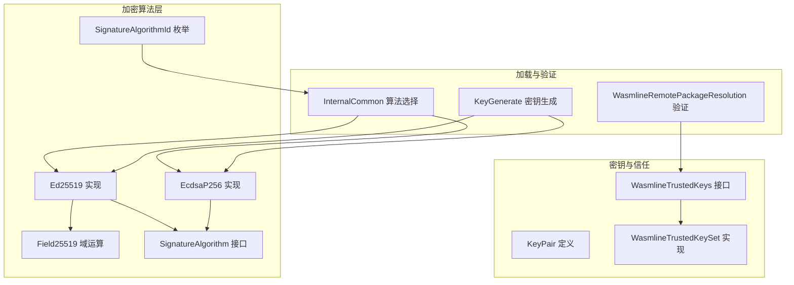
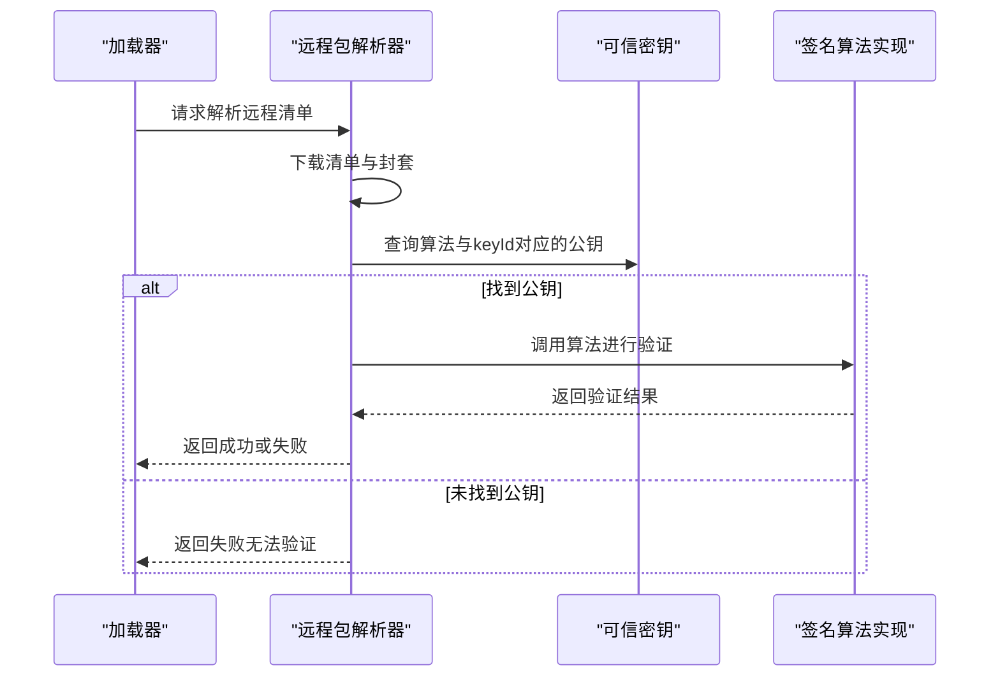
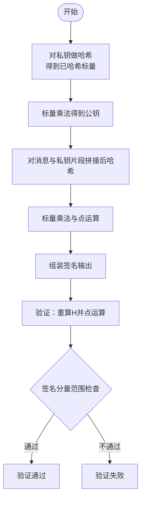
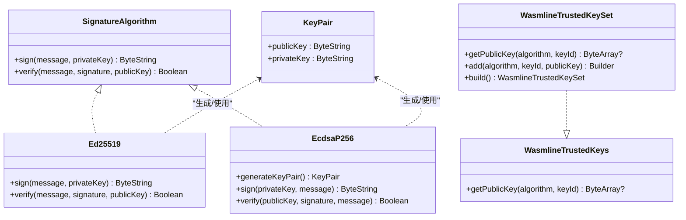
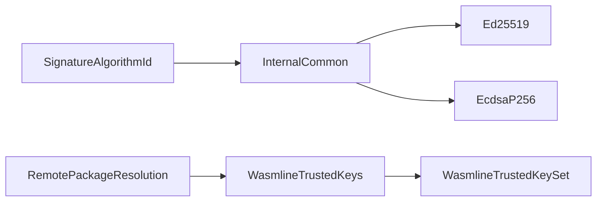

# 签名验证

<cite>
**本文引用的文件**
- [wasmline-multiplatform/wasmline-loader/src/commonMain/kotlin/crow/wasmline/loader/internal/crypto/Ed25519.kt](file://wasmline-multiplatform/wasmline-loader/src/commonMain/kotlin/crow/wasmline/loader/internal/crypto/Ed25519.kt)
- [wasmline-multiplatform/wasmline-loader/src/commonMain/kotlin/crow/wasmline/loader/internal/crypto/Field25519.kt](file://wasmline-multiplatform/wasmline-loader/src/commonMain/kotlin/crow/wasmline/loader/internal/crypto/Field25519.kt)
- [wasmline-multiplatform/wasmline-loader/src/commonMain/kotlin/crow/wasmline/loader/internal/crypto/Ed25519Constants.kt](file://wasmline-multiplatform/wasmline-loader/src/commonMain/kotlin/crow/wasmline/loader/internal/crypto/Ed25519Constants.kt)
- [wasmline-multiplatform/wasmline-loader/src/commonMain/kotlin/crow/wasmline/loader/internal/crypto/KeyPair.kt](file://wasmline-multiplatform/wasmline-loader/src/commonMain/kotlin/crow/wasmline/loader/internal/crypto/KeyPair.kt)
- [wasmline-multiplatform/wasmline-loader/src/commonMain/kotlin/crow/wasmline/loader/internal/crypto/SignatureAlgorithm.kt](file://wasmline-multiplatform/wasmline-loader/src/commonMain/kotlin/crow/wasmline/loader/internal/crypto/SignatureAlgorithm.kt)
- [wasmline-multiplatform/wasmline-loader/src/commonMain/kotlin/crow/wasmline/loader/internal/crypto/SignatureAlgorithmId.kt](file://wasmline-multiplatform/wasmline-loader/src/commonMain/kotlin/crow/wasmline/loader/internal/crypto/SignatureAlgorithmId.kt)
- [wasmline-multiplatform/wasmline-loader/src/jniMain/kotlin/crow/wasmline/loader/internal/crypto/EcdsaP256.kt](file://wasmline-multiplatform/wasmline-loader/src/jniMain/kotlin/crow/wasmline/loader/internal/crypto/EcdsaP256.kt)
- [wasmline-multiplatform/wasmline/src/commonMain/kotlin/crow/wasmline/WasmlineTrustedKeys.kt](file://wasmline-multiplatform/wasmline/src/commonMain/kotlin/crow/wasmline/WasmlineTrustedKeys.kt)
- [wasmline-multiplatform/wasmline-loader/src/hostMain/kotlin/crow/wasmline/loader/internal/WasmlineRemotePackageResolution.kt](file://wasmline-multiplatform/wasmline-loader/src/hostMain/kotlin/crow/wasmline/loader/internal/WasmlineRemotePackageResolution.kt)
- [wasmline-multiplatform/wasmline-loader/src/commonMain/kotlin/crow/wasmline/loader/internal/InternalCommon.kt](file://wasmline-multiplatform/wasmline-loader/src/commonMain/kotlin/crow/wasmline/loader/internal/InternalCommon.kt)
- [wasmline-multiplatform/wasmline-loader/src/jvmMain/kotlin/crow/wasmline/loader/internal/crypto/KeyGenerate.kt](file://wasmline-multiplatform/wasmline-loader/src/jvmMain/kotlin/crow/wasmline/loader/internal/crypto/KeyGenerate.kt)
- [wasmline-multiplatform/wasmline-loader/src/commonTest/kotlin/crow/wasmline/ManifestTest.kt](file://wasmline-multiplatform/wasmline-loader/src/commonTest/kotlin/crow/wasmline/ManifestTest.kt)
- [wasmline-multiplatform/wasmline-cli/src/test/kotlin/crow/wasmline/cli/GenerateKeyPairTest.kt](file://wasmline-multiplatform/wasmline-cli/src/test/kotlin/crow/wasmline/cli/GenerateKeyPairTest.kt)
</cite>

## 目录
1. [引言](#引言)
2. [项目结构](#项目结构)
3. [核心组件](#核心组件)
4. [架构总览](#架构总览)
5. [详细组件分析](#详细组件分析)
6. [依赖关系分析](#依赖关系分析)
7. [性能考量](#性能考量)
8. [故障排查指南](#故障排查指南)
9. [结论](#结论)
10. [附录](#附录)

## 引言
本技术文档围绕签名验证系统展开，重点覆盖 Ed25519 与 ECDSA-P256 两种签名算法的实现原理、密钥对生成、签名创建与验证流程，以及信任密钥管理机制（可信密钥存储与更新策略）。文档还解释了数字签名在模块加载安全中的作用与重要性，并提供密钥轮换与安全更新的最佳实践建议。为便于不同背景读者理解，文档采用由浅入深的方式组织内容，并通过图示展示关键流程。

## 项目结构
签名验证能力主要分布在以下模块与文件中：
- 加密算法实现：Ed25519 与 ECDSA-P256 的具体实现位于多平台源码目录中，分别封装在统一的签名算法接口之下。
- 密钥管理：密钥对生成、密钥存储与查询接口定义清晰，支持按算法与可选 keyId 进行查找。
- 模块加载与验证：远程包解析阶段集成签名验证，依据可信密钥集合决定是否执行严格校验。
- CLI 工具：提供密钥对生成命令，便于本地测试与演示。

图表来源
- [wasmline-multiplatform/wasmline-loader/src/commonMain/kotlin/crow/wasmline/loader/internal/crypto/Ed25519.kt](file://wasmline-multiplatform/wasmline-loader/src/commonMain/kotlin/crow/wasmline/loader/internal/crypto/Ed25519.kt)
- [wasmline-multiplatform/wasmline-loader/src/commonMain/kotlin/crow/wasmline/loader/internal/crypto/Field25519.kt](file://wasmline-multiplatform/wasmline-loader/src/commonMain/kotlin/crow/wasmline/loader/internal/crypto/Field25519.kt)
- [wasmline-multiplatform/wasmline-loader/src/jniMain/kotlin/crow/wasmline/loader/internal/crypto/EcdsaP256.kt](file://wasmline-multiplatform/wasmline-loader/src/jniMain/kotlin/crow/wasmline/loader/internal/crypto/EcdsaP256.kt)
- [wasmline-multiplatform/wasmline-loader/src/commonMain/kotlin/crow/wasmline/loader/internal/crypto/SignatureAlgorithm.kt](file://wasmline-multiplatform/wasmline-loader/src/commonMain/kotlin/crow/wasmline/loader/internal/crypto/SignatureAlgorithm.kt)
- [wasmline-multiplatform/wasmline-loader/src/commonMain/kotlin/crow/wasmline/loader/internal/crypto/SignatureAlgorithmId.kt](file://wasmline-multiplatform/wasmline-loader/src/commonMain/kotlin/crow/wasmline/loader/internal/crypto/SignatureAlgorithmId.kt)
- [wasmline-multiplatform/wasmline-loader/src/commonMain/kotlin/crow/wasmline/loader/internal/crypto/KeyPair.kt](file://wasmline-multiplatform/wasmline-loader/src/commonMain/kotlin/crow/wasmline/loader/internal/crypto/KeyPair.kt)
- [wasmline-multiplatform/wasmline/src/commonMain/kotlin/crow/wasmline/WasmlineTrustedKeys.kt](file://wasmline-multiplatform/wasmline/src/commonMain/kotlin/crow/wasmline/WasmlineTrustedKeys.kt)
- [wasmline-multiplatform/wasmline-loader/src/hostMain/kotlin/crow/wasmline/loader/internal/WasmlineRemotePackageResolution.kt](file://wasmline-multiplatform/wasmline-loader/src/hostMain/kotlin/crow/wasmline/loader/internal/WasmlineRemotePackageResolution.kt)
- [wasmline-multiplatform/wasmline-loader/src/commonMain/kotlin/crow/wasmline/loader/internal/InternalCommon.kt](file://wasmline-multiplatform/wasmline-loader/src/commonMain/kotlin/crow/wasmline/loader/internal/InternalCommon.kt)
- [wasmline-multiplatform/wasmline-loader/src/jvmMain/kotlin/crow/wasmline/loader/internal/crypto/KeyGenerate.kt](file://wasmline-multiplatform/wasmline-loader/src/jvmMain/kotlin/crow/wasmline/loader/internal/crypto/KeyGenerate.kt)

章节来源
- [wasmline-multiplatform/wasmline-loader/src/commonMain/kotlin/crow/wasmline/loader/internal/crypto/Ed25519.kt](file://wasmline-multiplatform/wasmline-loader/src/commonMain/kotlin/crow/wasmline/loader/internal/crypto/Ed25519.kt)
- [wasmline-multiplatform/wasmline-loader/src/commonMain/kotlin/crow/wasmline/loader/internal/crypto/SignatureAlgorithm.kt](file://wasmline-multiplatform/wasmline-loader/src/commonMain/kotlin/crow/wasmline/loader/internal/crypto/SignatureAlgorithm.kt)
- [wasmline-multiplatform/wasmline/src/commonMain/kotlin/crow/wasmline/WasmlineTrustedKeys.kt](file://wasmline-multiplatform/wasmline/src/commonMain/kotlin/crow/wasmline/WasmlineTrustedKeys.kt)
- [wasmline-multiplatform/wasmline-loader/src/hostMain/kotlin/crow/wasmline/loader/internal/WasmlineRemotePackageResolution.kt](file://wasmline-multiplatform/wasmline-loader/src/hostMain/kotlin/crow/wasmline/loader/internal/WasmlineRemotePackageResolution.kt)

## 核心组件
- 签名算法接口与枚举
  - 统一接口：用于抽象签名与验证行为，屏蔽底层差异。
  - 算法标识：枚举定义支持的算法类型，便于运行时选择具体实现。
- Ed25519 实现
  - 使用曲线 25519 上的点运算，基于专用域运算对象完成模运算与标量乘法。
  - 提供签名与验证方法，包含对签名范围的非可篡改性检查。
- ECDSA-P256 实现
  - 基于标准 JDK 安全框架，使用 P-256 曲线进行签名与验证。
- 密钥对与密钥生成
  - KeyPair 定义公私钥组合；KeyGenerate 提供随机种子生成与密钥对生成。
- 信任密钥管理
  - WasmlineTrustedKeys 接口与 WasmlineTrustedKeySet 实现，支持按算法与 keyId 查找公钥，支持通配匹配。

章节来源
- [wasmline-multiplatform/wasmline-loader/src/commonMain/kotlin/crow/wasmline/loader/internal/crypto/SignatureAlgorithm.kt](file://wasmline-multiplatform/wasmline-loader/src/commonMain/kotlin/crow/wasmline/loader/internal/crypto/SignatureAlgorithm.kt)
- [wasmline-multiplatform/wasmline-loader/src/commonMain/kotlin/crow/wasmline/loader/internal/crypto/SignatureAlgorithmId.kt](file://wasmline-multiplatform/wasmline-loader/src/commonMain/kotlin/crow/wasmline/loader/internal/crypto/SignatureAlgorithmId.kt)
- [wasmline-multiplatform/wasmline-loader/src/commonMain/kotlin/crow/wasmline/loader/internal/crypto/Ed25519.kt](file://wasmline-multiplatform/wasmline-loader/src/commonMain/kotlin/crow/wasmline/loader/internal/crypto/Ed25519.kt)
- [wasmline-multiplatform/wasmline-loader/src/commonMain/kotlin/crow/wasmline/loader/internal/crypto/Field25519.kt](file://wasmline-multiplatform/wasmline-loader/src/commonMain/kotlin/crow/wasmline/loader/internal/crypto/Field25519.kt)
- [wasmline-multiplatform/wasmline-loader/src/jniMain/kotlin/crow/wasmline/loader/internal/crypto/EcdsaP256.kt](file://wasmline-multiplatform/wasmline-loader/src/jniMain/kotlin/crow/wasmline/loader/internal/crypto/EcdsaP256.kt)
- [wasmline-multiplatform/wasmline-loader/src/commonMain/kotlin/crow/wasmline/loader/internal/crypto/KeyPair.kt](file://wasmline-multiplatform/wasmline-loader/src/commonMain/kotlin/crow/wasmline/loader/internal/crypto/KeyPair.kt)
- [wasmline-multiplatform/wasmline-loader/src/jvmMain/kotlin/crow/wasmline/loader/internal/crypto/KeyGenerate.kt](file://wasmline-multiplatform/wasmline-loader/src/jvmMain/kotlin/crow/wasmline/loader/internal/crypto/KeyGenerate.kt)
- [wasmline-multiplatform/wasmline/src/commonMain/kotlin/crow/wasmline/WasmlineTrustedKeys.kt](file://wasmline-multiplatform/wasmline/src/commonMain/kotlin/crow/wasmline/WasmlineTrustedKeys.kt)

## 架构总览
签名验证在模块加载阶段的关键流程如下：
- 远程包解析：从远端拉取清单与签名封套。
- 信任密钥查询：根据封套中的算法与 keyId 查询可信公钥。
- 签名验证：使用对应算法对消息与签名进行验证。
- 结果处理：验证通过则继续加载，否则返回失败。

图表来源
- [wasmline-multiplatform/wasmline-loader/src/hostMain/kotlin/crow/wasmline/loader/internal/WasmlineRemotePackageResolution.kt](file://wasmline-multiplatform/wasmline-loader/src/hostMain/kotlin/crow/wasmline/loader/internal/WasmlineRemotePackageResolution.kt)
- [wasmline-multiplatform/wasmline/src/commonMain/kotlin/crow/wasmline/WasmlineTrustedKeys.kt](file://wasmline-multiplatform/wasmline/src/commonMain/kotlin/crow/wasmline/WasmlineTrustedKeys.kt)
- [wasmline-multiplatform/wasmline-loader/src/commonMain/kotlin/crow/wasmline/loader/internal/crypto/SignatureAlgorithm.kt](file://wasmline-multiplatform/wasmline-loader/src/commonMain/kotlin/crow/wasmline/loader/internal/crypto/SignatureAlgorithm.kt)

## 详细组件分析

### Ed25519 签名算法
- 实现要点
  - 私钥派生：通过哈希种子得到“已哈希标量”，并据此计算公钥。
  - 签名流程：先对私钥与消息拼接后做哈希，再进行标量乘法与点运算，最终输出签名。
  - 验证流程：对签名与公钥、消息进行一致性校验，包含对签名分量范围的检查以确保不可篡改性。
  - 域运算：基于 Field25519 对 255 位素域进行加减乘、平方、逆元等操作，保证数值正确性与性能。
  - 常量表：使用预计算的基点倍数表加速标量乘法。
- 复杂度与性能
  - 标量乘法与点运算复杂度与曲线参数相关；常量表显著降低重复计算成本。
  - Field25519 的域运算经过精心设计，避免溢出并保持常数时间特性。
- 错误处理
  - 验证阶段会检查签名长度与分量范围，任何异常均导致验证失败。

图表来源
- [wasmline-multiplatform/wasmline-loader/src/commonMain/kotlin/crow/wasmline/loader/internal/crypto/Ed25519.kt](file://wasmline-multiplatform/wasmline-loader/src/commonMain/kotlin/crow/wasmline/loader/internal/crypto/Ed25519.kt)
- [wasmline-multiplatform/wasmline-loader/src/commonMain/kotlin/crow/wasmline/loader/internal/crypto/Field25519.kt](file://wasmline-multiplatform/wasmline-loader/src/commonMain/kotlin/crow/wasmline/loader/internal/crypto/Field25519.kt)
- [wasmline-multiplatform/wasmline-loader/src/commonMain/kotlin/crow/wasmline/loader/internal/crypto/Ed25519Constants.kt](file://wasmline-multiplatform/wasmline-loader/src/commonMain/kotlin/crow/wasmline/loader/internal/crypto/Ed25519Constants.kt)

章节来源
- [wasmline-multiplatform/wasmline-loader/src/commonMain/kotlin/crow/wasmline/loader/internal/crypto/Ed25519.kt](file://wasmline-multiplatform/wasmline-loader/src/commonMain/kotlin/crow/wasmline/loader/internal/crypto/Ed25519.kt)
- [wasmline-multiplatform/wasmline-loader/src/commonMain/kotlin/crow/wasmline/loader/internal/crypto/Field25519.kt](file://wasmline-multiplatform/wasmline-loader/src/commonMain/kotlin/crow/wasmline/loader/internal/crypto/Field25519.kt)
- [wasmline-multiplatform/wasmline-loader/src/commonMain/kotlin/crow/wasmline/loader/internal/crypto/Ed25519Constants.kt](file://wasmline-multiplatform/wasmline-loader/src/commonMain/kotlin/crow/wasmline/loader/internal/crypto/Ed25519Constants.kt)

### ECDSA-P256 签名算法
- 实现要点
  - 使用标准 JDK 安全框架生成密钥对与执行签名/验证。
  - 公钥采用 ANSI X9.62 编码格式，私钥采用 PKCS#8 编码。
- 复杂度与性能
  - 依赖 JVM 标准库优化，适合跨平台部署。
- 错误处理
  - 任何签名或验证异常均会导致验证失败。

章节来源
- [wasmline-multiplatform/wasmline-loader/src/jniMain/kotlin/crow/wasmline/loader/internal/crypto/EcdsaP256.kt](file://wasmline-multiplatform/wasmline-loader/src/jniMain/kotlin/crow/wasmline/loader/internal/crypto/EcdsaP256.kt)

### 密钥对生成与存储
- 密钥对生成
  - Ed25519：从随机种子派生私钥与公钥。
  - ECDSA-P256：通过 JDK KeyPairGenerator 生成密钥对。
- 密钥存储与查询
  - WasmlineTrustedKeys 接口提供按算法与 keyId 查找公钥的能力。
  - WasmlineTrustedKeySet 支持精确匹配与通配匹配，优先精确匹配。

图表来源
- [wasmline-multiplatform/wasmline-loader/src/commonMain/kotlin/crow/wasmline/loader/internal/crypto/SignatureAlgorithm.kt](file://wasmline-multiplatform/wasmline-loader/src/commonMain/kotlin/crow/wasmline/loader/internal/crypto/SignatureAlgorithm.kt)
- [wasmline-multiplatform/wasmline-loader/src/commonMain/kotlin/crow/wasmline/loader/internal/crypto/Ed25519.kt](file://wasmline-multiplatform/wasmline-loader/src/commonMain/kotlin/crow/wasmline/loader/internal/crypto/Ed25519.kt)
- [wasmline-multiplatform/wasmline-loader/src/jniMain/kotlin/crow/wasmline/loader/internal/crypto/EcdsaP256.kt](file://wasmline-multiplatform/wasmline-loader/src/jniMain/kotlin/crow/wasmline/loader/internal/crypto/EcdsaP256.kt)
- [wasmline-multiplatform/wasmline-loader/src/commonMain/kotlin/crow/wasmline/loader/internal/crypto/KeyPair.kt](file://wasmline-multiplatform/wasmline-loader/src/commonMain/kotlin/crow/wasmline/loader/internal/crypto/KeyPair.kt)
- [wasmline-multiplatform/wasmline/src/commonMain/kotlin/crow/wasmline/WasmlineTrustedKeys.kt](file://wasmline-multiplatform/wasmline/src/commonMain/kotlin/crow/wasmline/WasmlineTrustedKeys.kt)

章节来源
- [wasmline-multiplatform/wasmline-loader/src/commonMain/kotlin/crow/wasmline/loader/internal/crypto/KeyPair.kt](file://wasmline-multiplatform/wasmline-loader/src/commonMain/kotlin/crow/wasmline/loader/internal/crypto/KeyPair.kt)
- [wasmline-multiplatform/wasmline-loader/src/jvmMain/kotlin/crow/wasmline/loader/internal/crypto/KeyGenerate.kt](file://wasmline-multiplatform/wasmline-loader/src/jvmMain/kotlin/crow/wasmline/loader/internal/crypto/KeyGenerate.kt)
- [wasmline-multiplatform/wasmline/src/commonMain/kotlin/crow/wasmline/WasmlineTrustedKeys.kt](file://wasmline-multiplatform/wasmline/src/commonMain/kotlin/crow/wasmline/WasmlineTrustedKeys.kt)

### 模块加载中的签名验证
- 验证触发条件
  - 若未提供可信密钥集合，则跳过严格验证（宽松模式）。
  - 若提供可信密钥集合，则必须匹配算法与 keyId，否则验证失败。
- 验证流程
  - 解析封套，提取算法与公钥 ID。
  - 从可信密钥集合中查找公钥。
  - 使用对应算法对消息与签名进行验证。
- 测试与示例
  - 单元测试覆盖了正确签名、错误公钥、篡改数据与损坏签名等场景。
  - CLI 测试覆盖了密钥对生成命令的输出格式。

章节来源
- [wasmline-multiplatform/wasmline-loader/src/hostMain/kotlin/crow/wasmline/loader/internal/WasmlineRemotePackageResolution.kt](file://wasmline-multiplatform/wasmline-loader/src/hostMain/kotlin/crow/wasmline/loader/internal/WasmlineRemotePackageResolution.kt)
- [wasmline-multiplatform/wasmline-loader/src/commonTest/kotlin/crow/wasmline/ManifestTest.kt](file://wasmline-multiplatform/wasmline-loader/src/commonTest/kotlin/crow/wasmline/ManifestTest.kt)
- [wasmline-multiplatform/wasmline-cli/src/test/kotlin/crow/wasmline/cli/GenerateKeyPairTest.kt](file://wasmline-multiplatform/wasmline-cli/src/test/kotlin/crow/wasmline/cli/GenerateKeyPairTest.kt)

## 依赖关系分析
- 组件耦合
  - InternalCommon 将算法标识映射到具体实现，降低上层对具体算法的感知。
  - RemotePackageResolution 仅依赖 WasmlineTrustedKeys 接口，便于替换与扩展。
- 外部依赖
  - ECDSA-P256 依赖 JDK 安全框架；Ed25519 为自实现，减少外部依赖。
- 可能的循环依赖
  - 当前结构清晰，无明显循环依赖迹象。

图表来源
- [wasmline-multiplatform/wasmline-loader/src/commonMain/kotlin/crow/wasmline/loader/internal/InternalCommon.kt](file://wasmline-multiplatform/wasmline-loader/src/commonMain/kotlin/crow/wasmline/loader/internal/InternalCommon.kt)
- [wasmline-multiplatform/wasmline-loader/src/commonMain/kotlin/crow/wasmline/loader/internal/crypto/SignatureAlgorithmId.kt](file://wasmline-multiplatform/wasmline-loader/src/commonMain/kotlin/crow/wasmline/loader/internal/crypto/SignatureAlgorithmId.kt)
- [wasmline-multiplatform/wasmline-loader/src/hostMain/kotlin/crow/wasmline/loader/internal/WasmlineRemotePackageResolution.kt](file://wasmline-multiplatform/wasmline-loader/src/hostMain/kotlin/crow/wasmline/loader/internal/WasmlineRemotePackageResolution.kt)
- [wasmline-multiplatform/wasmline/src/commonMain/kotlin/crow/wasmline/WasmlineTrustedKeys.kt](file://wasmline-multiplatform/wasmline/src/commonMain/kotlin/crow/wasmline/WasmlineTrustedKeys.kt)

章节来源
- [wasmline-multiplatform/wasmline-loader/src/commonMain/kotlin/crow/wasmline/loader/internal/InternalCommon.kt](file://wasmline-multiplatform/wasmline-loader/src/commonMain/kotlin/crow/wasmline/loader/internal/InternalCommon.kt)
- [wasmline-multiplatform/wasmline-loader/src/hostMain/kotlin/crow/wasmline/loader/internal/WasmlineRemotePackageResolution.kt](file://wasmline-multiplatform/wasmline-loader/src/hostMain/kotlin/crow/wasmline/loader/internal/WasmlineRemotePackageResolution.kt)

## 性能考量
- Ed25519
  - 常量表与标量乘法优化显著提升性能；Field25519 的域运算避免溢出并保持常数时间。
  - 建议在批量验证场景中复用已解析的公钥与常量表。
- ECDSA-P256
  - 依赖 JVM 标准库，跨平台兼容性好；在高并发场景下注意密钥生成与签名操作的资源占用。
- 通用建议
  - 在远程包解析阶段尽早进行算法与公钥匹配，避免无效验证尝试。
  - 对频繁使用的公钥进行缓存，减少可信密钥查询开销。

## 故障排查指南
- 常见问题与定位
  - 算法未知：封套中的算法字符串不在受支持列表内，需检查配置或升级实现。
  - 未找到可信公钥：确认算法与 keyId 是否匹配，或是否应使用通配匹配。
  - 签名验证失败：检查消息是否被篡改、签名格式是否正确、公钥是否匹配。
  - 权限不足：在宽松模式下不会执行严格验证，需明确配置意图。
- 测试参考
  - 单元测试覆盖了正确签名、错误公钥、篡改与损坏签名等场景，可作为回归测试的基准。

章节来源
- [wasmline-multiplatform/wasmline-loader/src/hostMain/kotlin/crow/wasmline/loader/internal/WasmlineRemotePackageResolution.kt](file://wasmline-multiplatform/wasmline-loader/src/hostMain/kotlin/crow/wasmline/loader/internal/WasmlineRemotePackageResolution.kt)
- [wasmline-multiplatform/wasmline-loader/src/commonTest/kotlin/crow/wasmline/ManifestTest.kt](file://wasmline-multiplatform/wasmline-loader/src/commonTest/kotlin/crow/wasmline/ManifestTest.kt)

## 结论
该签名验证系统通过统一的算法接口与清晰的密钥管理机制，实现了对 Ed25519 与 ECDSA-P256 的标准化支持。在模块加载阶段集成验证流程，既保证了安全性，又提供了灵活的配置选项。结合常量表优化与跨平台实现，系统在性能与可维护性之间取得良好平衡。建议在生产环境中采用严格的可信密钥策略，并定期轮换密钥以提升整体安全性。

## 附录
- 实际使用建议
  - 密钥轮换：提前发布新密钥，逐步替换旧密钥，设置过渡期；到期后立即吊销旧密钥。
  - 安全更新：在 CI 中集成签名与验证测试，确保每次变更都通过验证流程。
  - 日志与监控：记录验证失败原因与次数，及时发现潜在攻击或配置问题。
- 示例路径（代码片段路径）
  - Ed25519 签名与验证实现：[wasmline-multiplatform/wasmline-loader/src/commonMain/kotlin/crow/wasmline/loader/internal/crypto/Ed25519.kt](file://wasmline-multiplatform/wasmline-loader/src/commonMain/kotlin/crow/wasmline/loader/internal/crypto/Ed25519.kt)
  - ECDSA-P256 签名与验证实现：[wasmline-multiplatform/wasmline-loader/src/jniMain/kotlin/crow/wasmline/loader/internal/crypto/EcdsaP256.kt](file://wasmline-multiplatform/wasmline-loader/src/jniMain/kotlin/crow/wasmline/loader/internal/crypto/EcdsaP256.kt)
  - 密钥生成：[wasmline-multiplatform/wasmline-loader/src/jvmMain/kotlin/crow/wasmline/loader/internal/crypto/KeyGenerate.kt](file://wasmline-multiplatform/wasmline-loader/src/jvmMain/kotlin/crow/wasmline/loader/internal/crypto/KeyGenerate.kt)
  - 信任密钥查询：[wasmline-multiplatform/wasmline/src/commonMain/kotlin/crow/wasmline/WasmlineTrustedKeys.kt](file://wasmline-multiplatform/wasmline/src/commonMain/kotlin/crow/wasmline/WasmlineTrustedKeys.kt)
  - 远程包验证流程：[wasmline-multiplatform/wasmline-loader/src/hostMain/kotlin/crow/wasmline/loader/internal/WasmlineRemotePackageResolution.kt](file://wasmline-multiplatform/wasmline-loader/src/hostMain/kotlin/crow/wasmline/loader/internal/WasmlineRemotePackageResolution.kt)
  - CLI 密钥对生成测试：[wasmline-multiplatform/wasmline-cli/src/test/kotlin/crow/wasmline/cli/GenerateKeyPairTest.kt](file://wasmline-multiplatform/wasmline-cli/src/test/kotlin/crow/wasmline/cli/GenerateKeyPairTest.kt)