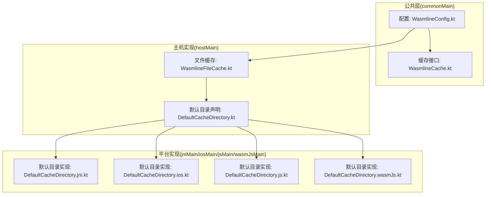
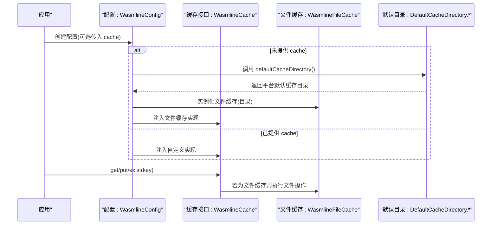
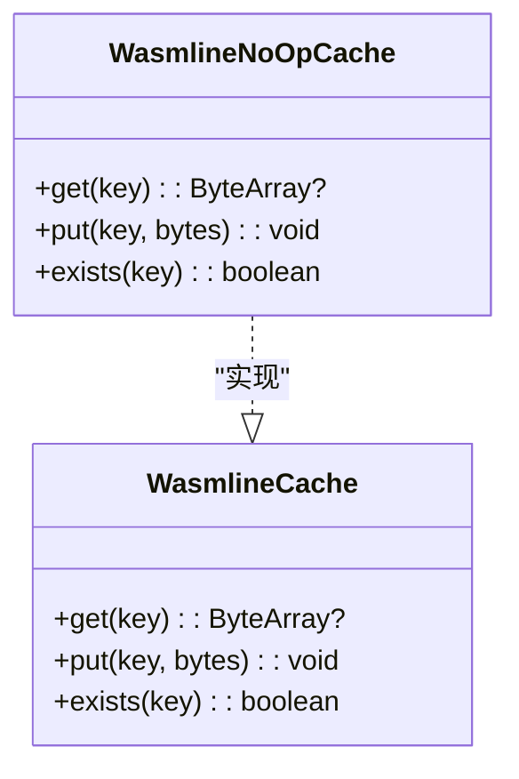
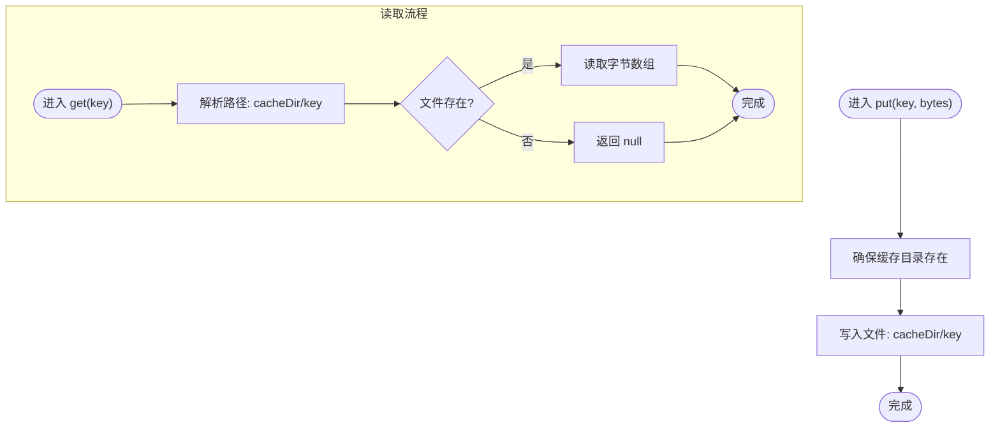
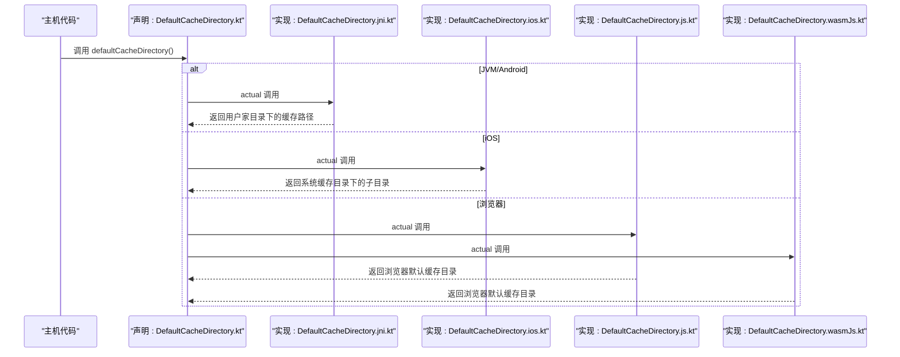
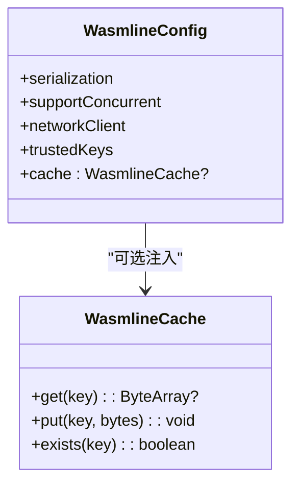
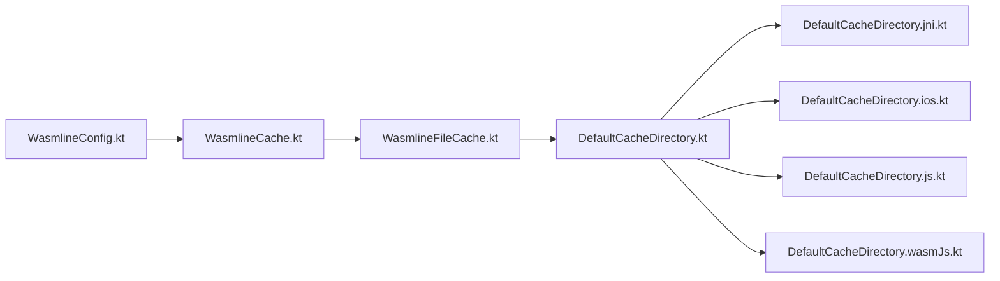

# 缓存机制

<cite>
**本文引用的文件**
- [WasmlineCache.kt](file://wasmline-multiplatform/wasmline/src/commonMain/kotlin/crow/wasmline/WasmlineCache.kt)
- [WasmlineConfig.kt](file://wasmline-multiplatform/wasmline/src/commonMain/kotlin/crow/wasmline/WasmlineConfig.kt)
- [WasmlineFileCache.kt](file://wasmline-multiplatform/wasmline-loader/src/hostMain/kotlin/crow/wasmline/loader/internal/WasmlineFileCache.kt)
- [DefaultCacheDirectory.kt](file://wasmline-multiplatform/wasmline-loader/src/hostMain/kotlin/crow/wasmline/loader/internal/DefaultCacheDirectory.kt)
- [DefaultCacheDirectory.ios.kt](file://wasmline-multiplatform/wasmline-loader/src/iosMain/kotlin/crow/wasmline/loader/internal/DefaultCacheDirectory.ios.kt)
- [DefaultCacheDirectory.jni.kt](file://wasmline-multiplatform/wasmline-loader/src/jniMain/kotlin/crow/wasmline/loader/internal/DefaultCacheDirectory.jni.kt)
- [DefaultCacheDirectory.js.kt](file://wasmline-multiplatform/wasmline-loader/src/jsMain/kotlin/crow/wasmline/loader/internal/DefaultCacheDirectory.js.kt)
- [DefaultCacheDirectory.wasmJs.kt](file://wasmline-multiplatform/wasmline-loader/src/wasmJsMain/kotlin/crow/wasmline/loader/internal/DefaultCacheDirectory.wasmJs.kt)
</cite>

## 目录
1. [引言](#引言)
2. [项目结构](#项目结构)
3. [核心组件](#核心组件)
4. [架构总览](#架构总览)
5. [详细组件分析](#详细组件分析)
6. [依赖关系分析](#依赖关系分析)
7. [性能考量](#性能考量)
8. [故障排除指南](#故障排除指南)
9. [结论](#结论)
10. [附录](#附录)

## 引言
本文件系统性阐述 wasmline 多平台缓存机制的设计与实现，覆盖内存缓存接口、文件系统缓存实现、缓存键生成规则、缓存条目生命周期、缓存目录组织与命名规范、跨平台适配策略、命中率与内存控制、清理与失效机制、性能监控与调试方法，以及最佳实践与故障排除建议。目标是帮助开发者在不同运行环境（JVM、Android、iOS、浏览器 JS/WebAssembly）中正确配置与使用缓存，并在保证线程安全与性能的前提下获得稳定的加载体验。

## 项目结构
缓存相关代码主要分布在以下模块与源集：
- 接口与配置：commonMain 中定义了可插拔的缓存接口与全局配置项，用于注入缓存实现或选择平台默认文件缓存。
- 文件缓存实现：hostMain 中提供了基于文件系统的缓存实现，负责将键映射到文件路径并进行读写。
- 平台默认缓存目录：各平台源集（jniMain、iosMain、jsMain、wasmJsMain）提供默认缓存目录解析逻辑；浏览器平台通过 expect/actual 挂接浏览器侧默认缓存目录。

**图表来源**
- [WasmlineConfig.kt:18-24](file://wasmline-multiplatform/wasmline/src/commonMain/kotlin/crow/wasmline/WasmlineConfig.kt#L18-L24)
- [WasmlineCache.kt:10-23](file://wasmline-multiplatform/wasmline/src/commonMain/kotlin/crow/wasmline/WasmlineCache.kt#L10-L23)
- [WasmlineFileCache.kt:14-34](file://wasmline-multiplatform/wasmline-loader/src/hostMain/kotlin/crow/wasmline/loader/internal/WasmlineFileCache.kt#L14-L34)
- [DefaultCacheDirectory.kt:7](file://wasmline-multiplatform/wasmline-loader/src/hostMain/kotlin/crow/wasmline/loader/internal/DefaultCacheDirectory.kt#L7)
- [DefaultCacheDirectory.jni.kt:3-6](file://wasmline-multiplatform/wasmline-loader/src/jniMain/kotlin/crow/wasmline/loader/internal/DefaultCacheDirectory.jni.kt#L3-L6)
- [DefaultCacheDirectory.ios.kt:10-16](file://wasmline-multiplatform/wasmline-loader/src/iosMain/kotlin/crow/wasmline/loader/internal/DefaultCacheDirectory.ios.kt#L10-L16)
- [DefaultCacheDirectory.js.kt:3](file://wasmline-multiplatform/wasmline-loader/src/jsMain/kotlin/crow/wasmline/loader/internal/DefaultCacheDirectory.js.kt#L3)
- [DefaultCacheDirectory.wasmJs.kt:3](file://wasmline-multiplatform/wasmline-loader/src/wasmJsMain/kotlin/crow/wasmline/loader/internal/DefaultCacheDirectory.wasmJs.kt#L3)

**章节来源**
- [WasmlineConfig.kt:18-24](file://wasmline-multiplatform/wasmline/src/commonMain/kotlin/crow/wasmline/WasmlineConfig.kt#L18-L24)
- [WasmlineCache.kt:10-23](file://wasmline-multiplatform/wasmline/src/commonMain/kotlin/crow/wasmline/WasmlineCache.kt#L10-L23)
- [WasmlineFileCache.kt:14-34](file://wasmline-multiplatform/wasmline-loader/src/hostMain/kotlin/crow/wasmline/loader/internal/WasmlineFileCache.kt#L14-L34)
- [DefaultCacheDirectory.kt:7](file://wasmline-multiplatform/wasmline-loader/src/hostMain/kotlin/crow/wasmline/loader/internal/DefaultCacheDirectory.kt#L7)

## 核心组件
- 可插拔缓存接口：定义统一的 get/put/exist 操作，支持空实现（不存储、不返回）以禁用缓存。
- 配置注入点：通过配置对象注入缓存实现；未显式提供时，默认使用平台文件系统缓存。
- 文件系统缓存：将键直接作为文件名写入指定目录，提供基本的存在性检查与读写能力；并发写入同一键不安全，但不同键并发读取安全。
- 平台默认目录：通过 expect/actual 在 JVM/Android 使用用户家目录下的隐藏缓存目录；在 iOS 使用系统缓存目录；在浏览器平台通过浏览器默认缓存目录实现。

**章节来源**
- [WasmlineCache.kt:10-23](file://wasmline-multiplatform/wasmline/src/commonMain/kotlin/crow/wasmline/WasmlineCache.kt#L10-L23)
- [WasmlineConfig.kt:18-24](file://wasmline-multiplatform/wasmline/src/commonMain/kotlin/crow/wasmline/WasmlineConfig.kt#L18-L24)
- [WasmlineFileCache.kt:14-34](file://wasmline-multiplatform/wasmline-loader/src/hostMain/kotlin/crow/wasmline/loader/internal/WasmlineFileCache.kt#L14-L34)
- [DefaultCacheDirectory.kt:7](file://wasmline-multiplatform/wasmline-loader/src/hostMain/kotlin/crow/wasmline/loader/internal/DefaultCacheDirectory.kt#L7)

## 架构总览
下图展示了从配置到缓存实现再到平台默认目录的整体交互流程：

**图表来源**
- [WasmlineConfig.kt:18-24](file://wasmline-multiplatform/wasmline/src/commonMain/kotlin/crow/wasmline/WasmlineConfig.kt#L18-L24)
- [WasmlineFileCache.kt:14-34](file://wasmline-multiplatform/wasmline-loader/src/hostMain/kotlin/crow/wasmline/loader/internal/WasmlineFileCache.kt#L14-L34)
- [DefaultCacheDirectory.kt:7](file://wasmline-multiplatform/wasmline-loader/src/hostMain/kotlin/crow/wasmline/loader/internal/DefaultCacheDirectory.kt#L7)
- [DefaultCacheDirectory.jni.kt:3-6](file://wasmline-multiplatform/wasmline-loader/src/jniMain/kotlin/crow/wasmline/loader/internal/DefaultCacheDirectory.jni.kt#L3-L6)
- [DefaultCacheDirectory.ios.kt:10-16](file://wasmline-multiplatform/wasmline-loader/src/iosMain/kotlin/crow/wasmline/loader/internal/DefaultCacheDirectory.ios.kt#L10-L16)
- [DefaultCacheDirectory.js.kt:3](file://wasmline-multiplatform/wasmline-loader/src/jsMain/kotlin/crow/wasmline/loader/internal/DefaultCacheDirectory.js.kt#L3)
- [DefaultCacheDirectory.wasmJs.kt:3](file://wasmline-multiplatform/wasmline-loader/src/wasmJsMain/kotlin/crow/wasmline/loader/internal/DefaultCacheDirectory.wasmJs.kt#L3)

## 详细组件分析

### 组件一：缓存接口与空实现
- 设计要点
  - 统一的键值字节缓存接口，支持查询、插入与存在性判断。
  - 空实现永不存储也不返回数据，便于在测试或禁用场景使用。
- 键前缀约定
  - 文档注释明确两类典型键前缀：
    - manifest_{sha256(url)}：用于清单包封（manifest envelopes）
    - artifact_{sha256}：用于编译产物（内容寻址）
  - 这些前缀有助于区分不同类型的缓存条目，避免冲突并提升可维护性。
- 线程安全
  - 接口本身未限定并发语义；具体实现需自行处理并发问题。

**图表来源**
- [WasmlineCache.kt:10-23](file://wasmline-multiplatform/wasmline/src/commonMain/kotlin/crow/wasmline/WasmlineCache.kt#L10-L23)

**章节来源**
- [WasmlineCache.kt:10-23](file://wasmline-multiplatform/wasmline/src/commonMain/kotlin/crow/wasmline/WasmlineCache.kt#L10-L23)

### 组件二：文件系统缓存实现
- 设计要点
  - 将键直接用作文件名，写入指定缓存目录；目录不存在时自动创建。
  - 存在性检查基于路径是否存在。
  - 并发模型：对同一键的并发写入不安全；不同键之间的并发读取安全。
- 路径解析
  - 将缓存目录与键拼接为完整路径，确保键为安全的文件名字符（如十六进制字符串）。
- 生命周期
  - 条目生命周期由调用方决定；文件缓存不内置过期时间戳或 TTL。
  - 建议结合键前缀与内容哈希策略，实现“内容寻址”的自然生命周期管理（内容不变则命中，内容变化则键变化）。

**图表来源**
- [WasmlineFileCache.kt:18-29](file://wasmline-multiplatform/wasmline-loader/src/hostMain/kotlin/crow/wasmline/loader/internal/WasmlineFileCache.kt#L18-L29)

**章节来源**
- [WasmlineFileCache.kt:14-34](file://wasmline-multiplatform/wasmline-loader/src/hostMain/kotlin/crow/wasmline/loader/internal/WasmlineFileCache.kt#L14-L34)

### 组件三：平台默认缓存目录
- 设计要点
  - 通过 expect/actual 提供平台特定的默认缓存目录解析。
  - 当返回 null 时表示该平台不支持文件系统缓存（例如浏览器平台）。
- 各平台策略
  - JVM/Android：使用用户家目录下的隐藏缓存路径。
  - iOS：使用系统缓存目录下的子目录。
  - 浏览器：通过浏览器默认缓存目录实现（具体行为由实际平台实现决定）。

**图表来源**
- [DefaultCacheDirectory.kt:7](file://wasmline-multiplatform/wasmline-loader/src/hostMain/kotlin/crow/wasmline/loader/internal/DefaultCacheDirectory.kt#L7)
- [DefaultCacheDirectory.jni.kt:3-6](file://wasmline-multiplatform/wasmline-loader/src/jniMain/kotlin/crow/wasmline/loader/internal/DefaultCacheDirectory.jni.kt#L3-L6)
- [DefaultCacheDirectory.ios.kt:10-16](file://wasmline-multiplatform/wasmline-loader/src/iosMain/kotlin/crow/wasmline/loader/internal/DefaultCacheDirectory.ios.kt#L10-L16)
- [DefaultCacheDirectory.js.kt:3](file://wasmline-multiplatform/wasmline-loader/src/jsMain/kotlin/crow/wasmline/loader/internal/DefaultCacheDirectory.js.kt#L3)
- [DefaultCacheDirectory.wasmJs.kt:3](file://wasmline-multiplatform/wasmline-loader/src/wasmJsMain/kotlin/crow/wasmline/loader/internal/DefaultCacheDirectory.wasmJs.kt#L3)

**章节来源**
- [DefaultCacheDirectory.kt:7](file://wasmline-multiplatform/wasmline-loader/src/hostMain/kotlin/crow/wasmline/loader/internal/DefaultCacheDirectory.kt#L7)
- [DefaultCacheDirectory.jni.kt:3-6](file://wasmline-multiplatform/wasmline-loader/src/jniMain/kotlin/crow/wasmline/loader/internal/DefaultCacheDirectory.jni.kt#L3-L6)
- [DefaultCacheDirectory.ios.kt:10-16](file://wasmline-multiplatform/wasmline-loader/src/iosMain/kotlin/crow/wasmline/loader/internal/DefaultCacheDirectory.ios.kt#L10-L16)
- [DefaultCacheDirectory.js.kt:3](file://wasmline-multiplatform/wasmline-loader/src/jsMain/kotlin/crow/wasmline/loader/internal/DefaultCacheDirectory.js.kt#L3)
- [DefaultCacheDirectory.wasmJs.kt:3](file://wasmline-multiplatform/wasmline-loader/src/wasmJsMain/kotlin/crow/wasmline/loader/internal/DefaultCacheDirectory.wasmJs.kt#L3)

### 组件四：配置与注入
- 设计要点
  - 配置对象允许注入任意 WasmlineCache 实现；若为空，则在主机端自动解析平台默认目录并实例化文件缓存。
  - 该设计使上层无需关心平台差异，即可获得一致的缓存行为。
- 使用建议
  - 在需要完全禁用缓存时，注入空实现。
  - 在需要自定义缓存策略（如内存缓存、分布式缓存）时，提供自定义实现。

**图表来源**
- [WasmlineConfig.kt:18-24](file://wasmline-multiplatform/wasmline/src/commonMain/kotlin/crow/wasmline/WasmlineConfig.kt#L18-L24)
- [WasmlineCache.kt:10-23](file://wasmline-multiplatform/wasmline/src/commonMain/kotlin/crow/wasmline/WasmlineCache.kt#L10-L23)

**章节来源**
- [WasmlineConfig.kt:18-24](file://wasmline-multiplatform/wasmline/src/commonMain/kotlin/crow/wasmline/WasmlineConfig.kt#L18-L24)

## 依赖关系分析
- 组件耦合
  - 配置层仅依赖接口层，解耦具体缓存实现。
  - 文件缓存实现依赖主机侧文件访问能力与默认目录解析。
  - 默认目录解析通过平台实现隔离，避免在公共层引入平台特定逻辑。
- 外部依赖
  - 主机侧文件操作依赖平台提供的文件系统 API（由平台实现提供）。
  - 浏览器平台默认缓存目录由浏览器侧实现提供。

**图表来源**
- [WasmlineConfig.kt:18-24](file://wasmline-multiplatform/wasmline/src/commonMain/kotlin/crow/wasmline/WasmlineConfig.kt#L18-L24)
- [WasmlineCache.kt:10-23](file://wasmline-multiplatform/wasmline/src/commonMain/kotlin/crow/wasmline/WasmlineCache.kt#L10-L23)
- [WasmlineFileCache.kt:14-34](file://wasmline-multiplatform/wasmline-loader/src/hostMain/kotlin/crow/wasmline/loader/internal/WasmlineFileCache.kt#L14-L34)
- [DefaultCacheDirectory.kt:7](file://wasmline-multiplatform/wasmline-loader/src/hostMain/kotlin/crow/wasmline/loader/internal/DefaultCacheDirectory.kt#L7)
- [DefaultCacheDirectory.jni.kt:3-6](file://wasmline-multiplatform/wasmline-loader/src/jniMain/kotlin/crow/wasmline/loader/internal/DefaultCacheDirectory.jni.kt#L3-L6)
- [DefaultCacheDirectory.ios.kt:10-16](file://wasmline-multiplatform/wasmline-loader/src/iosMain/kotlin/crow/wasmline/loader/internal/DefaultCacheDirectory.ios.kt#L10-L16)
- [DefaultCacheDirectory.js.kt:3](file://wasmline-multiplatform/wasmline-loader/src/jsMain/kotlin/crow/wasmline/loader/internal/DefaultCacheDirectory.js.kt#L3)
- [DefaultCacheDirectory.wasmJs.kt:3](file://wasmline-multiplatform/wasmline-loader/src/wasmJsMain/kotlin/crow/wasmline/loader/internal/DefaultCacheDirectory.wasmJs.kt#L3)

**章节来源**
- [WasmlineConfig.kt:18-24](file://wasmline-multiplatform/wasmline/src/commonMain/kotlin/crow/wasmline/WasmlineConfig.kt#L18-L24)
- [WasmlineCache.kt:10-23](file://wasmline-multiplatform/wasmline/src/commonMain/kotlin/crow/wasmline/WasmlineCache.kt#L10-L23)
- [WasmlineFileCache.kt:14-34](file://wasmline-multiplatform/wasmline-loader/src/hostMain/kotlin/crow/wasmline/loader/internal/WasmlineFileCache.kt#L14-L34)
- [DefaultCacheDirectory.kt:7](file://wasmline-multiplatform/wasmline-loader/src/hostMain/kotlin/crow/wasmline/loader/internal/DefaultCacheDirectory.kt#L7)

## 性能考量
- 命中率优化
  - 使用内容寻址键（artifact_{sha256}）可显著提升命中率，因为相同内容的产物具有相同键，避免重复下载与编译。
  - 清单键采用 url 的哈希值（manifest_{sha256(url)}），确保不同来源或版本的清单被正确区分，避免误命中。
- 内存使用控制
  - 文件缓存以磁盘为主，天然降低内存占用；若需内存缓存，可在自定义实现中引入 LRU 或容量上限策略。
  - 对于大体积产物，优先考虑只缓存必要的元数据与索引，减少磁盘碎片与 IO 压力。
- 并发与锁
  - 文件缓存对同一键的并发写入不安全；可通过外部同步或分片策略规避。
  - 不同键并发读取安全，适合多任务并行加载场景。
- I/O 优化
  - 批量写入与顺序读取优于随机访问；合理安排键的分布与目录层级，减少单目录文件过多导致的性能退化。
  - 在 JVM/Android 上，尽量使用本地磁盘而非网络挂载目录。

[本节为通用性能建议，不直接分析具体文件，故无章节来源]

## 故障排除指南
- 浏览器平台无法缓存
  - 现象：defaultCacheDirectory 返回 null。
  - 原因：浏览器平台默认不提供文件系统缓存。
  - 处理：在浏览器端使用浏览器默认缓存目录实现，或在应用层禁用文件缓存并采用内存缓存。
  - 参考
    - [DefaultCacheDirectory.js.kt:3](file://wasmline-multiplatform/wasmline-loader/src/jsMain/kotlin/crow/wasmline/loader/internal/DefaultCacheDirectory.js.kt#L3)
    - [DefaultCacheDirectory.wasmJs.kt:3](file://wasmline-multiplatform/wasmline-loader/src/wasmJsMain/kotlin/crow/wasmline/loader/internal/DefaultCacheDirectory.wasmJs.kt#L3)
- 权限不足导致写入失败
  - 现象：put 操作抛出异常或返回失败。
  - 原因：缓存目录不可写或权限受限。
  - 处理：检查目录权限与磁盘空间；必要时切换到其他可写目录。
  - 参考
    - [WasmlineFileCache.kt:22-24](file://wasmline-multiplatform/wasmline-loader/src/hostMain/kotlin/crow/wasmline/loader/internal/WasmlineFileCache.kt#L22-L24)
- 并发写入冲突
  - 现象：同一键的多次写入导致数据损坏或丢失。
  - 原因：文件缓存对同一键并发写入不安全。
  - 处理：在应用层对同一键加锁，或使用分片键策略。
  - 参考
    - [WasmlineFileCache.kt:11-12](file://wasmline-multiplatform/wasmline-loader/src/hostMain/kotlin/crow/wasmline/loader/internal/WasmlineFileCache.kt#L11-L12)
- 键名非法或冲突
  - 现象：文件名非法或不同内容产生相同键。
  - 建议：严格遵循键前缀与十六进制编码规范；使用内容哈希作为键的一部分。
  - 参考
    - [WasmlineCache.kt:7-8](file://wasmline-multiplatform/wasmline/src/commonMain/kotlin/crow/wasmline/WasmlineCache.kt#L7-L8)

**章节来源**
- [DefaultCacheDirectory.js.kt:3](file://wasmline-multiplatform/wasmline-loader/src/jsMain/kotlin/crow/wasmline/loader/internal/DefaultCacheDirectory.js.kt#L3)
- [DefaultCacheDirectory.wasmJs.kt:3](file://wasmline-multiplatform/wasmline-loader/src/wasmJsMain/kotlin/crow/wasmline/loader/internal/DefaultCacheDirectory.wasmJs.kt#L3)
- [WasmlineFileCache.kt:11-12](file://wasmline-multiplatform/wasmline-loader/src/hostMain/kotlin/crow/wasmline/loader/internal/WasmlineFileCache.kt#L11-L12)
- [WasmlineCache.kt:7-8](file://wasmline-multiplatform/wasmline/src/commonMain/kotlin/crow/wasmline/WasmlineCache.kt#L7-L8)

## 结论
wasmline 的缓存体系以“可插拔接口 + 平台默认文件缓存”为核心，兼顾了跨平台一致性与灵活性。通过内容寻址键策略与平台默认目录解析，系统在不同运行环境中均能提供稳定高效的缓存能力。对于高并发与内存敏感场景，建议在自定义缓存实现中引入容量控制、LRU、并发锁等机制；在浏览器端应充分利用浏览器默认缓存目录实现，避免对文件系统缓存的依赖。

[本节为总结性内容，不直接分析具体文件，故无章节来源]

## 附录

### 缓存键生成规则与生命周期
- 键前缀
  - 清单：manifest_{sha256(url)}
  - 产物：artifact_{sha256}
- 生命周期
  - 文件缓存不内置过期时间；建议结合内容哈希与版本信息，实现“内容不变则命中，内容变化则失效”的自然生命周期。
- 命名规范
  - 键应为安全的文件名字符（如十六进制字符串），避免非法字符与路径穿越风险。

**章节来源**
- [WasmlineCache.kt:7-8](file://wasmline-multiplatform/wasmline/src/commonMain/kotlin/crow/wasmline/WasmlineCache.kt#L7-L8)

### 缓存目录组织结构与文件命名
- 目录组织
  - JVM/Android：用户家目录下的隐藏缓存路径。
  - iOS：系统缓存目录下的子目录。
  - 浏览器：浏览器默认缓存目录。
- 文件命名
  - 键即文件名，直接拼接至缓存目录下。

**章节来源**
- [DefaultCacheDirectory.jni.kt:3-6](file://wasmline-multiplatform/wasmline-loader/src/jniMain/kotlin/crow/wasmline/loader/internal/DefaultCacheDirectory.jni.kt#L3-L6)
- [DefaultCacheDirectory.ios.kt:10-16](file://wasmline-multiplatform/wasmline-loader/src/iosMain/kotlin/crow/wasmline/loader/internal/DefaultCacheDirectory.ios.kt#L10-L16)
- [DefaultCacheDirectory.js.kt:3](file://wasmline-multiplatform/wasmline-loader/src/jsMain/kotlin/crow/wasmline/loader/internal/DefaultCacheDirectory.js.kt#L3)
- [DefaultCacheDirectory.wasmJs.kt:3](file://wasmline-multiplatform/wasmline-loader/src/wasmJsMain/kotlin/crow/wasmline/loader/internal/DefaultCacheDirectory.wasmJs.kt#L3)
- [WasmlineFileCache.kt:31-33](file://wasmline-multiplatform/wasmline-loader/src/hostMain/kotlin/crow/wasmline/loader/internal/WasmlineFileCache.kt#L31-L33)

### 跨平台缓存目录差异与适配
- JVM/Android：使用用户家目录下的隐藏缓存路径。
- iOS：使用系统缓存目录。
- 浏览器：使用浏览器默认缓存目录；若返回 null，则表示不支持文件系统缓存。
- 适配建议：在应用层根据 defaultCacheDirectory 的返回值动态选择缓存策略或禁用缓存。

**章节来源**
- [DefaultCacheDirectory.kt:7](file://wasmline-multiplatform/wasmline-loader/src/hostMain/kotlin/crow/wasmline/loader/internal/DefaultCacheDirectory.kt#L7)
- [DefaultCacheDirectory.jni.kt:3-6](file://wasmline-multiplatform/wasmline-loader/src/jniMain/kotlin/crow/wasmline/loader/internal/DefaultCacheDirectory.jni.kt#L3-L6)
- [DefaultCacheDirectory.ios.kt:10-16](file://wasmline-multiplatform/wasmline-loader/src/iosMain/kotlin/crow/wasmline/loader/internal/DefaultCacheDirectory.ios.kt#L10-L16)
- [DefaultCacheDirectory.js.kt:3](file://wasmline-multiplatform/wasmline-loader/src/jsMain/kotlin/crow/wasmline/loader/internal/DefaultCacheDirectory.js.kt#L3)
- [DefaultCacheDirectory.wasmJs.kt:3](file://wasmline-multiplatform/wasmline-loader/src/wasmJsMain/kotlin/crow/wasmline/loader/internal/DefaultCacheDirectory.wasmJs.kt#L3)

### 性能监控与调试
- 建议指标
  - 命中率：命中次数 / (命中次数 + 未命中次数)
  - 命中延迟：从请求到返回的平均耗时
  - 磁盘占用：缓存目录大小与文件数量
- 调试方法
  - 开启日志记录缓存命中与未命中事件
  - 定期扫描缓存目录，统计文件数量与大小
  - 在高并发场景下观察是否存在同一键的并发写入冲突

[本节为通用指导，不直接分析具体文件，故无章节来源]

### 最佳实践
- 优先使用内容寻址键（artifact_{sha256}）以提升命中率
- 在浏览器端使用浏览器默认缓存目录实现，避免对文件系统缓存的依赖
- 在 JVM/Android 上确保缓存目录可写且有足够空间
- 在高并发场景下对同一键进行外部同步或采用分片策略
- 定期清理陈旧缓存，避免磁盘空间膨胀

[本节为通用建议，不直接分析具体文件，故无章节来源]