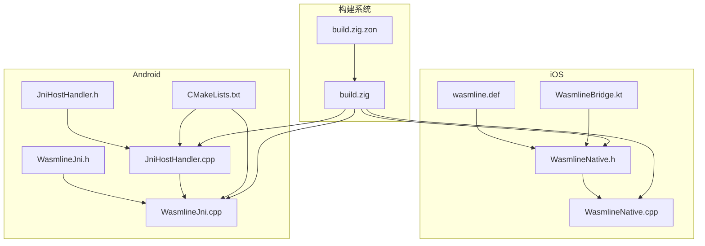
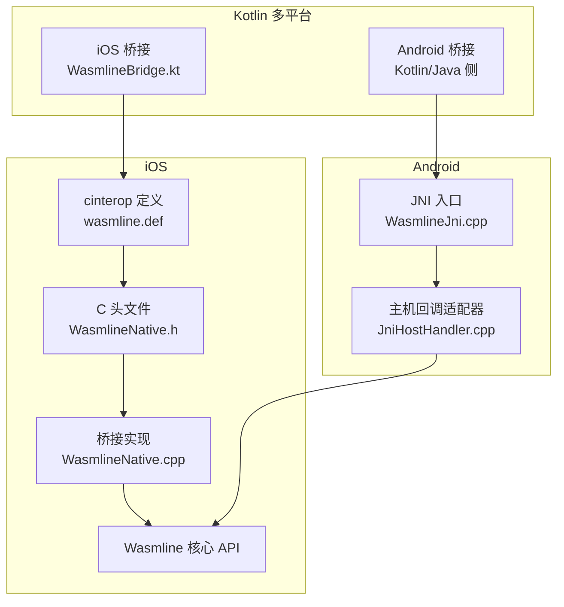
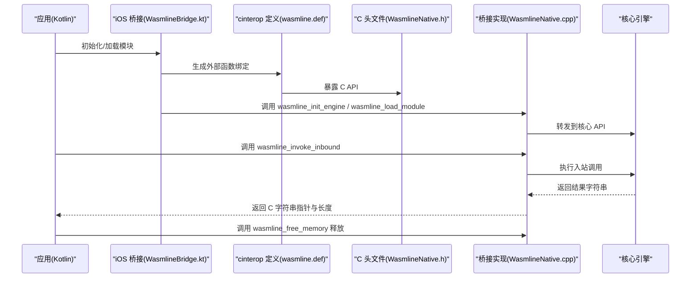
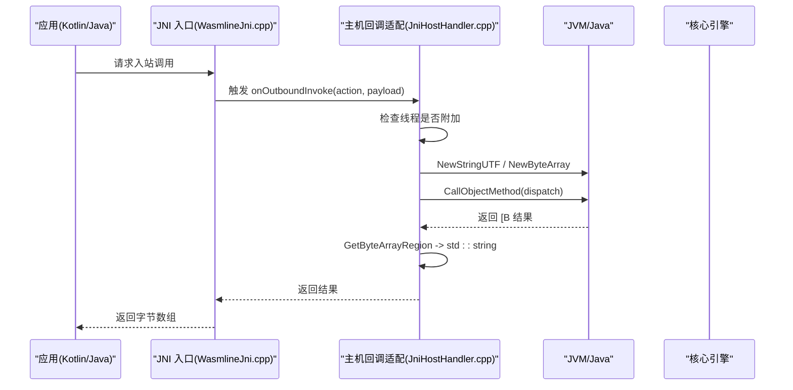
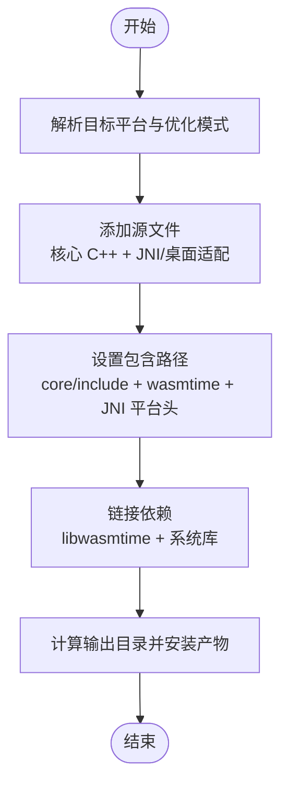
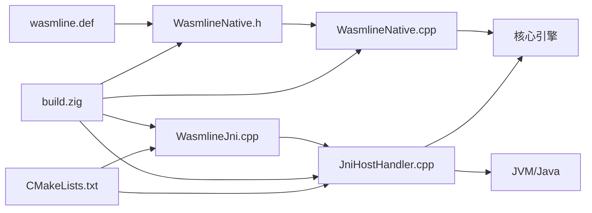

# C 互操作

<cite>
**本文引用的文件**
- [wasmline.def](file://wasmline-multiplatform/wasmline/src/iosMain/native/cinterop/wasmline.def)
- [WasmlineNative.h](file://wasmline-multiplatform/wasmline/src/iosMain/native/WasmlineNative.h)
- [WasmlineNative.cpp](file://wasmline-multiplatform/wasmline/src/iosMain/native/WasmlineNative.cpp)
- [JniHostHandler.h](file://wasmline-multiplatform/wasmline/src/jniMain/native/JniHostHandler.h)
- [JniHostHandler.cpp](file://wasmline-multiplatform/wasmline/src/jniMain/native/JniHostHandler.cpp)
- [WasmlineJni.cpp](file://wasmline-multiplatform/wasmline/src/jniMain/native/WasmlineJni.cpp)
- [WasmlineJni.h](file://wasmline-multiplatform/wasmline/src/jniMain/native/WasmlineJni.h)
- [build.zig](file://wasmline-multiplatform/wasmline/build.zig)
- [build.zig.zon](file://wasmline-multiplatform/wasmline/build.zig.zon)
- [CMakeLists.txt](file://wasmline-multiplatform/wasmline-android/src/androidMain/CMakeLists.txt)
- [WasmlineBridge.kt](file://wasmline-multiplatform/wasmline/src/iosMain/kotlin/crow/wasmline/native/WasmlineBridge.kt)
</cite>

## 目录
1. [引言](#引言)
2. [项目结构](#项目结构)
3. [核心组件](#核心组件)
4. [架构总览](#架构总览)
5. [详细组件分析](#详细组件分析)
6. [依赖关系分析](#依赖关系分析)
7. [性能考量](#性能考量)
8. [故障排查指南](#故障排查指南)
9. [结论](#结论)
10. [附录：集成与最佳实践](#附录集成与最佳实践)

## 引言
本文件面向需要在 Kotlin 多平台中实现 C/C++ 互操作的工程师，系统性阐述 Wasmline 在 iOS 与 Android 平台的 C 互操作机制。内容覆盖：
- 函数声明与导出约定
- 数据类型映射与内存管理策略
- iOS 平台的 cinterop 定义、头文件与桥接函数实现
- Android 平台的 JNI 接口实现（含 JniHostHandler 的 C++ 实现、数据传递与异常处理）
- Zig 编译器与 C 代码生成、链接配置
- 最佳实践、性能优化与常见陷阱

## 项目结构
围绕 C 互操作的关键目录与文件如下：
- iOS 平台
  - cinterop 定义：wasmline.def
  - C 桥接头文件与实现：WasmlineNative.h / WasmlineNative.cpp
  - Swift/Kotlin 桥接入口：WasmlineBridge.kt
- Android 平台
  - JNI 头文件与实现：WasmlineJni.h / WasmlineJni.cpp
  - 主机回调适配器：JniHostHandler.h / JniHostHandler.cpp
  - CMake 链接脚本：CMakeLists.txt
- 构建系统
  - Zig 动态库构建：build.zig
  - Zig 依赖清单：build.zig.zon

图表来源
- [wasmline.def:1-2](file://wasmline-multiplatform/wasmline/src/iosMain/native/cinterop/wasmline.def#L1-L2)
- [WasmlineNative.h:1-68](file://wasmline-multiplatform/wasmline/src/iosMain/native/WasmlineNative.h#L1-L68)
- [WasmlineNative.cpp:1-97](file://wasmline-multiplatform/wasmline/src/iosMain/native/WasmlineNative.cpp#L1-L97)
- [WasmlineBridge.kt](file://wasmline-multiplatform/wasmline/src/iosMain/kotlin/crow/wasmline/native/WasmlineBridge.kt)
- [WasmlineJni.h](file://wasmline-multiplatform/wasmline/src/jniMain/native/WasmlineJni.h)
- [WasmlineJni.cpp](file://wasmline-multiplatform/wasmline/src/jniMain/native/WasmlineJni.cpp)
- [JniHostHandler.h:1-17](file://wasmline-multiplatform/wasmline/src/jniMain/native/JniHostHandler.h#L1-L17)
- [JniHostHandler.cpp:1-79](file://wasmline-multiplatform/wasmline/src/jniMain/native/JniHostHandler.cpp#L1-L79)
- [CMakeLists.txt:1-54](file://wasmline-multiplatform/wasmline-android/src/androidMain/CMakeLists.txt#L1-L54)
- [build.zig:1-472](file://wasmline-multiplatform/wasmline/build.zig#L1-L472)
- [build.zig.zon:1-13](file://wasmline-multiplatform/wasmline/build.zig.zon#L1-L13)

章节来源
- [wasmline.def:1-2](file://wasmline-multiplatform/wasmline/src/iosMain/native/cinterop/wasmline.def#L1-L2)
- [WasmlineNative.h:1-68](file://wasmline-multiplatform/wasmline/src/iosMain/native/WasmlineNative.h#L1-L68)
- [WasmlineNative.cpp:1-97](file://wasmline-multiplatform/wasmline/src/iosMain/native/WasmlineNative.cpp#L1-L97)
- [WasmlineJni.h](file://wasmline-multiplatform/wasmline/src/jniMain/native/WasmlineJni.h)
- [WasmlineJni.cpp](file://wasmline-multiplatform/wasmline/src/jniMain/native/WasmlineJni.cpp)
- [JniHostHandler.h:1-17](file://wasmline-multiplatform/wasmline/src/jniMain/native/JniHostHandler.h#L1-L17)
- [JniHostHandler.cpp:1-79](file://wasmline-multiplatform/wasmline/src/jniMain/native/JniHostHandler.cpp#L1-L79)
- [CMakeLists.txt:1-54](file://wasmline-multiplatform/wasmline-android/src/androidMain/CMakeLists.txt#L1-L54)
- [build.zig:1-472](file://wasmline-multiplatform/wasmline/build.zig#L1-L472)
- [build.zig.zon:1-13](file://wasmline-multiplatform/wasmline/build.zig.zon#L1-L13)

## 核心组件
- iOS C 互操作
  - cinterop 定义：通过 wasmline.def 声明包名与头文件集合，用于生成 Kotlin 侧的 C 外部函数绑定。
  - C 桥接层：WasmlineNative.h 提供 C API 原型；WasmlineNative.cpp 将 C 调用转发到 Wasmline 核心 API，并负责内存分配/释放与回调封装。
- Android JNI 互操作
  - JNI 入口：WasmlineJni.cpp 实现 Kotlin 与 JVM 的桥接，负责模块加载、调用与结果返回。
  - 主机回调适配器：JniHostHandler.cpp 将 C++ 层的主机回调转换为 Java/Kotlin 方法调用，处理线程附加、JNI 引用生命周期与异常防护。
- 构建系统
  - Zig 动态库：build.zig 统一编译 C++ 核心与平台特定源码，配置包含路径、链接依赖与安装输出。
  - Android 链接：CMakeLists.txt 将核心 C++ 源与预编译 libwasmtime.a 链接为共享库。

章节来源
- [wasmline.def:1-2](file://wasmline-multiplatform/wasmline/src/iosMain/native/cinterop/wasmline.def#L1-L2)
- [WasmlineNative.h:1-68](file://wasmline-multiplatform/wasmline/src/iosMain/native/WasmlineNative.h#L1-L68)
- [WasmlineNative.cpp:1-97](file://wasmline-multiplatform/wasmline/src/iosMain/native/WasmlineNative.cpp#L1-L97)
- [WasmlineJni.cpp](file://wasmline-multiplatform/wasmline/src/jniMain/native/WasmlineJni.cpp)
- [JniHostHandler.cpp:1-79](file://wasmline-multiplatform/wasmline/src/jniMain/native/JniHostHandler.cpp#L1-L79)
- [build.zig:1-472](file://wasmline-multiplatform/wasmline/build.zig#L1-L472)
- [CMakeLists.txt:1-54](file://wasmline-multiplatform/wasmline-android/src/androidMain/CMakeLists.txt#L1-L54)

## 架构总览
下图展示 iOS 与 Android 两端的 C 互操作如何与 Kotlin 多平台交互，以及核心引擎的调用链路。

图表来源
- [WasmlineBridge.kt](file://wasmline-multiplatform/wasmline/src/iosMain/kotlin/crow/wasmline/native/WasmlineBridge.kt)
- [wasmline.def:1-2](file://wasmline-multiplatform/wasmline/src/iosMain/native/cinterop/wasmline.def#L1-L2)
- [WasmlineNative.h:1-68](file://wasmline-multiplatform/wasmline/src/iosMain/native/WasmlineNative.h#L1-L68)
- [WasmlineNative.cpp:1-97](file://wasmline-multiplatform/wasmline/src/iosMain/native/WasmlineNative.cpp#L1-L97)
- [WasmlineJni.cpp](file://wasmline-multiplatform/wasmline/src/jniMain/native/WasmlineJni.cpp)
- [JniHostHandler.cpp:1-79](file://wasmline-multiplatform/wasmline/src/jniMain/native/JniHostHandler.cpp#L1-L79)

## 详细组件分析

### iOS 平台：C 互操作与桥接实现
- cinterop 定义
  - 包名与头文件集合由 wasmline.def 指定，用于生成 Kotlin 侧的 C 外部函数绑定，确保符号可见与命名空间正确。
- C 头文件与桥接函数
  - WasmlineNative.h 定义了初始化、热身、释放引擎，模块加载/释放，入站调用与内存释放等 C API。
  - WasmlineNative.cpp 将上述 C API 转发至 Wasmline 核心 API，并实现：
    - 回调适配：将 Kotlin 传入的 OutboundCallback 封装为 C++ 的 OutboundHandler 子类，统一返回 std::string。
    - 内存管理：入站调用返回的字符串以 malloc 分配，需由 wasmline_free_memory 归还；未分配或空结果返回 nullptr。
    - 字符串与二进制数据：通过 std::string 与 size_t 明确长度，避免隐式拷贝与越界。
- Swift/Kotlin 桥接入口
  - WasmlineBridge.kt 作为 iOS 端的桥接入口，负责加载动态库、初始化引擎、注册回调与执行调用。

图表来源
- [wasmline.def:1-2](file://wasmline-multiplatform/wasmline/src/iosMain/native/cinterop/wasmline.def#L1-L2)
- [WasmlineNative.h:1-68](file://wasmline-multiplatform/wasmline/src/iosMain/native/WasmlineNative.h#L1-L68)
- [WasmlineNative.cpp:1-97](file://wasmline-multiplatform/wasmline/src/iosMain/native/WasmlineNative.cpp#L1-L97)
- [WasmlineBridge.kt](file://wasmline-multiplatform/wasmline/src/iosMain/kotlin/crow/wasmline/native/WasmlineBridge.kt)

章节来源
- [wasmline.def:1-2](file://wasmline-multiplatform/wasmline/src/iosMain/native/cinterop/wasmline.def#L1-L2)
- [WasmlineNative.h:1-68](file://wasmline-multiplatform/wasmline/src/iosMain/native/WasmlineNative.h#L1-L68)
- [WasmlineNative.cpp:1-97](file://wasmline-multiplatform/wasmline/src/iosMain/native/WasmlineNative.cpp#L1-L97)
- [WasmlineBridge.kt](file://wasmline-multiplatform/wasmline/src/iosMain/kotlin/crow/wasmline/native/WasmlineBridge.kt)

### Android 平台：JNI 接口与主机回调适配
- JNI 入口
  - WasmlineJni.cpp 提供 Kotlin 与 JVM 的桥接，负责模块加载、调用与结果返回。
- 主机回调适配器
  - JniHostHandler.cpp 将 C++ 层的主机回调转换为 Java/Kotlin 方法调用：
    - 线程安全：若当前线程未附加到 JVM，则尝试附加；结束后按需分离。
    - 引用管理：保存全局引用以防止 GC；析构时释放。
    - 数据传递：将 std::string_view 转换为 jstring 与 jbyteArray，调用 Java 方法后回收局部引用。
    - 异常防护：对 JNI 调用进行健壮性检查，避免内部并发导致的崩溃。
- CMake 链接
  - CMakeLists.txt 将核心 C++ 源与 libwasmtime.a 链接为共享库，同时引入 log、m、dl 等系统库。

图表来源
- [WasmlineJni.cpp](file://wasmline-multiplatform/wasmline/src/jniMain/native/WasmlineJni.cpp)
- [JniHostHandler.cpp:1-79](file://wasmline-multiplatform/wasmline/src/jniMain/native/JniHostHandler.cpp#L1-L79)
- [CMakeLists.txt:1-54](file://wasmline-multiplatform/wasmline-android/src/androidMain/CMakeLists.txt#L1-L54)

章节来源
- [WasmlineJni.cpp](file://wasmline-multiplatform/wasmline/src/jniMain/native/WasmlineJni.cpp)
- [JniHostHandler.cpp:1-79](file://wasmline-multiplatform/wasmline/src/jniMain/native/JniHostHandler.cpp#L1-L79)
- [CMakeLists.txt:1-54](file://wasmline-multiplatform/wasmline-android/src/androidMain/CMakeLists.txt#L1-L54)

### Zig 编译器与 C 代码生成、链接配置
- 动态库构建
  - build.zig 定义动态库目标、标准目标选项与优化模式；添加核心 C++ 源与 JNI/桌面适配源；设置包含路径与链接依赖。
- 包含路径与链接
  - 自动检测 JAVA_HOME 并根据平台选择 JNI 头文件子目录；链接 libwasmtime.a（Windows 下区分 GNU/MSVC）；非 Windows 平台链接 m、dl、pthread。
- 输出与安装
  - 根据 ABI 计算输出目录（Android 与桌面差异），安装 libwasmline.* 到对应子目录。
- 依赖与工具
  - build.zig.zon 声明编译命令生成工具依赖，便于编辑器工具链集成。

图表来源
- [build.zig:1-472](file://wasmline-multiplatform/wasmline/build.zig#L1-L472)
- [build.zig.zon:1-13](file://wasmline-multiplatform/wasmline/build.zig.zon#L1-L13)

章节来源
- [build.zig:1-472](file://wasmline-multiplatform/wasmline/build.zig#L1-L472)
- [build.zig.zon:1-13](file://wasmline-multiplatform/wasmline/build.zig.zon#L1-L13)

## 依赖关系分析
- iOS
  - cinterop 定义依赖头文件；头文件依赖核心 API；桥接实现依赖核心 API 与回调接口。
- Android
  - JNI 入口依赖主机回调适配器；适配器依赖 JVM 环境与 Java 对象；CMake 将适配器与核心源码链接为共享库。
- 构建系统
  - Zig 构建脚本统一管理包含路径、链接与安装；Android 使用 CMake 复用相同核心源码。

图表来源
- [wasmline.def:1-2](file://wasmline-multiplatform/wasmline/src/iosMain/native/cinterop/wasmline.def#L1-L2)
- [WasmlineNative.h:1-68](file://wasmline-multiplatform/wasmline/src/iosMain/native/WasmlineNative.h#L1-L68)
- [WasmlineNative.cpp:1-97](file://wasmline-multiplatform/wasmline/src/iosMain/native/WasmlineNative.cpp#L1-L97)
- [WasmlineJni.cpp](file://wasmline-multiplatform/wasmline/src/jniMain/native/WasmlineJni.cpp)
- [JniHostHandler.cpp:1-79](file://wasmline-multiplatform/wasmline/src/jniMain/native/JniHostHandler.cpp#L1-L79)
- [build.zig:1-472](file://wasmline-multiplatform/wasmline/build.zig#L1-L472)
- [CMakeLists.txt:1-54](file://wasmline-multiplatform/wasmline-android/src/androidMain/CMakeLists.txt#L1-L54)

章节来源
- [wasmline.def:1-2](file://wasmline-multiplatform/wasmline/src/iosMain/native/cinterop/wasmline.def#L1-L2)
- [WasmlineNative.h:1-68](file://wasmline-multiplatform/wasmline/src/iosMain/native/WasmlineNative.h#L1-L68)
- [WasmlineNative.cpp:1-97](file://wasmline-multiplatform/wasmline/src/iosMain/native/WasmlineNative.cpp#L1-L97)
- [WasmlineJni.cpp](file://wasmline-multiplatform/wasmline/src/jniMain/native/WasmlineJni.cpp)
- [JniHostHandler.cpp:1-79](file://wasmline-multiplatform/wasmline/src/jniMain/native/JniHostHandler.cpp#L1-L79)
- [build.zig:1-472](file://wasmline-multiplatform/wasmline/build.zig#L1-L472)
- [CMakeLists.txt:1-54](file://wasmline-multiplatform/wasmline-android/src/androidMain/CMakeLists.txt#L1-L54)

## 性能考量
- 内存管理
  - iOS：入站调用返回的 C 字符串由调用方负责释放；避免重复拷贝，尽量使用 size_t 明确边界。
  - Android：JNI 层将字节数组直接传递给 Java，减少中间层拷贝；注意及时删除局部引用，避免泄漏。
- 线程与并发
  - Android：在回调适配器中显式检查线程附加状态，必要时附加/分离，降低并发风险。
- 构建优化
  - Zig：启用 ReleaseSmall，剥离符号与死代码，启用链接时垃圾回收段，Windows 下强制 LTO 与 LLD 链接器。
- 链接与库
  - Android：复用 libwasmtime.a 与系统库，避免重复编译；确保 ABI 与架构匹配。

## 故障排查指南
- iOS
  - 符号不可见：确认 wasmline.def 中包名与头文件路径正确；重新生成绑定。
  - 内存泄漏：确保每次调用 wasmline_invoke_inbound 后都调用 wasmline_free_memory。
- Android
  - JNI 异常：检查 Java 方法签名与参数类型；确保 dispatch 方法存在且可访问。
  - 引用泄漏：确认适配器析构时释放全局引用；避免在回调中频繁创建局部引用。
  - 线程问题：若出现崩溃，检查线程附加状态；必要时在适配器中自动附加/分离。
- 构建
  - Zig：检查 JAVA_HOME 是否有效；确认 JNI 平台头文件存在；Windows 需要 MINGW_PATH。
  - Android：确认 ANDROID_ABI 与 libwasmtime.a 路径一致；确保 log、m、dl 可被链接。

章节来源
- [WasmlineNative.cpp:1-97](file://wasmline-multiplatform/wasmline/src/iosMain/native/WasmlineNative.cpp#L1-L97)
- [JniHostHandler.cpp:1-79](file://wasmline-multiplatform/wasmline/src/jniMain/native/JniHostHandler.cpp#L1-L79)
- [build.zig:1-472](file://wasmline-multiplatform/wasmline/build.zig#L1-L472)
- [CMakeLists.txt:1-54](file://wasmline-multiplatform/wasmline-android/src/androidMain/CMakeLists.txt#L1-L54)

## 结论
Wasmline 在 Kotlin 多平台中的 C 互操作通过清晰的 C API、稳健的内存管理与跨平台构建系统实现。iOS 侧以 cinterop 与桥接层对接 Swift/Kotlin；Android 侧以 JNI 与主机回调适配器连接 JVM。借助 Zig 与 CMake 的统一构建流程，开发者可在多平台上获得一致的性能与可靠性。

## 附录：集成与最佳实践
- iOS 集成步骤
  - 在 cinterop 中声明包名与头文件；在 Swift/Kotlin 中通过生成的外部函数绑定调用 C API。
  - 调用顺序：初始化引擎 → 加载模块 → 注册回调 → 入站调用 → 释放内存 → 释放引擎。
- Android 集成步骤
  - 在 JNI 入口中完成模块加载与调用；通过 JniHostHandler 将主机回调转为 Java 方法。
  - 注意线程附加、JNI 引用生命周期与异常处理。
- 数据类型映射与内存管理
  - 字符串与二进制：使用 size_t 明确长度；返回的 C 字符串由调用方释放。
  - 回调：C++ 侧统一返回 std::string，Kotlin/Java 侧负责序列化/反序列化。
- 性能优化建议
  - 避免不必要的拷贝；优先使用视图类型（如 std::string_view）；在构建阶段启用链接时优化。
- 常见陷阱
  - 忘记释放内存（iOS）；未附加线程（Android）；JNI 参数类型不匹配；引用未释放。