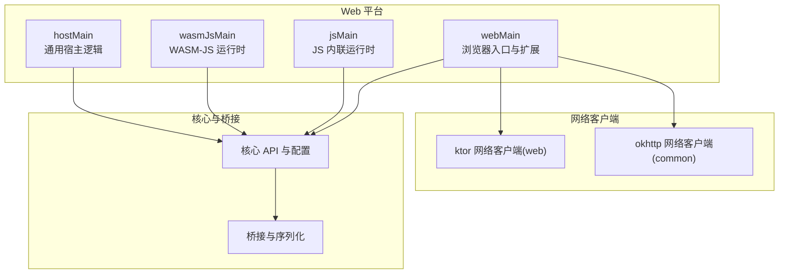
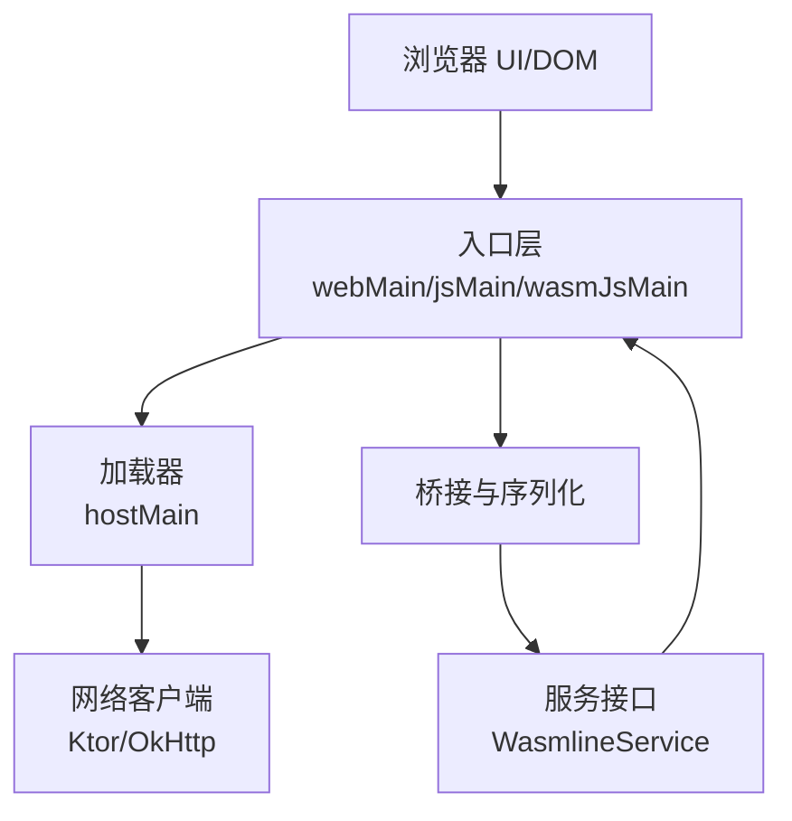
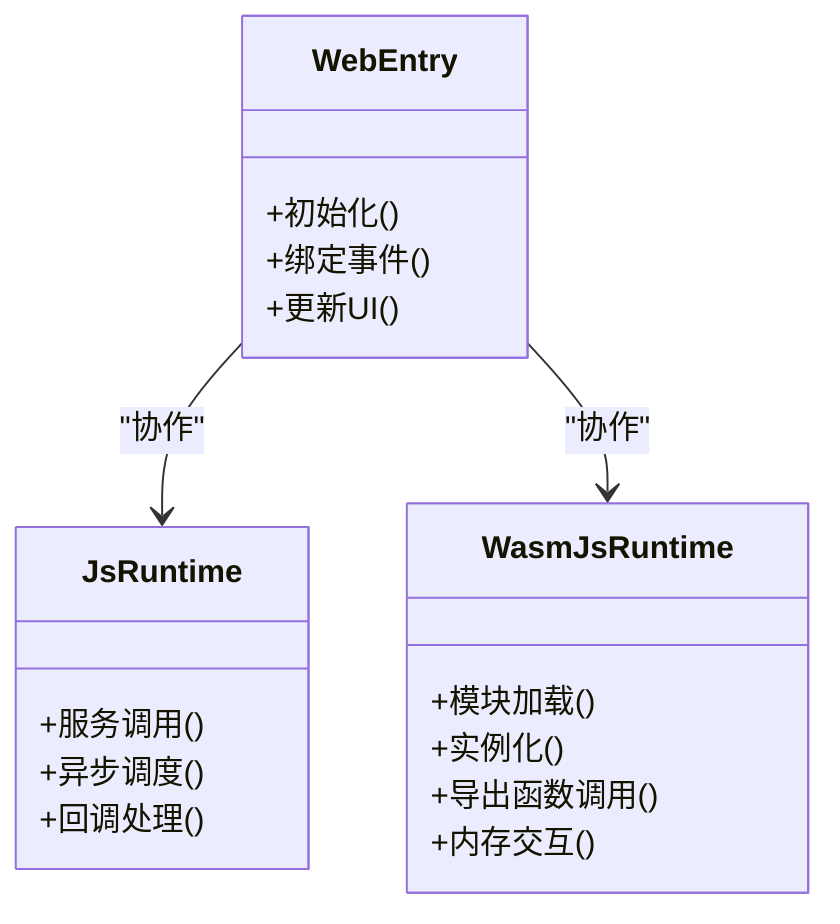
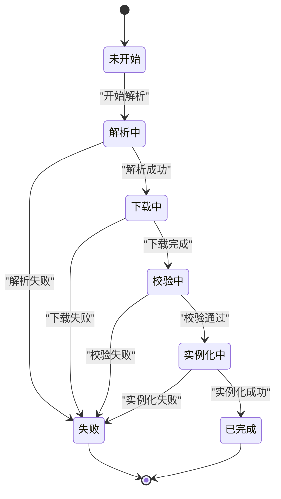
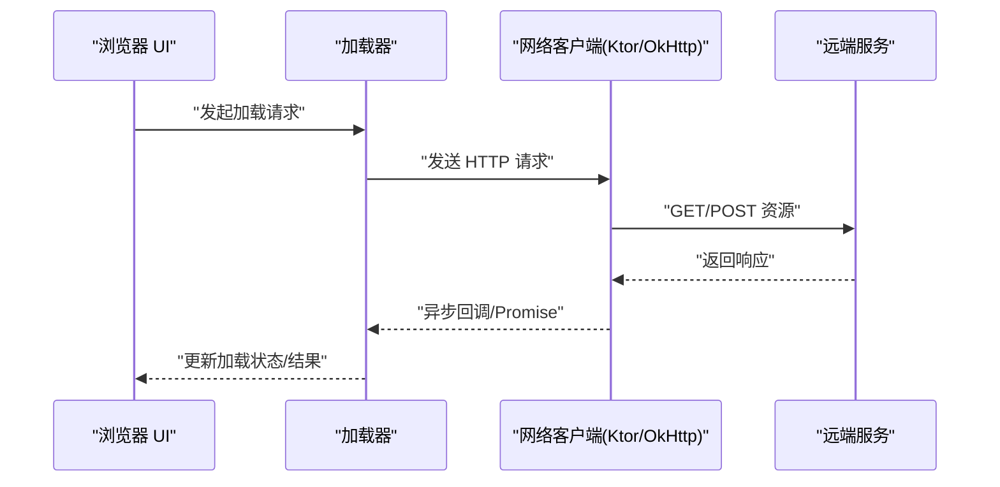
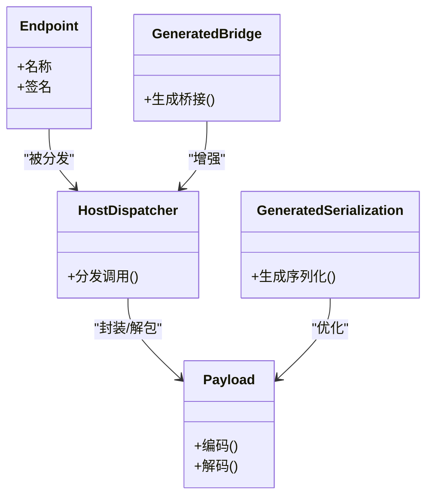
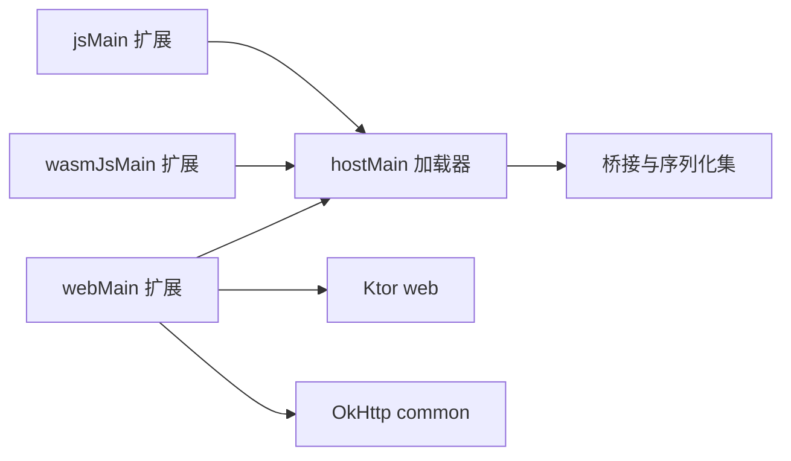

# Web 平台实现

<cite>
**本文引用的文件**
- [README.md](file://README.md)
- [wasmline-multiplatform/wasmline/src/webMain/kotlin/crow/wasmline/Wasmline.web.kt](file://wasmline-multiplatform/wasmline/src/webMain/kotlin/crow/wasmline/Wasmline.web.kt)
- [wasmline-multiplatform/wasmline/src/jsMain/kotlin/crow/wasmline/Wasmline.js.kt](file://wasmline-multiplatform/wasmline/src/jsMain/kotlin/crow/wasmline/Wasmline.js.kt)
- [wasmline-multiplatform/wasmline/src/wasmJsMain/kotlin/crow/wasmline/Wasmline.wasmJs.kt](file://wasmline-multiplatform/wasmline/src/wasmJsMain/kotlin/crow/wasmline/Wasmline.wasmJs.kt)
- [wasmline-multiplatform/wasmline/src/hostMain/kotlin/crow/wasmline/WasmlineLoader.kt](file://wasmline-multiplatform/wasmline/src/hostMain/kotlin/crow/wasmline/WasmlineLoader.kt)
- [wasmline-multiplatform/wasmline-loader/src/hostMain/kotlin/crow/wasmline/loader/WasmlineLoader.kt](file://wasmline-multiplatform/wasmline-loader/src/hostMain/kotlin/crow/wasmline/loader/WasmlineLoader.kt)
- [wasmline-multiplatform/wasmline/src/hostMain/kotlin/crow/wasmline/BrowserPayloadEncoding.kt](file://wasmline-multiplatform/wasmline/src/hostMain/kotlin/crow/wasmline/BrowserPayloadEncoding.kt)
- [wasmline-multiplatform/wasmline/src/hostMain/kotlin/crow/wasmline/WasmlineLoadState.kt](file://wasmline-multiplatform/wasmline/src/hostMain/kotlin/crow/wasmline/WasmlineLoadState.kt)
- [wasmline-multiplatform/wasmline/src/hostMain/kotlin/crow/wasmline/WasmlineLoadResult.kt](file://wasmline-multiplatform/wasmline/src/hostMain/kotlin/crow/wasmline/WasmlineLoadResult.kt)
- [wasmline-multiplatform/wasmline/src/hostMain/kotlin/crow/wasmline/WasmlineWarmupMode.kt](file://wasmline-multiplatform/wasmline/src/hostMain/kotlin/crow/wasmline/WasmlineWarmupMode.kt)
- [wasmline-multiplatform/wasmline/src/commonMain/kotlin/crow/wasmline/WasmlineNetworkClient.kt](file://wasmline-multiplatform/wasmline/src/commonMain/kotlin/crow/wasmline/WasmlineNetworkClient.kt)
- [wasmline-multiplatform/wasmline-network-ktor/src/webMain/kotlin/crow/wasmline/network/ktor/BlockingFetch.web.kt](file://wasmline-multiplatform/wasmline-network-ktor/src/webMain/kotlin/crow/wasmline/network/ktor/BlockingFetch.web.kt)
- [wasmline-multiplatform/wasmline-network-okhttp/src/commonMain/kotlin/crow/wasmline/network/okhttp/OkHttpNetworkClient.kt](file://wasmline-multiplatform/wasmline-network-okhttp/src/commonMain/kotlin/crow/wasmline/network/okhttp/OkHttpNetworkClient.kt)
- [wasmline-multiplatform/wasmline/src/webMain/kotlin/crow/wasmline/extensions/NativeLoaderExt.web.kt](file://wasmline-multiplatform/wasmline/src/webMain/kotlin/crow/wasmline/extensions/NativeLoaderExt.web.kt)
- [wasmline-multiplatform/wasmline/src/jsMain/kotlin/crow/wasmline/extensions/NativeLoaderExt.js.kt](file://wasmline-multiplatform/wasmline/src/jsMain/kotlin/crow/wasmline/extensions/NativeLoaderExt.js.kt)
- [wasmline-multiplatform/wasmline/src/wasmJsMain/kotlin/crow/wasmline/extensions/NativeLoaderExt.wasmJs.kt](file://wasmline-multiplatform/wasmline/src/wasmJsMain/kotlin/crow/wasmline/extensions/NativeLoaderExt.wasmJs.kt)
- [wasmline-multiplatform/wasmline/src/commonMain/kotlin/crow/wasmline/internal/bridge/Endpoint.kt](file://wasmline-multiplatform/wasmline/src/commonMain/kotlin/crow/wasmline/internal/bridge/Endpoint.kt)
- [wasmline-multiplatform/wasmline/src/commonMain/kotlin/crow/wasmline/internal/bridge/HostDispatcher.kt](file://wasmline-multiplatform/wasmline/src/commonMain/kotlin/crow/wasmline/internal/bridge/HostDispatcher.kt)
- [wasmline-multiplatform/wasmline/src/commonMain/kotlin/crow/wasmline/internal/bridge/Payload.kt](file://wasmline-multiplatform/wasmline/src/commonMain/kotlin/crow/wasmline/internal/bridge/Payload.kt)
- [wasmline-multiplatform/wasmline/src/commonMain/kotlin/crow/wasmline/internal/bridge/GeneratedBridge.kt](file://wasmline-multiplatform/wasmline/src/commonMain/kotlin/crow/wasmline/internal/bridge/GeneratedBridge.kt)
- [wasmline-multiplatform/wasmline/src/commonMain/kotlin/crow/wasmline/internal/bridge/GeneratedSerialization.kt](file://wasmline-multiplatform/wasmline/src/commonMain/kotlin/crow/wasmline/internal/bridge/GeneratedSerialization.kt)
- [wasmline-multiplatform/wasmline/src/commonMain/kotlin/crow/wasmline/serialization/WasmlineSerializationConfig.kt](file://wasmline-multiplatform/wasmline/src/commonMain/kotlin/crow/wasmline/serialization/WasmlineSerializationConfig.kt)
- [wasmline-multiplatform/wasmline/src/commonMain/kotlin/crow/wasmline/serialization/WasmlineSerializationFactory.kt](file://wasmline-multiplatform/wasmline/src/commonMain/kotlin/crow/wasmline/serialization/WasmlineSerializationFactory.kt)
- [wasmline-multiplatform/wasmline/src/commonMain/kotlin/crow/wasmline/serialization/WasmlineSerializationRegistry.kt](file://wasmline-multiplatform/wasmline/src/commonMain/kotlin/crow/wasmline/serialization/WasmlineSerializationRegistry.kt)
- [wasmline-multiplatform/wasmline/src/commonMain/kotlin/crow/wasmline/WasmlineService.kt](file://wasmline-multiplatform/wasmline/src/commonMain/kotlin/crow/wasmline/WasmlineService.kt)
- [wasmline-multiplatform/wasmline/src/commonMain/kotlin/crow/wasmline/WasmlineConfig.kt](file://wasmline-multiplatform/wasmline/src/commonMain/kotlin/crow/wasmline/WasmlineConfig.kt)
- [wasmline-multiplatform/wasmline/src/commonMain/kotlin/crow/wasmline/WasmlineCache.kt](file://wasmline-multiplatform/wasmline/src/commonMain/kotlin/crow/wasmline/WasmlineCache.kt)
- [wasmline-multiplatform/wasmline/src/commonMain/kotlin/crow/wasmline/WasmlineTrustedKeys.kt](file://wasmline-multiplatform/wasmline/src/commonMain/kotlin/crow/wasmline/WasmlineTrustedKeys.kt)
- [wasmline-multiplatform/wasmline/src/commonMain/kotlin/crow/wasmline/convert/LogcatExt.kt](file://wasmline-multiplatform/wasmline/src/commonMain/kotlin/crow/wasmline/convert/LogcatExt.kt)
- [wasmline-multiplatform/wasmline/src/commonMain/kotlin/crow/wasmline/convert/PrintExt.kt](file://wasmline-multiplatform/wasmline/src/commonMain/kotlin/crow/wasmline/convert/PrintExt.kt)
- [wasmline-multiplatform/wasmline/src/webMain/kotlin/crow/wasmline/extensions/LogcatExt.web.kt](file://wasmline-multiplatform/wasmline/src/webMain/kotlin/crow/wasmline/extensions/LogcatExt.web.kt)
- [wasmline-multiplatform/wasmline/src/jsMain/kotlin/crow/wasmline/extensions/LogcatExt.js.kt](file://wasmline-multiplatform/wasmline/src/jsMain/kotlin/crow/wasmline/extensions/LogcatExt.js.kt)
- [wasmline-multiplatform/wasmline/src/wasmJsMain/kotlin/crow/wasmline/extensions/LogcatExt.wasmJs.kt](file://wasmline-multiplatform/wasmline/src/wasmJsMain/kotlin/crow/wasmline/extensions/LogcatExt.wasmJs.kt)
- [wasmline-multiplatform/wasmline/src/commonMain/kotlin/crow/wasmline/extensions/LogcatExt.kt](file://wasmline-multiplatform/wasmline/src/commonMain/kotlin/crow/wasmline/extensions/LogcatExt.kt)
- [wasmline-multiplatform/wasmline/src/commonMain/kotlin/crow/wasmline/extensions/PrintExt.kt](file://wasmline-multiplatform/wasmline/src/commonMain/kotlin/crow/wasmline/extensions/PrintExt.kt)
- [wasmline-multiplatform/wasmline/src/commonMain/kotlin/crow/wasmline/internal/bridge/Endpoint.kt](file://wasmline-multiplatform/wasmline/src/commonMain/kotlin/crow/wasmline/internal/bridge/Endpoint.kt)
- [wasmline-multiplatform/wasmline/src/commonMain/kotlin/crow/wasmline/internal/bridge/HostDispatcher.kt](file://wasmline-multiplatform/wasmline/src/commonMain/kotlin/crow/wasmline/internal/bridge/HostDispatcher.kt)
- [wasmline-multiplatform/wasmline/src/commonMain/kotlin/crow/wasmline/internal/bridge/Payload.kt](file://wasmline-multiplatform/wasmline/src/commonMain/kotlin/crow/wasmline/internal/bridge/Payload.kt)
- [wasmline-multiplatform/wasmline/src/commonMain/kotlin/crow/wasmline/internal/bridge/GeneratedBridge.kt](file://wasmline-multiplatform/wasmline/src/commonMain/kotlin/crow/wasmline/internal/bridge/GeneratedBridge.kt)
- [wasmline-multiplatform/wasmline/src/commonMain/kotlin/crow/wasmline/internal/bridge/GeneratedSerialization.kt](file://wasmline-multiplatform/wasmline/src/commonMain/kotlin/crow/wasmline/internal/bridge/GeneratedSerialization.kt)
- [wasmline-multiplatform/wasmline/src/commonMain/kotlin/crow/wasmline/serialization/WasmlineSerializationConfig.kt](file://wasmline-multiplatform/wasmline/src/commonMain/kotlin/crow/wasmline/serialization/WasmlineSerializationConfig.kt)
- [wasmline-multiplatform/wasmline/src/commonMain/kotlin/crow/wasmline/serialization/WasmlineSerializationFactory.kt](file://wasmline-multiplatform/wasmline/src/commonMain/kotlin/crow/wasmline/serialization/WasmlineSerializationFactory.kt)
- [wasmline-multiplatform/wasmline/src/commonMain/kotlin/crow/wasmline/serialization/WasmlineSerializationRegistry.kt](file://wasmline-multiplatform/wasmline/src/commonMain/kotlin/crow/wasmline/serialization/WasmlineSerializationRegistry.kt)
- [wasmline-multiplatform/wasmline/src/commonMain/kotlin/crow/wasmline/WasmlineService.kt](file://wasmline-multiplatform/wasmline/src/commonMain/kotlin/crow/wasmline/WasmlineService.kt)
- [wasmline-multiplatform/wasmline/src/commonMain/kotlin/crow/wasmline/WasmlineConfig.kt](file://wasmline-multiplatform/wasmline/src/commonMain/kotlin/crow/wasmline/WasmlineConfig.kt)
- [wasmline-multiplatform/wasmline/src/commonMain/kotlin/crow/wasmline/WasmlineCache.kt](file://wasmline-multiplatform/wasmline/src/commonMain/kotlin/crow/wasmline/WasmlineCache.kt)
- [wasmline-multiplatform/wasmline/src/commonMain/kotlin/crow/wasmline/WasmlineTrustedKeys.kt](file://wasmline-multiplatform/wasmline/src/commonMain/kotlin/crow/wasmline/WasmlineTrustedKeys.kt)
- [wasmline-multiplatform/wasmline/src/commonMain/kotlin/crow/wasmline/convert/LogcatExt.kt](file://wasmline-multiplatform/wasmline/src/commonMain/kotlin/crow/wasmline/convert/LogcatExt.kt)
- [wasmline-multiplatform/wasmline/src/commonMain/kotlin/crow/wasmline/convert/PrintExt.kt](file://wasmline-multiplatform/wasmline/src/commonMain/kotlin/crow/wasmline/convert/PrintExt.kt)
- [wasmline-multiplatform/wasmline/src/webMain/kotlin/crow/wasmline/extensions/LogcatExt.web.kt](file://wasmline-multiplatform/wasmline/src/webMain/kotlin/crow/wasmline/extensions/LogcatExt.web.kt)
- [wasmline-multiplatform/wasmline/src/jsMain/kotlin/crow/wasmline/extensions/LogcatExt.js.kt](file://wasmline-multiplatform/wasmline/src/jsMain/kotlin/crow/wasmline/extensions/LogcatExt.js.kt)
- [wasmline-multiplatform/wasmline/src/wasmJsMain/kotlin/crow/wasmline/extensions/LogcatExt.wasmJs.kt](file://wasmline-multiplatform/wasmline/src/wasmJsMain/kotlin/crow/wasmline/extensions/LogcatExt.wasmJs.kt)
- [wasmline-multiplatform/wasmline/src/commonMain/kotlin/crow/wasmline/extensions/LogcatExt.kt](file://wasmline-multiplatform/wasmline/src/commonMain/kotlin/crow/wasmline/extensions/LogcatExt.kt)
- [wasmline-multiplatform/wasmline/src/commonMain/kotlin/crow/wasmline/extensions/PrintExt.kt](file://wasmline-multiplatform/wasmline/src/commonMain/kotlin/crow/wasmline/extensions/PrintExt.kt)
- [wasmline-multiplatform/wasmline/src/webMain/kotlin/crow/wasmline/extensions/NativeLoaderExt.web.kt](file://wasmline-multiplatform/wasmline/src/webMain/kotlin/crow/wasmline/extensions/NativeLoaderExt.web.kt)
- [wasmline-multiplatform/wasmline/src/jsMain/kotlin/crow/wasmline/extensions/NativeLoaderExt.js.kt](file://wasmline-multiplatform/wasmline/src/jsMain/kotlin/crow/wasmline/extensions/NativeLoaderExt.js.kt)
- [wasmline-multiplatform/wasmline/src/wasmJsMain/kotlin/crow/wasmline/extensions/NativeLoaderExt.wasmJs.kt](file://wasmline-multiplatform/wasmline/src/wasmJsMain/kotlin/crow/wasmline/extensions/NativeLoaderExt.wasmJs.kt)
- [wasmline-multiplatform/wasmline/src/hostMain/kotlin/crow/wasmline/BrowserPayloadEncoding.kt](file://wasmline-multiplatform/wasmline/src/hostMain/kotlin/crow/wasmline/BrowserPayloadEncoding.kt)
- [wasmline-multiplatform/wasmline/src/hostMain/kotlin/crow/wasmline/WasmlineLoadState.kt](file://wasmline-multiplatform/wasmline/src/hostMain/kotlin/crow/wasmline/WasmlineLoadState.kt)
- [wasmline-multiplatform/wasmline/src/hostMain/kotlin/crow/wasmline/WasmlineLoadResult.kt](file://wasmline-multiplatform/wasmline/src/hostMain/kotlin/crow/wasmline/WasmlineLoadResult.kt)
- [wasmline-multiplatform/wasmline/src/hostMain/kotlin/crow/wasmline/WasmlineWarmupMode.kt](file://wasmline-multiplatform/wasmline/src/hostMain/kotlin/crow/wasmline/WasmlineWarmupMode.kt)
- [wasmline-multiplatform/wasmline/src/commonMain/kotlin/crow/wasmline/WasmlineNetworkClient.kt](file://wasmline-multiplatform/wasmline/src/commonMain/kotlin/crow/wasmline/WasmlineNetworkClient.kt)
- [wasmline-multiplatform/wasmline-network-ktor/src/webMain/kotlin/crow/wasmline/network/ktor/BlockingFetch.web.kt](file://wasmline-multiplatform/wasmline-network-ktor/src/webMain/kotlin/crow/wasmline/network/ktor/BlockingFetch.web.kt)
- [wasmline-multiplatform/wasmline-network-okhttp/src/commonMain/kotlin/crow/wasmline/network/okhttp/OkHttpNetworkClient.kt](file://wasmline-multiplatform/wasmline-network-okhttp/src/commonMain/kotlin/crow/wasmline/network/okhttp/OkHttpNetworkClient.kt)
- [wasmline-multiplatform/wasmline/src/webMain/kotlin/crow/wasmline/Wasmline.web.kt](file://wasmline-multiplatform/wasmline/src/webMain/kotlin/crow/wasmline/Wasmline.web.kt)
- [wasmline-multiplatform/wasmline/src/jsMain/kotlin/crow/wasmline/Wasmline.js.kt](file://wasmline-multiplatform/wasmline/src/jsMain/kotlin/crow/wasmline/Wasmline.js.kt)
- [wasmline-multiplatform/wasmline/src/wasmJsMain/kotlin/crow/wasmline/Wasmline.wasmJs.kt](file://wasmline-multiplatform/wasmline/src/wasmJsMain/kotlin/crow/wasmline/Wasmline.wasmJs.kt)
- [wasmline-multiplatform/wasmline/src/hostMain/kotlin/crow/wasmline/WasmlineLoader.kt](file://wasmline-multiplatform/wasmline/src/hostMain/kotlin/crow/wasmline/WasmlineLoader.kt)
- [wasmline-multiplatform/wasmline-loader/src/hostMain/kotlin/crow/wasmline/loader/WasmlineLoader.kt](file://wasmline-multiplatform/wasmline-loader/src/hostMain/kotlin/crow/wasmline/loader/WasmlineLoader.kt)
</cite>

## 目录
1. [简介](#简介)
2. [项目结构](#项目结构)
3. [核心组件](#核心组件)
4. [架构总览](#架构总览)
5. [详细组件分析](#详细组件分析)
6. [依赖关系分析](#依赖关系分析)
7. [性能考量](#性能考量)
8. [故障排查指南](#故障排查指南)
9. [结论](#结论)
10. [附录](#附录)

## 简介
本文件面向 Wasmline Web 平台的实现与应用，聚焦浏览器环境下的多目标支持（JS 内联运行时、WebAssembly 模块加载、DOM 交互处理），系统阐述 JS/WASM 目标差异与适用场景，并覆盖网络客户端、浏览器兼容性、异步操作管理、WebAssembly 执行模型与内存管理、性能优化、调试与安全等主题。文末提供 Web 应用集成示例与部署指引。

## 项目结构
Wasmline 采用 Kotlin Multiplatform 架构，通过 source set 划分平台能力，Web 平台相关实现集中在 webMain、jsMain、wasmJsMain、hostMain 等目录中；网络客户端在独立模块中提供 Ktor 与 OkHttp 两种实现；加载器与序列化、桥接层位于核心模块中，便于跨平台共享。

图示来源
- [wasmline-multiplatform/wasmline/src/webMain/kotlin/crow/wasmline/Wasmline.web.kt](file://wasmline-multiplatform/wasmline/src/webMain/kotlin/crow/wasmline/Wasmline.web.kt)
- [wasmline-multiplatform/wasmline/src/jsMain/kotlin/crow/wasmline/Wasmline.js.kt](file://wasmline-multiplatform/wasmline/src/jsMain/kotlin/crow/wasmline/Wasmline.js.kt)
- [wasmline-multiplatform/wasmline/src/wasmJsMain/kotlin/crow/wasmline/Wasmline.wasmJs.kt](file://wasmline-multiplatform/wasmline/src/wasmJsMain/kotlin/crow/wasmline/Wasmline.wasmJs.kt)
- [wasmline-multiplatform/wasmline/src/hostMain/kotlin/crow/wasmline/WasmlineLoader.kt](file://wasmline-multiplatform/wasmline/src/hostMain/kotlin/crow/wasmline/WasmlineLoader.kt)
- [wasmline-multiplatform/wasmline-network-ktor/src/webMain/kotlin/crow/wasmline/network/ktor/BlockingFetch.web.kt](file://wasmline-multiplatform/wasmline-network-ktor/src/webMain/kotlin/crow/wasmline/network/ktor/BlockingFetch.web.kt)
- [wasmline-multiplatform/wasmline-network-okhttp/src/commonMain/kotlin/crow/wasmline/network/okhttp/OkHttpNetworkClient.kt](file://wasmline-multiplatform/wasmline-network-okhttp/src/commonMain/kotlin/crow/wasmline/network/okhttp/OkHttpNetworkClient.kt)
- [wasmline-multiplatform/wasmline/src/commonMain/kotlin/crow/wasmline/internal/bridge/Endpoint.kt](file://wasmline-multiplatform/wasmline/src/commonMain/kotlin/crow/wasmline/internal/bridge/Endpoint.kt)
- [wasmline-multiplatform/wasmline/src/commonMain/kotlin/crow/wasmline/internal/bridge/HostDispatcher.kt](file://wasmline-multiplatform/wasmline/src/commonMain/kotlin/crow/wasmline/internal/bridge/HostDispatcher.kt)
- [wasmline-multiplatform/wasmline/src/commonMain/kotlin/crow/wasmline/internal/bridge/Payload.kt](file://wasmline-multiplatform/wasmline/src/commonMain/kotlin/crow/wasmline/internal/bridge/Payload.kt)
- [wasmline-multiplatform/wasmline/src/commonMain/kotlin/crow/wasmline/internal/bridge/GeneratedBridge.kt](file://wasmline-multiplatform/wasmline/src/commonMain/kotlin/crow/wasmline/internal/bridge/GeneratedBridge.kt)
- [wasmline-multiplatform/wasmline/src/commonMain/kotlin/crow/wasmline/internal/bridge/GeneratedSerialization.kt](file://wasmline-multiplatform/wasmline/src/commonMain/kotlin/crow/wasmline/internal/bridge/GeneratedSerialization.kt)

章节来源
- [README.md](file://README.md)
- [wasmline-multiplatform/wasmline/src/webMain/kotlin/crow/wasmline/Wasmline.web.kt](file://wasmline-multiplatform/wasmline/src/webMain/kotlin/crow/wasmline/Wasmline.web.kt)
- [wasmline-multiplatform/wasmline/src/jsMain/kotlin/crow/wasmline/Wasmline.js.kt](file://wasmline-multiplatform/wasmline/src/jsMain/kotlin/crow/wasmline/Wasmline.js.kt)
- [wasmline-multiplatform/wasmline/src/wasmJsMain/kotlin/crow/wasmline/Wasmline.wasmJs.kt](file://wasmline-multiplatform/wasmline/src/wasmJsMain/kotlin/crow/wasmline/Wasmline.wasmJs.kt)
- [wasmline-multiplatform/wasmline/src/hostMain/kotlin/crow/wasmline/WasmlineLoader.kt](file://wasmline-multiplatform/wasmline/src/hostMain/kotlin/crow/wasmline/WasmlineLoader.kt)

## 核心组件
- 浏览器入口与扩展：webMain 提供浏览器环境入口与平台扩展，负责 DOM 交互、事件绑定、页面渲染等前端职责。
- JS 内联运行时：jsMain 提供 JS 内联运行时，适配浏览器 JS 引擎，负责服务调用、回调处理与异步任务调度。
- WASM-JS 运行时：wasmJsMain 提供 WebAssembly 与 JS 的桥接运行时，负责模块加载、实例化、导出函数调用与内存交互。
- 宿主加载器：hostMain 提供统一的加载流程、状态管理、预热模式与负载编码，协调网络与本地资源。
- 网络客户端：提供基于 Ktor 的 web 实现与基于 OkHttp 的通用实现，满足不同构建链路与运行时需求。
- 桥接与序列化：Endpoint、HostDispatcher、Payload、GeneratedBridge、GeneratedSerialization 负责跨边界数据传输与调用协议。
- 配置与缓存：WasmlineConfig、WasmlineCache、WasmlineTrustedKeys 管理运行参数、缓存策略与信任密钥。
- 日志与打印：LogcatExt、PrintExt 提供跨平台日志输出与格式化工具。

章节来源
- [wasmline-multiplatform/wasmline/src/webMain/kotlin/crow/wasmline/Wasmline.web.kt](file://wasmline-multiplatform/wasmline/src/webMain/kotlin/crow/wasmline/Wasmline.web.kt)
- [wasmline-multiplatform/wasmline/src/jsMain/kotlin/crow/wasmline/Wasmline.js.kt](file://wasmline-multiplatform/wasmline/src/jsMain/kotlin/crow/wasmline/Wasmline.js.kt)
- [wasmline-multiplatform/wasmline/src/wasmJsMain/kotlin/crow/wasmline/Wasmline.wasmJs.kt](file://wasmline-multiplatform/wasmline/src/wasmJsMain/kotlin/crow/wasmline/Wasmline.wasmJs.kt)
- [wasmline-multiplatform/wasmline/src/hostMain/kotlin/crow/wasmline/WasmlineLoader.kt](file://wasmline-multiplatform/wasmline/src/hostMain/kotlin/crow/wasmline/WasmlineLoader.kt)
- [wasmline-multiplatform/wasmline/src/commonMain/kotlin/crow/wasmline/internal/bridge/Endpoint.kt](file://wasmline-multiplatform/wasmline/src/commonMain/kotlin/crow/wasmline/internal/bridge/Endpoint.kt)
- [wasmline-multiplatform/wasmline/src/commonMain/kotlin/crow/wasmline/internal/bridge/HostDispatcher.kt](file://wasmline-multiplatform/wasmline/src/commonMain/kotlin/crow/wasmline/internal/bridge/HostDispatcher.kt)
- [wasmline-multiplatform/wasmline/src/commonMain/kotlin/crow/wasmline/internal/bridge/Payload.kt](file://wasmline-multiplatform/wasmline/src/commonMain/kotlin/crow/wasmline/internal/bridge/Payload.kt)
- [wasmline-multiplatform/wasmline/src/commonMain/kotlin/crow/wasmline/internal/bridge/GeneratedBridge.kt](file://wasmline-multiplatform/wasmline/src/commonMain/kotlin/crow/wasmline/internal/bridge/GeneratedBridge.kt)
- [wasmline-multiplatform/wasmline/src/commonMain/kotlin/crow/wasmline/internal/bridge/GeneratedSerialization.kt](file://wasmline-multiplatform/wasmline/src/commonMain/kotlin/crow/wasmline/internal/bridge/GeneratedSerialization.kt)
- [wasmline-multiplatform/wasmline/src/commonMain/kotlin/crow/wasmline/WasmlineConfig.kt](file://wasmline-multiplatform/wasmline/src/commonMain/kotlin/crow/wasmline/WasmlineConfig.kt)
- [wasmline-multiplatform/wasmline/src/commonMain/kotlin/crow/wasmline/WasmlineCache.kt](file://wasmline-multiplatform/wasmline/src/commonMain/kotlin/crow/wasmline/WasmlineCache.kt)
- [wasmline-multiplatform/wasmline/src/commonMain/kotlin/crow/wasmline/WasmlineTrustedKeys.kt](file://wasmline-multiplatform/wasmline/src/commonMain/kotlin/crow/wasmline/WasmlineTrustedKeys.kt)
- [wasmline-multiplatform/wasmline/src/commonMain/kotlin/crow/wasmline/convert/LogcatExt.kt](file://wasmline-multiplatform/wasmline/src/commonMain/kotlin/crow/wasmline/convert/LogcatExt.kt)
- [wasmline-multiplatform/wasmline/src/commonMain/kotlin/crow/wasmline/convert/PrintExt.kt](file://wasmline-multiplatform/wasmline/src/commonMain/kotlin/crow/wasmline/convert/PrintExt.kt)

## 架构总览
Web 平台的运行时由“入口层（webMain/jsMain/wasmJsMain）+ 加载器（hostMain）+ 网络客户端 + 桥接与序列化”构成。浏览器入口负责 DOM 与事件，JS 内联运行时负责服务调用与异步调度，WASM-JS 运行时负责模块加载与导出函数调用。加载器统一管理加载状态、结果与预热模式，网络客户端提供可替换的 HTTP 实现，桥接与序列化保证跨边界数据一致性。

图示来源
- [wasmline-multiplatform/wasmline/src/webMain/kotlin/crow/wasmline/Wasmline.web.kt](file://wasmline-multiplatform/wasmline/src/webMain/kotlin/crow/wasmline/Wasmline.web.kt)
- [wasmline-multiplatform/wasmline/src/jsMain/kotlin/crow/wasmline/Wasmline.js.kt](file://wasmline-multiplatform/wasmline/src/jsMain/kotlin/crow/wasmline/Wasmline.js.kt)
- [wasmline-multiplatform/wasmline/src/wasmJsMain/kotlin/crow/wasmline/Wasmline.wasmJs.kt](file://wasmline-multiplatform/wasmline/src/wasmJsMain/kotlin/crow/wasmline/Wasmline.wasmJs.kt)
- [wasmline-multiplatform/wasmline/src/hostMain/kotlin/crow/wasmline/WasmlineLoader.kt](file://wasmline-multiplatform/wasmline/src/hostMain/kotlin/crow/wasmline/WasmlineLoader.kt)
- [wasmline-multiplatform/wasmline/src/commonMain/kotlin/crow/wasmline/internal/bridge/Endpoint.kt](file://wasmline-multiplatform/wasmline/src/commonMain/kotlin/crow/wasmline/internal/bridge/Endpoint.kt)
- [wasmline-multiplatform/wasmline/src/commonMain/kotlin/crow/wasmline/internal/bridge/HostDispatcher.kt](file://wasmline-multiplatform/wasmline/src/commonMain/kotlin/crow/wasmline/internal/bridge/HostDispatcher.kt)
- [wasmline-multiplatform/wasmline/src/commonMain/kotlin/crow/wasmline/internal/bridge/Payload.kt](file://wasmline-multiplatform/wasmline/src/commonMain/kotlin/crow/wasmline/internal/bridge/Payload.kt)
- [wasmline-multiplatform/wasmline/src/commonMain/kotlin/crow/wasmline/internal/bridge/GeneratedBridge.kt](file://wasmline-multiplatform/wasmline/src/commonMain/kotlin/crow/wasmline/internal/bridge/GeneratedBridge.kt)
- [wasmline-multiplatform/wasmline/src/commonMain/kotlin/crow/wasmline/internal/bridge/GeneratedSerialization.kt](file://wasmline-multiplatform/wasmline/src/commonMain/kotlin/crow/wasmline/internal/bridge/GeneratedSerialization.kt)
- [wasmline-multiplatform/wasmline/src/commonMain/kotlin/crow/wasmline/WasmlineService.kt](file://wasmline-multiplatform/wasmline/src/commonMain/kotlin/crow/wasmline/WasmlineService.kt)

## 详细组件分析

### 入口层（浏览器）
- webMain：提供浏览器入口与 DOM 交互扩展，负责页面初始化、事件绑定、UI 更新与与运行时的桥接。
- jsMain：提供 JS 内联运行时，负责服务调用、回调处理与异步任务调度，适配浏览器 JS 引擎。
- wasmJsMain：提供 WebAssembly 与 JS 的桥接运行时，负责模块加载、实例化、导出函数调用与内存交互。

图示来源
- [wasmline-multiplatform/wasmline/src/webMain/kotlin/crow/wasmline/Wasmline.web.kt](file://wasmline-multiplatform/wasmline/src/webMain/kotlin/crow/wasmline/Wasmline.web.kt)
- [wasmline-multiplatform/wasmline/src/jsMain/kotlin/crow/wasmline/Wasmline.js.kt](file://wasmline-multiplatform/wasmline/src/jsMain/kotlin/crow/wasmline/Wasmline.js.kt)
- [wasmline-multiplatform/wasmline/src/wasmJsMain/kotlin/crow/wasmline/Wasmline.wasmJs.kt](file://wasmline-multiplatform/wasmline/src/wasmJsMain/kotlin/crow/wasmline/Wasmline.wasmJs.kt)

章节来源
- [wasmline-multiplatform/wasmline/src/webMain/kotlin/crow/wasmline/Wasmline.web.kt](file://wasmline-multiplatform/wasmline/src/webMain/kotlin/crow/wasmline/Wasmline.web.kt)
- [wasmline-multiplatform/wasmline/src/jsMain/kotlin/crow/wasmline/Wasmline.js.kt](file://wasmline-multiplatform/wasmline/src/jsMain/kotlin/crow/wasmline/Wasmline.js.kt)
- [wasmline-multiplatform/wasmline/src/wasmJsMain/kotlin/crow/wasmline/Wasmline.wasmJs.kt](file://wasmline-multiplatform/wasmline/src/wasmJsMain/kotlin/crow/wasmline/Wasmline.wasmJs.kt)

### 加载器与状态管理
- WasmlineLoader：统一的加载流程，负责从源解析、下载、校验到实例化的全过程。
- WasmlineLoadState：加载状态机，定义加载阶段与状态转换。
- WasmlineLoadResult：加载结果封装，包含成功与失败信息。
- WasmlineWarmupMode：预热模式，优化首次加载性能。
- BrowserPayloadEncoding：浏览器端负载编码策略，确保跨边界数据正确传输。

图示来源
- [wasmline-multiplatform/wasmline/src/hostMain/kotlin/crow/wasmline/WasmlineLoadState.kt](file://wasmline-multiplatform/wasmline/src/hostMain/kotlin/crow/wasmline/WasmlineLoadState.kt)
- [wasmline-multiplatform/wasmline/src/hostMain/kotlin/crow/wasmline/WasmlineLoadResult.kt](file://wasmline-multiplatform/wasmline/src/hostMain/kotlin/crow/wasmline/WasmlineLoadResult.kt)
- [wasmline-multiplatform/wasmline/src/hostMain/kotlin/crow/wasmline/WasmlineWarmupMode.kt](file://wasmline-multiplatform/wasmline/src/hostMain/kotlin/crow/wasmline/WasmlineWarmupMode.kt)
- [wasmline-multiplatform/wasmline/src/hostMain/kotlin/crow/wasmline/BrowserPayloadEncoding.kt](file://wasmline-multiplatform/wasmline/src/hostMain/kotlin/crow/wasmline/BrowserPayloadEncoding.kt)

章节来源
- [wasmline-multiplatform/wasmline/src/hostMain/kotlin/crow/wasmline/WasmlineLoader.kt](file://wasmline-multiplatform/wasmline/src/hostMain/kotlin/crow/wasmline/WasmlineLoader.kt)
- [wasmline-multiplatform/wasmline/src/hostMain/kotlin/crow/wasmline/WasmlineLoadState.kt](file://wasmline-multiplatform/wasmline/src/hostMain/kotlin/crow/wasmline/WasmlineLoadState.kt)
- [wasmline-multiplatform/wasmline/src/hostMain/kotlin/crow/wasmline/WasmlineLoadResult.kt](file://wasmline-multiplatform/wasmline/src/hostMain/kotlin/crow/wasmline/WasmlineLoadResult.kt)
- [wasmline-multiplatform/wasmline/src/hostMain/kotlin/crow/wasmline/WasmlineWarmupMode.kt](file://wasmline-multiplatform/wasmline/src/hostMain/kotlin/crow/wasmline/WasmlineWarmupMode.kt)
- [wasmline-multiplatform/wasmline/src/hostMain/kotlin/crow/wasmline/BrowserPayloadEncoding.kt](file://wasmline-multiplatform/wasmline/src/hostMain/kotlin/crow/wasmline/BrowserPayloadEncoding.kt)

### 网络客户端与异步管理
- Ktor 网络客户端（web）：基于浏览器 Fetch 的阻塞式封装，适配 Web 平台异步模型。
- OkHttp 网络客户端（common）：提供通用 HTTP 客户端实现，可在不同平台复用。
- 异步管理：通过 Promise/Fetch 与回调机制协调异步请求，避免阻塞主线程。

图示来源
- [wasmline-multiplatform/wasmline-network-ktor/src/webMain/kotlin/crow/wasmline/network/ktor/BlockingFetch.web.kt](file://wasmline-multiplatform/wasmline-network-ktor/src/webMain/kotlin/crow/wasmline/network/ktor/BlockingFetch.web.kt)
- [wasmline-multiplatform/wasmline-network-okhttp/src/commonMain/kotlin/crow/wasmline/network/okhttp/OkHttpNetworkClient.kt](file://wasmline-multiplatform/wasmline-network-okhttp/src/commonMain/kotlin/crow/wasmline/network/okhttp/OkHttpNetworkClient.kt)
- [wasmline-multiplatform/wasmline/src/hostMain/kotlin/crow/wasmline/WasmlineLoader.kt](file://wasmline-multiplatform/wasmline/src/hostMain/kotlin/crow/wasmline/WasmlineLoader.kt)

章节来源
- [wasmline-multiplatform/wasmline-network-ktor/src/webMain/kotlin/crow/wasmline/network/ktor/BlockingFetch.web.kt](file://wasmline-multiplatform/wasmline-network-ktor/src/webMain/kotlin/crow/wasmline/network/ktor/BlockingFetch.web.kt)
- [wasmline-multiplatform/wasmline-network-okhttp/src/commonMain/kotlin/crow/wasmline/network/okhttp/OkHttpNetworkClient.kt](file://wasmline-multiplatform/wasmline-network-okhttp/src/commonMain/kotlin/crow/wasmline/network/okhttp/OkHttpNetworkClient.kt)
- [wasmline-multiplatform/wasmline/src/commonMain/kotlin/crow/wasmline/WasmlineNetworkClient.kt](file://wasmline-multiplatform/wasmline/src/commonMain/kotlin/crow/wasmline/WasmlineNetworkClient.kt)

### 桥接与序列化
- Endpoint：定义服务端点与调用约定。
- HostDispatcher：宿主侧分发器，负责将调用路由到对应服务。
- Payload：跨边界消息载体，承载参数与返回值。
- GeneratedBridge/GeneratedSerialization：生成式桥接与序列化，提升性能与类型安全。

图示来源
- [wasmline-multiplatform/wasmline/src/commonMain/kotlin/crow/wasmline/internal/bridge/Endpoint.kt](file://wasmline-multiplatform/wasmline/src/commonMain/kotlin/crow/wasmline/internal/bridge/Endpoint.kt)
- [wasmline-multiplatform/wasmline/src/commonMain/kotlin/crow/wasmline/internal/bridge/HostDispatcher.kt](file://wasmline-multiplatform/wasmline/src/commonMain/kotlin/crow/wasmline/internal/bridge/HostDispatcher.kt)
- [wasmline-multiplatform/wasmline/src/commonMain/kotlin/crow/wasmline/internal/bridge/Payload.kt](file://wasmline-multiplatform/wasmline/src/commonMain/kotlin/crow/wasmline/internal/bridge/Payload.kt)
- [wasmline-multiplatform/wasmline/src/commonMain/kotlin/crow/wasmline/internal/bridge/GeneratedBridge.kt](file://wasmline-multiplatform/wasmline/src/commonMain/kotlin/crow/wasmline/internal/bridge/GeneratedBridge.kt)
- [wasmline-multiplatform/wasmline/src/commonMain/kotlin/crow/wasmline/internal/bridge/GeneratedSerialization.kt](file://wasmline-multiplatform/wasmline/src/commonMain/kotlin/crow/wasmline/internal/bridge/GeneratedSerialization.kt)

章节来源
- [wasmline-multiplatform/wasmline/src/commonMain/kotlin/crow/wasmline/internal/bridge/Endpoint.kt](file://wasmline-multiplatform/wasmline/src/commonMain/kotlin/crow/wasmline/internal/bridge/Endpoint.kt)
- [wasmline-multiplatform/wasmline/src/commonMain/kotlin/crow/wasmline/internal/bridge/HostDispatcher.kt](file://wasmline-multiplatform/wasmline/src/commonMain/kotlin/crow/wasmline/internal/bridge/HostDispatcher.kt)
- [wasmline-multiplatform/wasmline/src/commonMain/kotlin/crow/wasmline/internal/bridge/Payload.kt](file://wasmline-multiplatform/wasmline/src/commonMain/kotlin/crow/wasmline/internal/bridge/Payload.kt)
- [wasmline-multiplatform/wasmline/src/commonMain/kotlin/crow/wasmline/internal/bridge/GeneratedBridge.kt](file://wasmline-multiplatform/wasmline/src/commonMain/kotlin/crow/wasmline/internal/bridge/GeneratedBridge.kt)
- [wasmline-multiplatform/wasmline/src/commonMain/kotlin/crow/wasmline/internal/bridge/GeneratedSerialization.kt](file://wasmline-multiplatform/wasmline/src/commonMain/kotlin/crow/wasmline/internal/bridge/GeneratedSerialization.kt)

### 配置、缓存与信任密钥
- WasmlineConfig：全局配置项，控制行为开关与默认参数。
- WasmlineCache：缓存策略与生命周期管理。
- WasmlineTrustedKeys：信任密钥集合，用于验证来源与签名。

章节来源
- [wasmline-multiplatform/wasmline/src/commonMain/kotlin/crow/wasmline/WasmlineConfig.kt](file://wasmline-multiplatform/wasmline/src/commonMain/kotlin/crow/wasmline/WasmlineConfig.kt)
- [wasmline-multiplatform/wasmline/src/commonMain/kotlin/crow/wasmline/WasmlineCache.kt](file://wasmline-multiplatform/wasmline/src/commonMain/kotlin/crow/wasmline/WasmlineCache.kt)
- [wasmline-multiplatform/wasmline/src/commonMain/kotlin/crow/wasmline/WasmlineTrustedKeys.kt](file://wasmline-multiplatform/wasmline/src/commonMain/kotlin/crow/wasmline/WasmlineTrustedKeys.kt)

### 日志与打印
- LogcatExt、PrintExt：跨平台日志输出与格式化工具，便于调试与诊断。

章节来源
- [wasmline-multiplatform/wasmline/src/commonMain/kotlin/crow/wasmline/convert/LogcatExt.kt](file://wasmline-multiplatform/wasmline/src/commonMain/kotlin/crow/wasmline/convert/LogcatExt.kt)
- [wasmline-multiplatform/wasmline/src/commonMain/kotlin/crow/wasmline/convert/PrintExt.kt](file://wasmline-multiplatform/wasmline/src/commonMain/kotlin/crow/wasmline/convert/PrintExt.kt)
- [wasmline-multiplatform/wasmline/src/webMain/kotlin/crow/wasmline/extensions/LogcatExt.web.kt](file://wasmline-multiplatform/wasmline/src/webMain/kotlin/crow/wasmline/extensions/LogcatExt.web.kt)
- [wasmline-multiplatform/wasmline/src/jsMain/kotlin/crow/wasmline/extensions/LogcatExt.js.kt](file://wasmline-multiplatform/wasmline/src/jsMain/kotlin/crow/wasmline/extensions/LogcatExt.js.kt)
- [wasmline-multiplatform/wasmline/src/wasmJsMain/kotlin/crow/wasmline/extensions/LogcatExt.wasmJs.kt](file://wasmline-multiplatform/wasmline/src/wasmJsMain/kotlin/crow/wasmline/extensions/LogcatExt.wasmJs.kt)
- [wasmline-multiplatform/wasmline/src/commonMain/kotlin/crow/wasmline/extensions/LogcatExt.kt](file://wasmline-multiplatform/wasmline/src/commonMain/kotlin/crow/wasmline/extensions/LogcatExt.kt)
- [wasmline-multiplatform/wasmline/src/commonMain/kotlin/crow/wasmline/extensions/PrintExt.kt](file://wasmline-multiplatform/wasmline/src/commonMain/kotlin/crow/wasmline/extensions/PrintExt.kt)

## 依赖关系分析
- 平台扩展：webMain、jsMain、wasmJsMain 分别依赖 hostMain 的加载器与通用桥接；各自扩展 NativeLoaderExt.* 以适配平台差异。
- 网络客户端：web 平台优先使用 Ktor 的 web 实现，也可选择 OkHttp 的通用实现。
- 桥接与序列化：Endpoint、HostDispatcher、Payload、GeneratedBridge、GeneratedSerialization 彼此强耦合，共同保证跨边界调用的稳定性与性能。

图示来源
- [wasmline-multiplatform/wasmline/src/webMain/kotlin/crow/wasmline/extensions/NativeLoaderExt.web.kt](file://wasmline-multiplatform/wasmline/src/webMain/kotlin/crow/wasmline/extensions/NativeLoaderExt.web.kt)
- [wasmline-multiplatform/wasmline/src/jsMain/kotlin/crow/wasmline/extensions/NativeLoaderExt.js.kt](file://wasmline-multiplatform/wasmline/src/jsMain/kotlin/crow/wasmline/extensions/NativeLoaderExt.js.kt)
- [wasmline-multiplatform/wasmline/src/wasmJsMain/kotlin/crow/wasmline/extensions/NativeLoaderExt.wasmJs.kt](file://wasmline-multiplatform/wasmline/src/wasmJsMain/kotlin/crow/wasmline/extensions/NativeLoaderExt.wasmJs.kt)
- [wasmline-multiplatform/wasmline/src/hostMain/kotlin/crow/wasmline/WasmlineLoader.kt](file://wasmline-multiplatform/wasmline/src/hostMain/kotlin/crow/wasmline/WasmlineLoader.kt)
- [wasmline-multiplatform/wasmline-network-ktor/src/webMain/kotlin/crow/wasmline/network/ktor/BlockingFetch.web.kt](file://wasmline-multiplatform/wasmline-network-ktor/src/webMain/kotlin/crow/wasmline/network/ktor/BlockingFetch.web.kt)
- [wasmline-multiplatform/wasmline-network-okhttp/src/commonMain/kotlin/crow/wasmline/network/okhttp/OkHttpNetworkClient.kt](file://wasmline-multiplatform/wasmline-network-okhttp/src/commonMain/kotlin/crow/wasmline/network/okhttp/OkHttpNetworkClient.kt)
- [wasmline-multiplatform/wasmline/src/commonMain/kotlin/crow/wasmline/internal/bridge/Endpoint.kt](file://wasmline-multiplatform/wasmline/src/commonMain/kotlin/crow/wasmline/internal/bridge/Endpoint.kt)
- [wasmline-multiplatform/wasmline/src/commonMain/kotlin/crow/wasmline/internal/bridge/HostDispatcher.kt](file://wasmline-multiplatform/wasmline/src/commonMain/kotlin/crow/wasmline/internal/bridge/HostDispatcher.kt)
- [wasmline-multiplatform/wasmline/src/commonMain/kotlin/crow/wasmline/internal/bridge/Payload.kt](file://wasmline-multiplatform/wasmline/src/commonMain/kotlin/crow/wasmline/internal/bridge/Payload.kt)
- [wasmline-multiplatform/wasmline/src/commonMain/kotlin/crow/wasmline/internal/bridge/GeneratedBridge.kt](file://wasmline-multiplatform/wasmline/src/commonMain/kotlin/crow/wasmline/internal/bridge/GeneratedBridge.kt)
- [wasmline-multiplatform/wasmline/src/commonMain/kotlin/crow/wasmline/internal/bridge/GeneratedSerialization.kt](file://wasmline-multiplatform/wasmline/src/commonMain/kotlin/crow/wasmline/internal/bridge/GeneratedSerialization.kt)

章节来源
- [wasmline-multiplatform/wasmline/src/webMain/kotlin/crow/wasmline/extensions/NativeLoaderExt.web.kt](file://wasmline-multiplatform/wasmline/src/webMain/kotlin/crow/wasmline/extensions/NativeLoaderExt.web.kt)
- [wasmline-multiplatform/wasmline/src/jsMain/kotlin/crow/wasmline/extensions/NativeLoaderExt.js.kt](file://wasmline-multiplatform/wasmline/src/jsMain/kotlin/crow/wasmline/extensions/NativeLoaderExt.js.kt)
- [wasmline-multiplatform/wasmline/src/wasmJsMain/kotlin/crow/wasmline/extensions/NativeLoaderExt.wasmJs.kt](file://wasmline-multiplatform/wasmline/src/wasmJsMain/kotlin/crow/wasmline/extensions/NativeLoaderExt.wasmJs.kt)
- [wasmline-multiplatform/wasmline/src/hostMain/kotlin/crow/wasmline/WasmlineLoader.kt](file://wasmline-multiplatform/wasmline/src/hostMain/kotlin/crow/wasmline/WasmlineLoader.kt)
- [wasmline-multiplatform/wasmline-network-ktor/src/webMain/kotlin/crow/wasmline/network/ktor/BlockingFetch.web.kt](file://wasmline-multiplatform/wasmline-network-ktor/src/webMain/kotlin/crow/wasmline/network/ktor/BlockingFetch.web.kt)
- [wasmline-multiplatform/wasmline-network-okhttp/src/commonMain/kotlin/crow/wasmline/network/okhttp/OkHttpNetworkClient.kt](file://wasmline-multiplatform/wasmline-network-okhttp/src/commonMain/kotlin/crow/wasmline/network/okhttp/OkHttpNetworkClient.kt)
- [wasmline-multiplatform/wasmline/src/commonMain/kotlin/crow/wasmline/internal/bridge/Endpoint.kt](file://wasmline-multiplatform/wasmline/src/commonMain/kotlin/crow/wasmline/internal/bridge/Endpoint.kt)
- [wasmline-multiplatform/wasmline/src/commonMain/kotlin/crow/wasmline/internal/bridge/HostDispatcher.kt](file://wasmline-multiplatform/wasmline/src/commonMain/kotlin/crow/wasmline/internal/bridge/HostDispatcher.kt)
- [wasmline-multiplatform/wasmline/src/commonMain/kotlin/crow/wasmline/internal/bridge/Payload.kt](file://wasmline-multiplatform/wasmline/src/commonMain/kotlin/crow/wasmline/internal/bridge/Payload.kt)
- [wasmline-multiplatform/wasmline/src/commonMain/kotlin/crow/wasmline/internal/bridge/GeneratedBridge.kt](file://wasmline-multiplatform/wasmline/src/commonMain/kotlin/crow/wasmline/internal/bridge/GeneratedBridge.kt)
- [wasmline-multiplatform/wasmline/src/commonMain/kotlin/crow/wasmline/internal/bridge/GeneratedSerialization.kt](file://wasmline-multiplatform/wasmline/src/commonMain/kotlin/crow/wasmline/internal/bridge/GeneratedSerialization.kt)

## 性能考量
- 预热模式：启用 WasmlineWarmupMode 可减少首次调用延迟，适合对首屏体验敏感的应用。
- 缓存策略：合理配置 WasmlineCache，结合版本号与 ETag，降低重复加载成本。
- 序列化优化：使用 GeneratedSerialization 与生成式桥接，减少反射与装箱开销。
- 网络异步：在 Web 平台使用 Ktor 的 web 实现时，注意避免阻塞主线程，充分利用 Promise/Fetch 的异步特性。
- 内存管理：WASM-JS 运行时需谨慎管理内存分配与释放，避免泄漏；在浏览器中可通过垃圾回收周期观察与调优。
- 调试与监控：利用 LogcatExt/PrintExt 输出关键路径日志，结合浏览器开发者工具定位瓶颈。

## 故障排查指南
- 加载失败：检查 WasmlineLoadState 与 WasmlineLoadResult，确认解析、下载、校验、实例化各阶段是否成功。
- 网络异常：核对 Ktor/OkHttp 的实现差异与错误码，关注跨域、证书与超时问题。
- 跨边界调用失败：检查 Endpoint 签名、HostDispatcher 路由与 Payload 编解码是否一致。
- 浏览器兼容性：针对不同浏览器的 Fetch/Promise 支持情况，准备降级或 polyfill 方案。
- 安全问题：验证 WasmlineTrustedKeys 与签名链路，防止中间人攻击与恶意模块注入。

章节来源
- [wasmline-multiplatform/wasmline/src/hostMain/kotlin/crow/wasmline/WasmlineLoadState.kt](file://wasmline-multiplatform/wasmline/src/hostMain/kotlin/crow/wasmline/WasmlineLoadState.kt)
- [wasmline-multiplatform/wasmline/src/hostMain/kotlin/crow/wasmline/WasmlineLoadResult.kt](file://wasmline-multiplatform/wasmline/src/hostMain/kotlin/crow/wasmline/WasmlineLoadResult.kt)
- [wasmline-multiplatform/wasmline/src/commonMain/kotlin/crow/wasmline/internal/bridge/Endpoint.kt](file://wasmline-multiplatform/wasmline/src/commonMain/kotlin/crow/wasmline/internal/bridge/Endpoint.kt)
- [wasmline-multiplatform/wasmline/src/commonMain/kotlin/crow/wasmline/internal/bridge/HostDispatcher.kt](file://wasmline-multiplatform/wasmline/src/commonMain/kotlin/crow/wasmline/internal/bridge/HostDispatcher.kt)
- [wasmline-multiplatform/wasmline/src/commonMain/kotlin/crow/wasmline/internal/bridge/Payload.kt](file://wasmline-multiplatform/wasmline/src/commonMain/kotlin/crow/wasmline/internal/bridge/Payload.kt)
- [wasmline-multiplatform/wasmline/src/commonMain/kotlin/crow/wasmline/WasmlineTrustedKeys.kt](file://wasmline-multiplatform/wasmline/src/commonMain/kotlin/crow/wasmline/WasmlineTrustedKeys.kt)

## 结论
Wasmline Web 平台通过多目标运行时与统一加载器，实现了在浏览器环境下的灵活部署与高性能执行。JS 内联运行时与 WebAssembly 运行时互补，分别适用于高交互与高性能计算场景。配合可替换的网络客户端、完善的桥接与序列化体系以及可配置的缓存与预热策略，平台能够满足多样化的 Web 应用需求。

## 附录
- 实际集成步骤（概要）
  1) 在 Web 项目中引入 Wasmline 依赖与网络客户端实现（Ktor 或 OkHttp）。
  2) 初始化 WasmlineConfig，配置缓存与信任密钥。
  3) 使用 WasmlineLoader 发起加载，监听 WasmlineLoadState 与 WasmlineLoadResult。
  4) 在 webMain 中绑定 DOM 事件，调用 JS 内联运行时或 WASM-JS 运行时的服务接口。
  5) 部署前进行浏览器兼容性测试与性能基准评估。
- 部署建议
  - 将 WASM 模块与静态资源分离部署，启用 CDN 与缓存头。
  - 对网络请求启用 HTTPS 与安全响应头，确保传输安全。
  - 在生产环境开启预热与缓存策略，减少冷启动时间。