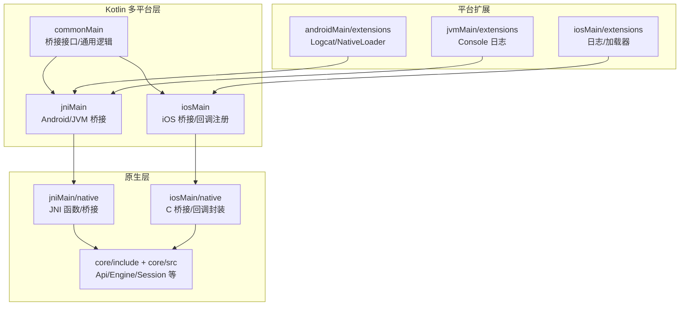
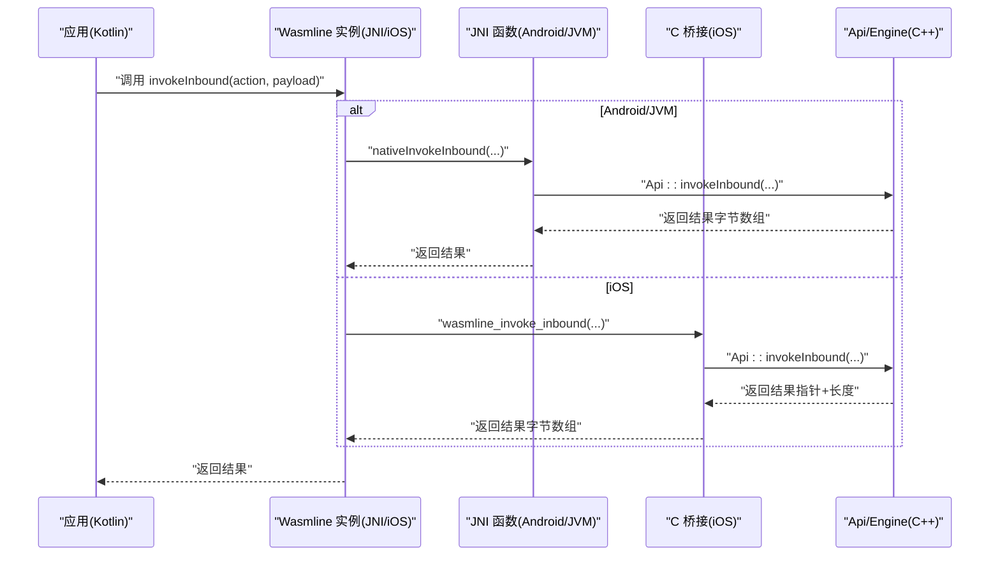
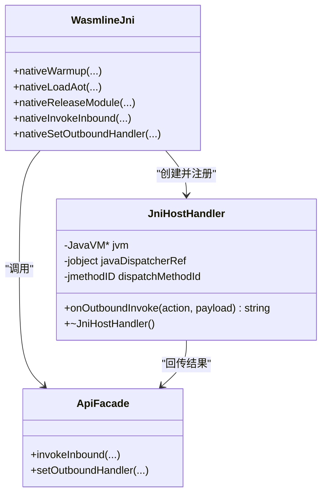
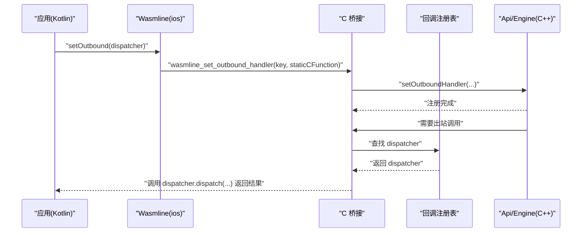
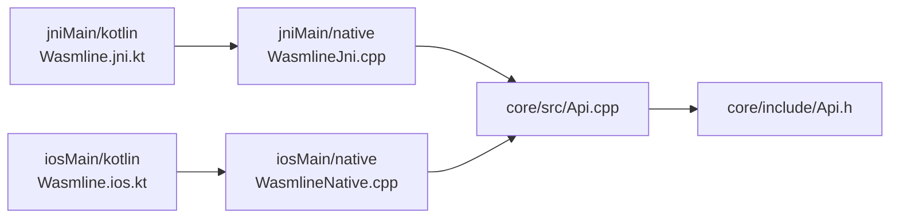

# 原生平台实现

<cite>
**本文引用的文件**
- [wasmline-multiplatform/wasmline/src/jniMain/native/JniHostHandler.h](file://wasmline-multiplatform/wasmline/src/jniMain/native/JniHostHandler.h)
- [wasmline-multiplatform/wasmline/src/jniMain/native/JniHostHandler.cpp](file://wasmline-multiplatform/wasmline/src/jniMain/native/JniHostHandler.cpp)
- [wasmline-multiplatform/wasmline/src/jniMain/native/WasmlineJni.h](file://wasmline-multiplatform/wasmline/src/jniMain/native/WasmlineJni.h)
- [wasmline-multiplatform/wasmline/src/jniMain/native/WasmlineJni.cpp](file://wasmline-multiplatform/wasmline/src/jniMain/native/WasmlineJni.cpp)
- [wasmline-multiplatform/wasmline/src/jniMain/kotlin/crow/wasmline/Wasmline.jni.kt](file://wasmline-multiplatform/wasmline/src/jniMain/kotlin/crow/wasmline/Wasmline.jni.kt)
- [wasmline-multiplatform/wasmline/src/iosMain/native/WasmlineNative.h](file://wasmline-multiplatform/wasmline/src/iosMain/native/WasmlineNative.h)
- [wasmline-multiplatform/wasmline/src/iosMain/native/WasmlineNative.cpp](file://wasmline-multiplatform/wasmline/src/iosMain/native/WasmlineNative.cpp)
- [wasmline-multiplatform/wasmline/src/iosMain/native/IosLogger.cpp](file://wasmline-multiplatform/wasmline/src/iosMain/native/IosLogger.cpp)
- [wasmline-multiplatform/wasmline/src/iosMain/native/cinterop/wasmline.def](file://wasmline-multiplatform/wasmline/src/iosMain/native/cinterop/wasmline.def)
- [wasmline-multiplatform/wasmline/src/iosMain/kotlin/crow/wasmline/Wasmline.ios.kt](file://wasmline-multiplatform/wasmline/src/iosMain/kotlin/crow/wasmline/Wasmline.ios.kt)
- [wasmline-multiplatform/wasmline/src/iosMain/kotlin/crow/wasmline/native/WasmlineBridge.kt](file://wasmline-multiplatform/wasmline/src/iosMain/kotlin/crow/wasmline/native/WasmlineBridge.kt)
- [wasmline-multiplatform/wasmline/src/commonMain/kotlin/crow/wasmline/internal/bridge/HostDispatcher.kt](file://wasmline-multiplatform/wasmline/src/commonMain/kotlin/crow/wasmline/internal/bridge/HostDispatcher.kt)
- [wasmline-multiplatform/wasmline/src/commonMain/kotlin/crow/wasmline/internal/bridge/Payload.kt](file://wasmline-multiplatform/wasmline/src/commonMain/kotlin/crow/wasmline/internal/bridge/Payload.kt)
- [wasmline-multiplatform/wasmline/src/commonMain/kotlin/crow/wasmline/internal/bridge/Endpoint.kt](file://wasmline-multiplatform/wasmline/src/commonMain/kotlin/crow/wasmline/internal/bridge/Endpoint.kt)
- [wasmline-core/include/Api.h](file://wasmline-core/include/Api.h)
- [wasmline-core/src/Api.cpp](file://wasmline-core/src/Api.cpp)
- [wasmline-multiplatform/wasmline/src/jvmMain/native/ConsoleLogger.cpp](file://wasmline-multiplatform/wasmline/src/jvmMain/native/ConsoleLogger.cpp)
- [wasmline-multiplatform/wasmline/src/androidMain/kotlin/crow/wasmline/extensions/LogcatExt.android.kt](file://wasmline-multiplatform/wasmline/src/androidMain/kotlin/crow/wasmline/extensions/LogcatExt.android.kt)
- [wasmline-multiplatform/wasmline/src/androidMain/kotlin/crow/wasmline/extensions/NativeLoaderExt.android.kt](file://wasmline-multiplatform/wasmline/src/androidMain/kotlin/crow/wasmline/extensions/NativeLoaderExt.android.kt)
- [wasmline-multiplatform/wasmline/src/jvmMain/kotlin/crow/wasmline/extensions/LogcatExt.jvm.kt](file://wasmline-multiplatform/wasmline/src/jvmMain/kotlin/crow/wasmline/extensions/LogcatExt.jvm.kt)
- [wasmline-multiplatform/wasmline/src/jvmMain/kotlin/crow/wasmline/extensions/NativeLoaderExt.jvm.kt](file://wasmline-multiplatform/wasmline/src/jvmMain/kotlin/crow/wasmline/extensions/NativeLoaderExt.jvm.kt)
- [wasmline-multiplatform/wasmline/src/iosMain/kotlin/crow/wasmline/extensions/LogcatExt.ios.kt](file://wasmline-multiplatform/wasmline/src/iosMain/kotlin/crow/wasmline/extensions/LogcatExt.ios.kt)
- [wasmline-multiplatform/wasmline/src/iosMain/kotlin/crow/wasmline/extensions/NativeLoaderExt.ios.kt](file://wasmline-multiplatform/wasmline/src/iosMain/kotlin/crow/wasmline/extensions/NativeLoaderExt.ios.kt)
</cite>

## 目录
1. [引言](#引言)
2. [项目结构](#项目结构)
3. [核心组件](#核心组件)
4. [架构总览](#架构总览)
5. [详细组件分析](#详细组件分析)
6. [依赖关系分析](#依赖关系分析)
7. [性能考虑](#性能考虑)
8. [故障排查指南](#故障排查指南)
9. [结论](#结论)
10. [附录](#附录)

## 引言
本文件面向 Wasmline 在 Android、iOS、JVM 等原生平台的实现与使用，聚焦以下目标：
- 深入解释 Android/iOS/JVM 的原生桥接与调用路径
- 详解 JNI 桥接机制（JniHostHandler 工作原理、数据类型转换、内存管理）
- 解释 iOS 平台原生实现特点与限制
- 覆盖加载器扩展、日志记录扩展、网络客户端适配
- 提供平台特定配置项、性能优化建议与常见问题解决方案
- 给出可直接定位到源码的路径，便于进一步查阅

## 项目结构
Wasmline 多平台模块在 wasmline-multiplatform/wasmline 下按源码来源分为：
- commonMain：跨平台桥接接口与通用逻辑
- jniMain：Android/JVM 平台的 JNI 实现
- iosMain：iOS 平台的 Swift/Kotlin/Native 桥接
- hostMain/webMain/jsMain/wasm*Main：其他运行时与前端适配
- androidMain：Android 原生日志等扩展
- jvmMain：JVM 平台原生日志等扩展

图表来源
- [wasmline-multiplatform/wasmline/src/jniMain/native/WasmlineJni.cpp:25-102](file://wasmline-multiplatform/wasmline/src/jniMain/native/WasmlineJni.cpp#L25-L102)
- [wasmline-multiplatform/wasmline/src/iosMain/native/WasmlineNative.cpp:34-96](file://wasmline-multiplatform/wasmline/src/iosMain/native/WasmlineNative.cpp#L34-L96)
- [wasmline-core/include/Api.h](file://wasmline-core/include/Api.h)

章节来源
- [wasmline-multiplatform/wasmline/src/jniMain/native/WasmlineJni.cpp:25-102](file://wasmline-multiplatform/wasmline/src/jniMain/native/WasmlineJni.cpp#L25-L102)
- [wasmline-multiplatform/wasmline/src/iosMain/native/WasmlineNative.h:15-62](file://wasmline-multiplatform/wasmline/src/iosMain/native/WasmlineNative.h#L15-L62)
- [wasmline-multiplatform/wasmline/src/iosMain/native/WasmlineNative.cpp:34-96](file://wasmline-multiplatform/wasmline/src/iosMain/native/WasmlineNative.cpp#L34-L96)

## 核心组件
- Kotlin 多平台桥接接口
  - HostDispatcher：统一的宿主分发器接口，用于处理 Wasm 发起的出站调用
  - Endpoint：低层动作/载荷传输端点
  - Payload：空载荷辅助工具
- 平台桥接实现
  - Android/JVM：通过 JNI 将 Kotlin 调用转发至 C++ Api
  - iOS：通过 cinterop 与 Swift/Kotlin 协作，注册 Outbound 回调
- 原生核心
  - Api/Engine/Session 等由 core 层提供，被各平台桥接函数调用

章节来源
- [wasmline-multiplatform/wasmline/src/commonMain/kotlin/crow/wasmline/internal/bridge/HostDispatcher.kt:5-6](file://wasmline-multiplatform/wasmline/src/commonMain/kotlin/crow/wasmline/internal/bridge/HostDispatcher.kt#L5-L6)
- [wasmline-multiplatform/wasmline/src/commonMain/kotlin/crow/wasmline/internal/bridge/Endpoint.kt:5-6](file://wasmline-multiplatform/wasmline/src/commonMain/kotlin/crow/wasmline/internal/bridge/Endpoint.kt#L5-L6)
- [wasmline-multiplatform/wasmline/src/commonMain/kotlin/crow/wasmline/internal/bridge/Payload.kt:7-7](file://wasmline-multiplatform/wasmline/src/commonMain/kotlin/crow/wasmline/internal/bridge/Payload.kt#L7-L7)
- [wasmline-core/include/Api.h](file://wasmline-core/include/Api.h)

## 架构总览
下图展示 Android/JVM 与 iOS 三类平台的桥接流程：Kotlin -> 平台桥接 -> 原生 C++ Api。

图表来源
- [wasmline-multiplatform/wasmline/src/jniMain/native/WasmlineJni.cpp:54-92](file://wasmline-multiplatform/wasmline/src/jniMain/native/WasmlineJni.cpp#L54-L92)
- [wasmline-multiplatform/wasmline/src/iosMain/native/WasmlineNative.cpp:61-86](file://wasmline-multiplatform/wasmline/src/iosMain/native/WasmlineNative.cpp#L61-L86)
- [wasmline-core/src/Api.cpp](file://wasmline-core/src/Api.cpp)

## 详细组件分析

### Android/JVM 平台：JNI 桥接与 JniHostHandler
- 入口与生命周期
  - Kotlin 侧通过 @JvmStatic 声明的 native 方法与原生库绑定
  - 首次使用时加载本地库并执行引擎预热/释放等操作
- 关键 JNI 函数
  - 加载/释放模块、调用入口、设置出站处理器、引擎预热/释放
- JniHostHandler 工作原理
  - 保存 JavaVM 指针与全局引用，缓存 dispatch 方法 ID
  - onOutboundInvoke 中确保线程附加、构造 jstring/jbyteArray、调用 Java 方法、回收局部引用
  - 析构时释放全局引用并按平台要求附加/分离线程
- 数据类型转换与内存管理
  - 字符串：UTF-8 -> jstring；结果数组：jbyteArray -> std::string
  - 局部引用及时删除；全局引用在析构中释放
  - 通过 GetEnv/AttachCurrentThread 防止跨线程访问异常
- 平台差异
  - Android 与桌面 JVM 的线程附加参数略有不同，已在实现中区分

图表来源
- [wasmline-multiplatform/wasmline/src/jniMain/native/JniHostHandler.h:5-16](file://wasmline-multiplatform/wasmline/src/jniMain/native/JniHostHandler.h#L5-L16)
- [wasmline-multiplatform/wasmline/src/jniMain/native/JniHostHandler.cpp:4-35](file://wasmline-multiplatform/wasmline/src/jniMain/native/JniHostHandler.cpp#L4-L35)
- [wasmline-multiplatform/wasmline/src/jniMain/native/WasmlineJni.cpp:94-101](file://wasmline-multiplatform/wasmline/src/jniMain/native/WasmlineJni.cpp#L94-L101)
- [wasmline-core/src/Api.cpp](file://wasmline-core/src/Api.cpp)

章节来源
- [wasmline-multiplatform/wasmline/src/jniMain/native/JniHostHandler.h:5-16](file://wasmline-multiplatform/wasmline/src/jniMain/native/JniHostHandler.h#L5-L16)
- [wasmline-multiplatform/wasmline/src/jniMain/native/JniHostHandler.cpp:4-79](file://wasmline-multiplatform/wasmline/src/jniMain/native/JniHostHandler.cpp#L4-L79)
- [wasmline-multiplatform/wasmline/src/jniMain/native/WasmlineJni.h:8-14](file://wasmline-multiplatform/wasmline/src/jniMain/native/WasmlineJni.h#L8-L14)
- [wasmline-multiplatform/wasmline/src/jniMain/native/WasmlineJni.cpp:27-101](file://wasmline-multiplatform/wasmline/src/jniMain/native/WasmlineJni.cpp#L27-L101)
- [wasmline-multiplatform/wasmline/src/jniMain/kotlin/crow/wasmline/Wasmline.jni.kt:9-39](file://wasmline-multiplatform/wasmline/src/jniMain/kotlin/crow/wasmline/Wasmline.jni.kt#L9-L39)

### iOS 平台：C 桥接与回调注册
- C 桥接声明
  - 提供初始化、预热、释放引擎，加载/释放模块，调用入口，设置出站回调，内存释放等 C 接口
- 回调封装
  - IosOutboundHandler 将 C 回调包装为 C++ OutboundHandler
  - Kotlin 侧通过 cinterop 生成的静态函数与 C 桥接交互
- 回调注册与调用
  - Kotlin 侧注册 WasmlineHostDispatcher，并以静态函数形式传递给 C 层
  - C 层在 onOutboundInvoke 中调用 Kotlin 回调，返回结果后释放内存
- 平台限制
  - iOS 不支持 AOT 模式（JIT 受限），预热模式强制为 PULLEY

图表来源
- [wasmline-multiplatform/wasmline/src/iosMain/native/WasmlineNative.h:57-62](file://wasmline-multiplatform/wasmline/src/iosMain/native/WasmlineNative.h#L57-L62)
- [wasmline-multiplatform/wasmline/src/iosMain/native/WasmlineNative.cpp:15-32](file://wasmline-multiplatform/wasmline/src/iosMain/native/WasmlineNative.cpp#L15-L32)
- [wasmline-multiplatform/wasmline/src/iosMain/kotlin/crow/wasmline/Wasmline.ios.kt:16-19](file://wasmline-multiplatform/wasmline/src/iosMain/kotlin/crow/wasmline/Wasmline.ios.kt#L16-L19)
- [wasmline-multiplatform/wasmline/src/iosMain/kotlin/crow/wasmline/Wasmline.ios.kt:131-149](file://wasmline-multiplatform/wasmline/src/iosMain/kotlin/crow/wasmline/Wasmline.ios.kt#L131-L149)

章节来源
- [wasmline-multiplatform/wasmline/src/iosMain/native/WasmlineNative.h:15-62](file://wasmline-multiplatform/wasmline/src/iosMain/native/WasmlineNative.h#L15-L62)
- [wasmline-multiplatform/wasmline/src/iosMain/native/WasmlineNative.cpp:34-96](file://wasmline-multiplatform/wasmline/src/iosMain/native/WasmlineNative.cpp#L34-L96)
- [wasmline-multiplatform/wasmline/src/iosMain/native/IosLogger.cpp:20-32](file://wasmline-multiplatform/wasmline/src/iosMain/native/IosLogger.cpp#L20-L32)
- [wasmline-multiplatform/wasmline/src/iosMain/native/cinterop/wasmline.def:1-2](file://wasmline-multiplatform/wasmline/src/iosMain/native/cinterop/wasmline.def#L1-L2)
- [wasmline-multiplatform/wasmline/src/iosMain/kotlin/crow/wasmline/Wasmline.ios.kt:63-113](file://wasmline-multiplatform/wasmline/src/iosMain/kotlin/crow/wasmline/Wasmline.ios.kt#L63-L113)
- [wasmline-multiplatform/wasmline/src/iosMain/kotlin/crow/wasmline/native/WasmlineBridge.kt:12-14](file://wasmline-multiplatform/wasmline/src/iosMain/kotlin/crow/wasmline/native/WasmlineBridge.kt#L12-L14)

### 日志记录扩展
- Android
  - 通过 Logcat 扩展输出日志，便于在设备上查看
- JVM
  - 通过控制台日志记录器输出
- iOS
  - 使用 os_log 输出系统日志，并同步到标准输出/错误流

章节来源
- [wasmline-multiplatform/wasmline/src/androidMain/kotlin/crow/wasmline/extensions/LogcatExt.android.kt](file://wasmline-multiplatform/wasmline/src/androidMain/kotlin/crow/wasmline/extensions/LogcatExt.android.kt)
- [wasmline-multiplatform/wasmline/src/jvmMain/native/ConsoleLogger.cpp](file://wasmline-multiplatform/wasmline/src/jvmMain/native/ConsoleLogger.cpp)
- [wasmline-multiplatform/wasmline/src/iosMain/native/IosLogger.cpp:20-32](file://wasmline-multiplatform/wasmline/src/iosMain/native/IosLogger.cpp#L20-L32)

### 加载器扩展与网络客户端适配
- 加载器扩展
  - 各平台提供 NativeLoader 扩展，负责本地资源解析、缓存目录、远程包解析等
  - Android/JVM/iOS 分别在各自 extensions 目录下提供平台化实现
- 网络客户端适配
  - 提供基于 Ktor/OkHttp 的网络客户端，配合平台阻塞式拉取实现

章节来源
- [wasmline-multiplatform/wasmline/src/androidMain/kotlin/crow/wasmline/extensions/NativeLoaderExt.android.kt](file://wasmline-multiplatform/wasmline/src/androidMain/kotlin/crow/wasmline/extensions/NativeLoaderExt.android.kt)
- [wasmline-multiplatform/wasmline/src/jvmMain/kotlin/crow/wasmline/extensions/NativeLoaderExt.jvm.kt](file://wasmline-multiplatform/wasmline/src/jvmMain/kotlin/crow/wasmline/extensions/NativeLoaderExt.jvm.kt)
- [wasmline-multiplatform/wasmline/src/iosMain/kotlin/crow/wasmline/extensions/NativeLoaderExt.ios.kt](file://wasmline-multiplatform/wasmline/src/iosMain/kotlin/crow/wasmline/extensions/NativeLoaderExt.ios.kt)

## 依赖关系分析
- 平台桥接对核心 API 的依赖
  - Android/JVM：JNI 函数直接调用 Api 命名空间下的静态方法
  - iOS：C 桥接函数调用 Api 命名空间下的静态方法
- 回调链路
  - Kotlin -> JNI/C 桥接 -> C++ OutboundHandler -> Java/Kotlin 回调
- 外部依赖
  - Android：JNI 运行时
  - iOS：cinterop 生成的 C 头文件、os_log 系统日志

图表来源
- [wasmline-multiplatform/wasmline/src/jniMain/kotlin/crow/wasmline/Wasmline.jni.kt:15-29](file://wasmline-multiplatform/wasmline/src/jniMain/kotlin/crow/wasmline/Wasmline.jni.kt#L15-L29)
- [wasmline-multiplatform/wasmline/src/iosMain/kotlin/crow/wasmline/Wasmline.ios.kt:16-19](file://wasmline-multiplatform/wasmline/src/iosMain/kotlin/crow/wasmline/Wasmline.ios.kt#L16-L19)
- [wasmline-multiplatform/wasmline/src/jniMain/native/WasmlineJni.cpp:27-101](file://wasmline-multiplatform/wasmline/src/jniMain/native/WasmlineJni.cpp#L27-L101)
- [wasmline-multiplatform/wasmline/src/iosMain/native/WasmlineNative.cpp:34-96](file://wasmline-multiplatform/wasmline/src/iosMain/native/WasmlineNative.cpp#L34-L96)
- [wasmline-core/src/Api.cpp](file://wasmline-core/src/Api.cpp)
- [wasmline-core/include/Api.h](file://wasmline-core/include/Api.h)

章节来源
- [wasmline-multiplatform/wasmline/src/jniMain/kotlin/crow/wasmline/Wasmline.jni.kt:15-29](file://wasmline-multiplatform/wasmline/src/jniMain/kotlin/crow/wasmline/Wasmline.jni.kt#L15-L29)
- [wasmline-multiplatform/wasmline/src/iosMain/kotlin/crow/wasmline/Wasmline.ios.kt:16-19](file://wasmline-multiplatform/wasmline/src/iosMain/kotlin/crow/wasmline/Wasmline.ios.kt#L16-L19)
- [wasmline-multiplatform/wasmline/src/jniMain/native/WasmlineJni.cpp:27-101](file://wasmline-multiplatform/wasmline/src/jniMain/native/WasmlineJni.cpp#L27-L101)
- [wasmline-multiplatform/wasmline/src/iosMain/native/WasmlineNative.cpp:34-96](file://wasmline-multiplatform/wasmline/src/iosMain/native/WasmlineNative.cpp#L34-L96)

## 性能考虑
- Android/JVM
  - JNI 调用开销：尽量批量调用、减少字符串与数组拷贝次数
  - 内存管理：及时释放局部引用，避免频繁分配/释放
  - 线程模型：确保在正确线程上下文调用，必要时附加/分离线程
- iOS
  - JIT/AOT 限制：iOS 不支持 AOT，预热模式强制为 PULLEY
  - 内存释放：C 层返回的指针需由调用方释放，避免泄漏
- 通用
  - 预热策略：根据场景选择合适的 Warmup 模式
  - 序列化/反序列化：尽量使用零拷贝或复用缓冲区

## 故障排查指南
- Android/JVM
  - 空指针/崩溃：检查 onOutboundInvoke 中是否正确附加线程、释放引用
  - 类型不匹配：确认 action/payload 的 UTF-8 编码与数组长度一致
  - 回收引用：确保析构中 DeleteGlobalRef，避免句柄泄漏
- iOS
  - 回调未触发：确认已注册 WasmlineCallbackRegistry，且静态回调函数签名一致
  - 内存泄漏：确保调用 wasmline_free_memory 释放 C 层返回的指针
  - 预热失败：iOS 不支持 AOT，使用 PULLEY 模式
- 日志
  - Android：通过 Logcat 查看
  - iOS：通过 os_log 或标准输出/错误流查看
  - JVM：通过控制台日志查看

章节来源
- [wasmline-multiplatform/wasmline/src/jniMain/native/JniHostHandler.cpp:15-35](file://wasmline-multiplatform/wasmline/src/jniMain/native/JniHostHandler.cpp#L15-L35)
- [wasmline-multiplatform/wasmline/src/iosMain/native/WasmlineNative.cpp:88-90](file://wasmline-multiplatform/wasmline/src/iosMain/native/WasmlineNative.cpp#L88-L90)
- [wasmline-multiplatform/wasmline/src/iosMain/native/IosLogger.cpp:20-32](file://wasmline-multiplatform/wasmline/src/iosMain/native/IosLogger.cpp#L20-L32)

## 结论
- Android/JVM 通过 JNI 将 Kotlin 调用桥接到 C++ Api，JniHostHandler 负责出站回调的线程安全与内存管理
- iOS 通过 cinterop 与 C 桥接协作，注册 Kotlin 回调并在 C++ 层统一调度
- 各平台提供加载器与日志扩展，满足本地化需求
- iOS 存在 AOT 限制，应采用 PULLEY 预热模式

## 附录
- 平台特定配置与最佳实践
  - Android：启用并发时优先使用安全加载路径；注意线程附加与引用回收
  - iOS：禁用 AOT；合理使用预热；严格释放 C 层内存
  - JVM：结合控制台日志进行调试；注意类路径与依赖打包