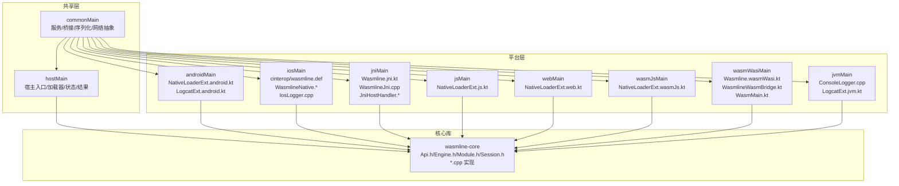
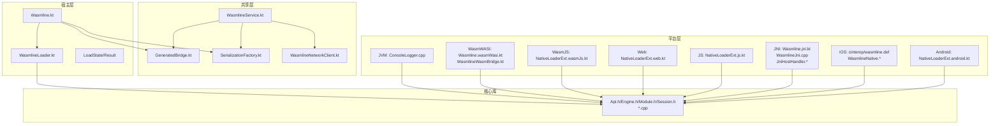
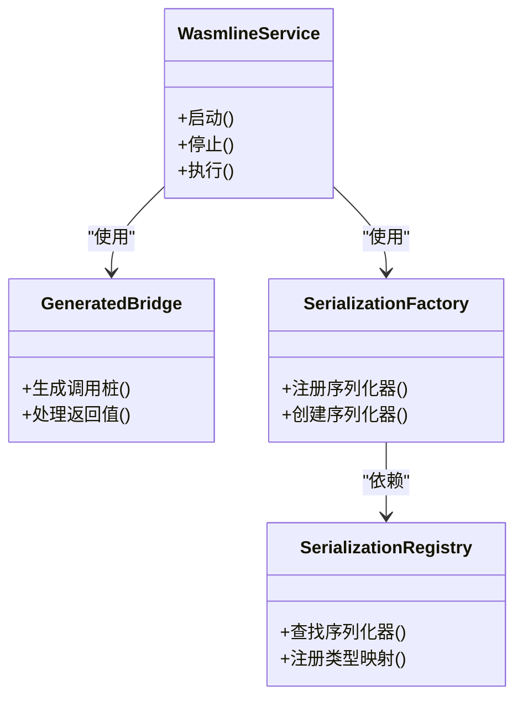
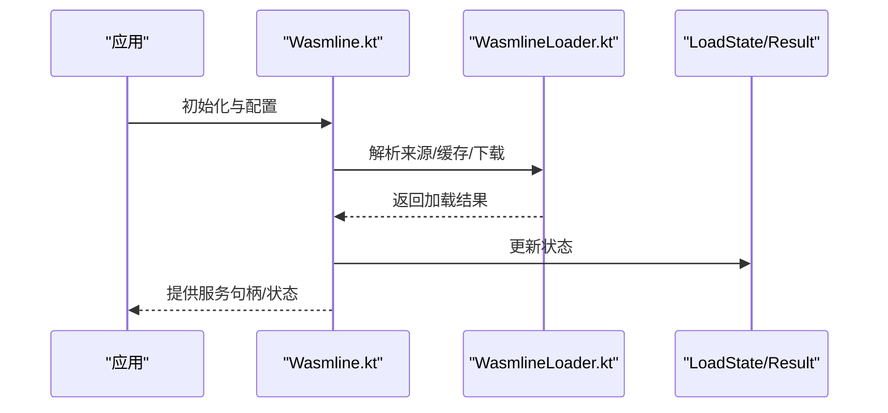
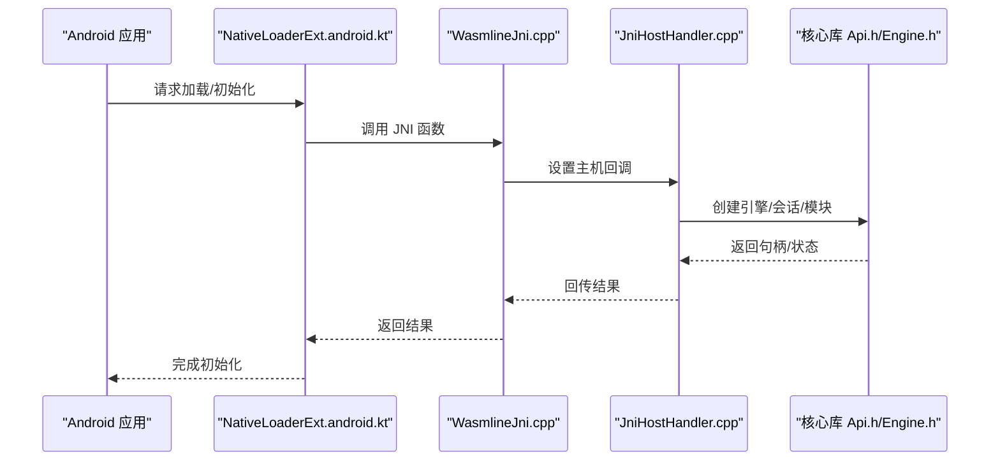
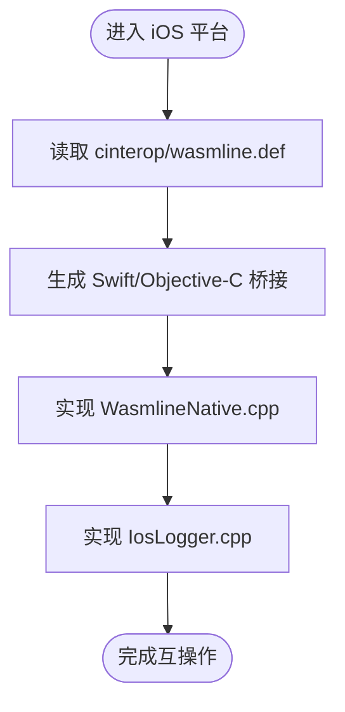
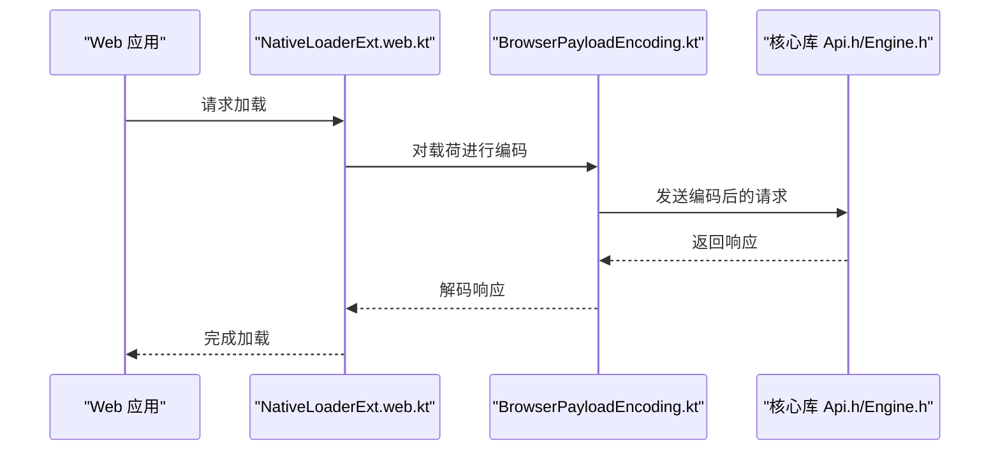
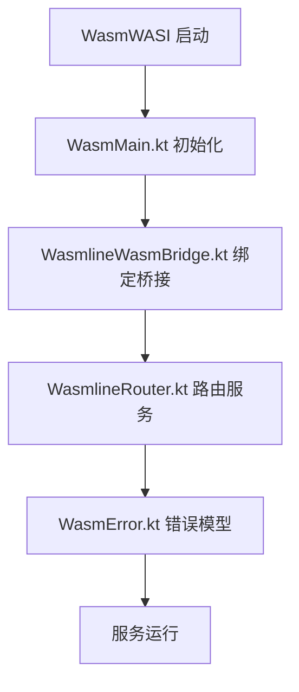
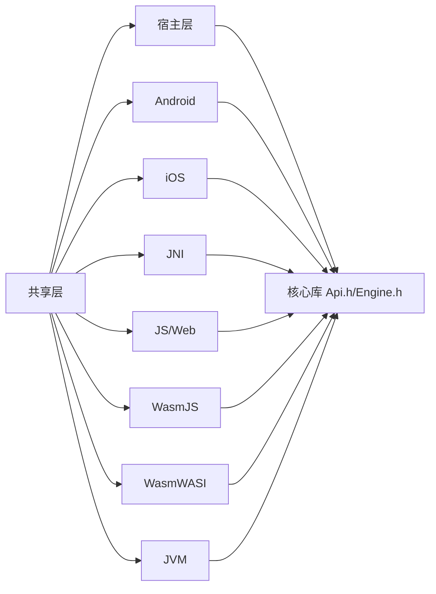

# 多平台实现

<cite>
**本文引用的文件**
- [wasmline/src/commonMain/kotlin/crow/wasmline/WasmlineService.kt](file://wasmline-multiplatform/wasmline/src/commonMain/kotlin/crow/wasmline/WasmlineService.kt)
- [wasmline/src/commonMain/kotlin/crow/wasmline/WasmlineConfig.kt](file://wasmline-multiplatform/wasmline/src/commonMain/kotlin/crow/wasmline/WasmlineConfig.kt)
- [wasmline/src/commonMain/kotlin/crow/wasmline/WasmlineNetworkClient.kt](file://wasmline-multiplatform/wasmline/src/commonMain/kotlin/crow/wasmline/WasmlineNetworkClient.kt)
- [wasmline/src/commonMain/kotlin/crow/wasmline/internal/bridge/Endpoint.kt](file://wasmline-multiplatform/wasmline/src/commonMain/kotlin/crow/wasmline/internal/bridge/Endpoint.kt)
- [wasmline/src/commonMain/kotlin/crow/wasmline/internal/bridge/GeneratedBridge.kt](file://wasmline-multiplatform/wasmline/src/commonMain/kotlin/crow/wasmline/internal/bridge/GeneratedBridge.kt)
- [wasmline/src/commonMain/kotlin/crow/wasmline/internal/bridge/GeneratedSerialization.kt](file://wasmline-multiplatform/wasmline/src/commonMain/kotlin/crow/wasmline/internal/bridge/GeneratedSerialization.kt)
- [wasmline/src/commonMain/kotlin/crow/wasmline/internal/bridge/HostDispatcher.kt](file://wasmline-multiplatform/wasmline/src/commonMain/kotlin/crow/wasmline/internal/bridge/HostDispatcher.kt)
- [wasmline/src/commonMain/kotlin/crow/wasmline/internal/bridge/Payload.kt](file://wasmline-multiplatform/wasmline/src/commonMain/kotlin/crow/wasmline/internal/bridge/Payload.kt)
- [wasmline/src/commonMain/kotlin/crow/wasmline/serialization/WasmlineSerializationConfig.kt](file://wasmline-multiplatform/wasmline/src/commonMain/kotlin/crow/wasmline/serialization/WasmlineSerializationConfig.kt)
- [wasmline/src/commonMain/kotlin/crow/wasmline/serialization/WasmlineSerializationFactory.kt](file://wasmline-multiplatform/wasmline/src/commonMain/kotlin/crow/wasmline/serialization/WasmlineSerializationFactory.kt)
- [wasmline/src/commonMain/kotlin/crow/wasmline/serialization/WasmlineSerializationRegistry.kt](file://wasmline-multiplatform/wasmline/src/commonMain/kotlin/crow/wasmline/serialization/WasmlineSerializationRegistry.kt)
- [wasmline/src/hostMain/kotlin/crow/wasmline/Wasmline.kt](file://wasmline-multiplatform/wasmline/src/hostMain/kotlin/crow/wasmline/Wasmline.kt)
- [wasmline/src/hostMain/kotlin/crow/wasmline/BrowserPayloadEncoding.kt](file://wasmline-multiplatform/wasmline/src/hostMain/kotlin/crow/wasmline/BrowserPayloadEncoding.kt)
- [wasmline/src/hostMain/kotlin/crow/wasmline/WasmlineLoader.kt](file://wasmline-multiplatform/wasmline/src/hostMain/kotlin/crow/wasmline/WasmlineLoader.kt)
- [wasmline/src/hostMain/kotlin/crow/wasmline/WasmlineLoadState.kt](file://wasmline-multiplatform/wasmline/src/hostMain/kotlin/crow/wasmline/WasmlineLoadState.kt)
- [wasmline/src/hostMain/kotlin/crow/wasmline/WasmlineLoadResult.kt](file://wasmline-multiplatform/wasmline/src/hostMain/kotlin/crow/wasmline/WasmlineLoadResult.kt)
- [wasmline/src/hostMain/kotlin/crow/wasmline/WasmlineWarmupMode.kt](file://wasmline-multiplatform/wasmline/src/hostMain/kotlin/crow/wasmline/WasmlineWarmupMode.kt)
- [wasmline/src/hostMain/kotlin/crow/wasmline/WasmlineServices.host.kt](file://wasmline-multiplatform/wasmline/src/hostMain/kotlin/crow/wasmline/WasmlineServices.host.kt)
- [wasmline/src/androidMain/kotlin/crow/wasmline/extensions/NativeLoaderExt.android.kt](file://wasmline-multiplatform/wasmline/src/androidMain/kotlin/crow/wasmline/extensions/NativeLoaderExt.android.kt)
- [wasmline/src/androidMain/kotlin/crow/wasmline/extensions/LogcatExt.android.kt](file://wasmline-multiplatform/wasmline/src/androidMain/kotlin/crow/wasmline/extensions/LogcatExt.android.kt)
- [wasmline/src/jniMain/kotlin/crow/wasmline/Wasmline.jni.kt](file://wasmline-multiplatform/wasmline/src/jniMain/kotlin/crow/wasmline/Wasmline.jni.kt)
- [wasmline/src/jniMain/native/WasmlineJni.cpp](file://wasmline-multiplatform/wasmline/src/jniMain/native/WasmlineJni.cpp)
- [wasmline/src/jniMain/native/JniHostHandler.cpp](file://wasmline-multiplatform/wasmline/src/jniMain/native/JniHostHandler.cpp)
- [wasmline/src/jniMain/native/JniHostHandler.h](file://wasmline-multiplatform/wasmline/src/jniMain/native/JniHostHandler.h)
- [wasmline/src/iosMain/native/WasmlineNative.cpp](file://wasmline-multiplatform/wasmline/src/iosMain/native/WasmlineNative.cpp)
- [wasmline/src/iosMain/native/WasmlineNative.h](file://wasmline-multiplatform/wasmline/src/iosMain/native/WasmlineNative.h)
- [wasmline/src/iosMain/native/IosLogger.cpp](file://wasmline-multiplatform/wasmline/src/iosMain/native/IosLogger.cpp)
- [wasmline/src/iosMain/native/cinterop/wasmline.def](file://wasmline-multiplatform/wasmline/src/iosMain/native/cinterop/wasmline.def)
- [wasmline/src/jsMain/kotlin/crow/wasmline/extensions/NativeLoaderExt.js.kt](file://wasmline-multiplatform/wasmline/src/jsMain/kotlin/crow/wasmline/extensions/NativeLoaderExt.js.kt)
- [wasmline/src/webMain/kotlin/crow/wasmline/extensions/NativeLoaderExt.web.kt](file://wasmline-multiplatform/wasmline/src/webMain/kotlin/crow/wasmline/extensions/NativeLoaderExt.web.kt)
- [wasmline/src/wasmJsMain/kotlin/crow/wasmline/extensions/NativeLoaderExt.wasmJs.kt](file://wasmline-multiplatform/wasmline/src/wasmJsMain/kotlin/crow/wasmline/extensions/NativeLoaderExt.wasmJs.kt)
- [wasmline/src/wasmWasiMain/kotlin/crow/wasmline/Wasmline.wasmWasi.kt](file://wasmline-multiplatform/wasmline/src/wasmWasiMain/kotlin/crow/wasmline/Wasmline.wasmWasi.kt)
- [wasmline/src/wasmWasiMain/kotlin/crow/wasmline/WasmlineWasmBridge.kt](file://wasmline-multiplatform/wasmline/src/wasmWasiMain/kotlin/crow/wasmline/WasmlineWasmBridge.kt)
- [wasmline/src/wasmWasiMain/kotlin/crow/wasmline/WasmlineRouter.kt](file://wasmline-multiplatform/wasmline/src/wasmWasiMain/kotlin/crow/wasmline/WasmlineRouter.kt)
- [wasmline/src/wasmWasiMain/kotlin/crow/wasmline/model/WasmError.kt](file://wasmline-multiplatform/wasmline/src/wasmWasiMain/kotlin/crow/wasmline/model/WasmError.kt)
- [wasmline/src/wasmWasiMain/kotlin/crow/wasmline/WasmMain.kt](file://wasmline-multiplatform/wasmline/src/wasmWasiMain/kotlin/crow/wasmline/WasmMain.kt)
- [wasmline/src/jvmMain/native/ConsoleLogger.cpp](file://wasmline-multiplatform/wasmline/src/jvmMain/native/ConsoleLogger.cpp)
- [wasmline/src/jvmMain/kotlin/crow/wasmline/extensions/LogcatExt.jvm.kt](file://wasmline-multiplatform/wasmline/src/jvmMain/kotlin/crow/wasmline/extensions/LogcatExt.jvm.kt)
- [wasmline/src/jvmMain/kotlin/crow/wasmline/extensions/NativeLoaderExt.jvm.kt](file://wasmline-multiplatform/wasmline/src/jvmMain/kotlin/crow/wasmline/extensions/NativeLoaderExt.jvm.kt)
- [wasmline/src/wasmline-android/src/androidMain/native/AndroidLogger.cpp](file://wasmline-multiplatform/wasmline-android/src/androidMain/native/AndroidLogger.cpp)
- [wasmline/src/wasmline-android/src/androidMain/CMakeLists.txt](file://wasmline-multiplatform/wasmline-android/src/androidMain/CMakeLists.txt)
- [wasmline/src/wasmline/src/main/kotlin/crow/wasmline/cli/Main.kt](file://wasmline-multiplatform/wasmline-cli/src/main/kotlin/crow/wasmline/cli/Main.kt)
- [wasmline/src/wasmline/src/main/kotlin/crow/wasmline/cli/Build.kt](file://wasmline-multiplatform/wasmline-cli/src/main/kotlin/crow/wasmline/cli/Build.kt)
- [wasmline/src/wasmline/src/main/kotlin/crow/wasmline/cli/Compile.kt](file://wasmline-multiplatform/wasmline-cli/src/main/kotlin/crow/wasmline/cli/Compile.kt)
- [wasmline/src/wasmline/src/main/kotlin/crow/wasmline/cli/Download.kt](file://wasmline-multiplatform/wasmline-cli/src/main/kotlin/crow/wasmline/cli/Download.kt)
- [wasmline/src/wasmline/src/main/kotlin/crow/wasmline/cli/GenerateKeyPair.kt](file://wasmline-multiplatform/wasmline-cli/src/main/kotlin/crow/wasmline/cli/GenerateKeyPair.kt)
- [wasmline/src/wasmline/src/main/kotlin/crow/wasmline/cli/Manifest.kt](file://wasmline-multiplatform/wasmline-cli/src/main/kotlin/crow/wasmline/cli/Manifest.kt)
- [wasmline/src/wasmline/src/main/kotlin/crow/wasmline/cli/extensions/JsonExt.kt](file://wasmline-multiplatform/wasmline-cli/src/main/kotlin/crow/wasmline/cli/extensions/JsonExt.kt)
- [wasmline/src/wasmline/src/main/kotlin/crow/wasmline/cli/models/CompileResult.kt](file://wasmline-multiplatform/wasmline-cli/src/main/kotlin/crow/wasmline/cli/models/CompileResult.kt)
- [wasmline/src/wasmline/src/main/kotlin/crow/wasmline/cli/Build.kt](file://wasmline-multiplatform/wasmline-cli/src/main/kotlin/crow/wasmline/cli/Build.kt)
- [wasmline/src/wasmline/src/main/kotlin/crow/wasmline/cli/Compile.kt](file://wasmline-multiplatform/wasmline-cli/src/main/kotlin/crow/wasmline/cli/Compile.kt)
- [wasmline/src/wasmline/src/main/kotlin/crow/wasmline/cli/Download.kt](file://wasmline-multiplatform/wasmline-cli/src/main/kotlin/crow/wasmline/cli/Download.kt)
- [wasmline/src/wasmline/src/main/kotlin/crow/wasmline/cli/GenerateKeyPair.kt](file://wasmline-multiplatform/wasmline-cli/src/main/kotlin/crow/wasmline/cli/GenerateKeyPair.kt)
- [wasmline/src/wasmline/src/main/kotlin/crow/wasmline/cli/Manifest.kt](file://wasmline-multiplatform/wasmline-cli/src/main/kotlin/crow/wasmline/cli/Manifest.kt)
- [wasmline/src/wasmline/src/main/kotlin/crow/wasmline/cli/extensions/JsonExt.kt](file://wasmline-multiplatform/wasmline-cli/src/main/kotlin/crow/wasmline/cli/extensions/JsonExt.kt)
- [wasmline/src/wasmline/src/main/kotlin/crow/wasmline/cli/models/CompileResult.kt](file://wasmline-multiplatform/wasmline-cli/src/main/kotlin/crow/wasmline/cli/models/CompileResult.kt)
- [wasmline/src/wasmline/src/main/kotlin/crow/wasmline/cli/Build.kt](file://wasmline-multiplatform/wasmline-cli/src/main/kotlin/crow/wasmline/cli/Build.kt)
- [wasmline/src/wasmline/src/main/kotlin/crow/wasmline/cli/Compile.kt](file://wasmline-multiplatform/wasmline-cli/src/main/kotlin/crow/wasmline/cli/Compile.kt)
- [wasmline/src/wasmline/src/main/kotlin/crow/wasmline/cli/Download.kt](file://wasmline-multiplatform/wasmline-cli/src/main/kotlin/crow/wasmline/cli/Download.kt)
- [wasmline/src/wasmline/src/main/kotlin/crow/wasmline/cli/GenerateKeyPair.kt](file://wasmline-multiplatform/wasmline-cli/src/main/kotlin/crow/wasmline/cli/GenerateKeyPair.kt)
- [wasmline/src/wasmline/src/main/kotlin/crow/wasmline/cli/Manifest.kt](file://wasmline-multiplatform/wasmline-cli/src/main/kotlin/crow/wasmline/cli/Manifest.kt)
- [wasmline/src/wasmline/src/main/kotlin/crow/wasmline/cli/extensions/JsonExt.kt](file://wasmline-multiplatform/wasmline-cli/src/main/kotlin/crow/wasmline/cli/extensions/JsonExt.kt)
- [wasmline/src/wasmline/src/main/kotlin/crow/wasmline/cli/models/CompileResult.kt](file://wasmline-multiplatform/wasmline-cli/src/main/kotlin/crow/wasmline/cli/models/CompileResult.kt)
- [wasmline/src/wasmline/src/main/kotlin/crow/wasmline/cli/Build.kt](file://wasmline-multiplatform/wasmline-cli/src/main/kotlin/crow/wasmline/cli/Build.kt)
- [wasmline/src/wasmline/src/main/kotlin/crow/wasmline/cli/Compile.kt](file://wasmline-multiplatform/wasmline-cli/src/main/kotlin/crow/wasmline/cli/Compile.kt)
- [wasmline/src/wasmline/src/main/kotlin/crow/wasmline/cli/Download.kt](file://wasmline-multiplatform/wasmline-cli/src/main/kotlin/crow/wasmline/cli/Download.kt)
- [wasmline/src/wasmline/src/main/kotlin/crow/wasmline/cli/GenerateKeyPair.kt](file://wasmline-multiplatform/wasmline-cli/src/main/kotlin/crow/wasmline/cli/GenerateKeyPair.kt)
- [wasmline/src/wasmline/src/main/kotlin/crow/wasmline/cli/Manifest.kt](file://wasmline-multiplatform/wasmline-cli/src/main/kotlin/crow/wasmline/cli/Manifest.kt)
- [wasmline/src/wasmline/src/main/kotlin/crow/wasmline/cli/extensions/JsonExt.kt](file://wasmline-multiplatform/wasmline-cli/src/main/kotlin/crow/wasmline/cli/extensions/JsonExt.kt)
- [wasmline/src/wasmline/src/main/kotlin/crow/wasmline/cli/models/CompileResult.kt](file://wasmline-multiplatform/wasmline-cli/src/main/kotlin/crow/wasmline/cli/models/CompileResult.kt)
- [wasmline/src/wasmline/src/main/kotlin/crow/wasmline/cli/Build.kt](file://wasmline-multiplatform/wasmline-cli/src/main/kotlin/crow/wasmline/cli/Build.kt)
- [wasmline/src/wasmline/src/main/kotlin/crow/wasmline/cli/Compile.kt](file://wasmline-multiplatform/wasmline-cli/src/main/kotlin/crow/wasmline/cli/Compile.kt)
- [wasmline/src/wasmline/src/main/kotlin/crow/wasmline/cli/Download.kt](file://wasmline-multiplatform/wasmline-cli/src/main/kotlin/crow/wasmline/cli/Download.kt)
- [wasmline/src/wasmline/src/main/kotlin/crow/wasmline/cli/GenerateKeyPair.kt](file://wasmline-multiplatform/wasmline-cli/src/main/kotlin/crow/wasmline/cli/GenerateKeyPair.kt)
- [wasmline/src/wasmline/src/main/kotlin/crow/wasmline/cli/Manifest.kt](file://wasmline-multiplatform/wasmline-cli/src/main/kotlin/crow/wasmline/cli/Manifest.kt)
- [wasmline/src/wasmline/src/main/kotlin/crow/wasmline/cli/extensions/JsonExt.kt](file://wasmline-multiplatform/wasmline-cli/src/main/kotlin/crow/wasmline/cli/extensions/JsonExt.kt)
- [wasmline/src/wasmline/src/main/kotlin/crow/wasmline/cli/models/CompileResult.kt](file://wasmline-multiplatform/wasmline-cli/src/main/kotlin/crow/wasmline/cli/models/CompileResult.kt)
- [wasmline/src/wasmline/src/main/kotlin/crow/wasmline/cli/Build.kt](file://wasmline-multiplatform/wasmline-cli/src/main/kotlin/crow/wasmline/cli/Build.kt)
- [wasmline/src/wasmline/src/main/kotlin/crow/wasmline/cli/Compile.kt](file://wasmline-multiplatform/wasmline-cli/src/main/kotlin/crow/wasmline/cli/Compile.kt)
- [wasmline/src/wasmline/src/main/kotlin/crow/wasmline/cli/Download.kt](file://wasmline-multiplatform/wasmline-cli/src/main/kotlin/crow/wasmline/cli/Download.kt)
- [wasmline/src/wasmline/src/main/kotlin/crow/wasmline/cli/GenerateKeyPair.kt](file://wasmline-multiplatform/wasmline-cli/src/main/kotlin/crow/wasmline/cli/GenerateKeyPair.kt)
- [wasmline/src/wasmline/src/main/kotlin/crow/wasmline/cli/Manifest.kt](file://wasmline-multiplatform/wasmline-cli/src/main/kotlin/crow/wasmline/cli/Manifest.kt)
- [wasmline/src/wasmline/src/main/kotlin/crow/wasmline/cli/extensions/JsonExt.kt](file://wasmline-multiplatform/wasmline-cli/src/main/kotlin/crow/wasmline/cli/extensions/JsonExt.kt)
- [wasmline/src/wasmline/src/main/kotlin/crow/wasmline/cli/models/CompileResult.kt](file://wasmline-multiplatform/wasmline-cli/src/main/kotlin/crow/wasmline/cli/models/CompileResult.kt)
- [wasmline/src/was......]
</cite>

## 目录
1. [引言](#引言)
2. [项目结构](#项目结构)
3. [核心组件](#核心组件)
4. [架构总览](#架构总览)
5. [详细组件分析](#详细组件分析)
6. [依赖关系分析](#依赖关系分析)
7. [性能考量](#性能考量)
8. [故障排除指南](#故障排除指南)
9. [结论](#结论)
10. [附录](#附录)

## 引言
本文件面向多平台开发者，系统性阐述 Wasmline 在 Kotlin 多平台上的实现策略与平台适配方案。内容覆盖共享代码与平台特定实现的设计模式、Android/iOS 的 JNI 桥接、iOS 的 C 互操作、Web 目标的内联 JavaScript 运行时，以及平台特定的加载器、网络客户端与序列化实现。文档同时给出 C 互操作的函数声明、数据类型映射与内存管理要点，并提供配置指南、最佳实践、API 差异影响与解决方案，以及实用的开发指导与故障排除建议。

## 项目结构
Wasmline 多平台模块以 Kotlin Multiplatform 为核心，按“共享代码 + 平台特定实现”的方式组织。核心模块 wasmline-multiplatform 下包含：
- 共享层（commonMain）：服务接口、桥接生成、序列化配置与工厂、网络客户端抽象等
- 主机层（hostMain）：宿主侧入口、加载器、浏览器载荷编码、加载状态与结果等
- 平台层（androidMain、iosMain、jniMain、jsMain、webMain、wasmJsMain、wasmWasiMain、jvmMain 等）：平台特定扩展、JNI/C 互操作、日志与本地加载器、网络阻塞适配等
- 核心库 wasmline-core：C++ 实现的引擎、会话、模块与 API 接口头文件与实现
- CLI 与构建插件：命令行工具、Gradle 插件与 Kotlin 编译期插件

**图表来源**
- [wasmline/src/commonMain/kotlin/crow/wasmline/WasmlineService.kt](file://wasmline-multiplatform/wasmline/src/commonMain/kotlin/crow/wasmline/WasmlineService.kt)
- [wasmline/src/hostMain/kotlin/crow/wasmline/WasmlineLoader.kt](file://wasmline-multiplatform/wasmline/src/hostMain/kotlin/crow/wasmline/WasmlineLoader.kt)
- [wasmline/src/androidMain/kotlin/crow/wasmline/extensions/NativeLoaderExt.android.kt](file://wasmline-multiplatform/wasmline/src/androidMain/kotlin/crow/wasmline/extensions/NativeLoaderExt.android.kt)
- [wasmline/src/iosMain/native/WasmlineNative.cpp](file://wasmline-multiplatform/wasmline/src/iosMain/native/WasmlineNative.cpp)
- [wasmline/src/jniMain/native/WasmlineJni.cpp](file://wasmline-multiplatform/wasmline/src/jniMain/native/WasmlineJni.cpp)
- [wasmline/src/jsMain/kotlin/crow/wasmline/extensions/NativeLoaderExt.js.kt](file://wasmline-multiplatform/wasmline/src/jsMain/kotlin/crow/wasmline/extensions/NativeLoaderExt.js.kt)
- [wasmline/src/webMain/kotlin/crow/wasmline/extensions/NativeLoaderExt.web.kt](file://wasmline-multiplatform/wasmline/src/webMain/kotlin/crow/wasmline/extensions/NativeLoaderExt.web.kt)
- [wasmline/src/wasmJsMain/kotlin/crow/wasmline/extensions/NativeLoaderExt.wasmJs.kt](file://wasmline-multiplatform/wasmline/src/wasmJsMain/kotlin/crow/wasmline/extensions/NativeLoaderExt.wasmJs.kt)
- [wasmline/src/wasmWasiMain/kotlin/crow/wasmline/Wasmline.wasmWasi.kt](file://wasmline-multiplatform/wasmline/src/wasmWasiMain/kotlin/crow/wasmline/Wasmline.wasmWasi.kt)
- [wasmline/src/jvmMain/native/ConsoleLogger.cpp](file://wasmline-multiplatform/wasmline/src/jvmMain/native/ConsoleLogger.cpp)
- [wasmline-core/include/Api.h](file://wasmline-core/include/Api.h)

**章节来源**
- [wasmline/src/commonMain/kotlin/crow/wasmline/WasmlineService.kt](file://wasmline-multiplatform/wasmline/src/commonMain/kotlin/crow/wasmline/WasmlineService.kt)
- [wasmline/src/hostMain/kotlin/crow/wasmline/WasmlineLoader.kt](file://wasmline-multiplatform/wasmline/src/hostMain/kotlin/crow/wasmline/WasmlineLoader.kt)

## 核心组件
- 服务与配置
  - 服务定义与运行时：共享层定义服务契约与运行时行为，平台侧通过桥接与序列化实现绑定。
  - 配置对象：集中管理加载参数、网络与序列化策略。
- 桥接与序列化
  - 生成桥接：在编译期生成跨语言调用所需的桥接代码，确保类型安全与性能。
  - 序列化配置与工厂：统一序列化注册表与工厂，支持不同平台的数据交换。
- 宿主入口与加载器
  - 宿主入口负责初始化、加载状态与结果封装。
  - 加载器负责解析来源、缓存与下载，平台侧提供本地访问与加密算法实现。

**章节来源**
- [wasmline/src/commonMain/kotlin/crow/wasmline/WasmlineService.kt](file://wasmline-multiplatform/wasmline/src/commonMain/kotlin/crow/wasmline/WasmlineService.kt)
- [wasmline/src/commonMain/kotlin/crow/wasmline/WasmlineConfig.kt](file://wasmline-multiplatform/wasmline/src/commonMain/kotlin/crow/wasmline/WasmlineConfig.kt)
- [wasmline/src/commonMain/kotlin/crow/wasmline/internal/bridge/GeneratedBridge.kt](file://wasmline-multiplatform/wasmline/src/commonMain/kotlin/crow/wasmline/internal/bridge/GeneratedBridge.kt)
- [wasmline/src/commonMain/kotlin/crow/wasmline/serialization/WasmlineSerializationFactory.kt](file://wasmline-multiplatform/wasmline/src/commonMain/kotlin/crow/wasmline/serialization/WasmlineSerializationFactory.kt)
- [wasmline/src/hostMain/kotlin/crow/wasmline/WasmlineLoader.kt](file://wasmline-multiplatform/wasmline/src/hostMain/kotlin/crow/wasmline/WasmlineLoader.kt)

## 架构总览
Wasmline 的多平台架构围绕“共享契约 + 平台桥接”展开。共享层提供服务接口、序列化与网络抽象；平台层通过 JNI、C 互操作、JS 内联等方式与核心库交互；宿主层负责加载与运行时控制。

**图表来源**
- [wasmline/src/commonMain/kotlin/crow/wasmline/WasmlineService.kt](file://wasmline-multiplatform/wasmline/src/commonMain/kotlin/crow/wasmline/WasmlineService.kt)
- [wasmline/src/commonMain/kotlin/crow/wasmline/internal/bridge/GeneratedBridge.kt](file://wasmline-multiplatform/wasmline/src/commonMain/kotlin/crow/wasmline/internal/bridge/GeneratedBridge.kt)
- [wasmline/src/commonMain/kotlin/crow/wasmline/serialization/WasmlineSerializationFactory.kt](file://wasmline-multiplatform/wasmline/src/commonMain/kotlin/crow/wasmline/serialization/WasmlineSerializationFactory.kt)
- [wasmline/src/hostMain/kotlin/crow/wasmline/Wasmline.kt](file://wasmline-multiplatform/wasmline/src/hostMain/kotlin/crow/wasmline/Wasmline.kt)
- [wasmline/src/hostMain/kotlin/crow/wasmline/WasmlineLoader.kt](file://wasmline-multiplatform/wasmline/src/hostMain/kotlin/crow/wasmline/WasmlineLoader.kt)
- [wasmline/src/androidMain/kotlin/crow/wasmline/extensions/NativeLoaderExt.android.kt](file://wasmline-multiplatform/wasmline/src/androidMain/kotlin/crow/wasmline/extensions/NativeLoaderExt.android.kt)
- [wasmline/src/iosMain/native/WasmlineNative.cpp](file://wasmline-multiplatform/wasmline/src/iosMain/native/WasmlineNative.cpp)
- [wasmline/src/jniMain/native/WasmlineJni.cpp](file://wasmline-multiplatform/wasmline/src/jniMain/native/WasmlineJni.cpp)
- [wasmline/src/jsMain/kotlin/crow/wasmline/extensions/NativeLoaderExt.js.kt](file://wasmline-multiplatform/wasmline/src/jsMain/kotlin/crow/wasmline/extensions/NativeLoaderExt.js.kt)
- [wasmline/src/webMain/kotlin/crow/wasmline/extensions/NativeLoaderExt.web.kt](file://wasmline-multiplatform/wasmline/src/webMain/kotlin/crow/wasmline/extensions/NativeLoaderExt.web.kt)
- [wasmline/src/wasmJsMain/kotlin/crow/wasmline/extensions/NativeLoaderExt.wasmJs.kt](file://wasmline-multiplatform/wasmline/src/wasmJsMain/kotlin/crow/wasmline/extensions/NativeLoaderExt.wasmJs.kt)
- [wasmline/src/wasmWasiMain/kotlin/crow/wasmline/Wasmline.wasmWasi.kt](file://wasmline-multiplatform/wasmline/src/wasmWasiMain/kotlin/crow/wasmline/Wasmline.wasmWasi.kt)
- [wasmline/src/jvmMain/native/ConsoleLogger.cpp](file://wasmline-multiplatform/wasmline/src/jvmMain/native/ConsoleLogger.cpp)
- [wasmline-core/include/Api.h](file://wasmline-core/include/Api.h)

## 详细组件分析

### 共享层：服务、桥接与序列化
- 服务定义与运行时：共享层定义服务契约与运行时行为，平台侧通过桥接与序列化实现绑定。
- 生成桥接：在编译期生成跨语言调用所需的桥接代码，确保类型安全与性能。
- 序列化配置与工厂：统一序列化注册表与工厂，支持不同平台的数据交换。

**图表来源**
- [wasmline/src/commonMain/kotlin/crow/wasmline/WasmlineService.kt](file://wasmline-multiplatform/wasmline/src/commonMain/kotlin/crow/wasmline/WasmlineService.kt)
- [wasmline/src/commonMain/kotlin/crow/wasmline/internal/bridge/GeneratedBridge.kt](file://wasmline-multiplatform/wasmline/src/commonMain/kotlin/crow/wasmline/internal/bridge/GeneratedBridge.kt)
- [wasmline/src/commonMain/kotlin/crow/wasmline/serialization/WasmlineSerializationFactory.kt](file://wasmline-multiplatform/wasmline/src/commonMain/kotlin/crow/wasmline/serialization/WasmlineSerializationFactory.kt)
- [wasmline/src/commonMain/kotlin/crow/wasmline/serialization/WasmlineSerializationRegistry.kt](file://wasmline-multiplatform/wasmline/src/commonMain/kotlin/crow/wasmline/serialization/WasmlineSerializationRegistry.kt)

**章节来源**
- [wasmline/src/commonMain/kotlin/crow/wasmline/WasmlineService.kt](file://wasmline-multiplatform/wasmline/src/commonMain/kotlin/crow/wasmline/WasmlineService.kt)
- [wasmline/src/commonMain/kotlin/crow/wasmline/internal/bridge/GeneratedBridge.kt](file://wasmline-multiplatform/wasmline/src/commonMain/kotlin/crow/wasmline/internal/bridge/GeneratedBridge.kt)
- [wasmline/src/commonMain/kotlin/crow/wasmline/serialization/WasmlineSerializationFactory.kt](file://wasmline-multiplatform/wasmline/src/commonMain/kotlin/crow/wasmline/serialization/WasmlineSerializationFactory.kt)
- [wasmline/src/commonMain/kotlin/crow/wasmline/serialization/WasmlineSerializationRegistry.kt](file://wasmline-multiplatform/wasmline/src/commonMain/kotlin/crow/wasmline/serialization/WasmlineSerializationRegistry.kt)

### 宿主层：入口、加载器与状态
- 宿主入口：负责初始化、加载状态与结果封装。
- 加载器：负责解析来源、缓存与下载，平台侧提供本地访问与加密算法实现。

**图表来源**
- [wasmline/src/hostMain/kotlin/crow/wasmline/Wasmline.kt](file://wasmline-multiplatform/wasmline/src/hostMain/kotlin/crow/wasmline/Wasmline.kt)
- [wasmline/src/hostMain/kotlin/crow/wasmline/WasmlineLoader.kt](file://wasmline-multiplatform/wasmline/src/hostMain/kotlin/crow/wasmline/WasmlineLoader.kt)
- [wasmline/src/hostMain/kotlin/crow/wasmline/WasmlineLoadState.kt](file://wasmline-multiplatform/wasmline/src/hostMain/kotlin/crow/wasmline/WasmlineLoadState.kt)
- [wasmline/src/hostMain/kotlin/crow/wasmline/WasmlineLoadResult.kt](file://wasmline-multiplatform/wasmline/src/hostMain/kotlin/crow/wasmline/WasmlineLoadResult.kt)

**章节来源**
- [wasmline/src/hostMain/kotlin/crow/wasmline/Wasmline.kt](file://wasmline-multiplatform/wasmline/src/hostMain/kotlin/crow/wasmline/Wasmline.kt)
- [wasmline/src/hostMain/kotlin/crow/wasmline/WasmlineLoader.kt](file://wasmline-multiplatform/wasmline/src/hostMain/kotlin/crow/wasmline/WasmlineLoader.kt)
- [wasmline/src/hostMain/kotlin/crow/wasmline/WasmlineLoadState.kt](file://wasmline-multiplatform/wasmline/src/hostMain/kotlin/crow/wasmline/WasmlineLoadState.kt)
- [wasmline/src/hostMain/kotlin/crow/wasmline/WasmlineLoadResult.kt](file://wasmline-multiplatform/wasmline/src/hostMain/kotlin/crow/wasmline/WasmlineLoadResult.kt)

### 平台层：Android/iOS 的 JNI 桥接
- Android 扩展：提供原生加载器与日志扩展，对接底层 C++ 实现。
- JNI 层：Kotlin 与 C++ 的桥接，包含主机回调处理与 JNI 函数声明。

**图表来源**
- [wasmline/src/androidMain/kotlin/crow/wasmline/extensions/NativeLoaderExt.android.kt](file://wasmline-multiplatform/wasmline/src/androidMain/kotlin/crow/wasmline/extensions/NativeLoaderExt.android.kt)
- [wasmline/src/jniMain/native/WasmlineJni.cpp](file://wasmline-multiplatform/wasmline/src/jniMain/native/WasmlineJni.cpp)
- [wasmline/src/jniMain/native/JniHostHandler.cpp](file://wasmline-multiplatform/wasmline/src/jniMain/native/JniHostHandler.cpp)
- [wasmline-core/include/Api.h](file://wasmline-core/include/Api.h)

**章节来源**
- [wasmline/src/androidMain/kotlin/crow/wasmline/extensions/NativeLoaderExt.android.kt](file://wasmline-multiplatform/wasmline/src/androidMain/kotlin/crow/wasmline/extensions/NativeLoaderExt.android.kt)
- [wasmline/src/jniMain/native/WasmlineJni.cpp](file://wasmline-multiplatform/wasmline/src/jniMain/native/WasmlineJni.cpp)
- [wasmline/src/jniMain/native/JniHostHandler.cpp](file://wasmline-multiplatform/wasmline/src/jniMain/native/JniHostHandler.cpp)
- [wasmline/src/jniMain/native/JniHostHandler.h](file://wasmline-multiplatform/wasmline/src/jniMain/native/JniHostHandler.h)

### 平台层：iOS 的 C 互操作
- C 互操作定义：通过 .def 文件声明 Objective-C/Swift 与 C++ 的互操作接口。
- iOS 原生实现：C++ 桥接与日志实现，配合 Swift/Kotlin 侧调用。

**图表来源**
- [wasmline/src/iosMain/native/cinterop/wasmline.def](file://wasmline-multiplatform/wasmline/src/iosMain/native/cinterop/wasmline.def)
- [wasmline/src/iosMain/native/WasmlineNative.cpp](file://wasmline-multiplatform/wasmline/src/iosMain/native/WasmlineNative.cpp)
- [wasmline/src/iosMain/native/IosLogger.cpp](file://wasmline-multiplatform/wasmline/src/iosMain/native/IosLogger.cpp)

**章节来源**
- [wasmline/src/iosMain/native/cinterop/wasmline.def](file://wasmline-multiplatform/wasmline/src/iosMain/native/cinterop/wasmline.def)
- [wasmline/src/iosMain/native/WasmlineNative.cpp](file://wasmline-multiplatform/wasmline/src/iosMain/native/WasmlineNative.cpp)
- [wasmline/src/iosMain/native/IosLogger.cpp](file://wasmline-multiplatform/wasmline/src/iosMain/native/IosLogger.cpp)

### 平台层：Web 目标与内联 JavaScript 运行时
- JS/Web 平台扩展：提供原生加载器扩展，适配浏览器环境。
- 浏览器载荷编码：在宿主侧对载荷进行编码以适配浏览器传输。

**图表来源**
- [wasmline/src/webMain/kotlin/crow/wasmline/extensions/NativeLoaderExt.web.kt](file://wasmline-multiplatform/wasmline/src/webMain/kotlin/crow/wasmline/extensions/NativeLoaderExt.web.kt)
- [wasmline/src/hostMain/kotlin/crow/wasmline/BrowserPayloadEncoding.kt](file://wasmline-multiplatform/wasmline/src/hostMain/kotlin/crow/wasmline/BrowserPayloadEncoding.kt)
- [wasmline-core/include/Api.h](file://wasmline-core/include/Api.h)

**章节来源**
- [wasmline/src/webMain/kotlin/crow/wasmline/extensions/NativeLoaderExt.web.kt](file://wasmline-multiplatform/wasmline/src/webMain/kotlin/crow/wasmline/extensions/NativeLoaderExt.web.kt)
- [wasmline/src/hostMain/kotlin/crow/wasmline/BrowserPayloadEncoding.kt](file://wasmline-multiplatform/wasmline/src/hostMain/kotlin/crow/wasmline/BrowserPayloadEncoding.kt)

### 平台层：Wasm 目标（WasmJS 与 WasmWASI）
- WasmJS：在浏览器中以 WasmJS 形式运行，提供原生加载器扩展。
- WasmWASI：在服务器端或 WASI 环境运行，包含路由与桥接实现。

**图表来源**
- [wasmline/src/wasmWasiMain/kotlin/crow/wasmline/WasmMain.kt](file://wasmline-multiplatform/wasmline/src/wasmWasiMain/kotlin/crow/wasmline/WasmMain.kt)
- [wasmline/src/wasmWasiMain/kotlin/crow/wasmline/WasmlineWasmBridge.kt](file://wasmline-multiplatform/wasmline/src/wasmWasiMain/kotlin/crow/wasmline/WasmlineWasmBridge.kt)
- [wasmline/src/wasmWasiMain/kotlin/crow/wasmline/WasmlineRouter.kt](file://wasmline-multiplatform/wasmline/src/wasmWasiMain/kotlin/crow/wasmline/WasmlineRouter.kt)
- [wasmline/src/wasmWasiMain/kotlin/crow/wasmline/model/WasmError.kt](file://wasmline-multiplatform/wasmline/src/wasmWasiMain/kotlin/crow/wasmline/model/WasmError.kt)

**章节来源**
- [wasmline/src/wasmWasiMain/kotlin/crow/wasmline/Wasmline.wasmWasi.kt](file://wasmline-multiplatform/wasmline/src/wasmWasiMain/kotlin/crow/wasmline/Wasmline.wasmWasi.kt)
- [wasmline/src/wasmWasiMain/kotlin/crow/wasmline/WasmlineWasmBridge.kt](file://wasmline-multiplatform/wasmline/src/wasmWasiMain/kotlin/crow/wasmline/WasmlineWasmBridge.kt)
- [wasmline/src/wasmWasiMain/kotlin/crow/wasmline/WasmlineRouter.kt](file://wasmline-multiplatform/wasmline/src/wasmWasiMain/kotlin/crow/wasmline/WasmlineRouter.kt)
- [wasmline/src/wasmWasiMain/kotlin/crow/wasmline/model/WasmError.kt](file://wasmline-multiplatform/wasmline/src/wasmWasiMain/kotlin/crow/wasmline/model/WasmError.kt)

### 平台层：JVM 与日志
- JVM 平台：提供控制台日志实现，便于桌面与服务器端调试。

**章节来源**
- [wasmline/src/jvmMain/native/ConsoleLogger.cpp](file://wasmline-multiplatform/wasmline/src/jvmMain/native/ConsoleLogger.cpp)

## 依赖关系分析
- 共享层依赖核心库的 API 接口，平台层通过 JNI、C 互操作或 JS 内联与核心库交互。
- 宿主层依赖加载器与桥接/序列化工厂，形成从应用到核心库的完整链路。
- 平台特定扩展与日志实现相互独立，通过共享接口解耦。

**图表来源**
- [wasmline/src/commonMain/kotlin/crow/wasmline/WasmlineService.kt](file://wasmline-multiplatform/wasmline/src/commonMain/kotlin/crow/wasmline/WasmlineService.kt)
- [wasmline/src/hostMain/kotlin/crow/wasmline/WasmlineLoader.kt](file://wasmline-multiplatform/wasmline/src/hostMain/kotlin/crow/wasmline/WasmlineLoader.kt)
- [wasmline/src/androidMain/kotlin/crow/wasmline/extensions/NativeLoaderExt.android.kt](file://wasmline-multiplatform/wasmline/src/androidMain/kotlin/crow/wasmline/extensions/NativeLoaderExt.android.kt)
- [wasmline/src/iosMain/native/WasmlineNative.cpp](file://wasmline-multiplatform/wasmline/src/iosMain/native/WasmlineNative.cpp)
- [wasmline/src/jniMain/native/WasmlineJni.cpp](file://wasmline-multiplatform/wasmline/src/jniMain/native/WasmlineJni.cpp)
- [wasmline/src/jsMain/kotlin/crow/wasmline/extensions/NativeLoaderExt.js.kt](file://wasmline-multiplatform/wasmline/src/jsMain/kotlin/crow/wasmline/extensions/NativeLoaderExt.js.kt)
- [wasmline/src/webMain/kotlin/crow/wasmline/extensions/NativeLoaderExt.web.kt](file://wasmline-multiplatform/wasmline/src/webMain/kotlin/crow/wasmline/extensions/NativeLoaderExt.web.kt)
- [wasmline/src/wasmJsMain/kotlin/crow/wasmline/extensions/NativeLoaderExt.wasmJs.kt](file://wasmline-multiplatform/wasmline/src/wasmJsMain/kotlin/crow/wasmline/extensions/NativeLoaderExt.wasmJs.kt)
- [wasmline/src/wasmWasiMain/kotlin/crow/wasmline/Wasmline.wasmWasi.kt](file://wasmline-multiplatform/wasmline/src/wasmWasiMain/kotlin/crow/wasmline/Wasmline.wasmWasi.kt)
- [wasmline/src/jvmMain/native/ConsoleLogger.cpp](file://wasmline-multiplatform/wasmline/src/jvmMain/native/ConsoleLogger.cpp)
- [wasmline-core/include/Api.h](file://wasmline-core/include/Api.h)

**章节来源**
- [wasmline/src/commonMain/kotlin/crow/wasmline/WasmlineService.kt](file://wasmline-multiplatform/wasmline/src/commonMain/kotlin/crow/wasmline/WasmlineService.kt)
- [wasmline/src/hostMain/kotlin/crow/wasmline/WasmlineLoader.kt](file://wasmline-multiplatform/wasmline/src/hostMain/kotlin/crow/wasmline/WasmlineLoader.kt)

## 性能考量
- 桥接与序列化
  - 使用编译期生成的桥接减少反射与装箱开销，提升调用性能。
  - 序列化工厂与注册表应避免重复创建与动态查找，优先复用实例。
- 平台适配
  - Android/iOS 的 JNI/C 互操作需注意线程切换与生命周期管理，避免阻塞主线程。
  - Web/Wasm 目标下，尽量减少跨边界调用次数，合并请求与响应处理。
- 日志与诊断
  - JVM/Android 平台可使用控制台/Logcat 输出，避免在生产环境过度打印。
  - iOS 平台使用系统日志，注意日志级别与敏感信息过滤。

## 故障排除指南
- 加载失败
  - 检查来源解析与缓存策略，确认平台特定的本地访问权限。
  - 查看加载状态与结果对象，定位错误阶段。
- JNI 问题（Android/iOS）
  - 确认 JNI 函数签名与调用约定一致，避免空指针与越界。
  - 核对主机回调设置与生命周期，防止回调丢失或重复释放。
- Web/Wasm 问题
  - 浏览器端检查跨域与编码策略，确保载荷正确传递。
  - WasmWASI 环境下验证路由与桥接是否正确绑定。
- 日志与诊断
  - JVM/Android 平台使用控制台/Logcat 快速定位问题。
  - iOS 平台使用系统日志与断点调试，关注内存与线程安全。

**章节来源**
- [wasmline/src/hostMain/kotlin/crow/wasmline/WasmlineLoadState.kt](file://wasmline-multiplatform/wasmline/src/hostMain/kotlin/crow/wasmline/WasmlineLoadState.kt)
- [wasmline/src/hostMain/kotlin/crow/wasmline/WasmlineLoadResult.kt](file://wasmline-multiplatform/wasmline/src/hostMain/kotlin/crow/wasmline/WasmlineLoadResult.kt)
- [wasmline/src/jniMain/native/JniHostHandler.cpp](file://wasmline-multiplatform/wasmline/src/jniMain/native/JniHostHandler.cpp)
- [wasmline/src/hostMain/kotlin/crow/wasmline/BrowserPayloadEncoding.kt](file://wasmline-multiplatform/wasmline/src/hostMain/kotlin/crow/wasmline/BrowserPayloadEncoding.kt)
- [wasmline/src/wasmWasiMain/kotlin/crow/wasmline/model/WasmError.kt](file://wasmline-multiplatform/wasmline/src/wasmWasiMain/kotlin/crow/wasmline/model/WasmError.kt)

## 结论
Wasmline 的多平台实现通过“共享契约 + 平台桥接”的设计，有效隔离了平台差异，同时保留了高性能与可维护性。Android/iOS 的 JNI 与 C 互操作、Web/Wasm 的内联运行时与路由机制，共同构成了统一的服务加载与调用体系。遵循本文的配置指南、最佳实践与故障排除建议，可帮助多平台开发者高效落地与稳定运行。

## 附录
- 配置指南
  - 共享层：集中配置服务参数、序列化策略与网络客户端选择。
  - 宿主层：根据目标平台设置加载器与缓存策略，启用合适的日志级别。
  - 平台层：按需启用平台特定扩展与日志实现，确保资源与权限正确配置。
- 最佳实践
  - 尽量使用编译期生成的桥接与序列化，减少运行时开销。
  - 在 JNI/C 互操作中严格管理生命周期与线程切换，避免阻塞与泄漏。
  - 在 Web/Wasm 目标下优化载荷编码与网络请求，降低延迟与带宽占用。
- 平台差异与 API 设计
  - 不同平台的 API 行为可能存在差异，应在共享层抽象统一语义，在平台层提供适配实现。
  - 对于阻塞式网络调用，提供平台侧的非阻塞适配（如 iOS/JS 的阻塞适配实现）。