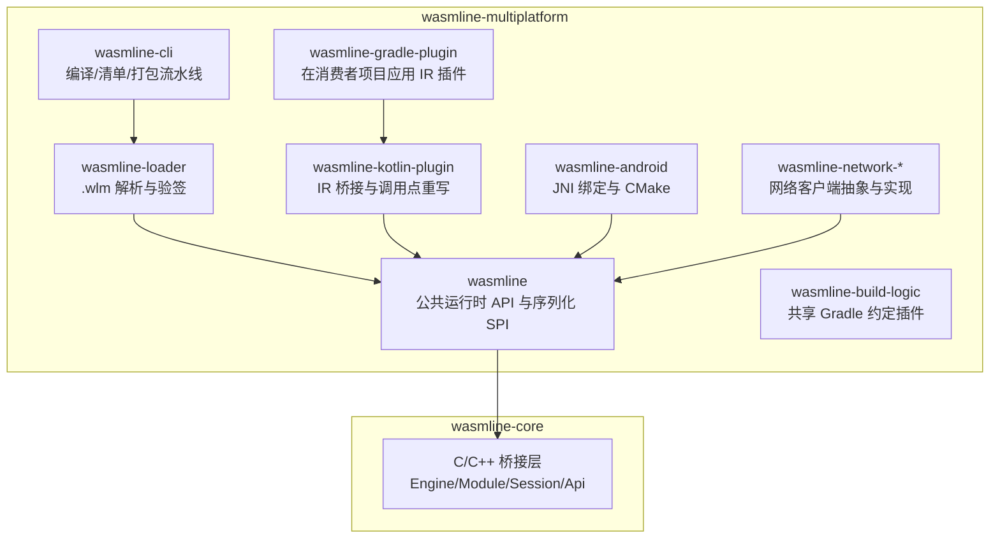
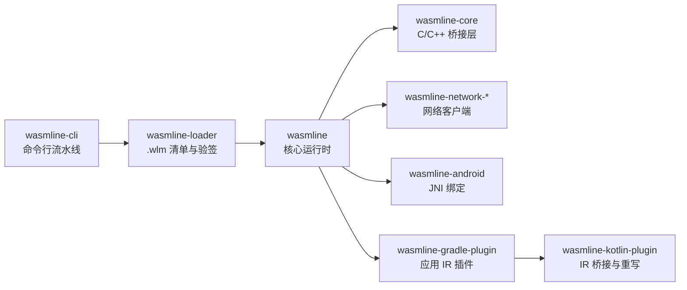
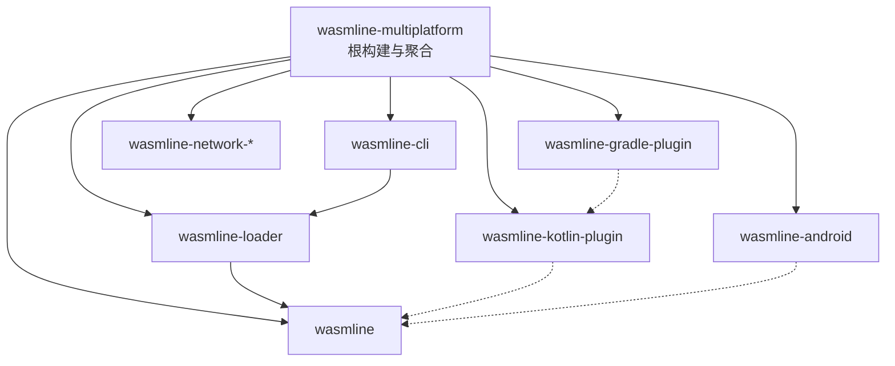

# 开发者指南

<cite>
**本文引用的文件**   
- [README.md](file://README.md)
- [build.gradle.kts](file://wasmline-multiplatform/build.gradle.kts)
- [settings.gradle.kts](file://wasmline-multiplatform/settings.gradle.kts)
- [init.sh](file://scripts/init.sh)
- [doctor.sh](file://scripts/doctor.sh)
- [style.sh](file://scripts/style.sh)
</cite>

## 目录
1. [引言](#引言)
2. [项目结构](#项目结构)
3. [核心组件](#核心组件)
4. [架构总览](#架构总览)
5. [详细组件分析](#详细组件分析)
6. [依赖分析](#依赖分析)
7. [性能考虑](#性能考虑)
8. [故障排查指南](#故障排查指南)
9. [结论](#结论)
10. [附录](#附录)

## 引言
本指南面向 Wasmline 项目的贡献者与维护者，系统阐述开发流程、协作规范、环境搭建、代码规范、模块边界、常见问题与调试技巧，并提供面向新贡献者的入门路径与学习资源。目标是帮助你在最短时间内建立一致的开发体验，高质量地交付变更。

## 项目结构
Wasmline 是一个多模块的 Kotlin 多平台工程，围绕“统一 API 表面 + 双栈执行模型”组织模块与职责：
- wasmline-core：C/C++ 层的 Wasmtime 桥接（Engine、Module、Session、Api），通过 Zig 编译并由 JNI 或 C-Interop 使用
- wasmline-multiplatform：核心运行时与构建生态
  - wasmline：公共运行时 API（commonMain/hostMain）、序列化 SPI、加载与调度
  - wasmline-loader：.wlm 清单解析、Ed25519/ECDSA-P256 验签、本地/远程包解析
  - wasmline-cli：编译、清单生成、打包的完整流水线
  - wasmline-kotlin-plugin：Kotlin IR 编译期桥接合成与调用点重写
  - wasmline-gradle-plugin：在消费者项目中应用 IR 插件
  - wasmline-android：Android JNI 绑定与 CMake
  - wasmline-network-*：网络客户端抽象与实现（OkHttp、Ktor）
  - wasmline-build-logic：共享 Gradle 约定插件
- wasmline-samples：多端示例应用与插件
- scripts：资产初始化、健康检查、样式与版本同步等脚本
- wasmline-ci：CI 自动化脚本

图表来源
- [README.md:415-445](file://README.md#L415-L445)
- [settings.gradle.kts:69-77](file://wasmline-multiplatform/settings.gradle.kts#L69-L77)

章节来源
- [README.md:415-445](file://README.md#L415-L445)
- [settings.gradle.kts:69-77](file://wasmline-multiplatform/settings.gradle.kts#L69-L77)

## 核心组件
- 统一 API 表面：在 commonMain/hostMain 提供 link<T>()、bind(...) 等编译期重写的入口，屏蔽平台差异
- 双栈执行模型：
  - 原生栈（Android/iOS/macOS/Linux/Windows）：通过 Wasmtime C-API 执行，JNI/C-Interop 访问 wasmline-core
  - Web 栈（Kotlin/JS、Kotlin/WasmJS）：通过浏览器 WebAssembly API 执行，内置轻量 JS 桥接，不依赖 Wasmtime
- 编译期 IR 插件：在 FIR/IR 阶段完成服务契约发现、校验、桥接合成与调用点重写，避免运行时反射与手工编组
- 加载与验签：wasmline-loader 解析 .wlm 清单，验证签名与元数据，支持本地/远程包解析与缓存

章节来源
- [README.md:340-403](file://README.md#L340-L403)
- [README.md:540-611](file://README.md#L540-L611)

## 架构总览
下图展示从 CLI 到运行时的关键链路与模块关系：

图表来源
- [README.md:404-414](file://README.md#L404-L414)
- [README.md:471-538](file://README.md#L471-L538)

章节来源
- [README.md:404-414](file://README.md#L404-L414)
- [README.md:471-538](file://README.md#L471-L538)

## 详细组件分析

### 分支策略与协作规范
- 分支来源：所有功能与修复必须基于 main 创建特性/修复分支
- 提交前检查：执行环境预检脚本，确保 JBR 21 就绪；确认本地属性文件存在
- 模块边界：变更应限定在对应模块内，参考仓库结构与技能矩阵指引
- 产物约束：禁止提交自动生成的 IR 快照、测试生成源、构建产物与 build/platforms 资产
- 测试覆盖：IR 插件行为变更需配套 box 测试或诊断测试
- 平台范围：Apple 平台相关变更需在 macOS 环境验证
- 重大变更：架构性提议需先在议题层面讨论

章节来源
- [README.md:613-634](file://README.md#L613-L634)

### 开发环境搭建与预检
- 系统要求与前置条件
  - JDK/JetBrainsRuntime 21（桌面 Compose 必须使用 JBR 21）
  - Kotlin 最低版本要求
  - Zig 0.16.0（JNI 共享库编译）
  - Bash/Python 3.9+/Node.js 18+（任一即可，用于初始化脚本）
- 环境预检
  - 在执行任何 Gradle 任务前，务必运行预检脚本，确认 JBR 21、Zig、Wasmtime 平台资产状态
  - 若未在 IDE 中打开项目，请先在根目录生成 local.properties
- 平台资产初始化
  - 在需要原生/桌面构建时，先下载并部署 Wasmtime 最小 C-API 资产至 build/platforms/
  - 支持交互式平台选择、并发控制与代理设置

章节来源
- [README.md:127-171](file://README.md#L127-L171)
- [README.md:471-538](file://README.md#L471-L538)
- [doctor.sh:1-463](file://scripts/doctor.sh#L1-L463)
- [init.sh:1-371](file://scripts/init.sh#L1-L371)

### 代码规范与最佳实践
- 编码风格与注释
  - 使用统一的脚本样式模块进行日志输出与 UI 呈现，便于在 CI 与本地保持一致的可读性
  - 对于 CLI/脚本类工具，建议采用清晰的状态标签（如 [INFO]/[OK]/[WARN]/[ERR]）与进度条反馈
- 命名约定
  - 模块与目录命名遵循多平台与平台实际（commonMain/hostMain/jniMain/iosMain/webMain/jsMain/wasmJsMain/wasmWasiMain）的约定
  - 服务契约接口以 WasmlineService 为基类，方法签名稳定且无默认参数、vararg、suspend 等限制
- 注释规范
  - 关键流程（如 IR 转换步骤、桥接合成、调用点重写）建议在 README 或模块文档中明确说明，便于贡献者理解
- 生成物管理
  - IR 快照、测试生成源、构建产物与平台资产为自动生成物，严禁手动修改与提交

章节来源
- [README.md:540-611](file://README.md#L540-L611)
- [style.sh:1-80](file://scripts/style.sh#L1-L80)

### 模块边界与职责划分
- wasmline-multiplatform 根级构建与聚合
  - 统一坐标与版本，启用 Maven Central 发布与签名
- wasmline
  - 提供跨平台 API（commonMain/hostMain），包含加载、调度、序列化 SPI
- wasmline-loader
  - 解析 .wlm 清单、Ed25519/ECDSA-P256 验签、本地/远程包解析与缓存
- wasmline-cli
  - 完整流水线：download、generate-key-pair、compile、manifest、build
- wasmline-kotlin-plugin
  - IR 阶段：契约发现、校验、桥接合成、调用点重写
- wasmline-gradle-plugin
  - 在消费者项目中应用 IR 插件，确保 link/bind 能被重写
- wasmline-android
  - Android JNI 绑定与 CMake 配置
- wasmline-network-*
  - 网络客户端抽象与实现（OkHttp、Ktor），适配不同平台的实际实现
- wasmline-build-logic
  - 共享 Gradle 约定插件，减少重复配置

章节来源
- [build.gradle.kts:1-58](file://wasmline-multiplatform/build.gradle.kts#L1-L58)
- [settings.gradle.kts:69-77](file://wasmline-multiplatform/settings.gradle.kts#L69-L77)
- [README.md:415-445](file://README.md#L415-L445)

### 开发流程与工作流
- 本地开发
  - 使用 doctor 预检，准备平台资产，再执行 Gradle 任务
  - 修改后运行对应模块测试（如 loader 测试、CLI 测试、IR 插件测试）
- 提交流程
  - 基于 main 的特性/修复分支，提交前再次执行 doctor 与模块测试
  - 遵循模块边界与生成物约束，确保 CI 可通过

章节来源
- [README.md:613-634](file://README.md#L613-L634)
- [README.md:490-538](file://README.md#L490-L538)

### 常见开发问题与调试技巧
- Gradle 启动前未确认 JVM 环境
  - 症状：Gradle 报错或构建异常
  - 处理：先执行 doctor 预检，确认 JBR 21 已激活
- 平台资产缺失
  - 症状：原生/桌面目标编译失败或缺少 Wasmtime C-API
  - 处理：执行 init 脚本下载并部署 build/platforms/ 资产
- IR 插件未应用导致 link/bind 抛出 UnsupportedOperationException
  - 症状：运行时报错
  - 处理：在消费者项目中应用 wasmline-gradle-plugin，确保 wasmline-kotlin-plugin 生效
- Web 目标误用 AOT 产物
  - 症状：Web 目标无法加载 .cwasm/.pwasm
  - 处理：仅使用原始 .wasm 文件作为 Web 目标输入

章节来源
- [README.md:144-151](file://README.md#L144-L151)
- [README.md:682-701](file://README.md#L682-L701)
- [README.md:636-701](file://README.md#L636-L701)

## 依赖分析
- 仓库级依赖
  - Gradle 插件与版本由 libs.versions.toml 管理，根级 build.gradle.kts 统一发布配置
- 模块间依赖
  - wasmline-cli → wasmline-loader → wasmline（核心运行时）
  - wasmline-kotlin-plugin 仅在编译期使用，不引入运行时依赖
  - wasmline-gradle-plugin 应用 IR 插件到消费者项目
  - wasmline-android 为原生栈提供 JNI 绑定
  - wasmline-network-* 为不同平台提供网络实现

图表来源
- [build.gradle.kts:1-58](file://wasmline-multiplatform/build.gradle.kts#L1-L58)
- [settings.gradle.kts:69-77](file://wasmline-multiplatform/settings.gradle.kts#L69-L77)

章节来源
- [build.gradle.kts:1-58](file://wasmline-multiplatform/build.gradle.kts#L1-L58)
- [settings.gradle.kts:69-77](file://wasmline-multiplatform/settings.gradle.kts#L69-L77)

## 性能考虑
- 原生目标的内存隔离与安全沙箱
  - 每次调用在独立 Session 中执行，线性内存隔离，避免主机进程直接访问
- Web 目标的轻量桥接
  - 通过浏览器 WebAssembly API 执行，内置 JS 桥接，避免外部 JS 依赖
- AOT 与 Pulley 的权衡
  - .cwasm 面向极致吞吐，但与特定 Wasmtime 版本耦合
  - .pwasm 通过 Pulley 解释器跨平台，内存占用更友好
- 构建与下载
  - init 脚本支持并发下载与代理，缩短平台资产准备时间

章节来源
- [README.md:658-681](file://README.md#L658-L681)
- [README.md:340-403](file://README.md#L340-L403)
- [init.sh:1-371](file://scripts/init.sh#L1-L371)

## 故障排查指南
- doctor 预检
  - 检查 JBR 21 是否激活、平台资产是否就绪、Zig 版本是否满足要求
  - 输出 PASS/WARN/FAIL 三类状态，按提示修复
- init 资产初始化
  - 支持交互式平台选择、并发度配置与代理设置
  - 下载完成后自动解压并部署到 build/platforms/
- 日志与 UI
  - 使用 style 模块提供的颜色与进度条，便于快速定位问题阶段

章节来源
- [doctor.sh:1-463](file://scripts/doctor.sh#L1-L463)
- [init.sh:1-371](file://scripts/init.sh#L1-L371)
- [style.sh:1-80](file://scripts/style.sh#L1-L80)

## 结论
通过统一的模块边界、双栈执行模型与编译期 IR 插件，Wasmline 在多平台与多语言插件作者之间建立了稳定的桥梁。遵循本文档的分支策略、环境预检、代码规范与故障排查流程，你将能够高效、安全地贡献代码并获得一致的开发体验。

## 附录
- 学习资源与参考
  - 官方 Wasmtime 文档、WebAssembly 规范、WASI 规范
  - 示例应用与插件位于 wasmline-samples/kotlin
- 常用命令速查
  - Gradle 构建、测试与 IR 插件盒测
  - Zig 构建 JNI 共享库
  - doctor 与 init 脚本

章节来源
- [README.md:705-716](file://README.md#L705-L716)
- [README.md:490-538](file://README.md#L490-L538)
