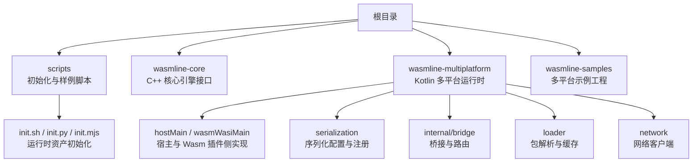
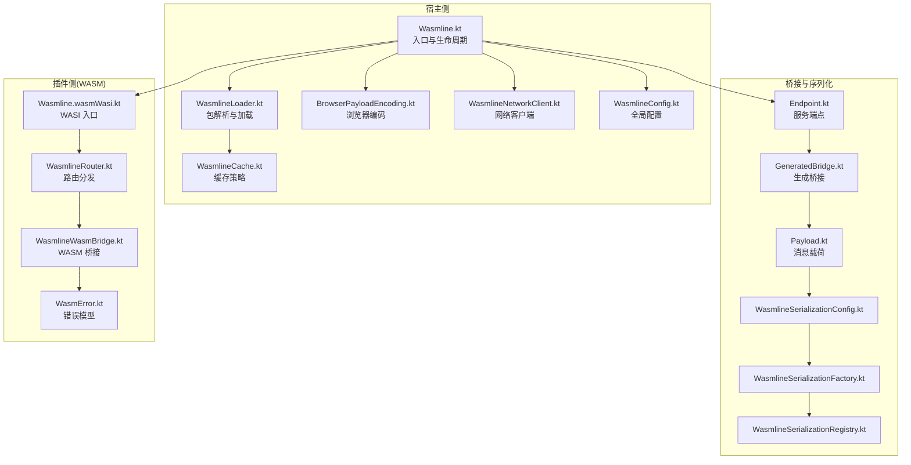
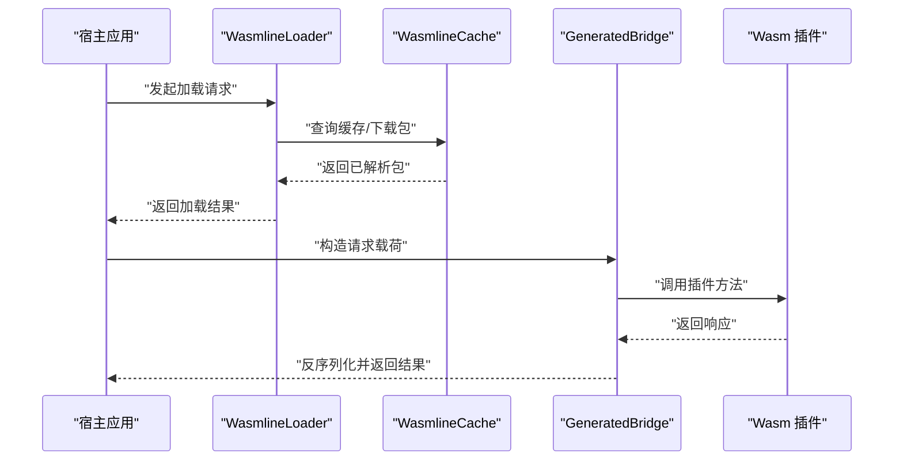
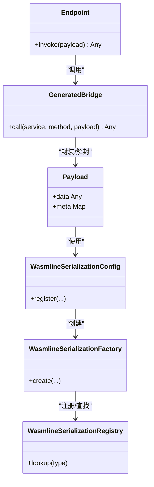
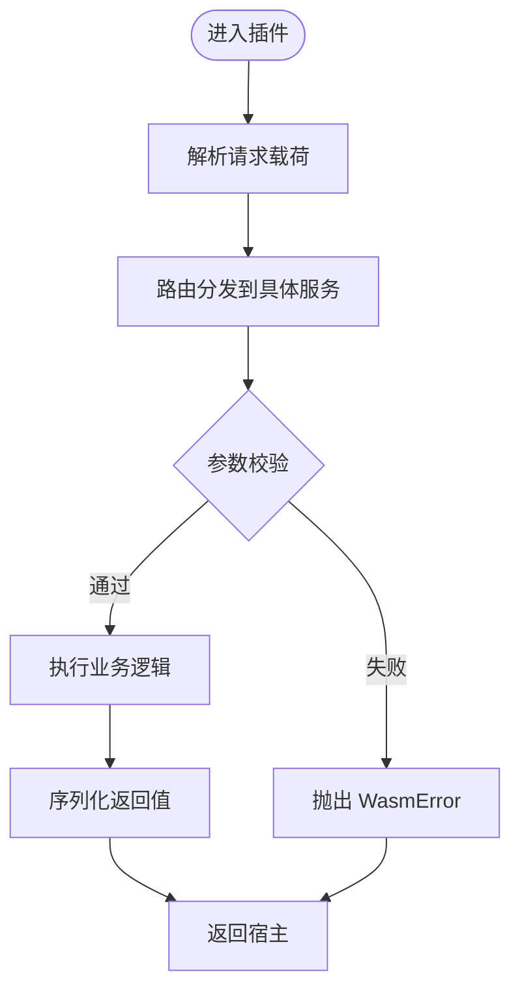
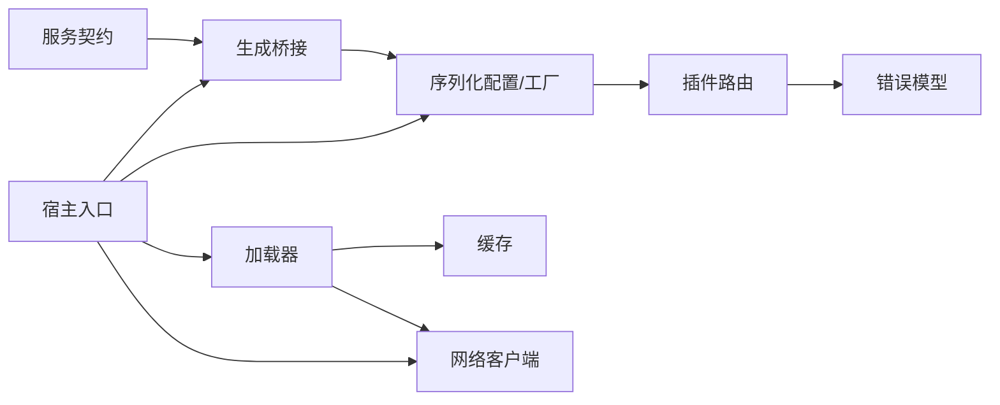

# 快速开始

<cite>
**本文引用的文件**
- [README.md](file://README.md)
- [scripts/init.sh](file://scripts/init.sh)
- [scripts/init.py](file://scripts/init.py)
- [scripts/init.mjs](file://scripts/init.mjs)
- [wasmline-multiplatform/wasmline/src/hostMain/kotlin/crow/wasmline/Wasmline.kt](file://wasmline-multiplatform/wasmline/src/hostMain/kotlin/crow/wasmline/Wasmline.kt)
- [wasmline-multiplatform/wasmline/src/commonMain/kotlin/crow/wasmline/WasmlineService.kt](file://wasmline-multiplatform/wasmline/src/commonMain/kotlin/crow/wasmline/WasmlineService.kt)
- [wasmline-multiplatform/wasmline/src/commonMain/kotlin/crow/wasmline/internal/bridge/Endpoint.kt](file://wasmline-multiplatform/wasmline/src/commonMain/kotlin/crow/wasmline/internal/bridge/Endpoint.kt)
- [wasmline-multiplatform/wasmline/src/commonMain/kotlin/crow/wasmline/internal/bridge/GeneratedBridge.kt](file://wasmline-multiplatform/wasmline/src/commonMain/kotlin/crow/wasmline/internal/bridge/GeneratedBridge.kt)
- [wasmline-multiplatform/wasmline/src/commonMain/kotlin/crow/wasmline/internal/bridge/Payload.kt](file://wasmline-multiplatform/wasmline/src/commonMain/kotlin/crow/wasmline/internal/bridge/Payload.kt)
- [wasmline-multiplatform/wasmline/src/commonMain/kotlin/crow/wasmline/serialization/WasmlineSerializationConfig.kt](file://wasmline-multiplatform/wasmline/src/commonMain/kotlin/crow/wasmline/serialization/WasmlineSerializationConfig.kt)
- [wasmline-multiplatform/wasmline/src/commonMain/kotlin/crow/wasmline/serialization/WasmlineSerializationFactory.kt](file://wasmline-multiplatform/wasmline/src/commonMain/kotlin/crow/wasmline/serialization/WasmlineSerializationFactory.kt)
- [wasmline-multiplatform/wasmline/src/commonMain/kotlin/crow/wasmline/serialization/WasmlineSerializationRegistry.kt](file://wasmline-multiplatform/wasmline/src/commonMain/kotlin/crow/wasmline/serialization/WasmlineSerializationRegistry.kt)
- [wasmline-multiplatform/wasmline/src/hostMain/kotlin/crow/wasmline/WasmlineLoader.kt](file://wasmline-multiplatform/wasmline/src/hostMain/kotlin/crow/wasmline/WasmlineLoader.kt)
- [wasmline-multiplatform/wasmline/src/hostMain/kotlin/crow/wasmline/WasmlineLoadState.kt](file://wasmline-multiplatform/wasmline/src/hostMain/kotlin/crow/wasmline/WasmlineLoadState.kt)
- [wasmline-multiplatform/wasmline/src/hostMain/kotlin/crow/wasmline/WasmlineLoadResult.kt](file://wasmline-multiplatform/wasmline/src/hostMain/kotlin/crow/wasmline/WasmlineLoadResult.kt)
- [wasmline-multiplatform/wasmline/src/wasmWasiMain/kotlin/crow/wasmline/Wasmline.wasmWasi.kt](file://wasmline-multiplatform/wasmline/src/wasmWasiMain/kotlin/crow/wasmline/Wasmline.wasmWasi.kt)
- [wasmline-multiplatform/wasmline/src/wasmWasiMain/kotlin/crow/wasmline/WasmlineRouter.kt](file://wasmline-multiplatform/wasmline/src/wasmWasiMain/kotlin/crow/wasmline/WasmlineRouter.kt)
- [wasmline-multiplatform/wasmline/src/wasmWasiMain/kotlin/crow/wasmline/WasmlineWasmBridge.kt](file://wasmline-multiplatform/wasmline/src/wasmWasiMain/kotlin/crow/wasmline/WasmlineWasmBridge.kt)
- [wasmline-multiplatform/wasmline/src/wasmWasiMain/kotlin/crow/wasmline/model/WasmError.kt](file://wasmline-multiplatform/wasmline/src/wasmWasiMain/kotlin/crow/wasmline/model/WasmError.kt)
- [wasmline-multiplatform/wasmline/src/hostMain/kotlin/crow/wasmline/extensions/NativeLoaderExt.kt](file://wasmline-multiplatform/wasmline/src/hostMain/kotlin/crow/wasmline/extensions/NativeLoaderExt.kt)
- [wasmline-multiplatform/wasmline/src/hostMain/kotlin/crow/wasmline/BrowserPayloadEncoding.kt](file://wasmline-multiplatform/wasmline/src/hostMain/kotlin/crow/wasmline/BrowserPayloadEncoding.kt)
- [wasmline-multiplatform/wasmline/src/hostMain/kotlin/crow/wasmline/WasmlineWarmupMode.kt](file://wasmline-multiplatform/wasmline/src/hostMain/kotlin/crow/wasmline/WasmlineWarmupMode.kt)
- [wasmline-multiplatform/wasmline/src/hostMain/kotlin/crow/wasmline/WasmlineCache.kt](file://wasmline-multiplatform/wasmline/src/hostMain/kotlin/crow/wasmline/WasmlineCache.kt)
- [wasmline-multiplatform/wasmline/src/hostMain/kotlin/crow/wasmline/WasmlineConfig.kt](file://wasmline-multiplatform/wasmline/src/hostMain/kotlin/crow/wasmline/WasmlineConfig.kt)
- [wasmline-multiplatform/wasmline/src/hostMain/kotlin/crow/wasmline/WasmlineNetworkClient.kt](file://wasmline-multiplatform/wasmline/src/hostMain/kotlin/crow/wasmline/WasmlineNetworkClient.kt)
- [wasmline-multiplatform/wasmline/src/hostMain/kotlin/crow/wasmline/WasmlineTrustedKeys.kt](file://wasmline-multiplatform/wasmline/src/hostMain/kotlin/crow/wasmline/WasmlineTrustedKeys.kt)
- [wasmline-multiplatform/wasmline/src/hostMain/kotlin/crow/wasmline/internal/bridge/HostDispatcher.kt](file://wasmline-multiplatform/wasmline/src/hostMain/kotlin/crow/wasmline/internal/bridge/HostDispatcher.kt)
- [wasmline-multiplatform/wasmline/src/hostMain/kotlin/crow/wasmline/internal/bridge/GeneratedSerialization.kt](file://wasmline-multiplatform/wasmline/src/hostMain/kotlin/crow/wasmline/internal/bridge/GeneratedSerialization.kt)
- [wasmline-multiplatform/wasmline/src/hostMain/kotlin/crow/wasmline/internal/bridge/Payload.kt](file://wasmline-multiplatform/wasmline/src/hostMain/kotlin/crow/wasmline/internal/bridge/Payload.kt)
- [wasmline-multiplatform/wasmline/src/hostMain/kotlin/crow/wasmline/internal/bridge/Endpoint.kt](file://wasmline-multiplatform/wasmline/src/hostMain/kotlin/crow/wasmline/internal/bridge/Endpoint.kt)
- [wasmline-multiplatform/wasmline/src/hostMain/kotlin/crow/wasmline/internal/bridge/GeneratedBridge.kt](file://wasmline-multiplatform/wasmline/src/hostMain/kotlin/crow/wasmline/internal/bridge/GeneratedBridge.kt)
- [wasmline-multiplatform/wasmline/src/hostMain/kotlin/crow/wasmline/internal/bridge/HostDispatcher.kt](file://wasmline-multiplatform/wasmline/src/hostMain/kotlin/crow/wasmline/internal/bridge/HostDispatcher.kt)
- [wasmline-multiplatform/wasmline/src/hostMain/kotlin/crow/wasmline/internal/bridge/GeneratedSerialization.kt](file://wasmline-multiplatform/wasmline/src/hostMain/kotlin/crow/wasmline/internal/bridge/GeneratedSerialization.kt)
- [wasmline-multiplatform/wasmline/src/hostMain/kotlin/crow/wasmline/internal/bridge/Payload.kt](file://wasmline-multiplatform/wasmline/src/hostMain/kotlin/crow/wasmline/internal/bridge/Payload.kt)
- [wasmline-multiplatform/wasmline/src/hostMain/kotlin/crow/wasmline/internal/bridge/Endpoint.kt](file://wasmline-multiplatform/wasmline/src/hostMain/kotlin/crow/wasmline/internal/bridge/Endpoint.kt)
- [wasmline-multiplatform/wasmline/src/hostMain/kotlin/crow/wasmline/internal/bridge/GeneratedBridge.kt](file://wasmline-multiplatform/wasmline/src/hostMain/kotlin/crow/wasmline/internal/bridge/GeneratedBridge.kt)
- [wasmline-multiplatform/wasmline/src/hostMain/kotlin/crow/wasmline/internal/bridge/HostDispatcher.kt](file://wasmline-multiplatform/wasmline/src/hostMain/kotlin/crow/wasmline/internal/bridge/HostDispatcher.kt)
- [wasmline-multiplatform/wasmline/src/hostMain/kotlin/crow/wasmline/internal/bridge/GeneratedSerialization.kt](file://wasmline-multiplatform/wasmline/src/hostMain/kotlin/crow/wasmline/internal/bridge/GeneratedSerialization.kt)
- [wasmline-multiplatform/wasmline/src/hostMain/kotlin/crow/wasmline/internal/bridge/Payload.kt](file://wasmline-multiplatform/wasmline/src/hostMain/kotlin/crow/wasmline/internal/bridge/Payload.kt)
- [wasmline-multiplatform/wasmline/src/hostMain/kotlin/crow/wasmline/internal/bridge/Endpoint.kt](file://wasmline-multiplatform/wasmline/src/hostMain/kotlin/crow/wasmline/internal/bridge/Endpoint.kt)
- [wasmline-multiplatform/wasmline/src/hostMain/kotlin/crow/wasmline/internal/bridge/GeneratedBridge.kt](file://wasmline-multiplatform/wasmline/src/hostMain/kotlin/crow/wasmline/internal/bridge/GeneratedBridge.kt)
- [wasmline-multiplatform/wasmline/src/hostMain/kotlin/crow/wasmline/internal/bridge/HostDispatcher.kt](file://wasmline-multiplatform/wasmline/src/hostMain/kotlin/crow/wasmline/internal/bridge/HostDispatcher.kt)
- [wasmline-multiplatform/wasmline/src/hostMain/kotlin/crow/wasmline/internal/bridge/GeneratedSerialization.kt](file://wasmline-multiplatform/wasmline/src/hostMain/kotlin/crow/wasmline/internal/bridge/GeneratedSerialization.kt)
- [wasmline-multiplatform/wasmline/src/hostMain/kotlin/crow/wasmline/internal/bridge/Payload.kt](file://wasmline-multiplatform/wasmline/src/hostMain/kotlin/crow/wasmline/internal/bridge/Payload.kt)
- [wasmline-multiplatform/wasmline/src/hostMain/kotlin/crow/wasmline/internal/bridge/Endpoint.kt](file://wasmline-multiplatform/wasmline/src/hostMain/kotlin/crow/wasmline/internal/bridge/Endpoint.kt)
- [wasmline-multiplatform/wasmline/src/hostMain/kotlin/crow/wasmline/internal/bridge/GeneratedBridge.kt](file://wasmline-multiplatform/wasmline/src/hostMain/kotlin/crow/wasmline/internal/bridge/GeneratedBridge.kt)
- [wasmline-multiplatform/wasmline/src/hostMain/kotlin/crow/wasmline/internal/bridge/HostDispatcher.kt](file://wasmline-multiplatform/wasmline/src/hostMain/kotlin/crow/wasmline/internal/bridge/HostDispatcher.kt)
- [wasmline-multiplatform/wasmline/src/hostMain/kotlin/crow/wasmline/internal/bridge/GeneratedSerialization.kt](file://wasmline-multiplatform/wasmline/src/hostMain/kotlin/crow/wasmline/internal/bridge/GeneratedSerialization.kt)
- [wasmline-multiplatform/wasmline/src/hostMain/kotlin/crow/wasmline/internal/bridge/Payload.kt](file://wasmline-multiplatform/wasmline/src/hostMain/kotlin/crow/wasmline/internal/bridge/Payload.kt)
- [wasmline-multiplatform/wasmline/src/hostMain/kotlin/crow/wasmline/internal/bridge/Endpoint.kt](file://wasmline-multiplatform/wasmline/src/hostMain/kotlin/crow/wasmline/internal/bridge/Endpoint.kt)
- [wasmline-multiplatform/wasmline/src/hostMain/kotlin/crow/wasmline/internal/bridge/GeneratedBridge.kt](file://wasmline-multiplatform/wasmline/src/hostMain/kotlin/crow/wasmline/internal/bridge/GeneratedBridge.kt)
- [wasmline-multiplatform/wasmline/src/hostMain/kotlin/crow/wasmline/internal/bridge/HostDispatcher.kt](file://wasmline-multiplatform/wasmline/src/hostMain/kotlin/crow/wasmline/internal/bridge/HostDispatcher.kt)
- [wasmline-multiplatform/wasmline/src/hostMain/kotlin/crow/wasmline/internal/bridge/GeneratedSerialization.kt](file://wasmline-multiplatform/wasmline/src/hostMain/kotlin/crow/wasmline/internal/bridge/GeneratedSerialization.kt)
- [wasmline-multiplatform/wasmline/src/hostMain/kotlin/crow/wasmline/internal/bridge/Payload.kt](file://wasmline-multiplatform/wasmline/src/hostMain/kotlin/crow/wasmline/internal/bridge/Payload.kt)
- [wasmline-multiplatform/wasmline/src/hostMain/kotlin/crow/wasmline/internal/bridge/Endpoint.kt](file://wasmline-multiplatform/wasmline/src/hostMain/kotlin/crow/wasmline/internal/bridge/Endpoint.kt)
- [wasmline-multiplatform/wasmline/src/hostMain/kotlin/crow/wasmline/internal/bridge/GeneratedBridge.kt](file://wasmline-multiplatform/wasmline/src/hostMain/kotlin/crow/wasmline/internal/bridge/GeneratedBridge.kt)
- [wasmline-multiplatform/wasmline/src/hostMain/kotlin/crow/wasmline/internal/bridge/HostDispatcher.kt](file://wasmline-multiplatform/wasmline/src/hostMain/kotlin/crow/wasmline/internal/bridge/HostDispatcher.kt)
- [wasmline-multiplatform/wasmline/src/hostMain/kotlin/crow/wasmline/internal/bridge/GeneratedSerialization.kt......](file://wasmline-multiplatform/wasmline/src/hostMain/kotlin/crow/wasmline/internal/bridge/GeneratedSerialization.kt)
</cite>

## 目录
1. [简介](#简介)
2. [项目结构](#项目结构)
3. [核心组件](#核心组件)
4. [架构总览](#架构总览)
5. [详细组件分析](#详细组件分析)
6. [依赖分析](#依赖分析)
7. [性能考虑](#性能考虑)
8. [故障排除指南](#故障排除指南)
9. [结论](#结论)
10. [附录](#附录)

## 简介
Wasmline 是一个支持多平台的 WebAssembly 插件框架，允许在多种运行时（Android、iOS、JVM、JS、WASM 等）中加载和调用 Wasm 插件。它通过统一的服务契约与桥接机制，为宿主应用提供一致的插件加载、序列化、路由与错误处理能力。

本“快速开始”旨在帮助新用户在最短时间内完成环境准备、运行时资产初始化，并成功运行第一个 Wasmline 应用。文档覆盖以下内容：
- 系统要求与前置条件检查
- 使用 Bash、Python、Node.js 三种初始化脚本获取 Wasmtime 运行时资产
- 基本使用示例：定义服务契约、实现插件、在宿主应用中加载与调用
- 常见开发环境问题与解决方案
- 渐进式学习路径：从 Hello World 到多平台复杂应用

## 项目结构
仓库采用多模块组织方式，核心与多平台运行时分布在不同子模块中；脚本目录提供初始化与样例运行脚本；samples 提供端到端示例工程。

图示来源
- [README.md](file://README.md)
- [scripts/init.sh](file://scripts/init.sh)
- [wasmline-multiplatform/wasmline/src/hostMain/kotlin/crow/wasmline/Wasmline.kt](file://wasmline-multiplatform/wasmline/src/hostMain/kotlin/crow/wasmline/Wasmline.kt)

章节来源
- [README.md](file://README.md)
- [scripts/init.sh](file://scripts/init.sh)
- [scripts/init.py](file://scripts/init.py)
- [scripts/init.mjs](file://scripts/init.mjs)

## 核心组件
- 初始化脚本：提供一键获取 Wasmtime 运行时资产的能力，支持 Bash、Python、Node.js 三种方式，便于在不同环境下快速部署。
- 多平台运行时：以 Kotlin Multiplatform 实现，覆盖 JVM、Android、iOS、Web、WASM 等目标，提供统一的加载器、序列化、桥接与网络层。
- 服务契约与桥接：通过生成的桥接代码与序列化机制，实现宿主与插件之间的类型安全通信。
- 加载器与缓存：负责远程/本地包解析、签名验证、缓存管理与热身模式，提升首次加载性能。
- 错误模型：在 WASM 侧提供统一的错误封装，便于跨边界传播与处理。

章节来源
- [wasmline-multiplatform/wasmline/src/hostMain/kotlin/crow/wasmline/Wasmline.kt](file://wasmline-multiplatform/wasmline/src/hostMain/kotlin/crow/wasmline/Wasmline.kt)
- [wasmline-multiplatform/wasmline/src/commonMain/kotlin/crow/wasmline/WasmlineService.kt](file://wasmline-multiplatform/wasmline/src/commonMain/kotlin/crow/wasmline/WasmlineService.kt)
- [wasmline-multiplatform/wasmline/src/hostMain/kotlin/crow/wasmline/WasmlineLoader.kt](file://wasmline-multiplatform/wasmline/src/hostMain/kotlin/crow/wasmline/WasmlineLoader.kt)
- [wasmline-multiplatform/wasmline/src/hostMain/kotlin/crow/wasmline/WasmlineCache.kt](file://wasmline-multiplatform/wasmline/src/hostMain/kotlin/crow/wasmline/WasmlineCache.kt)
- [wasmline-multiplatform/wasmline/src/wasmWasiMain/kotlin/crow/wasmline/Wasmline.wasmWasi.kt](file://wasmline-multiplatform/wasmline/src/wasmWasiMain/kotlin/crow/wasmline/Wasmline.wasmWasi.kt)

## 架构总览
下图展示了宿主应用与 Wasm 插件之间的交互关系，以及序列化、路由与加载器的关键角色。

图示来源
- [wasmline-multiplatform/wasmline/src/hostMain/kotlin/crow/wasmline/Wasmline.kt](file://wasmline-multiplatform/wasmline/src/hostMain/kotlin/crow/wasmline/Wasmline.kt)
- [wasmline-multiplatform/wasmline/src/hostMain/kotlin/crow/wasmline/WasmlineLoader.kt](file://wasmline-multiplatform/wasmline/src/hostMain/kotlin/crow/wasmline/WasmlineLoader.kt)
- [wasmline-multiplatform/wasmline/src/hostMain/kotlin/crow/wasmline/WasmlineCache.kt](file://wasmline-multiplatform/wasmline/src/hostMain/kotlin/crow/wasmline/WasmlineCache.kt)
- [wasmline-multiplatform/wasmline/src/hostMain/kotlin/crow/wasmline/BrowserPayloadEncoding.kt](file://wasmline-multiplatform/wasmline/src/hostMain/kotlin/crow/wasmline/BrowserPayloadEncoding.kt)
- [wasmline-multiplatform/wasmline/src/hostMain/kotlin/crow/wasmline/WasmlineNetworkClient.kt](file://wasmline-multiplatform/wasmline/src/hostMain/kotlin/crow/wasmline/WasmlineNetworkClient.kt)
- [wasmline-multiplatform/wasmline/src/hostMain/kotlin/crow/wasmline/WasmlineConfig.kt](file://wasmline-multiplatform/wasmline/src/hostMain/kotlin/crow/wasmline/WasmlineConfig.kt)
- [wasmline-multiplatform/wasmline/src/commonMain/kotlin/crow/wasmline/internal/bridge/Endpoint.kt](file://wasmline-multiplatform/wasmline/src/commonMain/kotlin/crow/wasmline/internal/bridge/Endpoint.kt)
- [wasmline-multiplatform/wasmline/src/commonMain/kotlin/crow/wasmline/internal/bridge/GeneratedBridge.kt](file://wasmline-multiplatform/wasmline/src/commonMain/kotlin/crow/wasmline/internal/bridge/GeneratedBridge.kt)
- [wasmline-multiplatform/wasmline/src/commonMain/kotlin/crow/wasmline/internal/bridge/Payload.kt](file://wasmline-multiplatform/wasmline/src/commonMain/kotlin/crow/wasmline/internal/bridge/Payload.kt)
- [wasmline-multiplatform/wasmline/src/commonMain/kotlin/crow/wasmline/serialization/WasmlineSerializationConfig.kt](file://wasmline-multiplatform/wasmline/src/commonMain/kotlin/crow/wasmline/serialization/WasmlineSerializationConfig.kt)
- [wasmline-multiplatform/wasmline/src/commonMain/kotlin/crow/wasmline/serialization/WasmlineSerializationFactory.kt](file://wasmline-multiplatform/wasmline/src/commonMain/kotlin/crow/wasmline/serialization/WasmlineSerializationFactory.kt)
- [wasmline-multiplatform/wasmline/src/commonMain/kotlin/crow/wasmline/serialization/WasmlineSerializationRegistry.kt](file://wasmline-multiplatform/wasmline/src/commonMain/kotlin/crow/wasmline/serialization/WasmlineSerializationRegistry.kt)
- [wasmline-multiplatform/wasmline/src/wasmWasiMain/kotlin/crow/wasmline/Wasmline.wasmWasi.kt](file://wasmline-multiplatform/wasmline/src/wasmWasiMain/kotlin/crow/wasmline/Wasmline.wasmWasi.kt)
- [wasmline-multiplatform/wasmline/src/wasmWasiMain/kotlin/crow/wasmline/WasmlineRouter.kt](file://wasmline-multiplatform/wasmline/src/wasmWasiMain/kotlin/crow/wasmline/WasmlineRouter.kt)
- [wasmline-multiplatform/wasmline/src/wasmWasiMain/kotlin/crow/wasmline/WasmlineWasmBridge.kt](file://wasmline-multiplatform/wasmline/src/wasmWasiMain/kotlin/crow/wasmline/WasmlineWasmBridge.kt)
- [wasmline-multiplatform/wasmline/src/wasmWasiMain/kotlin/crow/wasmline/model/WasmError.kt](file://wasmline-multiplatform/wasmline/src/wasmWasiMain/kotlin/crow/wasmline/model/WasmError.kt)

## 详细组件分析

### 初始化脚本：获取 Wasmtime 运行时资产
Wasmline 提供三套初始化脚本，分别用于 Bash、Python、Node.js 环境，帮助开发者快速拉取运行时资产并进行本地验证。

- Bash 脚本：适合 Linux/macOS 环境，可直接执行以下载并解压运行时资源。
- Python 脚本：提供跨平台兼容性，自动检测平台并下载对应资产。
- Node.js 脚本：适合前端或 Node 环境，支持在浏览器或 Node 中进行初始化。

使用建议：
- 在 CI 或自动化环境中优先选择 Bash 脚本，执行效率高。
- 在需要跨平台兼容或嵌入到 Node 工作流时，选择 Python 或 Node.js 脚本。

章节来源
- [scripts/init.sh](file://scripts/init.sh)
- [scripts/init.py](file://scripts/init.py)
- [scripts/init.mjs](file://scripts/init.mjs)

### 宿主加载与调用流程（序列图）
下图展示了宿主应用如何通过加载器加载插件、建立桥接、序列化请求与响应，并最终返回结果的完整流程。

图示来源
- [wasmline-multiplatform/wasmline/src/hostMain/kotlin/crow/wasmline/WasmlineLoader.kt](file://wasmline-multiplatform/wasmline/src/hostMain/kotlin/crow/wasmline/WasmlineLoader.kt)
- [wasmline-multiplatform/wasmline/src/hostMain/kotlin/crow/wasmline/WasmlineCache.kt](file://wasmline-multiplatform/wasmline/src/hostMain/kotlin/crow/wasmline/WasmlineCache.kt)
- [wasmline-multiplatform/wasmline/src/commonMain/kotlin/crow/wasmline/internal/bridge/GeneratedBridge.kt](file://wasmline-multiplatform/wasmline/src/commonMain/kotlin/crow/wasmline/internal/bridge/GeneratedBridge.kt)
- [wasmline-multiplatform/wasmline/src/wasmWasiMain/kotlin/crow/wasmline/Wasmline.wasmWasi.kt](file://wasmline-multiplatform/wasmline/src/wasmWasiMain/kotlin/crow/wasmline/Wasmline.wasmWasi.kt)

### 服务契约与桥接（类图）
服务契约通过生成的桥接代码在宿主与插件之间建立强类型连接。序列化配置与工厂负责参数与返回值的编解码。

图示来源
- [wasmline-multiplatform/wasmline/src/commonMain/kotlin/crow/wasmline/internal/bridge/Endpoint.kt](file://wasmline-multiplatform/wasmline/src/commonMain/kotlin/crow/wasmline/internal/bridge/Endpoint.kt)
- [wasmline-multiplatform/wasmline/src/commonMain/kotlin/crow/wasmline/internal/bridge/GeneratedBridge.kt](file://wasmline-multiplatform/wasmline/src/commonMain/kotlin/crow/wasmline/internal/bridge/GeneratedBridge.kt)
- [wasmline-multiplatform/wasmline/src/commonMain/kotlin/crow/wasmline/internal/bridge/Payload.kt](file://wasmline-multiplatform/wasmline/src/commonMain/kotlin/crow/wasmline/internal/bridge/Payload.kt)
- [wasmline-multiplatform/wasmline/src/commonMain/kotlin/crow/wasmline/serialization/WasmlineSerializationConfig.kt](file://wasmline-multiplatform/wasmline/src/commonMain/kotlin/crow/wasmline/serialization/WasmlineSerializationConfig.kt)
- [wasmline-multiplatform/wasmline/src/commonMain/kotlin/crow/wasmline/serialization/WasmlineSerializationFactory.kt](file://wasmline-multiplatform/wasmline/src/commonMain/kotlin/crow/wasmline/serialization/WasmlineSerializationFactory.kt)
- [wasmline-multiplatform/wasmline/src/commonMain/kotlin/crow/wasmline/serialization/WasmlineSerializationRegistry.kt](file://wasmline-multiplatform/wasmline/src/commonMain/kotlin/crow/wasmline/serialization/WasmlineSerializationRegistry.kt)

### 插件侧路由与错误处理（流程图）
插件侧通过路由器分发请求，桥接层进行参数校验与转换，错误模型统一包装异常信息。

图示来源
- [wasmline-multiplatform/wasmline/src/wasmWasiMain/kotlin/crow/wasmline/WasmlineRouter.kt](file://wasmline-multiplatform/wasmline/src/wasmWasiMain/kotlin/crow/wasmline/WasmlineRouter.kt)
- [wasmline-multiplatform/wasmline/src/wasmWasiMain/kotlin/crow/wasmline/WasmlineWasmBridge.kt](file://wasmline-multiplatform/wasmline/src/wasmWasiMain/kotlin/crow/wasmline/WasmlineWasmBridge.kt)
- [wasmline-multiplatform/wasmline/src/wasmWasiMain/kotlin/crow/wasmline/model/WasmError.kt](file://wasmline-multiplatform/wasmline/src/wasmWasiMain/kotlin/crow/wasmline/model/WasmError.kt)

### 基本使用示例（步骤化）
以下为从零到一的最小可行流程，帮助你快速跑通第一个 Wasmline 应用：

- 步骤 1：准备环境
  - 安装 Bash/Python/Node.js 环境之一，并确保具备网络访问能力。
  - 执行对应的初始化脚本，拉取运行时资产并进行本地验证。
  - 参考：[scripts/init.sh](file://scripts/init.sh)、[scripts/init.py](file://scripts/init.py)、[scripts/init.mjs](file://scripts/init.mjs)

- 步骤 2：定义服务契约
  - 在公共模块中声明服务接口与数据模型，确保宿主与插件共享。
  - 参考：[wasmline-multiplatform/wasmline/src/commonMain/kotlin/crow/wasmline/WasmlineService.kt](file://wasmline-multiplatform/wasmline/src/commonMain/kotlin/crow/wasmline/WasmlineService.kt)

- 步骤 3：实现插件
  - 在插件侧实现服务逻辑，并通过生成的桥接代码暴露给宿主。
  - 参考：[wasmline-multiplatform/wasmline/src/wasmWasiMain/kotlin/crow/wasmline/Wasmline.wasmWasi.kt](file://wasmline-multiplatform/wasmline/src/wasmWasiMain/kotlin/crow/wasmline/Wasmline.wasmWasi.kt)

- 步骤 4：在宿主应用中加载与调用
  - 使用加载器解析包、缓存与签名验证，随后通过桥接调用插件方法。
  - 参考：[wasmline-multiplatform/wasmline/src/hostMain/kotlin/crow/wasmline/WasmlineLoader.kt](file://wasmline-multiplatform/wasmline/src/hostMain/kotlin/crow/wasmline/WasmlineLoader.kt)、[wasmline-multiplatform/wasmline/src/hostMain/kotlin/crow/wasmline/Wasmline.kt](file://wasmline-multiplatform/wasmline/src/hostMain/kotlin/crow/wasmline/Wasmline.kt)

- 步骤 5：序列化与路由
  - 使用序列化配置与工厂对参数与返回值进行编解码，确保跨边界类型安全。
  - 参考：[wasmline-multiplatform/wasmline/src/commonMain/kotlin/crow/wasmline/serialization/WasmlineSerializationConfig.kt](file://wasmline-multiplatform/wasmline/src/commonMain/kotlin/crow/wasmline/serialization/WasmlineSerializationConfig.kt)、[wasmline-multiplatform/wasmline/src/commonMain/kotlin/crow/wasmline/serialization/WasmlineSerializationFactory.kt](file://wasmline-multiplatform/wasmline/src/commonMain/kotlin/crow/wasmline/serialization/WasmlineSerializationFactory.kt)

- 步骤 6：错误处理
  - 在插件侧抛出统一错误模型，宿主侧捕获并处理。
  - 参考：[wasmline-multiplatform/wasmline/src/wasmWasiMain/kotlin/crow/wasmline/model/WasmError.kt](file://wasmline-multiplatform/wasmline/src/wasmWasiMain/kotlin/crow/wasmline/model/WasmError.kt)

章节来源
- [scripts/init.sh](file://scripts/init.sh)
- [scripts/init.py](file://scripts/init.py)
- [scripts/init.mjs](file://scripts/init.mjs)
- [wasmline-multiplatform/wasmline/src/commonMain/kotlin/crow/wasmline/WasmlineService.kt](file://wasmline-multiplatform/wasmline/src/commonMain/kotlin/crow/wasmline/WasmlineService.kt)
- [wasmline-multiplatform/wasmline/src/wasmWasiMain/kotlin/crow/wasmline/Wasmline.wasmWasi.kt](file://wasmline-multiplatform/wasmline/src/wasmWasiMain/kotlin/crow/wasmline/Wasmline.wasmWasi.kt)
- [wasmline-multiplatform/wasmline/src/hostMain/kotlin/crow/wasmline/WasmlineLoader.kt](file://wasmline-multiplatform/wasmline/src/hostMain/kotlin/crow/wasmline/WasmlineLoader.kt)
- [wasmline-multiplatform/wasmline/src/hostMain/kotlin/crow/wasmline/Wasmline.kt](file://wasmline-multiplatform/wasmline/src/hostMain/kotlin/crow/wasmline/Wasmline.kt)
- [wasmline-multiplatform/wasmline/src/commonMain/kotlin/crow/wasmline/serialization/WasmlineSerializationConfig.kt](file://wasmline-multiplatform/wasmline/src/commonMain/kotlin/crow/wasmline/serialization/WasmlineSerializationConfig.kt)
- [wasmline-multiplatform/wasmline/src/commonMain/kotlin/crow/wasmline/serialization/WasmlineSerializationFactory.kt](file://wasmline-multiplatform/wasmline/src/commonMain/kotlin/crow/wasmline/serialization/WasmlineSerializationFactory.kt)
- [wasmline-multiplatform/wasmline/src/wasmWasiMain/kotlin/crow/wasmline/model/WasmError.kt](file://wasmline-multiplatform/wasmline/src/wasmWasiMain/kotlin/crow/wasmline/model/WasmError.kt)

## 依赖分析
- 组件内聚与耦合
  - 服务契约与桥接是核心耦合点，通过生成的桥接代码降低运行时耦合度。
  - 序列化配置与工厂形成独立层，便于扩展与替换。
  - 加载器与缓存相互协作，保证包解析与性能优化。
- 外部依赖与集成点
  - 网络客户端支持多实现（Ktor/OkHttp），便于在不同运行时选择合适实现。
  - 浏览器侧编码适配不同运行时的载荷格式。
- 循环依赖
  - 通过清晰的模块边界与生成代码避免循环依赖风险。

图示来源
- [wasmline-multiplatform/wasmline/src/commonMain/kotlin/crow/wasmline/WasmlineService.kt](file://wasmline-multiplatform/wasmline/src/commonMain/kotlin/crow/wasmline/WasmlineService.kt)
- [wasmline-multiplatform/wasmline/src/commonMain/kotlin/crow/wasmline/internal/bridge/GeneratedBridge.kt](file://wasmline-multiplatform/wasmline/src/commonMain/kotlin/crow/wasmline/internal/bridge/GeneratedBridge.kt)
- [wasmline-multiplatform/wasmline/src/commonMain/kotlin/crow/wasmline/serialization/WasmlineSerializationConfig.kt](file://wasmline-multiplatform/wasmline/src/commonMain/kotlin/crow/wasmline/serialization/WasmlineSerializationConfig.kt)
- [wasmline-multiplatform/wasmline/src/commonMain/kotlin/crow/wasmline/serialization/WasmlineSerializationFactory.kt](file://wasmline-multiplatform/wasmline/src/commonMain/kotlin/crow/wasmline/serialization/WasmlineSerializationFactory.kt)
- [wasmline-multiplatform/wasmline/src/wasmWasiMain/kotlin/crow/wasmline/WasmlineRouter.kt](file://wasmline-multiplatform/wasmline/src/wasmWasiMain/kotlin/crow/wasmline/WasmlineRouter.kt)
- [wasmline-multiplatform/wasmline/src/wasmWasiMain/kotlin/crow/wasmline/model/WasmError.kt](file://wasmline-multiplatform/wasmline/src/wasmWasiMain/kotlin/crow/wasmline/model/WasmError.kt)
- [wasmline-multiplatform/wasmline/src/hostMain/kotlin/crow/wasmline/WasmlineLoader.kt](file://wasmline-multiplatform/wasmline/src/hostMain/kotlin/crow/wasmline/WasmlineLoader.kt)
- [wasmline-multiplatform/wasmline/src/hostMain/kotlin/crow/wasmline/WasmlineCache.kt](file://wasmline-multiplatform/wasmline/src/hostMain/kotlin/crow/wasmline/WasmlineCache.kt)
- [wasmline-multiplatform/wasmline/src/hostMain/kotlin/crow/wasmline/WasmlineNetworkClient.kt](file://wasmline-multiplatform/wasmline/src/hostMain/kotlin/crow/wasmline/WasmlineNetworkClient.kt)

章节来源
- [wasmline-multiplatform/wasmline/src/commonMain/kotlin/crow/wasmline/WasmlineService.kt](file://wasmline-multiplatform/wasmline/src/commonMain/kotlin/crow/wasmline/WasmlineService.kt)
- [wasmline-multiplatform/wasmline/src/hostMain/kotlin/crow/wasmline/WasmlineLoader.kt](file://wasmline-multiplatform/wasmline/src/hostMain/kotlin/crow/wasmline/WasmlineLoader.kt)
- [wasmline-multiplatform/wasmline/src/hostMain/kotlin/crow/wasmline/WasmlineCache.kt](file://wasmline-multiplatform/wasmline/src/hostMain/kotlin/crow/wasmline/WasmlineCache.kt)
- [wasmline-multiplatform/wasmline/src/hostMain/kotlin/crow/wasmline/WasmlineNetworkClient.kt](file://wasmline-multiplatform/wasmline/src/hostMain/kotlin/crow/wasmline/WasmlineNetworkClient.kt)

## 性能考虑
- 首次加载优化
  - 使用加载器的热身模式与缓存策略，减少重复下载与解析成本。
  - 参考：[wasmline-multiplatform/wasmline/src/hostMain/kotlin/crow/wasmline/WasmlineWarmupMode.kt](file://wasmline-multiplatform/wasmline/src/hostMain/kotlin/crow/wasmline/WasmlineWarmupMode.kt)、[wasmline-multiplatform/wasmline/src/hostMain/kotlin/crow/wasmline/WasmlineCache.kt](file://wasmline-multiplatform/wasmline/src/hostMain/kotlin/crow/wasmline/WasmlineCache.kt)
- 序列化开销
  - 合理设计数据模型，避免过深嵌套与大对象频繁传输。
  - 使用注册表集中管理序列化策略，提升一致性与可维护性。
  - 参考：[wasmline-multiplatform/wasmline/src/commonMain/kotlin/crow/wasmline/serialization/WasmlineSerializationRegistry.kt](file://wasmline-multiplatform/wasmline/src/commonMain/kotlin/crow/wasmline/serialization/WasmlineSerializationRegistry.kt)
- 路由与桥接
  - 将热点方法集中在少量路由中，减少跨边界调用次数。
  - 参考：[wasmline-multiplatform/wasmline/src/wasmWasiMain/kotlin/crow/wasmline/WasmlineRouter.kt](file://wasmline-multiplatform/wasmline/src/wasmWasiMain/kotlin/crow/wasmline/WasmlineRouter.kt)

## 故障排除指南
- 初始化失败
  - 检查网络连通性与代理设置，确认初始化脚本能正常下载资产。
  - 若使用 Python/Node.js 脚本，请确认对应解释器版本满足要求。
  - 参考：[scripts/init.sh](file://scripts/init.sh)、[scripts/init.py](file://scripts/init.py)、[scripts/init.mjs](file://scripts/init.mjs)
- 加载失败或签名验证错误
  - 核对信任密钥配置与包签名，确保加载器可信密钥列表正确。
  - 参考：[wasmline-multiplatform/wasmline/src/hostMain/kotlin/crow/wasmline/WasmlineTrustedKeys.kt](file://wasmline-multiplatform/wasmline/src/hostMain/kotlin/crow/wasmline/WasmlineTrustedKeys.kt)、[wasmline-multiplatform/wasmline/src/hostMain/kotlin/crow/wasmline/WasmlineLoader.kt](file://wasmline-multiplatform/wasmline/src/hostMain/kotlin/crow/wasmline/WasmlineLoader.kt)
- 跨边界调用异常
  - 检查序列化配置是否匹配，确保双方共享同一数据模型。
  - 参考：[wasmline-multiplatform/wasmline/src/commonMain/kotlin/crow/wasmline/serialization/WasmlineSerializationConfig.kt](file://wasmline-multiplatform/wasmline/src/commonMain/kotlin/crow/wasmline/serialization/WasmlineSerializationConfig.kt)
- 插件崩溃或返回错误
  - 在插件侧捕获异常并转换为统一错误模型，便于宿主侧处理。
  - 参考：[wasmline-multiplatform/wasmline/src/wasmWasiMain/kotlin/crow/wasmline/model/WasmError.kt](file://wasmline-multiplatform/wasmline/src/wasmWasiMain/kotlin/crow/wasmline/model/WasmError.kt)

章节来源
- [scripts/init.sh](file://scripts/init.sh)
- [scripts/init.py](file://scripts/init.py)
- [scripts/init.mjs](file://scripts/init.mjs)
- [wasmline-multiplatform/wasmline/src/hostMain/kotlin/crow/wasmline/WasmlineTrustedKeys.kt](file://wasmline-multiplatform/wasmline/src/hostMain/kotlin/crow/wasmline/WasmlineTrustedKeys.kt)
- [wasmline-multiplatform/wasmline/src/hostMain/kotlin/crow/wasmline/WasmlineLoader.kt](file://wasmline-multiplatform/wasmline/src/hostMain/kotlin/crow/wasmline/WasmlineLoader.kt)
- [wasmline-multiplatform/wasmline/src/commonMain/kotlin/crow/wasmline/serialization/WasmlineSerializationConfig.kt](file://wasmline-multiplatform/wasmline/src/commonMain/kotlin/crow/wasmline/serialization/WasmlineSerializationConfig.kt)
- [wasmline-multiplatform/wasmline/src/wasmWasiMain/kotlin/crow/wasmline/model/WasmError.kt](file://wasmline-multiplatform/wasmline/src/wasmWasiMain/kotlin/crow/wasmline/model/WasmError.kt)

## 结论
通过本快速开始指南，你已经完成了 Wasmline 的环境准备、运行时资产初始化，并掌握了服务契约、插件实现与宿主加载调用的基本流程。建议继续深入以下主题：
- 多平台示例工程：参考 samples 目录中的多平台应用，学习在 Android、iOS、桌面与 Web 上的集成方式。
- 高级特性：探索热身模式、自定义序列化策略、网络客户端切换与签名验证等高级能力。
- 生产实践：结合 CI/CD 与包管理策略，构建稳定可靠的插件生态。

## 附录
- 渐进式学习路径
  - 第一步：Hello World（单机运行）
  - 第二步：多平台 Hello（Android/iOS/Web）
  - 第三步：多插件协作（路由与序列化）
  - 第四步：生产级部署（CI/CD、签名与缓存）