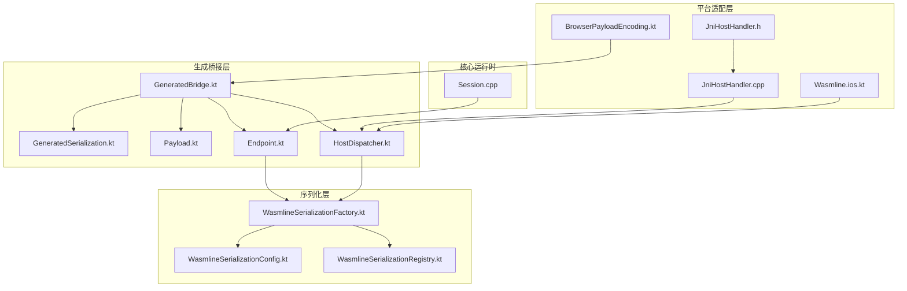
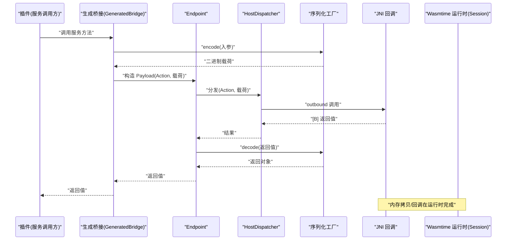
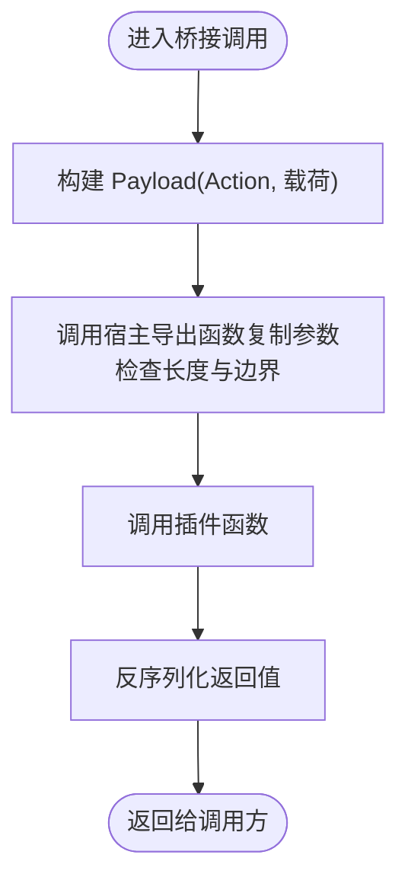
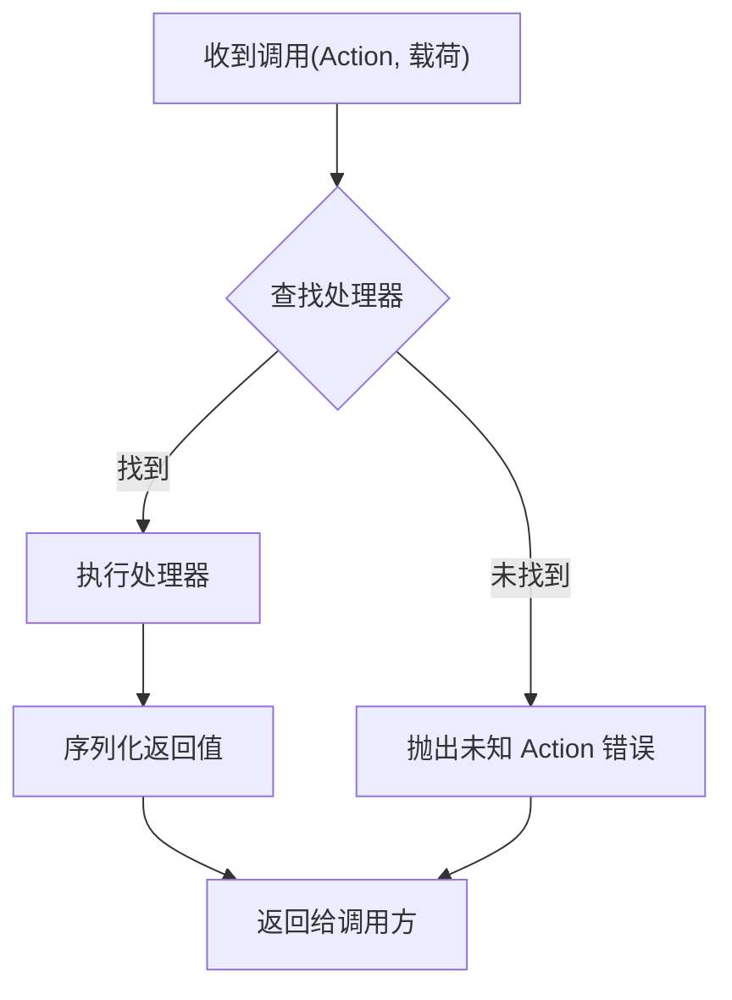
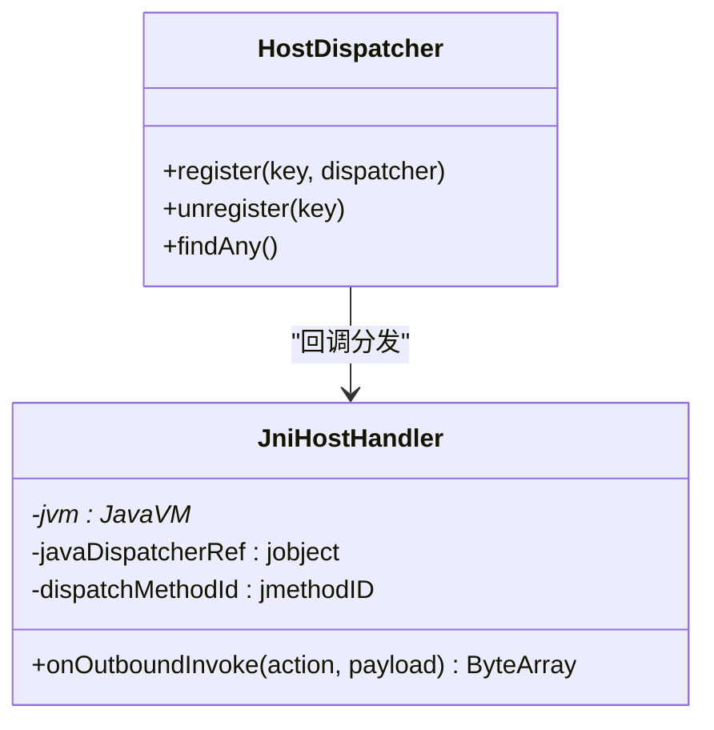
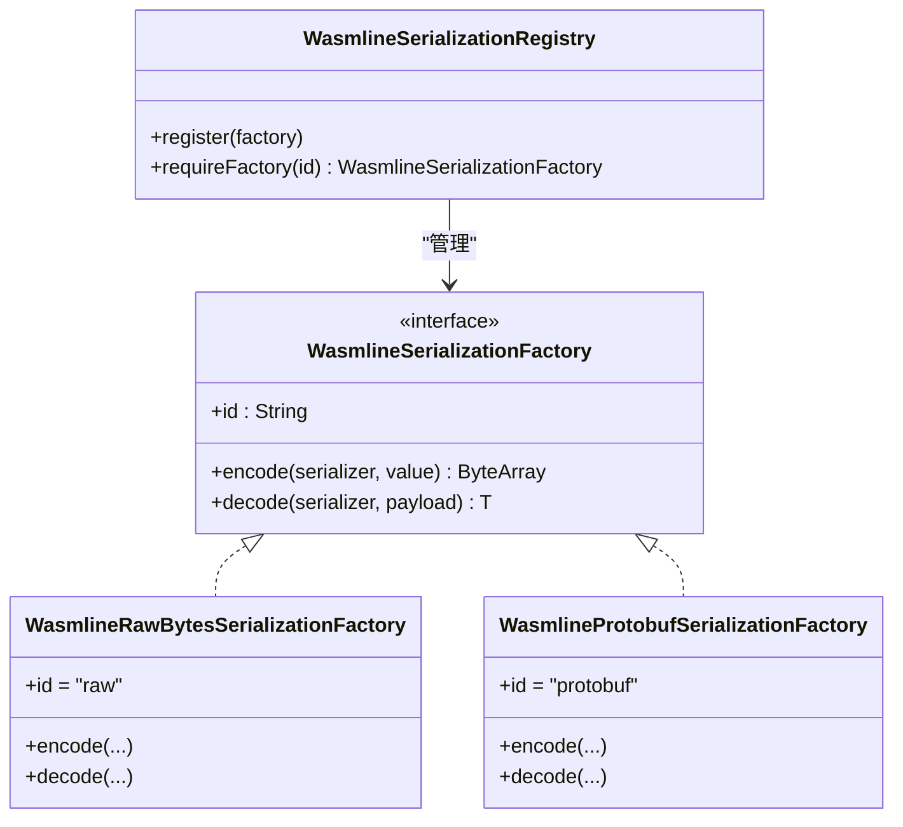
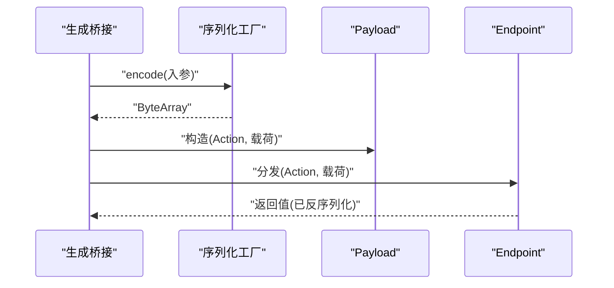
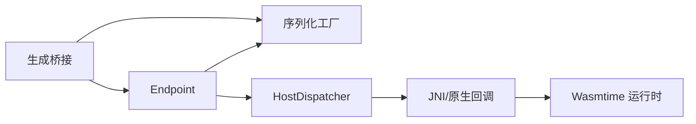

# Payload 数据传输

<cite>
**本文引用的文件**
- [Payload.kt](file://wasmline-multiplatform/wasmline/src/commonMain/kotlin/crow/wasmline/internal/bridge/Payload.kt)
- [Endpoint.kt](file://wasmline-multiplatform/wasmline/src/commonMain/kotlin/crow/wasmline/internal/bridge/Endpoint.kt)
- [HostDispatcher.kt](file://wasmline-multiplatform/wasmline/src/commonMain/kotlin/crow/wasmline/internal/bridge/HostDispatcher.kt)
- [GeneratedBridge.kt](file://wasmline-multiplatform/wasmline/src/commonMain/kotlin/crow/wasmline/internal/bridge/GeneratedBridge.kt)
- [GeneratedSerialization.kt](file://wasmline-multiplatform/wasmline/src/commonMain/kotlin/crow/wasmline/internal/bridge/GeneratedSerialization.kt)
- [WasmlineSerializationFactory.kt](file://wasmline-multiplatform/wasmline/src/commonMain/kotlin/crow/wasmline/serialization/WasmlineSerializationFactory.kt)
- [WasmlineSerializationConfig.kt](file://wasmline-multiplatform/wasmline/src/commonMain/kotlin/crow/wasmline/serialization/WasmlineSerializationConfig.kt)
- [WasmlineSerializationRegistry.kt](file://wasmline-multiplatform/wasmline/src/commonMain/kotlin/crow/wasmline/serialization/WasmlineSerializationRegistry.kt)
- [BrowserPayloadEncoding.kt](file://wasmline-multiplatform/wasmline/src/hostMain/kotlin/crow/wasmline/BrowserPayloadEncoding.kt)
- [JniHostHandler.h](file://wasmline-multiplatform/wasmline/src/jniMain/native/JniHostHandler.h)
- [JniHostHandler.cpp](file://wasmline-multiplatform/wasmline/src/jniMain/native/JniHostHandler.cpp)
- [Session.cpp](file://wasmline-core/src/Session.cpp)
- [Wasmline.ios.kt](file://wasmline-multiplatform/wasmline/src/iosMain/kotlin/crow/wasmline/Wasmline.ios.kt)
- [mind.md](file://wasmline-multiplatform/mind.md)
</cite>

## 目录
1. [引言](#引言)
2. [项目结构](#项目结构)
3. [核心组件](#核心组件)
4. [架构总览](#架构总览)
5. [详细组件分析](#详细组件分析)
6. [依赖关系分析](#依赖关系分析)
7. [性能考虑](#性能考虑)
8. [故障排除指南](#故障排除指南)
9. [结论](#结论)
10. [附录](#附录)

## 引言
本文件系统性阐述 Wasmline 中 Payload 数据传输机制的设计与实现，覆盖数据结构、编码/解码、内存管理、跨语言传输协议、Endpoint 路由与消息分发、HostDispatcher 并发调度、性能优化、安全与完整性保障以及调试与排障方法。目标是帮助开发者在多平台（Android、iOS、Web、WASM）环境下正确、高效且安全地进行宿主与插件之间的数据交换。

## 项目结构
围绕 Payload 传输的关键代码分布在以下模块：
- 生成桥接层：负责将服务契约转换为可调用的桥接函数，并在调用前后执行序列化/反序列化。
- 序列化层：定义工厂接口与内置工厂（原始字节与 Protobuf），并支持自定义注册。
- 平台适配层：针对不同运行时（JNI、JS、iOS 原生）提供回调与内存拷贝能力。
- 核心运行时：通过 Wasmtime C-API 提供线性内存访问与参数拷贝。

**图表来源**
- [GeneratedBridge.kt](file://wasmline-multiplatform/wasmline/src/commonMain/kotlin/crow/wasmline/internal/bridge/GeneratedBridge.kt)
- [GeneratedSerialization.kt](file://wasmline-multiplatform/wasmline/src/commonMain/kotlin/crow/wasmline/internal/bridge/GeneratedSerialization.kt)
- [Payload.kt](file://wasmline-multiplatform/wasmline/src/commonMain/kotlin/crow/wasmline/internal/bridge/Payload.kt)
- [Endpoint.kt](file://wasmline-multiplatform/wasmline/src/commonMain/kotlin/crow/wasmline/internal/bridge/Endpoint.kt)
- [HostDispatcher.kt](file://wasmline-multiplatform/wasmline/src/commonMain/kotlin/crow/wasmline/internal/bridge/HostDispatcher.kt)
- [WasmlineSerializationFactory.kt](file://wasmline-multiplatform/wasmline/src/commonMain/kotlin/crow/wasmline/serialization/WasmlineSerializationFactory.kt)
- [WasmlineSerializationConfig.kt](file://wasmline-multiplatform/wasmline/src/commonMain/kotlin/crow/wasmline/serialization/WasmlineSerializationConfig.kt)
- [WasmlineSerializationRegistry.kt](file://wasmline-multiplatform/wasmline/src/commonMain/kotlin/crow/wasmline/serialization/WasmlineSerializationRegistry.kt)
- [BrowserPayloadEncoding.kt](file://wasmline-multiplatform/wasmline/src/hostMain/kotlin/crow/wasmline/BrowserPayloadEncoding.kt)
- [JniHostHandler.h](file://wasmline-multiplatform/wasmline/src/jniMain/native/JniHostHandler.h)
- [JniHostHandler.cpp](file://wasmline-multiplatform/wasmline/src/jniMain/native/JniHostHandler.cpp)
- [Session.cpp](file://wasmline-core/src/Session.cpp)
- [Wasmline.ios.kt](file://wasmline-multiplatform/wasmline/src/iosMain/kotlin/crow/wasmline/Wasmline.ios.kt)

**章节来源**
- [mind.md](file://wasmline-multiplatform/mind.md)

## 核心组件
- Payload：承载一次调用的 Action 名称与二进制载荷，作为桥接层输入输出的基本单元。
- Endpoint：服务端点抽象，负责根据 Action 将请求分发到具体实现，并协调序列化/反序列化。
- HostDispatcher：宿主侧调度器，接收来自插件的出站调用，按 Action 查找处理器并返回结果。
- 序列化工厂：定义统一的编码/解码接口，内置“原始字节”和“Protobuf”两种实现，支持自定义扩展。
- 平台适配：JNI、JS、iOS 等平台通过回调与内存拷贝接口与核心运行时交互。

**章节来源**
- [Payload.kt](file://wasmline-multiplatform/wasmline/src/commonMain/kotlin/crow/wasmline/internal/bridge/Payload.kt)
- [Endpoint.kt](file://wasmline-multiplatform/wasmline/src/commonMain/kotlin/crow/wasmline/internal/bridge/Endpoint.kt)
- [HostDispatcher.kt](file://wasmline-multiplatform/wasmline/src/commonMain/kotlin/crow/wasmline/internal/bridge/HostDispatcher.kt)
- [WasmlineSerializationFactory.kt](file://wasmline-multiplatform/wasmline/src/commonMain/kotlin/crow/wasmline/serialization/WasmlineSerializationFactory.kt)

## 架构总览
下图展示一次典型调用从插件发起到宿主处理并回传的全链路：

**图表来源**
- [GeneratedBridge.kt](file://wasmline-multiplatform/wasmline/src/commonMain/kotlin/crow/wasmline/internal/bridge/GeneratedBridge.kt)
- [Endpoint.kt](file://wasmline-multiplatform/wasmline/src/commonMain/kotlin/crow/wasmline/internal/bridge/Endpoint.kt)
- [HostDispatcher.kt](file://wasmline-multiplatform/wasmline/src/commonMain/kotlin/crow/wasmline/internal/bridge/HostDispatcher.kt)
- [WasmlineSerializationFactory.kt](file://wasmline-multiplatform/wasmline/src/commonMain/kotlin/crow/wasmline/serialization/WasmlineSerializationFactory.kt)
- [JniHostHandler.cpp](file://wasmline-multiplatform/wasmline/src/jniMain/native/JniHostHandler.cpp)
- [Session.cpp](file://wasmline-core/src/Session.cpp)

## 详细组件分析

### Payload 数据结构与内存管理
- 结构职责：封装 Action 字符串与二进制载荷，作为桥接层的最小传输单元。
- 内存管理：
  - 在 Wasm 线性内存中，参数拷贝通过宿主导出函数完成，避免跨边界重复分配。
  - 拷贝过程包含长度校验，防止越界读写；同时对目标地址与长度进行安全裁剪。
- 跨语言传输：
  - JS/Web 平台额外进行 Base64 编解码，以适配字符串边界。
  - iOS/Android 等平台通过 JNI 或原生回调传递字节指针与长度，零拷贝路径更优。

**图表来源**
- [Payload.kt](file://wasmline-multiplatform/wasmline/src/commonMain/kotlin/crow/wasmline/internal/bridge/Payload.kt)
- [Session.cpp](file://wasmline-core/src/Session.cpp)
- [BrowserPayloadEncoding.kt](file://wasmline-multiplatform/wasmline/src/hostMain/kotlin/crow/wasmline/BrowserPayloadEncoding.kt)

**章节来源**
- [Payload.kt](file://wasmline-multiplatform/wasmline/src/commonMain/kotlin/crow/wasmline/internal/bridge/Payload.kt)
- [Session.cpp](file://wasmline-core/src/Session.cpp)
- [BrowserPayloadEncoding.kt](file://wasmline-multiplatform/wasmline/src/hostMain/kotlin/crow/wasmline/BrowserPayloadEncoding.kt)

### Endpoint 路由与消息分发
- 路由机制：Endpoint 根据 Action 查找对应处理器，若未找到则抛出明确错误，便于快速定位问题。
- 分发策略：
  - 同步分发：直接在当前线程执行处理器。
  - 并发分发：可结合 HostDispatcher 的并发模型实现异步处理（见 HostDispatcher 部分）。
- 错误处理：对未知 Action、参数不匹配、序列化失败等情况给出清晰异常信息。

**图表来源**
- [Endpoint.kt](file://wasmline-multiplatform/wasmline/src/commonMain/kotlin/crow/wasmline/internal/bridge/Endpoint.kt)
- [HostDispatcher.kt](file://wasmline-multiplatform/wasmline/src/commonMain/kotlin/crow/wasmline/internal/bridge/HostDispatcher.kt)

**章节来源**
- [Endpoint.kt](file://wasmline-multiplatform/wasmline/src/commonMain/kotlin/crow/wasmline/internal/bridge/Endpoint.kt)
- [HostDispatcher.kt](file://wasmline-multiplatform/wasmline/src/commonMain/kotlin/crow/wasmline/internal/bridge/HostDispatcher.kt)

### HostDispatcher 调度逻辑与并发处理
- 注册与查找：通过键名注册多个 Dispatcher，查找任意或指定实例用于回调。
- 出站调用：当插件需要调用宿主 API 时，通过 JNI 或原生回调触发 dispatch，返回二进制结果。
- 并发模型：建议在宿主侧为每个 Dispatcher 维护独立线程池或协程通道，避免阻塞主线程；对高并发场景采用限流与背压策略。
- 生命周期：JNI 层在析构时释放全局引用并确保线程分离，避免资源泄漏。

**图表来源**
- [HostDispatcher.kt](file://wasmline-multiplatform/wasmline/src/commonMain/kotlin/crow/wasmline/internal/bridge/HostDispatcher.kt)
- [JniHostHandler.h](file://wasmline-multiplatform/wasmline/src/jniMain/native/JniHostHandler.h)
- [JniHostHandler.cpp](file://wasmline-multiplatform/wasmline/src/jniMain/native/JniHostHandler.cpp)
- [Wasmline.ios.kt](file://wasmline-multiplatform/wasmline/src/iosMain/kotlin/crow/wasmline/Wasmline.ios.kt)

**章节来源**
- [HostDispatcher.kt](file://wasmline-multiplatform/wasmline/src/commonMain/kotlin/crow/wasmline/internal/bridge/HostDispatcher.kt)
- [JniHostHandler.cpp](file://wasmline-multiplatform/wasmline/src/jniMain/native/JniHostHandler.cpp)
- [JniHostHandler.h](file://wasmline-multiplatform/wasmline/src/jniMain/native/JniHostHandler.h)
- [Wasmline.ios.kt](file://wasmline-multiplatform/wasmline/src/iosMain/kotlin/crow/wasmline/Wasmline.ios.kt)

### 序列化与反序列化协议
- 工厂接口：统一的 encode/decode 签名，仅暴露 id 与编解码能力。
- 内置工厂：
  - 原始字节工厂：仅支持 ByteArray 与 Unit，适合零拷贝与二进制透传。
  - Protobuf 工厂：基于 kotlinx.serialization Protobuf，支持复杂类型与向后兼容。
- 协议选择：通过配置对象在加载时协商工厂 id，双方一致才能正确解码。
- 自定义扩展：通过注册表注册新工厂，需保证 id 稳定且版本兼容。

**图表来源**
- [WasmlineSerializationFactory.kt](file://wasmline-multiplatform/wasmline/src/commonMain/kotlin/crow/wasmline/serialization/WasmlineSerializationFactory.kt)
- [WasmlineSerializationRegistry.kt](file://wasmline-multiplatform/wasmline/src/commonMain/kotlin/crow/wasmline/serialization/WasmlineSerializationRegistry.kt)

**章节来源**
- [WasmlineSerializationFactory.kt](file://wasmline-multiplatform/wasmline/src/commonMain/kotlin/crow/wasmline/serialization/WasmlineSerializationFactory.kt)
- [WasmlineSerializationConfig.kt](file://wasmline-multiplatform/wasmline/src/commonMain/kotlin/crow/wasmline/serialization/WasmlineSerializationConfig.kt)
- [WasmlineSerializationRegistry.kt](file://wasmline-multiplatform/wasmline/src/commonMain/kotlin/crow/wasmline/serialization/WasmlineSerializationRegistry.kt)

### 生成桥接与调用链
- 生成桥接：在编译期生成服务调用桩，自动插入 encode/decode 与 Payload 构造。
- 调用流程：服务调用 → 序列化入参 → 构造 Payload → Endpoint 分发 → HostDispatcher 处理 → 反序列化返回值 → 返回调用方。
- 类型标识：通过 serializer.descriptor.serialName 识别类型，确保工厂只处理受支持的类型集合。

**图表来源**
- [GeneratedBridge.kt](file://wasmline-multiplatform/wasmline/src/commonMain/kotlin/crow/wasmline/internal/bridge/GeneratedBridge.kt)
- [GeneratedSerialization.kt](file://wasmline-multiplatform/wasmline/src/commonMain/kotlin/crow/wasmline/internal/bridge/GeneratedSerialization.kt)
- [Endpoint.kt](file://wasmline-multiplatform/wasmline/src/commonMain/kotlin/crow/wasmline/internal/bridge/Endpoint.kt)

**章节来源**
- [GeneratedBridge.kt](file://wasmline-multiplatform/wasmline/src/commonMain/kotlin/crow/wasmline/internal/bridge/GeneratedBridge.kt)
- [GeneratedSerialization.kt](file://wasmline-multiplatform/wasmline/src/commonMain/kotlin/crow/wasmline/internal/bridge/GeneratedSerialization.kt)

## 依赖关系分析
- 组件耦合：
  - 生成桥接依赖序列化工厂与 Endpoint/HostDispatcher。
  - Endpoint 依赖序列化工厂与调度器。
  - 平台适配层依赖 JNI/原生回调与运行时内存拷贝。
- 外部依赖：
  - Wasmtime C-API 提供内存访问与函数导出。
  - kotlinx.serialization 提供 Protobuf 编解码能力。
- 循环依赖：未发现循环依赖，接口清晰分离。

**图表来源**
- [GeneratedBridge.kt](file://wasmline-multiplatform/wasmline/src/commonMain/kotlin/crow/wasmline/internal/bridge/GeneratedBridge.kt)
- [Endpoint.kt](file://wasmline-multiplatform/wasmline/src/commonMain/kotlin/crow/wasmline/internal/bridge/Endpoint.kt)
- [HostDispatcher.kt](file://wasmline-multiplatform/wasmline/src/commonMain/kotlin/crow/wasmline/internal/bridge/HostDispatcher.kt)
- [JniHostHandler.cpp](file://wasmline-multiplatform/wasmline/src/jniMain/native/JniHostHandler.cpp)
- [Session.cpp](file://wasmline-core/src/Session.cpp)

**章节来源**
- [JniHostHandler.cpp](file://wasmline-multiplatform/wasmline/src/jniMain/native/JniHostHandler.cpp)
- [Session.cpp](file://wasmline-core/src/Session.cpp)

## 性能考虑
- 序列化选择
  - 高频小对象：优先使用“原始字节”工厂，减少 Protobuf 开销。
  - 复杂结构：使用 Protobuf 工厂，获得更好的压缩与向后兼容性。
- 内存管理
  - 充分利用运行时参数拷贝，避免不必要的中间缓冲区。
  - JS 平台尽量复用 Base64 缓冲，减少字符串转换次数。
- 并发与批处理
  - 对批量请求采用合并策略，降低上下文切换成本。
  - 使用有界队列与背压，防止过载。
- 编译期优化
  - 生成桥接减少反射与动态分派开销。
  - 预先选择稳定工厂 id，避免运行时协商带来的不确定性。

[本节为通用性能建议，无需特定文件引用]

## 故障排除指南
- 常见错误与定位
  - 工厂不匹配：检查两端配置的工厂 id 是否一致。
  - 类型不受支持：确认序列化工厂是否支持该类型（仅 ByteArray/Unit 或 Protobuf 支持复杂类型）。
  - 参数越界：查看运行时参数拷贝函数的长度裁剪逻辑，确保传入长度合法。
  - 回调失败：检查 JNI/原生回调签名与生命周期，确保全局引用有效。
- 调试步骤
  - 打印 Action 与载荷长度，验证边界条件。
  - 在生成桥接处分别打印 encode/decode 前后的字节摘要。
  - 在 HostDispatcher 中记录分发耗时与错误栈。
- 日志与监控
  - 平台日志：Android 使用 Logcat，iOS 使用原生日志，桌面控制台输出。
  - 关键指标：序列化耗时、分发延迟、回调成功率、内存峰值。

**章节来源**
- [WasmlineSerializationFactory.kt](file://wasmline-multiplatform/wasmline/src/commonMain/kotlin/crow/wasmline/serialization/WasmlineSerializationFactory.kt)
- [Session.cpp](file://wasmline-core/src/Session.cpp)
- [JniHostHandler.cpp](file://wasmline-multiplatform/wasmline/src/jniMain/native/JniHostHandler.cpp)

## 结论
Wasmline 的 Payload 传输机制通过“生成桥接 + 序列化工厂 + Endpoint/HostDispatcher + 平台适配”的分层设计，在多平台上实现了高性能、可扩展且安全的数据交换。遵循本文的协议、优化与排障建议，可在复杂场景中稳定运行并持续演进。

## 附录
- 安全与完整性
  - 序列化协议本身不提供加密，建议在应用层引入 TLS 或端到端加密。
  - 插件加载阶段的签名与校验（manifest 与签名算法）可参考项目文档中的生命周期说明。
- 最佳实践清单
  - 明确 Action 命名规范与版本语义。
  - 为高频路径选择合适的序列化工厂。
  - 严格控制 Payload 长度与类型，避免越界与类型不匹配。
  - 在宿主侧实现超时与重试策略，提升鲁棒性。

**章节来源**
- [mind.md](file://wasmline-multiplatform/mind.md)