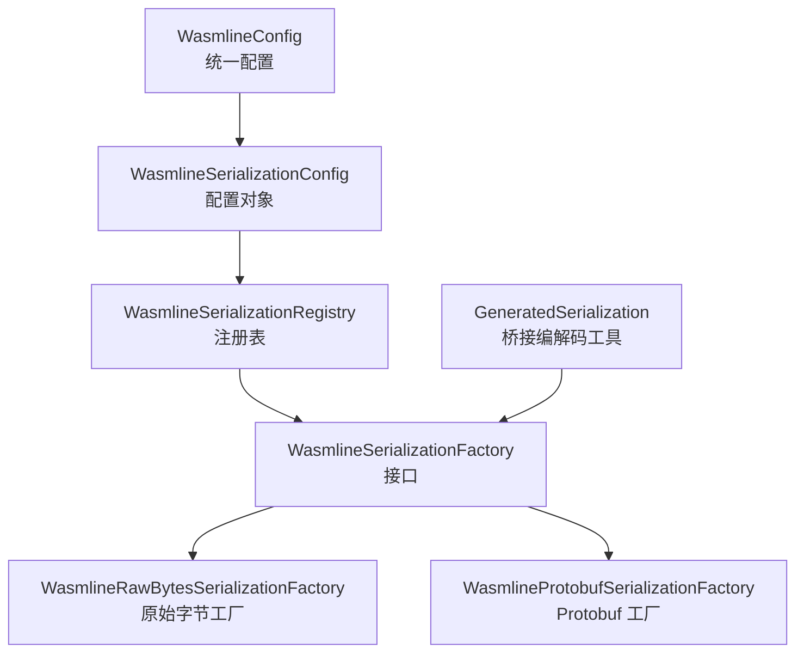
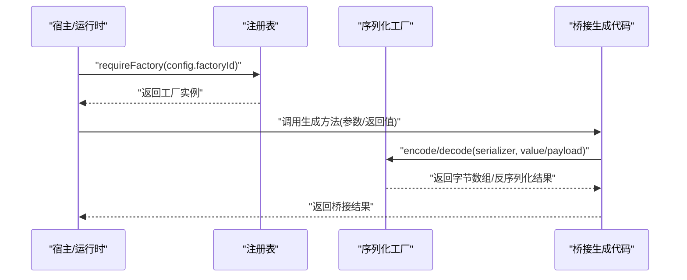
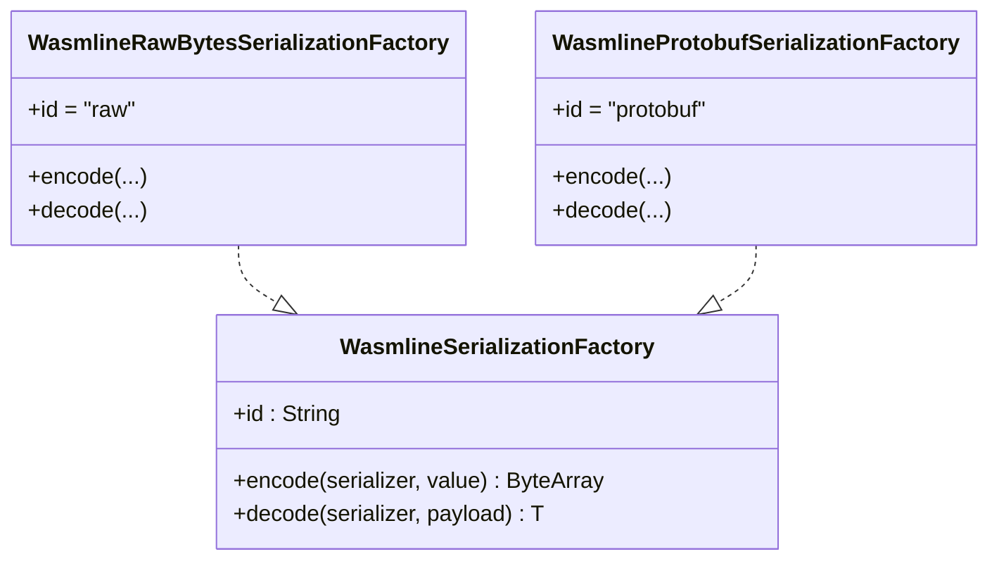
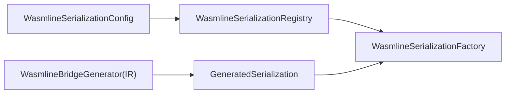

# 序列化系统

<cite>
**本文引用的文件**
- [WasmlineSerializationConfig.kt](file://wasmline-multiplatform/wasmline/src/commonMain/kotlin/crow/wasmline/serialization/WasmlineSerializationConfig.kt)
- [WasmlineSerializationFactory.kt](file://wasmline-multiplatform/wasmline/src/commonMain/kotlin/crow/wasmline/serialization/WasmlineSerializationFactory.kt)
- [WasmlineSerializationRegistry.kt](file://wasmline-multiplatform/wasmline/src/commonMain/kotlin/crow/wasmline/serialization/WasmlineSerializationRegistry.kt)
- [GeneratedSerialization.kt](file://wasmline-multiplatform/wasmline/src/commonMain/kotlin/crow/wasmline/internal/bridge/GeneratedSerialization.kt)
- [WasmlineConfig.kt](file://wasmline-multiplatform/wasmline/src/commonMain/kotlin/crow/wasmline/WasmlineConfig.kt)
- [WasmlineSerializationConfigTest.kt](file://wasmline-multiplatform/wasmline/src/commonTest/kotlin/crow/wasmline/WasmlineSerializationConfigTest.kt)
- [WasmlineBridgeGenerator.kt](file://wasmline-multiplatform/wasmline-kotlin-plugin/src/main/kotlin/crow/wasmline/kotlin/WasmlineBridgeGenerator.kt)
- [WasmlineRuntimeSymbols.kt](file://wasmline-multiplatform/wasmline-kotlin-plugin/src/main/kotlin/crow/wasmline/kotlin/WasmlineRuntimeSymbols.kt)
</cite>

## 目录
1. [简介](#简介)
2. [项目结构](#项目结构)
3. [核心组件](#核心组件)
4. [架构总览](#架构总览)
5. [组件详解](#组件详解)
6. [依赖关系分析](#依赖关系分析)
7. [性能与内存优化](#性能与内存优化)
8. [故障排查指南](#故障排查指南)
9. [结论](#结论)
10. [附录：使用与扩展指南](#附录使用与扩展指南)

## 简介
本文件面向 Wasmline 多平台序列化系统，聚焦于序列化配置、工厂与注册表的架构设计，以及内置序列化器（Protobuf、原始字节）的工作原理。文档同时覆盖序列化工厂的扩展机制、跨语言传输中的角色与限制、性能优化策略与最佳实践，并提供面向开发者的使用与扩展指导。

## 项目结构
序列化系统位于多平台模块的公共源码中，核心文件组织如下：
- 配置层：WasmlineSerializationConfig 负责声明序列化工厂标识与可选参数
- 工厂层：WasmlineSerializationFactory 接口及内置实现（raw、protobuf）
- 注册层：WasmlineSerializationRegistry 提供工厂注册与检索
- 桥接层：GeneratedSerialization 在桥接调用中使用工厂进行编解码
- 配置入口：WasmlineConfig 将序列化配置作为模块加载的关键参数之一

图表来源
- [WasmlineSerializationConfig.kt:11-39](file://wasmline-multiplatform/wasmline/src/commonMain/kotlin/crow/wasmline/serialization/WasmlineSerializationConfig.kt#L11-L39)
- [WasmlineSerializationRegistry.kt:3-20](file://wasmline-multiplatform/wasmline/src/commonMain/kotlin/crow/wasmline/serialization/WasmlineSerializationRegistry.kt#L3-L20)
- [WasmlineSerializationFactory.kt:16-57](file://wasmline-multiplatform/wasmline/src/commonMain/kotlin/crow/wasmline/serialization/WasmlineSerializationFactory.kt#L16-L57)
- [GeneratedSerialization.kt:8-22](file://wasmline-multiplatform/wasmline/src/commonMain/kotlin/crow/wasmline/internal/bridge/GeneratedSerialization.kt#L8-L22)
- [WasmlineConfig.kt:18-24](file://wasmline-multiplatform/wasmline/src/commonMain/kotlin/crow/wasmline/WasmlineConfig.kt#L18-L24)

章节来源
- [WasmlineSerializationConfig.kt:11-39](file://wasmline-multiplatform/wasmline/src/commonMain/kotlin/crow/wasmline/serialization/WasmlineSerializationConfig.kt#L11-L39)
- [WasmlineSerializationRegistry.kt:3-20](file://wasmline-multiplatform/wasmline/src/commonMain/kotlin/crow/wasmline/serialization/WasmlineSerializationRegistry.kt#L3-L20)
- [WasmlineSerializationFactory.kt:16-57](file://wasmline-multiplatform/wasmline/src/commonMain/kotlin/crow/wasmline/serialization/WasmlineSerializationFactory.kt#L16-L57)
- [GeneratedSerialization.kt:8-22](file://wasmline-multiplatform/wasmline/src/commonMain/kotlin/crow/wasmline/internal/bridge/GeneratedSerialization.kt#L8-L22)
- [WasmlineConfig.kt:18-24](file://wasmline-multiplatform/wasmline/src/commonMain/kotlin/crow/wasmline/WasmlineConfig.kt#L18-L24)

## 核心组件
- WasmlineSerializationConfig：声明模块级序列化工厂标识与可选参数；提供便捷工厂方法（rawBytes、protobuf、custom），用于快速构建配置。
- WasmlineSerializationFactory：序列化工厂接口，定义 encode/decode 两个核心能力；内置 raw 与 protobuf 两种实现。
- WasmlineSerializationRegistry：进程内工厂注册表，负责内置工厂的初始化、注册与按 id 获取。
- GeneratedSerialization：桥接层工具函数，基于工厂对生成的值进行编解码，简化桥接端的调用。
- WasmlineConfig：统一配置对象，包含 serialization 字段，默认使用 Protobuf 工厂。

章节来源
- [WasmlineSerializationConfig.kt:11-39](file://wasmline-multiplatform/wasmline/src/commonMain/kotlin/crow/wasmline/serialization/WasmlineSerializationConfig.kt#L11-L39)
- [WasmlineSerializationFactory.kt:16-57](file://wasmline-multiplatform/wasmline/src/commonMain/kotlin/crow/wasmline/serialization/WasmlineSerializationFactory.kt#L16-L57)
- [WasmlineSerializationRegistry.kt:3-20](file://wasmline-multiplatform/wasmline/src/commonMain/kotlin/crow/wasmline/serialization/WasmlineSerializationRegistry.kt#L3-L20)
- [GeneratedSerialization.kt:8-22](file://wasmline-multiplatform/wasmline/src/commonMain/kotlin/crow/wasmline/internal/bridge/GeneratedSerialization.kt#L8-L22)
- [WasmlineConfig.kt:18-24](file://wasmline-multiplatform/wasmline/src/commonMain/kotlin/crow/wasmline/WasmlineConfig.kt#L18-L24)

## 架构总览
序列化系统采用“配置驱动 + 工厂抽象 + 注册表分发”的架构：
- 配置层通过工厂标识与选项声明序列化策略
- 运行时根据配置从注册表解析出具体工厂实例
- 桥接层在调用生成代码时，通过工厂完成类型安全的编解码
- 内置工厂直接对接 kotlinx.serialization（ProtoBuf）或原生字节流

图表来源
- [WasmlineSerializationRegistry.kt:13-19](file://wasmline-multiplatform/wasmline/src/commonMain/kotlin/crow/wasmline/serialization/WasmlineSerializationRegistry.kt#L13-L19)
- [GeneratedSerialization.kt:9-22](file://wasmline-multiplatform/wasmline/src/commonMain/kotlin/crow/wasmline/internal/bridge/GeneratedSerialization.kt#L9-L22)
- [WasmlineSerializationFactory.kt:16-22](file://wasmline-multiplatform/wasmline/src/commonMain/kotlin/crow/wasmline/serialization/WasmlineSerializationFactory.kt#L16-L22)

## 组件详解

### 配置层：WasmlineSerializationConfig
- 职责：承载模块级序列化配置，仅在宿主/运行时侧保存；插件侧通过 Wasmline.get() 配置本地工厂。
- 关键字段：
  - factoryId：工厂标识字符串
  - options：键值对选项，用于向工厂传递额外参数
- 工厂方法：
  - rawBytes(...)：快速指定 raw 工厂
  - protobuf(...)：快速指定 protobuf 工厂
  - custom(factoryId, options)：自定义工厂标识
- 默认行为：WasmlineConfig.serialization 默认使用 protobuf 工厂

章节来源
- [WasmlineSerializationConfig.kt:11-39](file://wasmline-multiplatform/wasmline/src/commonMain/kotlin/crow/wasmline/serialization/WasmlineSerializationConfig.kt#L11-L39)
- [WasmlineConfig.kt:18-24](file://wasmline-multiplatform/wasmline/src/commonMain/kotlin/crow/wasmline/WasmlineConfig.kt#L18-L24)

### 工厂层：WasmlineSerializationFactory 及内置实现
- 接口职责：定义 encode/decode 两个泛型方法，接收 KSerializer 与值/字节数组
- 内置工厂：
  - raw（id="raw"）：仅支持 ByteArray 与 Unit 类型；对其他类型抛出错误
  - protobuf（id="protobuf"）：基于 kotlinx.serialization 的 ProtoBuf 编解码

图表来源
- [WasmlineSerializationFactory.kt:16-57](file://wasmline-multiplatform/wasmline/src/commonMain/kotlin/crow/wasmline/serialization/WasmlineSerializationFactory.kt#L16-L57)

章节来源
- [WasmlineSerializationFactory.kt:16-57](file://wasmline-multiplatform/wasmline/src/commonMain/kotlin/crow/wasmline/serialization/WasmlineSerializationFactory.kt#L16-L57)

### 注册层：WasmlineSerializationRegistry
- 职责：维护工厂映射，提供注册、按 id 查询与强制获取能力
- 行为：
  - 初始化内置工厂（raw、protobuf）
  - register(factory)：注册自定义工厂
  - factoryOrNull(id)：查询工厂（可能为空）
  - requireFactory(id)：不存在时抛出明确异常

章节来源
- [WasmlineSerializationRegistry.kt:3-20](file://wasmline-multiplatform/wasmline/src/commonMain/kotlin/crow/wasmline/serialization/WasmlineSerializationRegistry.kt#L3-L20)

### 桥接层：GeneratedSerialization
- 职责：在桥接生成代码中，基于工厂对值进行编码与解码
- 关键函数：
  - encodeGeneratedValue(factory, value)：对生成值进行编码
  - decodeGeneratedValue(factory, payload)：对传入负载进行解码

章节来源
- [GeneratedSerialization.kt:8-22](file://wasmline-multiplatform/wasmline/src/commonMain/kotlin/crow/wasmline/internal/bridge/GeneratedSerialization.kt#L8-L22)

### 配置入口：WasmlineConfig
- 职责：统一装载与运行配置，其中 serialization 字段默认指向 protobuf 工厂
- 影响：决定模块加载后桥接层默认使用的工厂

章节来源
- [WasmlineConfig.kt:18-24](file://wasmline-multiplatform/wasmline/src/commonMain/kotlin/crow/wasmline/WasmlineConfig.kt#L18-L24)

### 测试验证：配置与注册行为
- 测试覆盖：
  - protobuf 配置携带正确的工厂 id 与 options
  - 默认配置指向 protobuf 工厂
  - 内置工厂已注册并可通过注册表获取

章节来源
- [WasmlineSerializationConfigTest.kt:13-41](file://wasmline-multiplatform/wasmline/src/commonTest/kotlin/crow/wasmline/WasmlineSerializationConfigTest.kt#L13-L41)

### 编译期桥接生成与工厂注入
- 编译器插件在生成桥接代码时，会注入序列化工厂字段，并在调用路径上使用工厂进行编解码
- 插件符号引用：包含 generatedSerializationFactory 与 currentGeneratedSerializationFactory 等符号，用于在 IR 层注入工厂

章节来源
- [WasmlineBridgeGenerator.kt:252-274](file://wasmline-multiplatform/wasmline-kotlin-plugin/src/main/kotlin/crow/wasmline/kotlin/WasmlineBridgeGenerator.kt#L252-L274)
- [WasmlineRuntimeSymbols.kt:117-129](file://wasmline-multiplatform/wasmline-kotlin-plugin/src/main/kotlin/crow/wasmline/kotlin/WasmlineRuntimeSymbols.kt#L117-L129)

## 依赖关系分析
- 配置到注册表：配置中的 factoryId 由注册表解析为具体工厂实例
- 工厂到桥接：桥接层通过工厂完成编解码，避免跨边界传递工厂对象
- 插件生成：编译器插件在桥接类构造阶段注入序列化工厂字段，确保运行时可用

图表来源
- [WasmlineSerializationConfig.kt:11-39](file://wasmline-multiplatform/wasmline/src/commonMain/kotlin/crow/wasmline/serialization/WasmlineSerializationConfig.kt#L11-L39)
- [WasmlineSerializationRegistry.kt:3-20](file://wasmline-multiplatform/wasmline/src/commonMain/kotlin/crow/wasmline/serialization/WasmlineSerializationRegistry.kt#L3-L20)
- [WasmlineSerializationFactory.kt:16-57](file://wasmline-multiplatform/wasmline/src/commonMain/kotlin/crow/wasmline/serialization/WasmlineSerializationFactory.kt#L16-L57)
- [GeneratedSerialization.kt:8-22](file://wasmline-multiplatform/wasmline/src/commonMain/kotlin/crow/wasmline/internal/bridge/GeneratedSerialization.kt#L8-L22)
- [WasmlineBridgeGenerator.kt:513-548](file://wasmline-multiplatform/wasmline-kotlin-plugin/src/main/kotlin/crow/wasmline/kotlin/WasmlineBridgeGenerator.kt#L513-L548)

章节来源
- [WasmlineSerializationRegistry.kt:3-20](file://wasmline-multiplatform/wasmline/src/commonMain/kotlin/crow/wasmline/serialization/WasmlineSerializationRegistry.kt#L3-L20)
- [GeneratedSerialization.kt:8-22](file://wasmline-multiplatform/wasmline/src/commonMain/kotlin/crow/wasmline/internal/bridge/GeneratedSerialization.kt#L8-L22)
- [WasmlineBridgeGenerator.kt:513-548](file://wasmline-multiplatform/wasmline-kotlin-plugin/src/main/kotlin/crow/wasmline/kotlin/WasmlineBridgeGenerator.kt#L513-L548)

## 性能与内存优化
- 工厂选择
  - Protobuf：通用、跨语言友好，适合复杂结构体；编码/解码开销适中
  - 原始字节（raw）：仅支持 ByteArray 与 Unit，零拷贝路径，适合二进制高效通道
- 编解码路径
  - 使用编译期生成的 serializer<T>()，避免反射带来的额外开销
  - 桥接层直接复用工厂，减少中间封装
- 内存管理
  - 优先复用字节数组生命周期，避免不必要的复制
  - 对大对象尽量保持字节流直通，减少中间对象分配
- 并发与缓存
  - 若启用并发加载，注意序列化配置与工厂实例的线程安全性（默认工厂为单例）

[本节为通用性能建议，不直接分析具体文件]

## 故障排查指南
- 工厂未注册
  - 现象：requireFactory 抛出“未注册”异常
  - 处理：确认工厂是否通过 register 注册，或使用内置 id
- raw 工厂类型不支持
  - 现象：对非 ByteArray/Unit 类型调用 raw 编解码抛错
  - 处理：改用 protobuf 或自定义工厂支持对应类型
- 默认配置差异
  - 现象：默认使用 protobuf，若期望 raw 需显式配置
  - 处理：在 WasmlineConfig.serialization 中设置 rawBytes()

章节来源
- [WasmlineSerializationRegistry.kt:15-19](file://wasmline-multiplatform/wasmline/src/commonMain/kotlin/crow/wasmline/serialization/WasmlineSerializationRegistry.kt#L15-L19)
- [WasmlineSerializationFactory.kt:59-63](file://wasmline-multiplatform/wasmline/src/commonMain/kotlin/crow/wasmline/serialization/WasmlineSerializationFactory.kt#L59-L63)
- [WasmlineSerializationConfigTest.kt:23-29](file://wasmline-multiplatform/wasmline/src/commonTest/kotlin/crow/wasmline/WasmlineSerializationConfigTest.kt#L23-L29)

## 结论
Wasmline 序列化系统通过“配置 + 工厂 + 注册表 + 桥接”的清晰分层，实现了跨语言桥接通信的类型安全与可扩展性。默认 Protobuf 提供良好的通用性与跨语言互操作，raw 工厂则满足高性能二进制场景。通过注册表与编译期注入，系统在保证易用的同时兼顾了性能与可维护性。

[本节为总结性内容，不直接分析具体文件]

## 附录：使用与扩展指南

### 数据格式选择与版本兼容
- Protobuf：推荐用于复杂结构体与跨语言互通；通过 options 可扩展元信息（如 schema 版本键值）
- 原始字节：适用于已知二进制协议或对延迟敏感的场景；需自行保证类型一致性
- 版本兼容：建议在 options 中携带 schema 版本，服务端/客户端协商一致后再切换

章节来源
- [WasmlineSerializationConfig.kt:16-38](file://wasmline-multiplatform/wasmline/src/commonMain/kotlin/crow/wasmline/serialization/WasmlineSerializationConfig.kt#L16-L38)

### 错误处理与健壮性
- 显式校验工厂 id 是否注册
- 对 raw 工厂限定类型范围，避免运行时类型不匹配
- 在桥接层捕获并转换底层编解码异常，提供上下文信息

章节来源
- [WasmlineSerializationRegistry.kt:15-19](file://wasmline-multiplatform/wasmline/src/commonMain/kotlin/crow/wasmline/serialization/WasmlineSerializationRegistry.kt#L15-L19)
- [WasmlineSerializationFactory.kt:59-63](file://wasmline-multiplatform/wasmline/src/commonMain/kotlin/crow/wasmline/serialization/WasmlineSerializationFactory.kt#L59-L63)

### 跨语言传输的角色与限制
- 角色：作为桥接层的编解码实现，确保不同语言/平台间的数据交换
- 限制：raw 工厂仅支持 ByteArray/Unit；Protobuf 依赖双方对 schema 的共识
- 建议：跨语言优先使用 Protobuf，并在 manifest 中声明 schema 元信息

章节来源
- [WasmlineSerializationFactory.kt:24-45](file://wasmline-multiplatform/wasmline/src/commonMain/kotlin/crow/wasmline/serialization/WasmlineSerializationFactory.kt#L24-L45)

### 自定义序列化器的注册与使用
- 注册：通过注册表的 register(factory) 注册自定义工厂
- 使用：在配置中使用 custom(factoryId, options) 指定自定义工厂
- 注意：确保工厂 id 唯一且与运行时解析一致

章节来源
- [WasmlineSerializationRegistry.kt:9-11](file://wasmline-multiplatform/wasmline/src/commonMain/kotlin/crow/wasmline/serialization/WasmlineSerializationRegistry.kt#L9-L11)
- [WasmlineSerializationConfig.kt:31-37](file://wasmline-multiplatform/wasmline/src/commonMain/kotlin/crow/wasmline/serialization/WasmlineSerializationConfig.kt#L31-L37)

### 开发者使用步骤
- 选择格式：在 WasmlineConfig.serialization 中设置 rawBytes()/protobuf()/custom()
- 注册自定义工厂（如需）：调用注册表 register()
- 运行时解析：通过注册表按 factoryId 获取工厂
- 桥接调用：编译器插件自动注入工厂，桥接层使用工厂完成编解码

章节来源
- [WasmlineConfig.kt:18-24](file://wasmline-multiplatform/wasmline/src/commonMain/kotlin/crow/wasmline/WasmlineConfig.kt#L18-L24)
- [WasmlineSerializationRegistry.kt:13-19](file://wasmline-multiplatform/wasmline/src/commonMain/kotlin/crow/wasmline/serialization/WasmlineSerializationRegistry.kt#L13-L19)
- [WasmlineBridgeGenerator.kt:513-548](file://wasmline-multiplatform/wasmline-kotlin-plugin/src/main/kotlin/crow/wasmline/kotlin/WasmlineBridgeGenerator.kt#L513-L548)