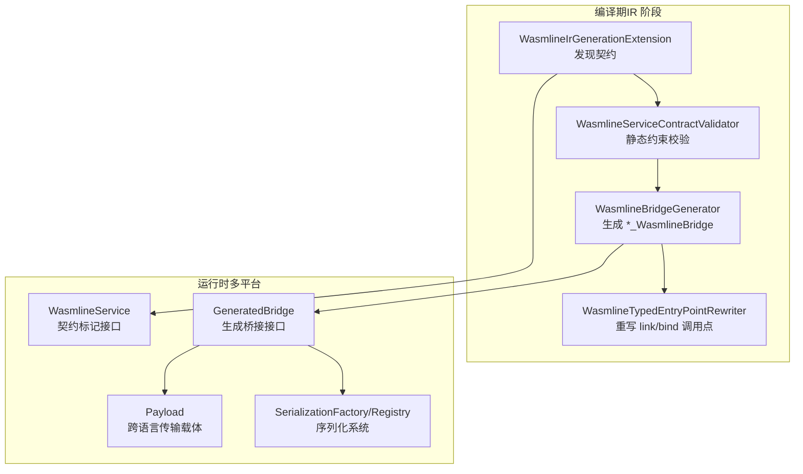
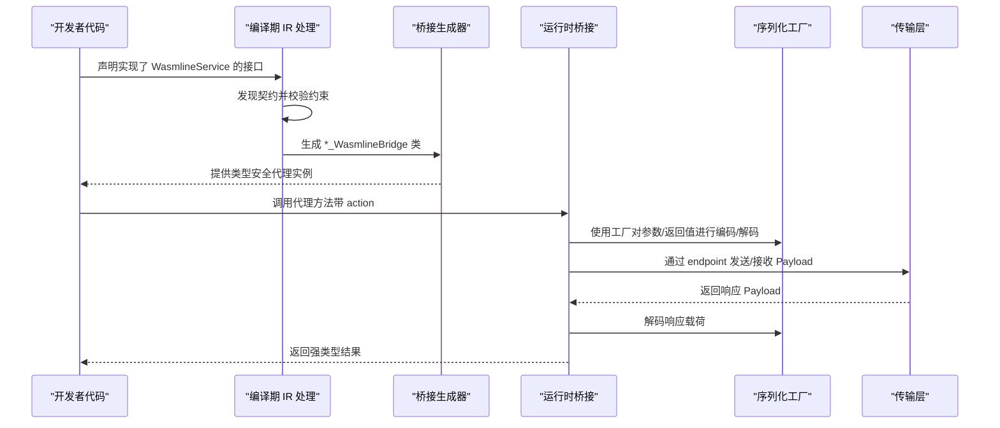
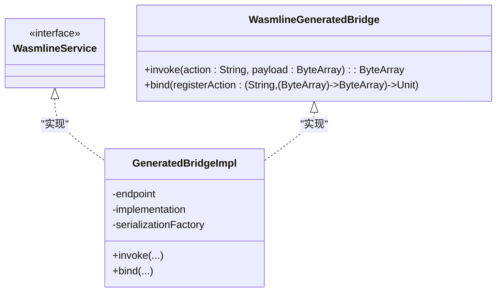
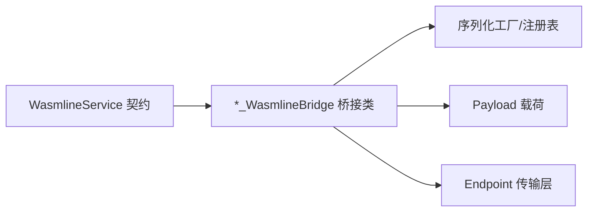

# 服务契约与桥接

<cite>
**本文引用的文件**
- [WasmlineService.kt](file://wasmline-multiplatform/wasmline/src/commonMain/kotlin/crow/wasmline/WasmlineService.kt)
- [GeneratedBridge.kt](file://wasmline-multiplatform/wasmline/src/commonMain/kotlin/crow/wasmline/internal/bridge/GeneratedBridge.kt)
- [Payload.kt](file://wasmline-multiplatform/wasmline/src/commonMain/kotlin/crow/wasmline/internal/bridge/Payload.kt)
- [WasmlineSerializationFactory.kt](file://wasmline-multiplatform/wasmline/src/commonMain/kotlin/crow/wasmline/serialization/WasmlineSerializationFactory.kt)
- [WasmlineSerializationConfig.kt](file://wasmline-multiplatform/wasmline/src/commonMain/kotlin/crow/wasmline/serialization/WasmlineSerializationConfig.kt)
- [WasmlineSerializationRegistry.kt](file://wasmline-multiplatform/wasmline/src/commonMain/kotlin/crow/wasmline/serialization/WasmlineSerializationRegistry.kt)
- [WasmlineBridgeGenerator.kt](file://wasmline-multiplatform/wasmline-kotlin-plugin/src/main/kotlin/crow/wasmline/kotlin/WasmlineBridgeGenerator.kt)
- [WasmlineServiceContractValidator.kt](file://wasmline-multiplatform/wasmline-kotlin-plugin/src/main/kotlin/crow/wasmline/kotlin/WasmlineServiceContractValidator.kt)
- [WasmlineIrGenerationExtension.kt](file://wasmline-multiplatform/wasmline-kotlin-plugin/src/main/kotlin/crow/wasmline/kotlin/WasmlineIrGenerationExtension.kt)
- [WasmlineTypedEntryPointRewriter.kt](file://wasmline-multiplatform/wasmline-kotlin-plugin/src/main/kotlin/crow/wasmline/kotlin/WasmlineTypedEntryPointRewriter.kt)
- [README.md](file://README.md)
- [README_zh.md](file://README_zh.md)
</cite>

## 目录
1. [引言](#引言)
2. [项目结构](#项目结构)
3. [核心组件](#核心组件)
4. [架构总览](#架构总览)
5. [详细组件分析](#详细组件分析)
6. [依赖关系分析](#依赖关系分析)
7. [性能考量](#性能考量)
8. [故障排查指南](#故障排查指南)
9. [结论](#结论)
10. [附录](#附录)

## 引言
本文件面向服务开发者，系统阐述 Wasmline 的“服务契约与桥接”机制：从服务契约的设计原则与编译期约束，到桥接生成与类型安全代理的构建，再到序列化系统与 Payload 跨语言传输模型。文档同时提供最佳实践与排障建议，帮助你在多平台（JVM、Android、iOS、JS、WASM）上以类型安全的方式构建跨语言服务。

## 项目结构
Wasmline 将“服务契约”与“桥接生成”分为运行时与编译期两部分：
- 运行时（commonMain）：定义服务契约标记接口、生成桥接接口、Payload 结构与序列化工厂/注册表。
- 编译期（kotlin 插件）：在 Kotlin IR 阶段发现契约、校验约束、生成桥接类，并重写调用点为直接桥接实例。

图表来源
- [WasmlineIrGenerationExtension.kt](file://wasmline-multiplatform/wasmline-kotlin-plugin/src/main/kotlin/crow/wasmline/kotlin/WasmlineIrGenerationExtension.kt)
- [WasmlineServiceContractValidator.kt](file://wasmline-multiplatform/wasmline-kotlin-plugin/src/main/kotlin/crow/wasmline/kotlin/WasmlineServiceContractValidator.kt)
- [WasmlineBridgeGenerator.kt](file://wasmline-multiplatform/wasmline-kotlin-plugin/src/main/kotlin/crow/wasmline/kotlin/WasmlineBridgeGenerator.kt)
- [WasmlineTypedEntryPointRewriter.kt](file://wasmline-multiplatform/wasmline-kotlin-plugin/src/main/kotlin/crow/wasmline/kotlin/WasmlineTypedEntryPointRewriter.kt)
- [WasmlineService.kt](file://wasmline-multiplatform/wasmline/src/commonMain/kotlin/crow/wasmline/WasmlineService.kt)
- [GeneratedBridge.kt](file://wasmline-multiplatform/wasmline/src/commonMain/kotlin/crow/wasmline/internal/bridge/GeneratedBridge.kt)
- [Payload.kt](file://wasmline-multiplatform/wasmline/src/commonMain/kotlin/crow/wasmline/internal/bridge/Payload.kt)
- [WasmlineSerializationFactory.kt](file://wasmline-multiplatform/wasmline/src/commonMain/kotlin/crow/wasmline/serialization/WasmlineSerializationFactory.kt)

章节来源
- [README.md:540-570](file://README.md#L540-L570)
- [README_zh.md:516-530](file://README_zh.md#L516-L530)

## 核心组件
- 服务契约标记接口：用于标识“可被桥接”的接口，限定为 public 接口，禁止 suspend、泛型、默认参数、vararg、重载等。
- 生成桥接接口：由编译器生成，作为“已链接代理（调用转发）+ 已绑定分发器（action->实现）”的统一载体。
- Payload：承载 action 与二进制载荷的跨语言数据结构。
- 序列化系统：内置工厂与注册表，支持 reified serializer 的编码/解码。

章节来源
- [WasmlineService.kt:4-24](file://wasmline-multiplatform/wasmline/src/commonMain/kotlin/crow/wasmline/WasmlineService.kt#L4-L24)
- [GeneratedBridge.kt:5-17](file://wasmline-multiplatform/wasmline/src/commonMain/kotlin/crow/wasmline/internal/bridge/GeneratedBridge.kt#L5-L17)
- [Payload.kt](file://wasmline-multiplatform/wasmline/src/commonMain/kotlin/crow/wasmline/internal/bridge/Payload.kt)
- [WasmlineSerializationFactory.kt](file://wasmline-multiplatform/wasmline/src/commonMain/kotlin/crow/wasmline/serialization/WasmlineSerializationFactory.kt)
- [WasmlineSerializationConfig.kt](file://wasmline-multiplatform/wasmline/src/commonMain/kotlin/crow/wasmline/serialization/WasmlineSerializationConfig.kt)
- [WasmlineSerializationRegistry.kt](file://wasmline-multiplatform/wasmline/src/commonMain/kotlin/crow/wasmline/serialization/WasmlineSerializationRegistry.kt)

## 架构总览
下图展示了从“服务契约声明”到“类型安全代理调用”的端到端流程，以及序列化与 Payload 的参与位置。

图表来源
- [WasmlineIrGenerationExtension.kt](file://wasmline-multiplatform/wasmline-kotlin-plugin/src/main/kotlin/crow/wasmline/kotlin/WasmlineIrGenerationExtension.kt)
- [WasmlineServiceContractValidator.kt](file://wasmline-multiplatform/wasmline-kotlin-plugin/src/main/kotlin/crow/wasmline/kotlin/WasmlineServiceContractValidator.kt)
- [WasmlineBridgeGenerator.kt](file://wasmline-multiplatform/wasmline-kotlin-plugin/src/main/kotlin/crow/wasmline/kotlin/WasmlineBridgeGenerator.kt)
- [WasmlineTypedEntryPointRewriter.kt](file://wasmline-multiplatform/wasmline-kotlin-plugin/src/main/kotlin/crow/wasmline/kotlin/WasmlineTypedEntryPointRewriter.kt)
- [GeneratedBridge.kt](file://wasmline-multiplatform/wasmline/src/commonMain/kotlin/crow/wasmline/internal/bridge/GeneratedBridge.kt)
- [WasmlineSerializationFactory.kt](file://wasmline-multiplatform/wasmline/src/commonMain/kotlin/crow/wasmline/serialization/WasmlineSerializationFactory.kt)

## 详细组件分析

### 服务契约与约束（WasmlineService）
- 设计目的：通过标记接口约束服务契约的形态，确保编译期可验证、运行期可桥接。
- 关键约束（编译期强制）：
  - 必须为 interface；禁止抽象类、密封类、object。
  - 成员必须为 public 函数；禁止属性、扩展函数/属性。
  - 不支持 suspend、泛型、默认参数、vararg、方法重载。
  - 每个函数最多一个常规参数。
- 作用：作为编译器插件的入口，驱动后续发现、校验、生成与重写。

章节来源
- [WasmlineService.kt:4-24](file://wasmline-multiplatform/wasmline/src/commonMain/kotlin/crow/wasmline/WasmlineService.kt#L4-L24)
- [README_zh.md:516-530](file://README_zh.md#L516-L530)
- [README.md:555-570](file://README.md#L555-L570)

### 编译期：契约发现与约束校验
- 发现阶段：遍历所有 IR 声明容器，收集继承链包含 WasmlineService 的接口。
- 校验阶段：逐条检查上述约束，任一违规即报错并中止 IR 生成。
- 输出：记录诊断信息，供开发者定位问题。

章节来源
- [WasmlineIrGenerationExtension.kt](file://wasmline-multiplatform/wasmline-kotlin-plugin/src/main/kotlin/crow/wasmline/kotlin/WasmlineIrGenerationExtension.kt)
- [WasmlineServiceContractValidator.kt:27-88](file://wasmline-multiplatform/wasmline-kotlin-plugin/src/main/kotlin/crow/wasmline/kotlin/WasmlineServiceContractValidator.kt#L27-L88)

### 编译期：桥接生成与调用点重写
- 桥接生成：为每个有效契约生成一个内部桥接类，实现生成桥接接口，包含 endpoint、implementation、serializationFactory 字段，以及构造与分发逻辑。
- 调用点重写：将 link<T>()、bind(contract, impl)、bind(impl) 的调用点替换为直接桥接实例化表达式，消除反射与动态分发开销。
- 生成桥接接口：定义 invoke(action, payload) 与 bind(...)，作为代理与分发器的统一契约。

图表来源
- [WasmlineService.kt:4-24](file://wasmline-multiplatform/wasmline/src/commonMain/kotlin/crow/wasmline/WasmlineService.kt#L4-L24)
- [GeneratedBridge.kt:12-17](file://wasmline-multiplatform/wasmline/src/commonMain/kotlin/crow/wasmline/internal/bridge/GeneratedBridge.kt#L12-L17)
- [WasmlineBridgeGenerator.kt:55-112](file://wasmline-multiplatform/wasmline-kotlin-plugin/src/main/kotlin/crow/wasmline/kotlin/WasmlineBridgeGenerator.kt#L55-L112)

章节来源
- [WasmlineBridgeGenerator.kt:52-112](file://wasmline-multiplatform/wasmline-kotlin-plugin/src/main/kotlin/crow/wasmline/kotlin/WasmlineBridgeGenerator.kt#L52-L112)
- [WasmlineTypedEntryPointRewriter.kt](file://wasmline-multiplatform/wasmline-kotlin-plugin/src/main/kotlin/crow/wasmline/kotlin/WasmlineTypedEntryPointRewriter.kt)

### 运行时：桥接与分发
- 未链接桥接：若桥接未与 endpoint 绑定，调用会快速失败，提示编译器插件未正确替换 link()/bind()。
- 未知动作：当到达桥接的 action 未在已绑定实现中注册，触发未知动作错误。
- 实现要求：生成桥接在 bind 时需持有具体实现，否则调用时报错。

章节来源
- [GeneratedBridge.kt:21-43](file://wasmline-multiplatform/wasmline/src/commonMain/kotlin/crow/wasmline/internal/bridge/GeneratedBridge.kt#L21-L43)

### Payload 数据结构与跨语言传输
- 设计目标：统一 action 与二进制载荷的传输格式，便于多平台间解析与互操作。
- 使用方式：桥接在调用前将参数编码为字节数组，调用后将返回值按相同规则解码回强类型对象。

章节来源
- [Payload.kt](file://wasmline-multiplatform/wasmline/src/commonMain/kotlin/crow/wasmline/internal/bridge/Payload.kt)

### 序列化系统：内置工厂与注册表
- 工厂职责：提供基于 Kotlinx Serialization 的编码/解码能力，支持 reified serializer。
- 注册表：集中管理序列化配置与策略，便于扩展与定制。
- 内置行为：生成桥接在编码/解码时通过工厂完成，确保跨平台一致的序列化语义。

章节来源
- [WasmlineSerializationFactory.kt](file://wasmline-multiplatform/wasmline/src/commonMain/kotlin/crow/wasmline/serialization/WasmlineSerializationFactory.kt)
- [WasmlineSerializationRegistry.kt](file://wasmline-multiplatform/wasmline/src/commonMain/kotlin/crow/wasmline/serialization/WasmlineSerializationRegistry.kt)
- [WasmlineSerializationConfig.kt](file://wasmline-multiplatform/wasmline/src/commonMain/kotlin/crow/wasmline/serialization/WasmlineSerializationConfig.kt)
- [GeneratedSerialization.kt:8-22](file://wasmline-multiplatform/wasmline/src/commonMain/kotlin/crow/wasmline/internal/bridge/GeneratedSerialization.kt#L8-L22)

### 类型安全保证与编译时验证
- 类型安全：通过编译期 IR 重写，将 link()/bind() 的调用替换为具体桥接实例，避免运行期反射与动态查找。
- 约束编译：严格的契约约束在编译期强制执行，任何违规均导致编译失败，确保运行时行为可预测。
- 错误快速失败：未链接桥接与未知动作在运行时快速失败，便于早期定位问题。

章节来源
- [README.md:540-570](file://README.md#L540-L570)
- [README_zh.md:516-530](file://README_zh.md#L516-L530)
- [GeneratedBridge.kt:21-43](file://wasmline-multiplatform/wasmline/src/commonMain/kotlin/crow/wasmline/internal/bridge/GeneratedBridge.kt#L21-L43)

## 依赖关系分析
- 契约到桥接：每个 WasmlineService 契约对应一个 *_WasmlineBridge 实例，该实例既是代理又是分发器。
- 桥接到序列化：桥接通过序列化工厂对参数与返回值进行编码/解码。
- 桥接到传输：桥接通过 endpoint 发送/接收 Payload，完成跨语言通信。
- 编译期到运行时：编译期插件负责发现、校验、生成与重写，运行时仅负责执行。

图表来源
- [WasmlineService.kt:4-24](file://wasmline-multiplatform/wasmline/src/commonMain/kotlin/crow/wasmline/WasmlineService.kt#L4-L24)
- [WasmlineBridgeGenerator.kt:55-112](file://wasmline-multiplatform/wasmline-kotlin-plugin/src/main/kotlin/crow/wasmline/kotlin/WasmlineBridgeGenerator.kt#L55-L112)
- [GeneratedBridge.kt:12-17](file://wasmline-multiplatform/wasmline/src/commonMain/kotlin/crow/wasmline/internal/bridge/GeneratedBridge.kt#L12-L17)
- [WasmlineSerializationFactory.kt](file://wasmline-multiplatform/wasmline/src/commonMain/kotlin/crow/wasmline/serialization/WasmlineSerializationFactory.kt)
- [Payload.kt](file://wasmline-multiplatform/wasmline/src/commonMain/kotlin/crow/wasmline/internal/bridge/Payload.kt)

## 性能考量
- 零反射调用：编译期重写消除了运行时反射与动态查找，降低调用开销。
- 二进制序列化：Payload 采用二进制编码，减少序列化/反序列化成本与体积。
- 生成桥接复用：每个契约只生成一次桥接类，实例化成本低且可缓存。
- 平台适配：多平台共享同一序列化与桥接协议，减少重复实现与适配成本。

## 故障排查指南
- 编译失败：若契约违反约束（如 suspend、泛型、重载、默认参数等），请根据编译器诊断修正。
- 运行时错误：若出现“未链接桥接”或“未知动作”，检查是否正确调用 link()/bind()，确认 action 名称与实现注册一致。
- 序列化异常：若参数/返回值无法编码/解码，请确认类型具备可用的 serializer，或在注册表中补充自定义序列化器。

章节来源
- [GeneratedBridge.kt:21-43](file://wasmline-multiplatform/wasmline/src/commonMain/kotlin/crow/wasmline/internal/bridge/GeneratedBridge.kt#L21-L43)
- [WasmlineServiceContractValidator.kt:42-88](file://wasmline-multiplatform/wasmline-kotlin-plugin/src/main/kotlin/crow/wasmline/kotlin/WasmlineServiceContractValidator.kt#L42-L88)

## 结论
Wasmline 通过“严格契约 + 编译期 IR 变换 + 生成桥接 + 序列化工厂”的组合，实现了跨语言、多平台的服务调用与绑定。其设计在编译期强制约束，在运行期提供类型安全与高性能的代理与分发机制。遵循本文最佳实践，可显著提升服务开发的可靠性与可维护性。

## 附录

### 最佳实践清单
- 契约设计
  - 仅使用 public 函数，避免属性与扩展成员。
  - 每个函数最多一个常规参数，避免重载与默认参数。
  - 不使用 suspend、泛型、vararg。
- 参数与返回值
  - 使用 Kotlinx Serialization 支持的类型，确保 serializer 可用。
  - 对复杂对象进行显式序列化测试，覆盖边界场景。
- 错误处理
  - 在服务实现中明确区分业务错误与传输错误，必要时抛出可识别的异常。
  - 使用统一的错误码与消息格式，便于前端与日志系统消费。
- 命名约定
  - 契约接口以动词短语命名，体现服务语义（如 EchoService）。
  - action 名称与函数名保持一致，避免歧义。
- 版本与兼容
  - 为服务契约引入版本号，逐步演进并在注册表中保留向后兼容策略。
  - 对于破坏性变更，先提供过渡期的双实现或别名接口。

### 编译期约束速查
- 必须为 interface；禁止抽象类、密封类、object。
- 成员可见性：全部 public。
- 禁止：suspend、泛型、默认参数、vararg、重载、扩展函数/属性。
- 每函数参数数 ≤ 1。

章节来源
- [README_zh.md:516-530](file://README_zh.md#L516-L530)
- [README.md:555-570](file://README.md#L555-L570)