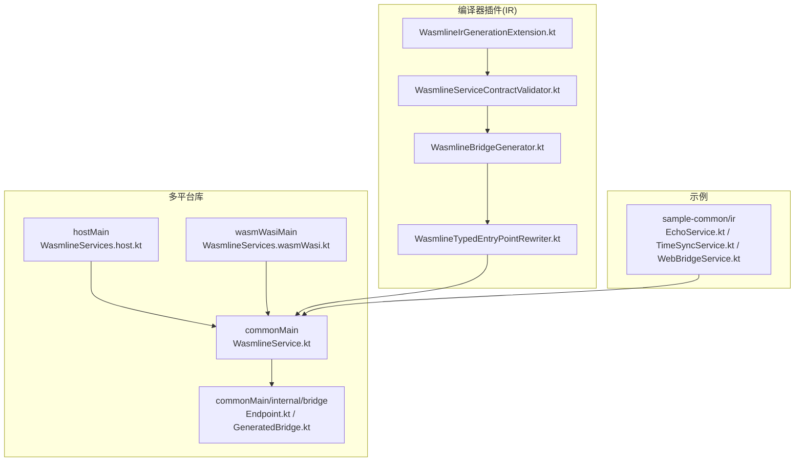
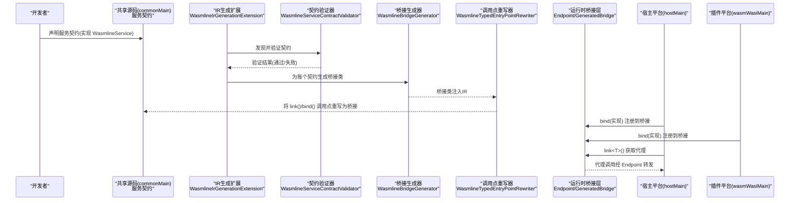
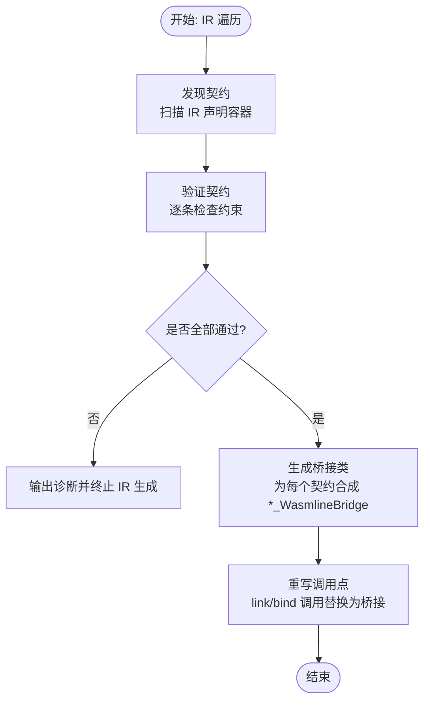
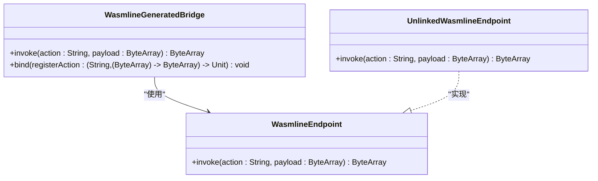
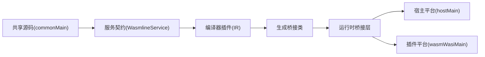

# 服务契约设计

<cite>
**本文引用的文件**
- [WasmlineService.kt](file://wasmline-multiplatform/wasmline/src/commonMain/kotlin/crow/wasmline/WasmlineService.kt)
- [WasmlineServiceContractValidator.kt](file://wasmline-multiplatform/wasmline-kotlin-plugin/src/main/kotlin/crow/wasmline/kotlin/WasmlineServiceContractValidator.kt)
- [Endpoint.kt](file://wasmline-multiplatform/wasmline/src/commonMain/kotlin/crow/wasmline/internal/bridge/Endpoint.kt)
- [GeneratedBridge.kt](file://wasmline-multiplatform/wasmline/src/commonMain/kotlin/crow/wasmline/internal/bridge/GeneratedBridge.kt)
- [WasmlineServices.host.kt](file://wasmline-multiplatform/wasmline/src/hostMain/kotlin/crow/wasmline/WasmlineServices.host.kt)
- [WasmlineServices.wasmWasi.kt](file://wasmline-multiplatform/wasmline/src/wasmWasiMain/kotlin/crow/wasmline/WasmlineServices.wasmWasi.kt)
- [EchoService.kt](file://wasmline-samples/kotlin/sample-common/src/commonMain/kotlin/crow/wasmline/sample/ir/EchoService.kt)
- [TimeSyncService.kt](file://wasmline-samples/kotlin/sample-common/src/commonMain/kotlin/crow/wasmline/sample/ir/TimeSyncService.kt)
- [WebBridgeService.kt](file://wasmline-samples/kotlin/sample-common/src/commonMain/kotlin/crow/wasmline/sample/ir/WebBridgeService.kt)
- [README.md](file://README.md)
- [README_zh.md](file://README_zh.md)
- [plan.md](file://.github/plans/plan.md)
- [WasmlineBridgeGenerator.kt](file://wasmline-multiplatform/wasmline-kotlin-plugin/src/main/kotlin/crow/wasmline/kotlin/WasmlineBridgeGenerator.kt)
- [WasmlineTypedEntryPointRewriter.kt](file://wasmline-multiplatform/wasmline-kotlin-plugin/src/main/kotlin/crow/wasmline/kotlin/WasmlineTypedEntryPointRewriter.kt)
- [WasmlineIrGenerationExtension.kt](file://wasmline-multiplatform/wasmline-kotlin-plugin/src/main/kotlin/crow/wasmline/kotlin/WasmlineIrGenerationExtension.kt)
- [WasmlineIrDiagnostics.kt](file://wasmline-multiplatform/wasmline-kotlin-plugin/src/main/kotlin/crow/wasmline/kotlin/WasmlineIrDiagnostics.kt)
</cite>

## 目录
1. [引言](#引言)
2. [项目结构](#项目结构)
3. [核心组件](#核心组件)
4. [架构总览](#架构总览)
5. [详细组件分析](#详细组件分析)
6. [依赖关系分析](#依赖关系分析)
7. [性能考量](#性能考量)
8. [故障排查指南](#故障排查指南)
9. [结论](#结论)
10. [附录](#附录)

## 引言
本文件面向 Wasmline 服务契约设计，系统阐述 WasmlineService 接口的设计原理、约束条件、声明方式与编译时验证机制，并说明其在 Kotlin 多平台环境下的兼容性与最佳实践。文档同时覆盖版本管理与向后兼容性考虑，以及常见问题与解决方案，帮助服务开发者高效、安全地设计与实现跨平台服务契约。

## 项目结构
Wasmline 的服务契约相关代码主要分布在以下位置：
- 核心接口与运行时桥接层：wasmline-multiplatform/wasmline/src/commonMain/kotlin/crow/wasmline 及其 internal/bridge 子包
- 编译器插件（IR 阶段）：wasmline-multiplatform/wasmline-kotlin-plugin/src/main/kotlin/crow/wasmline/kotlin
- 示例服务契约：wasmline-samples/kotlin/sample-common/src/commonMain/kotlin/crow/wasmline/sample/ir
- 平台绑定实现：hostMain 与 wasmWasiMain 下的对应文件
- 文档与计划：README.md、README_zh.md、.github/plans/plan.md

图表来源
- [WasmlineService.kt:1-25](file://wasmline-multiplatform/wasmline/src/commonMain/kotlin/crow/wasmline/WasmlineService.kt#L1-L25)
- [Endpoint.kt:1-8](file://wasmline-multiplatform/wasmline/src/commonMain/kotlin/crow/wasmline/internal/bridge/Endpoint.kt#L1-L8)
- [GeneratedBridge.kt:1-45](file://wasmline-multiplatform/wasmline/src/commonMain/kotlin/crow/wasmline/internal/bridge/GeneratedBridge.kt#L1-L45)
- [WasmlineServices.host.kt:36-62](file://wasmline-multiplatform/wasmline/src/hostMain/kotlin/crow/wasmline/WasmlineServices.host.kt#L36-L62)
- [WasmlineServices.wasmWasi.kt](file://wasmline-multiplatform/wasmline/src/wasmWasiMain/kotlin/crow/wasmline/WasmlineServices.wasmWasi.kt)
- [WasmlineIrGenerationExtension.kt](file://wasmline-multiplatform/wasmline-kotlin-plugin/src/main/kotlin/crow/wasmline/kotlin/WasmlineIrGenerationExtension.kt)
- [WasmlineServiceContractValidator.kt:1-200](file://wasmline-multiplatform/wasmline-kotlin-plugin/src/main/kotlin/crow/wasmline/kotlin/WasmlineServiceContractValidator.kt#L1-L200)
- [WasmlineBridgeGenerator.kt](file://wasmline-multiplatform/wasmline-kotlin-plugin/src/main/kotlin/crow/wasmline/kotlin/WasmlineBridgeGenerator.kt)
- [WasmlineTypedEntryPointRewriter.kt](file://wasmline-multiplatform/wasmline-kotlin-plugin/src/main/kotlin/crow/wasmline/kotlin/WasmlineTypedEntryPointRewriter.kt)
- [EchoService.kt](file://wasmline-samples/kotlin/sample-common/src/commonMain/kotlin/crow/wasmline/sample/ir/EchoService.kt)
- [TimeSyncService.kt](file://wasmline-samples/kotlin/sample-common/src/commonMain/kotlin/crow/wasmline/sample/ir/TimeSyncService.kt)
- [WebBridgeService.kt](file://wasmline-samples/kotlin/sample-common/src/commonMain/kotlin/crow/wasmline/sample/ir/WebBridgeService.kt)

章节来源
- [WasmlineService.kt:1-25](file://wasmline-multiplatform/wasmline/src/commonMain/kotlin/crow/wasmline/WasmlineService.kt#L1-L25)
- [WasmlineServiceContractValidator.kt:21-88](file://wasmline-multiplatform/wasmline-kotlin-plugin/src/main/kotlin/crow/wasmline/kotlin/WasmlineServiceContractValidator.kt#L21-L88)

## 核心组件
- WasmlineService：服务契约的标记接口，定义了服务契约的基本语义与约束范围。
- 编译器插件（IR 阶段）：负责发现、验证、桥接生成与调用点重写。
- 运行时桥接层：Endpoint 与 GeneratedBridge 定义了动作/载荷传输与生成桥接器的内部协议。
- 平台绑定实现：hostMain 与 wasmWasiMain 提供不同平台上的 bind/link 实现。
- 示例服务契约：EchoService、TimeSyncService、WebBridgeService 展示了典型契约定义与使用方式。

章节来源
- [WasmlineService.kt:4-24](file://wasmline-multiplatform/wasmline/src/commonMain/kotlin/crow/wasmline/WasmlineService.kt#L4-L24)
- [Endpoint.kt:3-7](file://wasmline-multiplatform/wasmline/src/commonMain/kotlin/crow/wasmline/internal/bridge/Endpoint.kt#L3-L7)
- [GeneratedBridge.kt:5-17](file://wasmline-multiplatform/wasmline/src/commonMain/kotlin/crow/wasmline/internal/bridge/GeneratedBridge.kt#L5-L17)
- [WasmlineServices.host.kt:36-62](file://wasmline-multiplatform/wasmline/src/hostMain/kotlin/crow/wasmline/WasmlineServices.host.kt#L36-L62)
- [WasmlineServices.wasmWasi.kt](file://wasmline-multiplatform/wasmline/src/wasmWasiMain/kotlin/crow/wasmline/WasmlineServices.wasmWasi.kt)
- [EchoService.kt](file://wasmline-samples/kotlin/sample-common/src/commonMain/kotlin/crow/wasmline/sample/ir/EchoService.kt)
- [TimeSyncService.kt](file://wasmline-samples/kotlin/sample-common/src/commonMain/kotlin/crow/wasmline/sample/ir/TimeSyncService.kt)
- [WebBridgeService.kt](file://wasmline-samples/kotlin/sample-common/src/commonMain/kotlin/crow/wasmline/sample/ir/WebBridgeService.kt)

## 架构总览
下图展示了服务契约从声明到运行时调用的关键流程：开发者在共享源码中声明服务契约，编译器插件在 IR 阶段完成发现、验证、桥接生成与调用点重写，最终在不同平台上通过 bind/link 完成注册与调用。

图表来源
- [WasmlineIrGenerationExtension.kt](file://wasmline-multiplatform/wasmline-kotlin-plugin/src/main/kotlin/crow/wasmline/kotlin/WasmlineIrGenerationExtension.kt)
- [WasmlineServiceContractValidator.kt:42-88](file://wasmline-multiplatform/wasmline-kotlin-plugin/src/main/kotlin/crow/wasmline/kotlin/WasmlineServiceContractValidator.kt#L42-L88)
- [WasmlineBridgeGenerator.kt](file://wasmline-multiplatform/wasmline-kotlin-plugin/src/main/kotlin/crow/wasmline/kotlin/WasmlineBridgeGenerator.kt)
- [WasmlineTypedEntryPointRewriter.kt](file://wasmline-multiplatform/wasmline-kotlin-plugin/src/main/kotlin/crow/wasmline/kotlin/WasmlineTypedEntryPointRewriter.kt)
- [Endpoint.kt:3-7](file://wasmline-multiplatform/wasmline/src/commonMain/kotlin/crow/wasmline/internal/bridge/Endpoint.kt#L3-L7)
- [GeneratedBridge.kt:12-17](file://wasmline-multiplatform/wasmline/src/commonMain/kotlin/crow/wasmline/internal/bridge/GeneratedBridge.kt#L12-L17)
- [WasmlineServices.host.kt:36-62](file://wasmline-multiplatform/wasmline/src/hostMain/kotlin/crow/wasmline/WasmlineServices.host.kt#L36-L62)
- [WasmlineServices.wasmWasi.kt](file://wasmline-multiplatform/wasmline/src/wasmWasiMain/kotlin/crow/wasmline/WasmlineServices.wasmWasi.kt)

## 详细组件分析

### WasmlineService 接口与契约约束
- 设计定位：WasmlineService 是所有服务契约的标记接口，用于限定契约必须为接口、成员应为公开函数等保守规则。
- 关键约束：
  - 成员必须为公开函数（非 suspend、无默认参数、无 vararg、无扩展接收者）
  - 不支持属性、泛型契约/函数、方法重载
  - 方法当前最多支持一个常规参数
  - 返回值与参数均不能为服务契约类型本身
- 作用机制：编译器插件在 IR 阶段扫描并验证这些约束，通过诊断信息反馈给开发者。

章节来源
- [WasmlineService.kt:4-24](file://wasmline-multiplatform/wasmline/src/commonMain/kotlin/crow/wasmline/WasmlineService.kt#L4-L24)
- [WasmlineServiceContractValidator.kt:53-136](file://wasmline-multiplatform/wasmline-kotlin-plugin/src/main/kotlin/crow/wasmline/kotlin/WasmlineServiceContractValidator.kt#L53-L136)

### 编译器插件：发现、验证、桥接与重写
- 发现阶段：遍历 IR 声明容器，收集继承自 WasmlineService 的接口声明。
- 验证阶段：对每个契约执行严格规则校验，输出诊断并终止 IR 生成（若存在违规）。
- 桥接生成：为每个有效契约生成内部桥接类，注入 IR 文件。
- 调用点重写：将 link<T>()、bind(contract, impl)、bind(impl) 的调用点直接替换为桥接表达式。

图表来源
- [WasmlineServiceContractValidator.kt:28-88](file://wasmline-multiplatform/wasmline-kotlin-plugin/src/main/kotlin/crow/wasmline/kotlin/WasmlineServiceContractValidator.kt#L28-L88)
- [WasmlineBridgeGenerator.kt](file://wasmline-multiplatform/wasmline-kotlin-plugin/src/main/kotlin/crow/wasmline/kotlin/WasmlineBridgeGenerator.kt)
- [WasmlineTypedEntryPointRewriter.kt](file://wasmline-multiplatform/wasmline-kotlin-plugin/src/main/kotlin/crow/wasmline/kotlin/WasmlineTypedEntryPointRewriter.kt)

章节来源
- [WasmlineServiceContractValidator.kt:21-88](file://wasmline-multiplatform/wasmline-kotlin-plugin/src/main/kotlin/crow/wasmline/kotlin/WasmlineServiceContractValidator.kt#L21-L88)
- [README.md:540-553](file://README.md#L540-L553)

### 运行时桥接层：Endpoint 与 GeneratedBridge
- WasmlineEndpoint：低层动作/载荷传输端点，定义了 action 与 payload 的调用约定。
- WasmlineGeneratedBridge：生成桥接器的内部运行时契约，既可作为链接代理，也可作为绑定分发器。
- 未链接保护：UnlinkedWasmlineEndpoint 在桥接未正确链接到传输端点时快速失败。
- 绑定实现校验：requireGeneratedImplementation 在缺少具体实现时快速失败。
- 未知动作保护：unknownGeneratedAction 对未知动作进行快速失败。

图表来源
- [Endpoint.kt:3-7](file://wasmline-multiplatform/wasmline/src/commonMain/kotlin/crow/wasmline/internal/bridge/Endpoint.kt#L3-L7)
- [GeneratedBridge.kt:12-44](file://wasmline-multiplatform/wasmline/src/commonMain/kotlin/crow/wasmline/internal/bridge/GeneratedBridge.kt#L12-L44)

章节来源
- [Endpoint.kt:3-7](file://wasmline-multiplatform/wasmline/src/commonMain/kotlin/crow/wasmline/internal/bridge/Endpoint.kt#L3-L7)
- [GeneratedBridge.kt:5-44](file://wasmline-multiplatform/wasmline/src/commonMain/kotlin/crow/wasmline/internal/bridge/GeneratedBridge.kt#L5-L44)

### 平台绑定实现：hostMain 与 wasmWasiMain
- hostMain：提供 link()/bind() 的占位实现，若编译器插件未生效会抛出明确错误提示，指导开发者检查插件应用状态。
- wasmWasiMain：提供插件侧的 bind/link 实现，与宿主侧形成统一的 API 使用形态。

章节来源
- [WasmlineServices.host.kt:36-62](file://wasmline-multiplatform/wasmline/src/hostMain/kotlin/crow/wasmline/WasmlineServices.host.kt#L36-L62)
- [WasmlineServices.wasmWasi.kt](file://wasmline-multiplatform/wasmline/src/wasmWasiMain/kotlin/crow/wasmline/WasmlineServices.wasmWasi.kt)

### 示例服务契约：EchoService、TimeSyncService、WebBridgeService
- EchoService：最小化示例，展示单参数、单返回值的函数式契约。
- TimeSyncService：演示更复杂业务场景下的契约设计思路。
- WebBridgeService：展示与 Web 平台相关的桥接契约设计要点。

章节来源
- [EchoService.kt](file://wasmline-samples/kotlin/sample-common/src/commonMain/kotlin/crow/wasmline/sample/ir/EchoService.kt)
- [TimeSyncService.kt](file://wasmline-samples/kotlin/sample-common/src/commonMain/kotlin/crow/wasmline/sample/ir/TimeSyncService.kt)
- [WebBridgeService.kt](file://wasmline-samples/kotlin/sample-common/src/commonMain/kotlin/crow/wasmline/sample/ir/WebBridgeService.kt)

## 依赖关系分析
- 语言与平台：基于 Kotlin Multiplatform，共享源码(commonMain)定义契约，平台特定实现分别在 hostMain 与 wasmWasiMain。
- 编译期依赖：编译器插件在 IR 阶段工作，依赖 Kotlin IR API；运行时依赖 Endpoint/GeneratedBridge 协议。
- 外部集成：README 展示了与宿主/插件的统一使用模型，强调两端围绕同一 Wasmline 运行时句柄使用。

图表来源
- [WasmlineService.kt:4-24](file://wasmline-multiplatform/wasmline/src/commonMain/kotlin/crow/wasmline/WasmlineService.kt#L4-L24)
- [WasmlineIrGenerationExtension.kt](file://wasmline-multiplatform/wasmline-kotlin-plugin/src/main/kotlin/crow/wasmline/kotlin/WasmlineIrGenerationExtension.kt)
- [WasmlineBridgeGenerator.kt](file://wasmline-multiplatform/wasmline-kotlin-plugin/src/main/kotlin/crow/wasmline/kotlin/WasmlineBridgeGenerator.kt)
- [Endpoint.kt:3-7](file://wasmline-multiplatform/wasmline/src/commonMain/kotlin/crow/wasmline/internal/bridge/Endpoint.kt#L3-L7)
- [GeneratedBridge.kt:12-17](file://wasmline-multiplatform/wasmline/src/commonMain/kotlin/crow/wasmline/internal/bridge/GeneratedBridge.kt#L12-L17)
- [WasmlineServices.host.kt:36-62](file://wasmline-multiplatform/wasmline/src/hostMain/kotlin/crow/wasmline/WasmlineServices.host.kt#L36-L62)
- [WasmlineServices.wasmWasi.kt](file://wasmline-multiplatform/wasmline/src/wasmWasiMain/kotlin/crow/wasmline/WasmlineServices.wasmWasi.kt)

章节来源
- [plan.md:72-129](file://.github/plans/plan.md#L72-L129)
- [README.md:173-210](file://README.md#L173-L210)

## 性能考量
- IR 阶段一次性生成桥接类，避免运行时反射或动态生成带来的开销。
- 通过严格的契约约束，确保序列化/反序列化路径简单稳定，降低运行时错误与回退成本。
- 代理与分发由生成桥接器承担，减少中间层抽象层级，提升调用效率。

## 故障排查指南
- 编译器插件未生效：hostMain 中 link()/bind() 的占位实现会抛出明确错误，提示检查插件是否正确应用。
- 契约违反约束：编译器插件会输出诊断信息，包含违规项与建议修正方案。
- 未链接桥接：UnlinkedWasmlineEndpoint 快速失败，提示编译器插件未成功替换调用点。
- 未知动作：unknownGeneratedAction 快速失败，提示动作名与契约不匹配。
- 未绑定实现：requireGeneratedImplementation 快速失败，提示 bind() 未正确绑定实现。

章节来源
- [WasmlineServices.host.kt:36-62](file://wasmline-multiplatform/wasmline/src/hostMain/kotlin/crow/wasmline/WasmlineServices.host.kt#L36-L62)
- [GeneratedBridge.kt:21-43](file://wasmline-multiplatform/wasmline/src/commonMain/kotlin/crow/wasmline/internal/bridge/GeneratedBridge.kt#L21-L43)
- [WasmlineServiceContractValidator.kt:42-88](file://wasmline-multiplatform/wasmline-kotlin-plugin/src/main/kotlin/crow/wasmline/kotlin/WasmlineServiceContractValidator.kt#L42-L88)

## 结论
Wasmline 的服务契约设计以保守而清晰的约束为基础，在 Kotlin IR 阶段完成编译时验证与桥接生成，运行时通过统一的 Endpoint/GeneratedBridge 协议实现跨平台一致的行为。该设计在保证类型安全与二进制协议稳定性的同时，提供了良好的可维护性与可扩展性，适合在多平台环境中构建高性能的服务契约体系。

## 附录

### 服务契约声明与使用规范
- 声明位置：共享源码 commonMain，接口继承 WasmlineService。
- 方法签名：仅允许公开函数，禁止属性、重载、suspend、默认参数、vararg、扩展接收者。
- 参数与返回：最多一个常规参数，且参数与返回值不得为服务契约类型。
- 使用方式：宿主侧通过 link<T>() 获取代理，插件侧通过 bind(...) 注册实现。

章节来源
- [WasmlineService.kt:4-24](file://wasmline-multiplatform/wasmline/src/commonMain/kotlin/crow/wasmline/WasmlineService.kt#L4-L24)
- [WasmlineServiceContractValidator.kt:53-136](file://wasmline-multiplatform/wasmline-kotlin-plugin/src/main/kotlin/crow/wasmline/kotlin/WasmlineServiceContractValidator.kt#L53-L136)
- [README.md:173-210](file://README.md#L173-L210)
- [README_zh.md:156-187](file://README_zh.md#L156-L187)

### 版本管理与向后兼容性
- 向后兼容：通过严格的契约约束与 IR 阶段的强校验，确保方法签名变更需谨慎评估。
- 版本演进：建议采用语义化版本控制，变更契约前提供迁移指南与兼容层。
- 平台一致性：统一的 API 使用形态（宿主/插件两端围绕同一 Wasmline 运行时句柄），降低跨平台差异带来的兼容风险。

章节来源
- [plan.md:72-129](file://.github/plans/plan.md#L72-L129)