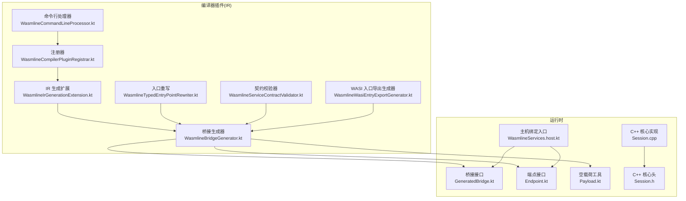
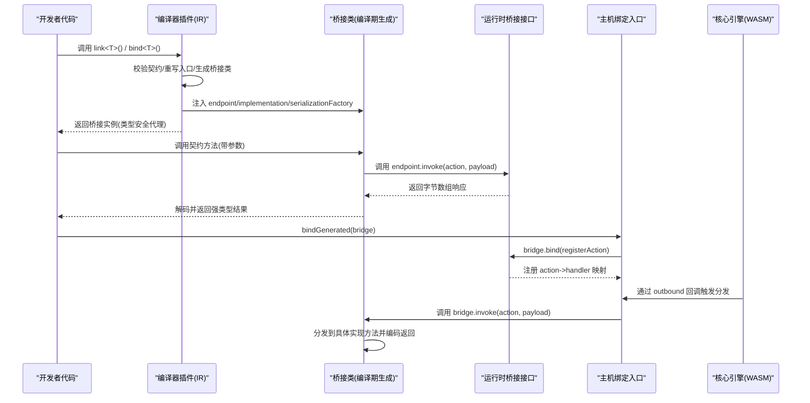
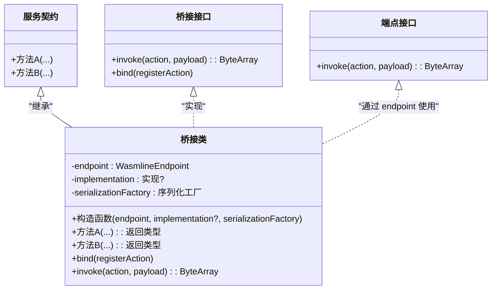
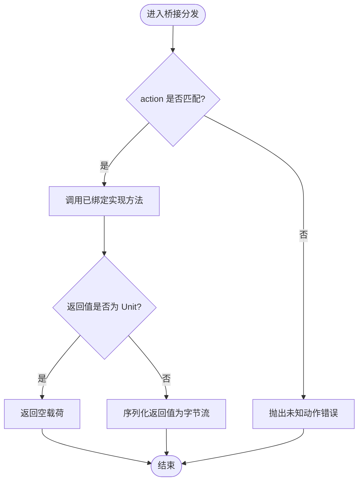
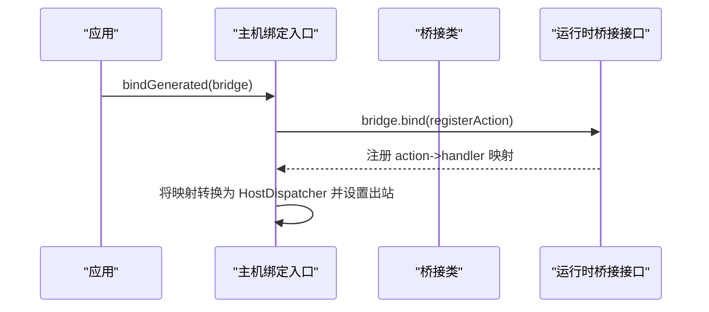
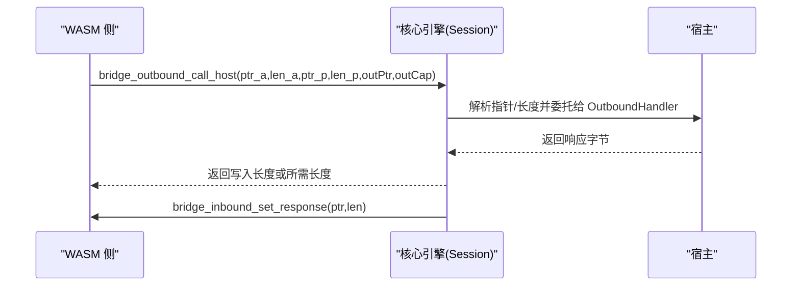
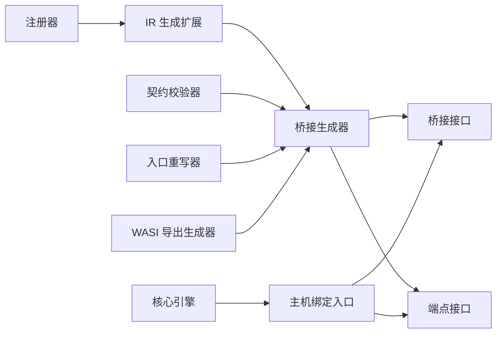

# 桥接代码生成

<cite>
**本文引用的文件**
- [WasmlineBridgeGenerator.kt](file://wasmline-multiplatform/wasmline-kotlin-plugin/src/main/kotlin/crow/wasmline/kotlin/WasmlineBridgeGenerator.kt)
- [GeneratedBridge.kt](file://wasmline-multiplatform/wasmline/src/commonMain/kotlin/crow/wasmline/internal/bridge/GeneratedBridge.kt)
- [Endpoint.kt](file://wasmline-multiplatform/wasmline/src/commonMain/kotlin/crow/wasmline/internal/bridge/Endpoint.kt)
- [Payload.kt](file://wasmline-multiplatform/wasmline/src/commonMain/kotlin/crow/wasmline/internal/bridge/Payload.kt)
- [WasmlineServices.host.kt](file://wasmline-multiplatform/wasmline/src/hostMain/kotlin/crow/wasmline/WasmlineServices.host.kt)
- [Session.h](file://wasmline-core/include/Session.h)
- [Session.cpp](file://wasmline-core/src/Session.cpp)
- [WasmlineCompilerPluginRegistrar.kt](file://wasmline-multiplatform/wasmline-kotlin-plugin/src/main/kotlin/crow/wasmline/kotlin/WasmlineCompilerPluginRegistrar.kt)
- [WasmlineCommandLineProcessor.kt](file://wasmline-multiplatform/wasmline-kotlin-plugin/src/main/kotlin/crow/wasmline/kotlin/WasmlineCommandLineProcessor.kt)
- [WasmlineIrGenerationExtension.kt](file://wasmline-multiplatform/wasmline-kotlin-plugin/src/main/kotlin/crow/wasmline/kotlin/WasmlineIrGenerationExtension.kt)
- [WasmlineTypedEntryPointRewriter.kt](file://wasmline-multiplatform/wasmline-kotlin-plugin/src/main/kotlin/crow/wasmline/kotlin/WasmlineTypedEntryPointRewriter.kt)
- [WasmlineServiceContractValidator.kt](file://wasmline-multiplatform/wasmline-kotlin-plugin/src/main/kotlin/crow/wasmline/kotlin/WasmlineServiceContractValidator.kt)
- [WasmlineWasiEntryExportGenerator.kt](file://wasmline-multiplatform/wasmline-kotlin-plugin/src/main/kotlin/crow/wasmline/kotlin/WasmlineWasiEntryExportGenerator.kt)
</cite>

## 目录
1. [引言](#引言)
2. [项目结构](#项目结构)
3. [核心组件](#核心组件)
4. [架构总览](#架构总览)
5. [详细组件分析](#详细组件分析)
6. [依赖关系分析](#依赖关系分析)
7. [性能考量](#性能考量)
8. [故障排除指南](#故障排除指南)
9. [结论](#结论)
10. [附录](#附录)

## 引言
本文件面向 Wasmline 的桥接代码生成机制，系统性阐述从“服务契约”到“类型安全代理”的编译时代码生成流程，重点解析 GeneratedBridge 的生成逻辑（方法映射、参数转换、返回值处理）、桥接代码的结构与组织方式（公共接口、平台特定实现、错误处理），以及与编译器插件的集成机制。同时给出优化策略、性能考虑、调试与故障排除方法，帮助开发者理解并扩展桥接体系。

## 项目结构
Wasmline 的桥接生成横跨 Kotlin 编译器插件与多平台运行时：
- 编译器插件在 IR 阶段生成桥接类，注入端点、实现与序列化工厂字段，以及三类方法：代理调用、绑定注册、分发路由。
- 运行时提供桥接接口、端点抽象、空载荷工具与主机绑定入口；核心引擎通过 WASM 出入站桥接函数与宿主交互。

**图表来源**
- [WasmlineCompilerPluginRegistrar.kt](file://wasmline-multiplatform/wasmline-kotlin-plugin/src/main/kotlin/crow/wasmline/kotlin/WasmlineCompilerPluginRegistrar.kt)
- [WasmlineCommandLineProcessor.kt](file://wasmline-multiplatform/wasmline-kotlin-plugin/src/main/kotlin/crow/wasmline/kotlin/WasmlineCommandLineProcessor.kt)
- [WasmlineIrGenerationExtension.kt](file://wasmline-multiplatform/wasmline-kotlin-plugin/src/main/kotlin/crow/wasmline/kotlin/WasmlineIrGenerationExtension.kt)
- [WasmlineBridgeGenerator.kt](file://wasmline-multiplatform/wasmline-kotlin-plugin/src/main/kotlin/crow/wasmline/kotlin/WasmlineBridgeGenerator.kt)
- [WasmlineTypedEntryPointRewriter.kt](file://wasmline-multiplatform/wasmline-kotlin-plugin/src/main/kotlin/crow/wasmline/kotlin/WasmlineTypedEntryPointRewriter.kt)
- [WasmlineServiceContractValidator.kt](file://wasmline-multiplatform/wasmline-kotlin-plugin/src/main/kotlin/crow/wasmline/kotlin/WasmlineServiceContractValidator.kt)
- [WasmlineWasiEntryExportGenerator.kt](file://wasmline-multiplatform/wasmline-kotlin-plugin/src/main/kotlin/crow/wasmline/kotlin/WasmlineWasiEntryExportGenerator.kt)
- [GeneratedBridge.kt](file://wasmline-multiplatform/wasmline/src/commonMain/kotlin/crow/wasmline/internal/bridge/GeneratedBridge.kt)
- [Endpoint.kt](file://wasmline-multiplatform/wasmline/src/commonMain/kotlin/crow/wasmline/internal/bridge/Endpoint.kt)
- [Payload.kt](file://wasmline-multiplatform/wasmline/src/commonMain/kotlin/crow/wasmline/internal/bridge/Payload.kt)
- [WasmlineServices.host.kt](file://wasmline-multiplatform/wasmline/src/hostMain/kotlin/crow/wasmline/WasmlineServices.host.kt)
- [Session.h](file://wasmline-core/include/Session.h)
- [Session.cpp](file://wasmline-core/src/Session.cpp)

**章节来源**
- [WasmlineBridgeGenerator.kt:55-156](file://wasmline-multiplatform/wasmline-kotlin-plugin/src/main/kotlin/crow/wasmline/kotlin/WasmlineBridgeGenerator.kt#L55-L156)
- [GeneratedBridge.kt:12-17](file://wasmline-multiplatform/wasmline/src/commonMain/kotlin/crow/wasmline/internal/bridge/GeneratedBridge.kt#L12-L17)
- [Endpoint.kt:4-7](file://wasmline-multiplatform/wasmline/src/commonMain/kotlin/crow/wasmline/internal/bridge/Endpoint.kt#L4-L7)
- [Payload.kt:6-7](file://wasmline-multiplatform/wasmline/src/commonMain/kotlin/crow/wasmline/internal/bridge/Payload.kt#L6-L7)
- [WasmlineServices.host.kt:13-38](file://wasmline-multiplatform/wasmline/src/hostMain/kotlin/crow/wasmline/WasmlineServices.host.kt#L13-L38)

## 核心组件
- 编译期桥接生成器：基于 IR 构建具体桥接类，注入字段与方法，完成从契约到代理的类型安全映射。
- 运行时桥接接口：定义桥接类必须实现的调用与绑定协议，提供未链接端点与未知动作的快速失败策略。
- 端点抽象：统一不同平台的传输通道，承载 action/payload 的往返。
- 主机绑定入口：将桥接类的绑定结果转换为宿主可执行的分发器。
- 核心引擎桥接：通过 WASM 出入站桥接函数与宿主通信，支撑跨语言调用。

**章节来源**
- [WasmlineBridgeGenerator.kt:55-156](file://wasmline-multiplatform/wasmline-kotlin-plugin/src/main/kotlin/crow/wasmline/kotlin/WasmlineBridgeGenerator.kt#L55-L156)
- [GeneratedBridge.kt:12-17](file://wasmline-multiplatform/wasmline/src/commonMain/kotlin/crow/wasmline/internal/bridge/GeneratedBridge.kt#L12-L17)
- [Endpoint.kt:4-7](file://wasmline-multiplatform/wasmline/src/commonMain/kotlin/crow/wasmline/internal/bridge/Endpoint.kt#L4-L7)
- [WasmlineServices.host.kt:27-34](file://wasmline-multiplatform/wasmline/src/hostMain/kotlin/crow/wasmline/WasmlineServices.host.kt#L27-L34)
- [Session.cpp:487-517](file://wasmline-core/src/Session.cpp#L487-L517)

## 架构总览
下图展示从服务契约到类型安全代理的生成与运行时交互路径，以及编译器插件如何在 IR 层替换 link()/bind() 调用，注入桥接类实例与序列化工厂。

**图表来源**
- [WasmlineBridgeGenerator.kt:192-268](file://wasmline-multiplatform/wasmline-kotlin-plugin/src/main/kotlin/crow/wasmline/kotlin/WasmlineBridgeGenerator.kt#L192-L268)
- [WasmlineBridgeGenerator.kt:271-311](file://wasmline-multiplatform/wasmline-kotlin-plugin/src/main/kotlin/crow/wasmline/kotlin/WasmlineBridgeGenerator.kt#L271-L311)
- [WasmlineBridgeGenerator.kt:366-426](file://wasmline-multiplatform/wasmline-kotlin-plugin/src/main/kotlin/crow/wasmline/kotlin/WasmlineBridgeGenerator.kt#L366-L426)
- [GeneratedBridge.kt:12-17](file://wasmline-multiplatform/wasmline/src/commonMain/kotlin/crow/wasmline/internal/bridge/GeneratedBridge.kt#L12-L17)
- [WasmlineServices.host.kt:27-34](file://wasmline-multiplatform/wasmline/src/hostMain/kotlin/crow/wasmline/WasmlineServices.host.kt#L27-L34)
- [Session.cpp:487-517](file://wasmline-core/src/Session.cpp#L487-L517)

## 详细组件分析

### 1) 编译期桥接生成器：从契约到代理
- 生成目标：为每个已验证的服务契约生成一个具体桥接类，类名由运行时符号表决定；继承契约类型并实现桥接接口。
- 字段注入：包含端点字段、可空实现字段、序列化工厂字段，构造函数负责初始化这些字段。
- 方法生成：
  - 代理调用方法：将契约方法调用转换为 action 字符串与序列化后的 payload，通过 endpoint.invoke 发送，再解码返回值。
  - 绑定方法：为每个契约方法注册一个 action->handler 映射，handler 内部再次调用桥接类的分发方法。
  - 分发方法：根据传入 action 匹配对应分支，调用已绑定实现的方法，进行参数解码与返回值编码。
- 参数与返回值处理：
  - 无参调用使用空载荷工具；有参调用通过序列化工厂编码参数，返回值通过解码工厂解码。
  - 单元类型返回会被隐式转换单元，非单元类型则编码为字节数组。
- 错误处理：
  - 未链接端点对象在被调用时抛出明确错误，提示编译器插件未正确替换 link()/bind()。
  - 未知 action 到达分发器时抛出错误，提示未知动作。

**图表来源**
- [WasmlineBridgeGenerator.kt:55-156](file://wasmline-multiplatform/wasmline-kotlin-plugin/src/main/kotlin/crow/wasmline/kotlin/WasmlineBridgeGenerator.kt#L55-L156)
- [WasmlineBridgeGenerator.kt:192-268](file://wasmline-multiplatform/wasmline-kotlin-plugin/src/main/kotlin/crow/wasmline/kotlin/WasmlineBridgeGenerator.kt#L192-L268)
- [WasmlineBridgeGenerator.kt:271-311](file://wasmline-multiplatform/wasmline-kotlin-plugin/src/main/kotlin/crow/wasmline/kotlin/WasmlineBridgeGenerator.kt#L271-L311)
- [WasmlineBridgeGenerator.kt:366-426](file://wasmline-multiplatform/wasmline-kotlin-plugin/src/main/kotlin/crow/wasmline/kotlin/WasmlineBridgeGenerator.kt#L366-L426)
- [GeneratedBridge.kt:12-17](file://wasmline-multiplatform/wasmline/src/commonMain/kotlin/crow/wasmline/internal/bridge/GeneratedBridge.kt#L12-L17)
- [Endpoint.kt:4-7](file://wasmline-multiplatform/wasmline/src/commonMain/kotlin/crow/wasmline/internal/bridge/Endpoint.kt#L4-L7)

**章节来源**
- [WasmlineBridgeGenerator.kt:55-156](file://wasmline-multiplatform/wasmline-kotlin-plugin/src/main/kotlin/crow/wasmline/kotlin/WasmlineBridgeGenerator.kt#L55-L156)
- [WasmlineBridgeGenerator.kt:192-268](file://wasmline-multiplatform/wasmline-kotlin-plugin/src/main/kotlin/crow/wasmline/kotlin/WasmlineBridgeGenerator.kt#L192-L268)
- [WasmlineBridgeGenerator.kt:271-311](file://wasmline-multiplatform/wasmline-kotlin-plugin/src/main/kotlin/crow/wasmline/kotlin/WasmlineBridgeGenerator.kt#L271-L311)
- [WasmlineBridgeGenerator.kt:366-426](file://wasmline-multiplatform/wasmline-kotlin-plugin/src/main/kotlin/crow/wasmline/kotlin/WasmlineBridgeGenerator.kt#L366-L426)
- [Payload.kt:6-7](file://wasmline-multiplatform/wasmline/src/commonMain/kotlin/crow/wasmline/internal/bridge/Payload.kt#L6-L7)
- [GeneratedBridge.kt:19-43](file://wasmline-multiplatform/wasmline/src/commonMain/kotlin/crow/wasmline/internal/bridge/GeneratedBridge.kt#L19-L43)

### 2) 运行时桥接接口与端点抽象
- 桥接接口：定义桥接类必须实现的调用与绑定协议，支持 action/payload 的双向传递。
- 端点接口：抽象不同平台的传输通道，统一 invoke 行为。
- 未链接端点：在未正确链接时快速失败，避免静默错误。
- 未知动作：当分发器收到未知 action 时快速失败，便于定位问题。

**图表来源**
- [GeneratedBridge.kt:12-17](file://wasmline-multiplatform/wasmline/src/commonMain/kotlin/crow/wasmline/internal/bridge/GeneratedBridge.kt#L12-L17)
- [GeneratedBridge.kt:39-43](file://wasmline-multiplatform/wasmline/src/commonMain/kotlin/crow/wasmline/internal/bridge/GeneratedBridge.kt#L39-L43)
- [WasmlineBridgeGenerator.kt:366-426](file://wasmline-multiplatform/wasmline-kotlin-plugin/src/main/kotlin/crow/wasmline/kotlin/WasmlineBridgeGenerator.kt#L366-L426)

**章节来源**
- [GeneratedBridge.kt:12-17](file://wasmline-multiplatform/wasmline/src/commonMain/kotlin/crow/wasmline/internal/bridge/GeneratedBridge.kt#L12-L17)
- [Endpoint.kt:4-7](file://wasmline-multiplatform/wasmline/src/commonMain/kotlin/crow/wasmline/internal/bridge/Endpoint.kt#L4-L7)
- [GeneratedBridge.kt:19-43](file://wasmline-multiplatform/wasmline/src/commonMain/kotlin/crow/wasmline/internal/bridge/GeneratedBridge.kt#L19-L43)

### 3) 主机绑定入口与序列化工厂
- 主机绑定入口：将桥接类的绑定结果转换为宿主分发器，设置出站回调以接收来自 WASM 的请求。
- 序列化工厂：桥接类在编译期注入，用于参数编码与返回值解码，确保跨语言数据一致性。

**图表来源**
- [WasmlineServices.host.kt:27-34](file://wasmline-multiplatform/wasmline/src/hostMain/kotlin/crow/wasmline/WasmlineServices.host.kt#L27-L34)
- [GeneratedBridge.kt:12-17](file://wasmline-multiplatform/wasmline/src/commonMain/kotlin/crow/wasmline/internal/bridge/GeneratedBridge.kt#L12-L17)

**章节来源**
- [WasmlineServices.host.kt:27-34](file://wasmline-multiplatform/wasmline/src/hostMain/kotlin/crow/wasmline/WasmlineServices.host.kt#L27-L34)

### 4) 核心引擎桥接与 WASM 出入站
- 出站桥接：WASM 侧调用宿主函数发起请求，携带 action 与 payload 指针/长度，返回写入长度或所需缓冲区大小。
- 入站桥接：宿主将响应写回 WASM 内存，供 WASM 读取。
- 核心注册：会话建立时注册上述静态回调，确保双向通道可用。

**图表来源**
- [Session.h:66-79](file://wasmline-core/include/Session.h#L66-L79)
- [Session.cpp:487-517](file://wasmline-core/src/Session.cpp#L487-L517)

**章节来源**
- [Session.h:66-79](file://wasmline-core/include/Session.h#L66-L79)
- [Session.cpp:487-517](file://wasmline-core/src/Session.cpp#L487-L517)

## 依赖关系分析
- 插件层依赖：
  - 注册器与命令行处理器负责启用插件与参数传递。
  - IR 生成扩展驱动桥接生成器工作。
  - 契约校验器保证仅对有效契约生成桥接。
  - 入口重写器与 WASI 导出生成器分别处理调用入口与导出。
- 运行时依赖：
  - 桥接接口与端点接口为桥接类提供统一契约。
  - 主机绑定入口将桥接类与核心引擎对接。
  - 核心引擎通过桥接函数与 WASM 通信。

**图表来源**
- [WasmlineCompilerPluginRegistrar.kt](file://wasmline-multiplatform/wasmline-kotlin-plugin/src/main/kotlin/crow/wasmline/kotlin/WasmlineCompilerPluginRegistrar.kt)
- [WasmlineCommandLineProcessor.kt](file://wasmline-multiplatform/wasmline-kotlin-plugin/src/main/kotlin/crow/wasmline/kotlin/WasmlineCommandLineProcessor.kt)
- [WasmlineIrGenerationExtension.kt](file://wasmline-multiplatform/wasmline-kotlin-plugin/src/main/kotlin/crow/wasmline/kotlin/WasmlineIrGenerationExtension.kt)
- [WasmlineBridgeGenerator.kt](file://wasmline-multiplatform/wasmline-kotlin-plugin/src/main/kotlin/crow/wasmline/kotlin/WasmlineBridgeGenerator.kt)
- [WasmlineServiceContractValidator.kt](file://wasmline-multiplatform/wasmline-kotlin-plugin/src/main/kotlin/crow/wasmline/kotlin/WasmlineServiceContractValidator.kt)
- [WasmlineTypedEntryPointRewriter.kt](file://wasmline-multiplatform/wasmline-kotlin-plugin/src/main/kotlin/crow/wasmline/kotlin/WasmlineTypedEntryPointRewriter.kt)
- [WasmlineWasiEntryExportGenerator.kt](file://wasmline-multiplatform/wasmline-kotlin-plugin/src/main/kotlin/crow/wasmline/kotlin/WasmlineWasiEntryExportGenerator.kt)
- [GeneratedBridge.kt](file://wasmline-multiplatform/wasmline/src/commonMain/kotlin/crow/wasmline/internal/bridge/GeneratedBridge.kt)
- [Endpoint.kt](file://wasmline-multiplatform/wasmline/src/commonMain/kotlin/crow/wasmline/internal/bridge/Endpoint.kt)
- [WasmlineServices.host.kt](file://wasmline-multiplatform/wasmline/src/hostMain/kotlin/crow/wasmline/WasmlineServices.host.kt)
- [Session.cpp:487-517](file://wasmline-core/src/Session.cpp#L487-L517)

**章节来源**
- [WasmlineCompilerPluginRegistrar.kt](file://wasmline-multiplatform/wasmline-kotlin-plugin/src/main/kotlin/crow/wasmline/kotlin/WasmlineCompilerPluginRegistrar.kt)
- [WasmlineCommandLineProcessor.kt](file://wasmline-multiplatform/wasmline-kotlin-plugin/src/main/kotlin/crow/wasmline/kotlin/WasmlineCommandLineProcessor.kt)
- [WasmlineIrGenerationExtension.kt](file://wasmline-multiplatform/wasmline-kotlin-plugin/src/main/kotlin/crow/wasmline/kotlin/WasmlineIrGenerationExtension.kt)
- [WasmlineBridgeGenerator.kt](file://wasmline-multiplatform/wasmline-kotlin-plugin/src/main/kotlin/crow/wasmline/kotlin/WasmlineBridgeGenerator.kt)
- [WasmlineServiceContractValidator.kt](file://wasmline-multiplatform/wasmline-kotlin-plugin/src/main/kotlin/crow/wasmline/kotlin/WasmlineServiceContractValidator.kt)
- [WasmlineTypedEntryPointRewriter.kt](file://wasmline-multiplatform/wasmline-kotlin-plugin/src/main/kotlin/crow/wasmline/kotlin/WasmlineTypedEntryPointRewriter.kt)
- [WasmlineWasiEntryExportGenerator.kt](file://wasmline-multiplatform/wasmline-kotlin-plugin/src/main/kotlin/crow/wasmline/kotlin/WasmlineWasiEntryExportGenerator.kt)

## 性能考量
- 生成策略
  - 一次契约生成一个桥接类，避免重复反射与动态分派。
  - 代理方法直接拼装 action 字符串与序列化 payload，减少中间对象。
  - 分发方法采用顺序匹配，按契约函数数量线性增长；可通过哈希映射优化（当前实现为线性分支）。
- 序列化
  - 使用注入的序列化工厂，避免运行时查找与反射开销。
  - 无参调用复用空载荷工具，零分配。
- 跨语言调用
  - 出站调用返回值指示缓冲区需求，支持慢路径重试，避免内存拷贝与溢出。
  - 入站/出站桥接函数参数固定，减少封送成本。
- 平台适配
  - 多平台桥接类共享同一 IR 生成逻辑，保持一致的性能特征。

**章节来源**
- [WasmlineBridgeGenerator.kt:192-268](file://wasmline-multiplatform/wasmline-kotlin-plugin/src/main/kotlin/crow/wasmline/kotlin/WasmlineBridgeGenerator.kt#L192-L268)
- [WasmlineBridgeGenerator.kt:366-426](file://wasmline-multiplatform/wasmline-kotlin-plugin/src/main/kotlin/crow/wasmline/kotlin/WasmlineBridgeGenerator.kt#L366-L426)
- [Payload.kt:6-7](file://wasmline-multiplatform/wasmline/src/commonMain/kotlin/crow/wasmline/internal/bridge/Payload.kt#L6-L7)
- [Session.cpp:487-517](file://wasmline-core/src/Session.cpp#L487-L517)

## 故障排除指南
- 未链接端点错误
  - 现象：调用桥接类时报错，提示未链接到传输端点。
  - 排查：确认编译器插件已启用且正确替换 link()/bind()；检查桥接类构造函数是否正确注入 endpoint。
  - 参考：未链接端点对象的快速失败实现。
- 未知动作错误
  - 现象：分发器收到未知 action 抛错。
  - 排查：确认 action 名称格式为“契约全限定名#方法名”；检查绑定阶段是否注册了该 action。
  - 参考：未知动作的快速失败实现。
- 未绑定实现错误
  - 现象：分发器调用已绑定 action 但未持有实现。
  - 排查：确认 bind() 正确传入具体实现；检查实现类型与契约一致。
  - 参考：requireGeneratedImplementation 的快速失败实现。
- 出入站桥接异常
  - 现象：WASM 与宿主通信失败或缓冲区不足。
  - 排查：核对桥接函数参数与返回值约定；确认 OutboundHandler 正常工作；检查内存指针与长度。
  - 参考：核心引擎桥接函数与返回约定。

**章节来源**
- [GeneratedBridge.kt:19-43](file://wasmline-multiplatform/wasmline/src/commonMain/kotlin/crow/wasmline/internal/bridge/GeneratedBridge.kt#L19-L43)
- [Session.cpp:487-517](file://wasmline-core/src/Session.cpp#L487-L517)

## 结论
Wasmline 的桥接代码生成机制通过编译器插件在 IR 阶段将服务契约转换为类型安全的代理类，结合运行时桥接接口与端点抽象，实现了跨语言、跨平台的稳定通信。其设计强调一次性生成、显式绑定与快速失败，既保证了性能，也便于调试与扩展。未来可在分发匹配与序列化策略上进一步优化，以提升大规模服务场景下的吞吐与稳定性。

## 附录
- 编译器插件集成要点
  - 启用注册器与命令行处理器，确保 IR 生成扩展生效。
  - 在入口重写阶段替换 link()/bind() 调用，注入桥接类与序列化工厂。
  - 契约校验器确保仅对符合规范的契约生成桥接。
- 开发者扩展建议
  - 新增平台桥接类时，遵循桥接接口与端点抽象契约。
  - 自定义序列化策略时，确保与注入的序列化工厂一致。
  - 扩展分发匹配算法时，注意性能与可维护性的平衡。