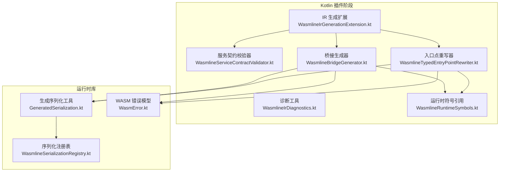
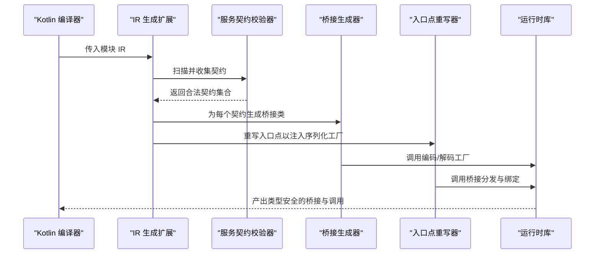
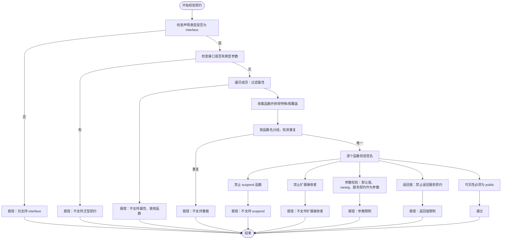
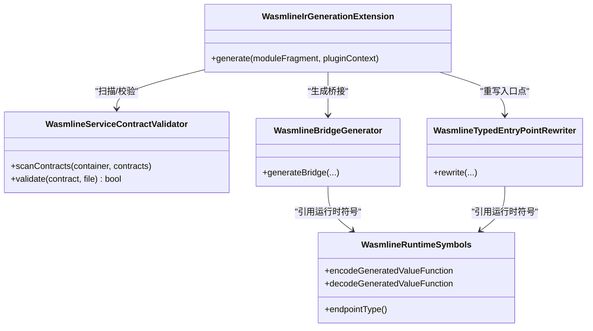
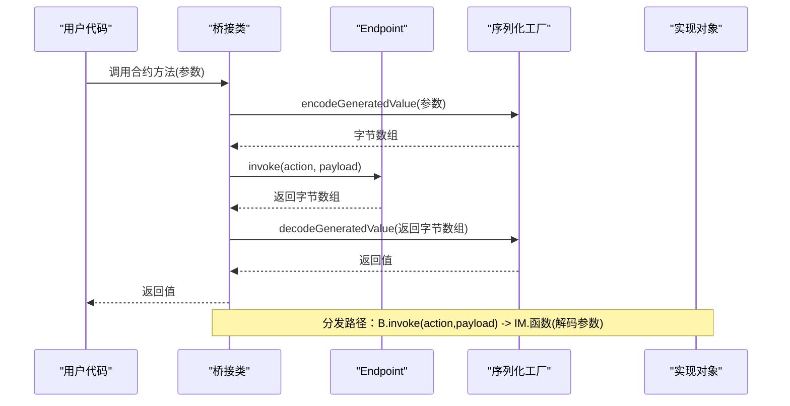
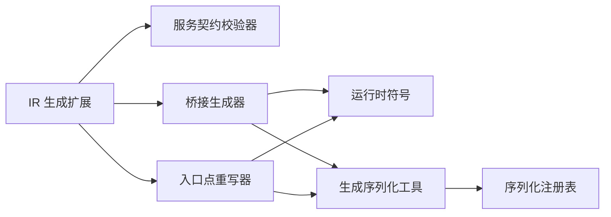

# 类型安全保证

<cite>
**本文引用的文件**
- [WasmlineIrGenerationExtension.kt](file://wasmline-multiplatform/wasmline-kotlin-plugin/src/main/kotlin/crow/wasmline/kotlin/WasmlineIrGenerationExtension.kt)
- [WasmlineServiceContractValidator.kt](file://wasmline-multiplatform/wasmline-kotlin-plugin/src/main/kotlin/crow/wasmline/kotlin/WasmlineServiceContractValidator.kt)
- [WasmlineBridgeGenerator.kt](file://wasmline-multiplatform/wasmline-kotlin-plugin/src/main/kotlin/crow/wasmline/kotlin/WasmlineBridgeGenerator.kt)
- [WasmlineTypedEntryPointRewriter.kt](file://wasmline-multiplatform/wasmline-kotlin-plugin/src/main/kotlin/crow/wasmline/kotlin/WasmlineTypedEntryPointRewriter.kt)
- [WasmlineIrDiagnostics.kt](file://wasmline-multiplatform/wasmline-kotlin-plugin/src/main/kotlin/crow/wasmline/kotlin/WasmlineIrDiagnostics.kt)
- [WasmlineRuntimeSymbols.kt](file://wasmline-multiplatform/wasmline-kotlin-plugin/src/main/kotlin/crow/wasmline/kotlin/WasmlineRuntimeSymbols.kt)
- [GeneratedSerialization.kt](file://wasmline-multiplatform/wasmline/src/commonMain/kotlin/crow/wasmline/internal/bridge/GeneratedSerialization.kt)
- [WasmlineSerializationRegistry.kt](file://wasmline-multiplatform/wasmline/src/commonMain/kotlin/crow/wasmline/serialization/WasmlineSerializationRegistry.kt)
- [WasmError.kt](file://wasmline-multiplatform/wasmline/src/wasmWasiMain/kotlin/crow/wasmline/model/WasmError.kt)
- [README.md](file://README.md)
- [ambiguousBindImplementation.kt](file://wasmline-multiplatform/wasmline-kotlin-plugin/testData/diagnostics/ambiguousBindImplementation.kt)
</cite>

## 目录
1. [引言](#引言)
2. [项目结构](#项目结构)
3. [核心组件](#核心组件)
4. [架构总览](#架构总览)
5. [详细组件分析](#详细组件分析)
6. [依赖关系分析](#依赖关系分析)
7. [性能考量](#性能考量)
8. [故障排查指南](#故障排查指南)
9. [结论](#结论)
10. [附录](#附录)

## 引言
本文件系统性阐述 Wasmline 在编译期与运行期共同构建的类型安全保证机制。内容覆盖：
- 编译时服务契约的静态检查与错误诊断
- 类型安全的边界条件与限制（泛型、可空性、参数约束等）
- IR 生成扩展如何确保运行时类型安全
- 错误报告与修复建议
- 最佳实践与常见陷阱
- 类型安全与性能开销的权衡

## 项目结构
Wasmline 的类型安全由 Kotlin 插件在 IR 阶段协同完成：插件负责扫描、校验、生成桥接类与重写入口点；运行时库提供序列化工厂与桥接调用能力。

图示来源
- [WasmlineIrGenerationExtension.kt:1-60](file://wasmline-multiplatform/wasmline-kotlin-plugin/src/main/kotlin/crow/wasmline/kotlin/WasmlineIrGenerationExtension.kt#L1-L60)
- [WasmlineServiceContractValidator.kt:1-200](file://wasmline-multiplatform/wasmline-kotlin-plugin/src/main/kotlin/crow/wasmline/kotlin/WasmlineServiceContractValidator.kt#L1-L200)
- [WasmlineBridgeGenerator.kt:1-591](file://wasmline-multiplatform/wasmline-kotlin-plugin/src/main/kotlin/crow/wasmline/kotlin/WasmlineBridgeGenerator.kt#L1-L591)
- [WasmlineTypedEntryPointRewriter.kt:231-279](file://wasmline-multiplatform/wasmline-kotlin-plugin/src/main/kotlin/crow/wasmline/kotlin/WasmlineTypedEntryPointRewriter.kt#L231-L279)
- [WasmlineIrDiagnostics.kt:1-64](file://wasmline-multiplatform/wasmline-kotlin-plugin/src/main/kotlin/crow/wasmline/kotlin/WasmlineIrDiagnostics.kt#L1-L64)
- [WasmlineRuntimeSymbols.kt:109-130](file://wasmline-multiplatform/wasmline-kotlin-plugin/src/main/kotlin/crow/wasmline/kotlin/WasmlineRuntimeSymbols.kt#L109-L130)
- [GeneratedSerialization.kt:1-22](file://wasmline-multiplatform/wasmline/src/commonMain/kotlin/crow/wasmline/internal/bridge/GeneratedSerialization.kt#L1-L22)
- [WasmlineSerializationRegistry.kt:1-20](file://wasmline-multiplatform/wasmline/src/commonMain/kotlin/crow/wasmline/serialization/WasmlineSerializationRegistry.kt#L1-L20)
- [WasmError.kt:1-6](file://wasmline-multiplatform/wasmline/src/wasmWasiMain/kotlin/crow/wasmline/model/WasmError.kt#L1-L6)

章节来源
- [WasmlineIrGenerationExtension.kt:1-60](file://wasmline-multiplatform/wasmline-kotlin-plugin/src/main/kotlin/crow/wasmline/kotlin/WasmlineIrGenerationExtension.kt#L1-L60)
- [README.md:555-570](file://README.md#L555-L570)

## 核心组件
- IR 生成扩展：协调扫描、校验、桥接生成与入口点重写，统一控制流程。
- 服务契约校验器：严格限定接口声明、可见性、函数签名、参数与返回值等规则。
- 桥接生成器：为每个合法契约生成具体桥接类，包含绑定、分发与序列化逻辑。
- 入口点重写器：将用户调用重写为携带序列化工厂与桥接实例的调用形态。
- 诊断工具：统一错误/信息报告，定位源码位置。
- 运行时符号：在 IR 中引用运行时函数与类型，确保桥接调用正确。
- 运行时序列化：基于工厂进行编码/解码，保障跨端传输类型一致。
- 错误模型：统一的错误封装，便于传播与捕获。

章节来源
- [WasmlineIrGenerationExtension.kt:16-58](file://wasmline-multiplatform/wasmline-kotlin-plugin/src/main/kotlin/crow/wasmline/kotlin/WasmlineIrGenerationExtension.kt#L16-L58)
- [WasmlineServiceContractValidator.kt:24-88](file://wasmline-multiplatform/wasmline-kotlin-plugin/src/main/kotlin/crow/wasmline/kotlin/WasmlineServiceContractValidator.kt#L24-L88)
- [WasmlineBridgeGenerator.kt:55-156](file://wasmline-multiplatform/wasmline-kotlin-plugin/src/main/kotlin/crow/wasmline/kotlin/WasmlineBridgeGenerator.kt#L55-L156)
- [WasmlineTypedEntryPointRewriter.kt:231-279](file://wasmline-multiplatform/wasmline-kotlin-plugin/src/main/kotlin/crow/wasmline/kotlin/WasmlineTypedEntryPointRewriter.kt#L231-L279)
- [WasmlineIrDiagnostics.kt:16-64](file://wasmline-multiplatform/wasmline-kotlin-plugin/src/main/kotlin/crow/wasmline/kotlin/WasmlineIrDiagnostics.kt#L16-L64)
- [WasmlineRuntimeSymbols.kt:109-130](file://wasmline-multiplatform/wasmline-kotlin-plugin/src/main/kotlin/crow/wasmline/kotlin/WasmlineRuntimeSymbols.kt#L109-L130)
- [GeneratedSerialization.kt:8-22](file://wasmline-multiplatform/wasmline/src/commonMain/kotlin/crow/wasmline/internal/bridge/GeneratedSerialization.kt#L8-L22)
- [WasmlineSerializationRegistry.kt:3-20](file://wasmline-multiplatform/wasmline/src/commonMain/kotlin/crow/wasmline/serialization/WasmlineSerializationRegistry.kt#L3-L20)
- [WasmError.kt:1-6](file://wasmline-multiplatform/wasmline/src/wasmWasiMain/kotlin/crow/wasmline/model/WasmError.kt#L1-L6)

## 架构总览
下图展示从 IR 扫描到桥接生成、序列化与运行时调用的整体流程。

图示来源
- [WasmlineIrGenerationExtension.kt:21-48](file://wasmline-multiplatform/wasmline-kotlin-plugin/src/main/kotlin/crow/wasmline/kotlin/WasmlineIrGenerationExtension.kt#L21-L48)
- [WasmlineBridgeGenerator.kt:192-268](file://wasmline-multiplatform/wasmline-kotlin-plugin/src/main/kotlin/crow/wasmline/kotlin/WasmlineBridgeGenerator.kt#L192-L268)
- [WasmlineTypedEntryPointRewriter.kt:231-279](file://wasmline-multiplatform/wasmline-kotlin-plugin/src/main/kotlin/crow/wasmline/kotlin/WasmlineTypedEntryPointRewriter.kt#L231-L279)
- [GeneratedSerialization.kt:8-22](file://wasmline-multiplatform/wasmline/src/commonMain/kotlin/crow/wasmline/internal/bridge/GeneratedSerialization.kt#L8-L22)

## 详细组件分析

### 服务契约静态检查与错误诊断
- 契约接口限定：仅允许 interface，拒绝抽象类、密封类型与 object。
- 可见性与修饰符：所有函数必须 public；禁止 suspend、vararg、默认参数、扩展接收者。
- 泛型与属性：接口与函数均不允许泛型；属性不支持，需改用函数。
- 方法名唯一性：同一契约内不允许同名函数（不支持重载）。
- 参数与返回值：最多一个常规参数；禁止传递/返回服务契约类型本身。
- 诊断输出：通过统一的诊断工具输出错误与信息，并映射到源码位置。

图示来源
- [WasmlineServiceContractValidator.kt:42-136](file://wasmline-multiplatform/wasmline-kotlin-plugin/src/main/kotlin/crow/wasmline/kotlin/WasmlineServiceContractValidator.kt#L42-L136)
- [WasmlineIrDiagnostics.kt:16-50](file://wasmline-multiplatform/wasmline-kotlin-plugin/src/main/kotlin/crow/wasmline/kotlin/WasmlineIrDiagnostics.kt#L16-L50)

章节来源
- [WasmlineServiceContractValidator.kt:24-136](file://wasmline-multiplatform/wasmline-kotlin-plugin/src/main/kotlin/crow/wasmline/kotlin/WasmlineServiceContractValidator.kt#L24-L136)
- [README.md:555-570](file://README.md#L555-L570)
- [WasmlineIrDiagnostics.kt:16-50](file://wasmline-multiplatform/wasmline-kotlin-plugin/src/main/kotlin/crow/wasmline/kotlin/WasmlineIrDiagnostics.kt#L16-L50)

### IR 生成扩展与编排
- 统一入口：遍历模块中的文件，收集契约并通过校验器进行验证。
- 生成桥接：对每个合法契约生成桥接类，包含构造、绑定与分发方法。
- 重写入口点：将 link/bind 等入口点重写为携带序列化工厂与桥接实例的形式。
- WASI 导出：可选生成初始化导出，便于 WASI 环境启动。

图示来源
- [WasmlineIrGenerationExtension.kt:21-48](file://wasmline-multiplatform/wasmline-kotlin-plugin/src/main/kotlin/crow/wasmline/kotlin/WasmlineIrGenerationExtension.kt#L21-L48)
- [WasmlineBridgeGenerator.kt:55-156](file://wasmline-multiplatform/wasmline-kotlin-plugin/src/main/kotlin/crow/wasmline/kotlin/WasmlineBridgeGenerator.kt#L55-L156)
- [WasmlineTypedEntryPointRewriter.kt:231-279](file://wasmline-multiplatform/wasmline-kotlin-plugin/src/main/kotlin/crow/wasmline/kotlin/WasmlineTypedEntryPointRewriter.kt#L231-L279)
- [WasmlineRuntimeSymbols.kt:109-130](file://wasmline-multiplatform/wasmline-kotlin-plugin/src/main/kotlin/crow/wasmline/kotlin/WasmlineRuntimeSymbols.kt#L109-L130)

章节来源
- [WasmlineIrGenerationExtension.kt:16-58](file://wasmline-multiplatform/wasmline-kotlin-plugin/src/main/kotlin/crow/wasmline/kotlin/WasmlineIrGenerationExtension.kt#L16-L58)

### 桥接生成与运行时类型安全
- 桥接类字段：包含 endpoint（传输端点）、implementation（实现对象，可空）、serializationFactory（序列化工厂）。
- 合约方法转发：将调用编码为字节数组，调用 endpoint.invoke 并根据返回类型解码。
- 绑定方法：为每个合约函数注册动作处理器，桥接到内部 invoke 分发。
- 分发方法：根据 action 名匹配到具体实现，解码参数后调用实现对象对应函数，再编码返回值。
- 序列化工厂：通过运行时符号解析当前工厂，确保编码/解码类型一致。

图示来源
- [WasmlineBridgeGenerator.kt:192-268](file://wasmline-multiplatform/wasmline-kotlin-plugin/src/main/kotlin/crow/wasmline/kotlin/WasmlineBridgeGenerator.kt#L192-L268)
- [WasmlineBridgeGenerator.kt:366-426](file://wasmline-multiplatform/wasmline-kotlin-plugin/src/main/kotlin/crow/wasmline/kotlin/WasmlineBridgeGenerator.kt#L366-L426)
- [GeneratedSerialization.kt:8-22](file://wasmline-multiplatform/wasmline/src/commonMain/kotlin/crow/wasmline/internal/bridge/GeneratedSerialization.kt#L8-L22)

章节来源
- [WasmlineBridgeGenerator.kt:55-156](file://wasmline-multiplatform/wasmline-kotlin-plugin/src/main/kotlin/crow/wasmline/kotlin/WasmlineBridgeGenerator.kt#L55-L156)
- [WasmlineBridgeGenerator.kt:192-268](file://wasmline-multiplatform/wasmline-kotlin-plugin/src/main/kotlin/crow/wasmline/kotlin/WasmlineBridgeGenerator.kt#L192-L268)
- [WasmlineBridgeGenerator.kt:366-426](file://wasmline-multiplatform/wasmline-kotlin-plugin/src/main/kotlin/crow/wasmline/kotlin/WasmlineBridgeGenerator.kt#L366-L426)
- [GeneratedSerialization.kt:8-22](file://wasmline-multiplatform/wasmline/src/commonMain/kotlin/crow/wasmline/internal/bridge/GeneratedSerialization.kt#L8-L22)

### 入口点重写与序列化工厂注入
- 重写目标：将用户调用转换为携带序列化工厂与桥接实例的形态，确保后续桥接调用具备正确的工厂上下文。
- 工厂解析：通过运行时符号解析当前可用的序列化工厂，保证编码/解码一致性。
- 类型推断：通过 IR 层的类型信息，确保参数与返回值的类型在桥接层保持一致。

章节来源
- [WasmlineTypedEntryPointRewriter.kt:231-279](file://wasmline-multiplatform/wasmline-kotlin-plugin/src/main/kotlin/crow/wasmline/kotlin/WasmlineTypedEntryPointRewriter.kt#L231-L279)
- [WasmlineRuntimeSymbols.kt:109-130](file://wasmline-multiplatform/wasmline-kotlin-plugin/src/main/kotlin/crow/wasmline/kotlin/WasmlineRuntimeSymbols.kt#L109-L130)

### 类型安全边界条件与限制
- 泛型处理：接口与函数均不支持泛型；参数与返回值类型必须为具体类型。
- 协变/逆变：未显式支持协变/逆变，类型匹配严格遵循 Kotlin 类型系统。
- 空安全：参数与返回值可空性由序列化工厂与运行时约定决定；桥接层通过工厂进行显式编码/解码，避免隐式空转换。
- 参数与返回值：最多一个常规参数；禁止传递/返回服务契约类型本身；禁止默认参数与 vararg。
- 可见性：函数必须为 public；扩展接收者不支持。

章节来源
- [WasmlineServiceContractValidator.kt:90-136](file://wasmline-multiplatform/wasmline-kotlin-plugin/src/main/kotlin/crow/wasmline/kotlin/WasmlineServiceContractValidator.kt#L90-L136)
- [README.md:555-570](file://README.md#L555-L570)

## 依赖关系分析
- 插件内部耦合：IR 生成扩展协调校验器、生成器与重写器，形成清晰的职责分离。
- 运行时依赖：桥接生成器与重写器依赖运行时符号，确保 IR 层引用与运行时一致。
- 序列化依赖：桥接层通过序列化工厂进行编码/解码，工厂注册表提供多实现选择。

图示来源
- [WasmlineIrGenerationExtension.kt:21-48](file://wasmline-multiplatform/wasmline-kotlin-plugin/src/main/kotlin/crow/wasmline/kotlin/WasmlineIrGenerationExtension.kt#L21-L48)
- [WasmlineBridgeGenerator.kt:55-156](file://wasmline-multiplatform/wasmline-kotlin-plugin/src/main/kotlin/crow/wasmline/kotlin/WasmlineBridgeGenerator.kt#L55-L156)
- [WasmlineTypedEntryPointRewriter.kt:231-279](file://wasmline-multiplatform/wasmline-kotlin-plugin/src/main/kotlin/crow/wasmline/kotlin/WasmlineTypedEntryPointRewriter.kt#L231-L279)
- [WasmlineRuntimeSymbols.kt:109-130](file://wasmline-multiplatform/wasmline-kotlin-plugin/src/main/kotlin/crow/wasmline/kotlin/WasmlineRuntimeSymbols.kt#L109-L130)
- [GeneratedSerialization.kt:8-22](file://wasmline-multiplatform/wasmline/src/commonMain/kotlin/crow/wasmline/internal/bridge/GeneratedSerialization.kt#L8-L22)
- [WasmlineSerializationRegistry.kt:3-20](file://wasmline-multiplatform/wasmline/src/commonMain/kotlin/crow/wasmline/serialization/WasmlineSerializationRegistry.kt#L3-L20)

章节来源
- [WasmlineIrGenerationExtension.kt:16-58](file://wasmline-multiplatform/wasmline-kotlin-plugin/src/main/kotlin/crow/wasmline/kotlin/WasmlineIrGenerationExtension.kt#L16-L58)
- [WasmlineBridgeGenerator.kt:55-156](file://wasmline-multiplatform/wasmline-kotlin-plugin/src/main/kotlin/crow/wasmline/kotlin/WasmlineBridgeGenerator.kt#L55-L156)
- [WasmlineTypedEntryPointRewriter.kt:231-279](file://wasmline-multiplatform/wasmline-kotlin-plugin/src/main/kotlin/crow/wasmline/kotlin/WasmlineTypedEntryPointRewriter.kt#L231-L279)
- [WasmlineRuntimeSymbols.kt:109-130](file://wasmline-multiplatform/wasmline-kotlin-plugin/src/main/kotlin/crow/wasmline/kotlin/WasmlineRuntimeSymbols.kt#L109-L130)
- [GeneratedSerialization.kt:8-22](file://wasmline-multiplatform/wasmline/src/commonMain/kotlin/crow/wasmline/internal/bridge/GeneratedSerialization.kt#L8-L22)
- [WasmlineSerializationRegistry.kt:3-20](file://wasmline-multiplatform/wasmline/src/commonMain/kotlin/crow/wasmline/serialization/WasmlineSerializationRegistry.kt#L3-L20)

## 性能考量
- 编译期开销：静态检查与 IR 生成在编译阶段完成，运行时无额外类型检查逻辑，降低运行时成本。
- 序列化成本：编码/解码发生在桥接层，可通过选择合适的序列化工厂优化性能。
- 调用链路：桥接层引入一次序列化与一次反序列化，通常可接受；对于高频调用场景，建议减少参数大小或采用更高效的序列化策略。
- 内存与拷贝：桥接层对参数与返回值进行字节数组传输，注意避免不必要的大对象频繁传输。

## 故障排查指南
- 常见错误与修复
  - 泛型契约/函数：移除类型参数，改为具体类型。
  - 属性不支持：将属性改为函数。
  - 函数重载：合并为单一函数，或通过参数区分行为。
  - suspend 函数：移除 suspend，或改用回调/事件模型。
  - 默认参数/Vararg：移除默认值与 vararg。
  - 传递/返回服务契约：改为传递/返回具体数据类型。
  - 可见性非 public：将函数设为 public。
  - 扩展接收者：移除扩展，改为普通函数。
- 诊断与定位
  - 使用统一诊断工具输出错误与信息，定位到源码行号与列号。
  - 结合测试用例触发歧义绑定场景，确认实现唯一性。
- 运行时错误
  - 若序列化工厂缺失，注册对应工厂或确保加载顺序正确。
  - 若 action 未知，检查桥接绑定是否完整，或实现是否正确注册。

章节来源
- [WasmlineServiceContractValidator.kt:42-136](file://wasmline-multiplatform/wasmline-kotlin-plugin/src/main/kotlin/crow/wasmline/kotlin/WasmlineServiceContractValidator.kt#L42-L136)
- [WasmlineIrDiagnostics.kt:16-50](file://wasmline-multiplatform/wasmline-kotlin-plugin/src/main/kotlin/crow/wasmline/kotlin/WasmlineIrDiagnostics.kt#L16-L50)
- [ambiguousBindImplementation.kt:1-25](file://wasmline-multiplatform/wasmline-kotlin-plugin/testData/diagnostics/ambiguousBindImplementation.kt#L1-L25)
- [WasmlineSerializationRegistry.kt:3-20](file://wasmline-multiplatform/wasmline/src/commonMain/kotlin/crow/wasmline/serialization/WasmlineSerializationRegistry.kt#L3-L20)
- [WasmError.kt:1-6](file://wasmline-multiplatform/wasmline/src/wasmWasiMain/kotlin/crow/wasmline/model/WasmError.kt#L1-L6)

## 结论
Wasmline 通过“编译期严格校验 + IR 生成 + 运行时序列化”的组合，在多平台与 WASM 环境中实现了强类型安全保障。其限制明确、边界清晰，配合统一的诊断与错误模型，使开发者能够在早期发现并修复类型相关问题，同时将类型安全的成本转移到编译期，运行时保持轻量高效。

## 附录
- 最佳实践
  - 契约设计：保持接口简洁，避免复杂泛型与默认参数。
  - 参数设计：尽量使用不可变、小体积的数据类型，必要时拆分参数。
  - 返回值设计：优先使用具体类型，避免返回服务契约。
  - 可见性：确保所有函数为 public，避免私有或内部函数导致绑定失败。
  - 序列化：选择合适的序列化工厂，确保两端一致。
- 常见陷阱
  - 将服务契约作为参数或返回值：违反类型安全限制。
  - 使用扩展接收者：不被支持。
  - 函数重载：同一契约内不支持重载。
  - suspend 函数：不被支持。