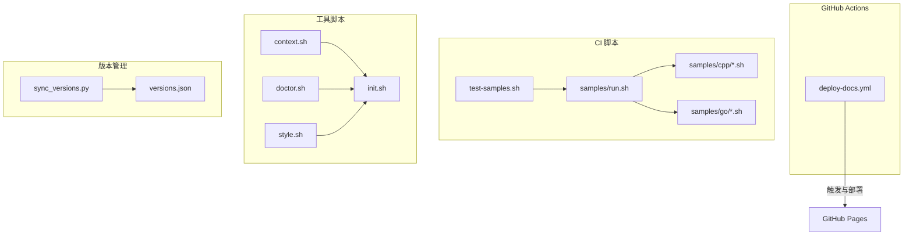
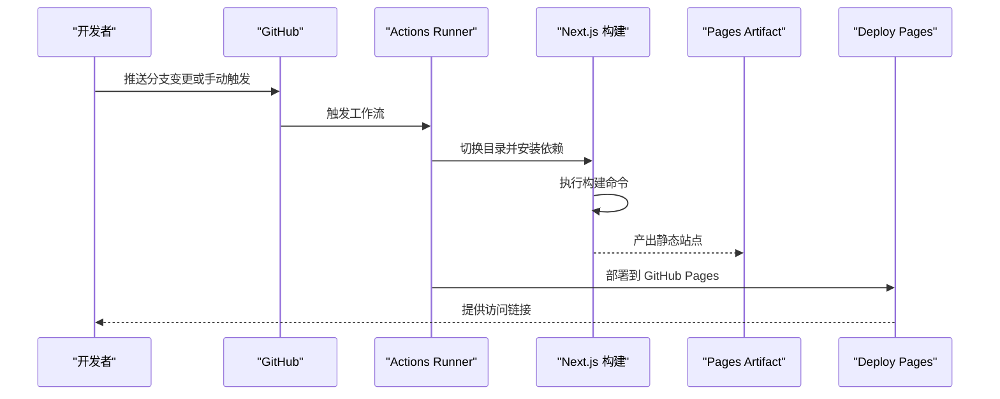
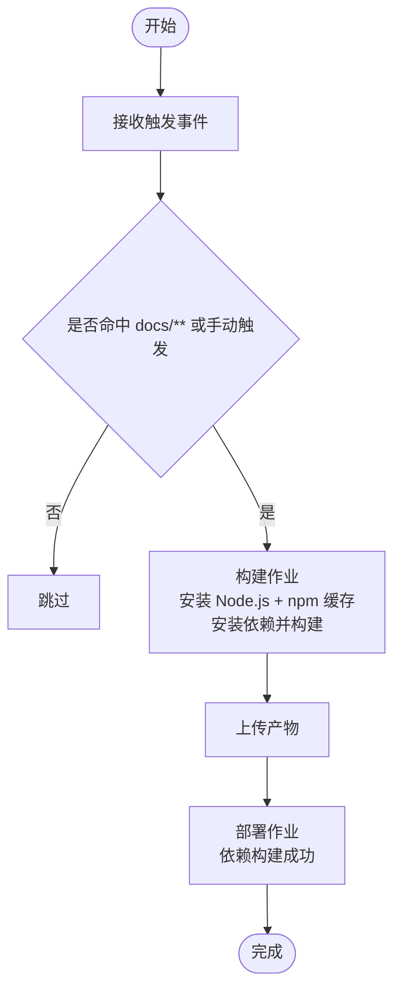
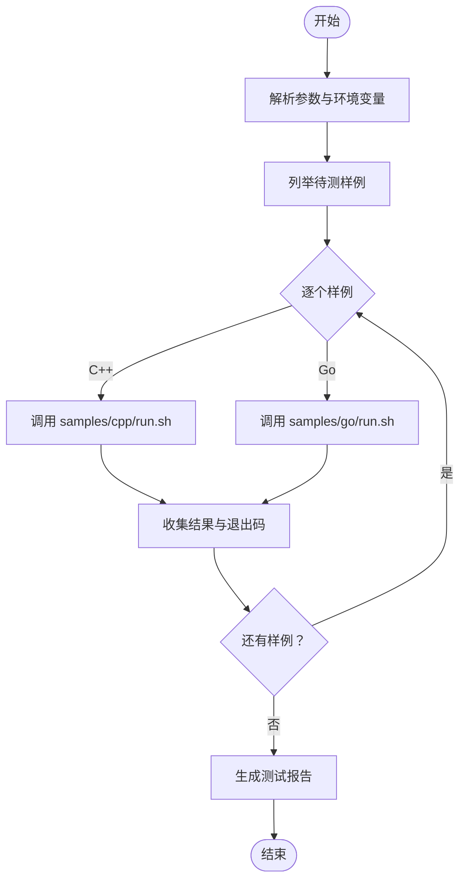
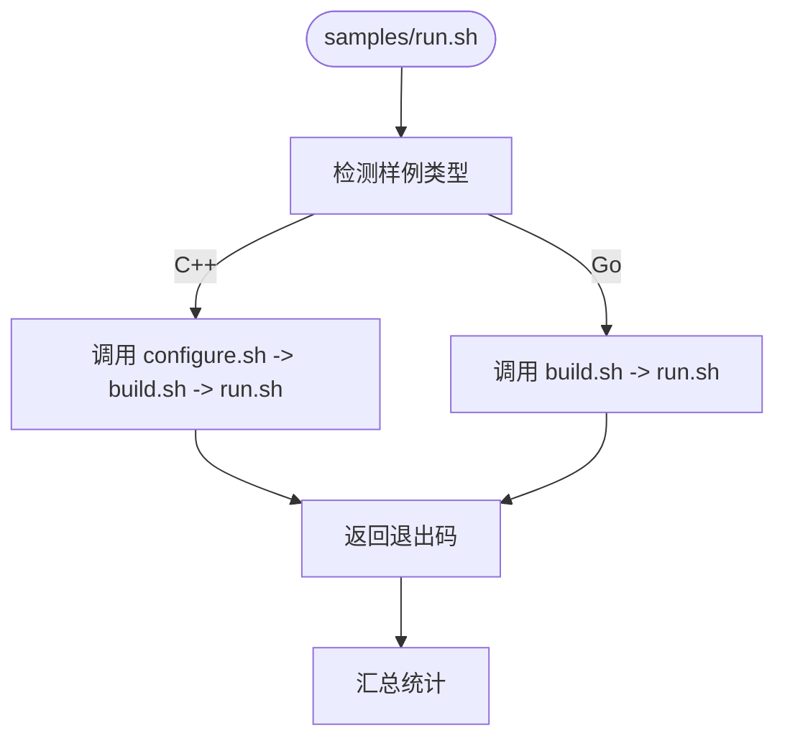
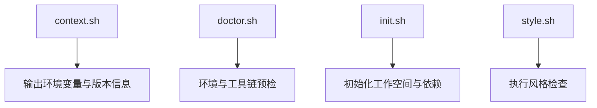
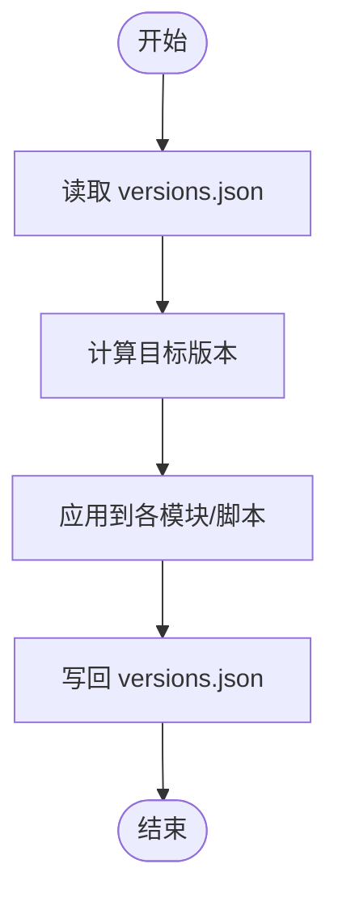
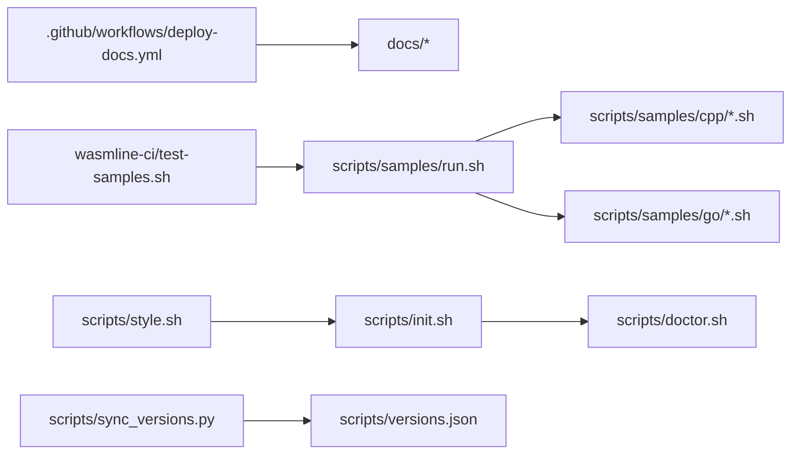

# CI/CD 流水线

<cite>
**本文引用的文件**
- [.github/workflows/deploy-docs.yml](file://.github/workflows/deploy-docs.yml)
- [wasmline-ci/test-samples.sh](file://wasmline-ci/test-samples.sh)
- [scripts/samples/cpp/build.sh](file://scripts/samples/cpp/build.sh)
- [scripts/samples/cpp/configure.sh](file://scripts/samples/cpp/configure.sh)
- [scripts/samples/cpp/run.sh](file://scripts/samples/cpp/run.sh)
- [scripts/samples/go/build.sh](file://scripts/samples/go/build.sh)
- [scripts/samples/go/run.sh](file://scripts/samples/go/run.sh)
- [scripts/samples/run.sh](file://scripts/samples/run.sh)
- [scripts/context.sh](file://scripts/context.sh)
- [scripts/doctor.sh](file://scripts/doctor.sh)
- [scripts/init.sh](file://scripts/init.sh)
- [scripts/style.sh](file://scripts/style.sh)
- [scripts/sync_versions.py](file://scripts/sync_versions.py)
- [scripts/versions.json](file://scripts/versions.json)
</cite>

## 目录
1. [简介](#简介)
2. [项目结构](#项目结构)
3. [核心组件](#核心组件)
4. [架构总览](#架构总览)
5. [详细组件分析](#详细组件分析)
6. [依赖关系分析](#依赖关系分析)
7. [性能考量](#性能考量)
8. [故障排除指南](#故障排除指南)
9. [结论](#结论)
10. [附录](#附录)

## 简介
本指南面向 DevOps 团队与贡献者，系统化说明 Wasmline 的 CI/CD 实施要点，覆盖以下方面：
- GitHub Actions 工作流的配置与执行逻辑（文档部署流水线）
- 多平台构建与测试矩阵的设计思路（结合现有脚本与模块）
- 自动化测试脚本的工作原理（测试样本执行与结果验证）
- 持续集成最佳实践（构建缓存、并行执行、失败恢复）
- 流水线监控与日志分析方法（定位构建问题与性能瓶颈）
- 安全扫描与依赖漏洞检测的集成建议
- 优化与排障实用指南（构建时间优化、资源使用监控）

当前仓库中可见的 CI/CD 相关内容主要集中在文档部署工作流与测试样例脚本。我们将以这些实际文件为基础，给出可落地的实施建议与扩展方案。

## 项目结构
围绕 CI/CD 的关键目录与文件如下：
- 文档部署工作流：.github/workflows/deploy-docs.yml
- 样例测试脚本：wasmline-ci/test-samples.sh
- 跨语言样例脚本：scripts/samples/*/（C++、Go）及统一入口 scripts/samples/run.sh
- 工具链与上下文脚本：scripts/context.sh、scripts/doctor.sh、scripts/init.sh、scripts/style.sh
- 版本同步与版本清单：scripts/sync_versions.py、scripts/versions.json

图表来源
- [.github/workflows/deploy-docs.yml:1-52](file://.github/workflows/deploy-docs.yml#L1-L52)
- [wasmline-ci/test-samples.sh](file://wasmline-ci/test-samples.sh)
- [scripts/samples/run.sh](file://scripts/samples/run.sh)
- [scripts/samples/cpp/build.sh](file://scripts/samples/cpp/build.sh)
- [scripts/samples/cpp/configure.sh](file://scripts/samples/cpp/configure.sh)
- [scripts/samples/cpp/run.sh](file://scripts/samples/cpp/run.sh)
- [scripts/samples/go/build.sh](file://scripts/samples/go/build.sh)
- [scripts/samples/go/run.sh](file://scripts/samples/go/run.sh)
- [scripts/context.sh](file://scripts/context.sh)
- [scripts/doctor.sh](file://scripts/doctor.sh)
- [scripts/init.sh](file://scripts/init.sh)
- [scripts/style.sh](file://scripts/style.sh)
- [scripts/sync_versions.py](file://scripts/sync_versions.py)
- [scripts/versions.json](file://scripts/versions.json)

章节来源
- [.github/workflows/deploy-docs.yml:1-52](file://.github/workflows/deploy-docs.yml#L1-L52)
- [wasmline-ci/test-samples.sh](file://wasmline-ci/test-samples.sh)
- [scripts/samples/run.sh](file://scripts/samples/run.sh)
- [scripts/context.sh](file://scripts/context.sh)
- [scripts/doctor.sh](file://scripts/doctor.sh)
- [scripts/init.sh](file://scripts/init.sh)
- [scripts/style.sh](file://scripts/style.sh)
- [scripts/sync_versions.py](file://scripts/sync_versions.py)
- [scripts/versions.json](file://scripts/versions.json)

## 核心组件
- 文档部署工作流：负责在主分支变更或手动触发时，构建 Next.js 文档并部署到 GitHub Pages。
- 测试样例脚本：集中于 wasmline-ci/test-samples.sh，用于执行多语言样例并进行结果验证。
- 样例执行入口：scripts/samples/run.sh 统一调度 C++ 与 Go 样例的构建与运行。
- 工具链脚本：提供上下文信息、健康检查、初始化与风格检查等辅助能力。
- 版本管理：通过 sync_versions.py 与 versions.json 维护版本一致性，便于 CI 中的版本注入与校验。

章节来源
- [.github/workflows/deploy-docs.yml:1-52](file://.github/workflows/deploy-docs.yml#L1-L52)
- [wasmline-ci/test-samples.sh](file://wasmline-ci/test-samples.sh)
- [scripts/samples/run.sh](file://scripts/samples/run.sh)
- [scripts/context.sh](file://scripts/context.sh)
- [scripts/doctor.sh](file://scripts/doctor.sh)
- [scripts/init.sh](file://scripts/init.sh)
- [scripts/style.sh](file://scripts/style.sh)
- [scripts/sync_versions.py](file://scripts/sync_versions.py)
- [scripts/versions.json](file://scripts/versions.json)

## 架构总览
下图展示文档部署流水线的端到端流程，从代码提交到页面发布。

图表来源
- [.github/workflows/deploy-docs.yml:23-52](file://.github/workflows/deploy-docs.yml#L23-L52)

## 详细组件分析

### 文档部署工作流（deploy-docs.yml）
- 触发条件：主分支推送且路径匹配 docs/** 或手动触发
- 权限设置：读取内容、写入 Pages、签发 ID Token
- 并发控制：使用 concurrency 分组避免并发部署
- 步骤拆分：构建与部署两个作业，部署依赖构建成功
- 缓存策略：Node.js 使用 npm 缓存，加速依赖安装

图表来源
- [.github/workflows/deploy-docs.yml:4-52](file://.github/workflows/deploy-docs.yml#L4-L52)

章节来源
- [.github/workflows/deploy-docs.yml:1-52](file://.github/workflows/deploy-docs.yml#L1-L52)

### 测试样例执行（wasmline-ci/test-samples.sh）
- 目标：对多语言样例进行自动化执行与结果验证
- 建议流程：
  - 解析参数与环境变量，准备测试上下文
  - 遍历样例集合，按语言分类执行
  - 记录每个样例的退出码与输出，汇总统计
  - 生成报告并根据阈值决定整体状态

图表来源
- [wasmline-ci/test-samples.sh](file://wasmline-ci/test-samples.sh)

章节来源
- [wasmline-ci/test-samples.sh](file://wasmline-ci/test-samples.sh)

### 样例执行入口与子脚本（scripts/samples/run.sh 及其子脚本）
- 统一入口：scripts/samples/run.sh 负责路由到具体语言样例
- C++ 样例：包含 configure、build、run 三阶段脚本，便于在 CI 中按需组合
- Go 样例：包含 build 与 run 脚本，简化执行流程
- 建议在 CI 中：
  - 使用缓存目录存放编译产物，减少重复编译时间
  - 对不同平台/架构设置矩阵，实现并行执行
  - 将失败样例单独记录，便于快速定位

图表来源
- [scripts/samples/run.sh](file://scripts/samples/run.sh)
- [scripts/samples/cpp/configure.sh](file://scripts/samples/cpp/configure.sh)
- [scripts/samples/cpp/build.sh](file://scripts/samples/cpp/build.sh)
- [scripts/samples/cpp/run.sh](file://scripts/samples/cpp/run.sh)
- [scripts/samples/go/build.sh](file://scripts/samples/go/build.sh)
- [scripts/samples/go/run.sh](file://scripts/samples/go/run.sh)

章节来源
- [scripts/samples/run.sh](file://scripts/samples/run.sh)
- [scripts/samples/cpp/configure.sh](file://scripts/samples/cpp/configure.sh)
- [scripts/samples/cpp/build.sh](file://scripts/samples/cpp/build.sh)
- [scripts/samples/cpp/run.sh](file://scripts/samples/cpp/run.sh)
- [scripts/samples/go/build.sh](file://scripts/samples/go/build.sh)
- [scripts/samples/go/run.sh](file://scripts/samples/go/run.sh)

### 工具链与上下文（scripts/context.sh、scripts/doctor.sh、scripts/init.sh、scripts/style.sh）
- 上下文脚本：提供 CI 环境变量、平台信息与版本摘要，便于诊断与日志关联
- 健康检查：doctor.sh 可用于预检环境依赖与工具链可用性
- 初始化：init.sh 负责拉起必要依赖、设置工作空间与权限
- 风格检查：style.sh 用于统一代码风格，可在 PR 流程中作为质量门禁

图表来源
- [scripts/context.sh](file://scripts/context.sh)
- [scripts/doctor.sh](file://scripts/doctor.sh)
- [scripts/init.sh](file://scripts/init.sh)
- [scripts/style.sh](file://scripts/style.sh)

章节来源
- [scripts/context.sh](file://scripts/context.sh)
- [scripts/doctor.sh](file://scripts/doctor.sh)
- [scripts/init.sh](file://scripts/init.sh)
- [scripts/style.sh](file://scripts/style.sh)

### 版本管理（scripts/sync_versions.py 与 scripts/versions.json）
- 同步策略：在 CI 中运行 sync_versions.py，确保各模块版本一致
- 清单维护：versions.json 作为单一事实源，供脚本读取与写回
- 建议：在 PR 合并前执行版本同步与校验，避免版本漂移导致的构建不一致

图表来源
- [scripts/sync_versions.py](file://scripts/sync_versions.py)
- [scripts/versions.json](file://scripts/versions.json)

章节来源
- [scripts/sync_versions.py](file://scripts/sync_versions.py)
- [scripts/versions.json](file://scripts/versions.json)

## 依赖关系分析
- 工作流依赖：deploy-docs.yml 依赖 GitHub Pages 与 Actions 生态；构建阶段依赖 Node.js 与 npm 缓存
- 脚本依赖：test-samples.sh 依赖 samples/run.sh 与其子脚本；samples/run.sh 依赖 C++/Go 子脚本
- 工具链依赖：init.sh 依赖 doctor.sh 进行预检；style.sh 依赖外部 linter 工具
- 版本依赖：sync_versions.py 依赖 versions.json 作为版本权威来源

图表来源
- [.github/workflows/deploy-docs.yml:1-52](file://.github/workflows/deploy-docs.yml#L1-L52)
- [wasmline-ci/test-samples.sh](file://wasmline-ci/test-samples.sh)
- [scripts/samples/run.sh](file://scripts/samples/run.sh)
- [scripts/samples/cpp/build.sh](file://scripts/samples/cpp/build.sh)
- [scripts/samples/cpp/run.sh](file://scripts/samples/cpp/run.sh)
- [scripts/samples/go/build.sh](file://scripts/samples/go/build.sh)
- [scripts/samples/go/run.sh](file://scripts/samples/go/run.sh)
- [scripts/init.sh](file://scripts/init.sh)
- [scripts/doctor.sh](file://scripts/doctor.sh)
- [scripts/style.sh](file://scripts/style.sh)
- [scripts/sync_versions.py](file://scripts/sync_versions.py)
- [scripts/versions.json](file://scripts/versions.json)

章节来源
- [.github/workflows/deploy-docs.yml:1-52](file://.github/workflows/deploy-docs.yml#L1-L52)
- [wasmline-ci/test-samples.sh](file://wasmline-ci/test-samples.sh)
- [scripts/samples/run.sh](file://scripts/samples/run.sh)
- [scripts/samples/cpp/build.sh](file://scripts/samples/cpp/build.sh)
- [scripts/samples/cpp/run.sh](file://scripts/samples/cpp/run.sh)
- [scripts/samples/go/build.sh](file://scripts/samples/go/build.sh)
- [scripts/samples/go/run.sh](file://scripts/samples/go/run.sh)
- [scripts/init.sh](file://scripts/init.sh)
- [scripts/doctor.sh](file://scripts/doctor.sh)
- [scripts/style.sh](file://scripts/style.sh)
- [scripts/sync_versions.py](file://scripts/sync_versions.py)
- [scripts/versions.json](file://scripts/versions.json)

## 性能考量
- 构建缓存
  - 文档构建：已启用 npm 缓存，建议固定 Node.js 版本并复用缓存目录
  - 样例构建：在 CI 中为 C++/Go 设置独立缓存键，避免跨平台污染
- 并行执行
  - 使用矩阵策略对不同平台/语言并行执行，缩短总耗时
  - 将“构建”与“测试”分离为独立作业，提高重试粒度
- 失败恢复
  - 对不稳定步骤启用自动重试与超时控制
  - 将失败样例单独归档，便于离线复现
- 资源监控
  - 在作业中输出关键指标（如构建耗时、缓存命中率），用于趋势分析

## 故障排除指南
- 文档部署失败
  - 检查 Node.js 版本与依赖安装是否稳定；确认缓存键与依赖锁文件一致
  - 查看 Pages 部署日志中的权限与产物路径
- 样例执行异常
  - 使用 doctor.sh 进行环境预检，确认编译器与运行时可用
  - 在 CI 日志中定位具体样例的退出码与错误输出
- 版本不一致
  - 在 PR 合并前执行 sync_versions.py，确保版本清单更新
  - 若出现冲突，优先以 versions.json 为准，回滚或重放同步

章节来源
- [.github/workflows/deploy-docs.yml:13-21](file://.github/workflows/deploy-docs.yml#L13-L21)
- [scripts/doctor.sh](file://scripts/doctor.sh)
- [scripts/sync_versions.py](file://scripts/sync_versions.py)
- [scripts/versions.json](file://scripts/versions.json)

## 结论
本指南基于仓库现有文件，给出了文档部署工作流与测试样例执行的实施要点，并提供了多平台构建与测试矩阵、缓存与并行、失败恢复与监控、安全与依赖扫描的扩展建议。建议团队在此基础上逐步完善 CI 能力，持续优化构建性能与稳定性。

## 附录
- 最佳实践清单
  - 使用固定版本与缓存键，提升可重复性与速度
  - 将“构建—测试—部署”解耦为独立作业，支持细粒度重试
  - 引入安全扫描与依赖漏洞检测，作为质量门禁
  - 建立日志与指标体系，定期回顾性能瓶颈