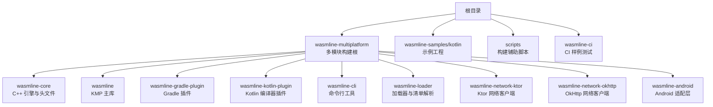
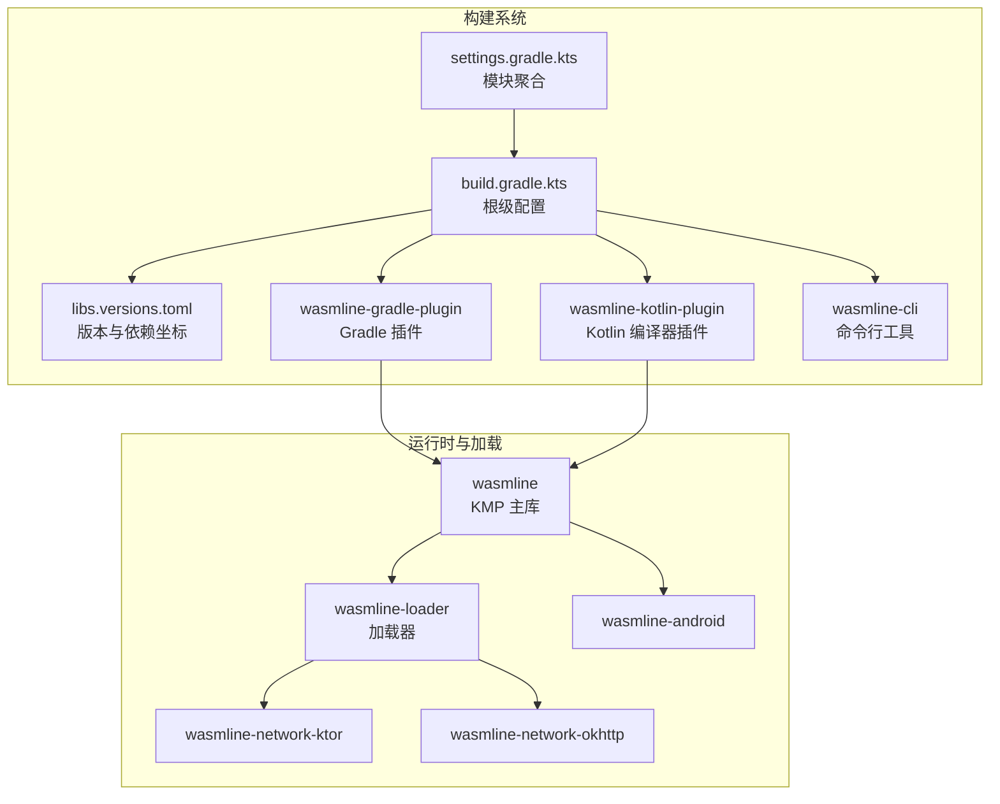
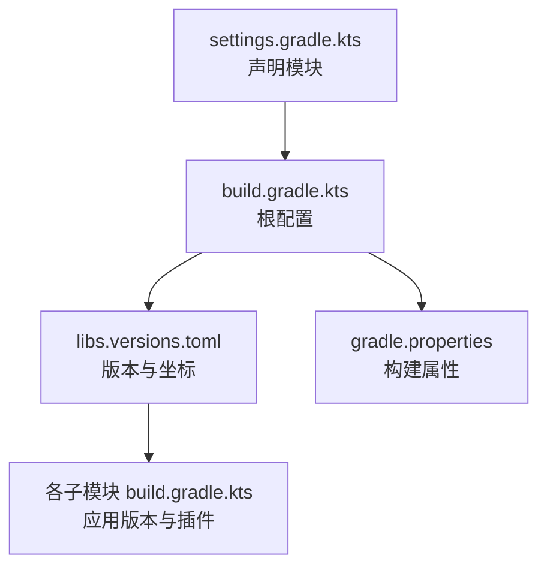
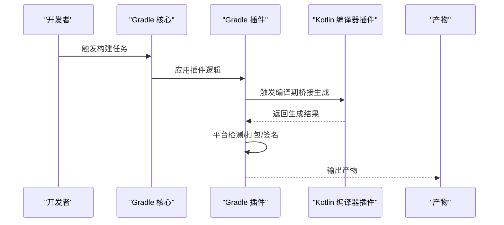
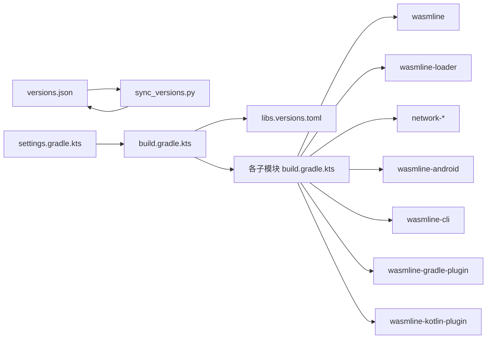

# 构建与部署

<cite>
**本文引用的文件**
- [settings.gradle.kts](file://wasmline-multiplatform/settings.gradle.kts)
- [build.gradle.kts](file://wasmline-multiplatform/build.gradle.kts)
- [gradle.properties](file://wasmline-multiplatform/gradle.properties)
- [libs.versions.toml](file://wasmline-multiplatform/gradle/multiplatform/gradle/libs.versions.toml)
- [wasmline/build.gradle.kts](file://wasmline-multiplatform/wasmline/build.gradle.kts)
- [wasmline-gradle-plugin/build.gradle.kts](file://wasmline-multiplatform/wasmline-gradle-plugin/build.gradle.kts)
- [wasmline-kotlin-plugin/build.gradle.kts](file://wasmline-multiplatform/wasmline-kotlin-plugin/build.gradle.kts)
- [wasmline-cli/build.gradle.kts](file://wasmline-multiplatform/wasmline-cli/build.gradle.kts)
- [wasmline-loader/build.gradle.kts](file://wasmline-multiplatform/wasmline-loader/build.gradle.kts)
- [wasmline-network-ktor/build.gradle.kts](file://wasmline-multiplatform/wasmline-network-ktor/build.gradle.kts)
- [wasmline-network-okhttp/build.gradle.kts](file://wasmline-multiplatform/wasmline-network-okhttp/build.gradle.kts)
- [wasmline-android/build.gradle.kts](file://wasmline-multiplatform/wasmline-android/build.gradle.kts)
- [gradle-build.md](file://wasmline-multiplatform/wasmline/build.gradle-build.md)
- [zig-build.md](file://wasmline-multiplatform/wasmline/zig-build.md)
- [compile.md](file://wasmline-multiplatform/wasmline-cli/compile.md)
- [download.md](file://wasmline-multiplatform/wasmline-cli/download.md)
- [keys.md](file://wasmline-multiplatform/wasmline-cli/keys.md)
- [manifest.md](file://wasmline-multiplatform/wasmline-cli/manifest.md)
- [build.md](file://wasmline-multiplatform/wasmline-cli/build.md)
- [sync_versions.py](file://scripts/sync_versions.py)
- [versions.json](file://scripts/versions.json)
- [test-samples.sh](file://wasmline-ci/test-samples.sh)
- [doctor.sh](file://scripts/doctor.sh)
- [context.sh](file://scripts/context.sh)
- [init.sh](file://scripts/init.sh)
- [style.sh](file://scripts/style.sh)
- [run.sh](file://scripts/samples/run.sh)
- [run-android.sh](file://wasmline-samples/kotlin/run-android.sh)
- [run-application.sh](file://wasmline-samples/kotlin/run-application.sh)
- [run-desktop.sh](file://wasmline-samples/kotlin/run-desktop.sh)
- [run-ios.sh](file://wasmline-samples/kotlin/run-ios.sh)
- [run-web-js.sh](file://wasmline-samples/kotlin/run-web-js.sh)
- [run-web-wasm.sh](file://wasmline-samples/kotlin/run-web-wasm.sh)
- [README.md](file://README.md)
- [README_zh.md](file://README_zh.md)
</cite>

## 目录
1. [简介](#简介)
2. [项目结构](#项目结构)
3. [核心组件](#核心组件)
4. [架构总览](#架构总览)
5. [详细组件分析](#详细组件分析)
6. [依赖分析](#依赖分析)
7. [性能考虑](#性能考虑)
8. [故障排查指南](#故障排查指南)
9. [结论](#结论)
10. [附录](#附录)

## 简介
本文件面向 DevOps 工程师与持续集成开发者，系统性阐述 Wasmline 的构建与部署体系，覆盖多模块 Gradle 架构、版本管理策略、构建流程阶段、不同环境的配置要点、依赖与发布流程、性能优化与并行构建策略，以及常见问题的诊断与解决方法。内容以仓库中实际文件为依据，避免臆测，确保可操作性与可追溯性。

## 项目结构
Wasmline 采用 Gradle 多模块组织，核心位于 wasmline-multiplatform 目录，包含 Kotlin Multiplatform 主库、Gradle 插件、Kotlin 编译器插件、CLI、加载器、网络适配器、Android 适配层等子模块；wasmline-samples 提供多平台示例工程；scripts 提供版本同步、健康检查、上下文设置等工具脚本；wasmline-ci 提供 CI 测试样例脚本。

图示来源
- [settings.gradle.kts](file://wasmline-multiplatform/settings.gradle.kts)
- [build.gradle.kts](file://wasmline-multiplatform/build.gradle.kts)

章节来源
- [settings.gradle.kts](file://wasmline-multiplatform/settings.gradle.kts)
- [build.gradle.kts](file://wasmline-multiplatform/build.gradle.kts)

## 核心组件
- Gradle 多模块根：统一版本、插件与仓库配置，聚合所有子模块。
- Kotlin Multiplatform 主库：跨平台运行时桥接、序列化、服务绑定、加载器等。
- Gradle 插件：封装构建任务、平台检测、产物打包与签名。
- Kotlin 编译器插件：生成桥接代码、校验服务契约、重写入口点。
- CLI：编译、下载、密钥生成、清单管理与构建辅助。
- 加载器：本地/远程包解析、缓存、可信密钥校验。
- 网络适配器：Ktor 与 OkHttp 两种实现，适配不同宿主环境。
- Android 适配层：JNI、日志、资源与 CMake 集成。
- 版本同步与脚本：集中维护版本号，CI/CD 自动化。

章节来源
- [wasmline/build.gradle.kts](file://wasmline-multiplatform/wasmline/build.gradle.kts)
- [wasmline-gradle-plugin/build.gradle.kts](file://wasmline-multiplatform/wasmline-gradle-plugin/build.gradle.kts)
- [wasmline-kotlin-plugin/build.gradle.kts](file://wasmline-multiplatform/wasmline-kotlin-plugin/build.gradle.kts)
- [wasmline-cli/build.gradle.kts](file://wasmline-multiplatform/wasmline-cli/build.gradle.kts)
- [wasmline-loader/build.gradle.kts](file://wasmline-multiplatform/wasmline-loader/build.gradle.kts)
- [wasmline-network-ktor/build.gradle.kts](file://wasmline-multiplatform/wasmline-network-ktor/build.gradle.kts)
- [wasmline-network-okhttp/build.gradle.kts](file://wasmline-multiplatform/wasmline-network-okhttp/build.gradle.kts)
- [wasmline-android/build.gradle.kts](file://wasmline-multiplatform/wasmline-android/build.gradle.kts)

## 架构总览
下图展示 Wasmline 构建系统的高层交互：Gradle 多模块在 settings 中声明，build 脚本定义任务与依赖；Kotlin 编译器插件在编译期生成桥接代码；Gradle 插件负责平台检测与打包；CLI 作为外部工具参与编译与分发；加载器在运行时解析与加载 WASM 包。

图示来源
- [settings.gradle.kts](file://wasmline-multiplatform/settings.gradle.kts)
- [build.gradle.kts](file://wasmline-multiplatform/build.gradle.kts)
- [libs.versions.toml](file://wasmline-multiplatform/gradle/multiplatform/gradle/libs.versions.toml)
- [wasmline-gradle-plugin/build.gradle.kts](file://wasmline-multiplatform/wasmline-gradle-plugin/build.gradle.kts)
- [wasmline-kotlin-plugin/build.gradle.kts](file://wasmline-multiplatform/wasmline-kotlin-plugin/build.gradle.kts)
- [wasmline-cli/build.gradle.kts](file://wasmline-multiplatform/wasmline-cli/build.gradle.kts)
- [wasmline/build.gradle.kts](file://wasmline-multiplatform/wasmline/build.gradle.kts)
- [wasmline-loader/build.gradle.kts](file://wasmline-multiplatform/wasmline-loader/build.gradle.kts)
- [wasmline-network-ktor/build.gradle.kts](file://wasmline-multiplatform/wasmline-network-ktor/build.gradle.kts)
- [wasmline-network-okhttp/build.gradle.kts](file://wasmline-multiplatform/wasmline-network-okhttp/build.gradle.kts)
- [wasmline-android/build.gradle.kts](file://wasmline-multiplatform/wasmline-android/build.gradle.kts)

## 详细组件分析

### Gradle 多模块与版本管理
- 模块聚合：通过 settings 文件声明所有子模块，确保构建顺序与可见性。
- 版本与依赖坐标：集中于 libs.versions.toml，便于统一升级与一致性校验。
- 根级配置：统一插件版本、仓库源、Java/Kotlin/编译选项等。
- 属性与缓存：gradle.properties 控制并行度、堆大小、缓存行为等。

图示来源
- [settings.gradle.kts](file://wasmline-multiplatform/settings.gradle.kts)
- [build.gradle.kts](file://wasmline-multiplatform/build.gradle.kts)
- [gradle.properties](file://wasmline-multiplatform/gradle.properties)
- [libs.versions.toml](file://wasmline-multiplatform/gradle/multiplatform/gradle/libs.versions.toml)

章节来源
- [settings.gradle.kts](file://wasmline-multiplatform/settings.gradle.kts)
- [build.gradle.kts](file://wasmline-multiplatform/build.gradle.kts)
- [gradle.properties](file://wasmline-multiplatform/gradle.properties)
- [libs.versions.toml](file://wasmline-multiplatform/gradle/multiplatform/gradle/libs.versions.toml)

### Kotlin Multiplatform 主库（wasmline）
- 职责：提供跨平台 API、桥接生成、序列化配置、服务绑定与加载器。
- 关键特性：按平台区分源集（androidMain、jvmMain、jsMain、wasmJsMain、wasmWasiMain、webMain、iosMain），通过 Gradle 插件与编译器插件协同工作。
- 构建说明：参考模块内构建文档，了解 Zig/C++ 产物集成与平台特定处理。

章节来源
- [wasmline/build.gradle.kts](file://wasmline-multiplatform/wasmline/build.gradle.kts)
- [gradle-build.md](file://wasmline-multiplatform/wasmline/build.gradle-build.md)
- [zig-build.md](file://wasmline-multiplatform/wasmline/zig-build.md)

### Gradle 插件（wasmline-gradle-plugin）
- 职责：封装平台检测、产物打包、签名与上传等任务；为多平台模块提供一致的构建体验。
- 典型流程：解析目标平台 → 选择网络实现 → 生成/注入桥接 → 打包产物 → 可选签名与发布。

图示来源
- [wasmline-gradle-plugin/build.gradle.kts](file://wasmline-multiplatform/wasmline-gradle-plugin/build.gradle.kts)
- [wasmline/build.gradle.kts](file://wasmline-multiplatform/wasmline/build.gradle.kts)
- [wasmline-kotlin-plugin/build.gradle.kts](file://wasmline-multiplatform/wasmline-kotlin-plugin/build.gradle.kts)

章节来源
- [wasmline-gradle-plugin/build.gradle.kts](file://wasmline-multiplatform/wasmline-gradle-plugin/build.gradle.kts)

### Kotlin 编译器插件（wasmline-kotlin-plugin）
- 职责：在编译期生成桥接代码、校验服务契约、重写入口点，保证运行时调用链正确性。
- 影响范围：直接影响 wasmline 主库的桥接质量与运行时稳定性。

章节来源
- [wasmline-kotlin-plugin/build.gradle.kts](file://wasmline-multiplatform/wasmline-kotlin-plugin/build.gradle.kts)

### CLI（wasmline-cli）
- 功能：编译、下载、密钥生成、清单管理与构建辅助。
- 使用场景：本地开发、自动化流水线、离线构建与验证。

章节来源
- [wasmline-cli/build.gradle.kts](file://wasmline-multiplatform/wasmline-cli/build.gradle.kts)
- [compile.md](file://wasmline-multiplatform/wasmline-cli/compile.md)
- [download.md](file://wasmline-multiplatform/wasmline-cli/download.md)
- [keys.md](file://wasmline-multiplatform/wasmline-cli/keys.md)
- [manifest.md](file://wasmline-multiplatform/wasmline-cli/manifest.md)
- [build.md](file://wasmline-multiplatform/wasmline-cli/build.md)

### 加载器（wasmline-loader）
- 职责：解析本地/远程包、缓存管理、可信密钥校验、清单模型。
- 平台差异：针对不同宿主平台提供特定实现（Android、iOS、JVM、JS、WASM）。

章节来源
- [wasmline-loader/build.gradle.kts](file://wasmline-multiplatform/wasmline-loader/build.gradle.kts)

### 网络适配器（wasmline-network-ktor / wasmline-network-okhttp）
- 职责：为加载器提供网络请求能力，支持 Ktor 与 OkHttp 两种实现。
- 选择策略：根据宿主平台与需求选择合适实现。

章节来源
- [wasmline-network-ktor/build.gradle.kts](file://wasmline-multiplatform/wasmline-network-ktor/build.gradle.kts)
- [wasmline-network-okhttp/build.gradle.kts](file://wasmline-multiplatform/wasmline-network-okhttp/build.gradle.kts)

### Android 适配层（wasmline-android）
- 职责：JNI、日志、资源与 CMake 集成，支撑 Android 平台运行。
- 关注点：NDK、ABI、CMakeLists 与 Gradle 配置一致性。

章节来源
- [wasmline-android/build.gradle.kts](file://wasmline-multiplatform/wasmline-android/build.gradle.kts)

## 依赖分析
- 内部依赖：各子模块通过 settings 聚合，根级 build 统一版本与仓库；KMP 主库依赖加载器与网络适配器；Gradle 插件依赖 Kotlin 编译器插件与 KMP 主库。
- 外部依赖：版本由 libs.versions.toml 统一管理，避免漂移；gradle.properties 控制构建行为。
- 版本同步：通过 scripts/sync_versions.py 与 versions.json 维护版本一致性，CI 可执行测试样例脚本进行回归验证。

图示来源
- [sync_versions.py](file://scripts/sync_versions.py)
- [versions.json](file://scripts/versions.json)
- [settings.gradle.kts](file://wasmline-multiplatform/settings.gradle.kts)
- [build.gradle.kts](file://wasmline-multiplatform/build.gradle.kts)
- [libs.versions.toml](file://wasmline-multiplatform/gradle/multiplatform/gradle/libs.versions.toml)
- [wasmline/build.gradle.kts](file://wasmline-multiplatform/wasmline/build.gradle.kts)
- [wasmline-loader/build.gradle.kts](file://wasmline-multiplatform/wasmline-loader/build.gradle.kts)
- [wasmline-network-ktor/build.gradle.kts](file://wasmline-multiplatform/wasmline-network-ktor/build.gradle.kts)
- [wasmline-network-okhttp/build.gradle.kts](file://wasmline-multiplatform/wasmline-network-okhttp/build.gradle.kts)
- [wasmline-android/build.gradle.kts](file://wasmline-multiplatform/wasmline-android/build.gradle.kts)
- [wasmline-cli/build.gradle.kts](file://wasmline-multiplatform/wasmline-cli/build.gradle.kts)
- [wasmline-gradle-plugin/build.gradle.kts](file://wasmline-multiplatform/wasmline-gradle-plugin/build.gradle.kts)
- [wasmline-kotlin-plugin/build.gradle.kts](file://wasmline-multiplatform/wasmline-kotlin-plugin/build.gradle.kts)

章节来源
- [sync_versions.py](file://scripts/sync_versions.py)
- [versions.json](file://scripts/versions.json)
- [settings.gradle.kts](file://wasmline-multiplatform/settings.gradle.kts)
- [build.gradle.kts](file://wasmline-multiplatform/build.gradle.kts)
- [libs.versions.toml](file://wasmline-multiplatform/gradle/multiplatform/gradle/libs.versions.toml)

## 性能考虑
- 并行构建：合理设置 Gradle 并行度与 JVM 堆大小，避免 OOM；利用 Gradle 配置缓存与构建缓存。
- 任务粒度：拆分编译、链接、打包、签名等任务，便于增量构建与缓存复用。
- 平台特定优化：Android NDK、Zig/C++ 编译参数、JS/WASM 产物压缩与 Tree-shaking。
- 依赖锁定：通过版本目录统一管理依赖，减少冲突与重复下载。
- CI 并行：将不同平台的构建任务并行执行，缩短整体流水线时间。

## 故障排查指南
- 健康检查：使用 scripts/doctor.sh 检查环境变量、工具链与权限。
- 上下文设置：使用 scripts/context.sh 初始化构建上下文。
- 版本不一致：执行 scripts/sync_versions.py 与 scripts/versions.json 同步版本，再运行 wasmline-ci/test-samples.sh 进行回归验证。
- 示例运行：通过 wasmline-samples/kotlin 下的 run-*.sh 快速定位平台相关问题。
- 常见症状与建议
  - 编译失败：检查 Kotlin/Java 版本、KMP 目标平台是否启用、C++/Zig 工具链可用性。
  - 依赖冲突：核对 libs.versions.toml 与各模块 build.gradle.kts 的版本映射。
  - Android 构建异常：确认 NDK、SDK、ABI 与 CMake 配置一致。
  - CI 失败：结合 doctor.sh 与 test-samples.sh 定位问题根因。

章节来源
- [doctor.sh](file://scripts/doctor.sh)
- [context.sh](file://scripts/context.sh)
- [sync_versions.py](file://scripts/sync_versions.py)
- [versions.json](file://scripts/versions.json)
- [test-samples.sh](file://wasmline-ci/test-samples.sh)
- [run-android.sh](file://wasmline-samples/kotlin/run-android.sh)
- [run-application.sh](file://wasmline-samples/kotlin/run-application.sh)
- [run-desktop.sh](file://wasmline-samples/kotlin/run-desktop.sh)
- [run-ios.sh](file://wasmline-samples/kotlin/run-ios.sh)
- [run-web-js.sh](file://wasmline-samples/kotlin/run-web-js.sh)
- [run-web-wasm.sh](file://wasmline-samples/kotlin/run-web-wasm.sh)

## 结论
Wasmline 的构建与部署体系以 Gradle 多模块为核心，配合版本目录、编译器与 Gradle 插件、CLI 工具链，形成从源码到产物的完整闭环。通过统一版本管理、清晰的模块边界与平台适配层，项目在多平台上实现了可维护、可扩展与可重复的构建流程。建议在 CI/CD 中固化上述脚本与配置，并结合性能优化策略提升构建效率与稳定性。

## 附录
- 开发环境
  - 安装 JDK/Kotlin/Gradle，准备 NDK/SDK（Android）、Xcode（iOS）、Zig/C++ 工具链。
  - 使用 scripts/init.sh 初始化环境，doctor.sh 检查依赖。
  - 通过 run-*.sh 快速验证各平台构建与运行。
- CI/CD 环境
  - 在流水线中执行 sync_versions.py 与 test-samples.sh，确保版本一致与功能回归。
  - 将 Gradle 缓存与依赖缓存纳入流水线缓存策略。
- 生产环境
  - 使用 Gradle 插件完成签名与发布；CLI 支持离线编译与分发。
  - 加载器在运行时负责安全校验与缓存，确保产物可信与高效加载。

章节来源
- [init.sh](file://scripts/init.sh)
- [doctor.sh](file://scripts/doctor.sh)
- [sync_versions.py](file://scripts/sync_versions.py)
- [test-samples.sh](file://wasmline-ci/test-samples.sh)
- [run-android.sh](file://wasmline-samples/kotlin/run-android.sh)
- [run-application.sh](file://wasmline-samples/kotlin/run-application.sh)
- [run-desktop.sh](file://wasmline-samples/kotlin/run-desktop.sh)
- [run-ios.sh](file://wasmline-samples/kotlin/run-ios.sh)
- [run-web-js.sh](file://wasmline-samples/kotlin/run-web-js.sh)
- [run-web-wasm.sh](file://wasmline-samples/kotlin/run-web-wasm.sh)
- [README.md](file://README.md)
- [README_zh.md](file://README_zh.md)