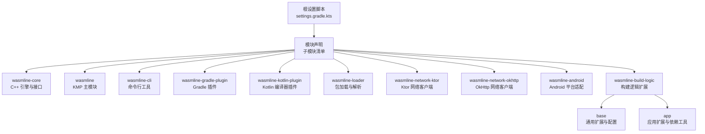
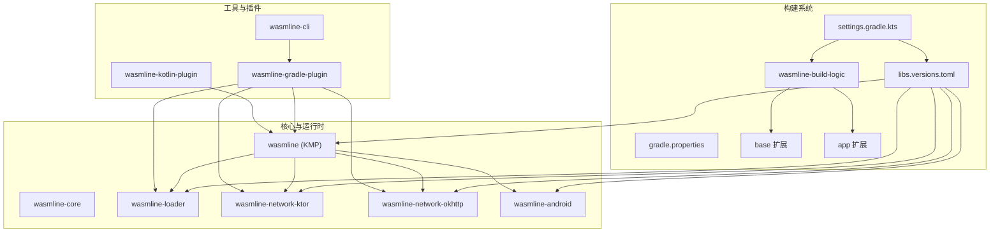
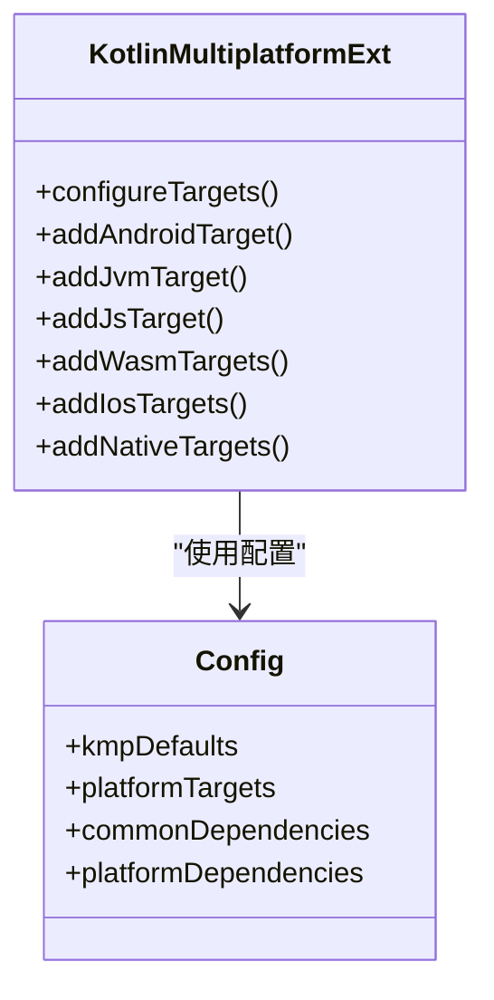
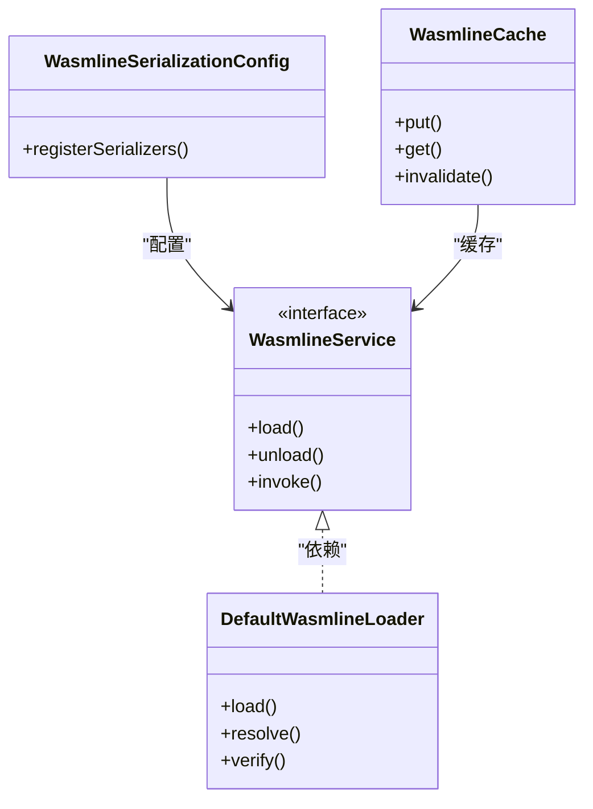
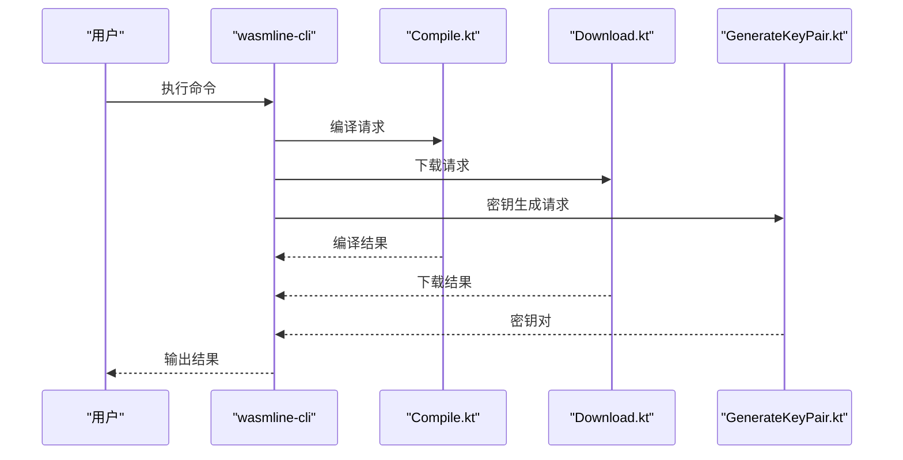
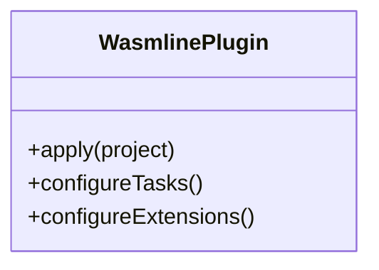
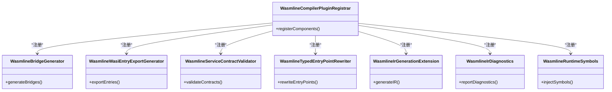
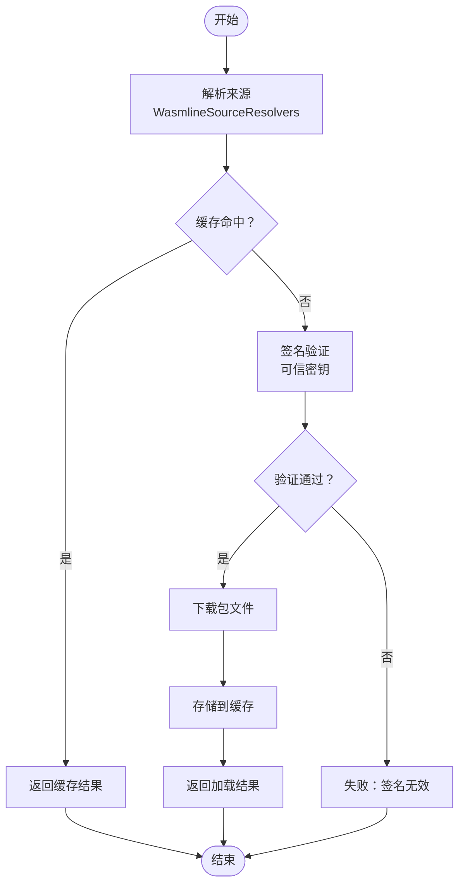
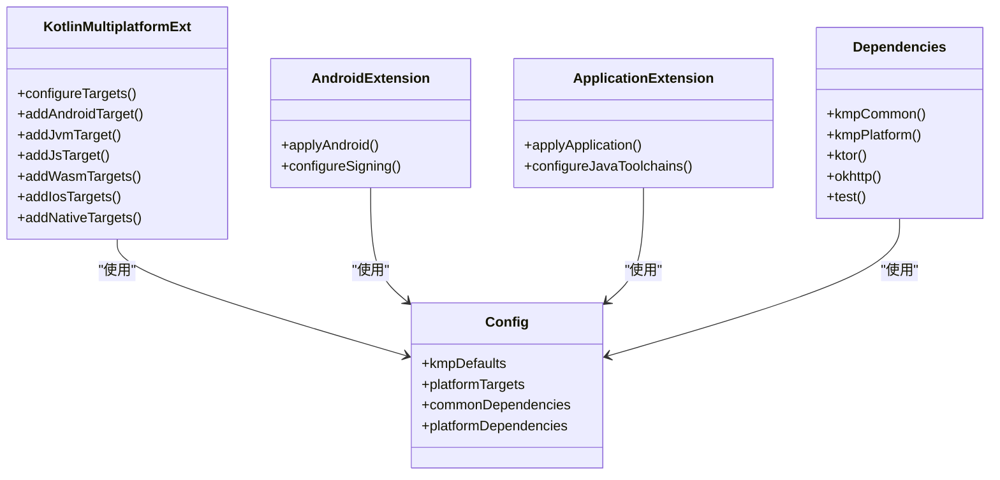
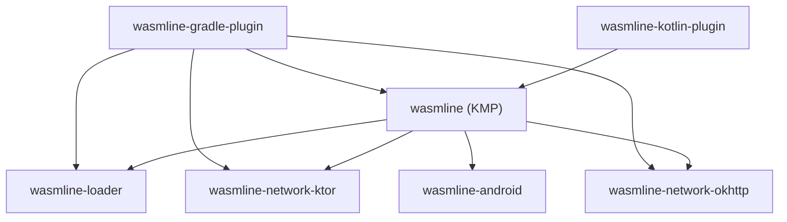

# 构建系统配置

<cite>
**本文引用的文件**
- [settings.gradle.kts](file://wasmline-multiplatform/settings.gradle.kts)
- [build.gradle.kts](file://wasmline-multiplatform/build.gradle.kts)
- [gradle.properties](file://wasmline-multiplatform/gradle.properties)
- [libs.versions.toml](file://wasmline-multiplatform/gradle/libs.versions.toml)
- [wasmline/build.gradle.kts](file://wasmline-multiplatform/wasmline/build.gradle.kts)
- [wasmline-cli/build.gradle.kts](file://wasmline-multiplatform/wasmline-cli/build.gradle.kts)
- [wasmline-gradle-plugin/build.gradle.kts](file://wasmline-multiplatform/wasmline-gradle-plugin/build.gradle.kts)
- [wasmline-kotlin-plugin/build.gradle.kts](file://wasmline-multiplatform/wasmline-kotlin-plugin/build.gradle.kts)
- [wasmline-loader/build.gradle.kts](file://wasmline-multiplatform/wasmline-loader/build.gradle.kts)
- [wasmline-network-ktor/build.gradle.kts](file://wasmline-multiplatform/wasmline-network-ktor/build.gradle.kts)
- [wasmline-network-okhttp/build.gradle.kts](file://wasmline-multiplatform/wasmline-network-okhttp/build.gradle.kts)
- [wasmline-android/build.gradle.kts](file://wasmline-multiplatform/wasmline-android/build.gradle.kts)
- [wasmline-build-logic/base/build.gradle.kts](file://wasmline-multiplatform/wasmline-build-logic/base/build.gradle.kts)
- [wasmline-build-logic/app/build.gradle.kts](file://wasmline-multiplatform/wasmline-build-logic/app/build.gradle.kts)
- [wasmline-build-logic/settings.gradle.kts](file://wasmline-multiplatform/wasmline-build-logic/settings.gradle.kts)
- [KotlinMultiplatformExt.kt](file://wasmline-multiplatform/wasmline-build-logic/base/src/main/kotlin/buildlogic/KotlinMultiplatformExt.kt)
- [Config.kt](file://wasmline-multiplatform/wasmline-build-logic/base/src/main/kotlin/buildlogic/Config.kt)
- [AndroidExtension.kt](file://wasmline-multiplatform/wasmline-build-logic/app/src/main/kotlin/extensions/AndroidExtension.kt)
- [ApplicationExtension.kt](file://wasmline-multiplatform/wasmline-build-logic/app/src/main/kotlin/extensions/ApplicationExtension.kt)
- [Dependencies.kt](file://wasmline-multiplatform/wasmline-build-logic/app/src/main/kotlin/utils/Dependencies.kt)
- [WasmlinePlugin.kt](file://wasmline-multiplatform/wasmline-gradle-plugin/src/main/kotlin/crow/wasmline/WasmlinePlugin.kt)
- [WasmlineBridgeGenerator.kt](file://wasmline-multiplatform/wasmline-kotlin-plugin/src/main/kotlin/crow/wasmline/kotlin/WasmlineBridgeGenerator.kt)
- [WasmlineCompilerPluginRegistrar.kt](file://wasmline-multiplatform/wasmline-kotlin-plugin/src/main/kotlin/crow/wasmline/kotlin/WasmlineCompilerPluginRegistrar.kt)
- [WasmlineWasiEntryExportGenerator.kt](file://wasmline-multiplatform/wasmline-kotlin-plugin/src/main/kotlin/crow/wasmline/kotlin/WasmlineWasiEntryExportGenerator.kt)
- [WasmlineServiceContractValidator.kt](file://wasmline-multiplatform/wasmline-kotlin-plugin/src/main/kotlin/crow/wasmline/kotlin/WasmlineServiceContractValidator.kt)
- [WasmlineTypedEntryPointRewriter.kt](file://wasmline-multiplatform/wasmline-kotlin-plugin/src/main/kotlin/crow/wasmline/kotlin/WasmlineTypedEntryPointRewriter.kt)
- [WasmlineRuntimeSymbols.kt](file://wasmline-multiplatform/wasmline-kotlin-plugin/src/main/kotlin/crow/wasmline/kotlin/WasmlineRuntimeSymbols.kt)
- [WasmlineIrGenerationExtension.kt](file://wasmline-multiplatform/wasmline-kotlin-plugin/src/main/kotlin/crow/wasmline/kotlin/WasmlineIrGenerationExtension.kt)
- [WasmlineIrDiagnostics.kt](file://wasmline-multiplatform/wasmline-kotlin-plugin/src/main/kotlin/crow/wasmline/kotlin/WasmlineIrDiagnostics.kt)
- [WasmlineCommandLineProcessor.kt](file://wasmline-multiplatform/wasmline-kotlin-plugin/src/main/kotlin/crow/wasmline/kotlin/WasmlineCommandLineProcessor.kt)
- [WasmlineService.kt](file://wasmline-multiplatform/wasmline/src/commonMain/kotlin/crow/wasmline/WasmlineService.kt)
- [WasmlineLoader.kt](file://wasmline-multiplatform/wasmline/src/hostMain/kotlin/crow/wasmline/WasmlineLoader.kt)
- [DefaultWasmlineLoader.kt](file://wasmline-multiplatform/wasmline/src/hostMain/kotlin/crow/wasmline/DefaultWasmlineLoader.kt)
- [WasmlineLoadRequest.kt](file://wasmline-multiplatform/wasmline-loader/src/commonMain/kotlin/crow/wasmline/loader/WasmlineLoadRequest.kt)
- [WasmlineSource.kt](file://wasmline-multiplatform/wasmline-loader/src/commonMain/kotlin/crow/wasmline/loader/WasmlineSource.kt)
- [WasmlineSourceResolvers.kt](file://wasmline-multiplatform/wasmline-loader/src/commonMain/kotlin/crow/wasmline/loader/WasmlineSourceResolvers.kt)
- [Manifest.kt](file://wasmline-multiplatform/wasmline-loader/src/commonMain/kotlin/crow/wasmline/loader/model/Manifest.kt)
- [WasmlineNetworkClient.kt](file://wasmline-multiplatform/wasmline/src/commonMain/kotlin/crow/wasmline/WasmlineNetworkClient.kt)
- [KtorNetworkClient.kt](file://wasmline-multiplatform/wasmline-network-ktor/src/commonMain/kotlin/crow/wasmline/network/ktor/KtorNetworkClient.kt)
- [OkHttpNetworkClient.kt](file://wasmline-multiplatform/wasmline-network-okhttp/src/commonMain/kotlin/crow/wasmline/network/okhttp/OkHttpNetworkClient.kt)
- [WasmlineConfig.kt](file://wasmline-multiplatform/wasmline/src/commonMain/kotlin/crow/wasmline/WasmlineConfig.kt)
- [WasmlineCache.kt](file://wasmline-multiplatform/wasmline/src/commonMain/kotlin/crow/wasmline/WasmlineCache.kt)
- [WasmlineSerializationConfig.kt](file://wasmline-multiplatform/wasmline/src/commonMain/kotlin/crow/wasmline/serialization/WasmlineSerializationConfig.kt)
- [WasmlineSerializationFactory.kt](file://wasmline-multiplatform/wasmline/src/commonMain/kotlin/crow/wasmline/serialization/WasmlineSerializationFactory.kt)
- [WasmlineSerializationRegistry.kt](file://wasmline-multiplatform/wasmline/src/commonMain/kotlin/crow/wasmline/serialization/WasmlineSerializationRegistry.kt)
- [WasmlineTrustedKeys.kt](file://wasmline-multiplatform/wasmline/src/commonMain/kotlin/crow/wasmline/WasmlineTrustedKeys.kt)
- [Build.kt](file://wasmline-multiplatform/wasmline-cli/src/main/kotlin/crow/wasmline/cli/Build.kt)
- [Compile.kt](file://wasmline-multiplatform/wasmline-cli/src/main/kotlin/crow/wasmline/cli/Compile.kt)
- [Download.kt](file://wasmline-multiplatform/wasmline-cli/src/main/kotlin/crow/wasmline/cli/Download.kt)
- [GenerateKeyPair.kt](file://wasmline-multiplatform/wasmline-cli/src/main/kotlin/crow/wasmline/cli/GenerateKeyPair.kt)
- [Main.kt](file://wasmline-multiplatform/wasmline-cli/src/main/kotlin/crow/wasmline/cli/Main.kt)
- [Manifest.kt](file://wasmline-multiplatform/wasmline-cli/src/main/kotlin/crow/wasmline/cli/Manifest.kt)
- [CompileResult.kt](file://wasmline-multiplatform/wasmline-cli/src/main/kotlin/crow/wasmline/cli/models/CompileResult.kt)
- [wasmline-core/Api.cpp](file://wasmline-core/src/Api.cpp)
- [wasmline-core/Engine.cpp](file://wasmline-core/src/Engine.cpp)
- [wasmline-core/Module.cpp](file://wasmline-core/src/Module.cpp)
- [wasmline-core/Session.cpp](file://wasmline-core/src/Session.cpp)
- [wasmline-core/FileUtils.cpp](file://wasmline-core/src/extensions/FileUtils.cpp)
- [wasmline-core/Api.h](file://wasmline-core/include/Api.h)
- [wasmline-core/Engine.h](file://wasmline-core/include/Engine.h)
- [wasmline-core/Module.h](file://wasmline-core/include/Module.h)
- [wasmline-core/Session.h](file://wasmline-core/include/Session.h)
- [wasmline-core/OutboundHandler.h](file://wasmline-core/include/OutboundHandler.h)
- [wasmline-core/ErrorDefs.h](file://wasmline-core/include/ErrorDefs.h)
- [wasmline-core/Consts.h](file://wasmline-core/include/Consts.h)
- [wasmline-core/Logger.h](file://wasmline-core/include/Logger.h)
- [wasmline-core/Extensions.h](file://wasmline-core/include/extensions/Concurrency.h)
- [wasmline-core/Extensions.h](file://wasmline-core/include/extensions/FileUtils.h)
- [gradle-daemon-jvm.properties](file://wasmline-multiplatform/gradle/gradle-daemon-jvm.properties)
- [gradle-daemon-jvm.properties](file://wasmline-multiplatform/wasmline/gradle/gradle-daemon-jvm.properties)
- [gradle-daemon-jvm.properties](file://wasmline-multiplatform/wasmline-cli/gradle/gradle-daemon-jvm.properties)
- [gradle-daemon-jvm.properties](file://wasmline-multiplatform/wasmline-gradle-plugin/gradle/gradle-daemon-jvm.properties)
- [gradle-daemon-jvm.properties](file://wasmline-multiplatform/wasmline-kotlin-plugin/gradle/gradle-daemon-jvm.properties)
- [gradle-daemon-jvm.properties](file://wasmline-multiplatform/wasmline-loader/gradle/gradle-daemon-jvm.properties)
- [gradle-daemon-jvm.properties](file://wasmline-multiplatform/wasmline-network-ktor/gradle/gradle-daemon-jvm.properties)
- [gradle-daemon-jvm.properties](file://wasmline-multiplatform/wasmline-network-okhttp/gradle/gradle-daemon-jvm.properties)
- [gradle-daemon-jvm.properties](file://wasmline-multiplatform/wasmline-android/gradle/gradle-daemon-jvm.properties)
- [gradle-daemon-jvm.properties](file://wasmline-multiplatform/wasmline-build-logic/gradle/gradle-daemon-jvm.properties)
- [gradle-daemon-jvm.properties](file://wasmline-multiplatform/wasmline-build-logic/base/gradle/gradle-daemon-jvm.properties)
- [gradle-daemon-jvm.properties](file://wasmline-multiplatform/wasmline-build-logic/app/gradle/gradle-daemon-jvm.properties)
- [gradle-daemon-jvm.properties](file://wasmline-multiplatform/wasmline-samples/kotlin/gradle/gradle-daemon-jvm.properties)
- [gradle-daemon-jvm.properties](file://wasmline-multiplatform/wasmline-samples/kotlin/sample-apps/android/gradle/gradle-daemon-jvm.properties)
- [gradle-daemon-jvm.properties](file://wasmline-multiplatform/wasmline-samples/kotlin/sample-apps/application/gradle/gradle-daemon-jvm.properties)
- [gradle-daemon-jvm.properties](file://wasmline-multiplatform/wasmline-samples/kotlin/sample-apps/multiplatform/gradle/gradle-daemon-jvm.properties)
- [gradle-daemon-jvm.properties](file://wasmline-multiplatform/wasmline-samples/kotlin/sample-apps/webApp/gradle/gradle-daemon-jvm.properties)
- [gradle-daemon-jvm.properties](file://wasmline-multiplatform/wasmline-samples/kotlin/sample-common/gradle/gradle-daemon-jvm.properties)
- [gradle-daemon-jvm.properties](file://wasmline-multiplatform/wasmline-samples/kotlin/sample-plugin/gradle/gradle-daemon-jvm.properties)
</cite>

## 目录
1. [简介](#简介)
2. [项目结构](#项目结构)
3. [核心组件](#核心组件)
4. [架构总览](#架构总览)
5. [详细组件分析](#详细组件分析)
6. [依赖分析](#依赖分析)
7. [性能考虑](#性能考虑)
8. [故障排查指南](#故障排查指南)
9. [结论](#结论)
10. [附录](#附录)

## 简介
本文件面向 Wasmline 多平台构建系统的配置与实现，聚焦于 Gradle 多模块工程的根构建脚本、设置脚本、版本管理与模块化构建逻辑。文档覆盖以下关键主题：
- Gradle 多模块根配置与版本治理
- Kotlin Multiplatform 平台目标与依赖管理
- 各模块构建逻辑：核心库、CLI 工具、Gradle 插件、Kotlin 编译器插件、加载器与网络适配层
- 构建最佳实践：任务定义、依赖声明、构建变体
- 性能优化策略：并行构建、增量编译、缓存配置
- 自定义构建配置指南

## 项目结构
Wasmline 采用多模块 Gradle 工程组织，顶层通过 settings.gradle.kts 声明子模块；版本信息集中于 libs.versions.toml；各模块在各自目录下维护独立的 build.gradle.kts。构建逻辑由统一的构建逻辑模块（wasmline-build-logic）提供扩展与共享配置。

图表来源
- [settings.gradle.kts](file://wasmline-multiplatform/settings.gradle.kts)
- [wasmline/build.gradle.kts](file://wasmline-multiplatform/wasmline/build.gradle.kts)
- [wasmline-cli/build.gradle.kts](file://wasmline-multiplatform/wasmline-cli/build.gradle.kts)
- [wasmline-gradle-plugin/build.gradle.kts](file://wasmline-multiplatform/wasmline-gradle-plugin/build.gradle.kts)
- [wasmline-kotlin-plugin/build.gradle.kts](file://wasmline-multiplatform/wasmline-kotlin-plugin/build.gradle.kts)
- [wasmline-loader/build.gradle.kts](file://wasmline-multiplatform/wasmline-loader/build.gradle.kts)
- [wasmline-network-ktor/build.gradle.kts](file://wasmline-multiplatform/wasmline-network-ktor/build.gradle.kts)
- [wasmline-network-okhttp/build.gradle.kts](file://wasmline-multiplatform/wasmline-network-okhttp/build.gradle.kts)
- [wasmline-android/build.gradle.kts](file://wasmline-multiplatform/wasmline-android/build.gradle.kts)
- [wasmline-build-logic/base/build.gradle.kts](file://wasmline-multiplatform/wasmline-build-logic/base/build.gradle.kts)
- [wasmline-build-logic/app/build.gradle.kts](file://wasmline-multiplatform/wasmline-build-logic/app/build.gradle.kts)

章节来源
- [settings.gradle.kts](file://wasmline-multiplatform/settings.gradle.kts)
- [build.gradle.kts](file://wasmline-multiplatform/build.gradle.kts)
- [gradle.properties](file://wasmline-multiplatform/gradle.properties)

## 核心组件
- 根设置与版本治理
  - settings.gradle.kts：声明所有子模块，启用仓库与插件管理。
  - libs.versions.toml：集中定义版本与依赖别名，供模块按需引用。
  - gradle.properties：全局构建属性（如并行、缓存、内存等）。
- 构建逻辑模块
  - base：提供 Kotlin Multiplatform 扩展与通用配置。
  - app：提供应用级扩展与依赖工具类，简化模块配置。
- 模块构建
  - wasmline：KMP 主模块，包含多平台源集与桥接生成。
  - wasmline-cli：命令行工具，提供编译、下载、密钥生成等功能。
  - wasmline-gradle-plugin：Gradle 插件，集成 Wasmline 构建流程。
  - wasmline-kotlin-plugin：Kotlin 编译器插件，生成桥接与 IR 扩展。
  - wasmline-loader：包加载、签名验证与缓存。
  - wasmline-network-*：网络客户端抽象与实现。
  - wasmline-android：Android 平台适配与本地日志。
  - wasmline-core：C++ 引擎与对外 API。

章节来源
- [settings.gradle.kts](file://wasmline-multiplatform/settings.gradle.kts)
- [libs.versions.toml](file://wasmline-multiplatform/gradle/libs.versions.toml)
- [gradle.properties](file://wasmline-multiplatform/gradle.properties)
- [wasmline-build-logic/base/src/main/kotlin/buildlogic/KotlinMultiplatformExt.kt](file://wasmline-multiplatform/wasmline-build-logic/base/src/main/kotlin/buildlogic/KotlinMultiplatformExt.kt)
- [wasmline-build-logic/app/src/main/kotlin/utils/Dependencies.kt](file://wasmline-multiplatform/wasmline-build-logic/app/src/main/kotlin/utils/Dependencies.kt)

## 架构总览
Wasmline 构建系统以 Gradle 多模块为核心，结合 Kotlin Multiplatform 的多平台目标与源集划分，形成“核心引擎 + 多平台运行时 + 加载器 + 网络适配 + 构建插件”的完整链路。版本与依赖通过版本目录统一管理，构建逻辑通过自研构建逻辑模块复用。

图表来源
- [settings.gradle.kts](file://wasmline-multiplatform/settings.gradle.kts)
- [libs.versions.toml](file://wasmline-multiplatform/gradle/libs.versions.toml)
- [wasmline/build.gradle.kts](file://wasmline-multiplatform/wasmline/build.gradle.kts)
- [wasmline-loader/build.gradle.kts](file://wasmline-multiplatform/wasmline-loader/build.gradle.kts)
- [wasmline-network-ktor/build.gradle.kts](file://wasmline-multiplatform/wasmline-network-ktor/build.gradle.kts)
- [wasmline-network-okhttp/build.gradle.kts](file://wasmline-multiplatform/wasmline-network-okhttp/build.gradle.kts)
- [wasmline-android/build.gradle.kts](file://wasmline-multiplatform/wasmline-android/build.gradle.kts)
- [wasmline-gradle-plugin/build.gradle.kts](file://wasmline-multiplatform/wasmline-gradle-plugin/build.gradle.kts)
- [wasmline-kotlin-plugin/build.gradle.kts](file://wasmline-multiplatform/wasmline-kotlin-plugin/build.gradle.kts)
- [wasmline-cli/build.gradle.kts](file://wasmline-multiplatform/wasmline-cli/build.gradle.kts)

## 详细组件分析

### 根构建与版本管理
- 根设置脚本
  - 负责声明所有子模块，启用仓库与插件管理，确保版本目录生效。
- 版本目录
  - 使用 libs.versions.toml 统一管理第三方库版本与依赖别名，模块通过版本目录引用，避免版本漂移。
- 全局属性
  - gradle.properties 中配置并行构建、缓存与 JVM 参数，提升整体构建性能。

章节来源
- [settings.gradle.kts](file://wasmline-multiplatform/settings.gradle.kts)
- [libs.versions.toml](file://wasmline-multiplatform/gradle/libs.versions.toml)
- [gradle.properties](file://wasmline-multiplatform/gradle.properties)

### Kotlin Multiplatform 配置与平台目标
- 平台目标
  - 常见目标：android, jvm, js, wasmJs, wasmWasi, iosX64, iosArm64, iosSimulatorArm64, macosX64, macosArm64, mingwX64, linuxX64 等。
  - 通过构建逻辑扩展统一添加与配置各平台目标，减少重复配置。
- 源集划分
  - commonMain/commonTest：跨平台公共代码与测试。
  - hostMain/hostTest：宿主侧（非原生）扩展与测试。
  - 各平台源集：androidMain、jvmMain、jsMain、wasmJsMain、wasmWasiMain、iosMain、jniMain、webMain 等。
- 依赖管理
  - 通过版本目录统一声明依赖，模块内按需引入；平台特定依赖在对应源集可见性中声明。
- 本地互操作
  - iOS 与 JVM 平台通过 cinterop/native 与 JNI 进行本地交互，桥接生成与序列化注册在 KMP 源集中完成。

图表来源
- [KotlinMultiplatformExt.kt](file://wasmline-multiplatform/wasmline-build-logic/base/src/main/kotlin/buildlogic/KotlinMultiplatformExt.kt)
- [Config.kt](file://wasmline-multiplatform/wasmline-build-logic/base/src/main/kotlin/buildlogic/Config.kt)

章节来源
- [wasmline/build.gradle.kts](file://wasmline-multiplatform/wasmline/build.gradle.kts)
- [wasmline/build.gradle.kts](file://wasmline-multiplatform/wasmline/build.gradle.kts)
- [wasmline/build.gradle.kts](file://wasmline-multiplatform/wasmline/build.gradle.kts)

### wasmline 核心模块（KMP 主模块）
- 功能定位
  - 提供跨平台服务调用、桥接生成、序列化配置与缓存机制。
- 关键特性
  - 服务接口与实现：WasmlineService、默认实现与桥接生成。
  - 序列化：序列化配置、工厂与注册表，支持跨平台一致的序列化行为。
  - 配置与缓存：全局配置、可信密钥与缓存策略。
- 平台适配
  - 各平台扩展：日志、加载器、桥接与网络客户端在对应源集实现。

图表来源
- [WasmlineService.kt](file://wasmline-multiplatform/wasmline/src/commonMain/kotlin/crow/wasmline/WasmlineService.kt)
- [DefaultWasmlineLoader.kt](file://wasmline-multiplatform/wasmline/src/hostMain/kotlin/crow/wasmline/DefaultWasmlineLoader.kt)
- [WasmlineSerializationConfig.kt](file://wasmline-multiplatform/wasmline/src/commonMain/kotlin/crow/wasmline/serialization/WasmlineSerializationConfig.kt)
- [WasmlineCache.kt](file://wasmline-multiplatform/wasmline/src/commonMain/kotlin/crow/wasmline/WasmlineCache.kt)

章节来源
- [wasmline/build.gradle.kts](file://wasmline-multiplatform/wasmline/build.gradle.kts)
- [WasmlineService.kt](file://wasmline-multiplatform/wasmline/src/commonMain/kotlin/crow/wasmline/WasmlineService.kt)
- [DefaultWasmlineLoader.kt](file://wasmline-multiplatform/wasmline/src/hostMain/kotlin/crow/wasmline/DefaultWasmlineLoader.kt)
- [WasmlineSerializationConfig.kt](file://wasmline-multiplatform/wasmline/src/commonMain/kotlin/crow/wasmline/serialization/WasmlineSerializationConfig.kt)
- [WasmlineCache.kt](file://wasmline-multiplatform/wasmline/src/commonMain/kotlin/crow/wasmline/WasmlineCache.kt)

### wasmline-cli（命令行工具）
- 功能
  - 编译、下载、密钥生成、清单管理等命令。
- 构建
  - 通过 Gradle 插件或直接运行 Kotlin main 函数执行。
- 任务流
  - 解析参数 -> 调用编译/下载/密钥生成 -> 输出结果与日志。

图表来源
- [wasmline-cli/build.gradle.kts](file://wasmline-multiplatform/wasmline-cli/build.gradle.kts)
- [Compile.kt](file://wasmline-multiplatform/wasmline-cli/src/main/kotlin/crow/wasmline/cli/Compile.kt)
- [Download.kt](file://wasmline-multiplatform/wasmline-cli/src/main/kotlin/crow/wasmline/cli/Download.kt)
- [GenerateKeyPair.kt](file://wasmline-multiplatform/wasmline-cli/src/main/kotlin/crow/wasmline/cli/GenerateKeyPair.kt)
- [Main.kt](file://wasmline-multiplatform/wasmline-cli/src/main/kotlin/crow/wasmline/cli/Main.kt)

章节来源
- [wasmline-cli/build.gradle.kts](file://wasmline-multiplatform/wasmline-cli/build.gradle.kts)
- [Compile.kt](file://wasmline-multiplatform/wasmline-cli/src/main/kotlin/crow/wasmline/cli/Compile.kt)
- [Download.kt](file://wasmline-multiplatform/wasmline-cli/src/main/kotlin/crow/wasmline/cli/Download.kt)
- [GenerateKeyPair.kt](file://wasmline-multiplatform/wasmline-cli/src/main/kotlin/crow/wasmline/cli/GenerateKeyPair.kt)
- [Main.kt](file://wasmline-multiplatform/wasmline-cli/src/main/kotlin/crow/wasmline/cli/Main.kt)

### wasmline-gradle-plugin（Gradle 插件）
- 功能
  - 将 Wasmline 构建流程集成到 Gradle 项目中，自动处理桥接生成、打包与部署。
- 实现
  - 插件入口类负责注册任务与扩展，协调 KMP 与加载器模块。

图表来源
- [WasmlinePlugin.kt](file://wasmline-multiplatform/wasmline-gradle-plugin/src/main/kotlin/crow/wasmline/WasmlinePlugin.kt)

章节来源
- [wasmline-gradle-plugin/build.gradle.kts](file://wasmline-multiplatform/wasmline-gradle-plugin/build.gradle.kts)
- [WasmlinePlugin.kt](file://wasmline-multiplatform/wasmline-gradle-plugin/src/main/kotlin/crow/wasmline/WasmlinePlugin.kt)

### wasmline-kotlin-plugin（Kotlin 编译器插件）
- 功能
  - 在编译期生成桥接代码、重写入口点、校验服务契约、注入 IR 扩展。
- 关键组件
  - BridgeGenerator：生成桥接代码。
  - WasiEntryExportGenerator：WASI 平台入口导出。
  - ServiceContractValidator：服务契约校验。
  - TypedEntryPointRewriter：类型化入口重写。
  - RuntimeSymbols：运行时符号注入。
  - IrGenerationExtension/IrDiagnostics：IR 生成与诊断。

图表来源
- [WasmlineCompilerPluginRegistrar.kt](file://wasmline-multiplatform/wasmline-kotlin-plugin/src/main/kotlin/crow/wasmline/kotlin/WasmlineCompilerPluginRegistrar.kt)
- [WasmlineBridgeGenerator.kt](file://wasmline-multiplatform/wasmline-kotlin-plugin/src/main/kotlin/crow/wasmline/kotlin/WasmlineBridgeGenerator.kt)
- [WasmlineWasiEntryExportGenerator.kt](file://wasmline-multiplatform/wasmline-kotlin-plugin/src/main/kotlin/crow/wasmline/kotlin/WasmlineWasiEntryExportGenerator.kt)
- [WasmlineServiceContractValidator.kt](file://wasmline-multiplatform/wasmline-kotlin-plugin/src/main/kotlin/crow/wasmline/kotlin/WasmlineServiceContractValidator.kt)
- [WasmlineTypedEntryPointRewriter.kt](file://wasmline-multiplatform/wasmline-kotlin-plugin/src/main/kotlin/crow/wasmline/kotlin/WasmlineTypedEntryPointRewriter.kt)
- [WasmlineIrGenerationExtension.kt](file://wasmline-multiplatform/wasmline-kotlin-plugin/src/main/kotlin/crow/wasmline/kotlin/WasmlineIrGenerationExtension.kt)
- [WasmlineIrDiagnostics.kt](file://wasmline-multiplatform/wasmline-kotlin-plugin/src/main/kotlin/crow/wasmline/kotlin/WasmlineIrDiagnostics.kt)
- [WasmlineRuntimeSymbols.kt](file://wasmline-multiplatform/wasmline-kotlin-plugin/src/main/kotlin/crow/wasmline/kotlin/WasmlineRuntimeSymbols.kt)

章节来源
- [wasmline-kotlin-plugin/build.gradle.kts](file://wasmline-multiplatform/wasmline-kotlin-plugin/build.gradle.kts)
- [WasmlineCompilerPluginRegistrar.kt](file://wasmline-multiplatform/wasmline-kotlin-plugin/src/main/kotlin/crow/wasmline/kotlin/WasmlineCompilerPluginRegistrar.kt)

### wasmline-loader（包加载与解析）
- 功能
  - 解析来源、下载与缓存、签名验证、可信密钥管理、远程与本地解析。
- 关键实体
  - LoadRequest：加载请求模型。
  - Source/Resolvers：来源与解析器抽象。
  - Manifest：包清单模型。
  - DefaultLoader：默认加载器实现。

图表来源
- [WasmlineLoadRequest.kt](file://wasmline-multiplatform/wasmline-loader/src/commonMain/kotlin/crow/wasmline/loader/WasmlineLoadRequest.kt)
- [WasmlineSource.kt](file://wasmline-multiplatform/wasmline-loader/src/commonMain/kotlin/crow/wasmline/loader/WasmlineSource.kt)
- [WasmlineSourceResolvers.kt](file://wasmline-multiplatform/wasmline-loader/src/commonMain/kotlin/crow/wasmline/loader/WasmlineSourceResolvers.kt)
- [Manifest.kt](file://wasmline-multiplatform/wasmline-loader/src/commonMain/kotlin/crow/wasmline/loader/model/Manifest.kt)
- [DefaultWasmlineLoader.kt](file://wasmline-multiplatform/wasmline/src/hostMain/kotlin/crow/wasmline/DefaultWasmlineLoader.kt)

章节来源
- [wasmline-loader/build.gradle.kts](file://wasmline-multiplatform/wasmline-loader/build.gradle.kts)
- [WasmlineLoadRequest.kt](file://wasmline-multiplatform/wasmline-loader/src/commonMain/kotlin/crow/wasmline/loader/WasmlineLoadRequest.kt)
- [WasmlineSource.kt](file://wasmline-multiplatform/wasmline-loader/src/commonMain/kotlin/crow/wasmline/loader/WasmlineSource.kt)
- [WasmlineSourceResolvers.kt](file://wasmline-multiplatform/wasmline-loader/src/commonMain/kotlin/crow/wasmline/loader/WasmlineSourceResolvers.kt)
- [Manifest.kt](file://wasmline-multiplatform/wasmline-loader/src/commonMain/kotlin/crow/wasmline/loader/model/Manifest.kt)
- [DefaultWasmlineLoader.kt](file://wasmline-multiplatform/wasmline/src/hostMain/kotlin/crow/wasmline/DefaultWasmlineLoader.kt)

### wasmline-network-*（网络客户端）
- 功能
  - 提供跨平台网络客户端抽象与实现，屏蔽平台差异。
- 组件
  - KtorNetworkClient：基于 Ktor 的网络客户端。
  - OkHttpNetworkClient：基于 OkHttp 的网络客户端。
- 平台适配
  - 各平台源集提供阻塞式获取实现，保证一致性。

章节来源
- [wasmline-network-ktor/build.gradle.kts](file://wasmline-multiplatform/wasmline-network-ktor/build.gradle.kts)
- [wasmline-network-okhttp/build.gradle.kts](file://wasmline-multiplatform/wasmline-network-okhttp/build.gradle.kts)
- [KtorNetworkClient.kt](file://wasmline-multiplatform/wasmline-network-ktor/src/commonMain/kotlin/crow/wasmline/network/ktor/KtorNetworkClient.kt)
- [OkHttpNetworkClient.kt](file://wasmline-multiplatform/wasmline-network-okhttp/src/commonMain/kotlin/crow/wasmline/network/okhttp/OkHttpNetworkClient.kt)

### wasmline-android（Android 平台适配）
- 功能
  - Android 平台的日志、JNI 与本地资源适配。
- 构建
  - 通过 CMakeLists 与 Android NDK 集成本地代码。

章节来源
- [wasmline-android/build.gradle.kts](file://wasmline-multiplatform/wasmline-android/build.gradle.kts)

### wasmline-core（C++ 引擎）
- 功能
  - 提供引擎、会话、模块与 API 的 C++ 实现，供多平台桥接使用。
- 接口头文件
  - Api.h、Engine.h、Module.h、Session.h、OutboundHandler.h、Logger.h 等。

章节来源
- [wasmline-core/Api.cpp](file://wasmline-core/src/Api.cpp)
- [wasmline-core/Engine.cpp](file://wasmline-core/src/Engine.cpp)
- [wasmline-core/Module.cpp](file://wasmline-core/src/Module.cpp)
- [wasmline-core/Session.cpp](file://wasmline-core/src/Session.cpp)
- [wasmline-core/Api.h](file://wasmline-core/include/Api.h)
- [wasmline-core/Engine.h](file://wasmline-core/include/Engine.h)
- [wasmline-core/Module.h](file://wasmline-core/include/Module.h)
- [wasmline-core/Session.h](file://wasmline-core/include/Session.h)
- [wasmline-core/OutboundHandler.h](file://wasmline-core/include/OutboundHandler.h)
- [wasmline-core/Logger.h](file://wasmline-core/include/Logger.h)

### 构建逻辑模块（wasmline-build-logic）
- base
  - 提供 Kotlin Multiplatform 扩展与通用配置，统一平台目标与依赖。
- app
  - 提供应用扩展与依赖工具类，简化模块配置与任务定义。

图表来源
- [Config.kt](file://wasmline-multiplatform/wasmline-build-logic/base/src/main/kotlin/buildlogic/Config.kt)
- [KotlinMultiplatformExt.kt](file://wasmline-multiplatform/wasmline-build-logic/base/src/main/kotlin/buildlogic/KotlinMultiplatformExt.kt)
- [AndroidExtension.kt](file://wasmline-multiplatform/wasmline-build-logic/app/src/main/kotlin/extensions/AndroidExtension.kt)
- [ApplicationExtension.kt](file://wasmline-multiplatform/wasmline-build-logic/app/src/main/kotlin/extensions/ApplicationExtension.kt)
- [Dependencies.kt](file://wasmline-multiplatform/wasmline-build-logic/app/src/main/kotlin/utils/Dependencies.kt)

章节来源
- [wasmline-build-logic/base/build.gradle.kts](file://wasmline-multiplatform/wasmline-build-logic/base/build.gradle.kts)
- [wasmline-build-logic/app/build.gradle.kts](file://wasmline-multiplatform/wasmline-build-logic/app/build.gradle.kts)
- [wasmline-build-logic/settings.gradle.kts](file://wasmline-multiplatform/wasmline-build-logic/settings.gradle.kts)
- [Config.kt](file://wasmline-multiplatform/wasmline-build-logic/base/src/main/kotlin/buildlogic/Config.kt)
- [KotlinMultiplatformExt.kt](file://wasmline-multiplatform/wasmline-build-logic/base/src/main/kotlin/buildlogic/KotlinMultiplatformExt.kt)
- [AndroidExtension.kt](file://wasmline-multiplatform/wasmline-build-logic/app/src/main/kotlin/extensions/AndroidExtension.kt)
- [ApplicationExtension.kt](file://wasmline-multiplatform/wasmline-build-logic/app/src/main/kotlin/extensions/ApplicationExtension.kt)
- [Dependencies.kt](file://wasmline-multiplatform/wasmline-build-logic/app/src/main/kotlin/utils/Dependencies.kt)

## 依赖分析
- 内聚与耦合
  - wasmline 与 wasmline-loader、网络模块存在强耦合，用于加载与传输；Kotlin 编译器插件与 KMP 模块存在编译期耦合。
- 直接与间接依赖
  - 版本目录统一管理第三方依赖，模块间通过版本别名引用，降低版本冲突风险。
- 外部依赖与集成点
  - Ktor/OkHttp 网络栈、Kotlin 编译器插件、Kotlin Multiplatform、Android NDK/CMake。
- 接口契约与实现细节
  - 通过接口抽象（如 NetworkClient、Loader）隔离实现细节，便于替换与测试。

图表来源
- [wasmline/build.gradle.kts](file://wasmline-multiplatform/wasmline/build.gradle.kts)
- [wasmline-loader/build.gradle.kts](file://wasmline-multiplatform/wasmline-loader/build.gradle.kts)
- [wasmline-network-ktor/build.gradle.kts](file://wasmline-multiplatform/wasmline-network-ktor/build.gradle.kts)
- [wasmline-network-okhttp/build.gradle.kts](file://wasmline-multiplatform/wasmline-network-okhttp/build.gradle.kts)
- [wasmline-android/build.gradle.kts](file://wasmline-multiplatform/wasmline-android/build.gradle.kts)
- [wasmline-gradle-plugin/build.gradle.kts](file://wasmline-multiplatform/wasmline-gradle-plugin/build.gradle.kts)
- [wasmline-kotlin-plugin/build.gradle.kts](file://wasmline-multiplatform/wasmline-kotlin-plugin/build.gradle.kts)

章节来源
- [wasmline/build.gradle.kts](file://wasmline-multiplatform/wasmline/build.gradle.kts)
- [wasmline-loader/build.gradle.kts](file://wasmline-multiplatform/wasmline-loader/build.gradle.kts)
- [wasmline-network-ktor/build.gradle.kts](file://wasmline-multiplatform/wasmline-network-ktor/build.gradle.kts)
- [wasmline-network-okhttp/build.gradle.kts](file://wasmline-multiplatform/wasmline-network-okhttp/build.gradle.kts)
- [wasmline-android/build.gradle.kts](file://wasmline-multiplatform/wasmline-android/build.gradle.kts)
- [wasmline-gradle-plugin/build.gradle.kts](file://wasmline-multiplatform/wasmline-gradle-plugin/build.gradle.kts)
- [wasmline-kotlin-plugin/build.gradle.kts](file://wasmline-multiplatform/wasmline-kotlin-plugin/build.gradle.kts)

## 性能考虑
- 并行构建
  - 启用 Gradle 并行执行与配置缓存，减少重复计算。
- 增量编译
  - Kotlin Multiplatform 默认支持增量编译；合理拆分模块与源集可提升增量效果。
- 缓存配置
  - 使用 Gradle 守护进程与构建缓存；各模块 gradle.properties 中配置 JVM 参数与守护进程属性。
- 依赖最小化
  - 通过版本目录统一依赖，避免重复与冲突；仅在必要模块引入大型依赖。
- 平台特定优化
  - Android 使用 R8/ProGuard；JS/Wasm 使用 Tree-shaking；iOS 使用 LTO。

章节来源
- [gradle.properties](file://wasmline-multiplatform/gradle.properties)
- [gradle-daemon-jvm.properties](file://wasmline-multiplatform/gradle/gradle-daemon-jvm.properties)
- [gradle-daemon-jvm.properties](file://wasmline-multiplatform/wasmline/gradle/gradle-daemon-jvm.properties)
- [gradle-daemon-jvm.properties](file://wasmline-multiplatform/wasmline-cli/gradle/gradle-daemon-jvm.properties)
- [gradle-daemon-jvm.properties](file://wasmline-multiplatform/wasmline-gradle-plugin/gradle/gradle-daemon-jvm.properties)
- [gradle-daemon-jvm.properties](file://wasmline-multiplatform/wasmline-kotlin-plugin/gradle/gradle-daemon-jvm.properties)
- [gradle-daemon-jvm.properties](file://wasmline-multiplatform/wasmline-loader/gradle/gradle-daemon-jvm.properties)
- [gradle-daemon-jvm.properties](file://wasmline-multiplatform/wasmline-network-ktor/gradle/gradle-daemon-jvm.properties)
- [gradle-daemon-jvm.properties](file://wasmline-multiplatform/wasmline-network-okhttp/gradle/gradle-daemon-jvm.properties)
- [gradle-daemon-jvm.properties](file://wasmline-multiplatform/wasmline-android/gradle/gradle-daemon-jvm.properties)
- [gradle-daemon-jvm.properties](file://wasmline-multiplatform/wasmline-build-logic/gradle/gradle-daemon-jvm.properties)
- [gradle-daemon-jvm.properties](file://wasmline-multiplatform/wasmline-build-logic/base/gradle/gradle-daemon-jvm.properties)
- [gradle-daemon-jvm.properties](file://wasmline-multiplatform/wasmline-build-logic/app/gradle/gradle-daemon-jvm.properties)

## 故障排查指南
- 版本冲突
  - 检查 libs.versions.toml 中版本别名是否一致；避免在模块中硬编码版本。
- 平台目标缺失
  - 确认 Kotlin Multiplatform 扩展已正确配置平台目标；检查构建逻辑模块是否应用。
- 编译器插件未生效
  - 确认 Kotlin 编译器插件已注册；检查 CommandLineProcessor 与 CompilerPluginRegistrar 是否正确实现。
- 加载失败
  - 检查签名验证与可信密钥；确认缓存路径与权限；核对来源解析器配置。
- 网络问题
  - 切换网络客户端实现（Ktor/OkHttp），检查平台阻塞获取实现是否正确。

章节来源
- [libs.versions.toml](file://wasmline-multiplatform/gradle/libs.versions.toml)
- [KotlinMultiplatformExt.kt](file://wasmline-multiplatform/wasmline-build-logic/base/src/main/kotlin/buildlogic/KotlinMultiplatformExt.kt)
- [WasmlineCompilerPluginRegistrar.kt](file://wasmline-multiplatform/wasmline-kotlin-plugin/src/main/kotlin/crow/wasmline/kotlin/WasmlineCompilerPluginRegistrar.kt)
- [DefaultWasmlineLoader.kt](file://wasmline-multiplatform/wasmline/src/hostMain/kotlin/crow/wasmline/DefaultWasmlineLoader.kt)
- [KtorNetworkClient.kt](file://wasmline-multiplatform/wasmline-network-ktor/src/commonMain/kotlin/crow/wasmline/network/ktor/KtorNetworkClient.kt)
- [OkHttpNetworkClient.kt](file://wasmline-multiplatform/wasmline-network-okhttp/src/commonMain/kotlin/crow/wasmline/network/okhttp/OkHttpNetworkClient.kt)

## 结论
Wasmline 构建系统通过 Gradle 多模块与版本目录实现了清晰的依赖治理，借助 Kotlin Multiplatform 的多平台目标与源集划分，配合自研构建逻辑模块，形成了从核心引擎到运行时、加载器与网络适配的完整链路。结合 Gradle 并行与缓存、增量编译与依赖最小化策略，可在保证可维护性的前提下显著提升构建效率。建议在新增模块时遵循现有模式，优先使用构建逻辑模块提供的扩展与工具类，确保一致性与可演进性。

## 附录
- 最佳实践清单
  - 使用版本目录统一管理依赖与版本。
  - 在构建逻辑模块中集中定义平台目标与通用配置。
  - 合理拆分模块边界，减少循环依赖。
  - 为每个平台提供最小可用实现，避免过度耦合。
  - 在 CI 中启用并行与构建缓存，缩短流水线时间。
- 自定义构建配置指南
  - 新增模块：参考现有模块的 build.gradle.kts 与源集布局。
  - 新增平台：在 KotlinMultiplatformExt 中添加目标与依赖。
  - 新增网络客户端：实现 NetworkClient 接口并在对应源集提供阻塞实现。
  - 新增加载器：实现 Loader 接口与来源解析器，并接入缓存与签名验证。