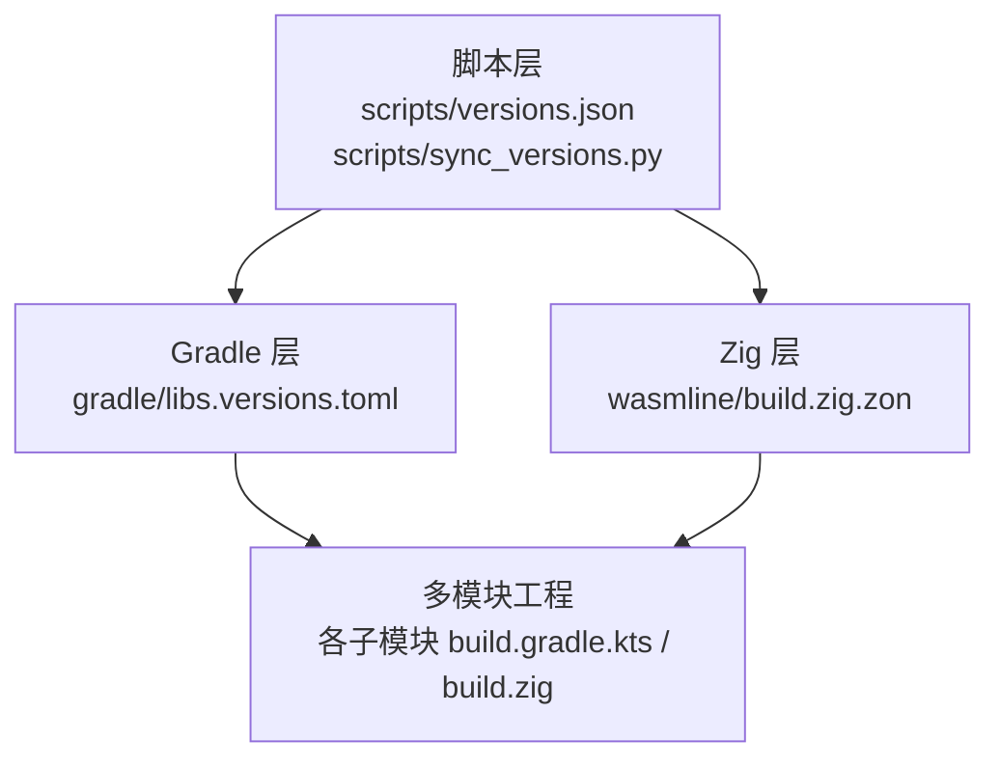
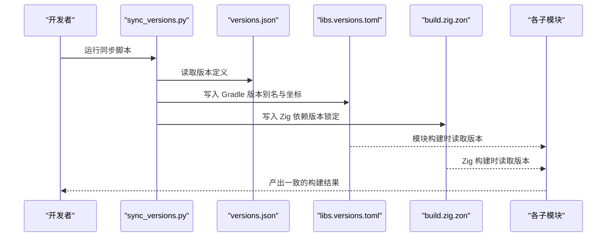
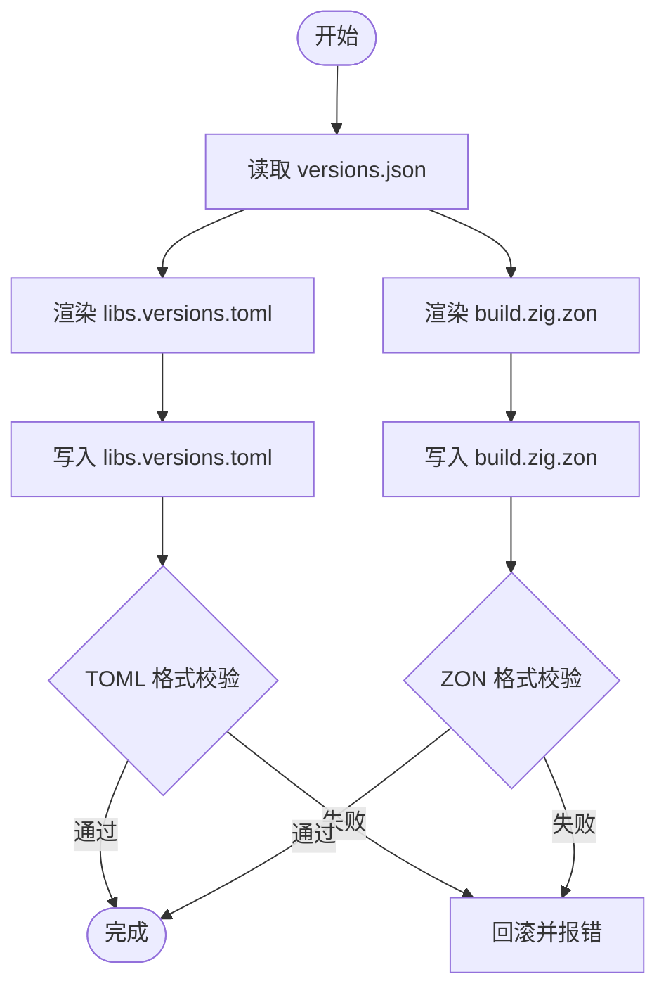
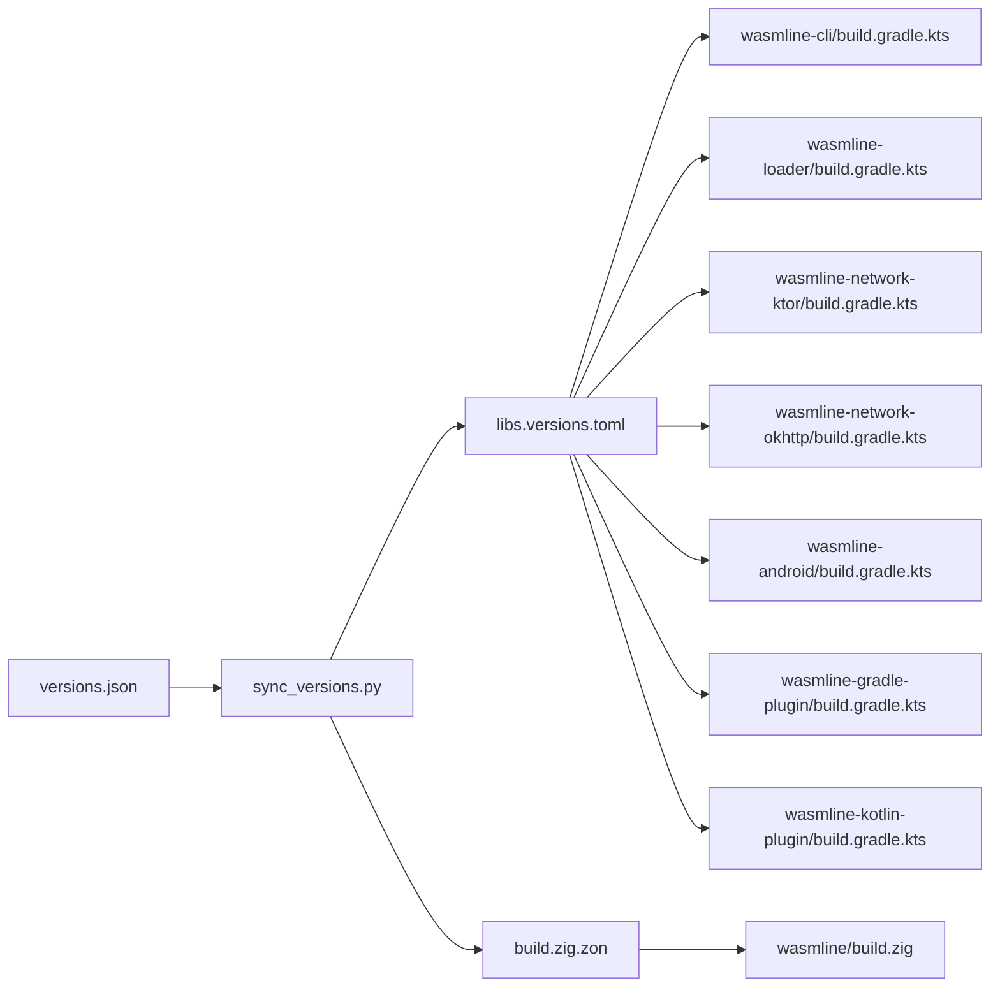

# 版本管理

<cite>
**本文引用的文件**
- [scripts/versions.json](file://scripts/versions.json)
- [scripts/sync_versions.py](file://scripts/sync_versions.py)
- [wasmline-multiplatform/gradle/libs.versions.toml](file://wasmline-multiplatform/gradle/libs.versions.toml)
- [wasmline-multiplatform/wasmline/build.zig.zon](file://wasmline-multiplatform/wasmline/build.zig.zon)
- [.github/workflows/](file://.github/workflows/)
- [wasmline-multiplatform/wasmline/build.gradle.kts](file://wasmline-multiplatform/wasmline/build.gradle.kts)
- [wasmline-multiplatform/settings.gradle.kts](file://wasmline-multiplatform/settings.gradle.kts)
- [wasmline-multiplatform/wasmline-gradle-plugin/build.gradle.kts](file://wasmline-multiplatform/wasmline-gradle-plugin/build.gradle.kts)
- [wasmline-multiplatform/wasmline-kotlin-plugin/build.gradle.kts](file://wasmline-multiplatform/wasmline-kotlin-plugin/build.gradle.kts)
- [wasmline-multiplatform/wasmline-cli/build.gradle.kts](file://wasmline-multiplatform/wasmline-cli/build.gradle.kts)
- [wasmline-multiplatform/wasmline-loader/build.gradle.kts](file://wasmline-multiplatform/wasmline-loader/build.gradle.kts)
- [wasmline-multiplatform/wasmline-network-ktor/build.gradle.kts](file://wasmline-multiplatform/wasmline-network-ktor/build.gradle.kts)
- [wasmline-multiplatform/wasmline-network-okhttp/build.gradle.kts](file://wasmline-multiplatform/wasmline-network-okhttp/build.gradle.kts)
- [wasmline-multiplatform/wasmline-android/build.gradle.kts](file://wasmline-multiplatform/wasmline-android/build.gradle.kts)
- [wasmline-multiplatform/wasmline-build-logic/base/build.gradle.kts](file://wasmline-multiplatform/wasmline-build-logic/base/build.gradle.kts)
- [wasmline-multiplatform/wasmline-build-logic/app/build.gradle.kts](file://wasmline-multiplatform/wasmline-build-logic/app/build.gradle.kts)
- [wasmline-multiplatform/wasmline-build-logic/settings.gradle.kts](file://wasmline-multiplatform/wasmline-build-logic/settings.gradle.kts)
- [wasmline-multiplatform/gradle.properties](file://wasmline-multiplatform/gradle.properties)
- [wasmline-multiplatform/build.gradle.kts](file://wasmline-multiplatform/build.gradle.kts)
- [wasmline-multiplatform/mind.md](file://wasmline-multiplatform/mind.md)
</cite>

## 目录
1. [简介](#简介)
2. [项目结构](#项目结构)
3. [核心组件](#核心组件)
4. [架构总览](#架构总览)
5. [详细组件分析](#详细组件分析)
6. [依赖关系分析](#依赖关系分析)
7. [性能考量](#性能考量)
8. [故障排查指南](#故障排查指南)
9. [结论](#结论)
10. [附录](#附录)

## 简介
本文件系统性阐述 Wasmline 的版本管理策略与实现，覆盖以下主题：
- 语义化版本管理与依赖版本同步
- 版本锁定机制与跨平台差异处理
- 版本配置文件结构与用途：versions.json、libs.versions.toml、build.zig.zon
- 自动化版本同步脚本工作原理与使用方法
- 版本升级最佳实践（向后兼容性与迁移策略）
- 多平台版本管理的特殊考虑
- 维护者发布流程（版本标签、变更日志、发布说明）

## 项目结构
Wasmline 采用多模块、多语言混合的工程组织方式，版本管理贯穿 Gradle/Kotlin Multiplatform、Zig/Native 以及脚本层：
- 脚本层：集中式版本定义与同步脚本
- Gradle 层：libs.versions.toml 提供统一依赖坐标与版本别名
- Zig 层：build.zig.zon 作为 Zig 包与依赖的版本锁定清单
- 各子模块：各自 build.gradle.kts 或 build.zig 集成版本信息

图表来源
- [scripts/versions.json](file://scripts/versions.json)
- [scripts/sync_versions.py](file://scripts/sync_versions.py)
- [wasmline-multiplatform/gradle/libs.versions.toml](file://wasmline-multiplatform/gradle/libs.versions.toml)
- [wasmline-multiplatform/wasmline/build.zig.zon](file://wasmline-multiplatform/wasmline/build.zig.zon)

章节来源
- [scripts/versions.json](file://scripts/versions.json)
- [scripts/sync_versions.py](file://scripts/sync_versions.py)
- [wasmline-multiplatform/gradle/libs.versions.toml](file://wasmline-multiplatform/gradle/libs.versions.toml)
- [wasmline-multiplatform/wasmline/build.zig.zon](file://wasmline-multiplatform/wasmline/build.zig.zon)

## 核心组件
- 版本中心化定义与同步
  - scripts/versions.json：集中声明所有依赖版本号与工具链版本
  - scripts/sync_versions.py：解析 versions.json 并写入 Gradle 与 Zig 配置，确保一致性
- Gradle/Kotlin Multiplatform 版本管理
  - gradle/libs.versions.toml：统一依赖坐标与版本别名，供各模块引用
- Zig/Native 版本管理
  - wasmline/build.zig.zon：Zig 包与依赖的版本锁定清单
- 子模块集成
  - 各子模块的 build.gradle.kts 或 build.zig 通过上述配置进行版本注入

章节来源
- [scripts/versions.json](file://scripts/versions.json)
- [scripts/sync_versions.py](file://scripts/sync_versions.py)
- [wasmline-multiplatform/gradle/libs.versions.toml](file://wasmline-multiplatform/gradle/libs.versions.toml)
- [wasmline-multiplatform/wasmline/build.zig.zon](file://wasmline-multiplatform/wasmline/build.zig.zon)

## 架构总览
下图展示版本数据从“中心化定义”到“多平台应用”的流转路径。

图表来源
- [scripts/sync_versions.py](file://scripts/sync_versions.py)
- [scripts/versions.json](file://scripts/versions.json)
- [wasmline-multiplatform/gradle/libs.versions.toml](file://wasmline-multiplatform/gradle/libs.versions.toml)
- [wasmline-multiplatform/wasmline/build.zig.zon](file://wasmline-multiplatform/wasmline/build.zig.zon)

## 详细组件分析

### 版本配置文件与用途
- scripts/versions.json
  - 作用：集中声明所有依赖版本号、工具链版本与平台特定参数
  - 结构要点：键值对形式的版本映射；建议包含语义化版本号、预发布标识与构建元数据
- gradle/libs.versions.toml
  - 作用：Kotlin Multiplatform 依赖版本别名与坐标管理，便于模块间共享
  - 结构要点：库别名、版本号、坐标（group:name:version）三元组；可分组管理
- wasmline/build.zig.zon
  - 作用：Zig 包与依赖的版本锁定清单，确保 Zig 构建一致性
  - 结构要点：包名、版本、源码或依赖项；与 Zig 工具链版本协同

章节来源
- [scripts/versions.json](file://scripts/versions.json)
- [wasmline-multiplatform/gradle/libs.versions.toml](file://wasmline-multiplatform/gradle/libs.versions.toml)
- [wasmline-multiplatform/wasmline/build.zig.zon](file://wasmline-multiplatform/wasmline/build.zig.zon)

### 自动化版本同步脚本工作原理
- 输入：scripts/versions.json
- 输出：
  - 更新 gradle/libs.versions.toml 中的版本别名与坐标
  - 更新 wasmline/build.zig.zon 中的 Zig 依赖版本
- 关键流程：
  - 解析 JSON：读取版本键值对
  - 渲染模板：根据 TOML/ZON 语法生成对应条目
  - 写入文件：原子更新，避免破坏注释与格式
  - 校验：可选的格式校验与回滚策略

图表来源
- [scripts/sync_versions.py](file://scripts/sync_versions.py)
- [scripts/versions.json](file://scripts/versions.json)
- [wasmline-multiplatform/gradle/libs.versions.toml](file://wasmline-multiplatform/gradle/libs.versions.toml)
- [wasmline-multiplatform/wasmline/build.zig.zon](file://wasmline-multiplatform/wasmline/build.zig.zon)

章节来源
- [scripts/sync_versions.py](file://scripts/sync_versions.py)
- [scripts/versions.json](file://scripts/versions.json)

### 多平台版本管理的特殊考虑
- 平台差异
  - Android/Java 生态：Gradle/Kotlin 版本与 NDK/JDK 版本需匹配
  - iOS/macOS：Swift/Xcode 工具链版本与最低部署版本
  - JavaScript/WebAssembly：Node/Yarn/浏览器兼容性
  - Zig/Native：Zig 工具链版本与目标平台（wasm32-wasip1、aarch64-linux-gnu 等）
- 版本锁定策略
  - 使用 build.zig.zon 对 Zig 依赖进行精确锁定
  - 使用 libs.versions.toml 对 Kotlin/Gradle 依赖进行别名化与统一
  - 在 CI 中固定工具链版本，避免漂移

章节来源
- [wasmline-multiplatform/wasmline/build.zig.zon](file://wasmline-multiplatform/wasmline/build.zig.zon)
- [wasmline-multiplatform/gradle/libs.versions.toml](file://wasmline-multiplatform/gradle/libs.versions.toml)

### 版本升级最佳实践
- 语义化版本管理
  - 主版本：破坏性变更
  - 次版本：向后兼容的功能新增
  - 修订版本：向后兼容的问题修复
- 升级流程
  - 先在脚本层更新 versions.json
  - 运行同步脚本，生成 Gradle 与 Zig 配置
  - 在各模块中验证构建与测试
  - 发布前进行回归测试与平台验证
- 向后兼容性
  - 避免破坏性变更；必要时提升主版本
  - 保持 API 稳定，提供迁移指南
- 迁移策略
  - 提供渐进式迁移步骤
  - 保留兼容层与弃用警告
  - 在变更日志中明确影响范围与操作指引

## 依赖关系分析
- 耦合与内聚
  - 脚本层与配置层强耦合：versions.json 是唯一事实来源
  - Gradle 与 Zig 配置层弱耦合：通过脚本同步，模块层进一步解耦
- 外部依赖
  - Gradle 插件与 Kotlin 版本
  - Zig 工具链与目标平台
  - 各子模块的业务依赖（网络、序列化、加载器等）

图表来源
- [scripts/versions.json](file://scripts/versions.json)
- [scripts/sync_versions.py](file://scripts/sync_versions.py)
- [wasmline-multiplatform/gradle/libs.versions.toml](file://wasmline-multiplatform/gradle/libs.versions.toml)
- [wasmline-multiplatform/wasmline/build.zig.zon](file://wasmline-multiplatform/wasmline/build.zig.zon)
- [wasmline-multiplatform/wasmline-cli/build.gradle.kts](file://wasmline-multiplatform/wasmline-cli/build.gradle.kts)
- [wasmline-multiplatform/wasmline-loader/build.gradle.kts](file://wasmline-multiplatform/wasmline-loader/build.gradle.kts)
- [wasmline-multiplatform/wasmline-network-ktor/build.gradle.kts](file://wasmline-multiplatform/wasmline-network-ktor/build.gradle.kts)
- [wasmline-multiplatform/wasmline-network-okhttp/build.gradle.kts](file://wasmline-multiplatform/wasmline-network-okhttp/build.gradle.kts)
- [wasmline-multiplatform/wasmline-android/build.gradle.kts](file://wasmline-multiplatform/wasmline-android/build.gradle.kts)
- [wasmline-multiplatform/wasmline-gradle-plugin/build.gradle.kts](file://wasmline-multiplatform/wasmline-gradle-plugin/build.gradle.kts)
- [wasmline-multiplatform/wasmline-kotlin-plugin/build.gradle.kts](file://wasmline-multiplatform/wasmline-kotlin-plugin/build.gradle.kts)
- [wasmline-multiplatform/wasmline/build.zig](file://wasmline-multiplatform/wasmline/build.zig)

章节来源
- [wasmline-multiplatform/gradle/libs.versions.toml](file://wasmline-multiplatform/gradle/libs.versions.toml)
- [wasmline-multiplatform/wasmline/build.zig.zon](file://wasmline-multiplatform/wasmline/build.zig.zon)

## 性能考量
- 版本同步脚本的执行效率
  - 尽量减少磁盘 IO：批量写入与原子替换
  - 增量更新：仅在版本变更时触发同步
- 构建性能
  - 使用 Gradle 与 Zig 的缓存与并行能力
  - 固定工具链版本以避免重复下载与编译

## 故障排查指南
- 版本不一致
  - 症状：模块构建失败或运行时异常
  - 排查：确认 versions.json 是否最新；重新运行同步脚本；检查 Gradle/TOML 与 Zig/ZON 是否一致
- 格式错误
  - 症状：TOML/ZON 解析失败
  - 排查：使用 linter 校验；检查键名与类型；确保注释未被破坏
- 平台差异导致的构建失败
  - 症状：某平台编译失败
  - 排查：核对 Zig 工具链版本与目标平台；核对 Android/iOS 工具链版本；必要时在脚本中添加平台分支

章节来源
- [scripts/sync_versions.py](file://scripts/sync_versions.py)
- [wasmline-multiplatform/gradle/libs.versions.toml](file://wasmline-multiplatform/gradle/libs.versions.toml)
- [wasmline-multiplatform/wasmline/build.zig.zon](file://wasmline-multiplatform/wasmline/build.zig.zon)

## 结论
Wasmline 的版本管理体系以“脚本层中心化定义 + 自动化同步 + 多平台配置锁定”为核心，实现了跨语言与跨平台的一致性与可维护性。遵循语义化版本与最佳实践，结合平台差异处理与严格的回归验证，可确保版本升级的稳定性与可追溯性。

## 附录

### 版本发布流程指南（维护者）
- 准备阶段
  - 在 versions.json 中更新版本号与工具链版本
  - 运行同步脚本，生成并提交 Gradle 与 Zig 配置
- 构建与测试
  - 在本地与 CI 上对所有平台进行构建与测试
  - 验证关键模块（CLI、Loader、网络客户端、Android/iOS）功能
- 标签与发布
  - 创建 Git 标签（语义化版本）
  - 生成变更日志与发布说明，明确破坏性变更、新特性与已知问题
  - 在发布页面附上各平台产物与迁移指引

### 参考文件索引
- 脚本与配置
  - [scripts/versions.json](file://scripts/versions.json)
  - [scripts/sync_versions.py](file://scripts/sync_versions.py)
  - [wasmline-multiplatform/gradle/libs.versions.toml](file://wasmline-multiplatform/gradle/libs.versions.toml)
  - [wasmline-multiplatform/wasmline/build.zig.zon](file://wasmline-multiplatform/wasmline/build.zig.zon)
- 模块构建文件
  - [wasmline-multiplatform/wasmline/build.gradle.kts](file://wasmline-multiplatform/wasmline/build.gradle.kts)
  - [wasmline-multiplatform/settings.gradle.kts](file://wasmline-multiplatform/settings.gradle.kts)
  - [wasmline-multiplatform/wasmline-cli/build.gradle.kts](file://wasmline-multiplatform/wasmline-cli/build.gradle.kts)
  - [wasmline-multiplatform/wasmline-loader/build.gradle.kts](file://wasmline-multiplatform/wasmline-loader/build.gradle.kts)
  - [wasmline-multiplatform/wasmline-network-ktor/build.gradle.kts](file://wasmline-multiplatform/wasmline-network-ktor/build.gradle.kts)
  - [wasmline-multiplatform/wasmline-network-okhttp/build.gradle.kts](file://wasmline-multiplatform/wasmline-network-okhttp/build.gradle.kts)
  - [wasmline-multiplatform/wasmline-android/build.gradle.kts](file://wasmline-multiplatform/wasmline-android/build.gradle.kts)
  - [wasmline-multiplatform/wasmline-gradle-plugin/build.gradle.kts](file://wasmline-multiplatform/wasmline-gradle-plugin/build.gradle.kts)
  - [wasmline-multiplatform/wasmline-kotlin-plugin/build.gradle.kts](file://wasmline-multiplatform/wasmline-kotlin-plugin/build.gradle.kts)
  - [wasmline-multiplatform/wasmline-build-logic/base/build.gradle.kts](file://wasmline-multiplatform/wasmline-build-logic/base/build.gradle.kts)
  - [wasmline-multiplatform/wasmline-build-logic/app/build.gradle.kts](file://wasmline-multiplatform/wasmline-build-logic/app/build.gradle.kts)
  - [wasmline-multiplatform/wasmline-build-logic/settings.gradle.kts](file://wasmline-multiplatform/wasmline-build-logic/settings.gradle.kts)
- 工程属性与总览
  - [wasmline-multiplatform/gradle.properties](file://wasmline-multiplatform/gradle.properties)
  - [wasmline-multiplatform/build.gradle.kts](file://wasmline-multiplatform/build.gradle.kts)
  - [wasmline-multiplatform/mind.md](file://wasmline-multiplatform/mind.md)