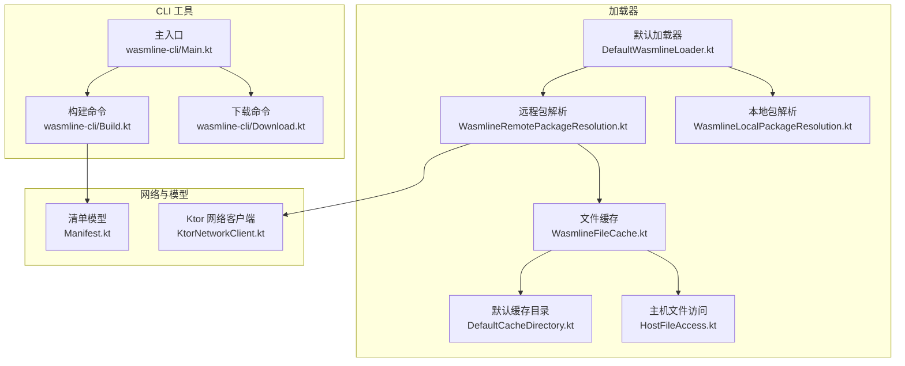
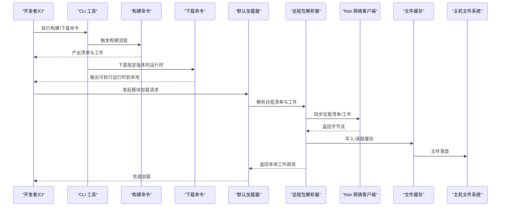
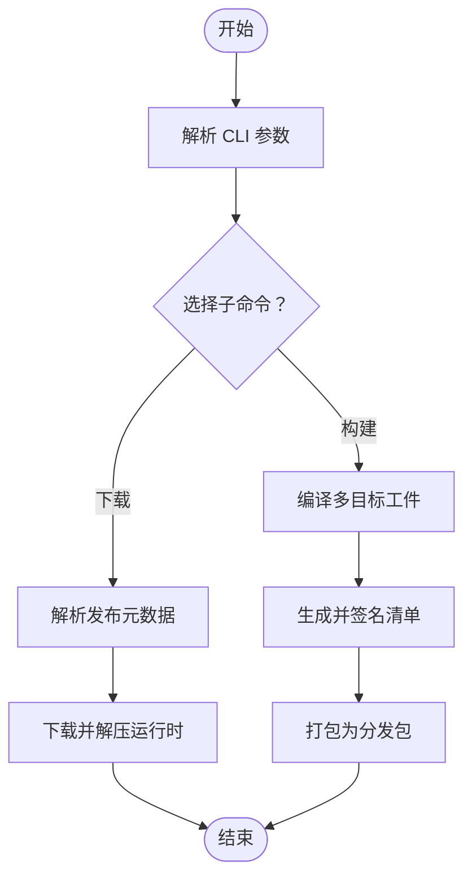
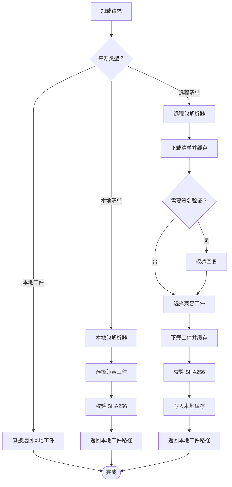
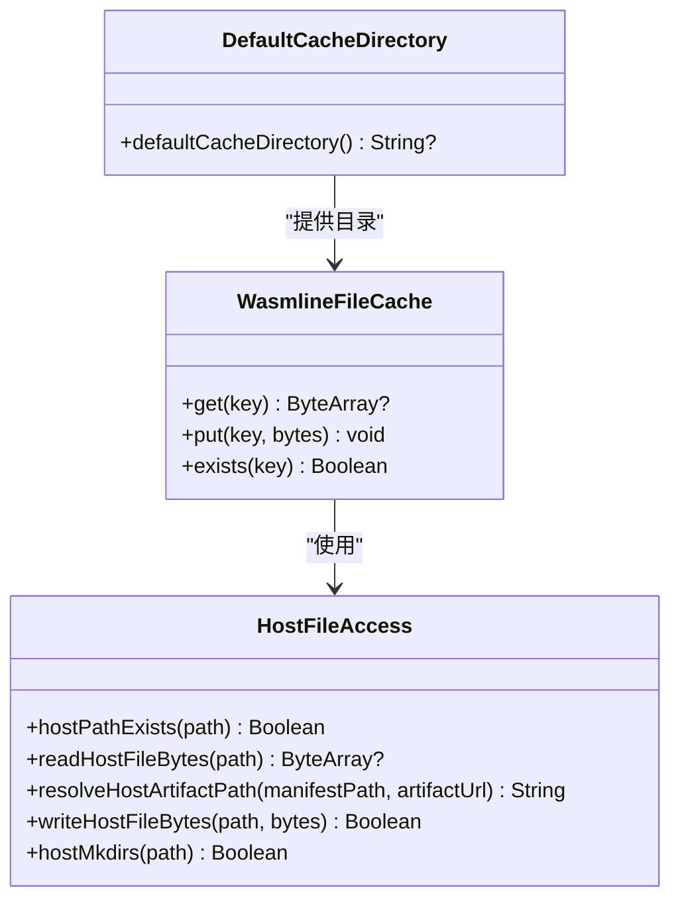
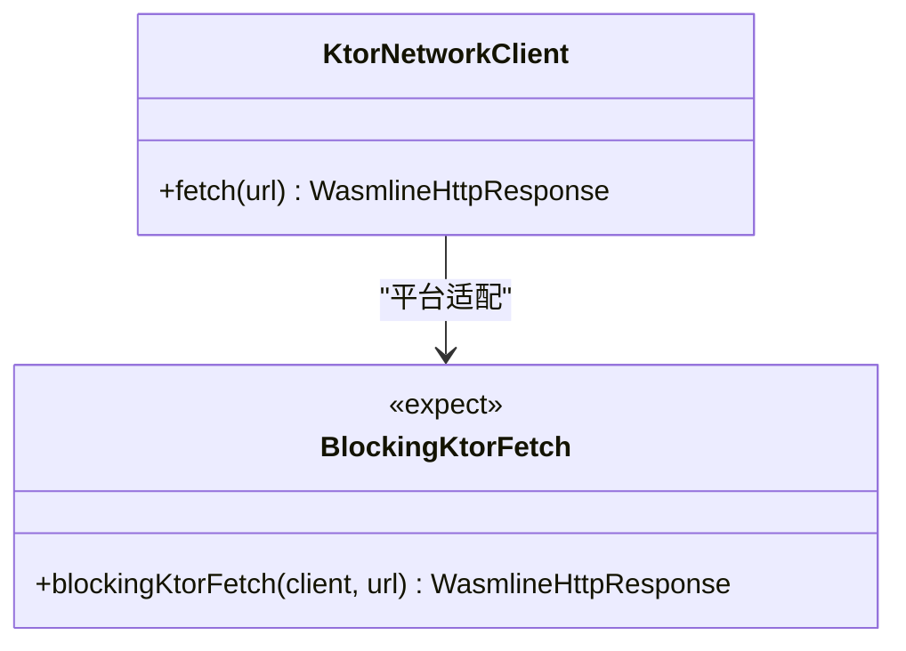
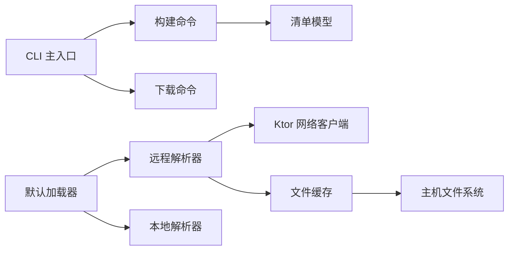

# 部署策略

<cite>
**本文引用的文件**
- [wasmline-cli 主入口](file://wasmline-multiplatform/wasmline-cli/src/main/kotlin/crow/wasmline/cli/Main.kt)
- [构建命令实现](file://wasmline-multiplatform/wasmline-cli/src/main/kotlin/crow/wasmline/cli/Build.kt)
- [下载命令实现](file://wasmline-multiplatform/wasmline-cli/src/main/kotlin/crow/wasmline/cli/Download.kt)
- [默认加载器实现](file://wasmline-multiplatform/wasmline-loader/src/hostMain/kotlin/crow/wasmline/loader/DefaultWasmlineLoader.kt)
- [远程包解析器](file://wasmline-multiplatform/wasmline-loader/src/hostMain/kotlin/crow/wasmline/loader/internal/WasmlineRemotePackageResolution.kt)
- [本地包解析器](file://wasmline-multiplatform/wasmline-loader/src/hostMain/kotlin/crow/wasmline/loader/internal/WasmlineLocalPackageResolution.kt)
- [文件缓存实现](file://wasmline-multiplatform/wasmline-loader/src/hostMain/kotlin/crow/wasmline/loader/internal/WasmlineFileCache.kt)
- [默认缓存目录（平台期望）](file://wasmline-multiplatform/wasmline-loader/src/hostMain/kotlin/crow/wasmline/loader/internal/DefaultCacheDirectory.kt)
- [主机文件访问（平台期望）](file://wasmline-multiplatform/wasmline-loader/src/hostMain/kotlin/crow/wasmline/loader/internal/HostFileAccess.kt)
- [加载请求模型](file://wasmline-multiplatform/wasmline-loader/src/commonMain/kotlin/crow/wasmline/loader/WasmlineLoadRequest.kt)
- [来源类型定义](file://wasmline-multiplatform/wasmline-loader/src/commonMain/kotlin/crow/wasmline/loader/WasmlineSource.kt)
- [来源解析器接口](file://wasmline-multiplatform/wasmline-loader/src/commonMain/kotlin/crow/wasmline/loader/WasmlineSourceResolvers.kt)
- [清单模型（签名封装与清单）](file://wasmline-multiplatform/wasmline-loader/src/commonMain/kotlin/crow/wasmline/loader/model/Manifest.kt)
- [Ktor 网络客户端](file://wasmline-multiplatform/wasmline-network-ktor/src/commonMain/kotlin/crow/wasmline/network/ktor/KtorNetworkClient.kt)
</cite>

## 目录
1. [简介](#简介)
2. [项目结构](#项目结构)
3. [核心组件](#核心组件)
4. [架构总览](#架构总览)
5. [详细组件分析](#详细组件分析)
6. [依赖关系分析](#依赖关系分析)
7. [性能考量](#性能考量)
8. [故障排查指南](#故障排查指南)
9. [结论](#结论)
10. [附录](#附录)

## 简介
本指南面向运维与工程团队，系统阐述 Wasmline 在不同环境（开发、测试、生产）的部署策略，覆盖模块加载器的远程包解析、本地缓存与版本管理机制；CLI 工具在构建、下载与安装中的自动化流程；容器化部署（Docker 与 Kubernetes）的配置要点；以及蓝绿部署、滚动更新与金丝雀发布的落地方法。同时提供监控与日志收集的配置建议，帮助实现可观察性与快速故障定位。

## 项目结构
Wasmline 多平台仓库包含核心运行时、加载器、网络客户端、CLI 工具与示例应用。与部署相关的关键模块如下：
- CLI：负责构建、编译、打包与下载 Wasmtime 运行时资源
- 加载器：负责从本地或远程解析并加载模块，支持缓存与完整性校验
- 网络客户端：基于 Ktor 的跨平台 HTTP 客户端，用于远程包下载
- 清单模型：定义签名封装与清单结构，支撑版本与元数据管理

**图表来源**
- [wasmline-cli 主入口:10-25](file://wasmline-multiplatform/wasmline-cli/src/main/kotlin/crow/wasmline/cli/Main.kt#L10-L25)
- [构建命令实现:52-211](file://wasmline-multiplatform/wasmline-cli/src/main/kotlin/crow/wasmline/cli/Build.kt#L52-L211)
- [下载命令实现:45-391](file://wasmline-multiplatform/wasmline-cli/src/main/kotlin/crow/wasmline/cli/Download.kt#L45-L391)
- [默认加载器实现:13-110](file://wasmline-multiplatform/wasmline-loader/src/hostMain/kotlin/crow/wasmline/loader/DefaultWasmlineLoader.kt#L13-L110)
- [远程包解析器:28-224](file://wasmline-multiplatform/wasmline-loader/src/hostMain/kotlin/crow/wasmline/loader/internal/WasmlineRemotePackageResolution.kt#L28-L224)
- [本地包解析器:15-173](file://wasmline-multiplatform/wasmline-loader/src/hostMain/kotlin/crow/wasmline/loader/internal/WasmlineLocalPackageResolution.kt#L15-L173)
- [文件缓存实现:14-35](file://wasmline-multiplatform/wasmline-loader/src/hostMain/kotlin/crow/wasmline/loader/internal/WasmlineFileCache.kt#L14-L35)
- [默认缓存目录（平台期望）:1-8](file://wasmline-multiplatform/wasmline-loader/src/hostMain/kotlin/crow/wasmline/loader/internal/DefaultCacheDirectory.kt#L1-L8)
- [主机文件访问（平台期望）:1-20](file://wasmline-multiplatform/wasmline-loader/src/hostMain/kotlin/crow/wasmline/loader/internal/HostFileAccess.kt#L1-L20)
- [Ktor 网络客户端:22-44](file://wasmline-multiplatform/wasmline-network-ktor/src/commonMain/kotlin/crow/wasmline/network/ktor/KtorNetworkClient.kt#L22-L44)
- [清单模型（签名封装与清单）:21-98](file://wasmline-multiplatform/wasmline-loader/src/commonMain/kotlin/crow/wasmline/loader/model/Manifest.kt#L21-L98)

**章节来源**
- [wasmline-cli 主入口:10-25](file://wasmline-multiplatform/wasmline-cli/src/main/kotlin/crow/wasmline/cli/Main.kt#L10-L25)
- [构建命令实现:52-211](file://wasmline-multiplatform/wasmline-cli/src/main/kotlin/crow/wasmline/cli/Build.kt#L52-L211)
- [下载命令实现:45-391](file://wasmline-multiplatform/wasmline-cli/src/main/kotlin/crow/wasmline/cli/Download.kt#L45-L391)
- [默认加载器实现:13-110](file://wasmline-multiplatform/wasmline-loader/src/hostMain/kotlin/crow/wasmline/loader/DefaultWasmlineLoader.kt#L13-L110)
- [远程包解析器:28-224](file://wasmline-multiplatform/wasmline-loader/src/hostMain/kotlin/crow/wasmline/loader/internal/WasmlineRemotePackageResolution.kt#L28-L224)
- [本地包解析器:15-173](file://wasmline-multiplatform/wasmline-loader/src/hostMain/kotlin/crow/wasmline/loader/internal/WasmlineLocalPackageResolution.kt#L15-L173)
- [文件缓存实现:14-35](file://wasmline-multiplatform/wasmline-loader/src/hostMain/kotlin/crow/wasmline/loader/internal/WasmlineFileCache.kt#L14-L35)
- [默认缓存目录（平台期望）:1-8](file://wasmline-multiplatform/wasmline-loader/src/hostMain/kotlin/crow/wasmline/loader/internal/DefaultCacheDirectory.kt#L1-L8)
- [主机文件访问（平台期望）:1-20](file://wasmline-multiplatform/wasmline-loader/src/hostMain/kotlin/crow/wasmline/loader/internal/HostFileAccess.kt#L1-L20)
- [Ktor 网络客户端:22-44](file://wasmline-multiplatform/wasmline-network-ktor/src/commonMain/kotlin/crow/wasmline/network/ktor/KtorNetworkClient.kt#L22-L44)
- [清单模型（签名封装与清单）:21-98](file://wasmline-multiplatform/wasmline-loader/src/commonMain/kotlin/crow/wasmline/loader/model/Manifest.kt#L21-L98)

## 核心组件
- CLI 工具链：提供构建、下载与密钥生成等子命令，支撑本地与 CI 环境的自动化部署
- 模块加载器：统一抽象加载来源（本地文件、本地清单、远程清单），内置解析与缓存逻辑
- 网络客户端：跨平台同步 HTTP 获取能力，配合远程包解析完成安全下载与校验
- 缓存层：基于文件系统的缓存，支持清单与二进制工件的本地持久化
- 清单与签名：通过带签名的清单封装，确保来源可信与工件完整性

**章节来源**
- [wasmline-cli 主入口:10-25](file://wasmline-multiplatform/wasmline-cli/src/main/kotlin/crow/wasmline/cli/Main.kt#L10-L25)
- [默认加载器实现:13-110](file://wasmline-multiplatform/wasmline-loader/src/hostMain/kotlin/crow/wasmline/loader/DefaultWasmlineLoader.kt#L13-L110)
- [Ktor 网络客户端:22-44](file://wasmline-multiplatform/wasmline-network-ktor/src/commonMain/kotlin/crow/wasmline/network/ktor/KtorNetworkClient.kt#L22-L44)
- [文件缓存实现:14-35](file://wasmline-multiplatform/wasmline-loader/src/hostMain/kotlin/crow/wasmline/loader/internal/WasmlineFileCache.kt#L14-L35)
- [清单模型（签名封装与清单）:21-98](file://wasmline-multiplatform/wasmline-loader/src/commonMain/kotlin/crow/wasmline/loader/model/Manifest.kt#L21-L98)

## 架构总览
下图展示从 CLI 到加载器再到网络与缓存的整体部署路径，强调远程包解析、签名验证、缓存与本地工件加载的闭环。

**图表来源**
- [wasmline-cli 主入口:10-25](file://wasmline-multiplatform/wasmline-cli/src/main/kotlin/crow/wasmline/cli/Main.kt#L10-L25)
- [构建命令实现:111-203](file://wasmline-multiplatform/wasmline-cli/src/main/kotlin/crow/wasmline/cli/Build.kt#L111-L203)
- [下载命令实现:73-189](file://wasmline-multiplatform/wasmline-cli/src/main/kotlin/crow/wasmline/cli/Download.kt#L73-L189)
- [默认加载器实现:14-75](file://wasmline-multiplatform/wasmline-loader/src/hostMain/kotlin/crow/wasmline/loader/DefaultWasmlineLoader.kt#L14-L75)
- [远程包解析器:30-112](file://wasmline-multiplatform/wasmline-loader/src/hostMain/kotlin/crow/wasmline/loader/internal/WasmlineRemotePackageResolution.kt#L30-L112)
- [Ktor 网络客户端:26-28](file://wasmline-multiplatform/wasmline-network-ktor/src/commonMain/kotlin/crow/wasmline/network/ktor/KtorNetworkClient.kt#L26-L28)
- [文件缓存实现:18-25](file://wasmline-multiplatform/wasmline-loader/src/hostMain/kotlin/crow/wasmline/loader/internal/WasmlineFileCache.kt#L18-L25)
- [主机文件访问（平台期望）:3-13](file://wasmline-multiplatform/wasmline-loader/src/hostMain/kotlin/crow/wasmline/loader/internal/HostFileAccess.kt#L3-L13)

## 详细组件分析

### CLI 工具与自动化部署
- 构建命令：编译多目标工件、生成清单并签名、打包分发产物
- 下载命令：按平台自动解析发布元数据、下载并解压运行时，支持强制重下
- 版本与元数据：通过清单模型承载版本号、最小 SDK、构建时间戳与元信息，便于灰度与回滚

**图表来源**
- [构建命令实现:111-203](file://wasmline-multiplatform/wasmline-cli/src/main/kotlin/crow/wasmline/cli/Build.kt#L111-L203)
- [下载命令实现:104-189](file://wasmline-multiplatform/wasmline-cli/src/main/kotlin/crow/wasmline/cli/Download.kt#L104-L189)

**章节来源**
- [wasmline-cli 主入口:10-25](file://wasmline-multiplatform/wasmline-cli/src/main/kotlin/crow/wasmline/cli/Main.kt#L10-L25)
- [构建命令实现:52-211](file://wasmline-multiplatform/wasmline-cli/src/main/kotlin/crow/wasmline/cli/Build.kt#L52-L211)
- [下载命令实现:45-391](file://wasmline-multiplatform/wasmline-cli/src/main/kotlin/crow/wasmline/cli/Download.kt#L45-L391)

### 模块加载器与远程包解析
- 来源抽象：本地工件、本地清单、远程清单
- 解析链路：自定义解析器优先，否则使用内置远程/本地解析
- 远程解析：下载清单、签名验证（可选）、选择兼容工件、SHA256 校验、写入缓存、转为本地工件
- 本地解析：读取清单、选择兼容工件、校验 SHA256、返回本地工件路径

**图表来源**
- [默认加载器实现:22-96](file://wasmline-multiplatform/wasmline-loader/src/hostMain/kotlin/crow/wasmline/loader/DefaultWasmlineLoader.kt#L22-L96)
- [远程包解析器:30-112](file://wasmline-multiplatform/wasmline-loader/src/hostMain/kotlin/crow/wasmline/loader/internal/WasmlineRemotePackageResolution.kt#L30-L112)
- [本地包解析器:16-48](file://wasmline-multiplatform/wasmline-loader/src/hostMain/kotlin/crow/wasmline/loader/internal/WasmlineLocalPackageResolution.kt#L16-L48)

**章节来源**
- [默认加载器实现:13-110](file://wasmline-multiplatform/wasmline-loader/src/hostMain/kotlin/crow/wasmline/loader/DefaultWasmlineLoader.kt#L13-L110)
- [远程包解析器:28-224](file://wasmline-multiplatform/wasmline-loader/src/hostMain/kotlin/crow/wasmline/loader/internal/WasmlineRemotePackageResolution.kt#L28-L224)
- [本地包解析器:15-173](file://wasmline-multiplatform/wasmline-loader/src/hostMain/kotlin/crow/wasmline/loader/internal/WasmlineLocalPackageResolution.kt#L15-L173)
- [来源类型定义:10-14](file://wasmline-multiplatform/wasmline-loader/src/commonMain/kotlin/crow/wasmline/loader/WasmlineSource.kt#L10-L14)
- [来源解析器接口:10-33](file://wasmline-multiplatform/wasmline-loader/src/commonMain/kotlin/crow/wasmline/loader/WasmlineSourceResolvers.kt#L10-L33)

### 缓存与版本管理
- 缓存键：清单采用哈希键，工件以 SHA256 命名，避免重复下载
- 默认缓存目录：平台期望函数，浏览器等平台可能不支持
- 版本管理：清单中包含版本号、版本码、最小 SDK、构建时间戳与元数据，便于灰度与回滚

**图表来源**
- [文件缓存实现:14-35](file://wasmline-multiplatform/wasmline-loader/src/hostMain/kotlin/crow/wasmline/loader/internal/WasmlineFileCache.kt#L14-L35)
- [默认缓存目录（平台期望）:1-8](file://wasmline-multiplatform/wasmline-loader/src/hostMain/kotlin/crow/wasmline/loader/internal/DefaultCacheDirectory.kt#L1-L8)
- [主机文件访问（平台期望）:1-20](file://wasmline-multiplatform/wasmline-loader/src/hostMain/kotlin/crow/wasmline/loader/internal/HostFileAccess.kt#L1-L20)

**章节来源**
- [文件缓存实现:14-35](file://wasmline-multiplatform/wasmline-loader/src/hostMain/kotlin/crow/wasmline/loader/internal/WasmlineFileCache.kt#L14-L35)
- [默认缓存目录（平台期望）:1-8](file://wasmline-multiplatform/wasmline-loader/src/hostMain/kotlin/crow/wasmline/loader/internal/DefaultCacheDirectory.kt#L1-L8)
- [主机文件访问（平台期望）:1-20](file://wasmline-multiplatform/wasmline-loader/src/hostMain/kotlin/crow/wasmline/loader/internal/HostFileAccess.kt#L1-L20)
- [清单模型（签名封装与清单）:54-67](file://wasmline-multiplatform/wasmline-loader/src/commonMain/kotlin/crow/wasmline/loader/model/Manifest.kt#L54-L67)

### 网络客户端与跨平台适配
- Ktor 客户端：按平台选择引擎（JVM/Android/iOS），Web 平台不支持同步阻塞调用
- 同步桥接：通过平台期望函数桥接到阻塞式 HTTP 请求
- 远程包解析：依赖网络客户端进行清单与工件下载

**图表来源**
- [Ktor 网络客户端:22-44](file://wasmline-multiplatform/wasmline-network-ktor/src/commonMain/kotlin/crow/wasmline/network/ktor/KtorNetworkClient.kt#L22-L44)

**章节来源**
- [Ktor 网络客户端:22-44](file://wasmline-multiplatform/wasmline-network-ktor/src/commonMain/kotlin/crow/wasmline/network/ktor/KtorNetworkClient.kt#L22-L44)

## 依赖关系分析
- CLI 对构建与下载命令的依赖清晰，命令间无循环依赖
- 加载器对远程/本地解析器与网络客户端存在运行时依赖，可通过注入自定义解析器扩展
- 缓存层依赖主机文件系统，需关注并发写入风险
- 清单模型独立于加载器，仅作为序列化契约存在

**图表来源**
- [wasmline-cli 主入口:10-25](file://wasmline-multiplatform/wasmline-cli/src/main/kotlin/crow/wasmline/cli/Main.kt#L10-L25)
- [构建命令实现:145-178](file://wasmline-multiplatform/wasmline-cli/src/main/kotlin/crow/wasmline/cli/Build.kt#L145-L178)
- [默认加载器实现:13-110](file://wasmline-multiplatform/wasmline-loader/src/hostMain/kotlin/crow/wasmline/loader/DefaultWasmlineLoader.kt#L13-L110)
- [远程包解析器:28-224](file://wasmline-multiplatform/wasmline-loader/src/hostMain/kotlin/crow/wasmline/loader/internal/WasmlineRemotePackageResolution.kt#L28-L224)
- [Ktor 网络客户端:22-44](file://wasmline-multiplatform/wasmline-network-ktor/src/commonMain/kotlin/crow/wasmline/network/ktor/KtorNetworkClient.kt#L22-L44)
- [文件缓存实现:14-35](file://wasmline-multiplatform/wasmline-loader/src/hostMain/kotlin/crow/wasmline/loader/internal/WasmlineFileCache.kt#L14-L35)
- [主机文件访问（平台期望）:1-20](file://wasmline-multiplatform/wasmline-loader/src/hostMain/kotlin/crow/wasmline/loader/internal/HostFileAccess.kt#L1-L20)

**章节来源**
- [wasmline-cli 主入口:10-25](file://wasmline-multiplatform/wasmline-cli/src/main/kotlin/crow/wasmline/cli/Main.kt#L10-L25)
- [默认加载器实现:13-110](file://wasmline-multiplatform/wasmline-loader/src/hostMain/kotlin/crow/wasmline/loader/DefaultWasmlineLoader.kt#L13-L110)
- [远程包解析器:28-224](file://wasmline-multiplatform/wasmline-loader/src/hostMain/kotlin/crow/wasmline/loader/internal/WasmlineRemotePackageResolution.kt#L28-L224)
- [Ktor 网络客户端:22-44](file://wasmline-multiplatform/wasmline-network-ktor/src/commonMain/kotlin/crow/wasmline/network/ktor/KtorNetworkClient.kt#L22-L44)
- [文件缓存实现:14-35](file://wasmline-multiplatform/wasmline-loader/src/hostMain/kotlin/crow/wasmline/loader/internal/WasmlineFileCache.kt#L14-L35)
- [主机文件访问（平台期望）:1-20](file://wasmline-multiplatform/wasmline-loader/src/hostMain/kotlin/crow/wasmline/loader/internal/HostFileAccess.kt#L1-L20)

## 性能考量
- 缓存命中率：清单与工件均以哈希命名，提升缓存命中率，减少网络开销
- 并发写入：文件缓存非线程安全，建议在单实例或多实例场景中避免对同一键并发写入
- 网络 I/O：远程解析依赖同步 HTTP 获取，建议在高延迟网络中启用缓存并预热常用版本
- 资源占用：多目标编译会增加磁盘与 CPU 开销，建议在 CI 中按需编译与清理

## 故障排查指南
- 远程包解析失败
  - 检查网络客户端是否配置，确认 URL 可达
  - 若启用信任密钥，检查算法与公钥 ID 是否匹配
  - 校验清单与工件 SHA256 是否一致，必要时清理缓存后重试
- 本地包解析失败
  - 确认清单路径与工件路径正确，且工件存在
  - 校验工件 SHA256 与清单记录一致
- 缓存问题
  - 检查默认缓存目录是否可用（浏览器等平台可能不支持）
  - 并发写入导致的损坏，建议重建缓存或禁用并发写入
- Web 平台限制
  - 同步 HTTP 不受支持，需提供自定义异步解析器

**章节来源**
- [远程包解析器:137-170](file://wasmline-multiplatform/wasmline-loader/src/hostMain/kotlin/crow/wasmline/loader/internal/WasmlineRemotePackageResolution.kt#L137-L170)
- [本地包解析器:16-48](file://wasmline-multiplatform/wasmline-loader/src/hostMain/kotlin/crow/wasmline/loader/internal/WasmlineLocalPackageResolution.kt#L16-L48)
- [文件缓存实现:14-35](file://wasmline-multiplatform/wasmline-loader/src/hostMain/kotlin/crow/wasmline/loader/internal/WasmlineFileCache.kt#L14-L35)
- [Ktor 网络客户端:10-18](file://wasmline-multiplatform/wasmline-network-ktor/src/commonMain/kotlin/crow/wasmline/network/ktor/KtorNetworkClient.kt#L10-L18)

## 结论
Wasmline 提供了从本地构建到远程加载的完整部署闭环：CLI 自动化产出与下载，加载器统一解析与缓存，网络客户端跨平台适配，清单模型保障版本与完整性。结合本文的环境差异化配置、容器化与发布策略，可稳定支撑开发、测试与生产的全生命周期部署。

## 附录

### 环境差异化配置建议
- 开发环境
  - 使用本地清单与工件，禁用或简化签名验证
  - 启用详细日志与调试输出
  - 允许缓存目录可写，便于快速迭代
- 测试环境
  - 启用签名验证与 SHA256 校验
  - 使用固定版本的运行时与工件，确保一致性
  - 配置缓存预热，减少冷启动影响
- 生产环境
  - 强制签名验证与完整性校验
  - 使用只读缓存目录，避免并发写入
  - 配置健康检查与可观测性指标

### 容器化部署（Docker 与 Kubernetes）
- Docker 镜像构建
  - 基于多阶段构建，先在构建阶段使用 CLI 产出工件，再将运行时与工件复制至运行镜像
  - 将缓存目录映射为卷，提升二次启动速度
- Kubernetes 部署策略
  - 使用 Deployment 实现滚动更新，结合就绪探针与存活探针
  - 使用 ConfigMap/Secret 注入运行时参数与密钥
  - 使用 PersistentVolume 为缓存目录提供持久化存储

### 蓝绿部署、滚动更新与金丝雀发布
- 蓝绿部署
  - 维护两套完全相同的生产环境，切换流量至新版本
  - 适合需要快速回滚的场景
- 滚动更新
  - 逐步替换 Pod，降低停机与风险
  - 适合大多数常规发布
- 金丝雀发布
  - 仅向小部分流量路由到新版本，根据指标逐步扩大
  - 适合高风险变更与渐进式推广

### 监控与日志
- 指标采集
  - 记录加载成功率、远程下载耗时、缓存命中率、工件大小等
- 日志
  - 分层记录加载状态、网络错误与缓存行为
- 故障诊断
  - 结合日志与指标定位网络异常、签名失败与缓存损坏等问题