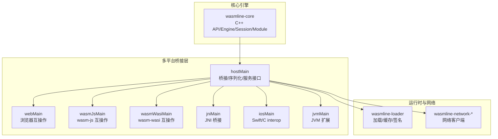
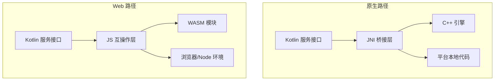
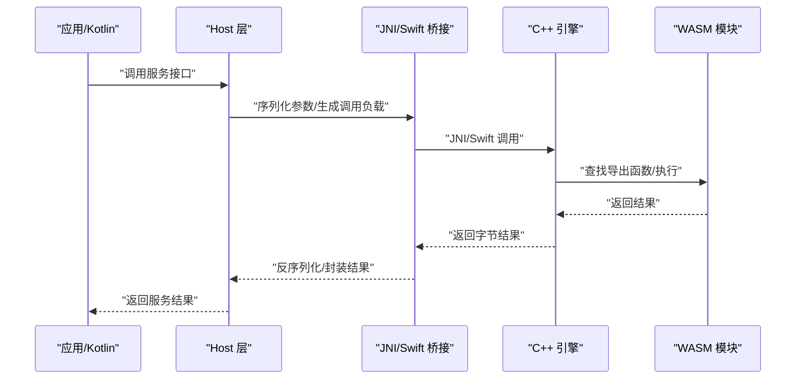
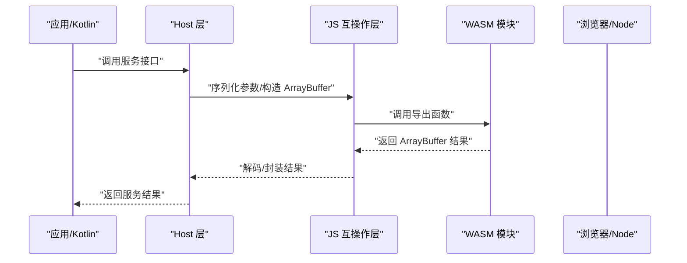
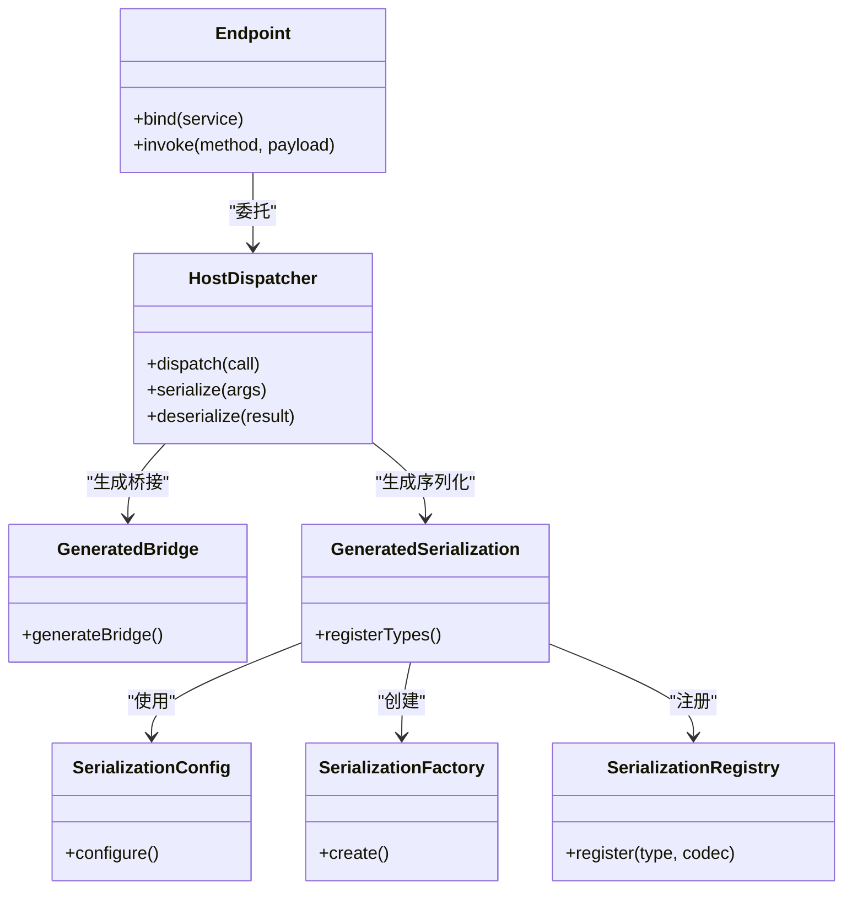
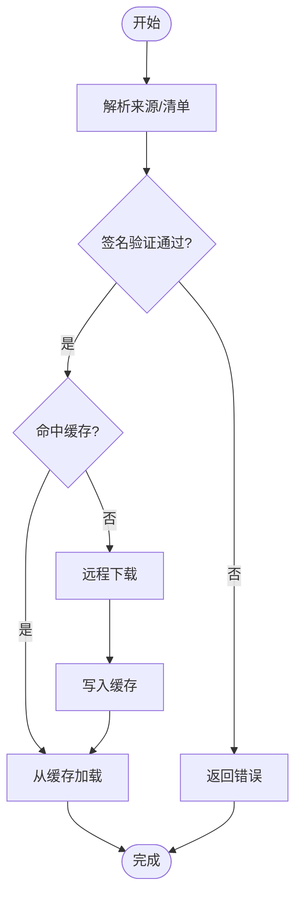
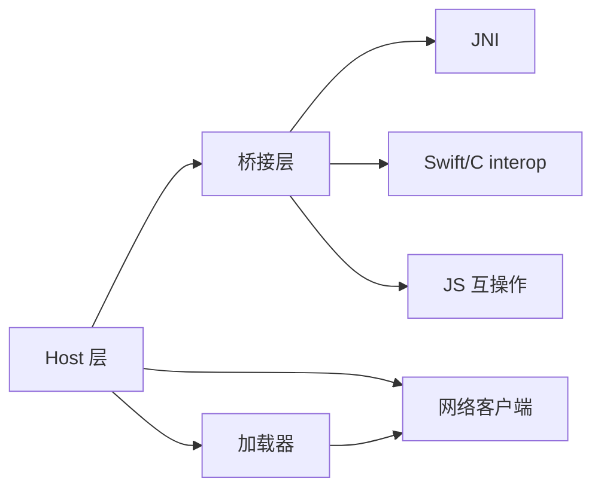

# 双路径执行模型

<cite>
**本文引用的文件**
- [wasmline-core/include/Api.h](file://wasmline-core/include/Api.h)
- [wasmline-core/include/Engine.h](file://wasmline-core/include/Engine.h)
- [wasmline-core/include/Session.h](file://wasmline-core/include/Session.h)
- [wasmline-core/include/Module.h](file://wasmline-core/include/Module.h)
- [wasmline-core/include/OutboundHandler.h](file://wasmline-core/include/OutboundHandler.h)
- [wasmline-core/include/extensions/Concurrency.h](file://wasmline-core/include/extensions/Concurrency.h)
- [wasmline-core/include/extensions/FileUtils.h](file://wasmline-core/include/extensions/FileUtils.h)
- [wasmline-multiplatform/wasmline/src/jniMain/native/JniHostHandler.h](file://wasmline-multiplatform/wasmline/src/jniMain/native/JniHostHandler.h)
- [wasmline-multiplatform/wasmline/src/jniMain/native/WasmlineJni.h](file://wasmline-multiplatform/wasmline/src/jniMain/native/WasmlineJni.h)
- [wasmline-multiplatform/wasmline/src/iosMain/native/WasmlineNative.h](file://wasmline-multiplatform/wasmline/src/iosMain/native/WasmlineNative.h)
- [wasmline-multiplatform/wasmline/src/hostMain/kotlin/crow/wasmline/BrowserPayloadEncoding.kt](file://wasmline-multiplatform/wasmline/src/hostMain/kotlin/crow/wasmline/BrowserPayloadEncoding.kt)
- [wasmline-multiplatform/wasmline/src/wasmWasiMain/kotlin/crow/wasmline/WasmlineWasmBridge.kt](file://wasmline-multiplatform/wasmline/src/wasmWasiMain/kotlin/crow/wasmline/WasmlineWasmBridge.kt)
- [wasmline-multiplatform/wasmline/src/wasmWasiMain/kotlin/crow/wasmline/WasmMain.kt](file://wasmline-multiplatform/wasmline/src/wasmWasiMain/kotlin/crow/wasmline/WasmMain.kt)
- [wasmline-multiplatform/wasmline/src/wasmWasiMain/kotlin/crow/wasmline/WasmlineRouter.kt](file://wasmline-multiplatform/wasmline/src/wasmWasiMain/kotlin/crow/wasmline/WasmlineRouter.kt)
- [wasmline-multiplatform/wasmline/src/webMain/kotlin/crow/wasmline/Wasmline.web.kt](file://wasmline-multiplatform/wasmline/src/webMain/kotlin/crow/wasmline/Wasmline.web.kt)
- [wasmline-multiplatform/wasmline/src/jsMain/kotlin/crow/wasmline/Wasmline.js.kt](file://wasmline-multiplatform/wasmline/src/jsMain/kotlin/crow/wasmline/Wasmline.js.kt)
- [wasmline-multiplatform/wasmline/src/wasmJsMain/kotlin/crow/wasmline/Wasmline.wasmJs.kt](file://wasmline-multiplatform/wasmline/src/wasmJsMain/kotlin/crow/wasmline/Wasmline.wasmJs.kt)
- [wasmline-multiplatform/wasmline/src/hostMain/kotlin/crow/wasmline/Wasmline.kt](file://wasmline-multiplatform/wasmline/src/hostMain/kotlin/crow/wasmline/Wasmline.kt)
- [wasmline-multiplatform/wasmline/src/hostMain/kotlin/crow/wasmline/WasmlineLoader.kt](file://wasmline-multiplatform/wasmline/src/hostMain/kotlin/crow/wasmline/WasmlineLoader.kt)
- [wasmline-multiplatform/wasmline/src/hostMain/kotlin/crow/wasmline/WasmlineLoadState.kt](file://wasmline-multiplatform/wasmline/src/hostMain/kotlin/crow/wasmline/WasmlineLoadState.kt)
- [wasmline-multiplatform/wasmline/src/hostMain/kotlin/crow/wasmline/WasmlineLoadResult.kt](file://wasmline-multiplatform/wasmline/src/hostMain/kotlin/crow/wasmline/WasmlineLoadResult.kt)
- [wasmline-multiplatform/wasmline/src/hostMain/kotlin/crow/wasmline/internal/bridge/Endpoint.kt](file://wasmline-multiplatform/wasmline/src/hostMain/kotlin/crow/wasmline/internal/bridge/Endpoint.kt)
- [wasmline-multiplatform/wasmline/src/hostMain/kotlin/crow/wasmline/internal/bridge/GeneratedBridge.kt](file://wasmline-multiplatform/wasmline/src/hostMain/kotlin/crow/wasmline/internal/bridge/GeneratedBridge.kt)
- [wasmline-multiplatform/wasmline/src/hostMain/kotlin/crow/wasmline/internal/bridge/Payload.kt](file://wasmline-multiplatform/wasmline/src/hostMain/kotlin/crow/wasmline/internal/bridge/Payload.kt)
- [wasmline-multiplatform/wasmline/src/hostMain/kotlin/crow/wasmline/internal/bridge/HostDispatcher.kt](file://wasmline-multiplatform/wasmline/src/hostMain/kotlin/crow/wasmline/internal/bridge/HostDispatcher.kt)
- [wasmline-multiplatform/wasmline/src/hostMain/kotlin/crow/wasmline/internal/bridge/GeneratedSerialization.kt](file://wasmline-multiplatform/wasmline/src/hostMain/kotlin/crow/wasmline/internal/bridge/GeneratedSerialization.kt)
- [wasmline-multiplatform/wasmline/src/hostMain/kotlin/crow/wasmline/serialization/WasmlineSerializationConfig.kt](file://wasmline-multiplatform/wasmline/src/hostMain/kotlin/crow/wasmline/serialization/WasmlineSerializationConfig.kt)
- [wasmline-multiplatform/wasmline/src/hostMain/kotlin/crow/wasmline/serialization/WasmlineSerializationFactory.kt](file://wasmline-multiplatform/wasmline/src/hostMain/kotlin/crow/wasmline/serialization/WasmlineSerializationFactory.kt)
- [wasmline-multiplatform/wasmline/src/hostMain/kotlin/crow/wasmline/serialization/WasmlineSerializationRegistry.kt](file://wasmline-multiplatform/wasmline/src/hostMain/kotlin/crow/wasmline/serialization/WasmlineSerializationRegistry.kt)
- [wasmline-multiplatform/wasmline/src/hostMain/kotlin/crow/wasmline/WasmlineConfig.kt](file://wasmline-multiplatform/wasmline/src/hostMain/kotlin/crow/wasmline/WasmlineConfig.kt)
- [wasmline-multiplatform/wasmline/src/hostMain/kotlin/crow/wasmline/WasmlineService.kt](file://wasmline-multiplatform/wasmline/src/hostMain/kotlin/crow/wasmline/WasmlineService.kt)
- [wasmline-multiplatform/wasmline/src/hostMain/kotlin/crow/wasmline/WasmlineCache.kt](file://wasmline-multiplatform/wasmline/src/hostMain/kotlin/crow/wasmline/WasmlineCache.kt)
- [wasmline-multiplatform/wasmline/src/hostMain/kotlin/crow/wasmline/WasmlineNetworkClient.kt](file://wasmline-multiplatform/wasmline/src/hostMain/kotlin/crow/wasmline/WasmlineNetworkClient.kt)
- [wasmline-multiplatform/wasmline/src/hostMain/kotlin/crow/wasmline/WasmlineTrustedKeys.kt](file://wasmline-multiplatform/wasmline/src/hostMain/kotlin/crow/wasmline/WasmlineTrustedKeys.kt)
- [wasmline-multiplatform/wasmline/src/hostMain/kotlin/crow/wasmline/WasmlineWarmupMode.kt](file://wasmline-multiplatform/wasmline/src/hostMain/kotlin/crow/wasmline/WasmlineWarmupMode.kt)
- [wasmline-multiplatform/wasmline/src/hostMain/kotlin/crow/wasmline/convert/Convert.kt](file://wasmline-multiplatform/wasmline/src/hostMain/kotlin/crow/wasmline/convert/Convert.kt)
- [wasmline-multiplatform/wasmline/src/hostMain/kotlin/crow/wasmline/extensions/PrintExt.kt](file://wasmline-multiplatform/wasmline/src/hostMain/kotlin/crow/wasmline/extensions/PrintExt.kt)
- [wasmline-multiplatform/wasmline/src/hostMain/kotlin/crow/wasmline/extensions/LogcatExt.kt](file://wasmline-multiplatform/wasmline/src/hostMain/kotlin/crow/wasmline/extensions/LogcatExt.kt)
- [wasmline-multiplatform/wasmline/src/hostMain/kotlin/crow/wasmline/extensions/NativeLoaderExt.kt](file://wasmline-multiplatform/wasmline/src/hostMain/kotlin/crow/wasmline/extensions/NativeLoaderExt.kt)
- [wasmline-multiplatform/wasmline/src/hostMain/kotlin/crow/wasmline/extensions/LogcatExt.android.kt](file://wasmline-multiplatform/wasmline/src/hostMain/kotlin/crow/wasmline/extensions/LogcatExt.android.kt)
- [wasmline-multiplatform/wasmline/src/hostMain/kotlin/crow/wasmline/extensions/LogcatExt.ios.kt](file://wasmline-multiplatform/wasmline/src/hostMain/kotlin/crow/wasmline/extensions/LogcatExt.ios.kt)
- [wasmline-multiplatform/wasmline/src/hostMain/kotlin/crow/wasmline/extensions/LogcatExt.jvm.kt](file://wasmline-multiplatform/wasmline/src/hostMain/kotlin/crow/wasmline/extensions/LogcatExt.jvm.kt)
- [wasmline-multiplatform/wasmline/src/hostMain/kotlin/crow/wasmline/extensions/LogcatExt.js.kt](file://wasmline-multiplatform/wasmline/src/hostMain/kotlin/crow/wasmline/extensions/LogcatExt.js.kt)
- [wasmline-multiplatform/wasmline/src/hostMain/kotlin/crow/wasmline/extensions/LogcatExt.wasmJs.kt](file://wasmline-multiplatform/wasmline/src/hostMain/kotlin/crow/wasmline/extensions/LogcatExt.wasmJs.kt)
- [wasmline-multiplatform/wasmline/src/hostMain/kotlin/crow/wasmline/extensions/LogcatExt.web.kt](file://wasmline-multiplatform/wasmline/src/hostMain/kotlin/crow/wasmline/extensions/LogcatExt.web.kt)
- [wasmline-multiplatform/wasmline/src/hostMain/kotlin/crow/wasmline/extensions/LogcatExt.iosSimulatorArm64.kt](file://wasmline-multiplatform/wasmline/src/hostMain/kotlin/crow/wasmline/extensions/LogcatExt.iosSimulatorArm64.kt)
- [wasmline-multiplatform/wasmline/src/hostMain/kotlin/crow/wasmline/extensions/NativeLoaderExt.android.kt](file://wasmline-multiplatform/wasmline/src/hostMain/kotlin/crow/wasmline/extensions/NativeLoaderExt.android.kt)
- [wasmline-multiplatform/wasmline/src/hostMain/kotlin/crow/wasmline/extensions/NativeLoaderExt.ios.kt](file://wasmline-multiplatform/wasmline/src/hostMain/kotlin/crow/wasmline/extensions/NativeLoaderExt.ios.kt)
- [wasmline-multiplatform/wasmline/src/hostMain/kotlin/crow/wasmline/extensions/NativeLoaderExt.jvm.kt](file://wasmline-multiplatform/wasmline/src/hostMain/kotlin/crow/wasmline/extensions/NativeLoaderExt.jvm.kt)
- [wasmline-multiplatform/wasmline/src/hostMain/kotlin/crow/wasmline/extensions/NativeLoaderExt.js.kt](file://wasmline-multiplatform/wasmline/src/hostMain/kotlin/crow/wasmline/extensions/NativeLoaderExt.js.kt)
- [wasmline-multiplatform/wasmline/src/hostMain/kotlin/crow/wasmline/extensions/NativeLoaderExt.wasmJs.kt](file://wasmline-multiplatform/wasmline/src/hostMain/kotlin/crow/wasmline/extensions/NativeLoaderExt.wasmJs.kt)
- [wasmline-multiplatform/wasmline/src/hostMain/kotlin/crow/wasmline/extensions/NativeLoaderExt.web.kt](file://wasmline-multiplatform/wasmline/src/hostMain/kotlin/crow/wasmline/extensions/NativeLoaderExt.web.kt)
- [wasmline-multiplatform/wasmline/src/hostMain/kotlin/crow/wasmline/extensions/NativeLoaderExt.iosSimulatorArm64.kt](file://wasmline-multiplatform/wasmline/src/hostMain/kotlin/crow/wasmline/extensions/NativeLoaderExt.iosSimulatorArm64.kt)
- [wasmline-multiplatform/wasmline/src/jniMain/kotlin/crow/wasmline/Wasmline.jni.kt](file://wasmline-multiplatform/wasmline/src/jniMain/kotlin/crow/wasmline/Wasmline.jni.kt)
- [wasmline-multiplatform/wasmline/src/jniMain/native/JniHostHandler.cpp](file://wasmline-multiplatform/wasmline/src/jniMain/native/JniHostHandler.cpp)
- [wasmline-multiplatform/wasmline/src/jniMain/native/WasmlineJni.cpp](file://wasmline-multiplatform/wasmline/src/jniMain/native/WasmlineJni.cpp)
- [wasmline-multiplatform/wasmline/src/iosMain/kotlin/crow/wasmline/native/WasmlineBridge.kt](file://wasmline-multiplatform/wasmline/src/iosMain/kotlin/crow/wasmline/native/WasmlineBridge.kt)
- [wasmline-multiplatform/wasmline/src/iosMain/native/native/WasmlineNative.cpp](file://wasmline-multiplatform/wasmline/src/iosMain/native/native/WasmlineNative.cpp)
- [wasmline-multiplatform/wasmline/src/iosMain/native/native/IosLogger.cpp](file://wasmline-multiplatform/wasmline/src/iosMain/native/native/IosLogger.cpp)
- [wasmline-multiplatform/wasmline/src/iosMain/native/native/wasmline.def](file://wasmline-multiplatform/wasmline/src/iosMain/native/native/wasmline.def)
- [wasmline-multiplatform/wasmline/src/jvmMain/kotlin/crow/wasmline/extensions/NativeLoaderExt.jvm.kt](file://wasmline-multiplatform/wasmline/src/jvmMain/kotlin/crow/wasmline/extensions/NativeLoaderExt.jvm.kt)
- [wasmline-multiplatform/wasmline/src/jvmMain/native/resources/jni/x86_64/](file://wasmline-multiplatform/wasmline/src/jvmMain/native/resources/jni/x86_64/)
- [wasmline-multiplatform/wasmline/src/wasmWasiMain/kotlin/crow/wasmline/WasmlineServices.wasmWasi.kt](file://wasmline-multiplatform/wasmline/src/wasmWasiMain/kotlin/crow/wasmline/WasmlineServices.wasmWasi.kt)
- [wasmline-multiplatform/wasmline/src/wasmWasiMain/kotlin/crow/wasmline/model/WasmError.kt](file://wasmline-multiplatform/wasmline/src/wasmWasiMain/kotlin/crow/wasmline/model/WasmError.kt)
- [wasmline-multiplatform/wasmline/src/webMain/kotlin/crow/wasmline/extensions/LogcatExt.web.kt](file://wasmline-multiplatform/wasmline/src/webMain/kotlin/crow/wasmline/extensions/LogcatExt.web.kt)
- [wasmline-multiplatform/wasmline/src/webMain/kotlin/crow/wasmline/extensions/NativeLoaderExt.web.kt](file://wasmline-multiplatform/wasmline/src/webMain/kotlin/crow/wasmline/extensions/NativeLoaderExt.web.kt)
- [wasmline-multiplatform/wasmline/src/webMain/kotlin/crow/wasmline/extensions/NativeLoaderExt.js.kt](file://wasmline-multiplatform/wasmline/src/webMain/kotlin/crow/wasmline/extensions/NativeLoaderExt.js.kt)
- [wasmline-multiplatform/wasmline/src/webMain/kotlin/crow/wasmline/extensions/NativeLoaderExt.wasmJs.kt](file://wasmline-multiplatform/wasmline/src/webMain/kotlin/crow/wasmline/extensions/NativeLoaderExt.wasmJs.kt)
- [wasmline-multiplatform/wasmline/src/webMain/kotlin/crow/wasmline/extensions/NativeLoaderExt.ios.kt](file://wasmline-multiplatform/wasmline/src/webMain/kotlin/crow/wasmline/extensions/NativeLoaderExt.ios.kt)
- [wasmline-multiplatform/wasmline/src/webMain/kotlin/crow/wasmline/extensions/NativeLoaderExt.jvm.kt](file://wasmline-multiplatform/wasmline/src/webMain/kotlin/crow/wasmline/extensions/NativeLoaderExt.jvm.kt)
- [wasmline-multiplatform/wasmline/src/webMain/kotlin/crow/wasmline/extensions/NativeLoaderExt.android.kt](file://wasmline-multiplatform/wasmline/src/webMain/kotlin/crow/wasmline/extensions/NativeLoaderExt.android.kt)
- [wasmline-multiplatform/wasmline/src/webMain/kotlin/crow/wasmline/extensions/NativeLoaderExt.iosSimulatorArm64.kt](file://wasmline-multiplatform/wasmline/src/webMain/kotlin/crow/wasmline/extensions/NativeLoaderExt.iosSimulatorArm64.kt)
- [wasmline-multiplatform/wasmline/src/webMain/kotlin/crow/wasmline/extensions/LogcatExt.js.kt](file://wasmline-multiplatform/wasmline/src/webMain/kotlin/crow/wasmline/extensions/LogcatExt.js.kt)
- [wasmline-multiplatform/wasmline/src/webMain/kotlin/crow/wasmline/extensions/LogcatExt.wasmJs.kt](file://wasmline-multiplatform/wasmline/src/webMain/kotlin/crow/wasmline/extensions/LogcatExt.wasmJs.kt)
- [wasmline-multiplatform/wasmline/src/webMain/kotlin/crow/wasmline/extensions/LogcatExt.ios.kt](file://wasmline-multiplatform/wasmline/src/webMain/kotlin/crow/wasmline/extensions/LogcatExt.ios.kt)
- [wasmline-multiplatform/wasmline/src/webMain/kotlin/crow/wasmline/extensions/LogcatExt.jvm.kt](file://wasmline-multiplatform/wasmline/src/webMain/kotlin/crow/wasmline/extensions/LogcatExt.jvm.kt)
- [wasmline-multiplatform/wasmline/src/webMain/kotlin/crow/wasmline/extensions/LogcatExt.android.kt](file://wasmline-multiplatform/wasmline/src/webMain/kotlin/crow/wasmline/extensions/LogcatExt.android.kt)
- [wasmline-multiplatform/wasmline/src/webMain/kotlin/crow/wasmline/extensions/LogcatExt.iosSimulatorArm64.kt](file://wasmline-multiplatform/wasmline/src/webMain/kotlin/crow/wasmline/extensions/LogcatExt.iosSimulatorArm64.kt)
- [wasmline-multiplatform/wasmline/src/wasmJsMain/kotlin/crow/wasmline/extensions/LogcatExt.wasmJs.kt](file://wasmline-multiplatform/wasmline/src/wasmJsMain/kotlin/crow/wasmline/extensions/LogcatExt.wasmJs.kt)
- [wasmline-multiplatform/wasmline/src/wasmJsMain/kotlin/crow/wasmline/extensions/NativeLoaderExt.wasmJs.kt](file://wasmline-multiplatform/wasmline/src/wasmJsMain/kotlin/crow/wasmline/extensions/NativeLoaderExt.wasmJs.kt)
- [wasmline-multiplatform/wasmline/src/wasmJsMain/kotlin/crow/wasmline/extensions/LogcatExt.js.kt](file://wasmline-multiplatform/wasmline/src/wasmJsMain/kotlin/crow/wasmline/extensions/LogcatExt.js.kt)
- [wasmline-multiplatform/wasmline/src/wasmJsMain/kotlin/crow/wasmline/extensions/NativeLoaderExt.js.kt](file://wasmline-multiplatform/wasmline/src/wasmJsMain/kotlin/crow/wasmline/extensions/NativeLoaderExt.js.kt)
- [wasmline-multiplatform/wasmline/src/wasmJsMain/kotlin/crow/wasmline/extensions/LogcatExt.ios.kt](file://wasmline-multiplatform/wasmline/src/wasmJsMain/kotlin/crow/wasmline/extensions/LogcatExt.ios.kt)
- [wasmline-multiplatform/wasmline/src/wasmJsMain/kotlin/crow/wasmline/extensions/NativeLoaderExt.ios.kt](file://wasmline-multiplatform/wasmline/src/wasmJsMain/kotlin/crow/wasmline/extensions/NativeLoaderExt.ios.kt)
- [wasmline-multiplatform/wasmline/src/wasmJsMain/kotlin/crow/wasmline/extensions/LogcatExt.jvm.kt](file://wasmline-multiplatform/wasmline/src/wasmJsMain/kotlin/crow/wasmline/extensions/LogcatExt.jvm.kt)
- [wasmline-multiplatform/wasmline/src/wasmJsMain/kotlin/crow/wasmline/extensions/NativeLoaderExt.jvm.kt](file://wasmline-multiplatform/wasmline/src/wasmJsMain/kotlin/crow/wasmline/extensions/NativeLoaderExt.jvm.kt)
- [wasmline-multiplatform/wasmline/src/wasmJsMain/kotlin/crow/wasmline/extensions/LogcatExt.android.kt](file://wasmline-multiplatform/wasmline/src/wasmJsMain/kotlin/crow/wasmline/extensions/LogcatExt.android.kt)
- [wasmline-multiplatform/wasmline/src/wasmJsMain/kotlin/crow/wasmline/extensions/NativeLoaderExt.android.kt](file://wasmline-multiplatform/wasmline/src/wasmJsMain/kotlin/crow/wasmline/extensions/NativeLoaderExt.android.kt)
- [wasmline-multiplatform/wasmline/src/wasmJsMain/kotlin/crow/wasmline/extensions/LogcatExt.iosSimulatorArm64.kt](file://wasmline-multiplatform/wasmline/src/wasmJsMain/kotlin/crow/wasmline/extensions/LogcatExt.iosSimulatorArm64.kt)
- [wasmline-multiplatform/wasmline/src/wasmJsMain/kotlin/crow/wasmline/extensions/NativeLoaderExt.iosSimulatorArm64.kt](file://wasmline-multiplatform/wasmline/src/wasmJsMain/kotlin/crow/wasmline/extensions/NativeLoaderExt.iosSimulatorArm64.kt)
- [wasmline-multiplatform/wasmline/src/jsMain/kotlin/crow/wasmline/extensions/LogcatExt.js.kt](file://wasmline-multiplatform/wasmline/src/jsMain/kotlin/crow/wasmline/extensions/LogcatExt.js.kt)
- [wasmline-multiplatform/wasmline/src/jsMain/kotlin/crow/wasmline/extensions/NativeLoaderExt.js.kt](file://wasmline-multiplatform/wasmline/src/jsMain/kotlin/crow/wasmline/extensions/NativeLoaderExt.js.kt)
- [wasmline-multiplatform/wasmline/src/jsMain/kotlin/crow/wasmline/extensions/LogcatExt.wasmJs.kt](file://wasmline-multiplatform/wasmline/src/jsMain/kotlin/crow/wasmline/extensions/LogcatExt.wasmJs.kt)
- [wasmline-multiplatform/wasmline/src/jsMain/kotlin/crow/wasmline/extensions/NativeLoaderExt.wasmJs.kt](file://wasmline-multiplatform/wasmline/src/jsMain/kotlin/crow/wasmline/extensions/NativeLoaderExt.wasmJs.kt)
- [wasmline-multiplatform/wasmline/src/jsMain/kotlin/crow/wasmline/extensions/LogcatExt.ios.kt](file://wasmline-multiplatform/wasmline/src/jsMain/kotlin/crow/wasmline/extensions/LogcatExt.ios.kt)
- [wasmline-multiplatform/wasmline/src/jsMain/kotlin/crow/wasmline/extensions/NativeLoaderExt.ios.kt](file://wasmline-multiplatform/wasmline/src/jsMain/kotlin/crow/wasmline/extensions/NativeLoaderExt.ios.kt)
- [wasmline-multiplatform/wasmline/src/jsMain/kotlin/crow/wasmline/extensions/LogcatExt.jvm.kt](file://wasmline-multiplatform/wasmline/src/jsMain/kotlin/crow/wasmline/extensions/LogcatExt.jvm.kt)
- [wasmline-multiplatform/wasmline/src/jsMain/kotlin/crow/wasmline/extensions/NativeLoaderExt.jvm.kt](file://wasmline-multiplatform/wasmline/src/jsMain/kotlin/crow/wasmline/extensions/NativeLoaderExt.jvm.kt)
- [wasmline-multiplatform/wasmline/src/jsMain/kotlin/crow/wasmline/extensions/LogcatExt.android.kt](file://wasmline-multiplatform/wasmline/src/jsMain/kotlin/crow/wasmline/extensions/LogcatExt.android.kt)
- [wasmline-multiplatform/wasmline/src/jsMain/kotlin/crow/wasmline/extensions/NativeLoaderExt.android.kt](file://wasmline-multiplatform/wasmline/src/jsMain/kotlin/crow/wasmline/extensions/NativeLoaderExt.android.kt)
- [wasmline-multiplatform/wasmline/src/jsMain/kotlin/crow/wasmline/extensions/LogcatExt.iosSimulatorArm64.kt](file://wasmline-multiplatform/wasmline/src/jsMain/kotlin/crow/wasmline/extensions/LogcatExt.iosSimulatorArm64.kt)
- [wasmline-multiplatform/wasmline/src/jsMain/kotlin/crow/wasmline/extensions/NativeLoaderExt.iosSimulatorArm64.kt](file://wasmline-multiplatform/wasmline/src/jsMain/kotlin/crow/wasmline/extensions/NativeLoaderExt.iosSimulatorArm64.kt)
- [wasmline-multiplatform/wasmline/src/hostMain/kotlin/crow/wasmline/serialization/WasmlineSerializationConfig.kt](file://wasmline-multiplatform/wasmline/src/hostMain/kotlin/crow/wasmline/serialization/WasmlineSerializationConfig.kt)
- [wasmline-multiplatform/wasmline/src/hostMain/kotlin/crow/wasmline/serialization/WasmlineSerializationFactory.kt](file://wasmline-multiplatform/wasmline/src/hostMain/kotlin/crow/wasmline/serialization/WasmlineSerializationFactory.kt)
- [wasmline-multiplatform/wasmline/src/hostMain/kotlin/crow/wasmline/serialization/WasmlineSerializationRegistry.kt](file://wasmline-multiplatform/wasmline/src/hostMain/kotlin/crow/wasmline/serialization/WasmlineSerializationRegistry.kt)
- [wasmline-multiplatform/wasmline/src/hostMain/kotlin/crow/wasmline/internal/bridge/Endpoint.kt](file://wasmline-multiplatform/wasmline/src/hostMain/kotlin/crow/wasmline/internal/bridge/Endpoint.kt)
- [wasmline-multiplatform/wasmline/src/hostMain/kotlin/crow/wasmline/internal/bridge/GeneratedBridge.kt](file://wasmline-multiplatform/wasmline/src/hostMain/kotlin/crow/wasmline/internal/bridge/GeneratedBridge.kt)
- [wasmline-multiplatform/wasmline/src/hostMain/kotlin/crow/wasmline/internal/bridge/Payload.kt](file://wasmline-multiplatform/wasmline/src/hostMain/kotlin/crow/wasmline/internal/bridge/Payload.kt)
- [wasmline-multiplatform/wasmline/src/hostMain/kotlin/crow/wasmline/internal/bridge/HostDispatcher.kt](file://wasmline-multiplatform/wasmline/src/hostMain/kotlin/crow/wasmline/internal/bridge/HostDispatcher.kt)
- [wasmline-multiplatform/wasmline/src/hostMain/kotlin/crow/wasmline/internal/bridge/GeneratedSerialization.kt](file://wasmline-multiplatform/wasmline/src/hostMain/kotlin/crow/wasmline/internal/bridge/GeneratedSerialization.kt)
- [wasmline-multiplatform/wasmline/src/hostMain/kotlin/crow/wasmline/WasmlineConfig.kt](file://wasmline-multiplatform/wasmline/src/hostMain/kotlin/crow/wasmline/WasmlineConfig.kt)
- [wasmline-multiplatform/wasmline/src/hostMain/kotlin/crow/wasmline/WasmlineService.kt](file://wasmline-multiplatform/wasmline/src/hostMain/kotlin/crow/wasmline/WasmlineService.kt)
- [wasmline-multiplatform/wasmline/src/hostMain/kotlin/crow/wasmline/WasmlineCache.kt](file://wasmline-multiplatform/wasmline/src/hostMain/kotlin/crow/wasmline/WasmlineCache.kt)
- [wasmline-multiplatform/wasmline/src/hostMain/kotlin/crow/wasmline/WasmlineNetworkClient.kt](file://wasmline-multiplatform/wasmline/src/hostMain/kotlin/crow/wasmline/WasmlineNetworkClient.kt)
- [wasmline-multiplatform/wasmline/src/hostMain/kotlin/crow/wasmline/WasmlineTrustedKeys.kt](file://wasmline-multiplatform/wasmline/src/hostMain/kotlin/crow/wasmline/WasmlineTrustedKeys.kt)
- [wasmline-multiplatform/wasmline/src/hostMain/kotlin/crow/wasmline/WasmlineWarmupMode.kt](file://wasmline-multiplatform/wasmline/src/hostMain/kotlin/crow/wasmline/WasmlineWarmupMode.kt)
- [wasmline-multiplatform/wasmline/src/hostMain/kotlin/crow/wasmline/convert/Convert.kt](file://wasmline-multiplatform/wasmline/src/hostMain/kotlin/crow/wasmline/convert/Convert.kt)
- [wasmline-multiplatform/wasmline/src/hostMain/kotlin/crow/wasmline/extensions/PrintExt.kt](file://wasmline-multiplatform/wasmline/src/hostMain/kotlin/crow/wasmline/extensions/PrintExt.kt)
- [wasmline-multiplatform/wasmline/src/hostMain/kotlin/crow/wasmline/extensions/LogcatExt.kt](file://wasmline-multiplatform/wasmline/src/hostMain/kotlin/crow/wasmline/extensions/LogcatExt.kt)
- [wasmline-multiplatform/wasmline/src/hostMain/kotlin/crow/wasmline/extensions/NativeLoaderExt.kt](file://wasmline-multiplatform/wasmline/src/hostMain/kotlin/crow/wasmline/extensions/NativeLoaderExt.kt)
- [wasmline-multiplatform/wasmline/src/hostMain/kotlin/crow/wasmline/extensions/LogcatExt.android.kt](file://wasmline-multiplatform/wasmline/src/hostMain/kotlin/crow/wasmline/extensions/LogcatExt.android.kt)
- [wasmline-multiplatform/wasmline/src/hostMain/kotlin/crow/wasmline/extensions/LogcatExt.ios.kt](file://wasmline-multiplatform/wasmline/src/hostMain/kotlin/crow/wasmline/extensions/LogcatExt.ios.kt)
- [wasmline-multiplatform/wasmline/src/hostMain/kotlin/crow/wasmline/extensions/LogcatExt.jvm.kt](file://wasmline-multiplatform/wasmline/src/hostMain/kotlin/crow/wasmline/extensions/LogcatExt.jvm.kt)
- [wasmline-multiplatform/wasmline/src/hostMain/kotlin/crow/wasmline/extensions/LogcatExt.js.kt](file://wasmline-multiplatform/wasmline/src/hostMain/kotlin/crow/wasmline/extensions/LogcatExt.js.kt)
- [wasmline-multiplatform/wasmline/src/hostMain/kotlin/crow/wasmline/extensions/LogcatExt.wasmJs.kt](file://wasmline-multiplatform/wasmline/src/hostMain/kotlin/crow/wasmline/extensions/LogcatExt.wasmJs.kt)
- [wasmline-multiplatform/wasmline/src/hostMain/kotlin/crow/wasmline/extensions/LogcatExt.web.kt](file://wasmline-multiplatform/wasmline/src/hostMain/kotlin/crow/wasmline/extensions/LogcatExt.web.kt)
- [wasmline-multiplatform/wasmline/src/hostMain/kotlin/crow/wasmline/extensions/LogcatExt.iosSimulatorArm64.kt](file://wasmline-multiplatform/wasmline/src/hostMain/kotlin/crow/wasmline/extensions/LogcatExt.iosSimulatorArm64.kt)
- [wasmline-multiplatform/wasmline/src/hostMain/kotlin/crow/wasmline/extensions/NativeLoaderExt.android.kt](file://wasmline-multiplatform/wasmline/src/hostMain/kotlin/crow/wasmline/extensions/NativeLoaderExt.android.kt)
- [wasmline-multiplatform/wasmline/src/hostMain/kotlin/crow/wasmline/extensions/NativeLoaderExt.ios.kt](file://wasmline-multiplatform/wasmline/src/hostMain/kotlin/crow/wasmline/extensions/NativeLoaderExt.ios.kt)
- [wasmline-multiplatform/wasmline/src/hostMain/kotlin/crow/wasmline/extensions/NativeLoaderExt.jvm.kt](file://wasmline-multiplatform/wasmline/src/hostMain/kotlin/crow/wasmline/extensions/NativeLoaderExt.jvm.kt)
- [wasmline-multiplatform/wasmline/src/hostMain/kotlin/crow/wasmline/extensions/NativeLoaderExt.js.kt](file://wasmline-multiplatform/wasmline/src/hostMain/kotlin/crow/wasmline/extensions/NativeLoaderExt.js.kt)
- [wasmline-multiplatform/wasmline/src/hostMain/kotlin/crow/wasmline/extensions/NativeLoaderExt.wasmJs.kt](file://wasmline-multiplatform/wasmline/src/hostMain/kotlin/crow/wasmline/extensions/NativeLoaderExt.wasmJs.kt)
- [wasmline-multiplatform/wasmline/src/hostMain/kotlin/crow/wasmline/extensions/NativeLoaderExt.web.kt](file://wasmline-multiplatform/wasmline/src/hostMain/kotlin/crow/wasmline/extensions/NativeLoaderExt.web.kt)
- [wasmline-multiplatform/wasmline/src/hostMain/kotlin/crow/wasmline/extensions/NativeLoaderExt.iosSimulatorArm64.kt](file://wasmline-multiplatform/wasmline/src/hostMain/kotlin/crow/wasmline/extensions/NativeLoaderExt.iosSimulatorArm64.kt)
- [wasmline-multiplatform/wasmline/src/jniMain/kotlin/crow/wasmline/Wasmline.jni.kt](file://wasmline-multiplatform/wasmline/src/jniMain/kotlin/crow/wasmline/Wasmline.jni.kt)
- [wasmline-multiplatform/wasmline/src/jniMain/native/JniHostHandler.cpp](file://wasmline-multiplatform/wasmline/src/jniMain/native/JniHostHandler.cpp)
- [wasmline-multiplatform/wasmline/src/jniMain/native/WasmlineJni.cpp](file://wasmline-multiplatform/wasmline/src/jniMain/native/WasmlineJni.cpp)
- [wasmline-multiplatform/wasmline/src/iosMain/kotlin/crow/wasmline/native/WasmlineBridge.kt](file://wasmline-multiplatform/wasmline/src/iosMain/kotlin/crow/wasmline/native/WasmlineBridge.kt)
- [wasmline-multiplatform/wasmline/src/iosMain/native/native/WasmlineNative.cpp](file://wasmline-multiplatform/wasmline/src/iosMain/native/native/WasmlineNative.cpp)
- [wasmline-multiplatform/wasmline/src/iosMain/native/native/IosLogger.cpp](file://wasmline-multiplatform/wasmline/src/iosMain/native/native/IosLogger.cpp)
- [wasmline-multiplatform/wasmline/src/iosMain/native/native/wasmline.def](file://wasmline-multiplatform/wasmline/src/iosMain/native/native/wasmline.def)
- [wasmline-multiplatform/wasmline/src/jvmMain/kotlin/crow/wasmline/extensions/NativeLoaderExt.jvm.kt](file://wasmline-multiplatform/wasmline/src/jvmMain/kotlin/crow/wasmline/extensions/NativeLoaderExt.jvm.kt)
- [wasmline-multiplatform/wasmline/src/jvmMain/native/resources/jni/x86_64/](file://wasmline-multiplatform/wasmline/src/jvmMain/native/resources/jni/x86_64/)
- [wasmline-multiplatform/wasmline/src/wasmWasiMain/kotlin/crow/wasmline/WasmlineServices.wasmWasi.kt](file://wasmline-multiplatform/wasmline/src/wasmWasiMain/kotlin/crow/wasmline/WasmlineServices.wasmWasi.kt)
- [wasmline-multiplatform/wasmline/src/wasmWasiMain/kotlin/crow/wasmline/model/WasmError.kt](file://wasmline-multiplatform/wasmline/src/wasmWasiMain/kotlin/crow/wasmline/model/WasmError.kt)
- [wasmline-multiplatform/wasmline/src/webMain/kotlin/crow/wasmline/extensions/LogcatExt.web.kt](file://wasmline-multiplatform/wasmline/src/webMain/kotlin/crow/wasmline/extensions/LogcatExt.web.kt)
- [wasmline-multiplatform/wasmline/src/webMain/kotlin/crow/wasmline/extensions/NativeLoaderExt.web.kt](file://wasmline-multiplatform/wasmline/src/webMain/kotlin/crow/wasmline/extensions/NativeLoaderExt.web.kt)
- [wasmline-multiplatform/wasmline/src/webMain/kotlin/crow/wasmline/extensions/NativeLoaderExt.js.kt](file://wasmline-multiplatform/wasmline/src/webMain/kotlin/crow/wasmline/extensions/NativeLoaderExt.js.kt)
- [wasmline-multiplatform/wasmline/src/webMain/kotlin/crow/wasmline/extensions/NativeLoaderExt.wasmJs.kt](file://wasmline-multiplatform/wasmline/src/webMain/kotlin/crow/wasmline/extensions/NativeLoaderExt.wasmJs.kt)
- [wasmline-multiplatform/wasmline/src/webMain/kotlin/crow/wasmline/extensions/NativeLoaderExt.ios.kt](file://wasmline-multiplatform/wasmline/src/webMain/kotlin/crow/wasmline/extensions/NativeLoaderExt.ios.kt)
- [wasmline-multiplatform/wasmline/src/webMain/kotlin/crow/wasmline/extensions/NativeLoaderExt.jvm.kt](file://wasmline-multiplatform/wasmline/src/webMain/kotlin/crow/wasmline/extensions/NativeLoaderExt.jvm.kt)
- [wasmline-multiplatform/wasmline/src/webMain/kotlin/crow/wasmline/extensions/NativeLoaderExt.android.kt](file://wasmline-multiplatform/wasmline/src/webMain/kotlin/crow/wasmline/extensions/NativeLoaderExt.android.kt)
- [wasmline-multiplatform/wasmline/src/webMain/kotlin/crow/wasmline/extensions/NativeLoaderExt.iosSimulatorArm64.kt](file://wasmline-multiplatform/wasmline/src/webMain/kotlin/crow/wasmline/extensions/NativeLoaderExt.iosSimulatorArm64.kt)
- [wasmline-multiplatform/wasmline/src/webMain/kotlin/crow/wasmline/extensions/LogcatExt.js.kt](file://wasmline-multiplatform/wasmline/src/webMain/kotlin/crow/wasmline/extensions/LogcatExt.js.kt)
- [wasmline-multiplatform/wasmline/src/webMain/kotlin/crow/wasmline/extensions/LogcatExt.wasmJs.kt](file://wasmline-multiplatform/wasmline/src/webMain/kotlin/crow/wasmline/extensions/LogcatExt.wasmJs.kt)
- [wasmline-multiplatform/wasmline/src/webMain/kotlin/crow/wasmline/extensions/LogcatExt.ios.kt](file://wasmline-multiplatform/wasmline/src/webMain/kotlin/crow/wasmline/extensions/LogcatExt.ios.kt)
- [wasmline-multiplatform/wasmline/src/webMain/kotlin/crow/wasmline/extensions/LogcatExt.jvm.kt](file://wasmline-multiplatform/wasmline/src/webMain/kotlin/crow/wasmline/extensions/LogcatExt.jvm.kt)
- [wasmline-multiplatform/wasmline/src/webMain/kotlin/crow/wasmline/extensions/LogcatExt.android.kt](file://wasmline-multiplatform/wasmline/src/webMain/kotlin/crow/wasmline/extensions/LogcatExt.android.kt)
- [wasmline-multiplatform/wasmline/src/webMain/kotlin/crow/wasmline/extensions/LogcatExt.iosSimulatorArm64.kt](file://wasmline-multiplatform/wasmline/src/webMain/kotlin/crow/wasmline/extensions/LogcatExt.iosSimulatorArm64.kt)
- [wasmline-multiplatform/wasmline/src/wasmJsMain/kotlin/crow/wasmline/extensions/LogcatExt.wasmJs.kt](file://wasmline-multiplatform/wasmline/src/wasmJsMain/kotlin/crow/wasmline/extensions/LogcatExt.wasmJs.kt)
- [wasmline-multiplatform/wasmline/src/wasmJsMain/kotlin/crow/wasmline/extensions/NativeLoaderExt.wasmJs.kt](file://wasmline-multiplatform/wasmline/src/wasmJsMain/kotlin/crow/wasmline/extensions/NativeLoaderExt.wasmJs.kt)
- [wasmline-multiplatform/wasmline/src/wasmJsMain/kotlin/crow/wasmline/extensions/LogcatExt.js.kt](file://wasmline-multiplatform/wasmline/src/wasmJsMain/kotlin/crow/wasmline/extensions/LogcatExt.js.kt)
- [wasmline-multiplatform/wasmline/src/wasmJsMain/kotlin/crow/wasmline/extensions/NativeLoaderExt.js.kt](file://wasmline-multiplatform/wasmline/src/wasmJsMain/kotlin/crow/wasmline/extensions/NativeLoaderExt.js.kt)
- [wasmline-multiplatform/wasmline/src/wasmJsMain/kotlin/crow/wasmline/extensions/LogcatExt.ios.kt](file://wasmline-multiplatform/wasmline/src/wasmJsMain/kotlin/crow/wasmline/extensions/LogcatExt.ios.kt)
- [wasmline-multiplatform/wasmline/src/wasmJsMain/kotlin/crow/wasmline/extensions/NativeLoaderExt.ios.kt](file://wasmline-multiplatform/wasmline/src/wasmJsMain/kotlin/crow/wasmline/extensions/NativeLoaderExt.ios.kt)
- [wasmline-multiplatform/wasmline/src/wasmJsMain/kotlin/crow/wasmline/extensions/LogcatExt.jvm.kt](file://wasmline-multiplatform/wasmline/src/wasmJsMain/kotlin/crow/wasmline/extensions/LogcatExt.jvm.kt)
- [wasmline-multiplatform/wasmline/src/wasmJsMain/kotlin/crow/wasmline/extensions/NativeLoaderExt.jvm.kt](file://wasmline-multiplatform/wasmline/src/wasmJsMain/kotlin/crow/wasmline/extensions/NativeLoaderExt.jvm.kt)
- [wasmline-multiplatform/wasmline/src/wasmJsMain/kotlin/crow/wasmline/extensions/LogcatExt.android.kt](file://wasmline-multiplatform/wasmline/src/wasmJsMain/kotlin/crow/wasmline/extensions/LogcatExt.android.kt)
- [wasmline-multiplatform/wasmline/src/wasmJsMain/kotlin/crow/wasmline/extensions/NativeLoaderExt.android.kt](file://wasmline-multiplatform/wasmline/src/wasmJsMain/kotlin/crow/wasmline/extensions/NativeLoaderExt.android.kt)
- [wasmline-multiplatform/wasmline/src/wasmJsMain/kotlin/crow/wasmline/extensions/LogcatExt.iosSimulatorArm64.kt](file://wasmline-multiplatform/wasmline/src/wasmJsMain/kotlin/crow/wasmline/extensions/LogcatExt.iosSimulatorArm64.kt)
- [wasmline-multiplatform/wasmline/src/wasmJsMain/kotlin/crow/wasmline/extensions/NativeLoaderExt.iosSimulatorArm64.kt](file://wasmline-multiplatform/wasmline/src/wasmJsMain/kotlin/crow/wasmline/extensions/NativeLoaderExt.iosSimulatorArm64.kt)
- [wasmline-multiplatform/wasmline/src/jsMain/kotlin/crow/wasmline/extensions/LogcatExt.js.kt](file://wasmline-multiplatform/wasmline/src/jsMain/kotlin/crow/wasmline/extensions/LogcatExt.js.kt)
- [wasmline-multiplatform/wasmline/src/jsMain/kotlin/crow/wasmline/extensions/NativeLoaderExt.js.kt](file://wasmline-multiplatform/wasmline/src/jsMain/kotlin/crow/wasmline/extensions/NativeLoaderExt.js.kt)
- [wasmline-multiplatform/wasmline/src/jsMain/kotlin/crow/wasmline/extensions/LogcatExt.wasmJs.kt](file://wasmline-multiplatform/wasmline/src/jsMain/kotlin/crow/wasmline/extensions/LogcatExt.wasmJs.kt)
- [wasmline-multiplatform/wasmline/src/jsMain/kotlin/crow/wasmline/extensions/NativeLoaderExt.wasmJs.kt](file://wasmline-multiplatform/wasmline/src/jsMain/kotlin/crow/wasmline/extensions/NativeLoaderExt.wasmJs.kt)
- [wasmline-multiplatform/wasmline/src/jsMain/kotlin/crow/wasmline/extensions/LogcatExt.ios.kt](file://wasmline-multiplatform/wasmline/src/jsMain/kotlin/crow/wasmline/extensions/LogcatExt.ios.kt)
- [wasmline-multiplatform/wasmline/src/jsMain/kotlin/crow/wasmline/extensions/NativeLoaderExt.ios.kt](file://wasmline-multiplatform/wasmline/src/jsMain/kotlin/crow/wasmline/extensions/NativeLoaderExt.ios.kt)
- [wasmline-multiplatform/wasmline/src/jsMain/kotlin/crow/wasmline/extensions/LogcatExt.jvm.kt](file://wasmline-multiplatform/wasmline/src/jsMain/kotlin/crow/wasmline/extensions/LogcatExt.jvm.kt)
- [wasmline-multiplatform/wasmline/src/jsMain/kotlin/crow/wasmline/extensions/NativeLoaderExt.jvm.kt](file://wasmline-multiplatform/wasmline/src/jsMain/kotlin/crow/wasmline/extensions/NativeLoaderExt.jvm.kt)
- [wasmline-multiplatform/wasmline/src/jsMain/kotlin/crow/wasmline/extensions/LogcatExt.android.kt](file://wasmline-multiplatform/wasmline/src/jsMain/kotlin/crow/wasmline/extensions/LogcatExt.android.kt)
- [wasmline-multiplatform/wasmline/src/jsMain/kotlin/crow/wasmline/extensions/NativeLoaderExt.android.kt](file://wasmline-multiplatform/wasmline/src/jsMain/kotlin/crow/wasmline/extensions/NativeLoaderExt.android.kt)
- [wasmline-multiplatform/wasmline/src/jsMain/kotlin/crow/wasmline/extensions/LogcatExt.iosSimulatorArm64.kt](file://wasmline-multiplatform/wasmline/src/jsMain/kotlin/crow/wasmline/extensions/LogcatExt.iosSimulatorArm64.kt)
- [wasmline-multiplatform/wasmline/src/jsMain/kotlin/crow/wasmline/extensions/NativeLoaderExt.iosSimulatorArm64.kt](file://wasmline-multiplatform/wasmline/src/jsMain/kotlin/crow/wasmline/extensions/NativeLoaderExt.iosSimulatorArm64.kt)
- [wasmline-multiplatform/wasmline/src/hostMain/kotlin/crow/wasmline/serialization/WasmlineSerializationConfig.kt](file://wasmline-multiplatform/wasmline/src/hostMain/kotlin/crow/wasmline/serialization/WasmlineSerializationConfig.kt)
- [wasmline-multiplatform/wasmline/src/hostMain/kotlin/crow/wasmline/serialization/WasmlineSerializationFactory.kt](file://wasmline-multiplatform/wasmline/src/hostMain/kotlin/crow/wasmline/serialization/WasmlineSerializationFactory.kt)
- [wasmline-multiplatform/wasmline/src/hostMain/kotlin/crow/wasmline/serialization/WasmlineSerializationRegistry.kt](file://wasmline-multiplatform/wasmline/src/hostMain/kotlin/crow/wasmline/serialization/WasmlineSerializationRegistry.kt)
- [wasmline-multiplatform/wasmline/src/hostMain/kotlin/crow/wasmline/internal/bridge/Endpoint.kt](file://wasmline-multiplatform/wasmline/src/hostMain/kotlin/crow/wasmline/internal/bridge/Endpoint.kt)
- [wasmline-multiplatform/wasmline/src/hostMain/kotlin/crow/wasmline/internal/bridge/GeneratedBridge.kt](file://wasmline-multiplatform/wasmline/src/hostMain/kotlin/crow/wasmline/internal/bridge/GeneratedBridge.kt)
- [wasmline-multiplatform/wasmline/src/hostMain/kotlin/crow/wasmline/internal/bridge/Payload.kt](file://wasmline-multiplatform/wasmline/src/hostMain/kotlin/crow/wasmline/internal/bridge/Payload.kt)
- [wasmline-multiplatform/wasmline/src/hostMain/kotlin/crow/wasmline/internal/bridge/HostDispatcher.kt](file://wasmline-multiplatform/wasmline/src/hostMain/kotlin/crow/wasmline/internal/bridge/HostDispatcher.kt)
- [wasmline-multiplatform/wasmline/src/hostMain/kotlin/crow/wasmline/internal/bridge/GeneratedSerialization.kt](file://wasmline-multiplatform/wasmline/src/hostMain/kotlin/crow/wasmline/internal/bridge/GeneratedSerialization.kt)
- [wasmline-multiplatform/wasmline/src/hostMain/kotlin/crow/wasmline/WasmlineConfig.kt](file://wasmline-multiplatform/wasmline/src/hostMain/kotlin/crow/wasmline/WasmlineConfig.kt)
- [wasmline-multiplatform/wasmline/src/hostMain/kotlin/crow/wasmline/WasmlineService.kt](file://wasmline-multiplatform/wasmline/src/hostMain/kotlin/crow/wasmline/WasmlineService.kt)
- [wasmline-multiplatform/wasmline/src/hostMain/kotlin/crow/wasmline/WasmlineCache.kt](file://wasmline-multiplatform/wasmline/src/hostMain/kotlin/crow/wasmline/WasmlineCache.kt)
- [wasmline-multiplatform/wasmline/src/hostMain/kotlin/crow/wasmline/WasmlineNetworkClient.kt](file://wasmline-multiplatform/wasmline/src/hostMain/kotlin/crow/wasmline/WasmlineNetworkClient.kt)
- [wasmline-multiplatform/wasmline/src/hostMain/kotlin/crow/wasmline/WasmlineTrustedKeys.kt](file://wasmline-multiplatform/wasmline/src/hostMain/kotlin/crow/wasmline/WasmlineTrustedKeys.kt)
- [wasmline-multiplatform/wasmline/src/hostMain/kotlin/crow/wasmline/WasmlineWarmupMode.kt](file://wasmline-multiplatform/wasmline/src/hostMain/kotlin/crow/wasmline/WasmlineWarmupMode.kt)
- [wasmline-multiplatform/wasmline/src/hostMain/kotlin/crow/wasmline/convert/Convert.kt](file://wasmline-multiplatform/wasmline/src/hostMain/kotlin/crow/wasmline/convert/Convert.kt)
- [wasmline-multiplatform/wasmline/src/hostMain/kotlin/crow/wasmline/extensions/PrintExt.kt](file://wasmline-multiplatform/wasmline/src/hostMain/kotlin/crow/wasmline/extensions/PrintExt.kt)
- [wasmline-multiplatform/wasmline/src/hostMain/kotlin/crow/wasmline/extensions/LogcatExt.kt](file://wasmline-multiplatform/wasmline/src/hostMain/kotlin/crow/wasmline/extensions/LogcatExt.kt)
- [wasmline-multiplatform/wasmline/src/hostMain/kotlin/crow/wasmline/extensions/NativeLoaderExt.kt](file://wasmline-multiplatform/wasmline/src/hostMain/kotlin/crow/wasmline/extensions/NativeLoaderExt.kt)
- [wasmline-multiplatform/wasmline/src/hostMain/kotlin/crow/wasmline/extensions/LogcatExt.android.kt](file://wasmline-multiplatform/wasmline/src/hostMain/kotlin/crow/wasmline/extensions/LogcatExt.android.kt)
- [wasmline-multiplatform/wasmline/src/hostMain/kotlin/crow/wasmline/extensions/LogcatExt.ios.kt](file://wasmline-multiplatform/wasmline/src/hostMain/kotlin/crow/wasmline/extensions/LogcatExt.ios.kt)
- [wasmline-multiplatform/wasmline/src/hostMain/kotlin/crow/wasmline/extensions/LogcatExt.jvm.kt](file://wasmline-multiplatform/wasmline/src/hostMain/kotlin/crow/wasmline/extensions/LogcatExt.jvm.kt)
- [wasmline-multiplatform/wasmline/src/hostMain/kotlin/crow/wasmline/extensions/LogcatExt.js.kt](file://wasmline-multiplatform/wasmline/src/hostMain/kotlin/crow/wasmline/extensions/LogcatExt.js.kt)
- [wasmline-multiplatform/wasmline/src/hostMain/kotlin/crow/wasmline/extensions/LogcatExt.wasmJs.kt](file://wasmline-multiplatform/wasmline/src/hostMain/kotlin/crow/wasmline/extensions/LogcatExt.wasmJs.kt)
- [wasmline-multiplatform/wasmline/src/hostMain/kotlin/crow/wasmline/extensions/LogcatExt.web.kt](file://wasmline-multiplatform/wasmline/src/hostMain/kotlin/crow/wasmline/extensions/LogcatExt.web.kt)
- [wasmline-multiplatform/wasmline/src/hostMain/kotlin/crow/wasmline/extensions/LogcatExt.iosSimulatorArm64.kt](file://wasmline-multiplatform/wasmline/src/hostMain/kotlin/crow/wasmline/extensions/LogcatExt.iosSimulatorArm64.kt)
- [wasmline-multiplatform/wasmline/src/hostMain/kotlin/crow/wasmline/extensions/NativeLoaderExt.android.kt](file://wasmline-multiplatform/wasmline/src/hostMain/kotlin/crow/wasmline/extensions/NativeLoaderExt.android.kt)
- [wasmline-multiplatform/wasmline/src/hostMain/kotlin/crow/wasmline/extensions/NativeLoaderExt.ios.kt](file://wasmline-multiplatform/wasmline/src/hostMain/kotlin/crow/wasmline/extensions/NativeLoaderExt.ios.kt)
- [wasmline-multiplatform/wasmline/src/hostMain/kotlin/crow/wasmline/extensions/NativeLoaderExt.jvm.kt](file://wasmline-multiplatform/wasmline/src/hostMain/kotlin/crow/wasmline/extensions/NativeLoaderExt.jvm.kt)
- [wasmline-multiplatform/wasmline/src/hostMain/kotlin/crow/wasmline/extensions/NativeLoaderExt.js.kt](file://wasmline-multiplatform/wasmline/src/hostMain/kotlin/crow/wasmline/extensions/NativeLoaderExt.js.kt)
- [wasmline-multiplatform/wasmline/src/hostMain/kotlin/crow/wasmline/extensions/NativeLoaderExt.wasmJs.kt](file://wasmline-multiplatform/wasmline/src/hostMain/kotlin/crow/wasmline/extensions/NativeLoaderExt.wasmJs.kt)
- [wasmline-multiplatform/wasmline/src/hostMain/kotlin/crow/wasmline/extensions/NativeLoaderExt.web.kt](file://wasmline-multiplatform/wasmline/src/hostMain/kotlin/crow/wasmline/extensions/NativeLoaderExt.web.kt)
- [wasmline-multiplatform/wasmline/src/hostMain/kotlin/crow/wasmline/extensions/NativeLoaderExt.iosSimulatorArm64.kt](file://wasmline-multiplatform/wasmline/src/hostMain/kotlin/crow/wasmline/extensions/NativeLoaderExt.iosSimulatorArm64.kt)
- [wasmline-multiplatform/wasmline/src/jniMain/kotlin/crow/wasmline/Wasmline.jni.kt](file://wasmline-multiplatform/wasmline/src/jniMain/kotlin/crow/wasmline/Wasmline.jni.kt)
- [wasmline-multiplatform/wasmline/src/jniMain/native/JniHostHandler.cpp](file://wasmline-multiplatform/wasmline/src/jniMain/native/JniHostHandler.cpp)
- [wasmline-multiplatform/wasmline/src/jniMain/native/WasmlineJni.cpp](file://wasmline-multiplatform/wasmline/src/jniMain/native/WasmlineJni.cpp)
- [wasmline-multiplatform/wasmline/src/iosMain/kotlin/crow/wasmline/native/WasmlineBridge.kt](file://wasmline-multiplatform/wasmline/src/iosMain/kotlin/crow/wasmline/native/WasmlineBridge.kt)
- [wasmline-multiplatform/wasmline/src/iosMain/native/native/WasmlineNative.cpp](file://wasmline-multiplatform/wasmline/src/iosMain/native/native/WasmlineNative.cpp)
- [wasmline-multiplatform/wasmline/src/iosMain/native/native/IosLogger.cpp](file://wasmline-multiplatform/wasmline/src/iosMain/native/native/IosLogger.cpp)
- [wasmline-multiplatform/wasmline/src/iosMain/native/native/wasmline.def](file://wasmline-multiplatform/wasmline/src/iosMain/native/native/wasmline.def)
- [wasmline-multiplatform/wasmline/src/jvmMain/kotlin/crow/wasmline/extensions/NativeLoaderExt.jvm.kt](file://wasmline-multiplatform/wasmline/src/jvmMain/kotlin/crow/wasmline/extensions/NativeLoaderExt.jvm.kt)
- [wasmline-multiplatform/wasmline/src/jvmMain/native/resources/jni/x86_64/](file://wasmline-multiplatform/wasmline/src/jvmMain/native/resources/jni/x86_64/)
- [wasmline-multiplatform/wasmline/src/wasmWasiMain/kotlin/crow/wasmline/WasmlineServices.wasmWasi.kt](file://wasmline-multiplatform/wasmline/src/wasmWasiMain/kotlin/crow/wasmline/WasmlineServices.wasmWasi.kt)
- [wasmline-multiplatform/wasmline/src/wasmWasiMain/kotlin/crow/wasmline/model/WasmError.kt](file://wasmline-multiplatform/wasmline/src/wasmWasiMain/kotlin/crow/wasmline/model/WasmError.kt)
- [wasmline-multiplatform/wasmline/src/webMain/kotlin/crow/wasmline/extensions/LogcatExt.web.kt](file://wasmline-multiplatform/wasmline/src/webMain/kotlin/crow/wasmline/extensions/LogcatExt.web.kt)
- [wasmline-multiplatform/wasmline/src/webMain/kotlin/crow/wasmline/extensions/NativeLoaderExt.web.kt](file://wasmline-multiplatform/wasmline/src/webMain/kotlin/crow/wasmline/extensions/NativeLoaderExt.web.kt)
- [wasmline-multiplatform/wasmline/src/webMain/kotlin/crow/wasmline/extensions/NativeLoaderExt.js.kt](file://wasmline-multiplatform/wasmline/src/webMain/kotlin/crow/wasmline/extensions/NativeLoaderExt.js.kt)
- [wasmline-multiplatform/wasmline/src/webMain/kotlin/crow/wasmline/extensions/NativeLoaderExt.wasmJs.kt](file://wasmline-multiplatform/wasmline/src/webMain/kotlin/crow/wasmline/extensions/NativeLoaderExt.wasmJs.kt)
- [wasmline-multiplatform/wasmline/src/webMain/kotlin/crow/wasmline/extensions/NativeLoaderExt.ios.kt](file://wasmline-multiplatform/wasmline/src/webMain/kotlin/crow/wasmline/extensions/NativeLoaderExt.ios.kt)
- [wasmline-multiplatform/wasmline/src/webMain/kotlin/crow/wasmline/extensions/NativeLoaderExt.jvm.kt](file://wasmline-multiplatform/wasmline/src/webMain/kotlin/crow/wasmline/extensions/NativeLoaderExt.jvm.kt)
- [wasmline-multiplatform/wasmline/src/webMain/kotlin/crow/wasmline/extensions/NativeLoaderExt.android.kt](file://wasmline-multiplatform/wasmline/src/webMain/kotlin/crow/wasmline/extensions/NativeLoaderExt.android.kt)
- [wasmline-multiplatform/wasmline/src/webMain/kotlin/crow/wasmline/extensions/NativeLoaderExt.iosSimulatorArm64.kt](file://wasmline-multiplatform/wasmline/src/webMain/kotlin/crow/wasmline/extensions/NativeLoaderExt.iosSimulatorArm64.kt)
- [wasmline-multiplatform/wasmline/src/webMain/kotlin/crow/wasmline/extensions/LogcatExt.js.kt](file://wasmline-multiplatform/wasmline/src/webMain/kotlin/crow/wasmline/extensions/LogcatExt.js.kt)
- [wasmline-multiplatform/wasmline/src/webMain/kotlin/crow/wasmline/extensions/LogcatExt.wasmJs.kt](file://wasmline-multiplatform/wasmline/src/webMain/kotlin/crow/wasmline/extensions/LogcatExt.wasmJs.kt)
- [wasmline-multiplatform/wasmline/src/webMain/kotlin/crow/wasmline/extensions/LogcatExt.ios.kt](file://wasmline-multiplatform/wasmline/src/webMain/kotlin/crow/wasmline/extensions/LogcatExt.ios.kt)
- [wasmline-multiplatform/wasmline/src/webMain/kotlin/crow/wasmline/extensions/LogcatExt.jvm.kt](file://wasmline-multiplatform/wasmline/src/webMain/kotlin/crow/wasmline/extensions/LogcatExt.jvm.kt)
- [wasmline-multiplatform/wasmline/src/webMain/kotlin/crow/wasmline/extensions/LogcatExt.android.kt](file://wasmline-multiplatform/wasmline/src/webMain/kotlin/crow/wasmline/extensions/LogcatExt.android.kt)
- [wasmline-multiplatform/wasmline/src/webMain/kotlin/crow/wasmline/extensions/LogcatExt.iosSimulatorArm64.kt](file://wasmline-multiplatform/wasmline/src/webMain/kotlin/crow/wasmline/extensions/LogcatExt.iosSimulatorArm64.kt)
- [wasmline-multiplatform/wasmline/src/wasmJsMain/kotlin/crow/wasmline/extensions/LogcatExt.wasmJs.kt](file://wasmline-multiplatform/wasmline/src/wasmJsMain/kotlin/crow/wasmline/extensions/LogcatExt.wasmJs.kt)
- [wasmline-multiplatform/wasmline/src/wasmJsMain/kotlin/crow/wasmline/extensions/NativeLoaderExt.wasmJs.kt](file://wasmline-multiplatform/wasmline/src/wasmJsMain/kotlin/crow/wasmline/extensions/NativeLoaderExt.wasmJs.kt)
- [wasmline-multiplatform/wasmline/src/wasmJsMain/kotlin/crow/wasmline/extensions/LogcatExt.js.kt](file://wasmline-multiplatform/wasmline/src/wasmJsMain/kotlin/crow/wasmline/extensions/LogcatExt.js.kt)
- [wasmline-multiplatform/wasmline/src/wasmJsMain/kotlin/crow/wasmline/extensions/NativeLoaderExt.js.kt](file://wasmline-multiplatform/wasmline/src/wasmJsMain/kotlin/crow/wasmline/extensions/NativeLoaderExt.js.kt)
- [wasmline-multiplatform/wasmline/src/wasmJsMain/kotlin/crow/wasmline/extensions/LogcatExt.ios.kt](file://wasmline-multiplatform/wasmline/src/wasmJsMain/kotlin/crow/wasmline/extensions/LogcatExt.ios.kt)
- [wasmline-multiplatform/wasmline/src/wasmJsMain/kotlin/crow/wasmline/extensions/NativeLoaderExt.ios.kt](file://wasmline-multiplatform/wasmline/src/wasmJsMain/kotlin/crow/wasmline/extensions/NativeLoaderExt.ios.kt)
- [wasmline-multiplatform/wasmline/src/wasmJsMain/kotlin/crow/wasmline/extensions/LogcatExt.jvm.kt](file://wasmline-multiplatform/wasmline/src/wasmJsMain/kotlin/crow/wasmline/extensions/LogcatExt.jvm.kt)
- [wasmline-multiplatform/wasmline/src/wasmJsMain/kotlin/crow/wasmline/extensions/NativeLoaderExt.jvm.kt](file://wasmline-multiplatform/wasmline/src/wasmJsMain/kotlin/crow/wasmline/extensions/NativeLoaderExt.jvm.kt)
- [wasmline-multiplatform/wasmline/src/wasmJsMain/kotlin/crow/wasmline/extensions/LogcatExt.android.kt](file://wasmline-multiplatform/wasmline/src/wasmJsMain/kotlin/crow/wasmline/extensions/LogcatExt.android.kt)
- [wasmline-multiplatform/wasmline/src/wasmJsMain/kotlin/crow/wasmline/extensions/NativeLoaderExt.android.kt](file://wasmline-multiplatform/wasmline/src/wasmJsMain/kotlin/crow/wasmline/extensions/NativeLoaderExt.android.kt)
- [wasmline-multiplatform/wasmline/src/wasmJsMain/kotlin/crow/wasmline/extensions/LogcatExt.iosSimulatorArm64.kt](file://wasmline-multiplatform/wasmline/src/wasmJsMain/kotlin/crow/wasmline/extensions/LogcatExt.iosSimulatorArm64.kt)
- [wasmline-multiplatform/wasmline/src/wasmJsMain/kotlin/crow/wasmline/extensions/NativeLoaderExt.iosSimulatorArm64.kt](file://wasmline-multiplatform/wasmline/src/wasmJsMain/kotlin/crow/wasmline/extensions/NativeLoaderExt.iosSimulatorArm64.kt)
- [wasmline-multiplatform/wasmline/src/jsMain/kotlin/crow/wasmline/extensions/LogcatExt.js.kt](file://wasmline-multiplatform/wasmline/src/jsMain/kotlin/crow/wasmline/extensions/LogcatExt.js.kt)
- [wasmline-multiplatform/wasmline/src/jsMain/kotlin/crow/wasmline/extensions/NativeLoaderExt.js.kt](file://wasmline-multiplatform/wasmline/src/jsMain/kotlin/crow/wasmline/extensions/NativeLoaderExt.js.kt)
- [wasmline-multiplatform/wasmline/src/jsMain/kotlin/crow/wasmline/extensions/LogcatExt.wasmJs.kt](file://wasmline-multiplatform/wasmline/src/jsMain/kotlin/crow/wasmline/extensions/LogcatExt.wasmJs.kt)
- [wasmline-multiplatform/wasmline/src/jsMain/kotlin/crow/wasmline/extensions/NativeLoaderExt.wasmJs.kt](file://wasmline-multiplatform/wasmline/src/jsMain/kotlin/crow/wasmline/extensions/NativeLoaderExt.wasmJs.kt)
- [wasmline-multiplatform/wasmline/src/jsMain/kotlin/crow/wasmline/extensions/LogcatExt.ios.kt](file://wasmline-multiplatform/wasmline/src/jsMain/kotlin/crow/wasmline/extensions/LogcatExt.ios.kt)
- [wasmline-multiplatform/wasmline/src/jsMain/kotlin/crow/wasmline/extensions/NativeLoaderExt.ios.kt](file://wasmline-multiplatform/wasmline/src/jsMain/kotlin/crow/wasmline/extensions/NativeLoaderExt.ios.kt)
- [wasmline-multiplatform/wasmline/src/jsMain/kotlin/crow/wasmline/extensions/LogcatExt.jvm.kt](file://wasmline-multiplatform/wasmline/src/jsMain/kotlin/crow/wasmline/extensions/LogcatExt.jvm.kt)
- [wasmline-multiplatform/wasmline/src/jsMain/kotlin/crow/wasmline/extensions/NativeLoaderExt.jvm.kt](file://wasmline-multiplatform/wasmline/src/jsMain/kotlin/crow/wasmline/extensions/NativeLoaderExt.jvm.kt)
- [wasmline-multiplatform/wasmline/src/jsMain/kotlin/crow/wasmline/extensions/LogcatExt.android.kt](file://wasmline-multiplatform/wasmline/src/jsMain/kotlin/crow/wasmline/extensions/LogcatExt.android.kt)
- [wasmline-multiplatform/wasmline/src/jsMain/kotlin/crow/wasmline/extensions/NativeLoaderExt.android.kt](file://wasmline-multiplatform/wasmline/src/jsMain/kotlin/crow/wasmline/extensions/NativeLoaderExt.android.kt)
- [wasmline-multiplatform/wasmline/src/jsMain/kotlin/crow/wasmline/extensions/LogcatExt.iosSimulatorArm64.kt](file://wasmline-multiplatform/wasmline/src/jsMain/kotlin/crow/wasmline/extensions/LogcatExt.iosSimulatorArm64.kt)
- [wasmline-multiplatform/wasmline/src/jsMain/kotlin/crow/wasmline/extensions/NativeLoaderExt.iosSimulatorArm64.kt](file://wasmline-multiplatform/wasmline/src/jsMain/kotlin/crow/wasmline/extensions/NativeLoaderExt.iosSimulatorArm64.kt)
</cite>

## 目录
1. [简介](#简介)
2. [项目结构](#项目结构)
3. [核心组件](#核心组件)
4. [架构总览](#架构总览)
5. [详细组件分析](#详细组件分析)
6. [依赖关系分析](#依赖关系分析)
7. [性能考量](#性能考量)
8. [故障排查指南](#故障排查指南)
9. [结论](#结论)
10. [附录](#附录)

## 简介
本技术文档围绕 Wasmline 的“双路径执行模型”展开，系统阐述两类执行路径的设计与实现：  
- 原生目标路径：Android、iOS、Desktop（JVM/桌面）  
- Web 目标路径：Web、WASM（wasm-js、wasm-wasi）

文档重点覆盖以下方面：  
- 两类路径的差异化设计与控制流  
- JNI 桥接机制在 Android/iOS 的实现原理（本地方法调用、内存管理、线程安全）  
- Web 目标的 JavaScript 互操作（ArrayBuffer 传输、Promise 异步处理、异步调用模式）  
- 性能特征、限制条件与适用场景对比  
- 平台特定配置选项与最佳实践  
- 跨平台兼容性测试策略与调试技巧  

## 项目结构
Wasmline 采用多模块、多源集的 Kotlin Multiplatform 架构，核心由以下部分组成：  
- wasmline-core：C++ 核心引擎与 API 定义，提供会话、模块加载、扩展能力等基础能力  
- wasmline-multiplatform：Kotlin 多平台实现，按平台划分源集（jniMain、iosMain、jvmMain、webMain、wasmJsMain、wasmWasiMain），统一通过桥接层与核心引擎交互  
- wasmline-loader：宿主侧资源加载、缓存、签名验证与远程解析  
- wasmline-network-*：网络客户端适配（Ktor/OkHttp）  
- wasmline-cli：命令行工具链，负责编译、下载、密钥生成、清单管理等  
- wasmline-samples：示例应用，覆盖 Android、iOS、Desktop、Web、WASM 各平台  

图示来源
- [wasmline-core/include/Api.h](file://wasmline-core/include/Api.h)
- [wasmline-core/include/Engine.h](file://wasmline-core/include/Engine.h)
- [wasmline-core/include/Session.h](file://wasmline-core/include/Session.h)
- [wasmline-core/include/Module.h](file://wasmline-core/include/Module.h)
- [wasmline-multiplatform/wasmline/src/hostMain/kotlin/crow/wasmline/Wasmline.kt](file://wasmline-multiplatform/wasmline/src/hostMain/kotlin/crow/wasmline/Wasmline.kt)
- [wasmline-multiplatform/wasmline/src/webMain/kotlin/crow/wasmline/Wasmline.web.kt](file://wasmline-multiplatform/wasmline/src/webMain/kotlin/crow/wasmline/Wasmline.web.kt)
- [wasmline-multiplatform/wasmline/src/jsMain/kotlin/crow/wasmline/Wasmline.js.kt](file://wasmline-multiplatform/wasmline/src/jsMain/kotlin/crow/wasmline/Wasmline.js.kt)
- [wasmline-multiplatform/wasmline/src/wasmJsMain/kotlin/crow/wasmline/Wasmline.wasmJs.kt](file://wasmline-multiplatform/wasmline/src/wasmJsMain/kotlin/crow/wasmline/Wasmline.wasmJs.kt)
- [wasmline-multiplatform/wasmline/src/wasmWasiMain/kotlin/crow/wasmline/Wasmline.wasmWasi.kt](file://wasmline-multiplatform/wasmline/src/wasmWasiMain/kotlin/crow/wasmline/Wasmline.wasmWasi.kt)
- [wasmline-multiplatform/wasmline/src/jniMain/kotlin/crow/wasmline/Wasmline.jni.kt](file://wasmline-multiplatform/wasmline/src/jniMain/kotlin/crow/wasmline/Wasmline.jni.kt)
- [wasmline-multiplatform/wasmline/src/iosMain/kotlin/crow/wasmline/native/WasmlineBridge.kt](file://wasmline-multiplatform/wasmline/src/iosMain/kotlin/crow/wasmline/native/WasmlineBridge.kt)
- [wasmline-multiplatform/wasmline/src/jvmMain/kotlin/crow/wasmline/extensions/NativeLoaderExt.jvm.kt](file://wasmline-multiplatform/wasmline/src/jvmMain/kotlin/crow/wasmline/extensions/NativeLoaderExt.jvm.kt)
- [wasmline-multiplatform/wasmline/src/hostMain/kotlin/crow/wasmline/WasmlineLoader.kt](file://wasmline-multiplatform/wasmline/src/hostMain/kotlin/crow/wasmline/WasmlineLoader.kt)
- [wasmline-multiplatform/wasmline/src/hostMain/kotlin/crow/wasmline/WasmlineNetworkClient.kt](file://wasmline-multiplatform/wasmline/src/hostMain/kotlin/crow/wasmline/WasmlineNetworkClient.kt)

章节来源
- [wasmline-core/include/Api.h](file://wasmline-core/include/Api.h)
- [wasmline-core/include/Engine.h](file://wasmline-core/include/Engine.h)
- [wasmline-core/include/Session.h](file://wasmline-core/include/Session.h)
- [wasmline-core/include/Module.h](file://wasmline-core/include/Module.h)
- [wasmline-multiplatform/wasmline/src/hostMain/kotlin/crow/wasmline/Wasmline.kt](file://wasmline-multiplatform/wasmline/src/hostMain/kotlin/crow/wasmline/Wasmline.kt)

## 核心组件
- 引擎与会话：核心引擎负责模块加载、实例生命周期管理；会话承载一次加载/调用上下文  
- 服务接口与桥接：通过自动生成的桥接层将 Kotlin 服务接口映射到引擎端，支持参数序列化与返回值反序列化  
- 平台适配层：各平台以独立源集实现本地/JS 互操作，统一通过 Host 层进行调度  
- 加载器与网络：负责远程包解析、签名验证、缓存与本地文件访问  
- 序列化体系：针对不同平台的类型系统与内存布局，提供统一的序列化注册与工厂机制  

章节来源
- [wasmline-core/include/Engine.h](file://wasmline-core/include/Engine.h)
- [wasmline-core/include/Session.h](file://wasmline-core/include/Session.h)
- [wasmline-multiplatform/wasmline/src/hostMain/kotlin/crow/wasmline/internal/bridge/Endpoint.kt](file://wasmline-multiplatform/wasmline/src/hostMain/kotlin/crow/wasmline/internal/bridge/Endpoint.kt)
- [wasmline-multiplatform/wasmline/src/hostMain/kotlin/crow/wasmline/internal/bridge/GeneratedBridge.kt](file://wasmline-multiplatform/wasmline/src/hostMain/kotlin/crow/wasmline/internal/bridge/GeneratedBridge.kt)
- [wasmline-multiplatform/wasmline/src/hostMain/kotlin/crow/wasmline/internal/bridge/GeneratedSerialization.kt](file://wasmline-multiplatform/wasmline/src/hostMain/kotlin/crow/wasmline/internal/bridge/GeneratedSerialization.kt)
- [wasmline-multiplatform/wasmline/src/hostMain/kotlin/crow/wasmline/serialization/WasmlineSerializationConfig.kt](file://wasmline-multiplatform/wasmline/src/hostMain/kotlin/crow/wasmline/serialization/WasmlineSerializationConfig.kt)
- [wasmline-multiplatform/wasmline/src/hostMain/kotlin/crow/wasmline/serialization/WasmlineSerializationFactory.kt](file://wasmline-multiplatform/wasmline/src/hostMain/kotlin/crow/wasmline/serialization/WasmlineSerializationFactory.kt)
- [wasmline-multiplatform/wasmline/src/hostMain/kotlin/crow/wasmline/serialization/WasmlineSerializationRegistry.kt](file://wasmline-multiplatform/wasmline/src/hostMain/kotlin/crow/wasmline/serialization/WasmlineSerializationRegistry.kt)
- [wasmline-multiplatform/wasmline/src/hostMain/kotlin/crow/wasmline/WasmlineLoader.kt](file://wasmline-multiplatform/wasmline/src/hostMain/kotlin/crow/wasmline/WasmlineLoader.kt)
- [wasmline-multiplatform/wasmline/src/hostMain/kotlin/crow/wasmline/WasmlineNetworkClient.kt](file://wasmline-multiplatform/wasmline/src/hostMain/kotlin/crow/wasmline/WasmlineNetworkClient.kt)

## 架构总览
双路径执行模型的核心在于：  
- 原生路径（Android/iOS/Desktop）：通过 JNI 或 Swift/C interop 将 Kotlin 服务调用桥接到 C++ 引擎，利用平台本地内存与线程模型  
- Web 路径（Web/WASM）：通过 JS/TS 与 WebAssembly 进行互操作，使用 ArrayBuffer 传输二进制数据，Promise/协程处理异步调用  

图示来源
- [wasmline-multiplatform/wasmline/src/jniMain/kotlin/crow/wasmline/Wasmline.jni.kt](file://wasmline-multiplatform/wasmline/src/jniMain/kotlin/crow/wasmline/Wasmline.jni.kt)
- [wasmline-multiplatform/wasmline/src/jniMain/native/WasmlineJni.h](file://wasmline-multiplatform/wasmline/src/jniMain/native/WasmlineJni.h)
- [wasmline-multiplatform/wasmline/src/jniMain/native/JniHostHandler.h](file://wasmline-multiplatform/wasmline/src/jniMain/native/JniHostHandler.h)
- [wasmline-multiplatform/wasmline/src/iosMain/kotlin/crow/wasmline/native/WasmlineBridge.kt](file://wasmline-multiplatform/wasmline/src/iosMain/kotlin/crow/wasmline/native/WasmlineBridge.kt)
- [wasmline-multiplatform/wasmline/src/iosMain/native/native/WasmlineNative.h](file://wasmline-multiplatform/wasmline/src/iosMain/native/native/WasmlineNative.h)
- [wasmline-multiplatform/wasmline/src/webMain/kotlin/crow/wasmline/Wasmline.web.kt](file://wasmline-multiplatform/wasmline/src/webMain/kotlin/crow/wasmline/Wasmline.web.kt)
- [wasmline-multiplatform/wasmline/src/jsMain/kotlin/crow/wasmline/Wasmline.js.kt](file://wasmline-multiplatform/wasmline/src/jsMain/kotlin/crow/wasmline/Wasmline.js.kt)
- [wasmline-multiplatform/wasmline/src/wasmJsMain/kotlin/crow/wasmline/Wasmline.wasmJs.kt](file://wasmline-multiplatform/wasmline/src/wasmJsMain/kotlin/crow/wasmline/Wasmline.wasmJs.kt)
- [wasmline-multiplatform/wasmline/src/wasmWasiMain/kotlin/crow/wasmline/Wasmline.wasmWasi.kt](file://wasmline-multiplatform/wasmline/src/wasmWasiMain/kotlin/crow/wasmline/Wasmline.wasmWasi.kt)

## 详细组件分析

### 原生路径（Android/iOS/Desktop）
原生路径通过 JNI（Android）或 Swift/C interop（iOS）将 Kotlin 服务调用桥接到 C++ 引擎，形成如下调用链：

图示来源
- [wasmline-multiplatform/wasmline/src/jniMain/kotlin/crow/wasmline/Wasmline.jni.kt](file://wasmline-multiplatform/wasmline/src/jniMain/kotlin/crow/wasmline/Wasmline.jni.kt)
- [wasmline-multiplatform/wasmline/src/jniMain/native/WasmlineJni.cpp](file://wasmline-multiplatform/wasmline/src/jniMain/native/WasmlineJni.cpp)
- [wasmline-multiplatform/wasmline/src/jniMain/native/JniHostHandler.cpp](file://wasmline-multiplatform/wasmline/src/jniMain/native/JniHostHandler.cpp)
- [wasmline-multiplatform/wasmline/src/iosMain/kotlin/crow/wasmline/native/WasmlineBridge.kt](file://wasmline-multiplatform/wasmline/src/iosMain/kotlin/crow/wasmline/native/WasmlineBridge.kt)
- [wasmline-multiplatform/wasmline/src/iosMain/native/native/WasmlineNative.cpp](file://wasmline-multiplatform/wasmline/src/iosMain/native/native/WasmlineNative.cpp)
- [wasmline-core/include/Api.h](file://wasmline-core/include/Api.h)
- [wasmline-core/include/Engine.h](file://wasmline-core/include/Engine.h)
- [wasmline-core/include/Session.h](file://wasmline-core/include/Session.h)

- JNI 桥接机制与实现要点
  - 本地方法调用：JNI 层将 Kotlin 服务调用转换为 C++ 引擎 API 调用，参数通过序列化负载传递  
  - 内存管理：JNI 层负责本地缓冲区分配与释放，避免跨语言内存泄漏；对字符串、数组等类型进行安全拷贝  
  - 线程安全：JNI 方法在调用前检查当前线程是否允许本地调用，必要时切换到可本地调用的线程上下文  
  - 错误传播：异常通过 JNI 抛出至 Java/Kotlin 层，由上层捕获并转换为统一错误类型  
  - 关键文件参考：  
    - [wasmline-multiplatform/wasmline/src/jniMain/native/WasmlineJni.h](file://wasmline-multiplatform/wasmline/src/jniMain/native/WasmlineJni.h)  
    - [wasmline-multiplatform/wasmline/src/jniMain/native/JniHostHandler.h](file://wasmline-multiplatform/wasmline/src/jniMain/native/JniHostHandler.h)  
    - [wasmline-multiplatform/wasmline/src/jniMain/native/WasmlineJni.cpp](file://wasmline-multiplatform/wasmline/src/jniMain/native/WasmlineJni.cpp)  
    - [wasmline-multiplatform/wasmline/src/jniMain/native/JniHostHandler.cpp](file://wasmline-multiplatform/wasmline/src/jniMain/native/JniHostHandler.cpp)  
    - [wasmline-multiplatform/wasmline/src/jniMain/kotlin/crow/wasmline/Wasmline.jni.kt](file://wasmline-multiplatform/wasmline/src/jniMain/kotlin/crow/wasmline/Wasmline.jni.kt)

- iOS 桥接机制与实现要点
  - Swift/C interop：通过 .def 文件声明导出符号，Swift 层调用 C++ 接口，实现与 Android JNI 类似的桥接  
  - 日志与本地资源：提供 iOS 特定的日志与本地资源访问扩展  
  - 关键文件参考：  
    - [wasmline-multiplatform/wasmline/src/iosMain/native/native/wasmline.def](file://wasmline-multiplatform/wasmline/src/iosMain/native/native/wasmline.def)  
    - [wasmline-multiplatform/wasmline/src/iosMain/native/native/WasmlineNative.cpp](file://wasmline-multiplatform/wasmline/src/iosMain/native/native/WasmlineNative.cpp)  
    - [wasmline-multiplatform/wasmline/src/iosMain/native/native/IosLogger.cpp](file://wasmline-multiplatform/wasmline/src/iosMain/native/native/IosLogger.cpp)  
    - [wasmline-multiplatform/wasmline/src/iosMain/kotlin/crow/wasmline/native/WasmlineBridge.kt](file://wasmline-multiplatform/wasmline/src/iosMain/kotlin/crow/wasmline/native/WasmlineBridge.kt)

- Desktop（JVM/桌面）路径
  - 通过 JVM 扩展与本地资源加载，结合 C++ 引擎实现与原生路径一致的服务调用体验  
  - 关键文件参考：  
    - [wasmline-multiplatform/wasmline/src/jvmMain/kotlin/crow/wasmline/extensions/NativeLoaderExt.jvm.kt](file://wasmline-multiplatform/wasmline/src/jvmMain/kotlin/crow/wasmline/extensions/NativeLoaderExt.jvm.kt)

章节来源
- [wasmline-multiplatform/wasmline/src/jniMain/kotlin/crow/wasmline/Wasmline.jni.kt](file://wasmline-multiplatform/wasmline/src/jniMain/kotlin/crow/wasmline/Wasmline.jni.kt)
- [wasmline-multiplatform/wasmline/src/jniMain/native/WasmlineJni.h](file://wasmline-multiplatform/wasmline/src/jniMain/native/WasmlineJni.h)
- [wasmline-multiplatform/wasmline/src/jniMain/native/JniHostHandler.h](file://wasmline-multiplatform/wasmline/src/jniMain/native/JniHostHandler.h)
- [wasmline-multiplatform/wasmline/src/jniMain/native/WasmlineJni.cpp](file://wasmline-multiplatform/wasmline/src/jniMain/native/WasmlineJni.cpp)
- [wasmline-multiplatform/wasmline/src/jniMain/native/JniHostHandler.cpp](file://wasmline-multiplatform/wasmline/src/jniMain/native/JniHostHandler.cpp)
- [wasmline-multiplatform/wasmline/src/iosMain/kotlin/crow/wasmline/native/WasmlineBridge.kt](file://wasmline-multiplatform/wasmline/src/iosMain/kotlin/crow/wasmline/native/WasmlineBridge.kt)
- [wasmline-multiplatform/wasmline/src/iosMain/native/native/WasmlineNative.h](file://wasmline-multiplatform/wasmline/src/iosMain/native/native/WasmlineNative.h)
- [wasmline-multiplatform/wasmline/src/iosMain/native/native/wasmline.def](file://wasmline-multiplatform/wasmline/src/iosMain/native/native/wasmline.def)
- [wasmline-multiplatform/wasmline/src/iosMain/native/native/IosLogger.cpp](file://wasmline-multiplatform/wasmline/src/iosMain/native/native/IosLogger.cpp)
- [wasmline-multiplatform/wasmline/src/jvmMain/kotlin/crow/wasmline/extensions/NativeLoaderExt.jvm.kt](file://wasmline-multiplatform/wasmline/src/jvmMain/kotlin/crow/wasmline/extensions/NativeLoaderExt.jvm.kt)

### Web 路径（Web/WASM）
Web 路径通过 JS/TS 与 WebAssembly 进行互操作，核心流程如下：

图示来源
- [wasmline-multiplatform/wasmline/src/webMain/kotlin/crow/wasmline/Wasmline.web.kt](file://wasmline-multiplatform/wasmline/src/webMain/kotlin/crow/wasmline/Wasmline.web.kt)
- [wasmline-multiplatform/wasmline/src/jsMain/kotlin/crow/wasmline/Wasmline.js.kt](file://wasmline-multiplatform/wasmline/src/jsMain/kotlin/crow/wasmline/Wasmline.js.kt)
- [wasmline-multiplatform/wasmline/src/wasmJsMain/kotlin/crow/wasmline/Wasmline.wasmJs.kt](file://wasmline-multiplatform/wasmline/src/wasmJsMain/kotlin/crow/wasmline/Wasmline.wasmJs.kt)
- [wasmline-multiplatform/wasmline/src/wasmWasiMain/kotlin/crow/wasmline/Wasmline.wasmWasi.kt](file://wasmline-multiplatform/wasmline/src/wasmWasiMain/kotlin/crow/wasmline/Wasmline.wasmWasi.kt)
- [wasmline-multiplatform/wasmline/src/hostMain/kotlin/crow/wasmline/BrowserPayloadEncoding.kt](file://wasmline-multiplatform/wasmline/src/hostMain/kotlin/crow/wasmline/BrowserPayloadEncoding.kt)

- ArrayBuffer 传输与 Promise 处理
  - ArrayBuffer 作为二进制载体，承载序列化后的参数与返回值，避免 JSON 编解码带来的性能损耗  
  - Promise/协程：Web 路径通过 Promise 包装异步调用，Host 层将其转换为 Kotlin 协程风格的挂起函数  
  - 关键文件参考：  
    - [wasmline-multiplatform/wasmline/src/hostMain/kotlin/crow/wasmline/BrowserPayloadEncoding.kt](file://wasmline-multiplatform/wasmline/src/hostMain/kotlin/crow/wasmline/BrowserPayloadEncoding.kt)  
    - [wasmline-multiplatform/wasmline/src/webMain/kotlin/crow/wasmline/Wasmline.web.kt](file://wasmline-multiplatform/wasmline/src/webMain/kotlin/crow/wasmline/Wasmline.web.kt)  
    - [wasmline-multiplatform/wasmline/src/jsMain/kotlin/crow/wasmline/Wasmline.js.kt](file://wasmline-multiplatform/wasmline/src/jsMain/kotlin/crow/wasmline/Wasmline.js.kt)  
    - [wasmline-multiplatform/wasmline/src/wasmJsMain/kotlin/crow/wasmline/Wasmline.wasmJs.kt](file://wasmline-multiplatform/wasmline/src/wasmJsMain/kotlin/crow/wasmline/Wasmline.wasmJs.kt)  
    - [wasmline-multiplatform/wasmline/src/wasmWasiMain/kotlin/crow/wasmline/Wasmline.wasmWasi.kt](file://wasmline-multiplatform/wasmline/src/wasmWasiMain/kotlin/crow/wasmline/Wasmline.wasmWasi.kt)

- wasm-wasi 路径
  - 在服务器端或 Node 环境中，通过 wasm-wasi 主线程加载与路由，提供与浏览器 wasm-js 类似的 API 语义  
  - 关键文件参考：  
    - [wasmline-multiplatform/wasmline/src/wasmWasiMain/kotlin/crow/wasmline/WasmlineWasmBridge.kt](file://wasmline-multiplatform/wasmline/src/wasmWasiMain/kotlin/crow/wasmline/WasmlineWasmBridge.kt)  
    - [wasmline-multiplatform/wasmline/src/wasmWasiMain/kotlin/crow/wasmline/WasmlineRouter.kt](file://wasmline-multiplatform/wasmline/src/wasmWasiMain/kotlin/crow/wasmline/WasmlineRouter.kt)  
    - [wasmline-multiplatform/wasmline/src/wasmWasiMain/kotlin/crow/wasmline/WasmMain.kt](file://wasmline-multiplatform/wasmline/src/wasmWasiMain/kotlin/crow/wasmline/WasmMain.kt)

章节来源
- [wasmline-multiplatform/wasmline/src/hostMain/kotlin/crow/wasmline/BrowserPayloadEncoding.kt](file://wasmline-multiplatform/wasmline/src/hostMain/kotlin/crow/wasmline/BrowserPayloadEncoding.kt)
- [wasmline-multiplatform/wasmline/src/webMain/kotlin/crow/wasmline/Wasmline.web.kt](file://wasmline-multiplatform/wasmline/src/webMain/kotlin/crow/wasmline/Wasmline.web.kt)
- [wasmline-multiplatform/wasmline/src/jsMain/kotlin/crow/wasmline/Wasmline.js.kt](file://wasmline-multiplatform/wasmline/src/jsMain/kotlin/crow/wasmline/Wasmline.js.kt)
- [wasmline-multiplatform/wasmline/src/wasmJsMain/kotlin/crow/wasmline/Wasmline.wasmJs.kt](file://wasmline-multiplatform/wasmline/src/wasmJsMain/kotlin/crow/wasmline/Wasmline.wasmJs.kt)
- [wasmline-multiplatform/wasmline/src/wasmWasiMain/kotlin/crow/wasmline/Wasmline.wasmWasi.kt](file://wasmline-multiplatform/wasmline/src/wasmWasiMain/kotlin/crow/wasmline/Wasmline.wasmWasi.kt)
- [wasmline-multiplatform/wasmline/src/wasmWasiMain/kotlin/crow/wasmline/WasmlineWasmBridge.kt](file://wasmline-multiplatform/wasmline/src/wasmWasiMain/kotlin/crow/wasmline/WasmlineWasmBridge.kt)
- [wasmline-multiplatform/wasmline/src/wasmWasiMain/kotlin/crow/wasmline/WasmlineRouter.kt](file://wasmline-multiplatform/wasmline/src/wasmWasiMain/kotlin/crow/wasmline/WasmlineRouter.kt)
- [wasmline-multiplatform/wasmline/src/wasmWasiMain/kotlin/crow/wasmline/WasmMain.kt](file://wasmline-multiplatform/wasmline/src/wasmWasiMain/kotlin/crow/wasmline/WasmMain.kt)

### 桥接与序列化体系
- Endpoint/HostDispatcher：定义服务接口与调用分发逻辑，负责将 Kotlin 服务方法映射到引擎端  
- GeneratedBridge/GeneratedSerialization：基于注解处理器生成的桥接与序列化代码，确保跨平台一致性  
- SerializationConfig/Factory/Registry：统一的序列化配置与注册表，支持平台特定类型映射  

图示来源
- [wasmline-multiplatform/wasmline/src/hostMain/kotlin/crow/wasmline/internal/bridge/Endpoint.kt](file://wasmline-multiplatform/wasmline/src/hostMain/kotlin/crow/wasmline/internal/bridge/Endpoint.kt)
- [wasmline-multiplatform/wasmline/src/hostMain/kotlin/crow/wasmline/internal/bridge/HostDispatcher.kt](file://wasmline-multiplatform/wasmline/src/hostMain/kotlin/crow/wasmline/internal/bridge/HostDispatcher.kt)
- [wasmline-multiplatform/wasmline/src/hostMain/kotlin/crow/wasmline/internal/bridge/GeneratedBridge.kt](file://wasmline-multiplatform/wasmline/src/hostMain/kotlin/crow/wasmline/internal/bridge/GeneratedBridge.kt)
- [wasmline-multiplatform/wasmline/src/hostMain/kotlin/crow/wasmline/internal/bridge/GeneratedSerialization.kt](file://wasmline-multiplatform/wasmline/src/hostMain/kotlin/crow/wasmline/internal/bridge/GeneratedSerialization.kt)
- [wasmline-multiplatform/wasmline/src/hostMain/kotlin/crow/wasmline/serialization/WasmlineSerializationConfig.kt](file://wasmline-multiplatform/wasmline/src/hostMain/kotlin/crow/wasmline/serialization/WasmlineSerializationConfig.kt)
- [wasmline-multiplatform/wasmline/src/hostMain/kotlin/crow/wasmline/serialization/WasmlineSerializationFactory.kt](file://wasmline-multiplatform/wasmline/src/hostMain/kotlin/crow/wasmline/serialization/WasmlineSerializationFactory.kt)
- [wasmline-multiplatform/wasmline/src/hostMain/kotlin/crow/wasmline/serialization/WasmlineSerializationRegistry.kt](file://wasmline-multiplatform/wasmline/src/hostMain/kotlin/crow/wasmline/serialization/WasmlineSerializationRegistry.kt)

章节来源
- [wasmline-multiplatform/wasmline/src/hostMain/kotlin/crow/wasmline/internal/bridge/Endpoint.kt](file://wasmline-multiplatform/wasmline/src/hostMain/kotlin/crow/wasmline/internal/bridge/Endpoint.kt)
- [wasmline-multiplatform/wasmline/src/hostMain/kotlin/crow/wasmline/internal/bridge/HostDispatcher.kt](file://wasmline-multiplatform/wasmline/src/hostMain/kotlin/crow/wasmline/internal/bridge/HostDispatcher.kt)
- [wasmline-multiplatform/wasmline/src/hostMain/kotlin/crow/wasmline/internal/bridge/GeneratedBridge.kt](file://wasmline-multiplatform/wasmline/src/hostMain/kotlin/crow/wasmline/internal/bridge/GeneratedBridge.kt)
- [wasmline-multiplatform/wasmline/src/hostMain/kotlin/crow/wasmline/internal/bridge/GeneratedSerialization.kt](file://wasmline-multiplatform/wasmline/src/hostMain/kotlin/crow/wasmline/internal/bridge/GeneratedSerialization.kt)
- [wasmline-multiplatform/wasmline/src/hostMain/kotlin/crow/wasmline/serialization/WasmlineSerializationConfig.kt](file://wasmline-multiplatform/wasmline/src/hostMain/kotlin/crow/wasmline/serialization/WasmlineSerializationConfig.kt)
- [wasmline-multiplatform/wasmline/src/hostMain/kotlin/crow/wasmline/serialization/WasmlineSerializationFactory.kt](file://wasmline-multiplatform/wasmline/src/hostMain/kotlin/crow/wasmline/serialization/WasmlineSerializationFactory.kt)
- [wasmline-multiplatform/wasmline/src/hostMain/kotlin/crow/wasmline/serialization/WasmlineSerializationRegistry.kt](file://wasmline-multiplatform/wasmline/src/hostMain/kotlin/crow/wasmline/serialization/WasmlineSerializationRegistry.kt)

### 加载器与网络
- 加载器：负责远程包解析、签名验证、缓存与本地文件访问，按平台提供不同的实现  
- 网络客户端：支持 Ktor/OkHttp，提供阻塞式/非阻塞式网络请求，适配不同平台的并发模型  

图示来源
- [wasmline-multiplatform/wasmline/src/hostMain/kotlin/crow/wasmline/WasmlineLoader.kt](file://wasmline-multiplatform/wasmline/src/hostMain/kotlin/crow/wasmline/WasmlineLoader.kt)
- [wasmline-multiplatform/wasmline/src/hostMain/kotlin/crow/wasmline/WasmlineNetworkClient.kt](file://wasmline-multiplatform/wasmline/src/hostMain/kotlin/crow/wasmline/WasmlineNetworkClient.kt)

章节来源
- [wasmline-multiplatform/wasmline/src/hostMain/kotlin/crow/wasmline/WasmlineLoader.kt](file://wasmline-multiplatform/wasmline/src/hostMain/kotlin/crow/wasmline/WasmlineLoader.kt)
- [wasmline-multiplatform/wasmline/src/hostMain/kotlin/crow/wasmline/WasmlineNetworkClient.kt](file://wasmline-multiplatform/wasmline/src/hostMain/kotlin/crow/wasmline/WasmlineNetworkClient.kt)

## 依赖关系分析
- 组件耦合与内聚：Host 层对平台适配层保持抽象，平台差异通过源集隔离；核心引擎与桥接层通过 API 边界清晰分离  
- 直接与间接依赖：平台适配层依赖 Host 层提供的序列化与桥接能力；加载器与网络层为所有路径提供统一的资源与网络抽象  
- 外部依赖与集成点：JNI 与 Swift/C interop 作为平台集成点；JS/TS 与 WebAssembly 作为 Web 路径集成点  
- 接口契约与实现细节：服务接口与生成桥接代码构成契约，序列化注册表保证跨平台类型一致性  

图示来源
- [wasmline-multiplatform/wasmline/src/hostMain/kotlin/crow/wasmline/Wasmline.kt](file://wasmline-multiplatform/wasmline/src/hostMain/kotlin/crow/wasmline/Wasmline.kt)
- [wasmline-multiplatform/wasmline/src/jniMain/kotlin/crow/wasmline/Wasmline.jni.kt](file://wasmline-multiplatform/wasmline/src/jniMain/kotlin/crow/wasmline/Wasmline.jni.kt)
- [wasmline-multiplatform/wasmline/src/iosMain/kotlin/crow/wasmline/native/WasmlineBridge.kt](file://wasmline-multiplatform/wasmline/src/iosMain/kotlin/crow/wasmline/native/WasmlineBridge.kt)
- [wasmline-multiplatform/wasmline/src/webMain/kotlin/crow/wasmline/Wasmline.web.kt](file://wasmline-multiplatform/wasmline/src/webMain/kotlin/crow/wasmline/Wasmline.web.kt)
- [wasmline-multiplatform/wasmline/src/hostMain/kotlin/crow/wasmline/WasmlineLoader.kt](file://wasmline-multiplatform/wasmline/src/hostMain/kotlin/crow/wasmline/WasmlineLoader.kt)
- [wasmline-multiplatform/wasmline/src/hostMain/kotlin/crow/wasmline/WasmlineNetworkClient.kt](file://wasmline-multiplatform/wasmline/src/hostMain/kotlin/crow/wasmline/WasmlineNetworkClient.kt)

章节来源
- [wasmline-multiplatform/wasmline/src/hostMain/kotlin/crow/wasmline/Wasmline.kt](file://wasmline-multiplatform/wasmline/src/hostMain/kotlin/crow/wasmline/Wasmline.kt)
- [wasmline-multiplatform/wasmline/src/jniMain/kotlin/crow/wasmline/Wasmline.jni.kt](file://wasmline-multiplatform/wasmline/src/jniMain/kotlin/crow/wasmline/Wasmline.jni.kt)
- [wasmline-multiplatform/wasmline/src/iosMain/kotlin/crow/wasmline/native/WasmlineBridge.kt](file://wasmline-multiplatform/wasmline/src/iosMain/kotlin/crow/wasmline/native/WasmlineBridge.kt)
- [wasmline-multiplatform/wasmline/src/webMain/kotlin/crow/wasmline/Wasmline.web.kt](file://wasmline-multiplatform/wasmline/src/webMain/kotlin/crow/wasmline/Wasmline.web.kt)
- [wasmline-multiplatform/wasmline/src/hostMain/kotlin/crow/wasmline/WasmlineLoader.kt](file://wasmline-multiplatform/wasmline/src/hostMain/kotlin/crow/wasmline/WasmlineLoader.kt)
- [wasmline-multiplatform/wasmline/src/hostMain/kotlin/crow/wasmline/WasmlineNetworkClient.kt](file://wasmline-multiplatform/wasmline/src/hostMain/kotlin/crow/wasmline/WasmlineNetworkClient.kt)

## 性能考量
- 原生路径（Android/iOS/Desktop）  
  - 优势：直接内存访问、低开销调用、线程亲和性强  
  - 代价：JNI/Swift/C 互操作存在少量桥接开销；需注意线程切换与内存拷贝  
  - 优化建议：减少跨语言边界调用次数，批量序列化参数，复用本地缓冲区  

- Web 路径（Web/WASM）  
  - 优势：Promise/协程异步模型与前端生态契合；ArrayBuffer 避免 JSON 解析成本  
  - 代价：浏览器沙箱限制、GC 影响、网络延迟；wasm-wasi 在 Node 环境的启动与路由开销  
  - 优化建议：合理拆分任务、使用 Worker/SharedArrayBuffer（受浏览器限制）、预热与缓存策略  

- 共同优化点  
  - 序列化策略：优先使用紧凑二进制格式，减少序列化/反序列化时间  
  - 并发模型：原生路径使用平台线程池；Web 路径使用 Promise/协程，避免阻塞主线程  
  - 缓存与预热：加载器与缓存层提供预热模式，减少首次调用延迟  

## 故障排查指南
- JNI 相关问题（Android）  
  - 符号未找到/崩溃：检查 .def 与链接配置，确认导出符号与调用签名一致  
  - 内存泄漏：确保本地缓冲区释放，避免跨语言持有对象引用  
  - 线程安全：在 UI 线程外发起本地调用，避免死锁与 ANR  
  - 参考文件：  
    - [wasmline-multiplatform/wasmline/src/jniMain/native/WasmlineJni.cpp](file://wasmline-multiplatform/wasmline/src/jniMain/native/WasmlineJni.cpp)  
    - [wasmline-multiplatform/wasmline/src/jniMain/native/JniHostHandler.cpp](file://wasmline-multiplatform/wasmline/src/jniMain/native/JniHostHandler.cpp)  

- iOS 相关问题  
  - 符号冲突：检查 .def 与 Swift 桥接命名空间，避免重复导出  
  - 日志输出：确认日志桥接正确初始化，便于定位问题  
  - 参考文件：  
    - [wasmline-multiplatform/wasmline/src/iosMain/native/native/wasmline.def](file://wasmline-multiplatform/wasmline/src/iosMain/native/native/wasmline.def)  
    - [wasmline-multiplatform/wasmline/src/iosMain/native/native/IosLogger.cpp](file://wasmline-multiplatform/wasmline/src/iosMain/native/native/IosLogger.cpp)  

- Web/WASM 相关问题  
  - ArrayBuffer 传输失败：检查序列化配置与编码/解码一致性  
  - Promise/协程异常：捕获并记录 Promise 拒绝原因，确保 Host 层错误传播  
  - wasm-wasi 路径：确认路由与入口导出正确，避免模块加载失败  
  - 参考文件：  
    - [wasmline-multiplatform/wasmline/src/hostMain/kotlin/crow/wasmline/BrowserPayloadEncoding.kt](file://wasmline-multiplatform/wasmline/src/hostMain/kotlin/crow/wasmline/BrowserPayloadEncoding.kt)  
    - [wasmline-multiplatform/wasmline/src/wasmWasiMain/kotlin/crow/wasmline/WasmlineRouter.kt](file://wasmline-multiplatform/wasmline/src/wasmWasiMain/kotlin/crow/wasmline/WasmlineRouter.kt)  

- 加载器与网络问题  
  - 签名验证失败：检查信任密钥与算法配置  
  - 缓存不生效：确认缓存目录权限与清理策略  
  - 参考文件：  
    - [wasmline-multiplatform/wasmline/src/hostMain/kotlin/crow/wasmline/WasmlineLoader.kt](file://wasmline-multiplatform/wasmline/src/hostMain/kotlin/crow/wasmline/WasmlineLoader.kt)  
    - [wasmline-multiplatform/wasmline/src/hostMain/kotlin/crow/wasmline/WasmlineNetworkClient.kt](file://wasmline-multiplatform/wasmline/src/hostMain/kotlin/crow/wasmline/WasmlineNetworkClient.kt)  

章节来源
- [wasmline-multiplatform/wasmline/src/jniMain/native/WasmlineJni.cpp](file://wasmline-multiplatform/wasmline/src/jniMain/native/WasmlineJni.cpp)
- [wasmline-multiplatform/wasmline/src/jniMain/native/JniHostHandler.cpp](file://wasmline-multiplatform/wasmline/src/jniMain/native/JniHostHandler.cpp)
- [wasmline-multiplatform/wasmline/src/iosMain/native/native/wasmline.def](file://wasmline-multiplatform/wasmline/src/iosMain/native/native/wasmline.def)
- [wasmline-multiplatform/wasmline/src/iosMain/native/native/IosLogger.cpp](file://wasmline-multiplatform/wasmline/src/iosMain/native/native/IosLogger.cpp)
- [wasmline-multiplatform/wasmline/src/hostMain/kotlin/crow/wasmline/BrowserPayloadEncoding.kt](file://wasmline-multiplatform/wasmline/src/hostMain/kotlin/crow/wasmline/BrowserPayloadEncoding.kt)
- [wasmline-multiplatform/wasmline/src/wasmWasiMain/kotlin/crow/wasmline/WasmlineRouter.kt](file://wasmline-multiplatform/wasmline/src/wasmWasiMain/kotlin/crow/wasmline/WasmlineRouter.kt)
- [wasmline-multiplatform/wasmline/src/hostMain/kotlin/crow/wasmline/WasmlineLoader.kt](file://wasmline-multiplatform/wasmline/src/hostMain/kotlin/crow/wasmline/WasmlineLoader.kt)
- [wasmline-multiplatform/wasmline/src/hostMain/kotlin/crow/wasmline/WasmlineNetworkClient.kt](file://wasmline-multiplatform/wasmline/src/hostMain/kotlin/crow/wasmline/WasmlineNetworkClient.kt)

## 结论
Wasmline 的双路径执行模型通过清晰的分层与平台适配，实现了统一的服务接口与跨平台一致的调用体验。原生路径强调低开销与强线程亲和，适合对性能敏感的移动端与桌面端；Web 路径强调生态契合与异步模型，适合浏览器与 Node 环境。通过桥接与序列化体系、加载器与网络层的协同，Wasmline 在不同平台上均提供了高可用、可维护的执行路径。

## 附录
- 平台特定配置与最佳实践  
  - Android：启用 ProGuard/R8 规则保护导出符号；避免在主线程发起本地调用；合理设置线程池大小  
  - iOS：统一命名空间，避免符号冲突；在 Debug/Release 中分别配置日志级别  
  - Web：优先使用 ArrayBuffer；合理拆分任务，避免长时间阻塞事件循环；在 Node 环境中启用预热  
  - Desktop：根据 CPU 核心数配置并发度；避免频繁的本地资源加载  
  - 参考文件：  
    - [wasmline-multiplatform/wasmline/src/hostMain/kotlin/crow/wasmline/WasmlineConfig.kt](file://wasmline-multiplatform/wasmline/src/hostMain/kotlin/crow/wasmline/WasmlineConfig.kt)  
    - [wasmline-multiplatform/wasmline/src/hostMain/kotlin/crow/wasmline/WasmlineWarmupMode.kt](file://wasmline-multiplatform/wasmline/src/hostMain/kotlin/crow/wasmline/WasmlineWarmupMode.kt)  

- 跨平台兼容性测试策略  
  - 服务接口一致性：通过生成的桥接与序列化代码，确保参数与返回值在各平台一致  
  - 负载测试：对比原生路径与 Web 路径在相同工作负载下的吞吐量与延迟  
  - 端到端测试：在真实设备与浏览器环境中验证加载、调用与错误处理流程  
  - 参考文件：  
    - [wasmline-multiplatform/wasmline/src/hostMain/kotlin/crow/wasmline/internal/bridge/GeneratedBridge.kt](file://wasmline-multiplatform/wasmline/src/hostMain/kotlin/crow/wasmline/internal/bridge/GeneratedBridge.kt)  
    - [wasmline-multiplatform/wasmline/src/hostMain/kotlin/crow/wasmline/internal/bridge/GeneratedSerialization.kt](file://wasmline-multiplatform/wasmline/src/hostMain/kotlin/crow/wasmline/internal/bridge/GeneratedSerialization.kt)  

章节来源
- [wasmline-multiplatform/wasmline/src/hostMain/kotlin/crow/wasmline/WasmlineConfig.kt](file://wasmline-multiplatform/wasmline/src/hostMain/kotlin/crow/wasmline/WasmlineConfig.kt)
- [wasmline-multiplatform/wasmline/src/hostMain/kotlin/crow/wasmline/WasmlineWarmupMode.kt](file://wasmline-multiplatform/wasmline/src/hostMain/kotlin/crow/wasmline/WasmlineWarmupMode.kt)
- [wasmline-multiplatform/wasmline/src/hostMain/kotlin/crow/wasmline/internal/bridge/GeneratedBridge.kt](file://wasmline-multiplatform/wasmline/src/hostMain/kotlin/crow/wasmline/internal/bridge/GeneratedBridge.kt)
- [wasmline-multiplatform/wasmline/src/hostMain/kotlin/crow/wasmline/internal/bridge/GeneratedSerialization.kt](file://wasmline-multiplatform/wasmline/src/hostMain/kotlin/crow/wasmline/internal/bridge/GeneratedSerialization.kt)