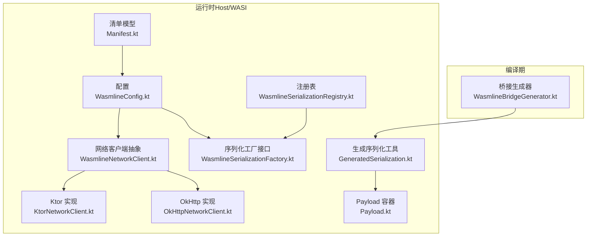
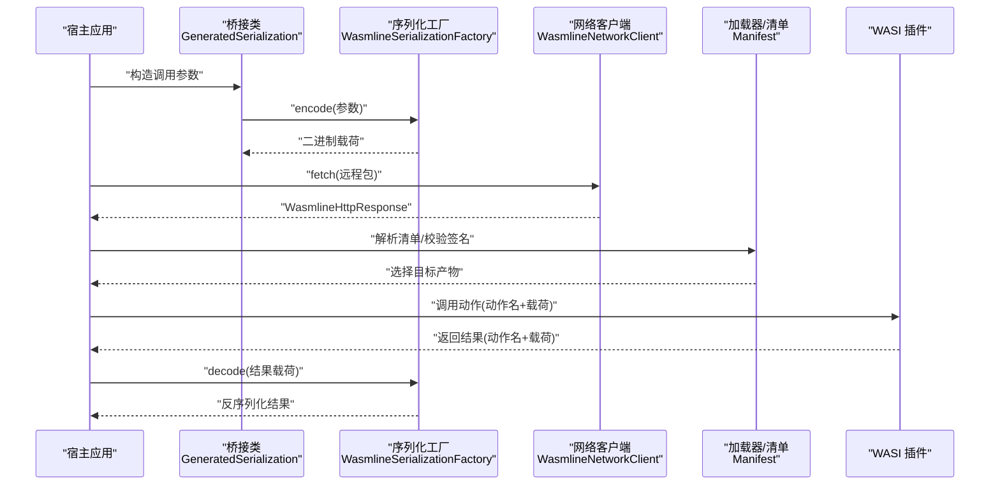
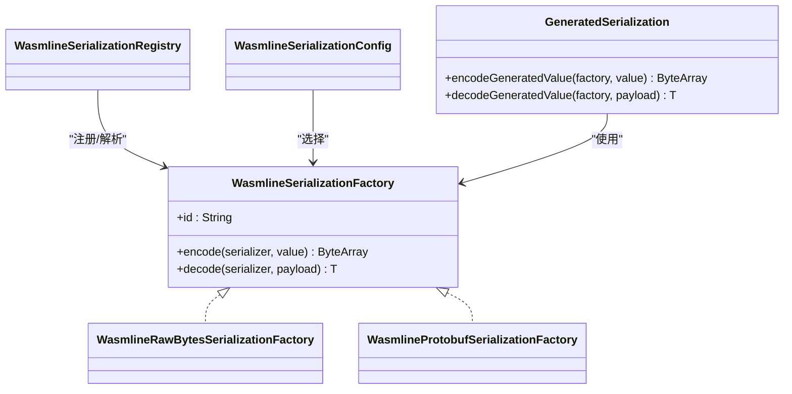
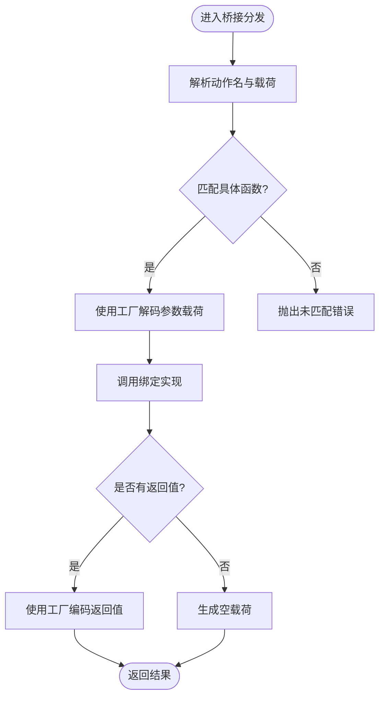
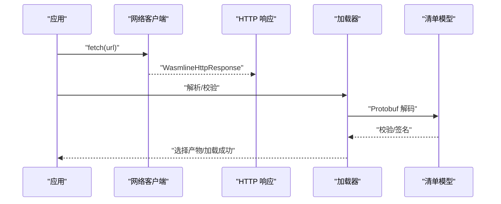
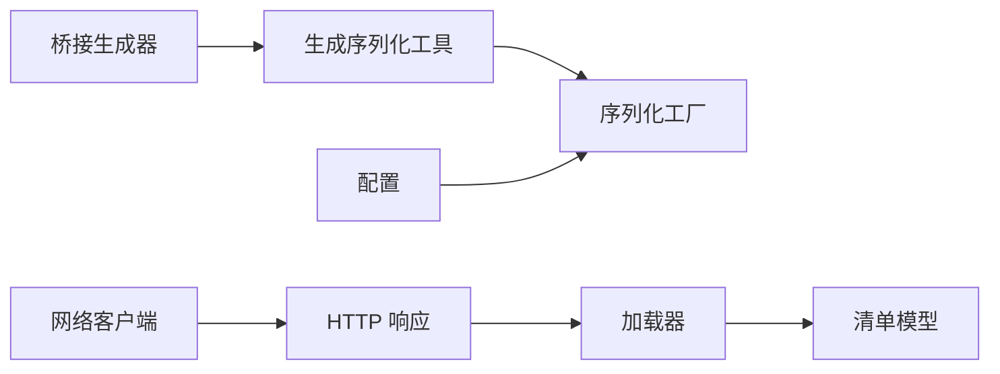

# 数据流架构

<cite>
**本文引用的文件**
- [WasmlineSerializationFactory.kt](file://wasmline-multiplatform/wasmline/src/commonMain/kotlin/crow/wasmline/serialization/WasmlineSerializationFactory.kt)
- [WasmlineSerializationConfig.kt](file://wasmline-multiplatform/wasmline/src/commonMain/kotlin/crow/wasmline/serialization/WasmlineSerializationConfig.kt)
- [WasmlineSerializationRegistry.kt](file://wasmline-multiplatform/wasmline/src/commonMain/kotlin/crow/wasmline/serialization/WasmlineSerializationRegistry.kt)
- [GeneratedSerialization.kt](file://wasmline-multiplatform/wasmline/src/commonMain/kotlin/crow/wasmline/internal/bridge/GeneratedSerialization.kt)
- [WasmlineBridgeGenerator.kt](file://wasmline-multiplatform/wasmline-kotlin-plugin/src/main/kotlin/crow/wasmline/kotlin/WasmlineBridgeGenerator.kt)
- [Payload.kt](file://wasmline-multiplatform/wasmline/src/commonMain/kotlin/crow/wasmline/internal/bridge/Payload.kt)
- [Wasmline.wasmWasi.kt](file://wasmline-multiplatform/wasmline/src/wasmWasiMain/kotlin/crow/wasmline/Wasmline.wasmWasi.kt)
- [WasmlineConfig.kt](file://wasmline-multiplatform/wasmline/src/commonMain/kotlin/crow/wasmline/WasmlineConfig.kt)
- [Manifest.kt](file://wasmline-multiplatform/wasmline-loader/src/commonMain/kotlin/crow/wasmline/loader/model/Manifest.kt)
- [OkHttpNetworkClient.kt](file://wasmline-multiplatform/wasmline-network-okhttp/src/commonMain/kotlin/crow/wasmline/network/okhttp/OkHttpNetworkClient.kt)
- [KtorNetworkClient.kt](file://wasmline-multiplatform/wasmline-network-ktor/src/commonMain/kotlin/crow/wasmline/network/ktor/KtorNetworkClient.kt)
- [BlockingFetch.web.kt](file://wasmline-multiplatform/wasmline-network-ktor/src/webMain/kotlin/crow/wasmline/network/ktor/BlockingFetch.web.kt)
- [BrowserPayloadEncoding.kt](file://wasmline-multiplatform/wasmline/src/hostMain/kotlin/crow/wasmline/BrowserPayloadEncoding.kt)
- [ApplicationWasmRunner.kt](file://wasmline-samples/kotlin/sample-apps/application/src/main/kotlin/ApplicationWasmRunner.kt)
- [mind.md（多平台）](file://wasmline-multiplatform/mind.md)
</cite>

## 目录
1. [引言](#引言)
2. [项目结构](#项目结构)
3. [核心组件](#核心组件)
4. [架构总览](#架构总览)
5. [详细组件分析](#详细组件分析)
6. [依赖关系分析](#依赖关系分析)
7. [性能考量](#性能考量)
8. [故障排查指南](#故障排查指南)
9. [结论](#结论)
10. [附录](#附录)

## 引言
本文件面向性能调优工程师与数据架构师，系统性阐述 Wasmline 的数据流架构与序列化体系，覆盖从服务调用到结果返回的完整链路；解析多层序列化（原始字节、Protobuf、自定义工厂）的设计与交互；说明 Payload 封装、类型安全与版本兼容策略；并给出网络层传输格式、压缩与完整性校验建议、端到端追踪图与性能指标，以及大数据量场景下的优化与内存管理建议。

## 项目结构
Wasmline 多平台模块围绕“桥接生成器”“运行时桥接”“序列化工厂”“网络客户端”“加载器与清单”等核心子系统协作，形成统一的数据通道与跨语言/跨平台的调用边界。

图表来源
- [WasmlineBridgeGenerator.kt:82-548](file://wasmline-multiplatform/wasmline-kotlin-plugin/src/main/kotlin/crow/wasmline/kotlin/WasmlineBridgeGenerator.kt#L82-L548)
- [WasmlineSerializationFactory.kt:16-66](file://wasmline-multiplatform/wasmline/src/commonMain/kotlin/crow/wasmline/serialization/WasmlineSerializationFactory.kt#L16-L66)
- [WasmlineSerializationRegistry.kt](file://wasmline-multiplatform/wasmline/src/commonMain/kotlin/crow/wasmline/serialization/WasmlineSerializationRegistry.kt)
- [GeneratedSerialization.kt:8-22](file://wasmline-multiplatform/wasmline/src/commonMain/kotlin/crow/wasmline/internal/bridge/GeneratedSerialization.kt#L8-L22)
- [Payload.kt](file://wasmline-multiplatform/wasmline/src/commonMain/kotlin/crow/wasmline/internal/bridge/Payload.kt)
- [WasmlineNetworkClient.kt:39-41](file://wasmline-multiplatform/wasmline/src/commonMain/kotlin/crow/wasmline/WasmlineNetworkClient.kt#L39-L41)
- [OkHttpNetworkClient.kt:27-50](file://wasmline-multiplatform/wasmline-network-okhttp/src/commonMain/kotlin/crow/wasmline/network/okhttp/OkHttpNetworkClient.kt#L27-L50)
- [KtorNetworkClient.kt:22-43](file://wasmline-multiplatform/wasmline-network-ktor/src/commonMain/kotlin/crow/wasmline/network/ktor/KtorNetworkClient.kt#L22-L43)
- [Manifest.kt:75-97](file://wasmline-multiplatform/wasmline-loader/src/commonMain/kotlin/crow/wasmline/loader/model/Manifest.kt#L75-L97)

章节来源
- [mind.md（多平台）:210-260](file://wasmline-multiplatform/mind.md#L210-L260)

## 核心组件
- 序列化工厂与协议
  - 工厂接口定义编码/解码契约与稳定标识，内置“原始字节”“Protobuf”两种实现，支持自定义注册与版本兼容。
- 生成式桥接
  - 编译期生成桥接类，注入序列化工厂与实现对象，运行时通过统一入口分发调用。
- Payload 封装
  - 统一承载动作名与二进制载荷，确保类型安全与零拷贝路径。
- 网络与清单
  - 抽象网络客户端，内置 OkHttp/Ktor 实现；清单采用 Protobuf 编码，含签名与校验字段。
- 配置与运行时
  - 统一配置对象承载序列化、并发、网络、信任密钥与缓存策略。

章节来源
- [WasmlineSerializationFactory.kt:16-66](file://wasmline-multiplatform/wasmline/src/commonMain/kotlin/crow/wasmline/serialization/WasmlineSerializationFactory.kt#L16-L66)
- [WasmlineSerializationConfig.kt](file://wasmline-multiplatform/wasmline/src/commonMain/kotlin/crow/wasmline/serialization/WasmlineSerializationConfig.kt)
- [WasmlineSerializationRegistry.kt](file://wasmline-multiplatform/wasmline/src/commonMain/kotlin/crow/wasmline/serialization/WasmlineSerializationRegistry.kt)
- [GeneratedSerialization.kt:8-22](file://wasmline-multiplatform/wasmline/src/commonMain/kotlin/crow/wasmline/internal/bridge/GeneratedSerialization.kt#L8-L22)
- [WasmlineBridgeGenerator.kt:82-548](file://wasmline-multiplatform/wasmline-kotlin-plugin/src/main/kotlin/crow/wasmline/kotlin/WasmlineBridgeGenerator.kt#L82-L548)
- [Payload.kt](file://wasmline-multiplatform/wasmline/src/commonMain/kotlin/crow/wasmline/internal/bridge/Payload.kt)
- [WasmlineNetworkClient.kt:39-41](file://wasmline-multiplatform/wasmline/src/commonMain/kotlin/crow/wasmline/WasmlineNetworkClient.kt#L39-L41)
- [OkHttpNetworkClient.kt:27-50](file://wasmline-multiplatform/wasmline-network-okhttp/src/commonMain/kotlin/crow/wasmline/network/okhttp/OkHttpNetworkClient.kt#L27-L50)
- [KtorNetworkClient.kt:22-43](file://wasmline-multiplatform/wasmline-network-ktor/src/commonMain/kotlin/crow/wasmline/network/ktor/KtorNetworkClient.kt#L22-L43)
- [Manifest.kt:75-97](file://wasmline-multiplatform/wasmline-loader/src/commonMain/kotlin/crow/wasmline/loader/model/Manifest.kt#L75-L97)
- [WasmlineConfig.kt:18-24](file://wasmline-multiplatform/wasmline/src/commonMain/kotlin/crow/wasmline/WasmlineConfig.kt#L18-L24)

## 架构总览
下图展示一次典型的服务调用从 Host 发起，经由桥接、序列化、网络传输，再到 WASI 插件执行与回传的全链路。

图表来源
- [GeneratedSerialization.kt:8-22](file://wasmline-multiplatform/wasmline/src/commonMain/kotlin/crow/wasmline/internal/bridge/GeneratedSerialization.kt#L8-L22)
- [WasmlineSerializationFactory.kt:16-66](file://wasmline-multiplatform/wasmline/src/commonMain/kotlin/crow/wasmline/serialization/WasmlineSerializationFactory.kt#L16-L66)
- [WasmlineNetworkClient.kt:39-41](file://wasmline-multiplatform/wasmline/src/commonMain/kotlin/crow/wasmline/WasmlineNetworkClient.kt#L39-L41)
- [Manifest.kt:75-97](file://wasmline-multiplatform/wasmline-loader/src/commonMain/kotlin/crow/wasmline/loader/model/Manifest.kt#L75-L97)
- [Wasmline.wasmWasi.kt:52-59](file://wasmline-multiplatform/wasmline/src/wasmWasiMain/kotlin/crow/wasmline/Wasmline.wasmWasi.kt#L52-L59)

## 详细组件分析

### 序列化系统：多层架构与工厂协议
- 工厂接口与内置实现
  - 接口定义稳定标识与编解码方法；内置“原始字节”仅支持特定类型；“Protobuf”基于 kotlinx.serialization。
- 工厂选择与版本兼容
  - 通过配置在加载阶段协商工厂 id；不匹配导致接收端解码失败；自定义工厂需保持 id 稳定以跨版本兼容。
- 生成式序列化工具
  - 运行时通过泛型 serializer 获取类型信息并委托工厂，简化调用方代码。

图表来源
- [WasmlineSerializationFactory.kt:16-66](file://wasmline-multiplatform/wasmline/src/commonMain/kotlin/crow/wasmline/serialization/WasmlineSerializationFactory.kt#L16-L66)
- [WasmlineSerializationRegistry.kt](file://wasmline-multiplatform/wasmline/src/commonMain/kotlin/crow/wasmline/serialization/WasmlineSerializationRegistry.kt)
- [WasmlineSerializationConfig.kt](file://wasmline-multiplatform/wasmline/src/commonMain/kotlin/crow/wasmline/serialization/WasmlineSerializationConfig.kt)
- [GeneratedSerialization.kt:8-22](file://wasmline-multiplatform/wasmline/src/commonMain/kotlin/crow/wasmline/internal/bridge/GeneratedSerialization.kt#L8-L22)

章节来源
- [WasmlineSerializationFactory.kt:16-66](file://wasmline-multiplatform/wasmline/src/commonMain/kotlin/crow/wasmline/serialization/WasmlineSerializationFactory.kt#L16-L66)
- [WasmlineSerializationConfig.kt](file://wasmline-multiplatform/wasmline/src/commonMain/kotlin/crow/wasmline/serialization/WasmlineSerializationConfig.kt)
- [WasmlineSerializationRegistry.kt](file://wasmline-multiplatform/wasmline/src/commonMain/kotlin/crow/wasmline/serialization/WasmlineSerializationRegistry.kt)
- [GeneratedSerialization.kt:8-22](file://wasmline-multiplatform/wasmline/src/commonMain/kotlin/crow/wasmline/internal/bridge/GeneratedSerialization.kt#L8-L22)
- [mind.md（多平台）:236-259](file://wasmline-multiplatform/mind.md#L236-L259)

### 桥接与调用分发：编译期生成与运行时路由
- 编译期桥接生成
  - 生成桥接类，注入 endpoint、implementation、serializationFactory 字段，并在构造中初始化。
- 运行时分发
  - invoke 方法根据动作名路由到绑定实现，按参数数量分支调用，最终对返回值进行编码或生成空载荷。
- 类型安全与零拷贝
  - 通过 serializer<T>() 在运行时获取类型信息，避免反射开销；Payload 作为 ByteArray 直传，减少中间对象。

图表来源
- [WasmlineBridgeGenerator.kt:366-487](file://wasmline-multiplatform/wasmline-kotlin-plugin/src/main/kotlin/crow/wasmline/kotlin/WasmlineBridgeGenerator.kt#L366-L487)
- [GeneratedSerialization.kt:8-22](file://wasmline-multiplatform/wasmline/src/commonMain/kotlin/crow/wasmline/internal/bridge/GeneratedSerialization.kt#L8-L22)

章节来源
- [WasmlineBridgeGenerator.kt:82-548](file://wasmline-multiplatform/wasmline-kotlin-plugin/src/main/kotlin/crow/wasmline/kotlin/WasmlineBridgeGenerator.kt#L82-L548)
- [GeneratedSerialization.kt:8-22](file://wasmline-multiplatform/wasmline/src/commonMain/kotlin/crow/wasmline/internal/bridge/GeneratedSerialization.kt#L8-L22)

### Payload 封装与类型安全
- 封装机制
  - Payload 作为统一容器承载动作名与二进制载荷，避免跨边界传递时的类型歧义。
- 类型安全
  - 通过 serializer<T>() 在编解码两端保持一致的类型描述，防止误用。
- 版本兼容
  - 工厂 id 与序列化协议稳定，配合清单中的版本字段与签名，确保跨版本兼容与防篡改。

章节来源
- [Payload.kt](file://wasmline-multiplatform/wasmline/src/commonMain/kotlin/crow/wasmline/internal/bridge/Payload.kt)
- [mind.md（多平台）:236-259](file://wasmline-multiplatform/mind.md#L236-L259)

### 网络层传输与完整性校验
- 传输格式
  - 网络响应体为原始字节，便于直接写入加载流程；Web 平台同步阻塞请求不支持，需提供异步解析器。
- 压缩策略
  - 可在应用侧对传输内容进行压缩（如 gzip），但需在接收端解压后再交由加载器处理。
- 完整性校验
  - 清单采用 Protobuf 编码，包含 SHA-256 校验与数字签名（Ed25519 或 ECDSA-P256），加载器验证通过后才选择目标产物。

图表来源
- [WasmlineNetworkClient.kt:39-41](file://wasmline-multiplatform/wasmline/src/commonMain/kotlin/crow/wasmline/WasmlineNetworkClient.kt#L39-L41)
- [OkHttpNetworkClient.kt:27-50](file://wasmline-multiplatform/wasmline-network-okhttp/src/commonMain/kotlin/crow/wasmline/network/okhttp/OkHttpNetworkClient.kt#L27-L50)
- [KtorNetworkClient.kt:22-43](file://wasmline-multiplatform/wasmline-network-ktor/src/commonMain/kotlin/crow/wasmline/network/ktor/KtorNetworkClient.kt#L22-L43)
- [Manifest.kt:75-97](file://wasmline-multiplatform/wasmline-loader/src/commonMain/kotlin/crow/wasmline/loader/model/Manifest.kt#L75-L97)
- [BlockingFetch.web.kt:6-11](file://wasmline-multiplatform/wasmline-network-ktor/src/webMain/kotlin/crow/wasmline/network/ktor/BlockingFetch.web.kt#L6-L11)

章节来源
- [WasmlineNetworkClient.kt:39-41](file://wasmline-multiplatform/wasmline/src/commonMain/kotlin/crow/wasmline/WasmlineNetworkClient.kt#L39-L41)
- [OkHttpNetworkClient.kt:27-50](file://wasmline-multiplatform/wasmline-network-okhttp/src/commonMain/kotlin/crow/wasmline/network/okhttp/OkHttpNetworkClient.kt#L27-L50)
- [KtorNetworkClient.kt:22-43](file://wasmline-multiplatform/wasmline-network-ktor/src/commonMain/kotlin/crow/wasmline/network/ktor/KtorNetworkClient.kt#L22-L43)
- [Manifest.kt:75-97](file://wasmline-multiplatform/wasmline-loader/src/commonMain/kotlin/crow/wasmline/loader/model/Manifest.kt#L75-L97)
- [BlockingFetch.web.kt:6-11](file://wasmline-multiplatform/wasmline-network-ktor/src/webMain/kotlin/crow/wasmline/network/ktor/BlockingFetch.web.kt#L6-L11)

### Web 平台的补充编码层
- 当跨 JS/Wasm 边界时，可使用浏览器侧的 Base64 编解码作为补充层，避免直接操作原生字节带来的限制。

章节来源
- [BrowserPayloadEncoding.kt](file://wasmline-multiplatform/wasmline/src/hostMain/kotlin/crow/wasmline/BrowserPayloadEncoding.kt)

### 端到端追踪与性能指标
- 追踪点
  - 调用发起、序列化开始/结束、网络请求、清单解析与校验、插件执行、反序列化开始/结束。
- 关键指标
  - 序列化耗时、网络往返时间、清单校验耗时、插件执行耗时、内存分配峰值、GC 次数与暂停时间。

章节来源
- [ApplicationWasmRunner.kt:95-107](file://wasmline-samples/kotlin/sample-apps/application/src/main/kotlin/ApplicationWasmRunner.kt#L95-L107)
- [WasmlineConfig.kt:18-24](file://wasmline-multiplatform/wasmline/src/commonMain/kotlin/crow/wasmline/WasmlineConfig.kt#L18-L24)

## 依赖关系分析
- 组件耦合
  - 桥接生成器依赖运行时符号与工厂接口；运行时通过配置选择工厂；网络客户端与加载器相互独立，通过统一响应体对接。
- 外部依赖
  - 序列化依赖 kotlinx.serialization；网络客户端依赖各自平台实现（OkHttp/Ktor）。
- 版本兼容
  - 工厂 id 与序列化协议稳定，清单版本字段与签名保障升级路径可控。

图表来源
- [WasmlineBridgeGenerator.kt:82-548](file://wasmline-multiplatform/wasmline-kotlin-plugin/src/main/kotlin/crow/wasmline/kotlin/WasmlineBridgeGenerator.kt#L82-L548)
- [GeneratedSerialization.kt:8-22](file://wasmline-multiplatform/wasmline/src/commonMain/kotlin/crow/wasmline/internal/bridge/GeneratedSerialization.kt#L8-L22)
- [WasmlineSerializationFactory.kt:16-66](file://wasmline-multiplatform/wasmline/src/commonMain/kotlin/crow/wasmline/serialization/WasmlineSerializationFactory.kt#L16-L66)
- [WasmlineNetworkClient.kt:39-41](file://wasmline-multiplatform/wasmline/src/commonMain/kotlin/crow/wasmline/WasmlineNetworkClient.kt#L39-L41)
- [Manifest.kt:75-97](file://wasmline-multiplatform/wasmline-loader/src/commonMain/kotlin/crow/wasmline/loader/model/Manifest.kt#L75-L97)

## 性能考量
- 序列化优化
  - 优先使用 Protobuf 工厂以获得更小体积与更快速度；对频繁调用的简单类型可考虑原始字节工厂以降低开销。
- 大数据量处理
  - 对超大载荷启用应用侧压缩并在加载前解压；避免在序列化/反序列化阶段产生临时缓冲区。
- 内存与 GC 影响
  - 减少中间对象创建，尽量复用 ByteArray；关注长生命周期对象与闭包捕获；在移动端与浏览器端适当降低并发。
- 并发与锁
  - 启用并发支持时注意内部互斥开销；默认无锁路径适合高吞吐低延迟场景。

## 故障排查指南
- 工厂不匹配
  - 症状：接收端解码失败。检查双方配置的工厂 id 是否一致。
- Web 平台同步请求
  - 症状：抛出不支持异常。需提供异步解析器或切换到支持同步的平台。
- 清单校验失败
  - 症状：加载拒绝。检查签名算法与公钥是否匹配，SHA-256 是否与产物一致。
- 网络异常
  - 症状：HTTP 错误码或空响应。确认 URL 正确、代理与证书配置、重试策略。

章节来源
- [mind.md（多平台）:236-259](file://wasmline-multiplatform/mind.md#L236-L259)
- [BlockingFetch.web.kt:6-11](file://wasmline-multiplatform/wasmline-network-ktor/src/webMain/kotlin/crow/wasmline/network/ktor/BlockingFetch.web.kt#L6-L11)
- [Manifest.kt:75-97](file://wasmline-multiplatform/wasmline-loader/src/commonMain/kotlin/crow/wasmline/loader/model/Manifest.kt#L75-L97)

## 结论
Wasmline 的数据流架构以“编译期桥接 + 运行时工厂 + 统一 Payload”为核心，结合清单与签名实现强一致的版本与安全控制。通过多层序列化与网络适配，既满足高性能需求，又兼顾跨平台与版本演进。工程实践中应重点关注序列化策略、网络与缓存、内存与 GC、以及端到端可观测性，以达成稳定与高效的生产级表现。

## 附录
- 快速参考
  - 序列化工厂：原始字节、Protobuf、自定义注册
  - 配置项：序列化、并发、网络客户端、信任密钥、缓存
  - 网络：OkHttp、Ktor；Web 不支持同步阻塞
  - 清单：Protobuf 编码、SHA-256 校验、Ed25519/ECDSA-P256 签名