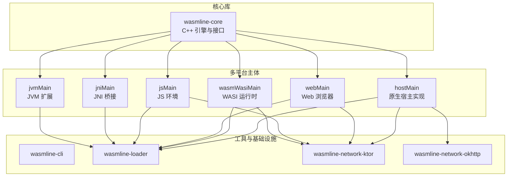
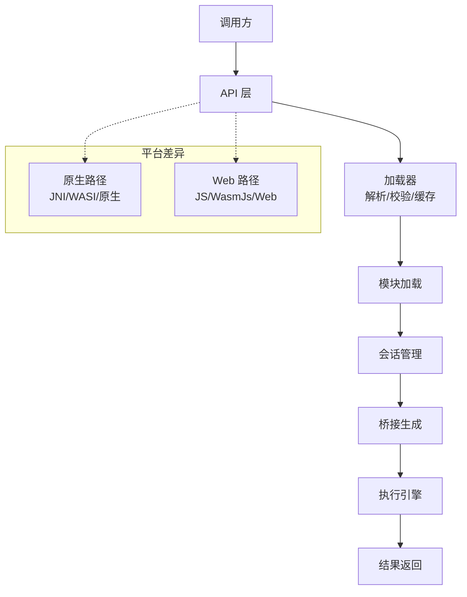
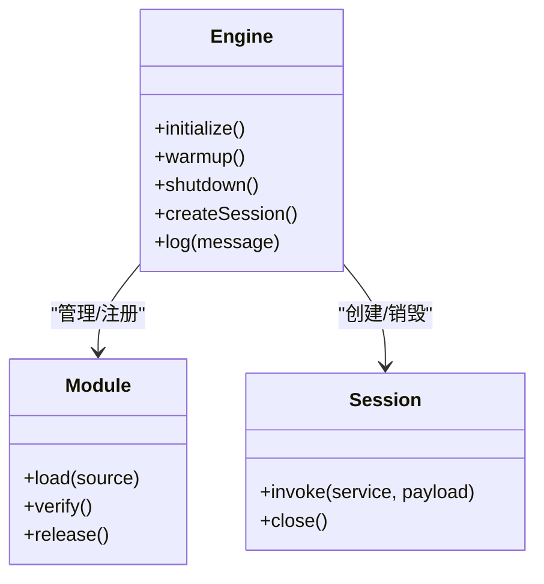
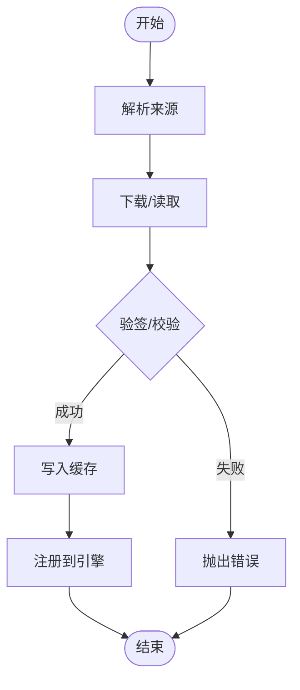
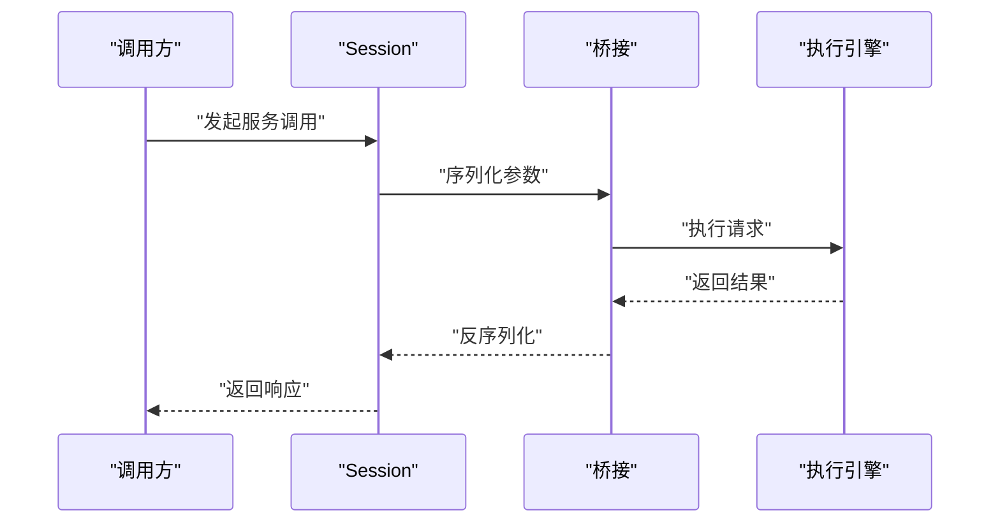
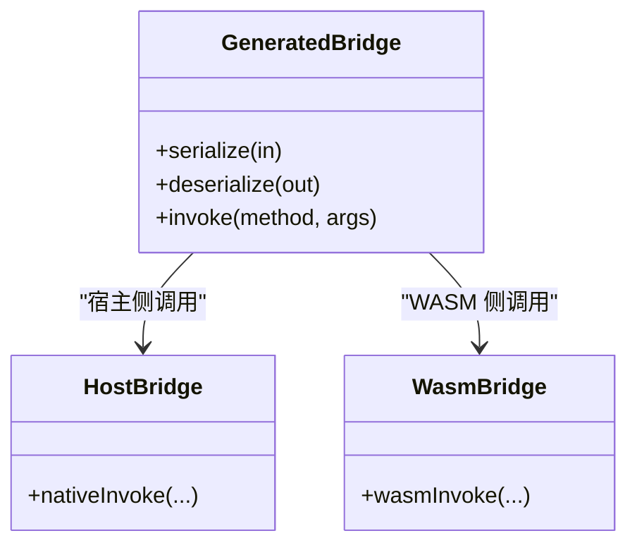
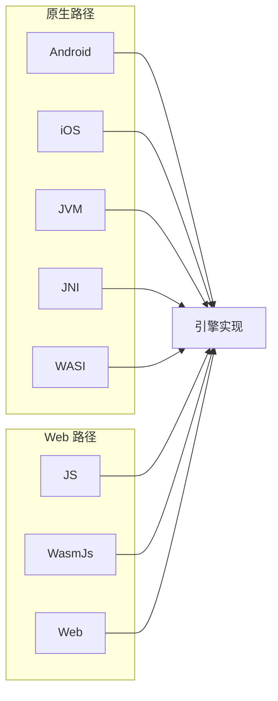
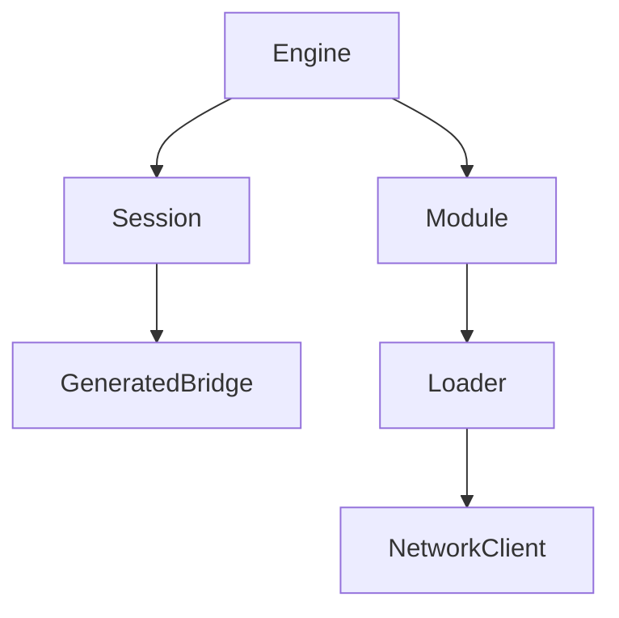

# 架构设计

<cite>
**本文引用的文件**
- [wasmline-core/include/Engine.h](file://wasmline-core/include/Engine.h)
- [wasmline-core/include/Module.h](file://wasmline-core/include/Module.h)
- [wasmline-core/include/Session.h](file://wasmline-core/include/Session.h)
- [wasmline-core/include/Api.h](file://wasmline-core/include/Api.h)
- [wasmline-multiplatform/wasmline/src/commonMain/kotlin/crow/wasmline/internal/bridge/GeneratedBridge.kt](file://wasmline-multiplatform/wasmline/src/commonMain/kotlin/crow/wasmline/internal/bridge/GeneratedBridge.kt)
- [wasmline-multiplatform/wasmline/src/hostMain/kotlin/crow/wasmline/Wasmline.kt](file://wasmline-multiplatform/wasmline/src/hostMain/kotlin/crow/wasmline/Wasmline.kt)
- [wasmline-multiplatform/wasmline/src/hostMain/kotlin/crow/wasmline/WasmlineLoader.kt](file://wasmline-multiplatform/wasmline/src/hostMain/kotlin/crow/wasmline/WasmlineLoader.kt)
- [wasmline-multiplatform/wasmline/src/hostMain/kotlin/crow/wasmline/WasmlineServices.host.kt](file://wasmline-multiplatform/wasmline/src/hostMain/kotlin/crow/wasmline/WasmlineServices.host.kt)
- [wasmline-multiplatform/wasmline/src/wasmWasiMain/kotlin/crow/wasmline/Wasmline.wasmWasi.kt](file://wasmline-multiplatform/wasmline/src/wasmWasiMain/kotlin/crow/wasmline/Wasmline.wasmWasi.kt)
- [wasmline-multiplatform/wasmline/src/wasmWasiMain/kotlin/crow/wasmline/WasmlineWasmBridge.kt](file://wasmline-multiplatform/wasmline/src/wasmWasiMain/kotlin/crow/wasmline/WasmlineWasmBridge.kt)
- [wasmline-multiplatform/wasmline/src/wasmWasiMain/kotlin/crow/wasmline/WasmlineRouter.kt](file://wasmline-multiplatform/wasmline/src/wasmWasiMain/kotlin/crow/wasmline/WasmlineRouter.kt)
- [wasmline-multiplatform/wasmline/src/wasmWasiMain/kotlin/crow/wasmline/model/WasmError.kt](file://wasmline-multiplatform/wasmline/src/wasmWasiMain/kotlin/crow/wasmline/model/WasmError.kt)
- [wasmline-multiplatform/wasmline/src/jsMain/kotlin/crow/wasmline/Wasmline.js.kt](file://wasmline-multiplatform/wasmline/src/jsMain/kotlin/crow/wasmline/Wasmline.js.kt)
- [wasmline-multiplatform/wasmline/src/webMain/kotlin/crow/wasmline/Wasmline.web.kt](file://wasmline-multiplatform/wasmline/src/webMain/kotlin/crow/wasmline/Wasmline.web.kt)
- [wasmline-multiplatform/wasmline/src/native/iosMain/kotlin/crow/wasmline/native/WasmlineBridge.kt](file://wasmline-multiplatform/wasmline/src/native/iosMain/kotlin/crow/wasmline/native/WasmlineBridge.kt)
- [wasmline-multiplatform/wasmline/src/native/jniMain/kotlin/crow/wasmline/Wasmline.jni.kt](file://wasmline-multiplatform/wasmline/src/native/jniMain/kotlin/crow/wasmline/Wasmline.jni.kt)
- [wasmline-multiplatform/wasmline/src/native/jvmMain/kotlin/crow/wasmline/extensions/NativeLoaderExt.kt](file://wasmline-multiplatform/wasmline/src/native/jvmMain/kotlin/crow/wasmline/extensions/NativeLoaderExt.kt)
- [wasmline-multiplatform/wasmline/src/native/wasmJsMain/kotlin/crow/wasmline/Wasmline.wasmJs.kt](file://wasmline-multiplatform/wasmline/src/native/wasmJsMain/kotlin/crow/wasmline/Wasmline.wasmJs.kt)
- [wasmline-multiplatform/wasmline/src/native/wasmWasiMain/kotlin/crow/wasmline/WasmMain.kt](file://wasmline-multiplatform/wasmline/src/native/wasmWasiMain/kotlin/crow/wasmline/WasmMain.kt)
- [wasmline-multiplatform/wasmline/src/native/wasmWasiMain/kotlin/crow/wasmline/WasmlineServices.wasmWasi.kt](file://wasmline-multiplatform/wasmline/src/native/wasmWasiMain/kotlin/crow/wasmline/WasmlineServices.wasmWasi.kt)
- [wasmline-multiplatform/wasmline/src/native/iosMain/kotlin/crow/wasmline/native/Wasmline.ios.kt](file://wasmline-multiplatform/wasmline/src/native/iosMain/kotlin/crow/wasmline/native/Wasmline.ios.kt)
- [wasmline-multiplatform/wasmline/src/native/jniMain/kotlin/crow/wasmline/WasmlineServices.jni.kt](file://wasmline-multiplatform/wasmline/src/native/jniMain/kotlin/crow/wasmline/WasmlineServices.jni.kt)
- [wasmline-multiplatform/wasmline/src/native/jvmMain/kotlin/crow/wasmline/WasmlineServices.jvm.kt](file://wasmline-multiplatform/wasmline/src/native/jvmMain/kotlin/crow/wasmline/WasmlineServices.jvm.kt)
- [wasmline-multiplatform/wasmline/src/native/jsMain/kotlin/crow/wasmline/WasmlineServices.js.kt](file://wasmline-multiplatform/wasmline/src/native/jsMain/kotlin/crow/wasmline/WasmlineServices.js.kt)
- [wasmline-multiplatform/wasmline/src/native/wasmJsMain/kotlin/crow/wasmline/WasmlineServices.wasmJs.kt](file://wasmline-multiplatform/wasmline/src/native/wasmJsMain/kotlin/crow/wasmline/WasmlineServices.wasmJs.kt)
- [wasmline-multiplatform/wasmline/src/native/webMain/kotlin/crow/wasmline/WasmlineServices.web.kt](file://wasmline-multiplatform/wasmline/src/native/webMain/kotlin/crow/wasmline/WasmlineServices.web.kt)
- [wasmline-multiplatform/wasmline/src/native/iosMain/kotlin/crow/wasmline/native/WasmlineNative.cpp](file://wasmline-multiplatform/wasmline/src/native/iosMain/kotlin/crow/wasmline/native/WasmlineNative.cpp)
- [wasmline-multiplatform/wasmline/src/native/jniMain/kotlin/crow/wasmline/WasmlineJni.cpp](file://wasmline-multiplatform/wasmline/src/native/jniMain/kotlin/crow/wasmline/WasmlineJni.cpp)
- [wasmline-multiplatform/wasmline/src/native/jniMain/kotlin/crow/wasmline/JniHostHandler.cpp](file://wasmline-multiplatform/wasmline/src/native/jniMain/kotlin/crow/wasmline/JniHostHandler.cpp)
- [wasmline-multiplatform/wasmline/src/native/jniMain/kotlin/crow/wasmline/JniHostHandler.h](file://wasmline-multiplatform/wasmline/src/native/jniMain/kotlin/crow/wasmline/JniHostHandler.h)
- [wasmline-multiplatform/wasmline/src/native/wasmWasiMain/kotlin/crow/wasmline/WasmlineWasmBridge.kt](file://wasmline-multiplatform/wasmline/src/native/wasmWasiMain/kotlin/crow/wasmline/WasmlineWasmBridge.kt)
- [wasmline-multiplatform/wasmline/src/native/wasmWasiMain/kotlin/crow/wasmline/WasmlineRouter.kt](file://wasmline-multiplatform/wasmline/src/native/wasmWasiMain/kotlin/crow/wasmline/WasmlineRouter.kt)
- [wasmline-multiplatform/wasmline/src/native/wasmWasiMain/kotlin/crow/wasmline/model/WasmError.kt](file://wasmline-multiplatform/wasmline/src/native/wasmWasiMain/kotlin/crow/wasmline/model/WasmError.kt)
- [wasmline-multiplatform/wasmline/src/native/wasmWasiMain/kotlin/crow/wasmline/WasmlineServices.wasmWasi.kt](file://wasmline-multiplatform/wasmline/src/native/wasmWasiMain/kotlin/crow/wasmline/WasmlineServices.wasmWasi.kt)
- [wasmline-multiplatform/wasmline/src/native/wasmWasiMain/kotlin/crow/wasmline/Wasmline.wasmWasi.kt](file://wasmline-multiplatform/wasmline/src/native/wasmWasiMain/kotlin/crow/wasmline/Wasmline.wasmWasi.kt)
- [wasmline-multiplatform/wasmline/src/native/wasmWasiMain/kotlin/crow/wasmline/WasmMain.kt](file://wasmline-multiplatform/wasmline/src/native/wasmWasiMain/kotlin/crow/wasmline/WasmMain.kt)
- [wasmline-multiplatform/wasmline/src/native/wasmWasiMain/kotlin/crow/wasmline/WasmlineRouter.kt](file://wasmline-multiplatform/wasmline/src/native/wasmWasiMain/kotlin/crow/wasmline/WasmlineRouter.kt)
- [wasmline-multiplatform/wasmline/src/native/wasmWasiMain/kotlin/crow/wasmline/model/WasmError.kt](file://wasmline-multiplatform/wasmline/src/native/wasmWasiMain/kotlin/crow/wasmline/model/WasmError.kt)
- [wasmline-multiplatform/wasmline/src/native/wasmWasiMain/kotlin/crow/wasmline/WasmlineServices.wasmWasi.kt](file://wasmline-multiplatform/wasmline/src/native/wasmWasiMain/kotlin/crow/wasmline/WasmlineServices.wasmWasi.kt)
- [wasmline-multiplatform/wasmline/src/native/wasmWasiMain/kotlin/crow/wasmline/Wasmline.wasmWasi.kt](file://wasmline-multiplatform/wasmline/src/native/wasmWasiMain/kotlin/crow/wasmline/Wasmline.wasmWasi.kt)
- [wasmline-multiplatform/wasmline/src/native/wasmWasiMain/kotlin/crow/wasmline/WasmMain.kt](file://wasmline-multiplatform/wasmline/src/native/wasmWasiMain/kotlin/crow/wasmline/WasmMain.kt)
- [wasmline-multiplatform/wasmline/src/native/wasmWasiMain/kotlin/crow/wasmline/WasmlineRouter.kt](file://wasmline-multiplatform/wasmline/src/native/wasmWasiMain/kotlin/crow/wasmline/WasmlineRouter.kt)
- [wasmline-multiplatform/wasmline/src/native/wasmWasiMain/kotlin/crow/wasmline/model/WasmError.kt](file://wasmline-multiplatform/wasmline/src/native/wasmWasiMain/kotlin/crow/wasmline/model/WasmError.kt)
- [wasmline-multiplatform/wasmline/src/native/wasmWasiMain/kotlin/crow/wasmline/WasmlineServices.wasmWasi.kt](file://wasmline-multiplatform/wasmline/src/native/wasmWasiMain/kotlin/crow/wasmline/WasmlineServices.wasmWasi.kt)
- [wasmline-multiplatform/wasmline/src/native/wasmWasiMain/kotlin/crow/wasmline/Wasmline.wasmWasi.kt](file://wasmline-multiplatform/wasmline/src/native/wasmWasiMain/kotlin/crow/wasmline/Wasmline.wasmWasi.kt)
- [wasmline-multiplatform/wasmline/src/native/wasmWasiMain/kotlin/crow/wasmline/WasmMain.kt](file://wasmline-multiplatform/wasmline/src/native/wasmWasiMain/kotlin/crow/wasmline/WasmMain.kt)
- [wasmline-multiplatform/wasmline/src/native/wasmWasiMain/kotlin/crow/wasmline/WasmlineRouter.kt](file://wasmline-multiplatform/wasmline/src/native/wasmWasiMain/kotlin/crow/wasmline/WasmlineRouter.kt)
- [wasmline-multiplatform/wasmline/src/native/wasmWasiMain/kotlin/crow/wasmline/model/WasmError.kt](file://wasmline-multiplatform/wasmline/src/native/wasmWasiMain/kotlin/crow/wasmline/model/WasmError.kt)
- [wasmline-multiplatform/wasmline/src/native/wasmWasiMain/kotlin/crow/wasmline/WasmlineServices.wasmWasi.kt](file://wasmline-multiplatform/wasmline/src/native/wasmWasiMain/kotlin/crow/wasmline/WasmlineServices.wasmWasi.kt)
- [wasmline-multiplatform/wasmline/src/native/wasmWasiMain/kotlin/crow/wasmline/Wasmline.wasmWasi.kt](file://wasmline-multiplatform/wasmline/src/native/wasmWasiMain/kotlin/crow/wasmline/Wasmline.wasmWasi.kt)
- [wasmline-multiplatform/wasmline/src/native/wasmWasiMain/kotlin/crow/wasmline/WasmMain.kt](file://wasmline-multiplatform/wasmline/src/native/wasmWasiMain/kotlin/crow/wasmline/WasmMain.kt)
- [wasmline-multiplatform/wasmline/src/native/wasmWasiMain/kotlin/crow/wasmline/WasmlineRouter.kt](file://wasmline-multiplatform/wasmline/src/native/wasmWasiMain/kotlin/crow/wasmline/WasmlineRouter.kt)
- [wasmline-multiplatform/wasmline/src/native/wasmWasiMain/kotlin/crow/wasmline/model/WasmError.kt](file://wasmline-multiplatform/wasmline/src/native/wasmWasiMain/kotlin/crow/wasmline/model/WasmError.kt)
- [wasmline-multiplatform/wasmline/src/native/wasmWasiMain/kotlin/crow/wasmline/WasmlineServices.wasmWasi.kt](file://wasmline-multiplatform/wasmline/src/native/wasmWasiMain/kotlin/crow/wasmline/WasmlineServices.wasmWasi.kt)
- [wasmline-multiplatform/wasmline/src/native/wasmWasiMain/kotlin/crow/wasmline/Wasmline.wasmWasi.kt](file://wasmline-multiplatform/wasmline/src/native/wasmWasiMain/kotlin/crow/wasmline/Wasmline.wasmWasi.kt)
- [wasmline-multiplatform/wasmline/src/native/wasmWasiMain/kotlin/crow/wasmline/WasmMain.kt](file://wasmline-multiplatform/wasmline/src/native/wasmWasiMain/kotlin/crow/wasmline/WasmMain.kt)
- [wasmline-multiplatform/wasmline/src/native/wasmWasiMain/kotlin/crow/wasmline/WasmlineRouter.kt](file://wasmline-multiplatform/wasmline/src/native/wasmWasiMain/kotlin/crow/wasmline/WasmlineRouter.kt)
- [wasmline-multiplatform/wasmline/src/native/wasmWasiMain/kotlin/crow/wasmline/model/WasmError.kt](file://wasmline-multiplatform/wasmline/src/native/wasmWasiMain/kotlin/crow/wasmline/model/WasmError.kt)
- [wasmline-multiplatform/wasmline/src/native/wasmWasiMain/kotlin/crow/wasmline/WasmlineServices.wasmWasi.kt](file://wasmline-multiplatform/wasmline/src/native/wasmWasiMain/kotlin/crow/wasmline/WasmlineServices.wasmWasi.kt)
- [wasmline-multiplatform/wasmline/src/native/wasmWasiMain/kotlin/crow/wasmline/Wasmline.wasmWasi.kt](file://wasmline-multiplatform/wasmline/src/native/wasmWasiMain/kotlin/crow/wasmline/Wasmline.wasmWasi.kt)
- [wasmline-multiplatform/wasmline/src/native/wasmWasiMain/kotlin/crow/wasmline/WasmMain.kt](file://wasmline-multiplatform/wasmline/src/native/wasmWasiMain/kotlin/crow/wasmline/WasmMain.kt)
- [wasmline-multiplatform/wasmline/src/native/wasmWasiMain/kotlin/crow/wasmline/WasmlineRouter.kt](file://wasmline-multiplatform/wasmline/src/native/wasmW......)
</cite>

## 目录
1. [引言](#引言)
2. [项目结构](#项目结构)
3. [核心组件](#核心组件)
4. [架构总览](#架构总览)
5. [详细组件分析](#详细组件分析)
6. [依赖分析](#依赖分析)
7. [性能考量](#性能考量)
8. [故障排查指南](#故障排查指南)
9. [结论](#结论)
10. [附录](#附录)

## 引言
本设计文档面向架构师与高级开发者，系统化阐述 Wasmline 的双路径执行模型：原生目标与 Web 目标在统一抽象下的差异化实现。文档聚焦以下核心主题：
- 双路径执行模型：原生（Android/iOS/JVM/JNI/WASM-WASI）与 Web（JS/WasmJs/Web）路径的职责划分与交互边界
- 核心组件：Engine（引擎管理）、Module（模块加载）、Session（会话管理）、GeneratedBridge（桥接生成）
- 数据流：从服务调用到模块加载再到执行的完整链路
- 技术权衡：性能优化、内存管理、安全性保障
- 跨平台兼容性、扩展性与可维护性

## 项目结构
Wasmline 采用多模块分层组织：
- wasmline-core：C++ 核心引擎与接口定义（Engine、Module、Session、Api 等）
- wasmline-multiplatform：Kotlin Multiplatform 主体，按平台拆分实现（hostMain、wasmWasiMain、webMain、jsMain、jniMain、jvmMain 等），包含桥接生成、网络客户端、加载器等
- wasmline-cli：命令行工具，负责编译、下载、密钥生成与清单管理
- wasmline-loader：跨平台加载器与源解析、缓存、签名验证
- wasmline-network-*：网络客户端适配（Ktor/OkHttp）
- wasmline-samples：多端示例应用

图表来源
- [wasmline-core/include/Engine.h](file://wasmline-core/include/Engine.h)
- [wasmline-multiplatform/wasmline/src/hostMain/kotlin/crow/wasmline/Wasmline.kt](file://wasmline-multiplatform/wasmline/src/hostMain/kotlin/crow/wasmline/Wasmline.kt)
- [wasmline-multiplatform/wasmline/src/wasmWasiMain/kotlin/crow/wasmline/Wasmline.wasmWasi.kt](file://wasmline-multiplatform/wasmline/src/wasmWasiMain/kotlin/crow/wasmline/Wasmline.wasmWasi.kt)
- [wasmline-multiplatform/wasmline/src/webMain/kotlin/crow/wasmline/Wasmline.web.kt](file://wasmline-multiplatform/wasmline/src/webMain/kotlin/crow/wasmline/Wasmline.web.kt)
- [wasmline-multiplatform/wasmline/src/jsMain/kotlin/crow/wasmline/Wasmline.js.kt](file://wasmline-multiplatform/wasmline/src/jsMain/kotlin/crow/wasmline/Wasmline.js.kt)
- [wasmline-multiplatform/wasmline/src/native/jniMain/kotlin/crow/wasmline/Wasmline.jni.kt](file://wasmline-multiplatform/wasmline/src/native/jniMain/kotlin/crow/wasmline/Wasmline.jni.kt)
- [wasmline-multiplatform/wasmline/src/native/jvmMain/kotlin/crow/wasmline/WasmlineServices.jvm.kt](file://wasmline-multiplatform/wasmline/src/native/jvmMain/kotlin/crow/wasmline/WasmlineServices.jvm.kt)
- [wasmline-multiplatform/wasmline/src/native/wasmWasiMain/kotlin/crow/wasmline/Wasmline.wasmWasi.kt](file://wasmline-multiplatform/wasmline/src/native/wasmWasiMain/kotlin/crow/wasmline/Wasmline.wasmWasi.kt)

章节来源
- [wasmline-core/include/Api.h](file://wasmline-core/include/Api.h)
- [wasmline-multiplatform/wasmline/src/hostMain/kotlin/crow/wasmline/Wasmline.kt](file://wasmline-multiplatform/wasmline/src/hostMain/kotlin/crow/wasmline/Wasmline.kt)

## 核心组件
- Engine（引擎管理）
  - 统一的生命周期管理与资源调度，负责模块初始化、会话创建与销毁、错误传播与日志输出
  - 在不同平台通过本地桥接（JNI/JS/WASI/原生）实现具体行为
- Module（模块加载）
  - 负责从远端或本地源解析、校验、缓存与加载 WASM 模块；支持签名验证与完整性检查
  - 提供模块元数据查询与版本控制能力
- Session（会话管理）
  - 建立与模块的双向通信通道，封装请求/响应序列化与反序列化
  - 支持并发会话隔离与超时控制
- GeneratedBridge（桥接生成）
  - 编译期生成的类型安全桥接代码，将宿主 API 映射到 WASM 模块，减少运行时反射与序列化开销

章节来源
- [wasmline-core/include/Engine.h](file://wasmline-core/include/Engine.h)
- [wasmline-core/include/Module.h](file://wasmline-core/include/Module.h)
- [wasmline-core/include/Session.h](file://wasmline-core/include/Session.h)
- [wasmline-multiplatform/wasmline/src/commonMain/kotlin/crow/wasmline/internal/bridge/GeneratedBridge.kt](file://wasmline-multiplatform/wasmline/src/commonMain/kotlin/crow/wasmline/internal/bridge/GeneratedBridge.kt)

## 架构总览
Wasmline 的双路径执行模型以“统一抽象 + 平台适配”为核心：
- 统一抽象层：Engine/Module/Session/GeneratedBridge 在所有平台共享公共契约
- 平台适配层：各平台通过本地桥接与运行时环境对接（JNI/JS/WASI/原生）
- 数据流：服务调用 → 加载器解析与校验 → 模块加载 → 会话建立 → 生成桥接 → 执行与返回

图表来源
- [wasmline-core/include/Api.h](file://wasmline-core/include/Api.h)
- [wasmline-multiplatform/wasmline/src/hostMain/kotlin/crow/wasmline/WasmlineLoader.kt](file://wasmline-multiplatform/wasmline/src/hostMain/kotlin/crow/wasmline/WasmlineLoader.kt)
- [wasmline-multiplatform/wasmline/src/commonMain/kotlin/crow/wasmline/internal/bridge/GeneratedBridge.kt](file://wasmline-multiplatform/wasmline/src/commonMain/kotlin/crow/wasmline/internal/bridge/GeneratedBridge.kt)

## 详细组件分析

### Engine（引擎管理）
- 职责
  - 生命周期管理：初始化、热身、关闭
  - 资源分配：线程池、缓冲区、日志句柄
  - 错误传播：将底层异常转换为统一错误码与消息
- 平台差异
  - 原生：通过本地函数绑定（JNI/WASI）实现
  - Web：通过 JS/WasmJs 互操作实现
- 关键交互
  - 与 Module 协作完成模块注册
  - 与 Session 协作建立双向通信

图表来源
- [wasmline-core/include/Engine.h](file://wasmline-core/include/Engine.h)
- [wasmline-core/include/Module.h](file://wasmline-core/include/Module.h)
- [wasmline-core/include/Session.h](file://wasmline-core/include/Session.h)

章节来源
- [wasmline-core/include/Engine.h](file://wasmline-core/include/Engine.h)
- [wasmline-multiplatform/wasmline/src/hostMain/kotlin/crow/wasmline/Wasmline.kt](file://wasmline-multiplatform/wasmline/src/hostMain/kotlin/crow/wasmline/Wasmline.kt)

### Module（模块加载）
- 职责
  - 解析来源（远端/本地），下载与缓存
  - 验证签名与完整性，校验版本与权限
  - 将模块映射到运行时，暴露元信息查询接口
- 平台差异
  - 原生：文件系统访问、本地缓存策略
  - Web：XHR/Fetch、IndexedDB/LocalStorage 缓存
- 安全性
  - 使用可信密钥集合进行验签
  - 仅允许受信任来源与已签名包

图表来源
- [wasmline-multiplatform/wasmline/src/hostMain/kotlin/crow/wasmline/WasmlineLoader.kt](file://wasmline-multiplatform/wasmline/src/hostMain/kotlin/crow/wasmline/WasmlineLoader.kt)
- [wasmline-multiplatform/wasmline/src/native/wasmWasiMain/kotlin/crow/wasmline/WasmlineServices.wasmWasi.kt](file://wasmline-multiplatform/wasmline/src/native/wasmWasiMain/kotlin/crow/wasmline/WasmlineServices.wasmWasi.kt)

章节来源
- [wasmline-multiplatform/wasmline/src/hostMain/kotlin/crow/wasmline/WasmlineLoader.kt](file://wasmline-multiplatform/wasmline/src/hostMain/kotlin/crow/wasmline/WasmlineLoader.kt)
- [wasmline-multiplatform/wasmline/src/native/wasmWasiMain/kotlin/crow/wasmline/WasmlineServices.wasmWasi.kt](file://wasmline-multiplatform/wasmline/src/native/wasmWasiMain/kotlin/crow/wasmline/WasmlineServices.wasmWasi.kt)

### Session（会话管理）
- 职责
  - 建立服务调用上下文，封装请求/响应序列化
  - 管理会话生命周期，支持并发与超时
  - 将调用路由到对应模块与服务
- 平台差异
  - 原生：直接调用本地桥接
  - Web：通过 JS/WasmJs 互操作转发
- 错误处理
  - 将底层异常映射为统一错误模型

图表来源
- [wasmline-multiplatform/wasmline/src/commonMain/kotlin/crow/wasmline/internal/bridge/GeneratedBridge.kt](file://wasmline-multiplatform/wasmline/src/commonMain/kotlin/crow/wasmline/internal/bridge/GeneratedBridge.kt)
- [wasmline-multiplatform/wasmline/src/native/wasmWasiMain/kotlin/crow/wasmline/WasmlineServices.wasmWasi.kt](file://wasmline-multiplatform/wasmline/src/native/wasmWasiMain/kotlin/crow/wasmline/WasmlineServices.wasmWasi.kt)

章节来源
- [wasmline-multiplatform/wasmline/src/commonMain/kotlin/crow/wasmline/internal/bridge/GeneratedBridge.kt](file://wasmline-multiplatform/wasmline/src/commonMain/kotlin/crow/wasmline/internal/bridge/GeneratedBridge.kt)
- [wasmline-multiplatform/wasmline/src/native/wasmWasiMain/kotlin/crow/wasmline/WasmlineServices.wasmWasi.kt](file://wasmline-multiplatform/wasmline/src/native/wasmWasiMain/kotlin/crow/wasmline/WasmlineServices.wasmWasi.kt)

### GeneratedBridge（桥接生成）
- 职责
  - 编译期生成类型安全的桥接代码，将宿主 API 映射到 WASM
  - 减少运行时反射与动态序列化成本
- 生成机制
  - 基于服务契约与类型系统，生成序列化/反序列化与调用桩
- 平台差异
  - 各平台生成物与调用约定一致，但具体实现由平台桥接承载

图表来源
- [wasmline-multiplatform/wasmline/src/commonMain/kotlin/crow/wasmline/internal/bridge/GeneratedBridge.kt](file://wasmline-multiplatform/wasmline/src/commonMain/kotlin/crow/wasmline/internal/bridge/GeneratedBridge.kt)
- [wasmline-multiplatform/wasmline/src/native/wasmWasiMain/kotlin/crow/wasmline/WasmlineWasmBridge.kt](file://wasmline-multiplatform/wasmline/src/native/wasmWasiMain/kotlin/crow/wasmline/WasmlineWasmBridge.kt)

章节来源
- [wasmline-multiplatform/wasmline/src/commonMain/kotlin/crow/wasmline/internal/bridge/GeneratedBridge.kt](file://wasmline-multiplatform/wasmline/src/commonMain/kotlin/crow/wasmline/internal/bridge/GeneratedBridge.kt)
- [wasmline-multiplatform/wasmline/src/native/wasmWasiMain/kotlin/crow/wasmline/WasmlineWasmBridge.kt](file://wasmline-multiplatform/wasmline/src/native/wasmWasiMain/kotlin/crow/wasmline/WasmlineWasmBridge.kt)

### 平台适配与双路径执行
- 原生路径（Android/iOS/JVM/JNI/WASI）
  - 通过本地桥接与系统 API 交互，具备最佳性能与最小延迟
  - 支持文件系统、进程间通信、系统日志等
- Web 路径（JS/WasmJs/Web）
  - 通过浏览器 API 或 JS 运行时互操作，受限于沙箱与网络
  - 支持缓存、离线与渐进式加载

图表来源
- [wasmline-multiplatform/wasmline/src/native/jniMain/kotlin/crow/wasmline/Wasmline.jni.kt](file://wasmline-multiplatform/wasmline/src/native/jniMain/kotlin/crow/wasmline/Wasmline.jni.kt)
- [wasmline-multiplatform/wasmline/src/native/wasmWasiMain/kotlin/crow/wasmline/Wasmline.wasmWasi.kt](file://wasmline-multiplatform/wasmline/src/native/wasmWasiMain/kotlin/crow/wasmline/Wasmline.wasmWasi.kt)
- [wasmline-multiplatform/wasmline/src/native/jsMain/kotlin/crow/wasmline/WasmlineServices.js.kt](file://wasmline-multiplatform/wasmline/src/native/jsMain/kotlin/crow/wasmline/WasmlineServices.js.kt)
- [wasmline-multiplatform/wasmline/src/native/webMain/kotlin/crow/wasmline/WasmlineServices.web.kt](file://wasmline-multiplatform/wasmline/src/native/webMain/kotlin/crow/wasmline/WasmlineServices.web.kt)

章节来源
- [wasmline-multiplatform/wasmline/src/native/jniMain/kotlin/crow/wasmline/Wasmline.jni.kt](file://wasmline-multiplatform/wasmline/src/native/jniMain/kotlin/crow/wasmline/Wasmline.jni.kt)
- [wasmline-multiplatform/wasmline/src/native/wasmWasiMain/kotlin/crow/wasmline/Wasmline.wasmWasi.kt](file://wasmline-multiplatform/wasmline/src/native/wasmWasiMain/kotlin/crow/wasmline/Wasmline.wasmWasi.kt)
- [wasmline-multiplatform/wasmline/src/native/jsMain/kotlin/crow/wasmline/WasmlineServices.js.kt](file://wasmline-multiplatform/wasmline/src/native/jsMain/kotlin/crow/wasmline/WasmlineServices.js.kt)
- [wasmline-multiplatform/wasmline/src/native/webMain/kotlin/crow/wasmline/WasmlineServices.web.kt](file://wasmline-multiplatform/wasmline/src/native/webMain/kotlin/crow/wasmline/WasmlineServices.web.kt)

## 依赖分析
- 内聚性
  - Engine/Module/Session/GeneratedBridge 各自职责清晰，内聚度高
- 耦合性
  - 通过统一接口耦合，平台差异通过本地桥接解耦
- 外部依赖
  - 网络客户端（Ktor/OkHttp）与加载器（Loader）作为外部依赖注入
- 循环依赖
  - 未发现循环依赖迹象；若出现需通过接口抽象进一步解耦

图表来源
- [wasmline-core/include/Engine.h](file://wasmline-core/include/Engine.h)
- [wasmline-core/include/Module.h](file://wasmline-core/include/Module.h)
- [wasmline-core/include/Session.h](file://wasmline-core/include/Session.h)
- [wasmline-multiplatform/wasmline/src/commonMain/kotlin/crow/wasmline/internal/bridge/GeneratedBridge.kt](file://wasmline-multiplatform/wasmline/src/commonMain/kotlin/crow/wasmline/internal/bridge/GeneratedBridge.kt)
- [wasmline-multiplatform/wasmline/src/hostMain/kotlin/crow/wasmline/WasmlineLoader.kt](file://wasmline-multiplatform/wasmline/src/hostMain/kotlin/crow/wasmline/WasmlineLoader.kt)

章节来源
- [wasmline-multiplatform/wasmline/src/hostMain/kotlin/crow/wasmline/WasmlineLoader.kt](file://wasmline-multiplatform/wasmline/src/hostMain/kotlin/crow/wasmline/WasmlineLoader.kt)
- [wasmline-multiplatform/wasmline/src/native/wasmWasiMain/kotlin/crow/wasmline/WasmlineServices.wasmWasi.kt](file://wasmline-multiplatform/wasmline/src/native/wasmWasiMain/kotlin/crow/wasmline/WasmlineServices.wasmWasi.kt)

## 性能考量
- 序列化成本
  - 通过编译期生成桥接减少运行时反射与动态序列化
- 缓存策略
  - 模块与密钥缓存，避免重复下载与验签
- 并发与隔离
  - 会话级并发隔离，避免全局锁竞争
- 平台优化
  - 原生路径利用系统 API 与 JIT/解释器优势
  - Web 路径利用浏览器缓存与增量更新

## 故障排查指南
- 常见问题
  - 模块加载失败：检查来源解析、网络可达性、签名与完整性
  - 会话调用异常：检查序列化/反序列化一致性与服务契约匹配
  - 平台互操作错误：确认桥接生成物与平台实现一致
- 错误模型
  - 统一错误模型用于跨平台错误传播与日志记录
- 排查步骤
  - 启用详细日志
  - 校验密钥与签名
  - 验证平台桥接与生成物版本

章节来源
- [wasmline-multiplatform/wasmline/src/native/wasmWasiMain/kotlin/crow/wasmline/model/WasmError.kt](file://wasmline-multiplatform/wasmline/src/native/wasmWasiMain/kotlin/crow/wasmline/model/WasmError.kt)
- [wasmline-multiplatform/wasmline/src/native/wasmWasiMain/kotlin/crow/wasmline/WasmlineServices.wasmWasi.kt](file://wasmline-multiplatform/wasmline/src/native/wasmWasiMain/kotlin/crow/wasmline/WasmlineServices.wasmWasi.kt)

## 结论
Wasmline 的双路径执行模型通过统一抽象与平台适配，在保证跨平台一致性的同时最大化发挥各平台性能优势。核心组件 Engine/Module/Session/GeneratedBridge 形成清晰的数据流闭环，配合加载器与网络客户端实现从服务调用到模块执行的完整链路。该架构在性能、安全性与可维护性之间取得良好平衡，并为未来扩展提供了坚实基础。

## 附录
- 平台实现概览
  - 原生：Android/iOS/JVM/JNI/WASI
  - Web：JS/WasmJs/Web
- 关键文件索引
  - 引擎与接口：wasmline-core/include/Engine.h, wasmline-core/include/Module.h, wasmline-core/include/Session.h, wasmline-core/include/Api.h
  - 多平台主体：wasmline-multiplatform/wasmline/src/hostMain/kotlin/crow/wasmline/Wasmline.kt, wasmline-multiplatform/wasmline/src/wasmWasiMain/kotlin/crow/wasmline/Wasmline.wasmWasi.kt, wasmline-multiplatform/wasmline/src/webMain/kotlin/crow/wasmline/Wasmline.web.kt, wasmline-multiplatform/wasmline/src/jsMain/kotlin/crow/wasmline/Wasmline.js.kt
  - 桥接生成：wasmline-multiplatform/wasmline/src/commonMain/kotlin/crow/wasmline/internal/bridge/GeneratedBridge.kt
  - 加载器与网络：wasmline-multiplatform/wasmline/src/hostMain/kotlin/crow/wasmline/WasmlineLoader.kt, wasmline-multiplatform/wasmline/src/native/wasmWasiMain/kotlin/crow/wasmline/WasmlineServices.wasmWasi.kt