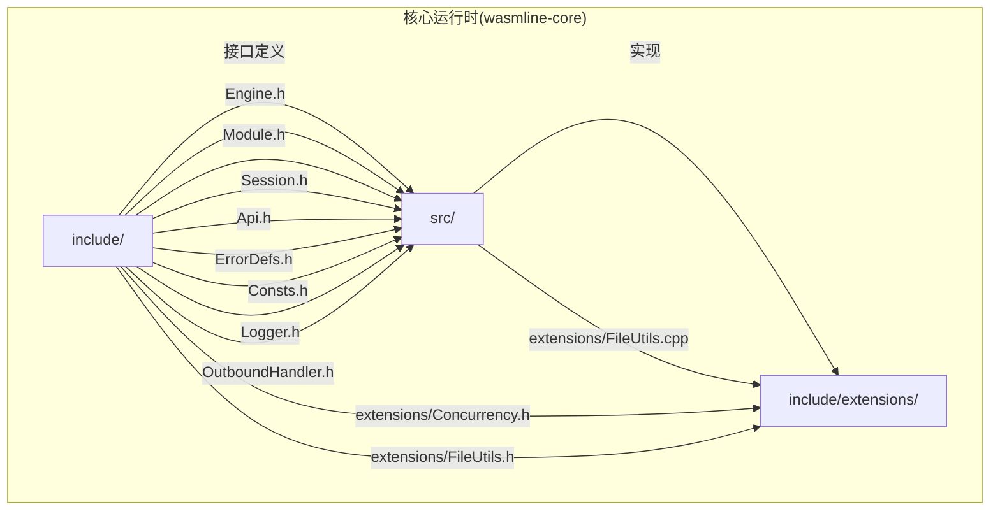
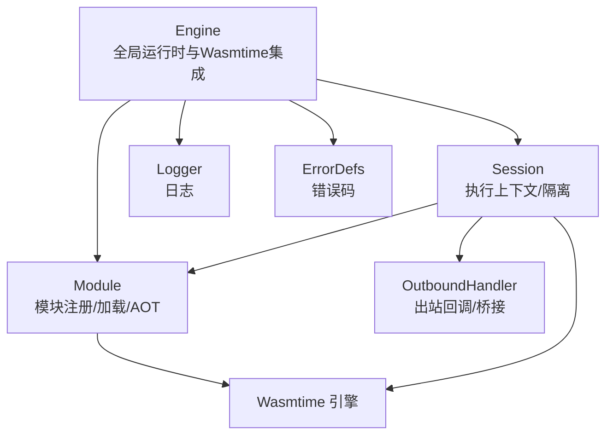
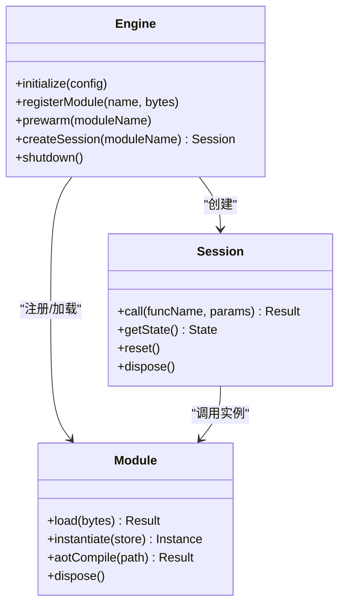
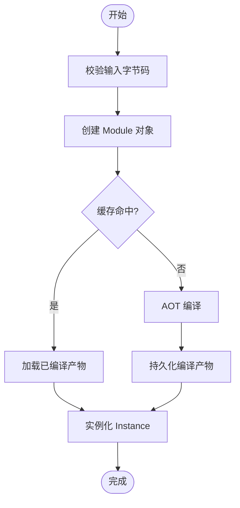
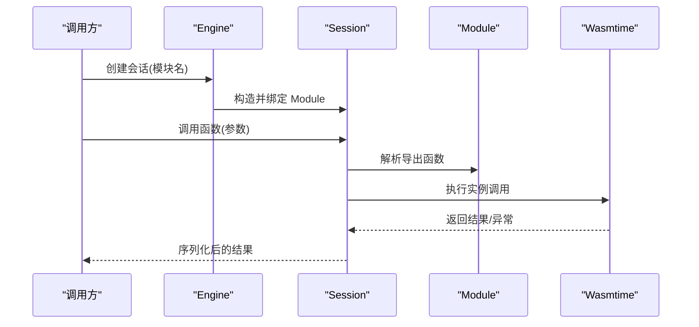
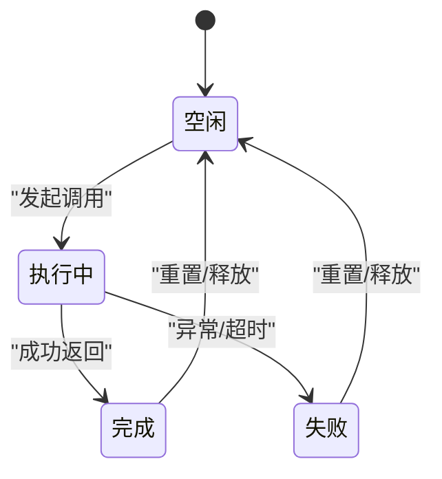

# 核心运行时架构

<cite>
**本文引用的文件**
- [Engine.h](file://wasmline-core/include/Engine.h)
- [Engine.cpp](file://wasmline-core/src/Engine.cpp)
- [Module.h](file://wasmline-core/include/Module.h)
- [Module.cpp](file://wasmline-core/src/Module.cpp)
- [Session.h](file://wasmline-core/include/Session.h)
- [Session.cpp](file://wasmline-core/src/Session.cpp)
- [Api.h](file://wasmline-core/include/Api.h)
- [Api.cpp](file://wasmline-core/src/Api.cpp)
- [ErrorDefs.h](file://wasmline-core/include/ErrorDefs.h)
- [Consts.h](file://wasmline-core/include/Consts.h)
- [Logger.h](file://wasmline-core/include/Logger.h)
- [OutboundHandler.h](file://wasmline-core/include/OutboundHandler.h)
- [Concurrency.h](file://wasmline-core/include/extensions/Concurrency.h)
- [FileUtils.h](file://wasmline-core/include/extensions/FileUtils.h)
- [FileUtils.cpp](file://wasmline-core/src/extensions/FileUtils.cpp)
</cite>

## 目录
1. [引言](#引言)
2. [项目结构](#项目结构)
3. [核心组件](#核心组件)
4. [架构总览](#架构总览)
5. [详细组件分析](#详细组件分析)
6. [依赖关系分析](#依赖关系分析)
7. [性能考虑](#性能考虑)
8. [故障排查指南](#故障排查指南)
9. [结论](#结论)
10. [附录](#附录)

## 引言
本技术文档面向系统架构师与核心开发者，围绕 Wasmline 核心运行时的 Engine（引擎）、Module（模块）与 Session（会话）三大组件，系统性阐述其设计原理、实现细节与交互关系。重点覆盖：
- Engine 生命周期管理、与 Wasmtime 引擎集成、预热机制与资源释放策略
- Module 模块加载流程、内存管理、AOT 编译支持与缓存机制
- Session 会话创建、状态管理与执行上下文隔离
- 组件间交互序列图与状态转换图
- 性能优化策略、内存泄漏防护与错误处理机制

## 项目结构
Wasmline 核心运行时位于 wasmline-core 子模块，采用 C++ 实现，提供跨平台的 Wasm 运行时能力。核心头文件位于 include 目录，对应实现位于 src 目录；extensions 提供并发与文件工具等扩展能力。

**图表来源**
- [Engine.h](file://wasmline-core/include/Engine.h)
- [Module.h](file://wasmline-core/include/Module.h)
- [Session.h](file://wasmline-core/include/Session.h)
- [Api.h](file://wasmline-core/include/Api.h)
- [Engine.cpp](file://wasmline-core/src/Engine.cpp)
- [Module.cpp](file://wasmline-core/src/Module.cpp)
- [Session.cpp](file://wasmline-core/src/Session.cpp)
- [FileUtils.h](file://wasmline-core/include/extensions/FileUtils.h)
- [FileUtils.cpp](file://wasmline-core/src/extensions/FileUtils.cpp)

**章节来源**
- [Engine.h](file://wasmline-core/include/Engine.h)
- [Module.h](file://wasmline-core/include/Module.h)
- [Session.h](file://wasmline-core/include/Session.h)
- [Api.h](file://wasmline-core/include/Api.h)

## 核心组件
本节从接口与职责角度概览三大核心组件，并指出关键实现文件位置，便于后续深入分析。

- Engine：负责全局运行时初始化、Wasmtime 集成、模块注册、预热与资源释放
- Module：封装 Wasm 模块加载、实例化、AOT 编译与缓存、内存管理
- Session：代表一次执行上下文，负责调用导出函数、参数序列化、结果反序列化与状态隔离

**章节来源**
- [Engine.h](file://wasmline-core/include/Engine.h)
- [Module.h](file://wasmline-core/include/Module.h)
- [Session.h](file://wasmline-core/include/Session.h)

## 架构总览
下图展示 Engine、Module、Session 三者在运行时中的角色与交互关系，以及与外部 Wasmtime 引擎的集成点。

**图表来源**
- [Engine.h](file://wasmline-core/include/Engine.h)
- [Module.h](file://wasmline-core/include/Module.h)
- [Session.h](file://wasmline-core/include/Session.h)
- [OutboundHandler.h](file://wasmline-core/include/OutboundHandler.h)
- [Logger.h](file://wasmline-core/include/Logger.h)
- [ErrorDefs.h](file://wasmline-core/include/ErrorDefs.h)

## 详细组件分析

### Engine 组件分析
Engine 是运行时的核心入口，负责：
- 初始化与配置 Wasmtime 引擎
- 管理模块注册与生命周期
- 支持预热机制以降低首次调用延迟
- 资源释放与清理

关键实现要点：
- 生命周期管理：构造时初始化运行时环境，析构时释放所有资源，确保无泄漏
- Wasmtime 集成：通过 EngineBuilder/Store 等接口配置链式能力（如导入模块、内存限制、时间片等）
- 预热机制：在 Engine 启动阶段加载常用模块或执行轻量初始化，减少冷启动开销
- 资源释放策略：严格遵循 RAII 原则，使用智能指针与作用域管理，避免悬挂指针与重复释放

**图表来源**
- [Engine.h](file://wasmline-core/include/Engine.h)
- [Module.h](file://wasmline-core/include/Module.h)
- [Session.h](file://wasmline-core/include/Session.h)

**章节来源**
- [Engine.h](file://wasmline-core/include/Engine.h)
- [Engine.cpp](file://wasmline-core/src/Engine.cpp)

### Module 组件分析
Module 负责模块的加载、实例化与 AOT 编译，同时提供缓存与内存管理能力：
- 加载流程：接收字节码输入，进行格式校验与兼容性检查，生成 Module 对象
- 内存管理：控制堆栈大小、页数上限与增长策略，防止 OOM
- AOT 编译支持：将编译产物持久化到磁盘，加速后续加载
- 缓存机制：基于模块指纹与版本号的缓存键，命中则直接加载编译产物

**图表来源**
- [Module.h](file://wasmline-core/include/Module.h)
- [Module.cpp](file://wasmline-core/src/Module.cpp)

**章节来源**
- [Module.h](file://wasmline-core/include/Module.h)
- [Module.cpp](file://wasmline-core/src/Module.cpp)

### Session 组件分析
Session 代表一次独立的执行上下文，具备状态管理与隔离能力：
- 会话创建：绑定到指定 Module，建立 Store/Instance 关联
- 执行上下文隔离：每个 Session 拥有独立的 Memory、Tables 与执行状态
- 参数与结果处理：通过序列化/反序列化桥接宿主与 Guest 数据
- 状态管理：记录调用历史、错误状态与性能指标，支持重置与回收

**图表来源**
- [Session.h](file://wasmline-core/include/Session.h)
- [Session.cpp](file://wasmline-core/src/Session.cpp)
- [Module.h](file://wasmline-core/include/Module.h)
- [Engine.h](file://wasmline-core/include/Engine.h)

**章节来源**
- [Session.h](file://wasmline-core/include/Session.h)
- [Session.cpp](file://wasmline-core/src/Session.cpp)

### 状态转换图
以下展示 Session 的典型状态流转：空闲 → 执行中 → 完成/失败 → 回收。

[此图为概念性状态图，无需图表来源]

## 依赖关系分析
- Engine 依赖 Module 与 Session 的生命周期管理接口，同时依赖 Logger 与 ErrorDefs 提供日志与错误码
- Module 依赖 Wasmtime 的编译与实例化能力，依赖缓存与文件系统进行 AOT 产物存储
- Session 依赖 Module 的导出函数解析与实例调用，依赖 OutboundHandler 进行宿主回调
- 并发与文件工具通过 extensions 提供线程安全与文件操作支持

```mermaid
graph LR
Engine["Engine"] --> Module["Module"]
Engine --> Session["Session"]
Engine --> Logger["Logger"]
Engine --> Err["ErrorDefs"]
Session --> Module
Session --> Outbound["OutboundHandler"]
Module --> Wasmtime["Wasmtime 引擎"]
Module --> Cache["本地缓存/文件系统"]
Ext["extensions/*"] --> Engine
Ext --> Module
Ext --> Session
```

**图表来源**
- [Engine.h](file://wasmline-core/include/Engine.h)
- [Module.h](file://wasmline-core/include/Module.h)
- [Session.h](file://wasmline-core/include/Session.h)
- [Logger.h](file://wasmline-core/include/Logger.h)
- [ErrorDefs.h](file://wasmline-core/include/ErrorDefs.h)
- [OutboundHandler.h](file://wasmline-core/include/OutboundHandler.h)
- [Concurrency.h](file://wasmline-core/include/extensions/Concurrency.h)
- [FileUtils.h](file://wasmline-core/include/extensions/FileUtils.h)

**章节来源**
- [Engine.h](file://wasmline-core/include/Engine.h)
- [Module.h](file://wasmline-core/include/Module.h)
- [Session.h](file://wasmline-core/include/Session.h)
- [Api.h](file://wasmline-core/include/Api.h)

## 性能考虑
- 预热策略：在 Engine 初始化阶段加载常用模块或执行轻量初始化，降低首次调用延迟
- AOT 编译：优先使用已编译产物，减少 JIT 编译开销；对频繁使用的模块启用持久化缓存
- 内存管理：设置合理的堆栈与页数上限，启用增量增长策略，避免 OOM；定期清理未使用的 Session
- 并发优化：利用并发工具进行多会话并行调度，但需注意共享状态的互斥与一致性
- 序列化开销：尽量复用序列化缓冲区，减少分配与拷贝；对热点数据采用更高效的编码方案

[本节为通用性能建议，不直接分析具体文件，故无“章节来源”]

## 故障排查指南
- 错误码体系：统一使用 ErrorDefs 中的错误码，便于定位问题类型（加载失败、实例化失败、调用异常等）
- 日志追踪：通过 Logger 输出关键事件（加载、实例化、调用、释放），结合时间戳与会话 ID 定位问题
- 常见问题与处理：
  - 模块加载失败：检查字节码完整性与目标平台兼容性
  - 实例化失败：核对导入项与导出项签名，确认内存与资源限制
  - 调用异常：捕获并记录异常信息，必要时回滚到上一个稳定状态
  - 资源泄漏：确保 Session 与 Module 在生命周期结束时被正确释放

**章节来源**
- [ErrorDefs.h](file://wasmline-core/include/ErrorDefs.h)
- [Logger.h](file://wasmline-core/include/Logger.h)
- [Engine.cpp](file://wasmline-core/src/Engine.cpp)
- [Module.cpp](file://wasmline-core/src/Module.cpp)
- [Session.cpp](file://wasmline-core/src/Session.cpp)

## 结论
Wasmline 核心运行时通过 Engine、Module、Session 三层架构实现了对 Wasmtime 的深度集成与高效运行。Engine 负责全局治理与预热，Module 负责模块生命周期与 AOT 缓存，Session 负责执行上下文隔离与调用编排。配合完善的错误处理与日志体系，该架构在保证稳定性的同时兼顾性能与可维护性，适合在多端与多平台场景下部署。

[本节为总结性内容，不直接分析具体文件，故无“章节来源”]

## 附录
- 接口与常量：Consts.h 提供运行时常量定义；Api.h 暴露对外 API 入口
- 扩展能力：extensions 提供并发与文件工具，支撑高并发与跨平台文件访问

**章节来源**
- [Consts.h](file://wasmline-core/include/Consts.h)
- [Api.h](file://wasmline-core/include/Api.h)
- [Concurrency.h](file://wasmline-core/include/extensions/Concurrency.h)
- [FileUtils.h](file://wasmline-core/include/extensions/FileUtils.h)
- [FileUtils.cpp](file://wasmline-core/src/extensions/FileUtils.cpp)