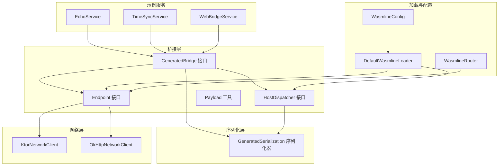
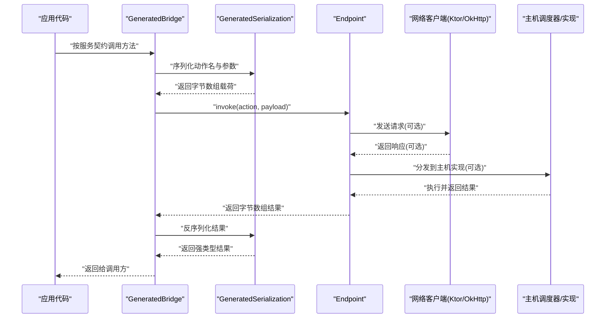
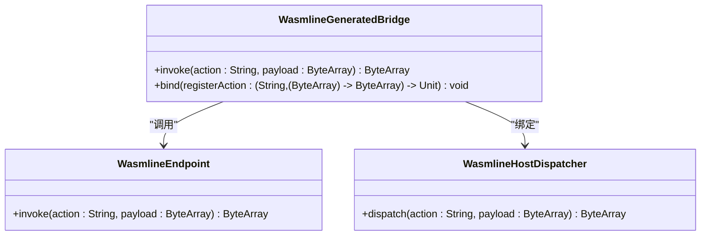
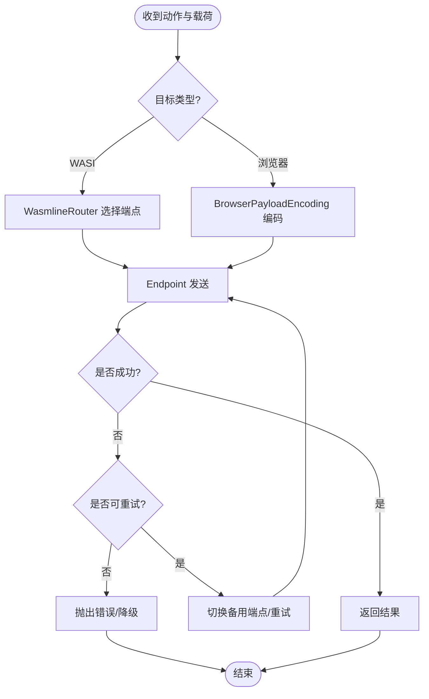
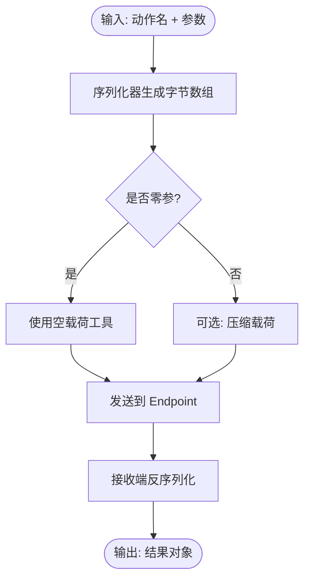
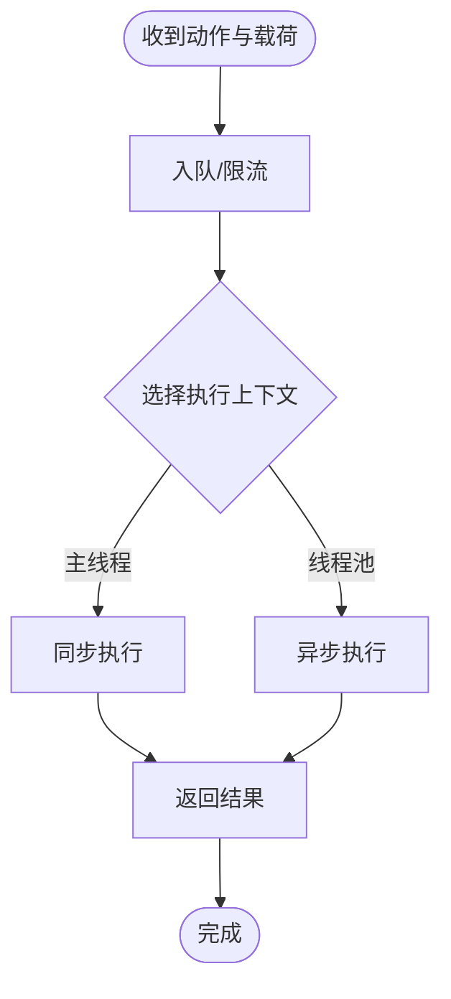
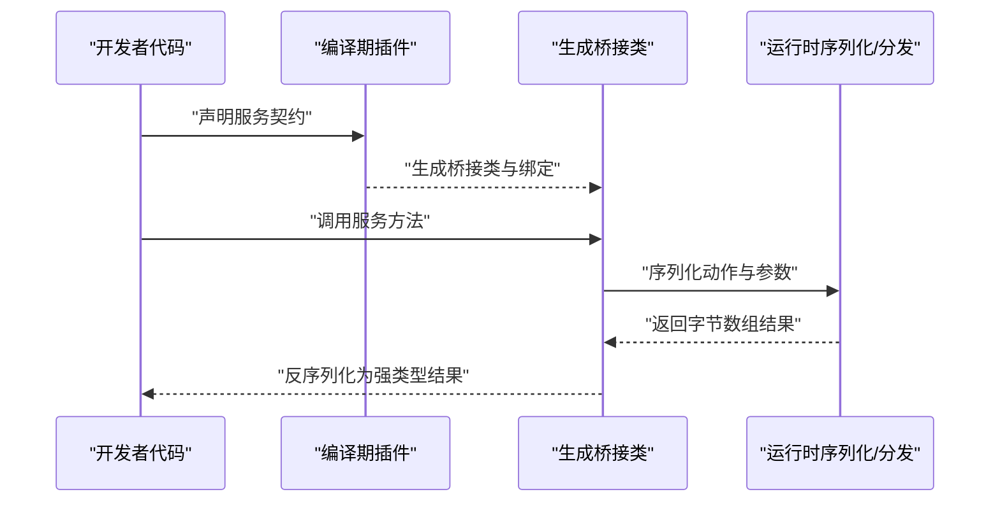
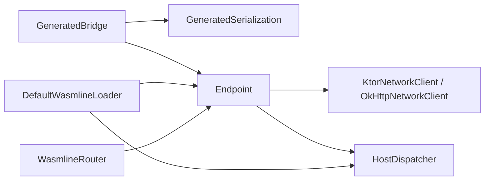

# 组件交互模式

<cite>
**本文引用的文件**
- [GeneratedBridge.kt](file://wasmline-multiplatform/wasmline/src/commonMain/kotlin/crow/wasmline/internal/bridge/GeneratedBridge.kt)
- [Endpoint.kt](file://wasmline-multiplatform/wasmline/src/commonMain/kotlin/crow/wasmline/internal/bridge/Endpoint.kt)
- [Payload.kt](file://wasmline-multiplatform/wasmline/src/commonMain/kotlin/crow/wasmline/internal/bridge/Payload.kt)
- [HostDispatcher.kt](file://wasmline-multiplatform/wasmline/src/commonMain/kotlin/crow/wasmline/internal/bridge/HostDispatcher.kt)
- [GeneratedSerialization.kt](file://wasmline-multiplatform/wasmline/src/commonMain/kotlin/crow/wasmline/internal/bridge/GeneratedSerialization.kt)
- [KtorNetworkClient.kt](file://wasmline-multiplatform/wasmline-network-ktor/src/commonMain/kotlin/crow/wasmline/network/ktor/KtorNetworkClient.kt)
- [OkHttpNetworkClient.kt](file://wasmline-multiplatform/wasmline-network-okhttp/src/commonMain/kotlin/crow/wasmline/network/okhttp/OkHttpNetworkClient.kt)
- [WasmlineBridgeGenerator.kt](file://wasmline-multiplatform/wasmline-kotlin-plugin/src/main/kotlin/crow/wasmline/kotlin/WasmlineBridgeGenerator.kt)
- [BrowserPayloadEncoding.kt](file://wasmline-multiplatform/wasmline/src/hostMain/kotlin/crow/wasmline/BrowserPayloadEncoding.kt)
- [WasmlineService.kt](file://wasmline-multiplatform/wasmline/src/commonMain/kotlin/crow/wasmline/WasmlineService.kt)
- [WasmlineConfig.kt](file://wasmline-multiplatform/wasmline/src/commonMain/kotlin/crow/wasmline/WasmlineConfig.kt)
- [WasmlineRouter.kt](file://wasmline-multiplatform/wasmline/src/wasmWasiMain/kotlin/crow/wasmline/WasmlineRouter.kt)
- [WasmError.kt](file://wasmline-multiplatform/wasmline/src/wasmWasiMain/kotlin/crow/wasmline/model/WasmError.kt)
- [DefaultWasmlineLoader.kt](file://wasmline-multiplatform/wasmline/src/hostMain/kotlin/crow/wasmline/loader/DefaultWasmlineLoader.kt)
- [WasmlineLoadRequest.kt](file://wasmline-multiplatform/wasmline/src/commonMain/kotlin/crow/wasmline/loader/WasmlineLoadRequest.kt)
- [Manifest.kt](file://wasmline-multiplatform/wasmline/src/commonMain/kotlin/crow/wasmline/loader/model/Manifest.kt)
- [EchoService.kt](file://wasmline-samples/kotlin/sample-common/src/commonMain/kotlin/crow/wasmline/sample/ir/EchoService.kt)
- [TimeSyncService.kt](file://wasmline-samples/kotlin/sample-common/src/commonMain/kotlin/crow/wasmline/sample/ir/TimeSyncService.kt)
- [WebBridgeService.kt](file://wasmline-samples/kotlin/sample-common/src/commonMain/kotlin/crow/wasmline/sample/ir/WebBridgeService.kt)
</cite>

## 目录
1. [引言](#引言)
2. [项目结构](#项目结构)
3. [核心组件](#核心组件)
4. [架构总览](#架构总览)
5. [详细组件分析](#详细组件分析)
6. [依赖关系分析](#依赖关系分析)
7. [性能考量](#性能考量)
8. [故障排查指南](#故障排查指南)
9. [结论](#结论)
10. [附录](#附录)

## 引言
本文件面向插件开发者与系统集成者，系统性阐述 Wasmline 在多平台运行时中的组件交互模式。重点覆盖以下主题：
- 生成桥接器（GeneratedBridge）的生成流程、调用约定与参数传递规则
- 端点（Endpoint）的路由机制、负载均衡与故障转移
- 载荷（Payload）的序列化格式、压缩与传输优化
- 主机调度器（HostDispatcher）的调度策略、并发控制与资源分配
- 组件间消息流向与时序图
- 错误传播、超时与重试策略
- 面向开发者的交互指南

## 项目结构
Wasmline 多平台模块围绕“桥接层”“序列化层”“网络层”“加载器层”组织，核心交互发生在桥接层与序列化层之间，并通过网络层或本地调度器完成跨边界调用。

图表来源
- [GeneratedBridge.kt:1-45](file://wasmline-multiplatform/wasmline/src/commonMain/kotlin/crow/wasmline/internal/bridge/GeneratedBridge.kt#L1-L45)
- [Endpoint.kt:1-8](file://wasmline-multiplatform/wasmline/src/commonMain/kotlin/crow/wasmline/internal/bridge/Endpoint.kt#L1-L8)
- [HostDispatcher.kt:1-9](file://wasmline-multiplatform/wasmline/src/commonMain/kotlin/crow/wasmline/internal/bridge/HostDispatcher.kt#L1-L9)
- [Payload.kt:1-9](file://wasmline-multiplatform/wasmline/src/commonMain/kotlin/crow/wasmline/internal/bridge/Payload.kt#L1-L9)
- [GeneratedSerialization.kt](file://wasmline-multiplatform/wasmline/src/commonMain/kotlin/crow/wasmline/internal/bridge/GeneratedSerialization.kt)
- [KtorNetworkClient.kt](file://wasmline-multiplatform/wasmline-network-ktor/src/commonMain/kotlin/crow/wasmline/network/ktor/KtorNetworkClient.kt)
- [OkHttpNetworkClient.kt](file://wasmline-multiplatform/wasmline-network-okhttp/src/commonMain/kotlin/crow/wasmline/network/okhttp/OkHttpNetworkClient.kt)
- [DefaultWasmlineLoader.kt](file://wasmline-multiplatform/wasmline/src/hostMain/kotlin/crow/wasmline/loader/DefaultWasmlineLoader.kt)
- [WasmlineConfig.kt](file://wasmline-multiplatform/wasmline/src/commonMain/kotlin/crow/wasmline/WasmlineConfig.kt)
- [WasmlineRouter.kt](file://wasmline-multiplatform/wasmline/src/wasmWasiMain/kotlin/crow/wasmline/WasmlineRouter.kt)
- [EchoService.kt](file://wasmline-samples/kotlin/sample-common/src/commonMain/kotlin/crow/wasmline/sample/ir/EchoService.kt)
- [TimeSyncService.kt](file://wasmline-samples/kotlin/sample-common/src/commonMain/kotlin/crow/wasmline/sample/ir/TimeSyncService.kt)
- [WebBridgeService.kt](file://wasmline-samples/kotlin/sample-common/src/commonMain/kotlin/crow/wasmline/sample/ir/WebBridgeService.kt)

章节来源
- [GeneratedBridge.kt:1-45](file://wasmline-multiplatform/wasmline/src/commonMain/kotlin/crow/wasmline/internal/bridge/GeneratedBridge.kt#L1-L45)
- [Endpoint.kt:1-8](file://wasmline-multiplatform/wasmline/src/commonMain/kotlin/crow/wasmline/internal/bridge/Endpoint.kt#L1-L8)
- [HostDispatcher.kt:1-9](file://wasmline-multiplatform/wasmline/src/commonMain/kotlin/crow/wasmline/internal/bridge/HostDispatcher.kt#L1-L9)
- [Payload.kt:1-9](file://wasmline-multiplatform/wasmline/src/commonMain/kotlin/crow/wasmline/internal/bridge/Payload.kt#L1-L9)
- [GeneratedSerialization.kt](file://wasmline-multiplatform/wasmline/src/commonMain/kotlin/crow/wasmline/internal/bridge/GeneratedSerialization.kt)
- [KtorNetworkClient.kt](file://wasmline-multiplatform/wasmline-network-ktor/src/commonMain/kotlin/crow/wasmline/network/ktor/KtorNetworkClient.kt)
- [OkHttpNetworkClient.kt](file://wasmline-multiplatform/wasmline-network-okhttp/src/commonMain/kotlin/crow/wasmline/network/okhttp/OkHttpNetworkClient.kt)
- [DefaultWasmlineLoader.kt](file://wasmline-multiplatform/wasmline/src/hostMain/kotlin/crow/wasmline/loader/DefaultWasmlineLoader.kt)
- [WasmlineConfig.kt](file://wasmline-multiplatform/wasmline/src/commonMain/kotlin/crow/wasmline/WasmlineConfig.kt)
- [WasmlineRouter.kt](file://wasmline-multiplatform/wasmline/src/wasmWasiMain/kotlin/crow/wasmline/WasmlineRouter.kt)
- [EchoService.kt](file://wasmline-samples/kotlin/sample-common/src/commonMain/kotlin/crow/wasmline/sample/ir/EchoService.kt)
- [TimeSyncService.kt](file://wasmline-samples/kotlin/sample-common/src/commonMain/kotlin/crow/wasmline/sample/ir/TimeSyncService.kt)
- [WebBridgeService.kt](file://wasmline-samples/kotlin/sample-common/src/commonMain/kotlin/crow/wasmline/sample/ir/WebBridgeService.kt)

## 核心组件
- 生成桥接器（GeneratedBridge）
  - 由编译期插件生成，每个服务契约对应一个桥接实例，兼具“代理调用”和“动作分发”的双重职责。
  - 提供统一的调用约定：以字符串动作名与字节数组载荷进行跨边界调用。
- 端点（Endpoint）
  - 低层传输端点接口，负责将动作与载荷转发到具体实现或网络出口。
- 主机调度器（HostDispatcher）
  - 主机侧动作分发器，接收动作与载荷并返回结果。
- 载荷工具（Payload）
  - 提供零参调用的空载荷构造等辅助能力。
- 序列化器（GeneratedSerialization）
  - 为桥接层提供统一的序列化/反序列化支持，确保跨语言与跨平台的数据一致性。
- 网络客户端（KtorNetworkClient / OkHttpNetworkClient）
  - 提供可替换的网络传输实现，支持不同宿主环境下的请求发送与响应处理。
- 加载器与路由器（DefaultWasmlineLoader / WasmlineRouter）
  - 负责加载与绑定服务契约、选择目标端点与路由策略。

章节来源
- [GeneratedBridge.kt:5-17](file://wasmline-multiplatform/wasmline/src/commonMain/kotlin/crow/wasmline/internal/bridge/GeneratedBridge.kt#L5-L17)
- [Endpoint.kt:3-7](file://wasmline-multiplatform/wasmline/src/commonMain/kotlin/crow/wasmline/internal/bridge/Endpoint.kt#L3-L7)
- [HostDispatcher.kt:5-7](file://wasmline-multiplatform/wasmline/src/commonMain/kotlin/crow/wasmline/internal/bridge/HostDispatcher.kt#L5-L7)
- [Payload.kt:5-8](file://wasmline-multiplatform/wasmline/src/commonMain/kotlin/crow/wasmline/internal/bridge/Payload.kt#L5-L8)
- [GeneratedSerialization.kt](file://wasmline-multiplatform/wasmline/src/commonMain/kotlin/crow/wasmline/internal/bridge/GeneratedSerialization.kt)
- [KtorNetworkClient.kt](file://wasmline-multiplatform/wasmline-network-ktor/src/commonMain/kotlin/crow/wasmline/network/ktor/KtorNetworkClient.kt)
- [OkHttpNetworkClient.kt](file://wasmline-multiplatform/wasmline-network-okhttp/src/commonMain/kotlin/crow/wasmline/network/okhttp/OkHttpNetworkClient.kt)
- [DefaultWasmlineLoader.kt](file://wasmline-multiplatform/wasmline/src/hostMain/kotlin/crow/wasmline/loader/DefaultWasmlineLoader.kt)
- [WasmlineRouter.kt](file://wasmline-multiplatform/wasmline/src/wasmWasiMain/kotlin/crow/wasmline/WasmlineRouter.kt)

## 架构总览
下图展示了从应用侧发起一次服务调用到结果返回的关键路径，包括编译期桥接生成、运行时序列化、端点路由与网络传输。

图表来源
- [GeneratedBridge.kt:12-17](file://wasmline-multiplatform/wasmline/src/commonMain/kotlin/crow/wasmline/internal/bridge/GeneratedBridge.kt#L12-L17)
- [Endpoint.kt:5-7](file://wasmline-multiplatform/wasmline/src/commonMain/kotlin/crow/wasmline/internal/bridge/Endpoint.kt#L5-L7)
- [GeneratedSerialization.kt](file://wasmline-multiplatform/wasmline/src/commonMain/kotlin/crow/wasmline/internal/bridge/GeneratedSerialization.kt)
- [KtorNetworkClient.kt](file://wasmline-multiplatform/wasmline-network-ktor/src/commonMain/kotlin/crow/wasmline/network/ktor/KtorNetworkClient.kt)
- [OkHttpNetworkClient.kt](file://wasmline-multiplatform/wasmline-network-okhttp/src/commonMain/kotlin/crow/wasmline/network/okhttp/OkHttpNetworkClient.kt)
- [HostDispatcher.kt:5-7](file://wasmline-multiplatform/wasmline/src/commonMain/kotlin/crow/wasmline/internal/bridge/HostDispatcher.kt#L5-L7)

## 详细组件分析

### 生成桥接器（GeneratedBridge）与调用约定
- 生成桥接器接口定义了两类核心能力：
  - 调用入口：以动作名与字节数组载荷作为输入，返回字节数组结果。
  - 绑定入口：注册动作到实现的映射，使桥接器在主机侧可被正确分发。
- 运行时保护：
  - 未链接端点时的快速失败，避免静默错误。
  - 未知动作的快速失败，便于定位契约不匹配问题。
  - 未绑定实现的快速失败，确保编译期插件正确注入绑定逻辑。

图表来源
- [GeneratedBridge.kt:12-17](file://wasmline-multiplatform/wasmline/src/commonMain/kotlin/crow/wasmline/internal/bridge/GeneratedBridge.kt#L12-L17)
- [Endpoint.kt:5-7](file://wasmline-multiplatform/wasmline/src/commonMain/kotlin/crow/wasmline/internal/bridge/Endpoint.kt#L5-L7)
- [HostDispatcher.kt:5-7](file://wasmline-multiplatform/wasmline/src/commonMain/kotlin/crow/wasmline/internal/bridge/HostDispatcher.kt#L5-L7)

章节来源
- [GeneratedBridge.kt:5-43](file://wasmline-multiplatform/wasmline/src/commonMain/kotlin/crow/wasmline/internal/bridge/GeneratedBridge.kt#L5-L43)
- [Endpoint.kt:3-7](file://wasmline-multiplatform/wasmline/src/commonMain/kotlin/crow/wasmline/internal/bridge/Endpoint.kt#L3-L7)
- [HostDispatcher.kt:5-7](file://wasmline-multiplatform/wasmline/src/commonMain/kotlin/crow/wasmline/internal/bridge/HostDispatcher.kt#L5-L7)

### 端点（Endpoint）路由机制、负载均衡与故障转移
- 路由机制
  - Endpoint 作为统一入口，将动作与载荷转发至网络客户端或主机调度器。
  - 在 WASI 环境中，可通过路由器选择目标端点；在浏览器环境中，可通过编码适配器处理载荷。
- 负载均衡策略
  - 可通过扩展 Endpoint 实现多后端轮询、权重选择等策略（建议在自定义实现中引入）。
- 故障转移处理
  - 建议在 Endpoint 包装器中实现重试与降级逻辑，例如切换备用端点或返回缓存结果。

图表来源
- [Endpoint.kt:5-7](file://wasmline-multiplatform/wasmline/src/commonMain/kotlin/crow/wasmline/internal/bridge/Endpoint.kt#L5-L7)
- [WasmlineRouter.kt](file://wasmline-multiplatform/wasmline/src/wasmWasiMain/kotlin/crow/wasmline/WasmlineRouter.kt)
- [BrowserPayloadEncoding.kt](file://wasmline-multiplatform/wasmline/src/hostMain/kotlin/crow/wasmline/BrowserPayloadEncoding.kt)

章节来源
- [Endpoint.kt:3-7](file://wasmline-multiplatform/wasmline/src/commonMain/kotlin/crow/wasmline/internal/bridge/Endpoint.kt#L3-L7)
- [WasmlineRouter.kt](file://wasmline-multiplatform/wasmline/src/wasmWasiMain/kotlin/crow/wasmline/WasmlineRouter.kt)
- [BrowserPayloadEncoding.kt](file://wasmline-multiplatform/wasmline/src/hostMain/kotlin/crow/wasmline/BrowserPayloadEncoding.kt)

### 载荷（Payload）序列化、压缩与传输优化
- 序列化格式
  - 生成桥接器通过序列化器对动作名与参数进行统一序列化，返回字节数组作为载荷。
  - 零参调用使用空载荷工具构造，减少不必要的内存分配。
- 压缩与传输优化
  - 可在 Endpoint 层引入压缩策略（如 Gzip/LZ4），并在网络客户端中启用合适的传输头与缓冲区大小。
  - 对高频小数据包可采用批量合并策略，降低网络开销。

图表来源
- [GeneratedSerialization.kt](file://wasmline-multiplatform/wasmline/src/commonMain/kotlin/crow/wasmline/internal/bridge/GeneratedSerialization.kt)
- [Payload.kt:5-8](file://wasmline-multiplatform/wasmline/src/commonMain/kotlin/crow/wasmline/internal/bridge/Payload.kt#L5-L8)

章节来源
- [GeneratedSerialization.kt](file://wasmline-multiplatform/wasmline/src/commonMain/kotlin/crow/wasmline/internal/bridge/GeneratedSerialization.kt)
- [Payload.kt:5-8](file://wasmline-multiplatform/wasmline/src/commonMain/kotlin/crow/wasmline/internal/bridge/Payload.kt#L5-L8)

### 主机调度器（HostDispatcher）调度策略、并发控制与资源分配
- 调度策略
  - HostDispatcher 将动作与载荷分发到主机侧实现，适合在单线程事件循环或受限线程池中执行。
- 并发控制
  - 建议在调度器中引入队列与优先级策略，避免阻塞关键路径。
- 资源分配
  - 为不同类型动作设置资源配额（CPU/内存/IO），防止资源饥饿。

图表来源
- [HostDispatcher.kt:5-7](file://wasmline-multiplatform/wasmline/src/commonMain/kotlin/crow/wasmline/internal/bridge/HostDispatcher.kt#L5-L7)

章节来源
- [HostDispatcher.kt:5-7](file://wasmline-multiplatform/wasmline/src/commonMain/kotlin/crow/wasmline/internal/bridge/HostDispatcher.kt#L5-L7)

### 编译期桥接生成与调用链
- 生成流程
  - 编译期插件扫描服务契约，生成桥接类并内联绑定逻辑，确保调用在编译期确定。
- 调用约定
  - 所有跨边界调用均以动作名与字节数组载荷为统一接口，简化运行时分发。
- 参数传递规则
  - 参数经序列化器转换为字节数组，返回值同样以字节数组形式回传，再由序列化器反序列化为强类型对象。

图表来源
- [WasmlineBridgeGenerator.kt](file://wasmline-multiplatform/wasmline-kotlin-plugin/src/main/kotlin/crow/wasmline/kotlin/WasmlineBridgeGenerator.kt)
- [GeneratedBridge.kt:12-17](file://wasmline-multiplatform/wasmline/src/commonMain/kotlin/crow/wasmline/internal/bridge/GeneratedBridge.kt#L12-L17)
- [GeneratedSerialization.kt](file://wasmline-multiplatform/wasmline/src/commonMain/kotlin/crow/wasmline/internal/bridge/GeneratedSerialization.kt)

章节来源
- [WasmlineBridgeGenerator.kt](file://wasmline-multiplatform/wasmline-kotlin-plugin/src/main/kotlin/crow/wasmline/kotlin/WasmlineBridgeGenerator.kt)
- [GeneratedBridge.kt:5-17](file://wasmline-multiplatform/wasmline/src/commonMain/kotlin/crow/wasmline/internal/bridge/GeneratedBridge.kt#L5-L17)
- [GeneratedSerialization.kt](file://wasmline-multiplatform/wasmline/src/commonMain/kotlin/crow/wasmline/internal/bridge/GeneratedSerialization.kt)

### 示例服务与典型交互
- EchoService：回显服务，演示最小化调用往返。
- TimeSyncService：时间同步服务，展示跨边界时间戳交换。
- WebBridgeService：Web 环境桥接服务，体现浏览器端适配。

章节来源
- [EchoService.kt](file://wasmline-samples/kotlin/sample-common/src/commonMain/kotlin/crow/wasmline/sample/ir/EchoService.kt)
- [TimeSyncService.kt](file://wasmline-samples/kotlin/sample-common/src/commonMain/kotlin/crow/wasmline/sample/ir/TimeSyncService.kt)
- [WebBridgeService.kt](file://wasmline-samples/kotlin/sample-common/src/commonMain/kotlin/crow/wasmline/sample/ir/WebBridgeService.kt)

## 依赖关系分析
- 模块耦合
  - 生成桥接器依赖序列化器与端点；端点可依赖网络客户端或主机调度器。
  - 加载器与路由器为上层提供契约解析与端点选择能力。
- 外部依赖
  - 网络层通过 Ktor 或 OkHttp 提供可替换实现，便于在不同宿主环境部署。
- 循环依赖
  - 当前设计通过接口解耦，未见循环依赖迹象。

图表来源
- [GeneratedBridge.kt:12-17](file://wasmline-multiplatform/wasmline/src/commonMain/kotlin/crow/wasmline/internal/bridge/GeneratedBridge.kt#L12-L17)
- [Endpoint.kt:5-7](file://wasmline-multiplatform/wasmline/src/commonMain/kotlin/crow/wasmline/internal/bridge/Endpoint.kt#L5-L7)
- [HostDispatcher.kt:5-7](file://wasmline-multiplatform/wasmline/src/commonMain/kotlin/crow/wasmline/internal/bridge/HostDispatcher.kt#L5-L7)
- [KtorNetworkClient.kt](file://wasmline-multiplatform/wasmline-network-ktor/src/commonMain/kotlin/crow/wasmline/network/ktor/KtorNetworkClient.kt)
- [OkHttpNetworkClient.kt](file://wasmline-multiplatform/wasmline-network-okhttp/src/commonMain/kotlin/crow/wasmline/network/okhttp/OkHttpNetworkClient.kt)
- [DefaultWasmlineLoader.kt](file://wasmline-multiplatform/wasmline/src/hostMain/kotlin/crow/wasmline/loader/DefaultWasmlineLoader.kt)
- [WasmlineRouter.kt](file://wasmline-multiplatform/wasmline/src/wasmWasiMain/kotlin/crow/wasmline/WasmlineRouter.kt)

章节来源
- [GeneratedBridge.kt:12-17](file://wasmline-multiplatform/wasmline/src/commonMain/kotlin/crow/wasmline/internal/bridge/GeneratedBridge.kt#L12-L17)
- [Endpoint.kt:5-7](file://wasmline-multiplatform/wasmline/src/commonMain/kotlin/crow/wasmline/internal/bridge/Endpoint.kt#L5-L7)
- [HostDispatcher.kt:5-7](file://wasmline-multiplatform/wasmline/src/commonMain/kotlin/crow/wasmline/internal/bridge/HostDispatcher.kt#L5-L7)
- [KtorNetworkClient.kt](file://wasmline-multiplatform/wasmline-network-ktor/src/commonMain/kotlin/crow/wasmline/network/ktor/KtorNetworkClient.kt)
- [OkHttpNetworkClient.kt](file://wasmline-multiplatform/wasmline-network-okhttp/src/commonMain/kotlin/crow/wasmline/network/okhttp/OkHttpNetworkClient.kt)
- [DefaultWasmlineLoader.kt](file://wasmline-multiplatform/wasmline/src/hostMain/kotlin/crow/wasmline/loader/DefaultWasmlineLoader.kt)
- [WasmlineRouter.kt](file://wasmline-multiplatform/wasmline/src/wasmWasiMain/kotlin/crow/wasmline/WasmlineRouter.kt)

## 性能考量
- 序列化成本
  - 使用高效的二进制序列化器，避免频繁装箱与反射。
- 载荷大小
  - 合理使用空载荷与压缩策略，减少网络带宽与延迟。
- 并发与调度
  - 在 HostDispatcher 中限制并发度，避免线程争用；对长耗时操作使用异步执行。
- 缓存与预热
  - 对热点服务进行预热与缓存，降低首帧延迟。

## 故障排查指南
- 常见错误与定位
  - 未链接端点：检查编译期插件是否正确替换 link()/bind() 调用。
  - 未知动作：核对服务契约与动作名是否一致。
  - 未绑定实现：确认编译期插件已注入绑定逻辑。
- 错误传播与重试
  - 在 Endpoint 层包装异常，区分可重试与不可重试错误。
  - 对网络错误实施指数退避重试，避免雪崩效应。
- 超时处理
  - 为网络请求设置合理超时阈值，并在超时后触发降级或回退策略。

章节来源
- [GeneratedBridge.kt:19-43](file://wasmline-multiplatform/wasmline/src/commonMain/kotlin/crow/wasmline/internal/bridge/GeneratedBridge.kt#L19-L43)
- [WasmError.kt](file://wasmline-multiplatform/wasmline/src/wasmWasiMain/kotlin/crow/wasmline/model/WasmError.kt)

## 结论
Wasmline 通过“编译期桥接 + 运行时序列化 + 可插拔网络/调度”的架构，在多平台环境下实现了稳定、可扩展的服务交互模式。开发者只需关注服务契约与实现，其余细节由桥接器与序列化器自动处理。通过合理的路由、重试与资源控制策略，可在复杂生产环境中获得可靠的性能与可用性。

## 附录
- 关键配置与加载
  - 配置项与加载流程可参考加载器与配置文件，确保端点与序列化器正确初始化。
- 示例工程
  - 参考示例服务了解典型用法与最佳实践。

章节来源
- [DefaultWasmlineLoader.kt](file://wasmline-multiplatform/wasmline/src/hostMain/kotlin/crow/wasmline/loader/DefaultWasmlineLoader.kt)
- [WasmlineConfig.kt](file://wasmline-multiplatform/wasmline/src/commonMain/kotlin/crow/wasmline/WasmlineConfig.kt)
- [EchoService.kt](file://wasmline-samples/kotlin/sample-common/src/commonMain/kotlin/crow/wasmline/sample/ir/EchoService.kt)
- [TimeSyncService.kt](file://wasmline-samples/kotlin/sample-common/src/commonMain/kotlin/crow/wasmline/sample/ir/TimeSyncService.kt)
- [WebBridgeService.kt](file://wasmline-samples/kotlin/sample-common/src/commonMain/kotlin/crow/wasmline/sample/ir/WebBridgeService.kt)