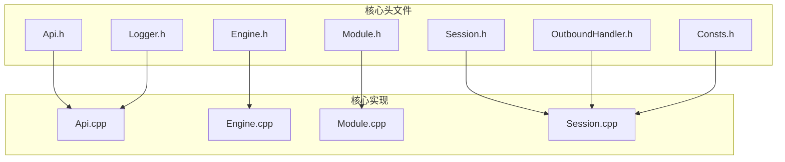
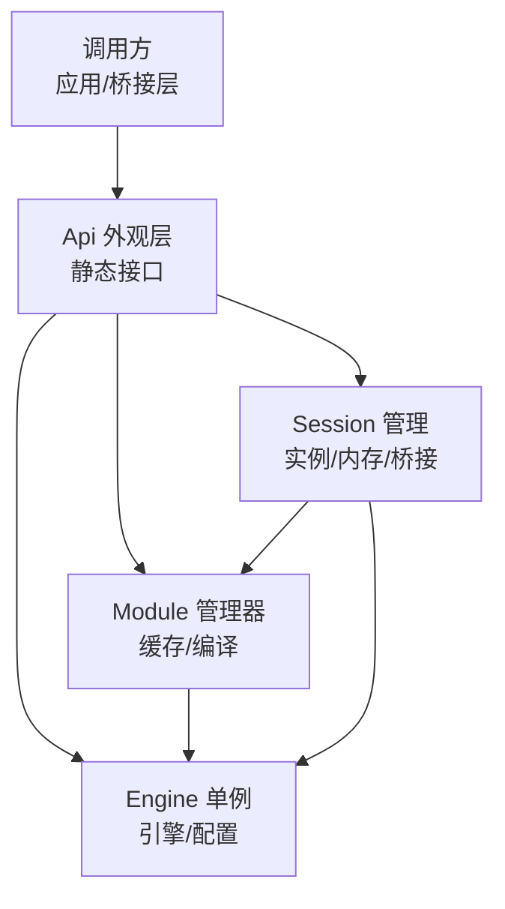
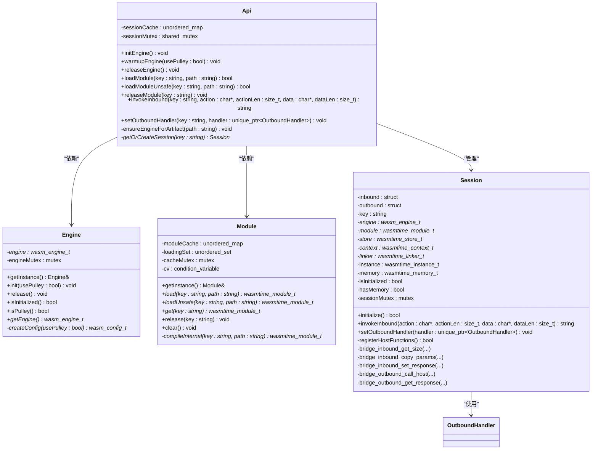
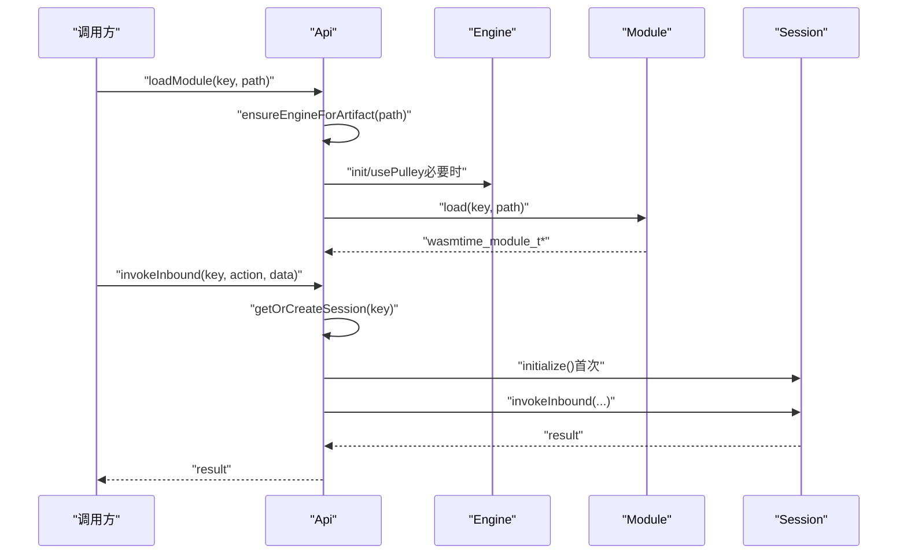
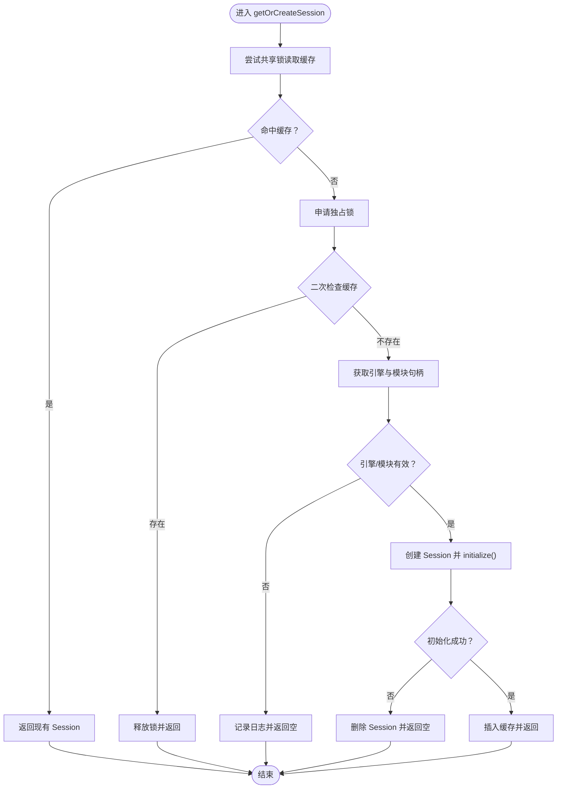
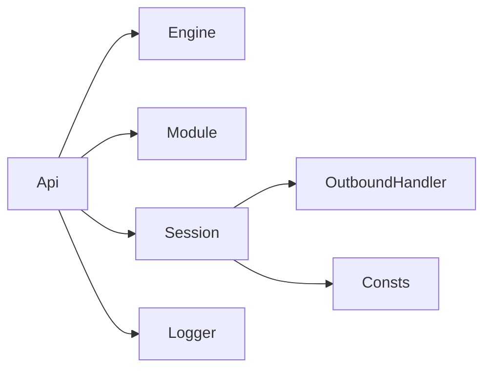

# API 外观层

<cite>
**本文引用的文件**
- [Api.h](file://wasmline-core/include/Api.h)
- [Api.cpp](file://wasmline-core/src/Api.cpp)
- [Engine.h](file://wasmline-core/include/Engine.h)
- [Module.h](file://wasmline-core/include/Module.h)
- [Session.h](file://wasmline-core/include/Session.h)
- [OutboundHandler.h](file://wasmline-core/include/OutboundHandler.h)
- [Logger.h](file://wasmline-core/include/Logger.h)
- [Consts.h](file://wasmline-core/include/Consts.h)
</cite>

## 目录
1. [引言](#引言)
2. [项目结构](#项目结构)
3. [核心组件](#核心组件)
4. [架构总览](#架构总览)
5. [详细组件分析](#详细组件分析)
6. [依赖关系分析](#依赖关系分析)
7. [性能考量](#性能考量)
8. [故障排查指南](#故障排查指南)
9. [结论](#结论)
10. [附录：使用示例与最佳实践](#附录使用示例与最佳实践)

## 引言
本文件面向 Wasmline API 外观层（Api 类）的技术文档，系统阐述其设计目标、架构原理与实现细节。Api 作为统一外观层，负责协调 Engine、Module、Session 等核心组件，向上提供模块加载、会话创建、函数调用等统一接口；向下封装引擎初始化、模块编译/缓存、实例化与内存管理等复杂流程。文档同时覆盖线程安全与并发控制、错误传播与异常处理策略、扩展点与自定义选项、多平台集成适配以及性能优化建议。

## 项目结构
围绕 API 外观层的关键文件组织如下：
- 头文件层：Api.h、Engine.h、Module.h、Session.h、OutboundHandler.h、Logger.h、Consts.h
- 实现层：Api.cpp（外观层逻辑）、Engine.cpp（引擎单例与配置）、Module.cpp（模块缓存与编译）、Session.cpp（实例化与桥接）

图表来源
- [Api.h:1-83](file://wasmline-core/include/Api.h#L1-L83)
- [Api.cpp:1-186](file://wasmline-core/src/Api.cpp#L1-L186)
- [Engine.h:1-73](file://wasmline-core/include/Engine.h#L1-L73)
- [Module.h:1-101](file://wasmline-core/include/Module.h#L1-L101)
- [Session.h:1-80](file://wasmline-core/include/Session.h#L1-L80)
- [OutboundHandler.h:1-24](file://wasmline-core/include/OutboundHandler.h#L1-L24)
- [Logger.h:1-39](file://wasmline-core/include/Logger.h#L1-L39)
- [Consts.h:1-14](file://wasmline-core/include/Consts.h#L1-L14)

章节来源
- [Api.h:1-83](file://wasmline-core/include/Api.h#L1-L83)
- [Api.cpp:1-186](file://wasmline-core/src/Api.cpp#L1-L186)

## 核心组件
- Api 外观层：提供静态接口，负责引擎预热/释放、模块加载/释放、会话生命周期管理与入站调用分发。
- Engine 引擎：Wasmtime 引擎单例，负责配置、初始化、释放与模式切换（Pulley/cwasm/pwasm）。
- Module 模块：模块缓存与编译器，支持 .wasm/.cwasm/.pwasm，提供线程安全加载与无锁快速加载路径。
- Session 会话：单实例执行环境，负责链接器、WASI、内存映射、主机函数注册与入/出站桥接。
- OutboundHandler 出站处理器：抽象的主机侧回调接口，供 Wasm 调用宿主能力。
- Logger 日志：条件编译的日志宏，按构建配置启用或裁剪。
- Consts 常量：导出入口常量名（如初始化与入口导出符号）。

章节来源
- [Api.h:20-82](file://wasmline-core/include/Api.h#L20-L82)
- [Engine.h:15-72](file://wasmline-core/include/Engine.h#L15-L72)
- [Module.h:20-100](file://wasmline-core/include/Module.h#L20-L100)
- [Session.h:19-79](file://wasmline-core/include/Session.h#L19-L79)
- [OutboundHandler.h:6-23](file://wasmline-core/include/OutboundHandler.h#L6-L23)
- [Logger.h:15-39](file://wasmline-core/include/Logger.h#L15-L39)
- [Consts.h:11-14](file://wasmline-core/include/Consts.h#L11-L14)

## 架构总览
Api 外观层以“单例引擎 + 模块缓存 + 会话池”的方式组织运行时资源，形成清晰的职责边界与稳定的生命周期管理。

图表来源
- [Api.h:21-82](file://wasmline-core/include/Api.h#L21-L82)
- [Api.cpp:41-185](file://wasmline-core/src/Api.cpp#L41-L185)
- [Engine.h:16-72](file://wasmline-core/include/Engine.h#L16-L72)
- [Module.h:21-100](file://wasmline-core/include/Module.h#L21-L100)
- [Session.h:19-79](file://wasmline-core/include/Session.h#L19-L79)

## 详细组件分析

### Api 外观层类图

图表来源
- [Api.h:21-82](file://wasmline-core/include/Api.h#L21-L82)
- [Api.cpp:37-185](file://wasmline-core/src/Api.cpp#L37-L185)
- [Engine.h:16-72](file://wasmline-core/include/Engine.h#L16-L72)
- [Module.h:21-100](file://wasmline-core/include/Module.h#L21-L100)
- [Session.h:19-79](file://wasmline-core/include/Session.h#L19-L79)
- [OutboundHandler.h:6-23](file://wasmline-core/include/OutboundHandler.h#L6-L23)

章节来源
- [Api.h:21-82](file://wasmline-core/include/Api.h#L21-L82)
- [Api.cpp:37-185](file://wasmline-core/src/Api.cpp#L37-L185)
- [Engine.h:16-72](file://wasmline-core/include/Engine.h#L16-L72)
- [Module.h:21-100](file://wasmline-core/include/Module.h#L21-L100)
- [Session.h:19-79](file://wasmline-core/include/Session.h#L19-L79)
- [OutboundHandler.h:6-23](file://wasmline-core/include/OutboundHandler.h#L6-L23)

### 统一接口与工作流
- 初始化与预热
  - 初始化全局引擎：确保引擎可用，支持 Pulley 模式选择。
  - 预热引擎：在已知后端类型下提前初始化，避免后续切换导致的重建成本。
- 模块加载
  - 线程安全加载：根据文件后缀推断目标后端，必要时重置引擎，再从文件系统加载并缓存。
  - 非线程安全加载：仅在单线程或确定无并发场景使用，消除锁开销。
- 会话管理
  - 获取或创建会话：采用读写共享锁的双检缓存策略，保证高并发下的低延迟与一致性。
  - 会话初始化：完成链接器、WASI、实例与内存的准备，注册主机函数桥接。
- 入站调用
  - 将动作名与二进制载荷传递给会话，由会话内部桥接至 Wasm，并返回结果。
- 出站回调
  - 注册 OutboundHandler，使 Wasm 可通过桥接调用宿主能力并获得响应。
- 资源释放
  - 释放模块：移除关联会话并从缓存中清理模块。
  - 释放引擎：先销毁所有会话与模块，再释放引擎。

图表来源
- [Api.cpp:75-146](file://wasmline-core/src/Api.cpp#L75-L146)
- [Module.h:45-59](file://wasmline-core/include/Module.h#L45-L59)
- [Session.h:26-33](file://wasmline-core/include/Session.h#L26-L33)

章节来源
- [Api.cpp:75-146](file://wasmline-core/src/Api.cpp#L75-L146)

### 线程安全与并发控制
- 会话缓存
  - 使用 shared_mutex 提供读多写少的高效并发：读路径仅持共享锁，写路径持独占锁并做双重检查，减少竞争。
- 模块管理
  - 使用 std::mutex 保护模块缓存与加载集合，配合条件变量协调并发加载，避免重复编译与竞态。
- 引擎生命周期
  - 使用互斥锁保护引擎初始化/释放阶段，防止并发状态不一致。
- 会话内部
  - 使用互斥锁保护会话内部状态与桥接调用，确保初始化与调用的原子性。

图表来源
- [Api.cpp:148-185](file://wasmline-core/src/Api.cpp#L148-L185)
- [Session.h:26-27](file://wasmline-core/include/Session.h#L26-L27)

章节来源
- [Api.cpp:148-185](file://wasmline-core/src/Api.cpp#L148-L185)
- [Module.h:93-99](file://wasmline-core/include/Module.h#L93-L99)
- [Engine.h:70-71](file://wasmline-core/include/Engine.h#L70-L71)
- [Session.h](file://wasmline-core/include/Session.h#L64)

### 错误传播与异常处理策略
- 日志策略
  - 条件编译：可通过宏禁用日志或在发布构建中裁剪，避免运行时开销。
  - 关键失败点均输出错误日志，便于定位初始化、会话创建与引擎切换问题。
- 失败返回
  - 加载/初始化失败返回空指针或空字符串，调用方可据此判断并采取降级策略。
- 引擎切换
  - 当检测到后端不匹配时，自动释放旧引擎并重新初始化，避免跨后端混用导致的崩溃。
- 会话隔离
  - 单个会话失败不影响其他会话；释放模块时同步清理对应会话，避免悬挂引用。

章节来源
- [Logger.h:15-39](file://wasmline-core/include/Logger.h#L15-L39)
- [Api.cpp:107-113](file://wasmline-core/src/Api.cpp#L107-L113)
- [Api.cpp:138-145](file://wasmline-core/src/Api.cpp#L138-L145)
- [Api.cpp:167-181](file://wasmline-core/src/Api.cpp#L167-L181)

### 扩展点与自定义选项
- 出站回调
  - 通过 OutboundHandler 抽象注入宿主侧能力，Session 仅依赖该接口，不绑定具体桥接实现。
- 后端选择
  - 依据文件后缀自动选择 Pulley 或传统后端；也可通过预热接口强制指定后端类型。
- 导出符号
  - 通过常量定义导出入口名称，便于 Wasm 端约定初始化与入口函数。

章节来源
- [OutboundHandler.h:6-23](file://wasmline-core/include/OutboundHandler.h#L6-L23)
- [Api.cpp:87-114](file://wasmline-core/src/Api.cpp#L87-L114)
- [Consts.h:11-14](file://wasmline-core/include/Consts.h#L11-L14)

### 与多平台实际实现的集成与适配
- 引擎初始化
  - 在各平台初始化时调用 Api::initEngine 或 Api::warmupEngine，确保引擎可用且后端匹配。
- 模块加载
  - 通过 loadModule/loadModuleUnsafe 加载本地模块，注意在多线程环境下优先使用线程安全版本。
- 会话调用
  - 使用 invokeInbound 发起入站调用；若需要宿主侧能力，通过 setOutboundHandler 注入处理器。
- 资源回收
  - 应用退出或不再使用时调用 releaseEngine 与 releaseModule，确保资源释放顺序正确。

章节来源
- [Api.h:26-65](file://wasmline-core/include/Api.h#L26-L65)
- [Api.cpp:41-114](file://wasmline-core/src/Api.cpp#L41-L114)

## 依赖关系分析
- Api 对 Engine/Module 的依赖是直接且稳定的，前者负责生命周期与后端选择，后者负责模块缓存与编译。
- Session 依赖 Engine/Module 以完成实例化与内存管理，同时通过 OutboundHandler 与宿主交互。
- Logger 为条件编译模块，不影响核心逻辑，但对调试与诊断至关重要。

图表来源
- [Api.h:18-18](file://wasmline-core/include/Api.h#L18-L18)
- [Api.cpp:10-14](file://wasmline-core/src/Api.cpp#L10-L14)
- [Session.h:14-16](file://wasmline-core/include/Session.h#L14-L16)
- [Logger.h:25-31](file://wasmline-core/include/Logger.h#L25-L31)
- [Consts.h:11-14](file://wasmline-core/include/Consts.h#L11-L14)

章节来源
- [Api.cpp:10-14](file://wasmline-core/src/Api.cpp#L10-L14)
- [Session.h:14-16](file://wasmline-core/include/Session.h#L14-L16)

## 性能考量
- 会话缓存
  - 采用共享锁 + 双检策略，降低锁竞争；命中率高时几乎无锁开销。
- 模块加载
  - 缓存避免重复 IO 与反序列化；加载集合与条件变量减少重复编译。
- 引擎切换
  - 检测到后端不匹配时才触发释放与重建，避免频繁切换。
- 日志
  - 条件编译可完全移除日志，生产环境建议关闭以减少开销。

章节来源
- [Api.cpp:148-185](file://wasmline-core/src/Api.cpp#L148-L185)
- [Module.h:33-59](file://wasmline-core/include/Module.h#L33-L59)
- [Logger.h:15-39](file://wasmline-core/include/Logger.h#L15-L39)

## 故障排查指南
- 无法创建会话
  - 检查引擎是否初始化、模块是否加载成功；查看日志中的初始化失败信息。
- 调用返回空
  - 确认 action 名称与数据长度参数正确；确认 Session 已完成初始化。
- 后端不匹配
  - 确认模块文件后缀与期望后端一致；必要时调用预热接口或重新加载。
- 资源泄漏
  - 确保在合适时机调用 releaseModule 与 releaseEngine；避免重复释放。

章节来源
- [Api.cpp:138-145](file://wasmline-core/src/Api.cpp#L138-L145)
- [Api.cpp:167-181](file://wasmline-core/src/Api.cpp#L167-L181)
- [Api.cpp:107-113](file://wasmline-core/src/Api.cpp#L107-L113)
- [Logger.h:15-39](file://wasmline-core/include/Logger.h#L15-L39)

## 结论
Api 外观层通过清晰的职责划分与稳健的并发控制，为上层提供了简洁、可靠且高性能的统一接口。它在保证线程安全的同时，兼顾了模块加载与会话管理的效率，并通过条件编译与可插拔的出站处理器实现了良好的可维护性与可扩展性。结合多平台初始化与资源回收策略，开发者可以稳定地在不同环境中部署与运行 Wasmline。

## 附录：使用示例与最佳实践
- 初始化与预热
  - 在应用启动时调用初始化或预热接口，确保引擎可用且后端匹配。
- 模块加载
  - 使用线程安全加载接口；在多线程环境下避免直接使用非线程安全路径。
- 会话调用
  - 先确保模块加载成功，再发起入站调用；必要时注册出站处理器。
- 资源回收
  - 在应用退出或不再使用时，按顺序释放模块与引擎，避免悬挂资源。
- 最佳实践
  - 将模块键与路径管理规范化，避免重复加载；
  - 在生产环境关闭日志宏以减少开销；
  - 对于高频调用，复用会话并保持模块缓存稳定。

章节来源
- [Api.h:26-65](file://wasmline-core/include/Api.h#L26-L65)
- [Api.cpp:41-114](file://wasmline-core/src/Api.cpp#L41-L114)
- [Logger.h:15-39](file://wasmline-core/include/Logger.h#L15-L39)