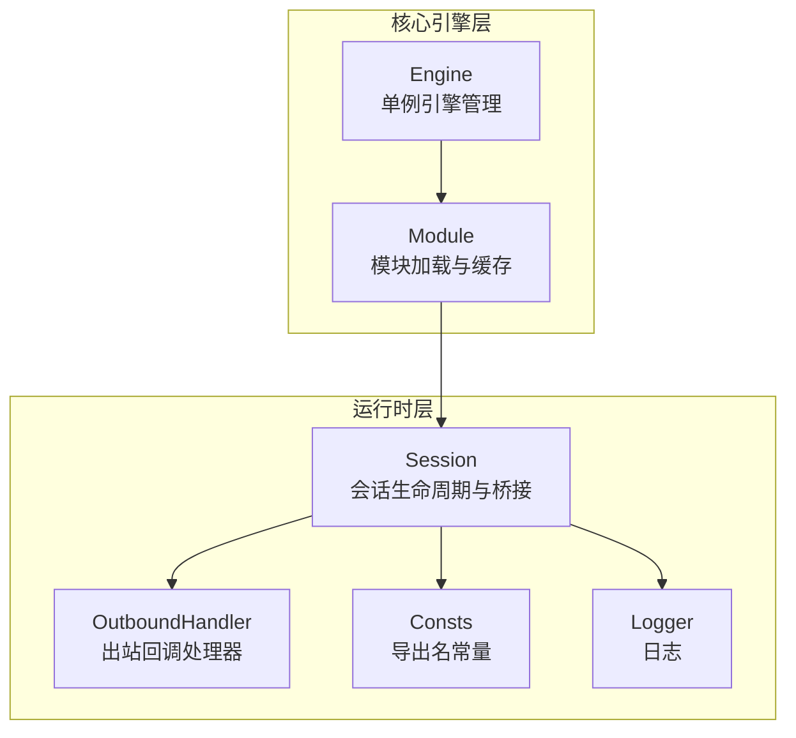
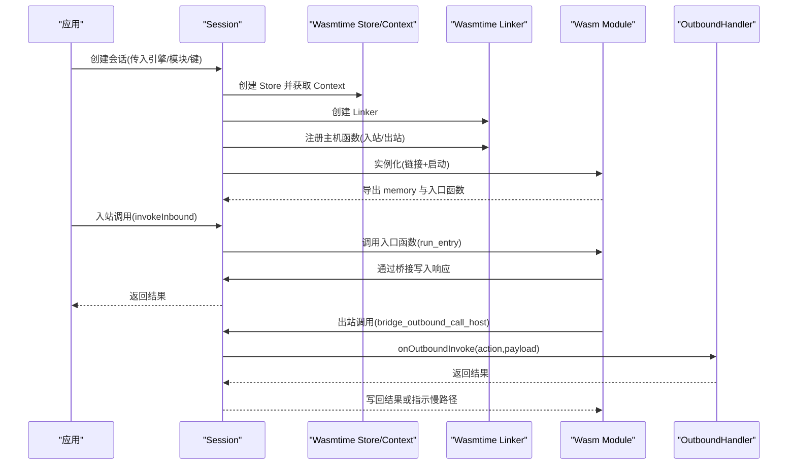
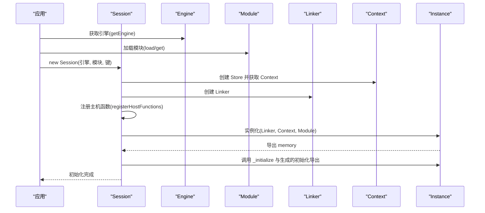
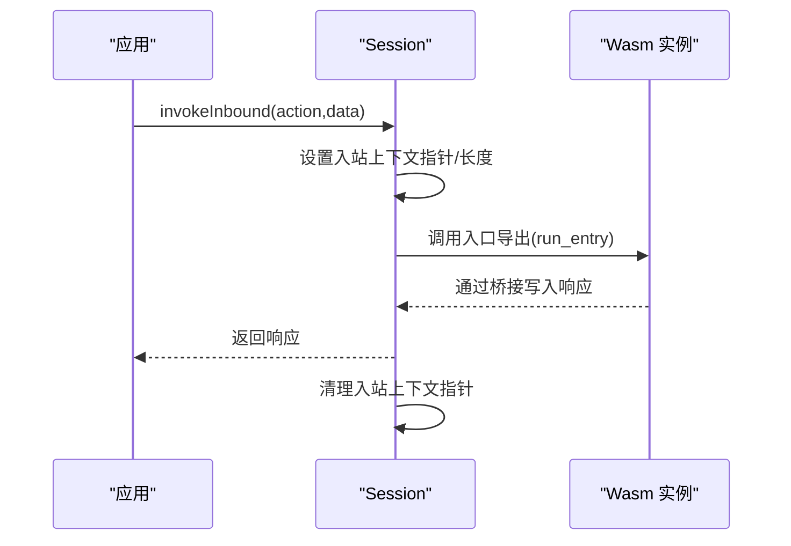
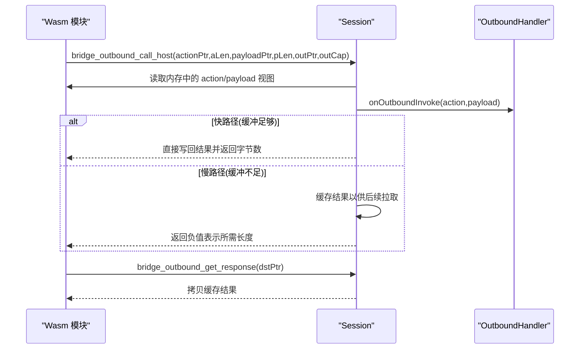
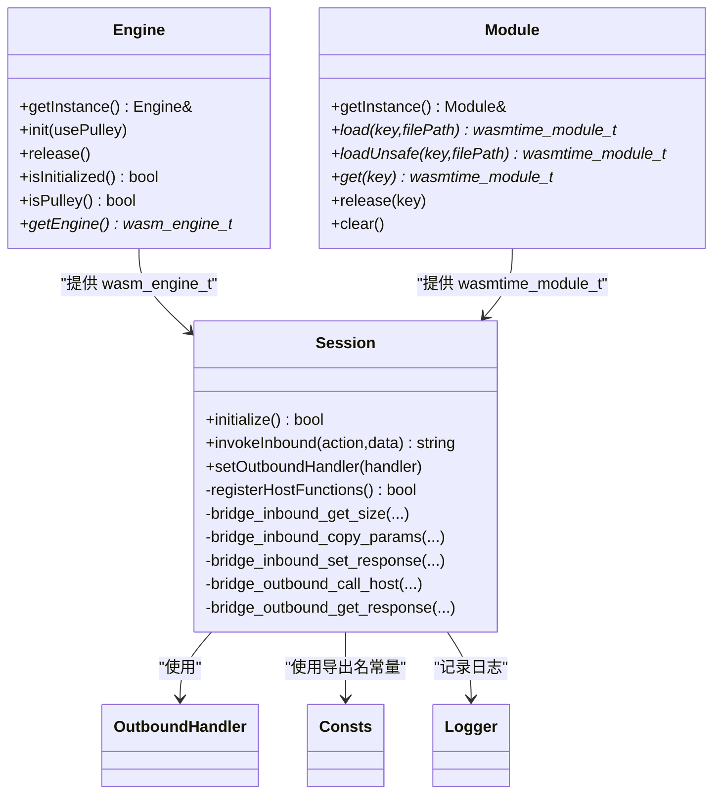

# 会话管理

<cite>
**本文引用的文件**
- [Session.h](file://wasmline-core/include/Session.h)
- [Session.cpp](file://wasmline-core/src/Session.cpp)
- [Engine.h](file://wasmline-core/include/Engine.h)
- [Engine.cpp](file://wasmline-core/src/Engine.cpp)
- [Module.h](file://wasmline-core/include/Module.h)
- [Module.cpp](file://wasmline-core/src/Module.cpp)
- [OutboundHandler.h](file://wasmline-core/include/OutboundHandler.h)
- [Api.h](file://wasmline-core/include/Api.h)
- [Api.cpp](file://wasmline-core/src/Api.cpp)
- [Logger.h](file://wasmline-core/include/Logger.h)
- [Consts.h](file://wasmline-core/include/Consts.h)
</cite>

## 目录
1. [引言](#引言)
2. [项目结构](#项目结构)
3. [核心组件](#核心组件)
4. [架构总览](#架构总览)
5. [组件详解](#组件详解)
6. [依赖关系分析](#依赖关系分析)
7. [性能考量](#性能考量)
8. [故障排查指南](#故障排查指南)
9. [结论](#结论)
10. [附录：代码示例路径](#附录代码示例路径)

## 引言
本文件面向开发者，系统化阐述 Wasmline 会话管理系统中 Session 类的设计与实现，覆盖执行上下文创建与管理、内存隔离机制、状态与生命周期控制、会话创建流程（Store 初始化、内存分配、函数导出）、执行模型（同步与异步调用）、会话间隔离与资源共享策略、暂停/恢复/销毁流程，并给出与 Wasmtime Store 集成的要点与性能优化建议，以及调试与监控方法。

## 项目结构
本节聚焦与“会话管理”直接相关的模块与文件组织，便于快速定位实现位置与职责边界。

图示来源
- [Engine.h:16-72](file://wasmline-core/include/Engine.h#L16-L72)
- [Engine.cpp:14-137](file://wasmline-core/src/Engine.cpp#L14-L137)
- [Module.h:21-100](file://wasmline-core/include/Module.h#L21-L100)
- [Module.cpp:16-192](file://wasmline-core/src/Module.cpp#L16-L192)
- [Session.h:19-79](file://wasmline-core/include/Session.h#L19-L79)
- [Session.cpp:17-575](file://wasmline-core/src/Session.cpp#L17-L575)
- [OutboundHandler.h](file://wasmline-core/include/OutboundHandler.h)
- [Consts.h](file://wasmline-core/include/Consts.h)
- [Logger.h](file://wasmline-core/include/Logger.h)

章节来源
- [Engine.h:1-73](file://wasmline-core/include/Engine.h#L1-L73)
- [Engine.cpp:1-138](file://wasmline-core/src/Engine.cpp#L1-L138)
- [Module.h:1-101](file://wasmline-core/include/Module.h#L1-L101)
- [Module.cpp:1-193](file://wasmline-core/src/Module.cpp#L1-L193)
- [Session.h:1-80](file://wasmline-core/include/Session.h#L1-L80)
- [Session.cpp:1-576](file://wasmline-core/src/Session.cpp#L1-L576)
- [OutboundHandler.h](file://wasmline-core/include/OutboundHandler.h)
- [Consts.h](file://wasmline-core/include/Consts.h)
- [Logger.h](file://wasmline-core/include/Logger.h)

## 核心组件
- Engine 单例：负责创建与配置 Wasmtime 引擎，提供线程安全的初始化/释放与目标平台设置（含 Pulley）。
- Module 单例：负责模块加载（原生 wasm 或预编译 cwasm/pwasm），带锁合并与条件变量协调的线程安全缓存。
- Session：封装一次 Wasm 实例的完整生命周期，包含 WASI 配置、主机函数注册、实例化、内存导出、初始化钩子调用、入站/出站桥接等。
- OutboundHandler：抽象出站回调处理器，供 Wasm 调用宿主能力时使用。
- 常量与日志：导出名常量与统一日志输出，支撑跨模块协作。

章节来源
- [Engine.h:16-72](file://wasmline-core/include/Engine.h#L16-L72)
- [Engine.cpp:14-137](file://wasmline-core/src/Engine.cpp#L14-L137)
- [Module.h:21-100](file://wasmline-core/include/Module.h#L21-L100)
- [Module.cpp:16-192](file://wasmline-core/src/Module.cpp#L16-L192)
- [Session.h:19-79](file://wasmline-core/include/Session.h#L19-L79)
- [Session.cpp:17-575](file://wasmline-core/src/Session.cpp#L17-L575)
- [OutboundHandler.h](file://wasmline-core/include/OutboundHandler.h)
- [Consts.h](file://wasmline-core/include/Consts.h)
- [Logger.h](file://wasmline-core/include/Logger.h)

## 架构总览
下图展示从应用侧到 Wasmtime 的关键交互路径，以及会话在其中的角色。

图示来源
- [Session.cpp:99-242](file://wasmline-core/src/Session.cpp#L99-L242)
- [Session.cpp:272-332](file://wasmline-core/src/Session.cpp#L272-L332)
- [Session.cpp:503-551](file://wasmline-core/src/Session.cpp#L503-L551)
- [Module.cpp:98-141](file://wasmline-core/src/Module.cpp#L98-L141)
- [Engine.cpp:94-109](file://wasmline-core/src/Engine.cpp#L94-L109)

## 组件详解

### Session 设计理念与生命周期
- 执行上下文创建与管理
  - 在构造阶段创建 Store 与 Context，并将自身作为用户数据绑定到 Store，以便回调中检索 Session 实例。
  - Linker 在同一阶段创建，用于后续注册主机函数。
- 内存隔离机制
  - 通过导出 Wasm 线性内存句柄，实现 C++ 与 Wasm 的直接内存访问；所有读写均基于已导出的 memory 句柄与指针偏移。
  - 入站/出站桥接函数严格校验长度与内存可用性，避免越界。
- 状态管理与生命周期控制
  - 初始化状态 isInitialized 仅在首次成功初始化后置位，保证幂等。
  - 析构阶段释放 Linker 与 Store，确保资源回收。
- 会话创建流程
  - WASI 配置：启用标准库、重定向 stdout/stderr 到自定义日志器。
  - 主机函数注册：一次性注册入站与出站桥接函数，签名固定且参数少，采用栈上数组减少堆分配。
  - 模块实例化：链接模块、分配内存、运行启动函数；随后尝试调用生成的初始化导出以触发用户主逻辑。
  - 内存导出：导出名为 “memory” 的线性内存，供桥接函数使用。
- 执行模型
  - 同步调用：入站调用 invokeInbound 通过入口导出函数阻塞式执行，返回结果。
  - 异步调用：出站调用 bridge_outbound_call_host 在同步回调内执行宿主业务逻辑，支持快/慢路径返回。
- 会话间隔离与资源共享
  - Store/Context/Linker/Instance 等对象按会话独立持有，彼此隔离。
  - 共享资源：Engine 由全局单例持有；Module 通过缓存复用，避免重复编译。
- 暂停/恢复/销毁
  - 当前实现未提供显式的暂停/恢复语义；销毁通过析构完成资源回收。
- 与 Wasmtime Store 集成与性能优化
  - 使用静态主机回调配合固定签名，减少动态分派开销。
  - 锁粒度：对关键路径加互斥锁，保证初始化与状态变更的原子性。
  - 内存拷贝优化：入站/出站桥接尽量使用零拷贝视图与就地写入，必要时移动字符串避免重复拷贝。

章节来源
- [Session.h:20-79](file://wasmline-core/include/Session.h#L20-L79)
- [Session.cpp:47-83](file://wasmline-core/src/Session.cpp#L47-L83)
- [Session.cpp:99-242](file://wasmline-core/src/Session.cpp#L99-L242)
- [Session.cpp:272-332](file://wasmline-core/src/Session.cpp#L272-L332)
- [Session.cpp:344-399](file://wasmline-core/src/Session.cpp#L344-L399)
- [Session.cpp:419-485](file://wasmline-core/src/Session.cpp#L419-L485)
- [Session.cpp:503-575](file://wasmline-core/src/Session.cpp#L503-L575)

### 会话创建与初始化序列

图示来源
- [Session.cpp:47-70](file://wasmline-core/src/Session.cpp#L47-L70)
- [Session.cpp:99-242](file://wasmline-core/src/Session.cpp#L99-L242)
- [Engine.cpp:132-136](file://wasmline-core/src/Engine.cpp#L132-L136)
- [Module.cpp:98-141](file://wasmline-core/src/Module.cpp#L98-L141)

### 入站调用（Host -> Wasm）

图示来源
- [Session.cpp:272-332](file://wasmline-core/src/Session.cpp#L272-L332)
- [Session.cpp:419-485](file://wasmline-core/src/Session.cpp#L419-L485)

### 出站调用（Wasm -> Host）

图示来源
- [Session.cpp:503-575](file://wasmline-core/src/Session.cpp#L503-L575)
- [OutboundHandler.h](file://wasmline-core/include/OutboundHandler.h)

### 内存隔离与安全校验
- 入站复制：根据类型选择 action 或 data，限制最大长度，使用线性内存原始指针进行拷贝。
- 出站复制：先尝试快路径直接写回，若容量不足则缓存结果，等待 Wasm 拉取。
- 内存可用性检查：所有桥接函数在无内存导出时返回陷阱，防止空指针访问。

章节来源
- [Session.cpp:439-485](file://wasmline-core/src/Session.cpp#L439-L485)
- [Session.cpp:503-575](file://wasmline-core/src/Session.cpp#L503-L575)

### 与 Engine/Module 的协作
- Engine 提供全局单例引擎与配置（含 Pulley 目标设置、信号陷阱禁用、内存保护页等）。
- Module 提供线程安全的模块加载与缓存，支持原生 wasm 与预编译产物，内部采用锁合并与条件变量降低竞争。

章节来源
- [Engine.h:16-72](file://wasmline-core/include/Engine.h#L16-L72)
- [Engine.cpp:14-137](file://wasmline-core/src/Engine.cpp#L14-L137)
- [Module.h:21-100](file://wasmline-core/include/Module.h#L21-L100)
- [Module.cpp:16-192](file://wasmline-core/src/Module.cpp#L16-L192)

## 依赖关系分析

图示来源
- [Engine.h:16-72](file://wasmline-core/include/Engine.h#L16-L72)
- [Module.h:21-100](file://wasmline-core/include/Module.h#L21-L100)
- [Session.h:19-79](file://wasmline-core/include/Session.h#L19-L79)
- [OutboundHandler.h](file://wasmline-core/include/OutboundHandler.h)
- [Consts.h](file://wasmline-core/include/Consts.h)
- [Logger.h](file://wasmline-core/include/Logger.h)

章节来源
- [Engine.h:1-73](file://wasmline-core/include/Engine.h#L1-L73)
- [Module.h:1-101](file://wasmline-core/include/Module.h#L1-L101)
- [Session.h:1-80](file://wasmline-core/include/Session.h#L1-L80)

## 性能考量
- 回调注册优化
  - 使用栈上数组与固定小参数签名，避免堆分配与动态类型构造，提升注册效率。
- 内存访问优化
  - 入站/出站桥接直接使用线性内存指针，减少中间缓冲；必要时移动字符串避免拷贝。
  - 出站快/慢路径设计，优先零拷贝写回，仅在容量不足时缓存。
- 初始化与并发
  - Session 初始化加锁并幂等，避免重复工作。
  - Module 使用锁合并与条件变量，避免重复编译与 IO，显著降低高并发下的竞争。
- 引擎配置
  - 禁用信号陷阱以适配 Android 运行时；内存保护页设为 0 降低虚拟内存占用；GC/异常/引用类型开启以兼容 Kotlin/Wasm；SIMD 可按需关闭以提升兼容性。

章节来源
- [Session.cpp:344-399](file://wasmline-core/src/Session.cpp#L344-L399)
- [Session.cpp:503-575](file://wasmline-core/src/Session.cpp#L503-L575)
- [Module.cpp:98-141](file://wasmline-core/src/Module.cpp#L98-L141)
- [Engine.cpp:58-91](file://wasmline-core/src/Engine.cpp#L58-L91)

## 故障排查指南
- 初始化失败
  - 检查 Engine 是否已初始化；确认模块加载成功；查看 WASI 定义与设置错误信息。
- 实例化错误/陷阱
  - 关注链接阶段的错误与陷阱消息；确认模块导出的入口函数存在且签名正确。
- 内存导出失败
  - 若未导出 “memory”，入站/出站桥接将无法工作；检查模块是否为 Reactor 模型且导出 memory。
- 日志定位
  - 使用统一日志接口输出关键步骤与错误信息，便于定位问题。
- 资源泄漏
  - 确保 Session 析构被调用；Module 的 release/clear 用于主动释放缓存模块。

章节来源
- [Session.cpp:118-149](file://wasmline-core/src/Session.cpp#L118-L149)
- [Session.cpp:165-183](file://wasmline-core/src/Session.cpp#L165-L183)
- [Session.cpp:190-198](file://wasmline-core/src/Session.cpp#L190-L198)
- [Module.cpp:84-95](file://wasmline-core/src/Module.cpp#L84-L95)
- [Logger.h](file://wasmline-core/include/Logger.h)

## 结论
Session 将 Wasmtime 的 Store/Context/Liner 与模块生命周期整合为可复用的执行环境，通过严格的内存隔离与桥接设计，实现了稳定的入站/出站通信模型。结合 Engine 的平台优化与 Module 的高效缓存，整体具备良好的性能与可维护性。当前实现侧重同步调用与明确的生命周期管理，未来可在现有基础上扩展暂停/恢复与更细粒度的资源共享策略。

## 附录：代码示例路径
以下为常用操作的实现参考路径（不直接展示代码内容）：
- 创建引擎与初始化
  - [Engine::init:94-109](file://wasmline-core/src/Engine.cpp#L94-L109)
  - [Engine::getEngine:132-136](file://wasmline-core/src/Engine.cpp#L132-L136)
- 加载模块与缓存
  - [Module::load:98-141](file://wasmline-core/src/Module.cpp#L98-L141)
  - [Module::loadUnsafe:144-162](file://wasmline-core/src/Module.cpp#L144-L162)
  - [Module::get/release/clear:166-191](file://wasmline-core/src/Module.cpp#L166-L191)
- 创建会话与初始化
  - [Session 构造与 Store/Context/Linker 初始化:47-70](file://wasmline-core/src/Session.cpp#L47-L70)
  - [Session::initialize:99-242](file://wasmline-core/src/Session.cpp#L99-L242)
- 入站调用
  - [Session::invokeInbound:272-332](file://wasmline-core/src/Session.cpp#L272-L332)
  - [入站桥接函数集:419-485](file://wasmline-core/src/Session.cpp#L419-L485)
- 出站调用
  - [Session::setOutboundHandler:253-256](file://wasmline-core/src/Session.cpp#L253-L256)
  - [出站桥接函数集:503-575](file://wasmline-core/src/Session.cpp#L503-L575)
- 导出名常量
  - [Consts.h 中导出名常量](file://wasmline-core/include/Consts.h)
- API 接口
  - [Api.h](file://wasmline-core/include/Api.h)
  - [Api.cpp](file://wasmline-core/src/Api.cpp)