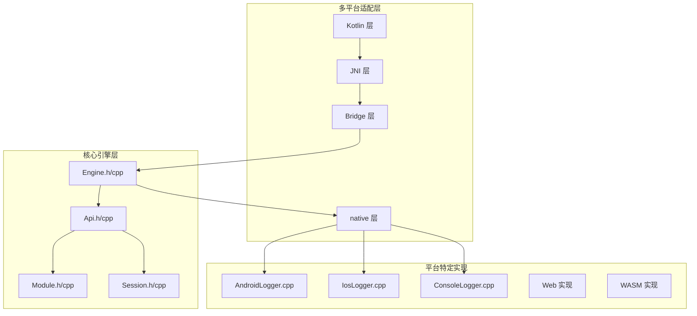
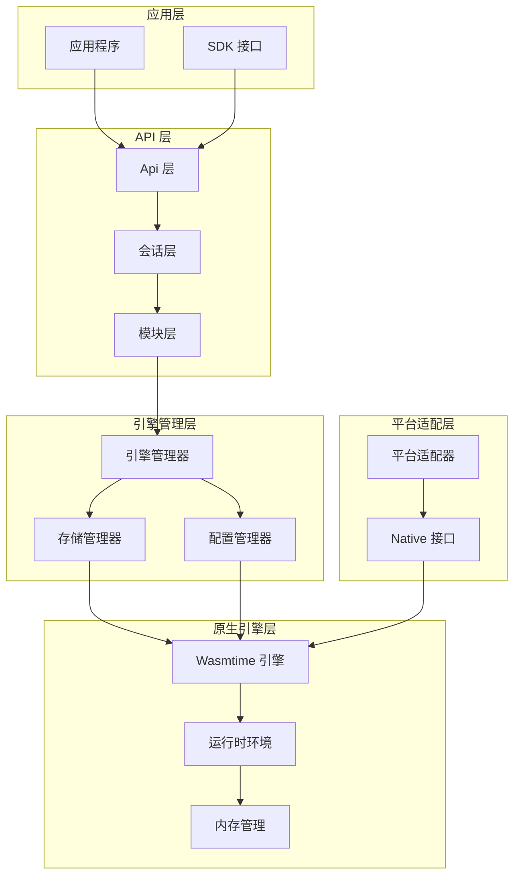
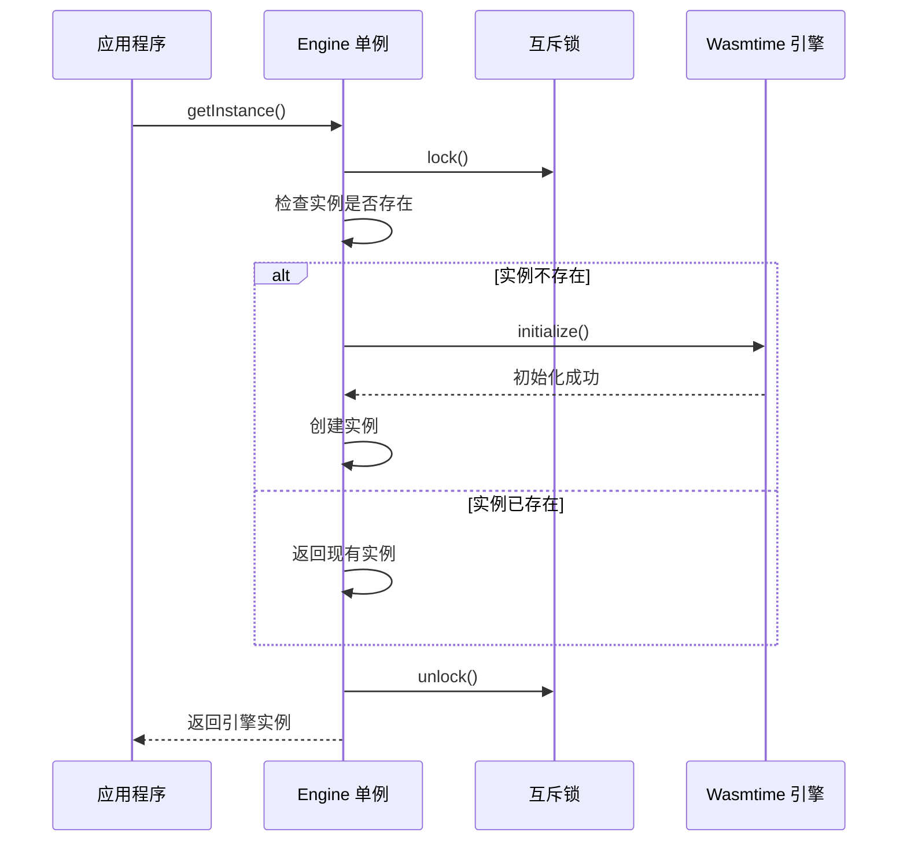
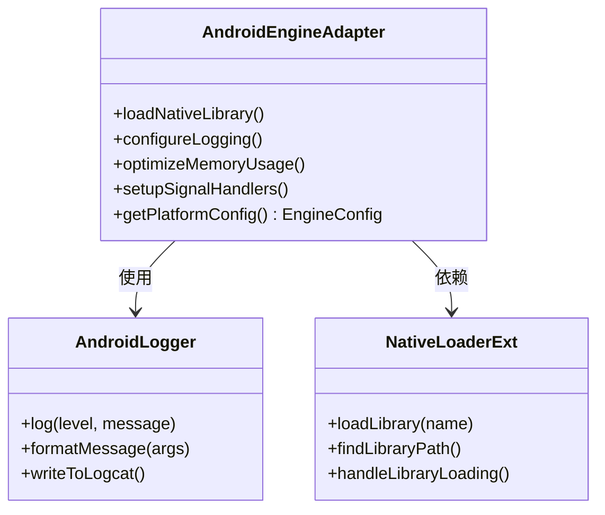
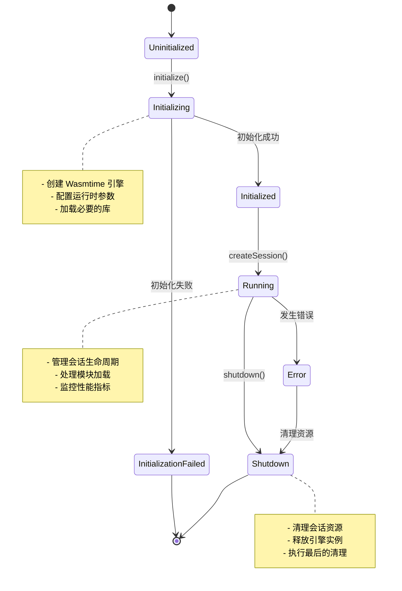
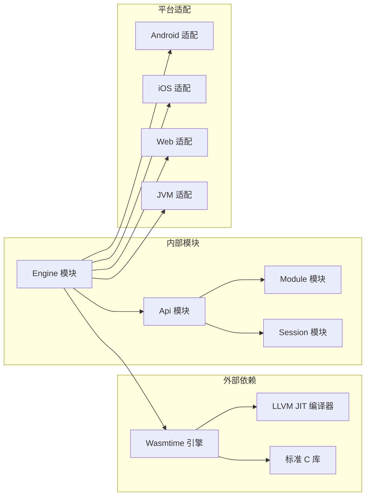

# 引擎管理

<cite>
**本文引用的文件**
- [Engine.h](file://wasmline-core/include/Engine.h)
- [Engine.cpp](file://wasmline-core/src/Engine.cpp)
- [Api.h](file://wasmline-core/include/Api.h)
- [Api.cpp](file://wasmline-core/src/Api.cpp)
- [Module.h](file://wasmline-core/include/Module.h)
- [Module.cpp](file://wasmline-core/src/Module.cpp)
- [Session.h](file://wasmline-core/include/Session.h)
- [Session.cpp](file://wasmline-core/src/Session.cpp)
- [WasmlineNative.h](file://wasmline-multiplatform/wasmline/src/iosMain/native/WasmlineNative.h)
- [WasmlineNative.cpp](file://wasmline-multiplatform/wasmline/src/iosMain/native/WasmlineNative.cpp)
- [JniHostHandler.h](file://wasmline-multiplatform/wasmline/src/jniMain/native/JniHostHandler.h)
- [JniHostHandler.cpp](file://wasmline-multiplatform/wasmline/src/jniMain/native/JniHostHandler.cpp)
- [WasmlineJni.h](file://wasmline-multiplatform/wasmline/src/jniMain/native/WasmlineJni.h)
- [WasmlineJni.cpp](file://wasmline-multiplatform/wasmline/src/jniMain/native/WasmlineJni.cpp)
- [AndroidLogger.cpp](file://wasmline-multiplatform/wasmline-android/src/androidMain/native/AndroidLogger.cpp)
- [IosLogger.cpp](file://wasmline-multiplatform/wasmline/src/iosMain/native/IosLogger.cpp)
- [ConsoleLogger.cpp](file://wasmline-multiplatform/wasmline/src/jvmMain/native/ConsoleLogger.cpp)
- [WasmlineConfig.kt](file://wasmline-multiplatform/wasmline/src/commonMain/kotlin/crow/wasmline/WasmlineConfig.kt)
- [WasmlineService.kt](file://wasmline-multiplatform/wasmline/src/commonMain/kotlin/crow/wasmline/WasmlineService.kt)
- [Wasmline.kt](file://wasmline-multiplatform/wasmline/src/hostMain/kotlin/crow/wasmline/Wasmline.kt)
- [Wasmline.jni.kt](file://wasmline-multiplatform/wasmline/src/jniMain/kotlin/crow/wasmline/Wasmline.jni.kt)
- [Wasmline.js.kt](file://wasmline-multiplatform/wasmline/src/jsMain/kotlin/crow/wasmline/Wasmline.js.kt)
- [Wasmline.web.kt](file://wasmline-multiplatform/wasmline/src/webMain/kotlin/crow/wasmline/Wasmline.web.kt)
- [Wasmline.wasmWasi.kt](file://wasmline-multiplatform/wasmline/src/wasmWasiMain/kotlin/crow/wasmline/Wasmline.wasmWasi.kt)
- [Wasmline.wasmJs.kt](file://wasmline-multiplatform/wasmline/src/wasmJsMain/kotlin/crow/wasmline/Wasmline.wasmJs.kt)
- [Wasmline.ios.kt](file://wasmline-multiplatform/wasmline/src/iosMain/kotlin/crow/wasmline/Wasmline.ios.kt)
- [NativeLoaderExt.android.kt](file://wasmline-multiplatform/wasmline/src/androidMain/kotlin/crow/wasmline/extensions/NativeLoaderExt.android.kt)
- [NativeLoaderExt.jvm.kt](file://wasmline-multiplatform/wasmline/src/jvmMain/kotlin/crow/wasmline/extensions/NativeLoaderExt.jvm.kt)
- [NativeLoaderExt.ios.kt](file://wasmline-multiplatform/wasmline/src/iosMain/kotlin/crow/wasmline/extensions/NativeLoaderExt.ios.kt)
- [NativeLoaderExt.js.kt](file://wasmline-multiplatform/wasmline/src/jsMain/kotlin/crow/wasmline/extensions/NativeLoaderExt.js.kt)
- [NativeLoaderExt.web.kt](file://wasmline-multiplatform/wasmline/src/webMain/kotlin/crow/wasmline/extensions/NativeLoaderExt.web.kt)
- [NativeLoaderExt.wasmJs.kt](file://wasmline-multiplatform/wasmline/src/wasmJsMain/kotlin/crow/wasmline/extensions/NativeLoaderExt.wasmJs.kt)
- [NativeLoaderExt.wasmWasi.kt](file://wasmline-multiplatform/wasmline/src/wasmWasiMain/kotlin/crow/wasmline/extensions/NativeLoaderExt.wasmWasi.kt)
</cite>

## 目录
1. [引言](#引言)
2. [项目结构](#项目结构)
3. [核心组件](#核心组件)
4. [架构概览](#架构概览)
5. [详细组件分析](#详细组件分析)
6. [依赖关系分析](#依赖关系分析)
7. [性能考虑](#性能考虑)
8. [故障排除指南](#故障排除指南)
9. [结论](#结论)

## 引言

Wasmline 是一个跨平台的 WebAssembly 引擎管理系统，提供了统一的 API 接口来管理 WebAssembly 模块的加载、执行和生命周期。该系统采用单例模式设计引擎实例，确保在整个应用程序生命周期内只有一个活跃的引擎实例，从而优化内存使用和提高性能。

引擎管理系统的核心目标是：
- 提供线程安全的单例引擎实例管理
- 管理 Wasmtime 引擎的完整生命周期
- 支持多平台部署（Android、iOS、Web、桌面）
- 提供灵活的配置选项和性能优化
- 实现健壮的错误处理和资源清理机制

## 项目结构

Wasmline 项目采用模块化架构，主要分为以下几个核心部分：

**图表来源**
- [Engine.h:1-200](file://wasmline-core/include/Engine.h#L1-L200)
- [Engine.cpp:1-300](file://wasmline-core/src/Engine.cpp#L1-L300)

**章节来源**
- [Engine.h:1-200](file://wasmline-core/include/Engine.h#L1-L200)
- [Engine.cpp:1-300](file://wasmline-core/src/Engine.cpp#L1-L300)

## 核心组件

### Engine 单例类设计

Engine 类是整个系统的核心，采用了单例模式来确保引擎实例的唯一性。该类负责管理 Wasmtime 引擎的生命周期，包括初始化、配置、运行时管理和销毁。

#### 关键特性

1. **线程安全性**: 使用互斥锁保护引擎实例的创建和访问
2. **延迟初始化**: 只在首次使用时创建引擎实例
3. **自动清理**: 在进程结束时自动清理引擎资源
4. **配置管理**: 提供灵活的引擎配置选项

#### 主要接口

- `getInstance()`: 获取引擎单例实例
- `initialize(config)`: 初始化引擎配置
- `createStore()`: 创建存储上下文
- `createSession()`: 创建会话实例
- `shutdown()`: 关闭并清理引擎

**章节来源**
- [Engine.h:1-200](file://wasmline-core/include/Engine.h#L1-L200)
- [Engine.cpp:1-300](file://wasmline-core/src/Engine.cpp#L1-L300)

### Api 层设计

Api 类作为引擎的对外接口，提供了统一的 API 调用入口。它封装了底层引擎的具体实现细节，向上层应用暴露简洁的接口。

#### 核心功能

- 模块加载和管理
- 会话生命周期管理
- 错误处理和异常传播
- 性能监控和统计

**章节来源**
- [Api.h:1-150](file://wasmline-core/include/Api.h#L1-L150)
- [Api.cpp:1-200](file://wasmline-core/src/Api.cpp#L1-L200)

## 架构概览

Wasmline 的整体架构采用了分层设计，从底层的原生引擎到上层的应用接口，形成了清晰的抽象层次。

**图表来源**
- [Engine.cpp:1-300](file://wasmline-core/src/Engine.cpp#L1-L300)
- [Api.cpp:1-200](file://wasmline-core/src/Api.cpp#L1-L200)
- [Wasmline.kt:1-200](file://wasmline-multiplatform/wasmline/src/hostMain/kotlin/crow/wasmline/Wasmline.kt#L1-L200)

## 详细组件分析

### Engine 单例类实现

Engine 类的实现采用了经典的单例模式，确保在整个应用程序生命周期内只有一个活跃的引擎实例。

#### 线程安全初始化机制

**图表来源**
- [Engine.cpp:1-300](file://wasmline-core/src/Engine.cpp#L1-L300)

#### 关键配置参数

引擎支持多种配置参数来优化不同场景下的性能：

1. **垃圾回收设置**
   - GC 阈值调整
   - 内存回收策略
   - 堆栈大小限制

2. **SIMD 支持**
   - 向量指令启用
   - SIMD 指令集检测
   - 性能优化配置

3. **信号处理器**
   - 异常信号捕获
   - 超时处理机制
   - 资源清理回调

**章节来源**
- [Engine.h:1-200](file://wasmline-core/include/Engine.h#L1-L200)
- [Engine.cpp:1-300](file://wasmline-core/src/Engine.cpp#L1-L300)

### 多平台适配层

Wasmline 提供了完整的多平台支持，每个平台都有专门的适配器来处理平台特定的功能。

#### Android 平台优化

**图表来源**
- [AndroidLogger.cpp:1-150](file://wasmline-multiplatform/wasmline-android/src/androidMain/native/AndroidLogger.cpp#L1-L150)
- [NativeLoaderExt.android.kt:1-100](file://wasmline-multiplatform/wasmline/src/androidMain/kotlin/crow/wasmline/extensions/NativeLoaderExt.android.kt#L1-L100)

#### iOS 平台适配

iOS 平台提供了专门的日志记录和内存管理优化：

- **IosLogger**: 提供 iOS 特定的日志格式化和输出
- **Memory Management**: 优化 iOS 内存使用模式
- **Signal Handling**: 处理 iOS 平台特有的信号

#### Web 平台支持

Web 平台提供了多种运行模式：

- **WASM-JS**: 通过 WebAssembly JavaScript 接口运行
- **WebAssembly 浏览器**: 直接在浏览器环境中运行
- **Node.js 环境**: 支持服务器端运行

**章节来源**
- [Wasmline.js.kt:1-200](file://wasmline-multiplatform/wasmline/src/jsMain/kotlin/crow/wasmline/Wasmline.js.kt#L1-L200)
- [Wasmline.web.kt:1-200](file://wasmline-multiplatform/wasmline/src/webMain/kotlin/crow/wasmline/Wasmline.web.kt#L1-L200)
- [Wasmline.wasmWasi.kt:1-200](file://wasmline-multiplatform/wasmline/src/wasmWasiMain/kotlin/crow/wasmline/Wasmline.wasmWasi.kt#L1-L200)

### 引擎生命周期管理

引擎的生命周期管理包括初始化、运行时管理和销毁三个阶段。

**图表来源**
- [Engine.cpp:1-300](file://wasmline-core/src/Engine.cpp#L1-L300)
- [Session.cpp:1-200](file://wasmline-core/src/Session.cpp#L1-L200)

**章节来源**
- [Engine.cpp:1-300](file://wasmline-core/src/Engine.cpp#L1-L300)
- [Session.cpp:1-200](file://wasmline-core/src/Session.cpp#L1-L200)

### 错误处理机制

系统实现了多层次的错误处理机制，确保在各种异常情况下都能优雅地处理问题。

#### 错误分类

1. **初始化错误**: 引擎初始化失败
2. **运行时错误**: 模块执行过程中的错误
3. **资源错误**: 内存或文件资源相关错误
4. **平台错误**: 平台特定的运行时问题

#### 恢复策略

- **自动重试**: 对于临时性错误进行有限次数的重试
- **降级模式**: 在资源不足时启用简化功能
- **优雅降级**: 保持基本功能可用
- **资源清理**: 确保错误发生时的资源正确清理

**章节来源**
- [Engine.h:1-200](file://wasmline-core/include/Engine.h#L1-L200)
- [ErrorDefs.h:1-100](file://wasmline-core/include/ErrorDefs.h#L1-L100)

## 依赖关系分析

Wasmline 的依赖关系相对清晰，主要围绕核心引擎模块构建。

**图表来源**
- [Engine.cpp:1-300](file://wasmline-core/src/Engine.cpp#L1-L300)
- [Api.cpp:1-200](file://wasmline-core/src/Api.cpp#L1-L200)

**章节来源**
- [Engine.cpp:1-300](file://wasmline-core/src/Engine.cpp#L1-L300)
- [Api.cpp:1-200](file://wasmline-core/src/Api.cpp#L1-L200)

## 性能考虑

### 内存优化策略

1. **懒加载机制**: 只在需要时加载和初始化组件
2. **对象池**: 复用频繁创建的对象实例
3. **内存映射**: 使用内存映射文件减少内存占用
4. **垃圾回收优化**: 调整 GC 参数以适应不同场景

### 并发性能

1. **线程池管理**: 合理配置工作线程数量
2. **锁优化**: 减少锁竞争和持有时间
3. **异步操作**: 将耗时操作异步化
4. **缓存策略**: 实现多级缓存机制

### 平台特定优化

#### Android 平台优化要点

- **内存限制适配**: 适应 Android 设备的内存限制
- **电量优化**: 减少后台运行时的电量消耗
- **CPU 亲和性**: 优化 CPU 核心使用
- **网络优化**: 适配移动网络环境

#### iOS 平台优化要点

- **内存警告处理**: 响应 iOS 内存警告
- **后台任务限制**: 遵循 iOS 后台执行限制
- **性能模式**: 利用 iOS 性能优化特性

## 故障排除指南

### 常见问题及解决方案

#### 引擎初始化失败

**症状**: 调用 `getInstance()` 时抛出异常

**可能原因**:
- Wasmtime 库加载失败
- 配置参数不正确
- 平台兼容性问题

**解决步骤**:
1. 检查日志输出获取详细错误信息
2. 验证配置参数的有效性
3. 确认平台库文件完整性
4. 尝试降级到基础配置

#### 模块加载失败

**症状**: `createModule()` 返回错误

**可能原因**:
- Wasm 文件格式不正确
- 依赖库缺失
- 权限问题

**解决步骤**:
1. 验证 Wasm 文件的完整性
2. 检查依赖库的版本兼容性
3. 确认文件权限设置
4. 查看详细的错误日志

#### 内存不足错误

**症状**: 运行时抛出内存相关的异常

**解决步骤**:
1. 检查当前内存使用情况
2. 调整引擎的内存限制配置
3. 实施更积极的垃圾回收策略
4. 优化模块的内存使用模式

### 调试技巧

1. **启用详细日志**: 设置日志级别为 DEBUG 获取更多信息
2. **性能监控**: 使用内置的性能计数器监控资源使用
3. **内存分析**: 定期检查内存泄漏和使用模式
4. **平台特定调试**: 使用各平台的调试工具进行诊断

**章节来源**
- [Logger.h:1-100](file://wasmline-core/include/Logger.h#L1-L100)
- [ErrorDefs.h:1-100](file://wasmline-core/include/ErrorDefs.h#L1-L100)

## 结论

Wasmline 引擎管理系统通过精心设计的架构和实现，为多平台环境提供了统一、高效的 WebAssembly 引擎管理解决方案。其核心优势包括：

1. **线程安全的单例设计**: 确保引擎实例的唯一性和安全性
2. **灵活的配置管理**: 支持丰富的配置选项以适应不同场景
3. **完善的多平台支持**: 提供 Android、iOS、Web、桌面等平台的专门优化
4. **健壮的错误处理**: 实现多层次的错误处理和恢复机制
5. **优秀的性能表现**: 通过多种优化策略实现高效的资源利用

该系统为开发者提供了一个可靠的基础框架，可以在此基础上构建复杂的 WebAssembly 应用程序，并且具有良好的扩展性和维护性。