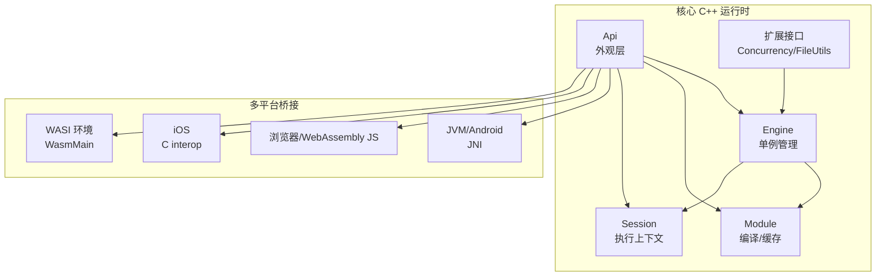
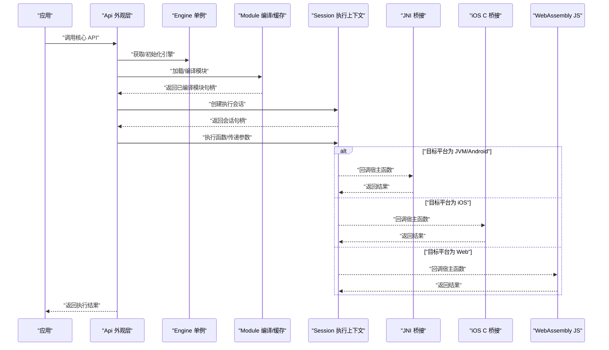
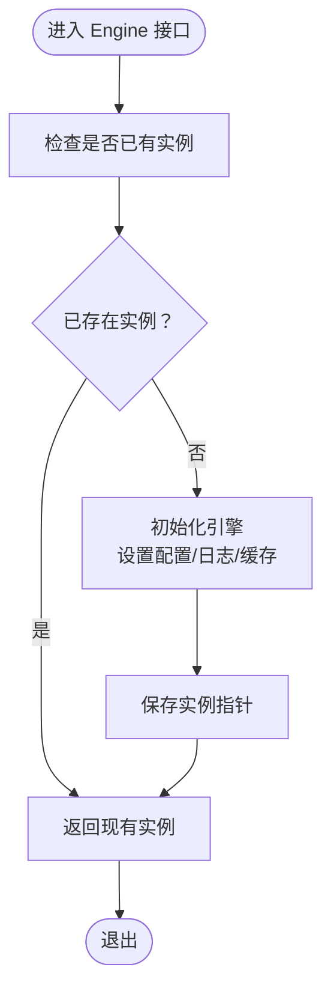
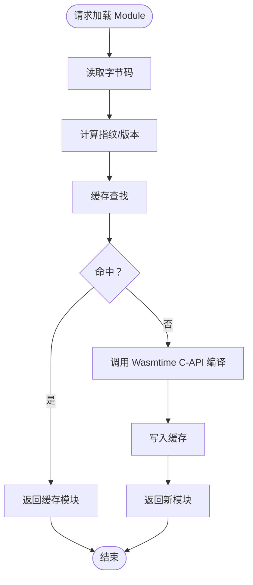
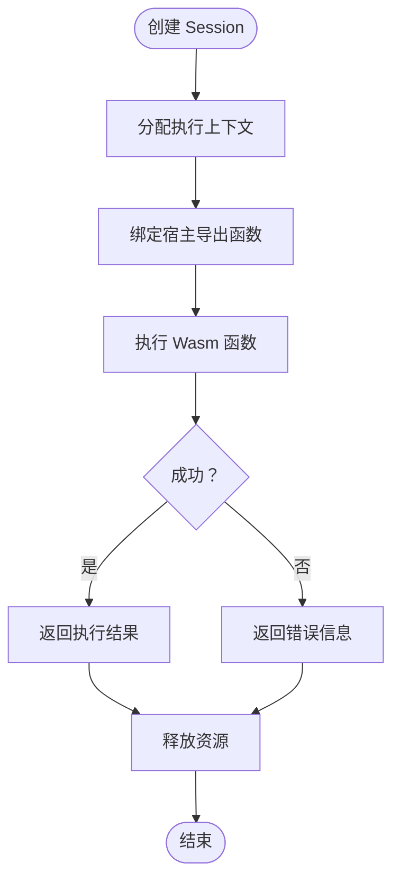
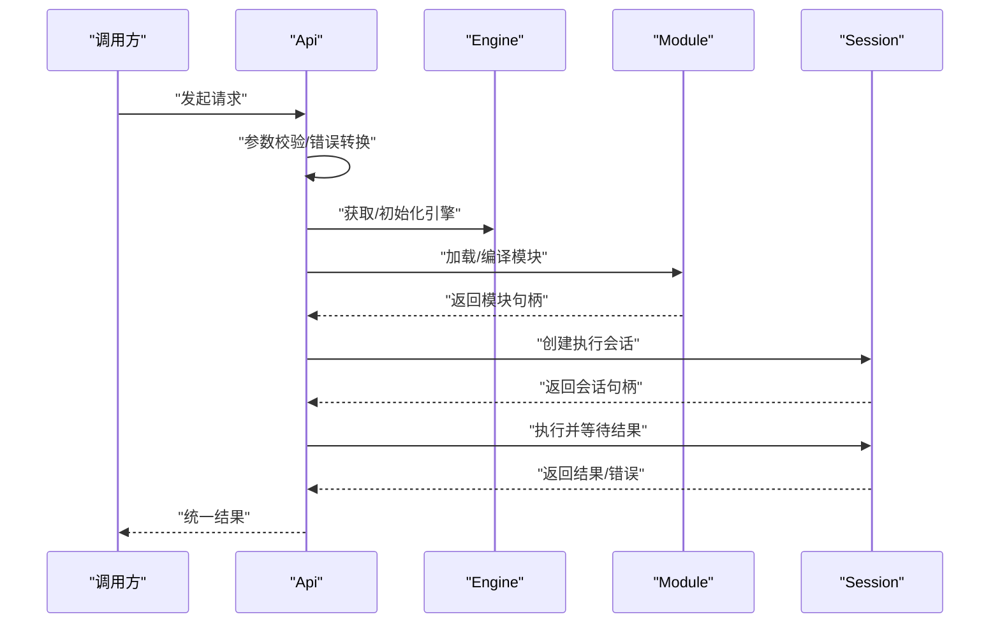
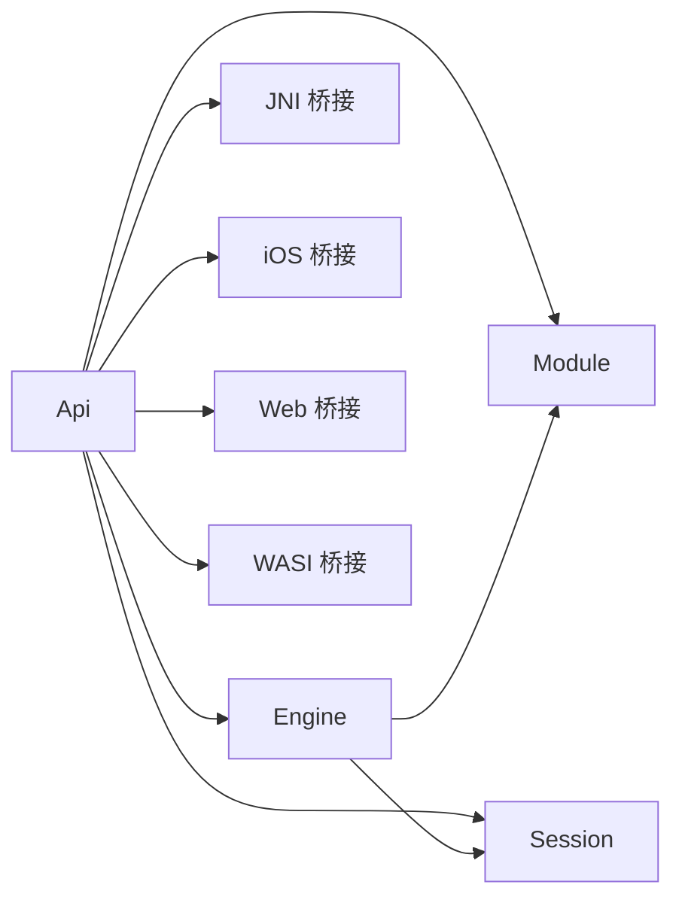

# 核心运行时

<cite>
**本文引用的文件**
- [Engine.h](file://wasmline-core/include/Engine.h)
- [Engine.cpp](file://wasmline-core/src/Engine.cpp)
- [Module.h](file://wasmline-core/include/Module.h)
- [Module.cpp](file://wasmline-core/src/Module.cpp)
- [Session.h](file://wasmline-core/include/Session.h)
- [Session.cpp](file://wasmline-core/src/Session.cpp)
- [Api.h](file://wasmline-core/include/Api.h)
- [Api.cpp](file://wasmline-core/src/Api.cpp)
- [OutboundHandler.h](file://wasmline-core/include/OutboundHandler.h)
- [Logger.h](file://wasmline-core/include/Logger.h)
- [ErrorDefs.h](file://wasmline-core/include/ErrorDefs.h)
- [Consts.h](file://wasmline-core/include/Consts.h)
- [Concurrency.h](file://wasmline-core/include/extensions/Concurrency.h)
- [FileUtils.h](file://wasmline-core/include/extensions/FileUtils.h)
- [FileUtils.cpp](file://wasmline-core/src/extensions/FileUtils.cpp)
- [WasmlineNative.h](file://wasmline-multiplatform/wasmline/src/iosMain/native/WasmlineNative.h)
- [WasmlineNative.cpp](file://wasmline-multiplatform/wasmline/src/iosMain/native/WasmlineNative.cpp)
- [IosLogger.cpp](file://wasmline-multiplatform/wasmline/src/iosMain/native/IosLogger.cpp)
- [WasmlineJni.h](file://wasmline-multiplatform/wasmline/src/jniMain/native/WasmlineJni.h)
- [WasmlineJni.cpp](file://wasmline-multiplatform/wasmline/src/jniMain/native/WasmlineJni.cpp)
- [JniHostHandler.h](file://wasmline-multiplatform/wasmline/src/jniMain/native/JniHostHandler.h)
- [JniHostHandler.cpp](file://wasmline-multiplatform/wasmline/src/jniMain/native/JniHostHandler.cpp)
- [ConsoleLogger.cpp](file://wasmline-multiplatform/wasmline/src/jvmMain/native/ConsoleLogger.cpp)
- [AndroidLogger.cpp](file://wasmline-multiplatform/wasmline-android/src/androidMain/native/AndroidLogger.cpp)
- [CMakeLists.txt](file://wasmline-multiplatform/wasmline-android/src/androidMain/native/CMakeLists.txt)
- [wasmline.def](file://wasmline-multiplatform/wasmline/src/iosMain/native/cinterop/wasmline.def)
- [WasmlineBridge.kt](file://wasmline-multiplatform/wasmline/src/iosMain/kotlin/crow/wasmline/ios/WasmlineBridge.kt)
- [Wasmline.js.kt](file://wasmline-multiplatform/wasmline/src/jsMain/kotlin/crow/wasmline/Wasmline.js.kt)
- [Wasmline.web.kt](file://wasmline-multiplatform/wasmline/src/webMain/kotlin/crow/wasmline/Wasmline.web.kt)
- [WasmMain.kt](file://wasmline-multiplatform/wasmline/src/wasmWasiMain/kotlin/crow/wasmline/WasmMain.kt)
- [WasmError.kt](file://wasmline-multiplatform/wasmline/src/wasmWasiMain/kotlin/crow/wasmline/model/WasmError.kt)
- [WasmlineWasmBridge.kt](file://wasmline-multiplatform/wasmline/src/wasmWasiMain/kotlin/crow/wasmline/WasmlineWasmBridge.kt)
- [Wasmline.kt](file://wasmline-multiplatform/wasmline/src/hostMain/kotlin/crow/wasmline/Wasmline.kt)
- [WasmlineLoader.kt](file://wasmline-multiplatform/wasmline/src/hostMain/kotlin/crow/wasmline/WasmlineLoader.kt)
- [DefaultWasmlineLoader.kt](file://wasmline-multiplatform/wasmline/src/hostMain/kotlin/crow/wasmline/loader/DefaultWasmlineLoader.kt)
- [WasmlineLoadRequest.kt](file://wasmline-multiplatform/wasmline/src/hostMain/kotlin/crow/wasmline/loader/WasmlineLoadRequest.kt)
- [WasmlineSource.kt](file://wasmline-multiplatform/wasmline/src/hostMain/kotlin/crow/wasmline/loader/WasmlineSource.kt)
- [WasmlineSourceResolvers.kt](file://wasmline-multiplatform/wasmline/src/hostMain/kotlin/crow/wasmline/loader/WasmlineSourceResolvers.kt)
- [Manifest.kt](file://wasmline-multiplatform/wasmline/src/hostMain/kotlin/crow/wasmline/loader/model/Manifest.kt)
- [WasmlineSerializationConfig.kt](file://wasmline-multiplatform/wasmline/src/commonMain/kotlin/crow/wasmline/serialization/WasmlineSerializationConfig.kt)
- [WasmlineSerializationFactory.kt](file://wasmline-multiplatform/wasmline/src/commonMain/kotlin/crow/wasmline/serialization/WasmlineSerializationFactory.kt)
- [WasmlineSerializationRegistry.kt](file://wasmline-multiplatform/wasmline/src/commonMain/kotlin/crow/wasmline/serialization/WasmlineSerializationRegistry.kt)
- [Endpoint.kt](file://wasmline-multiplatform/wasmline/src/commonMain/kotlin/crow/wasmline/internal/bridge/Endpoint.kt)
- [GeneratedBridge.kt](file://wasmline-multiplatform/wasmline/src/commonMain/kotlin/crow/wasmline/internal/bridge/GeneratedBridge.kt)
- [GeneratedSerialization.kt](file://wasmline-multiplatform/wasmline/src/commonMain/kotlin/crow/wasmline/internal/bridge/GeneratedSerialization.kt)
- [HostDispatcher.kt](file://wasmline-multiplatform/wasmline/src/commonMain/kotlin/crow/wasmline/internal/bridge/HostDispatcher.kt)
- [Payload.kt](file://wasmline-multiplatform/wasmline/src/commonMain/kotlin/crow/wasmline/internal/bridge/Payload.kt)
- [WasmlineCache.kt](file://wasmline-multiplatform/wasmline/src/commonMain/kotlin/crow/wasmline/WasmlineCache.kt)
- [WasmlineConfig.kt](file://wasmline-multiplatform/wasmline/src/commonMain/kotlin/crow/wasmline/WasmlineConfig.kt)
- [WasmlineService.kt](file://wasmline-multiplatform/wasmline/src/commonMain/kotlin/crow/wasmline/WasmlineService.kt)
- [WasmlineNetworkClient.kt](file://wasmline-multiplatform/wasmline/src/commonMain/kotlin/crow/wasmline/WasmlineNetworkClient.kt)
- [KtorNetworkClient.kt](file://wasmline-multiplatform/wasmline-network-ktor/src/commonMain/kotlin/crow/wasmline/network/ktor/KtorNetworkClient.kt)
- [OkHttpNetworkClient.kt](file://wasmline-multiplatform/wasmline-network-okhttp/src/commonMain/kotlin/crow/wasmline/network/okhttp/OkHttpNetworkClient.kt)
- [WasmlineHostArtifactTarget.kt](file://wasmline-multiplatform/wasmline/src/hostMain/kotlin/crow/wasmline/loader/internal/WasmlineHostArtifactTarget.kt)
- [InternalCommon.kt](file://wasmline-multiplatform/wasmline/src/hostMain/kotlin/crow/wasmline/loader/internal/InternalCommon.kt)
- [DefaultCacheDirectory.kt](file://wasmline-multiplatform/wasmline/src/hostMain/kotlin/crow/wasmline/loader/internal/DefaultCacheDirectory.kt)
- [HostFileAccess.kt](file://wasmline-multiplatform/wasmline/src/hostMain/kotlin/crow/wasmline/loader/internal/HostFileAccess.kt)
- [WasmlineFileCache.kt](file://wasmline-multiplatform/wasmline/src/hostMain/kotlin/crow/wasmline/loader/internal/WasmlineFileCache.kt)
- [WasmlineLocalPackageResolution.kt](file://wasmline-multiplatform/wasmline/src/hostMain/kotlin/crow/wasmline/loader/internal/WasmlineLocalPackageResolution.kt)
- [WasmlineRemotePackageResolution.kt](file://wasmline-multiplatform/wasmline/src/hostMain/kotlin/crow/wasmline/loader/internal/WasmlineRemotePackageResolution.kt)
- [WasmlineTrustedKeys.kt](file://wasmline-multiplatform/wasmline/src/commonMain/kotlin/crow/wasmline/WasmlineTrustedKeys.kt)
- [WasmlineLoadResult.kt](file://wasmline-multiplatform/wasmline/src/hostMain/kotlin/crow/wasmline/WasmlineLoadResult.kt)
- [WasmlineLoadState.kt](file://wasmline-multiplatform/wasmline/src/hostMain/kotlin/crow/wasmline/WasmlineLoadState.kt)
- [WasmlineWarmupMode.kt](file://wasmline-multiplatform/wasmline/src/hostMain/kotlin/crow/wasmline/WasmlineWarmupMode.kt)
- [BlockingFetch.js.kt](file://wasmline-multiplatform/wasmline-network-ktor/src/jsMain/kotlin/crow/wasmline/network/ktor/BlockingFetch.js.kt)
- [BlockingFetch.ios.kt](file://wasmline-multiplatform/wasmline-network-ktor/src/iosMain/kotlin/crow/wasmline/network/ktor/BlockingFetch.ios.kt)
- [BlockingFetch.jni.kt](file://wasmline-multiplatform/wasmline-network-ktor/src/jniMain/kotlin/crow/wasmline/network/ktor/BlockingFetch.jni.kt)
- [BlockingFetch.wasmJs.kt](file://wasmline-multiplatform/wasmline-network-ktor/src/wasmJsMain/kotlin/crow/wasmline/network/ktor/BlockingFetch.wasmJs.kt)
- [BlockingFetch.web.kt](file://wasmline-multiplatform/wasmline-network-ktor/src/webMain/kotlin/crow/wasmline/network/ktor/BlockingFetch.web.kt)
- [WasmlineServiceRuntimeTest.kt](file://wasmline-multiplatform/wasmline/src/commonTest/kotlin/crow/wasmline/WasmlineServiceRuntimeTest.kt)
- [WasmlineSerializationConfigTest.kt](file://wasmline-multiplatform/wasmline/src/commonTest/kotlin/crow/wasmline/WasmlineSerializationConfigTest.kt)
- [WasmlineHostApiCompileTest.kt](file://wasmline-multiplatform/wasmline/src/hostTest/kotlin/crow/wasmline/WasmlineHostApiCompileTest.kt)
</cite>

## 目录
1. [引言](#引言)
2. [项目结构](#项目结构)
3. [核心组件](#核心组件)
4. [架构总览](#架构总览)
5. [详细组件分析](#详细组件分析)
6. [依赖分析](#依赖分析)
7. [性能考虑](#性能考虑)
8. [故障排查指南](#故障排查指南)
9. [结论](#结论)
10. [附录](#附录)

## 引言
本文件面向底层开发者，系统性梳理 Wasmline 核心运行时的 C++ 引擎实现与多平台集成方案。重点覆盖：
- Engine 单例管理与生命周期
- Module 编译与缓存机制
- Session 内存隔离与执行上下文
- Api 外观层如何协调各子系统
- Wasmtime C-API 集成与 JNI/C 互操作
- 内存管理策略、错误处理机制与性能优化
- 不同平台（Android、iOS、Web）的实际集成方式
- 具体 API 使用示例与最佳实践

## 项目结构
Wasmline 采用“核心 C++ 运行时 + 多语言外观层 + 平台桥接”的分层设计。核心运行时位于 wasmline-core，提供 Engine、Module、Session 等基础能力；多平台在 wasmline-multiplatform 中通过 Kotlin/JS、Kotlin/Wasm、JNI、iOS C 等方式与核心交互。

图表来源
- [Engine.h](file://wasmline-core/include/Engine.h)
- [Module.h](file://wasmline-core/include/Module.h)
- [Session.h](file://wasmline-core/include/Session.h)
- [Api.h](file://wasmline-core/include/Api.h)
- [WasmlineJni.h](file://wasmline-multiplatform/wasmline/src/jniMain/native/WasmlineJni.h)
- [WasmlineNative.h](file://wasmline-multiplatform/wasmline/src/iosMain/native/WasmlineNative.h)
- [Wasmline.js.kt](file://wasmline-multiplatform/wasmline/src/jsMain/kotlin/crow/wasmline/Wasmline.js.kt)
- [WasmMain.kt](file://wasmline-multiplatform/wasmline/src/wasmWasiMain/kotlin/crow/wasmline/WasmMain.kt)

章节来源
- [Engine.h](file://wasmline-core/include/Engine.h)
- [Module.h](file://wasmline-core/include/Module.h)
- [Session.h](file://wasmline-core/include/Session.h)
- [Api.h](file://wasmline-core/include/Api.h)

## 核心组件
本节从代码层面解析核心 C++ 组件：Engine、Module、Session 及其协作关系。

- Engine 单例
  - 负责全局初始化、配置注入、模块注册与生命周期管理
  - 提供线程安全的访问入口，避免重复初始化
  - 与 Module、Session 协作，统一对外暴露 Api 接口

- Module 编译与缓存
  - 封装 Wasm 字节码加载、校验与编译
  - 基于文件指纹或版本号进行缓存，避免重复编译
  - 支持增量更新与失效策略

- Session 执行上下文
  - 为一次调用分配独立的堆栈空间与资源句柄
  - 提供输入输出通道与超时控制
  - 支持并发调度与资源回收

- Api 外观层
  - 对外暴露统一 API，隐藏 Engine/Module/Session 实现细节
  - 负责参数校验、错误转换与结果序列化

章节来源
- [Engine.h](file://wasmline-core/include/Engine.h)
- [Engine.cpp](file://wasmline-core/src/Engine.cpp)
- [Module.h](file://wasmline-core/include/Module.h)
- [Module.cpp](file://wasmline-core/src/Module.cpp)
- [Session.h](file://wasmline-core/include/Session.h)
- [Session.cpp](file://wasmline-core/src/Session.cpp)
- [Api.h](file://wasmline-core/include/Api.h)
- [Api.cpp](file://wasmline-core/src/Api.cpp)

## 架构总览
下图展示了核心运行时与多平台桥接的整体交互：Api 作为外观层协调 Engine/Module/Session；JVM/JS/iOS/WASI 通过各自桥接层与核心通信。

图表来源
- [Api.cpp](file://wasmline-core/src/Api.cpp)
- [Engine.cpp](file://wasmline-core/src/Engine.cpp)
- [Module.cpp](file://wasmline-core/src/Module.cpp)
- [Session.cpp](file://wasmline-core/src/Session.cpp)
- [WasmlineJni.cpp](file://wasmline-multiplatform/wasmline/src/jniMain/native/WasmlineJni.cpp)
- [WasmlineNative.cpp](file://wasmline-multiplatform/wasmline/src/iosMain/native/WasmlineNative.cpp)
- [Wasmline.js.kt](file://wasmline-multiplatform/wasmline/src/jsMain/kotlin/crow/wasmline/Wasmline.js.kt)

## 详细组件分析

### Engine 单例管理
- 设计要点
  - 单例模式：保证全局唯一实例，避免重复初始化
  - 线程安全：初始化与查询均需加锁保护
  - 生命周期：支持延迟初始化与显式销毁
  - 配置注入：接收运行时配置（日志级别、缓存目录、超时等）

- 关键流程
  - 初始化：检查是否已存在实例，不存在则创建并设置默认配置
  - 查询：返回当前实例指针
  - 销毁：释放内部资源，重置状态

图表来源
- [Engine.cpp](file://wasmline-core/src/Engine.cpp)

章节来源
- [Engine.h](file://wasmline-core/include/Engine.h)
- [Engine.cpp](file://wasmline-core/src/Engine.cpp)

### Module 编译与缓存机制
- 设计要点
  - 编译：封装 Wasm 字节码到可执行模块的转换过程
  - 缓存：以文件指纹/版本号为键，避免重复编译
  - 失效策略：支持按时间、大小或版本的清理
  - 并发安全：多线程下共享缓存需加锁

- 关键流程
  - 加载：读取字节码，计算指纹
  - 查找：在缓存中查找对应模块
  - 编译：未命中时调用 Wasmtime C-API 完成编译
  - 注册：将编译结果写入缓存并返回句柄

图表来源
- [Module.cpp](file://wasmline-core/src/Module.cpp)

章节来源
- [Module.h](file://wasmline-core/include/Module.h)
- [Module.cpp](file://wasmline-core/src/Module.cpp)

### Session 内存隔离与执行上下文
- 设计要点
  - 内存隔离：每个 Session 分配独立的堆栈与资源句柄
  - 上下文绑定：将宿主导出函数与 Session 绑定，确保回调可见性
  - 超时与取消：支持超时控制与中断机制
  - 资源回收：执行结束后释放相关资源，防止泄漏

- 关键流程
  - 创建：分配上下文、注册导出函数、设置回调处理器
  - 执行：传入函数名与参数，调用 Wasm 函数
  - 结果：返回结果或错误信息
  - 销毁：清理上下文与关联资源

图表来源
- [Session.cpp](file://wasmline-core/src/Session.cpp)

章节来源
- [Session.h](file://wasmline-core/include/Session.h)
- [Session.cpp](file://wasmline-core/src/Session.cpp)

### Api 外观层协调机制
- 设计要点
  - 参数校验：对输入参数进行合法性检查
  - 错误转换：将底层错误映射为统一错误码与消息
  - 结果序列化：将执行结果序列化为跨平台可识别格式
  - 生命周期管理：确保 Engine/Module/Session 的正确创建与销毁

- 关键流程
  - 请求入口：Api 接收外部调用
  - 调度：根据请求类型路由到 Engine/Module/Session
  - 执行：调用相应组件完成任务
  - 返回：组装结果并返回给调用方

图表来源
- [Api.cpp](file://wasmline-core/src/Api.cpp)

章节来源
- [Api.h](file://wasmline-core/include/Api.h)
- [Api.cpp](file://wasmline-core/src/Api.cpp)

### Wasmtime C-API 集成与 JNI/C 互操作
- Wasmtime 集成
  - 通过 C-API 完成模块编译、实例化与函数调用
  - 使用 OutboundHandler 抽象宿主回调，屏蔽平台差异
  - 日志与错误通过 Logger/ErrorDefs 统一管理

- JNI 互操作（Android）
  - 通过 WasmlineJni.cpp 暴露 JNI 方法，桥接 Java/Kotlin 与 C++
  - JniHostHandler.cpp 实现宿主回调逻辑，处理来自 Wasm 的调用
  - AndroidLogger.cpp 提供 Android 平台日志输出

- iOS 互操作
  - 使用 cinterop 定义 .def 文件，生成 Swift/ObjC 桥接头
  - WasmlineNative.cpp/WasmlineNative.h 提供 C 接口，供 Swift 调用
  - IosLogger.cpp 提供 iOS 平台日志输出

- JVM 控制台日志
  - ConsoleLogger.cpp 提供 JVM 平台日志输出

章节来源
- [OutboundHandler.h](file://wasmline-core/include/OutboundHandler.h)
- [Logger.h](file://wasmline-core/include/Logger.h)
- [ErrorDefs.h](file://wasmline-core/include/ErrorDefs.h)
- [WasmlineJni.h](file://wasmline-multiplatform/wasmline/src/jniMain/native/WasmlineJni.h)
- [WasmlineJni.cpp](file://wasmline-multiplatform/wasmline/src/jniMain/native/WasmlineJni.cpp)
- [JniHostHandler.h](file://wasmline-multiplatform/wasmline/src/jniMain/native/JniHostHandler.h)
- [JniHostHandler.cpp](file://wasmline-multiplatform/wasmline/src/jniMain/native/JniHostHandler.cpp)
- [AndroidLogger.cpp](file://wasmline-multiplatform/wasmline-android/src/androidMain/native/AndroidLogger.cpp)
- [WasmlineNative.h](file://wasmline-multiplatform/wasmline/src/iosMain/native/WasmlineNative.h)
- [WasmlineNative.cpp](file://wasmline-multiplatform/wasmline/src/iosMain/native/WasmlineNative.cpp)
- [IosLogger.cpp](file://wasmline-multiplatform/wasmline/src/iosMain/native/IosLogger.cpp)
- [ConsoleLogger.cpp](file://wasmline-multiplatform/wasmline/src/jvmMain/native/ConsoleLogger.cpp)
- [wasmline.def](file://wasmline-multiplatform/wasmline/src/iosMain/native/cinterop/wasmline.def)

### 平台集成方式
- Android
  - 通过 JNI 与 C++ 交互，使用 AndroidLogger 输出日志
  - CMakeLists.txt 配置构建脚本，链接本地库

- iOS
  - 使用 cinterop 生成桥接头，Swift 调用 C 接口
  - IosLogger 提供 iOS 平台日志

- Web（JS/WASM）
  - 在 JS/WASM 环境中通过宿主桥接与核心通信
  - 提供浏览器与 WebAssembly 环境下的适配层

- WASI
  - 在 WASI 环境中直接运行，使用 WasmMain 作为入口

章节来源
- [CMakeLists.txt](file://wasmline-multiplatform/wasmline-android/src/androidMain/native/CMakeLists.txt)
- [Wasmline.js.kt](file://wasmline-multiplatform/wasmline/src/jsMain/kotlin/crow/wasmline/Wasmline.js.kt)
- [Wasmline.web.kt](file://wasmline-multiplatform/wasmline/src/webMain/kotlin/crow/wasmline/Wasmline.web.kt)
- [WasmMain.kt](file://wasmline-multiplatform/wasmline/src/wasmWasiMain/kotlin/crow/wasmline/WasmMain.kt)
- [WasmlineNative.h](file://wasmline-multiplatform/wasmline/src/iosMain/native/WasmlineNative.h)
- [WasmlineNative.cpp](file://wasmline-multiplatform/wasmline/src/iosMain/native/WasmlineNative.cpp)

## 依赖分析
- 组件耦合
  - Api 依赖 Engine/Module/Session，负责统一调度
  - Engine 依赖 Module/Session，负责生命周期与资源管理
  - 多平台桥接通过 JNI/C 接口与核心交互

- 外部依赖
  - Wasmtime C-API：用于模块编译与实例化
  - 平台日志库：Android/iOS/JVM 的日志输出

图表来源
- [Api.cpp](file://wasmline-core/src/Api.cpp)
- [Engine.cpp](file://wasmline-core/src/Engine.cpp)
- [Module.cpp](file://wasmline-core/src/Module.cpp)
- [Session.cpp](file://wasmline-core/src/Session.cpp)
- [WasmlineJni.cpp](file://wasmline-multiplatform/wasmline/src/jniMain/native/WasmlineJni.cpp)
- [WasmlineNative.cpp](file://wasmline-multiplatform/wasmline/src/iosMain/native/WasmlineNative.cpp)
- [Wasmline.js.kt](file://wasmline-multiplatform/wasmline/src/jsMain/kotlin/crow/wasmline/Wasmline.js.kt)
- [WasmMain.kt](file://wasmline-multiplatform/wasmline/src/wasmWasiMain/kotlin/crow/wasmline/WasmMain.kt)

## 性能考虑
- 编译缓存
  - 使用指纹/版本号缓存模块，避免重复编译
  - 合理设置缓存清理策略，平衡磁盘占用与启动时间

- 并发与隔离
  - Session 独立内存与资源，减少锁竞争
  - 使用 Concurrency 扩展提升并发执行效率

- I/O 与网络
  - 通过 WASI/JS 环境的异步 I/O 降低阻塞
  - 使用网络客户端抽象，支持多种实现（Ktor/OkHttp）

- 日志与诊断
  - 使用 Logger 统一输出，避免频繁系统调用
  - 在开发环境开启详细日志，在生产环境关闭或降级

章节来源
- [Concurrency.h](file://wasmline-core/include/extensions/Concurrency.h)
- [FileUtils.h](file://wasmline-core/include/extensions/FileUtils.h)
- [FileUtils.cpp](file://wasmline-core/src/extensions/FileUtils.cpp)
- [Logger.h](file://wasmline-core/include/Logger.h)

## 故障排查指南
- 常见错误类型
  - 初始化失败：检查 Engine 是否已正确初始化
  - 模块加载失败：确认字节码完整性与缓存一致性
  - 执行异常：查看 Session 回调与超时设置
  - 平台桥接问题：核对 JNI/C 接口签名与平台日志

- 错误处理策略
  - 使用统一错误码与消息映射
  - 在 Api 层进行错误包装与传播
  - 记录上下文信息以便定位问题

章节来源
- [ErrorDefs.h](file://wasmline-core/include/ErrorDefs.h)
- [Api.cpp](file://wasmline-core/src/Api.cpp)
- [Session.cpp](file://wasmline-core/src/Session.cpp)

## 结论
Wasmline 核心运行时通过清晰的分层设计与多平台桥接，实现了高性能、可扩展的 Wasm 执行环境。Engine/Module/Session 的职责明确，Api 外观层提供了统一的调用入口；结合 Wasmtime C-API 与 JNI/C 互操作，能够在 Android、iOS、Web、WASI 等多平台上稳定运行。建议在实际工程中重视缓存策略、并发隔离与日志诊断，持续优化启动与执行性能。

## 附录
- 核心 API 使用示例（路径）
  - 引擎初始化与查询：[Engine.cpp](file://wasmline-core/src/Engine.cpp)
  - 模块加载与编译：[Module.cpp](file://wasmline-core/src/Module.cpp)
  - 会话创建与执行：[Session.cpp](file://wasmline-core/src/Session.cpp)
  - 外观层统一入口：[Api.cpp](file://wasmline-core/src/Api.cpp)

- 平台桥接示例（路径）
  - Android JNI：[WasmlineJni.cpp](file://wasmline-multiplatform/wasmline/src/jniMain/native/WasmlineJni.cpp)，[JniHostHandler.cpp](file://wasmline-multiplatform/wasmline/src/jniMain/native/JniHostHandler.cpp)，[AndroidLogger.cpp](file://wasmline-multiplatform/wasmline-android/src/androidMain/native/AndroidLogger.cpp)
  - iOS C 互操作：[WasmlineNative.cpp](file://wasmline-multiplatform/wasmline/src/iosMain/native/WasmlineNative.cpp)，[IosLogger.cpp](file://wasmline-multiplatform/wasmline/src/iosMain/native/IosLogger.cpp)，[wasmline.def](file://wasmline-multiplatform/wasmline/src/iosMain/native/cinterop/wasmline.def)
  - JVM 日志：[ConsoleLogger.cpp](file://wasmline-multiplatform/wasmline/src/jvmMain/native/ConsoleLogger.cpp)
  - Web/WASI：[Wasmline.js.kt](file://wasmline-multiplatform/wasmline/src/jsMain/kotlin/crow/wasmline/Wasmline.js.kt)，[WasmMain.kt](file://wasmline-multiplatform/wasmline/src/wasmWasiMain/kotlin/crow/wasmline/WasmMain.kt)