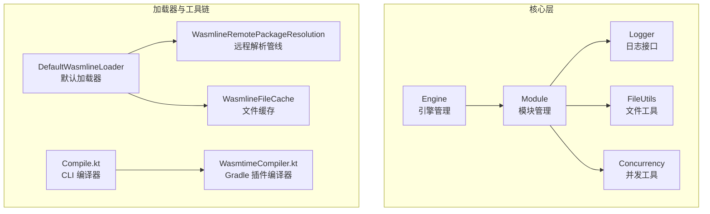
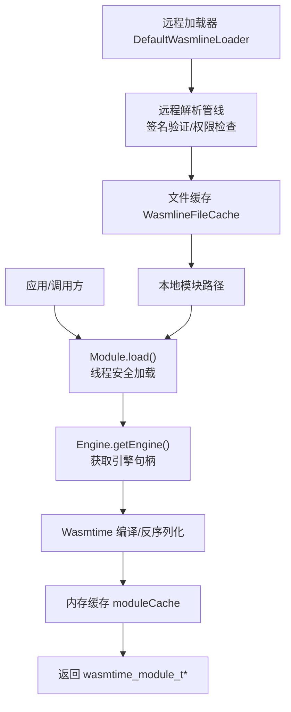
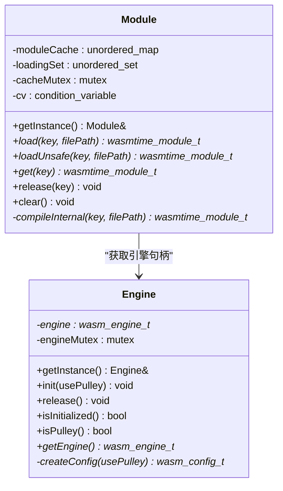
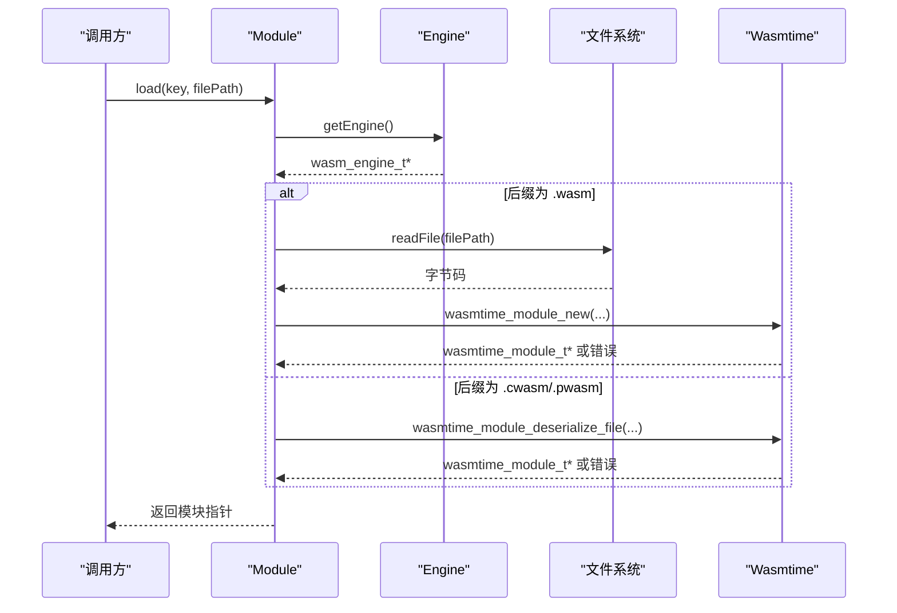
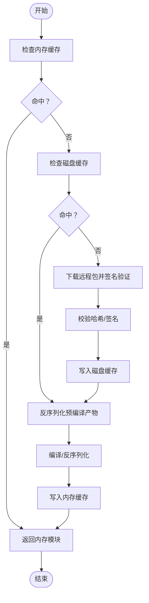
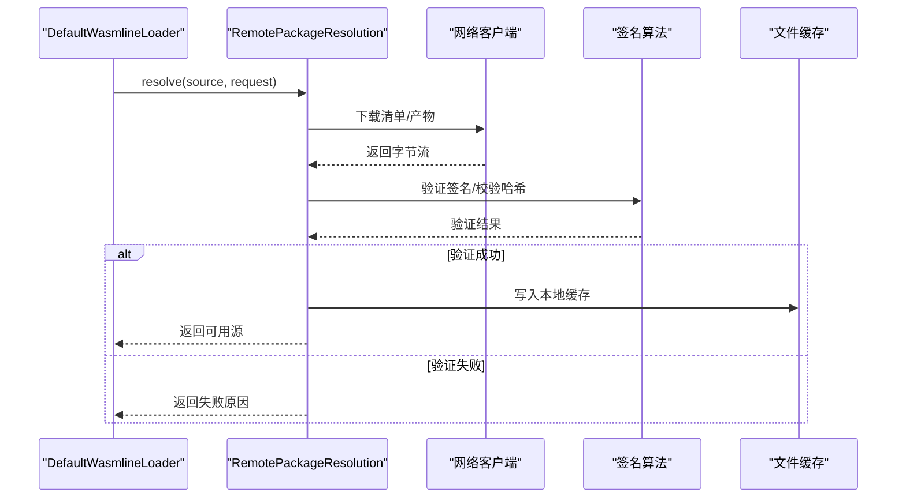
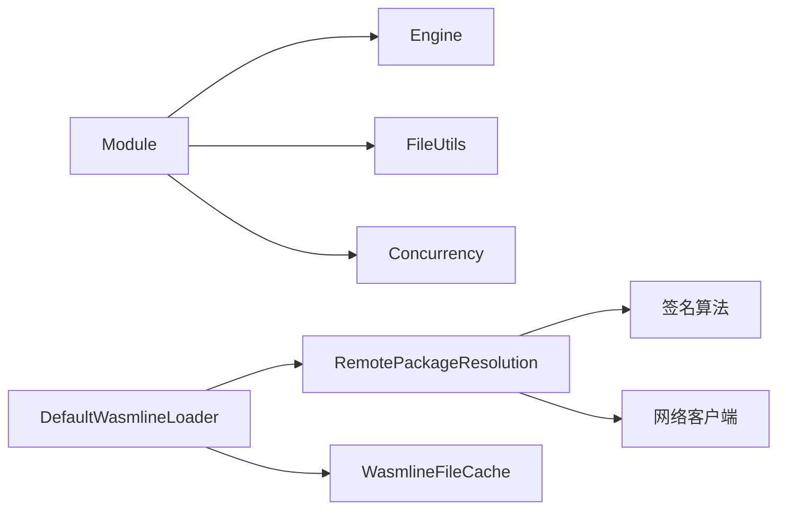

# 模块系统

<cite>
**本文引用的文件**
- [Module.h](file://wasmline-core/include/Module.h)
- [Module.cpp](file://wasmline-core/src/Module.cpp)
- [Engine.h](file://wasmline-core/include/Engine.h)
- [Engine.cpp](file://wasmline-core/src/Engine.cpp)
- [Logger.h](file://wasmline-core/include/Logger.h)
- [FileUtils.h](file://wasmline-core/include/extensions/FileUtils.h)
- [Concurrency.h](file://wasmline-core/include/extensions/Concurrency.h)
- [DefaultWasmlineLoader.kt](file://wasmline-multiplatform/wasmline-loader/src/hostMain/kotlin/crow/wasmline/loader/DefaultWasmlineLoader.kt)
- [WasmlineRemotePackageResolution.kt](file://wasmline-multiplatform/wasmline-loader/src/hostMain/kotlin/crow/wasmline/loader/internal/WasmlineRemotePackageResolution.kt)
- [WasmlineFileCache.kt](file://wasmline-multiplatform/wasmline-loader/src/hostMain/kotlin/crow/wasmline/loader/internal/WasmlineFileCache.kt)
- [Compile.kt](file://wasmline-multiplatform/wasmline-cli/src/main/kotlin/crow/wasmline/cli/Compile.kt)
- [WasmtimeCompiler.kt](file://wasmline-multiplatform/wasmline-gradle-plugin/src/main/kotlin/crow/wasmline/gradle/internal/WasmtimeCompiler.kt)
- [plugin.pwasm 示例](file://wasmline-samples/kotlin/sample-apps/multiplatform/androidApp/src/androidMain/assets/plugin.pwasm)
- [plugin.cwasm 示例](file://wasmline-samples/kotlin/sample-apps/android/src/androidMain/assets/plugin.cwasm)
- [plugin.wasm 示例](file://wasmline-samples/kotlin/sample-apps/application/src/main/resources/plugin.cwasm)
</cite>

## 目录
1. [引言](#引言)
2. [项目结构](#项目结构)
3. [核心组件](#核心组件)
4. [架构总览](#架构总览)
5. [详细组件分析](#详细组件分析)
6. [依赖关系分析](#依赖关系分析)
7. [性能考量](#性能考量)
8. [故障排查指南](#故障排查指南)
9. [结论](#结论)
10. [附录](#附录)

## 引言
本文件面向开发者，系统化阐述 Wasmline 模块系统的设计与实现，重点覆盖以下方面：
- Module 类的架构设计：单例管理、线程安全加载、内存缓存与锁合并优化。
- 模块加载流程：从字节码输入到编译/反序列化的完整路径。
- 缓存策略：内存缓存与磁盘缓存的协同工作方式。
- 安全与验证：签名验证、权限检查与安全策略在多平台加载器中的体现。
- 卸载与资源回收：模块释放与引擎生命周期管理。
- 多格式兼容：对 .wasm、.cwasm、.pwasm 的识别与处理。
- 性能优化与调试建议：编译参数、运行时配置与日志策略。

## 项目结构
Wasmline 模块系统由“核心 C++ 层”和“多平台加载器与工具链”两部分组成：
- 核心层（wasmline-core）：提供 Module、Engine 等基础能力，负责与 Wasmtime 引擎交互、模块编译与缓存。
- 加载器与工具链（wasmline-multiplatform）：提供跨平台的远程包解析、签名验证、本地缓存、CLI/Gradle 编译器等。

图表来源
- [Engine.h:10-73](file://wasmline-core/include/Engine.h#L10-L73)
- [Engine.cpp:10-138](file://wasmline-core/src/Engine.cpp#L10-L138)
- [Module.h:10-101](file://wasmline-core/include/Module.h#L10-L101)
- [Module.cpp:10-193](file://wasmline-core/src/Module.cpp#L10-L193)
- [DefaultWasmlineLoader.kt](file://wasmline-multiplatform/wasmline-loader/src/hostMain/kotlin/crow/wasmline/loader/DefaultWasmlineLoader.kt)
- [WasmlineRemotePackageResolution.kt](file://wasmline-multiplatform/wasmline-loader/src/hostMain/kotlin/crow/wasmline/loader/internal/WasmlineRemotePackageResolution.kt)
- [WasmlineFileCache.kt](file://wasmline-multiplatform/wasmline-loader/src/hostMain/kotlin/crow/wasmline/loader/internal/WasmlineFileCache.kt)
- [Compile.kt:227-255](file://wasmline-multiplatform/wasmline-cli/src/main/kotlin/crow/wasmline/cli/Compile.kt#L227-L255)
- [WasmtimeCompiler.kt:101-195](file://wasmline-multiplatform/wasmline-gradle-plugin/src/main/kotlin/crow/wasmline/gradle/internal/WasmtimeCompiler.kt#L101-L195)

章节来源
- [Module.h:10-101](file://wasmline-core/include/Module.h#L10-L101)
- [Module.cpp:10-193](file://wasmline-core/src/Module.cpp#L10-L193)
- [Engine.h:10-73](file://wasmline-core/include/Engine.h#L10-L73)
- [Engine.cpp:10-138](file://wasmline-core/src/Engine.cpp#L10-L138)
- [Logger.h:12-39](file://wasmline-core/include/Logger.h#L12-L39)
- [FileUtils.h:10-26](file://wasmline-core/include/extensions/FileUtils.h#L10-L26)
- [Concurrency.h:10-64](file://wasmline-core/include/extensions/Concurrency.h#L10-L64)

## 核心组件
- Engine：全局 Wasmtime 引擎管理器，负责引擎初始化、配置与生命周期控制。针对 Android 环境进行信号处理、内存保护与目标平台适配。
- Module：模块管理器，提供线程安全的模块加载、缓存、释放与清理；支持 .wasm 原始编译与 .cwasm/.pwasm 预编译反序列化。
- 并发工具：通过 WasmScopeGuard 实现 RAII 锁合并与异常安全，避免死锁与无限等待。
- 文件工具：封装文件存在性检查、读取与写入，用于模块字节码与预编译产物的 IO。
- 日志接口：根据编译宏与构建模式决定是否启用日志输出，便于调试与生产环境裁剪。

章节来源
- [Engine.h:10-73](file://wasmline-core/include/Engine.h#L10-L73)
- [Engine.cpp:50-138](file://wasmline-core/src/Engine.cpp#L50-L138)
- [Module.h:10-101](file://wasmline-core/include/Module.h#L10-L101)
- [Module.cpp:43-193](file://wasmline-core/src/Module.cpp#L43-L193)
- [Concurrency.h:18-64](file://wasmline-core/include/extensions/Concurrency.h#L18-L64)
- [FileUtils.h:14-26](file://wasmline-core/include/extensions/FileUtils.h#L14-L26)
- [Logger.h:12-39](file://wasmline-core/include/Logger.h#L12-L39)

## 架构总览
模块系统围绕“引擎—模块—缓存—加载器”的层次展开：
- 引擎层：统一配置与生命周期，确保跨平台一致性。
- 模块层：负责模块编译/反序列化、内存缓存与并发协调。
- 缓存层：结合内存缓存与磁盘缓存，提升重复加载性能。
- 加载器层：实现远程包解析、签名验证、权限校验与下载缓存。

图表来源
- [Module.cpp:97-162](file://wasmline-core/src/Module.cpp#L97-L162)
- [Engine.cpp:93-136](file://wasmline-core/src/Engine.cpp#L93-L136)
- [DefaultWasmlineLoader.kt](file://wasmline-multiplatform/wasmline-loader/src/hostMain/kotlin/crow/wasmline/loader/DefaultWasmlineLoader.kt)
- [WasmlineRemotePackageResolution.kt](file://wasmline-multiplatform/wasmline-loader/src/hostMain/kotlin/crow/wasmline/loader/internal/WasmlineRemotePackageResolution.kt)
- [WasmlineFileCache.kt](file://wasmline-multiplatform/wasmline-loader/src/hostMain/kotlin/crow/wasmline/loader/internal/WasmlineFileCache.kt)

## 详细组件分析

### Module 类设计与实现
- 单例与线程安全：通过静态实例与互斥量保护缓存表与加载状态集合，采用条件变量协调并发加载。
- 加载策略：
  - load：带锁合并的线程安全加载，避免重复编译；内部使用 RAII 保护，确保异常路径也能正确清理。
  - loadUnsafe：无锁快速路径，适用于单线程初始化或已保证外部同步的场景。
- 编译与反序列化：
  - 依据文件后缀区分 .wasm 与 .cwasm/.pwasm；前者走 wasmtime_module_new，后者走 wasmtime_module_deserialize_file。
- 缓存与回收：
  - 内存缓存 moduleCache；get/release/clear 提供查询、释放与清空能力；析构时自动清理所有模块。

图表来源
- [Module.h:20-101](file://wasmline-core/include/Module.h#L20-L101)
- [Module.cpp:31-193](file://wasmline-core/src/Module.cpp#L31-L193)
- [Engine.h:15-73](file://wasmline-core/include/Engine.h#L15-L73)
- [Engine.cpp:39-137](file://wasmline-core/src/Engine.cpp#L39-L137)

章节来源
- [Module.h:20-101](file://wasmline-core/include/Module.h#L20-L101)
- [Module.cpp:43-193](file://wasmline-core/src/Module.cpp#L43-L193)
- [Engine.h:15-73](file://wasmline-core/include/Engine.h#L15-L73)
- [Engine.cpp:50-138](file://wasmline-core/src/Engine.cpp#L50-L138)

### 模块加载流程（从字节码到编译完成）
- 步骤概览：
  1) 获取引擎：Engine.getInstance().getEngine()。
  2) 判断格式：以文件后缀判断 .wasm 或 .cwasm/.pwasm。
  3) 原始 .wasm：读取字节码并通过 wasmtime_module_new 编译。
  4) 预编译 .cwasm/.pwasm：通过 wasmtime_module_deserialize_file 反序列化。
  5) 错误处理：捕获 wasmtime_error_t 并记录日志。
  6) 成功后返回模块指针，供上层使用。

图表来源
- [Module.cpp:51-95](file://wasmline-core/src/Module.cpp#L51-L95)
- [Engine.cpp:132-136](file://wasmline-core/src/Engine.cpp#L132-L136)
- [FileUtils.h:14-26](file://wasmline-core/include/extensions/FileUtils.h#L14-L26)

章节来源
- [Module.cpp:51-95](file://wasmline-core/src/Module.cpp#L51-L95)
- [Engine.cpp:93-136](file://wasmline-core/src/Engine.cpp#L93-L136)
- [FileUtils.h:14-26](file://wasmline-core/include/extensions/FileUtils.h#L14-L26)

### 缓存策略（内存缓存与磁盘缓存）
- 内存缓存：moduleCache 以 key->module 指针映射存储，load/loadUnsafe 在进入重活前先查缓存，命中即直接返回。
- 磁盘缓存：加载器侧提供 WasmlineFileCache，用于远程包下载后的本地缓存与复用，避免重复网络请求。
- 远程解析管线：DefaultWasmlineLoader 调用 WasmlineRemotePackageResolution，按平台选择兼容的预编译产物，下载后进行签名验证与哈希校验，再写入磁盘缓存。

图表来源
- [Module.cpp:97-162](file://wasmline-core/src/Module.cpp#L97-L162)
- [WasmlineFileCache.kt](file://wasmline-multiplatform/wasmline-loader/src/hostMain/kotlin/crow/wasmline/loader/internal/WasmlineFileCache.kt)
- [DefaultWasmlineLoader.kt](file://wasmline-multiplatform/wasmline-loader/src/hostMain/kotlin/crow/wasmline/loader/DefaultWasmlineLoader.kt)
- [WasmlineRemotePackageResolution.kt](file://wasmline-multiplatform/wasmline-loader/src/hostMain/kotlin/crow/wasmline/loader/internal/WasmlineRemotePackageResolution.kt)

章节来源
- [Module.cpp:97-162](file://wasmline-core/src/Module.cpp#L97-L162)
- [WasmlineFileCache.kt](file://wasmline-multiplatform/wasmline-loader/src/hostMain/kotlin/crow/wasmline/loader/internal/WasmlineFileCache.kt)
- [DefaultWasmlineLoader.kt](file://wasmline-multiplatform/wasmline-loader/src/hostMain/kotlin/crow/wasmline/loader/DefaultWasmlineLoader.kt)
- [WasmlineRemotePackageResolution.kt](file://wasmline-multiplatform/wasmline-loader/src/hostMain/kotlin/crow/wasmline/loader/internal/WasmlineRemotePackageResolution.kt)

### 模块验证机制（签名验证、权限检查与安全策略）
- 签名验证：远程解析管线在下载清单与产物后执行签名验证，若信任密钥集为空则跳过验证；失败时返回明确的错误信息。
- 权限与完整性：对产物进行 SHA-256 校验，确保来源与内容一致。
- 安全策略：加载器侧可配置 TrustedKeys，仅接受受信公钥签名的包；未配置网络客户端或缓存时，会返回相应失败状态。

图表来源
- [DefaultWasmlineLoader.kt](file://wasmline-multiplatform/wasmline-loader/src/hostMain/kotlin/crow/wasmline/loader/DefaultWasmlineLoader.kt)
- [WasmlineRemotePackageResolution.kt](file://wasmline-multiplatform/wasmline-loader/src/hostMain/kotlin/crow/wasmline/loader/internal/WasmlineRemotePackageResolution.kt)

章节来源
- [DefaultWasmlineLoader.kt](file://wasmline-multiplatform/wasmline-loader/src/hostMain/kotlin/crow/wasmline/loader/DefaultWasmlineLoader.kt)
- [WasmlineRemotePackageResolution.kt](file://wasmline-multiplatform/wasmline-loader/src/hostMain/kotlin/crow/wasmline/loader/internal/WasmlineRemotePackageResolution.kt)

### 模块卸载与资源回收
- 模块释放：release(key) 删除对应 wasmtime_module_t 并从缓存移除。
- 全量清理：clear() 遍历并删除所有模块，随后清空缓存。
- 引擎释放：Engine.release() 释放底层 wasm_engine_t，防止资源泄漏。
- 生命周期：Engine 与 Module 均提供析构清理逻辑，确保应用退出时资源回收。

章节来源
- [Module.cpp:172-191](file://wasmline-core/src/Module.cpp#L172-L191)
- [Engine.cpp:111-120](file://wasmline-core/src/Engine.cpp#L111-L120)

### 多格式兼容性（.wasm、.cwasm、.pwasm）
- 后缀识别：通过后缀大小写不敏感判断文件类型。
- 处理差异：
  - .wasm：读取字节码并调用 wasmtime_module_new 编译。
  - .cwasm/.pwasm：调用 wasmtime_module_deserialize_file 反序列化。
- 工具链支持：CLI 与 Gradle 插件均通过 wasmtime CLI 的 compile 子命令生成预编译产物，并设置优化与特性开关。

章节来源
- [Module.cpp:59-82](file://wasmline-core/src/Module.cpp#L59-L82)
- [Compile.kt:227-255](file://wasmline-multiplatform/wasmline-cli/src/main/kotlin/crow/wasmline/cli/Compile.kt#L227-L255)
- [WasmtimeCompiler.kt:165-195](file://wasmline-multiplatform/wasmline-gradle-plugin/src/main/kotlin/crow/wasmline/gradle/internal/WasmtimeCompiler.kt#L165-L195)

### 使用示例（路径指引）
以下为常见使用场景的代码片段路径，便于快速定位实现细节：
- 初始化引擎并加载模块
  - [Engine::init:93-109](file://wasmline-core/src/Engine.cpp#L93-L109)
  - [Module::load:97-141](file://wasmline-core/src/Module.cpp#L97-L141)
- 无锁快速加载（单线程初始化）
  - [Module::loadUnsafe:143-162](file://wasmline-core/src/Module.cpp#L143-L162)
- 从远程包加载并缓存
  - [DefaultWasmlineLoader](file://wasmline-multiplatform/wasmline-loader/src/hostMain/kotlin/crow/wasmline/loader/DefaultWasmlineLoader.kt)
  - [WasmlineRemotePackageResolution](file://wasmline-multiplatform/wasmline-loader/src/hostMain/kotlin/crow/wasmline/loader/internal/WasmlineRemotePackageResolution.kt)
- 生成预编译产物（CLI/Gradle）
  - [CLI 编译器:227-255](file://wasmline-multiplatform/wasmline-cli/src/main/kotlin/crow/wasmline/cli/Compile.kt#L227-L255)
  - [Gradle 插件编译器:165-195](file://wasmline-multiplatform/wasmline-gradle-plugin/src/main/kotlin/crow/wasmline/gradle/internal/WasmtimeCompiler.kt#L165-L195)

## 依赖关系分析
- 组件耦合：
  - Module 依赖 Engine 提供引擎句柄；依赖 FileUtils 进行文件 IO；依赖 Concurrency 提供并发保护。
  - 加载器依赖网络客户端、签名算法与文件缓存，形成完整的远程加载闭环。
- 外部依赖：
  - Wasmtime 引擎与 API（编译、反序列化、错误处理）。
  - 多平台加密算法（Ed25519、ECDSA P-256 等）在不同目标平台的实现差异。

图表来源
- [Module.cpp:10-14](file://wasmline-core/src/Module.cpp#L10-L14)
- [DefaultWasmlineLoader.kt](file://wasmline-multiplatform/wasmline-loader/src/hostMain/kotlin/crow/wasmline/loader/DefaultWasmlineLoader.kt)
- [WasmlineRemotePackageResolution.kt](file://wasmline-multiplatform/wasmline-loader/src/hostMain/kotlin/crow/wasmline/loader/internal/WasmlineRemotePackageResolution.kt)
- [WasmlineFileCache.kt](file://wasmline-multiplatform/wasmline-loader/src/hostMain/kotlin/crow/wasmline/loader/internal/WasmlineFileCache.kt)

章节来源
- [Module.cpp:10-14](file://wasmline-core/src/Module.cpp#L10-L14)
- [DefaultWasmlineLoader.kt](file://wasmline-multiplatform/wasmline-loader/src/hostMain/kotlin/crow/wasmline/loader/DefaultWasmlineLoader.kt)
- [WasmlineRemotePackageResolution.kt](file://wasmline-multiplatform/wasmline-loader/src/hostMain/kotlin/crow/wasmline/loader/internal/WasmlineRemotePackageResolution.kt)
- [WasmlineFileCache.kt](file://wasmline-multiplatform/wasmline-loader/src/hostMain/kotlin/crow/wasmline/loader/internal/WasmlineFileCache.kt)

## 性能考量
- 编译与优化：
  - 使用 wasmtime CLI 的 compile 子命令生成 .cwasm/.pwasm，减少运行时编译开销。
  - Gradle/CLI 编译器设置优化等级与特性开关，兼顾速度与二进制大小。
- 运行时配置：
  - Engine 配置禁用信号陷阱、设置内存保护页为 0，降低虚拟内存占用，提升移动端稳定性。
  - 启用 GC、异常与函数引用等特性，满足 Kotlin/Wasm 场景需求。
- 缓存策略：
  - 内存缓存命中优先；磁盘缓存避免重复网络与编译。
  - 加载器侧的锁合并与 RAII 保护，减少锁竞争与异常路径开销。

章节来源
- [WasmtimeCompiler.kt:165-195](file://wasmline-multiplatform/wasmline-gradle-plugin/src/main/kotlin/crow/wasmline/gradle/internal/WasmtimeCompiler.kt#L165-L195)
- [Compile.kt:227-255](file://wasmline-multiplatform/wasmline-cli/src/main/kotlin/crow/wasmline/cli/Compile.kt#L227-L255)
- [Engine.cpp:58-91](file://wasmline-core/src/Engine.cpp#L58-L91)
- [Module.cpp:97-141](file://wasmline-core/src/Module.cpp#L97-L141)
- [Concurrency.h:18-64](file://wasmline-core/include/extensions/Concurrency.h#L18-L64)

## 故障排查指南
- 常见问题与定位：
  - 引擎未初始化：检查 Engine.init 是否在 Module.load 前调用。
  - 文件读取失败：确认 filePath 存在且可读，查看日志输出。
  - 编译/反序列化错误：查看 wasmtime_error_message 输出的具体错误信息。
  - 并发加载卡住：确认未在多线程中混用 load 与 loadUnsafe，避免竞态。
  - 远程包加载失败：检查网络客户端配置、信任密钥集、签名与哈希校验结果。
- 调试建议：
  - 开启 Debug 构建以启用日志；必要时定义 DISABLE_WASM_LOGS 关闭日志以对比性能影响。
  - 使用 CLI/Gradle 编译器输出详细日志，核对目标平台与优化参数。
  - 对比 .wasm 与 .cwasm/.pwasm 的加载耗时，评估预编译收益。

章节来源
- [Engine.cpp:93-109](file://wasmline-core/src/Engine.cpp#L93-L109)
- [Module.cpp:65-95](file://wasmline-core/src/Module.cpp#L65-L95)
- [Logger.h:12-39](file://wasmline-core/include/Logger.h#L12-L39)
- [DefaultWasmlineLoader.kt](file://wasmline-multiplatform/wasmline-loader/src/hostMain/kotlin/crow/wasmline/loader/DefaultWasmlineLoader.kt)
- [WasmlineRemotePackageResolution.kt](file://wasmline-multiplatform/wasmline-loader/src/hostMain/kotlin/crow/wasmline/loader/internal/WasmlineRemotePackageResolution.kt)

## 结论
Wasmline 模块系统通过清晰的分层设计与严格的线程安全机制，实现了对多格式 WebAssembly 模块的高效加载与缓存；配合多平台加载器的安全验证与磁盘缓存，显著提升了开发与运行效率。开发者可在保证安全的前提下，灵活选择编译与加载策略，并借助工具链优化模块性能。

## 附录
- 示例资源（可用于测试与演示）：
  - [plugin.pwasm 示例](file://wasmline-samples/kotlin/sample-apps/multiplatform/androidApp/src/androidMain/assets/plugin.pwasm)
  - [plugin.cwasm 示例](file://wasmline-samples/kotlin/sample-apps/android/src/androidMain/assets/plugin.cwasm)
  - [plugin.wasm 示例](file://wasmline-samples/kotlin/sample-apps/application/src/main/resources/plugin.cwasm)