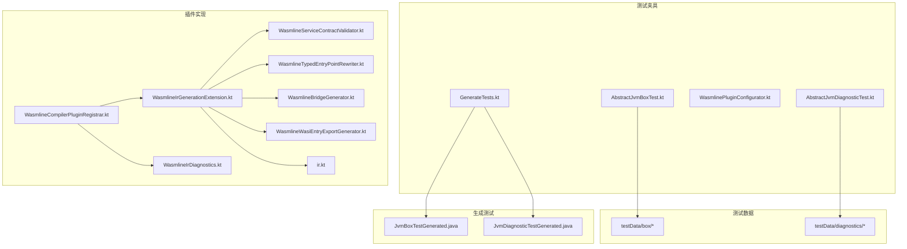
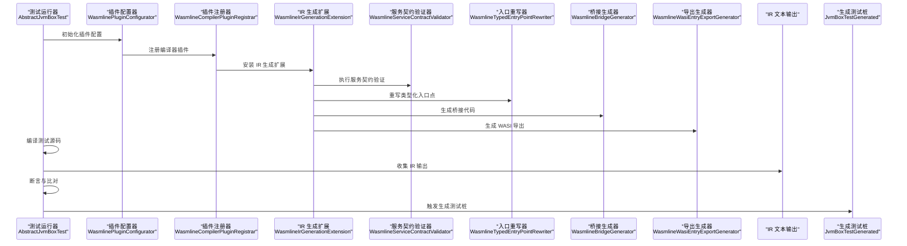
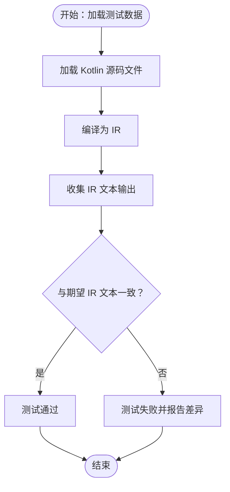
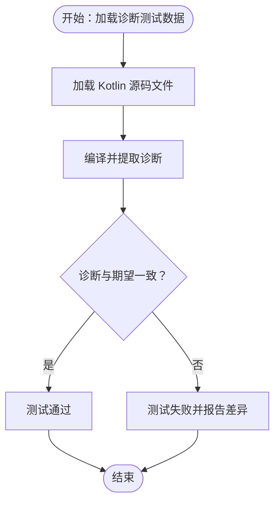
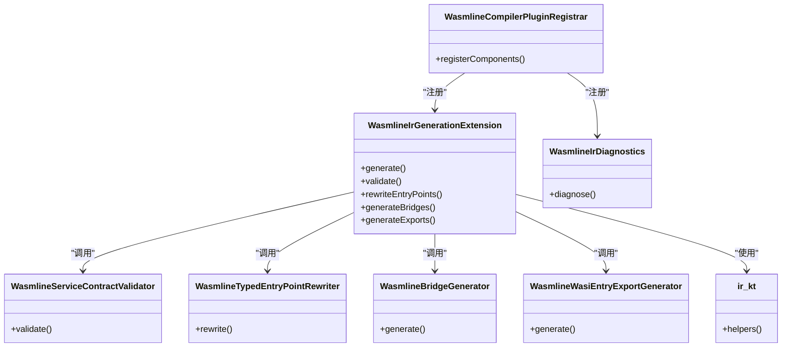
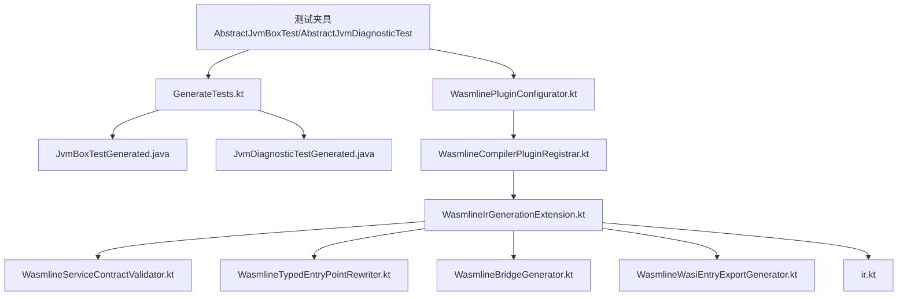

# IR 测试与盒测试

<cite>
**本文引用的文件**
- [wasmline-kotlin-plugin/test-fixtures/crow/wasmline/kotlin/runners/AbstractJvmBoxTest.kt](file://wasmline-multiplatform/wasmline-kotlin-plugin/test-fixtures/crow/wasmline/kotlin/runners/AbstractJvmBoxTest.kt)
- [wasmline-kotlin-plugin/test-fixtures/crow/wasmline/kotlin/runners/AbstractJvmDiagnosticTest.kt](file://wasmline-multiplatform/wasmline-kotlin-plugin/test-fixtures/crow/wasmline/kotlin/runners/AbstractJvmDiagnosticTest.kt)
- [wasmline-kotlin-plugin/test-fixtures/crow/wasmline/kotlin/services/WasmlinePluginConfigurator.kt](file://wasmline-multiplatform/wasmline-kotlin-plugin/test-fixtures/crow/wasmline/kotlin/services/WasmlinePluginConfigurator.kt)
- [wasmline-kotlin-plugin/test-fixtures/crow/wasmline/kotlin/GenerateTests.kt](file://wasmline-multiplatform/wasmline-kotlin-plugin/test-fixtures/crow/wasmline/kotlin/GenerateTests.kt)
- [wasmline-kotlin-plugin/testData/box/README.md](file://wasmline-multiplatform/wasmline-kotlin-plugin/testData/box/README.md)
- [wasmline-kotlin-plugin/testData/box/README_en.md](file://wasmline-multiplatform/wasmline-kotlin-plugin/testData/box/README_en.md)
- [wasmline-kotlin-plugin/testData/box/README_zh.md](file://wasmline-multiplatform/wasmline-kotlin-plugin/testData/box/README_zh.md)
- [wasmline-kotlin-plugin/testData/box/bindAsSelectsRequestedContract.kt](file://wasmline-multiplatform/wasmline-kotlin-plugin/testData/box/bindAsSelectsRequestedContract.kt)
- [wasmline-kotlin-plugin/testData/box/bindAsSelectsRequestedContract.fir.ir.txt](file://wasmline-multiplatform/wasmline-kotlin-plugin/testData/box/bindAsSelectsRequestedContract.fir.ir.txt)
- [wasmline-kotlin-plugin/testData/box/echoProxyRoundTrip.kt](file://wasmline-multiplatform/wasmline-kotlin-plugin/testData/box/echoProxyRoundTrip.kt)
- [wasmline-kotlin-plugin/testData/box/echoProxyRoundTrip.fir.ir.txt](file://wasmline-multiplatform/wasmline-kotlin-plugin/testData/box/echoProxyRoundTrip.fir.ir.txt)
- [wasmline-kotlin-plugin/testData/diagnostics/ambiguousBindImplementation.kt](file://wasmline-multiplatform/wasmline-kotlin-plugin/testData/diagnostics/ambiguousBindImplementation.kt)
- [wasmline-kotlin-plugin/testData/diagnostics/ambiguousBindImplementation.fir.txt](file://wasmline-multiplatform/wasmline-kotlin-plugin/testData/diagnostics/ambiguousBindImplementation.fir.txt)
- [wasmline-kotlin-plugin/src/main/kotlin/crow/wasmline/kotlin/WasmlineCompilerPluginRegistrar.kt](file://wasmline-multiplatform/wasmline-kotlin-plugin/src/main/kotlin/crow/wasmline/kotlin/WasmlineCompilerPluginRegistrar.kt)
- [wasmline-kotlin-plugin/src/main/kotlin/crow/wasmline/kotlin/WasmlineIrGenerationExtension.kt](file://wasmline-multiplatform/wasmline-kotlin-plugin/src/main/kotlin/crow/wasmline/kotlin/WasmlineIrGenerationExtension.kt)
- [wasmline-kotlin-plugin/src/main/kotlin/crow/wasmline/kotlin/WasmlineIrDiagnostics.kt](file://wasmline-multiplatform/wasmline-kotlin-plugin/src/main/kotlin/crow/wasmline/kotlin/WasmlineIrDiagnostics.kt)
- [wasmline-kotlin-plugin/src/main/kotlin/crow/wasmline/kotlin/WasmlineServiceContractValidator.kt](file://wasmline-multiplatform/wasmline-kotlin-plugin/src/main/kotlin/crow/wasmline/kotlin/WasmlineServiceContractValidator.kt)
- [wasmline-kotlin-plugin/src/main/kotlin/crow/wasmline/kotlin/WasmlineTypedEntryPointRewriter.kt](file://wasmline-multiplatform/wasmline-kotlin-plugin/src/main/kotlin/crow/wasmline/kotlin/WasmlineTypedEntryPointRewriter.kt)
- [wasmline-kotlin-plugin/src/main/kotlin/crow/wasmline/kotlin/WasmlineBridgeGenerator.kt](file://wasmline-multiplatform/wasmline-kotlin-plugin/src/main/kotlin/crow/wasmline/kotlin/WasmlineBridgeGenerator.kt)
- [wasmline-kotlin-plugin/src/main/kotlin/crow/wasmline/kotlin/WasmlineWasiEntryExportGenerator.kt](file://wasmline-multiplatform/wasmline-kotlin-plugin/src/main/kotlin/crow/wasmline/kotlin/WasmlineWasiEntryExportGenerator.kt)
- [wasmline-kotlin-plugin/src/main/kotlin/crow/wasmline/kotlin/ir.kt](file://wasmline-multiplatform/wasmline-kotlin-plugin/src/main/kotlin/crow/wasmline/kotlin/ir.kt)
- [wasmline-kotlin-plugin/test-gen/crow/wasmline/kotlin/runners/JvmBoxTestGenerated.java](file://wasmline-multiplatform/wasmline-kotlin-plugin/test-gen/crow/wasmline/kotlin/runners/JvmBoxTestGenerated.java)
- [wasmline-kotlin-plugin/test-gen/crow/wasmline/kotlin/runners/JvmDiagnosticTestGenerated.java](file://wasmline-multiplatform/wasmline-kotlin-plugin/test-gen/crow/wasmline/kotlin/runners/JvmDiagnosticTestGenerated.java)
</cite>

## 目录
1. [引言](#引言)
2. [项目结构](#项目结构)
3. [核心组件](#核心组件)
4. [架构总览](#架构总览)
5. [详细组件分析](#详细组件分析)
6. [依赖关系分析](#依赖关系分析)
7. [性能考量](#性能考量)
8. [故障排查指南](#故障排查指南)
9. [结论](#结论)
10. [附录](#附录)

## 引言
本文件面向编译器插件开发者与测试工程师，系统性阐述 Wasmline 在 Kotlin 编译器 IR 层的测试体系与盒测试（Box Test）机制。重点覆盖以下方面：
- test-data/box 与 test-data/diagnostics 的组织与用途
- 盒测试用例的编写规范、IR 输出验证与诊断测试流程
- 测试运行器与生成式测试的协作方式
- 关键测试基类与插件扩展点的职责边界
- 面向 IR 转换与类型验证的测试实践与最佳实践

## 项目结构
围绕 IR 测试与盒测试的核心目录与文件如下：
- test-fixtures：测试夹具与运行时支持，包含抽象测试基类、插件配置器与测试生成脚本
- testData：测试数据集，分为 box（盒测试）与 diagnostics（诊断测试）
- test-gen：由生成脚本产出的测试桩代码，供 IDE 与构建工具识别与执行
- 插件源码：实现 IR 生成扩展、诊断扩展、入口重写、桥接生成等能力



图表来源
- [wasmline-kotlin-plugin/test-fixtures/crow/wasmline/kotlin/runners/AbstractJvmBoxTest.kt](file://wasmline-multiplatform/wasmline-kotlin-plugin/test-fixtures/crow/wasmline/kotlin/runners/AbstractJvmBoxTest.kt)
- [wasmline-kotlin-plugin/test-fixtures/crow/wasmline/kotlin/runners/AbstractJvmDiagnosticTest.kt](file://wasmline-multiplatform/wasmline-kotlin-plugin/test-fixtures/crow/wasmline/kotlin/runners/AbstractJvmDiagnosticTest.kt)
- [wasmline-kotlin-plugin/test-fixtures/crow/wasmline/kotlin/services/WasmlinePluginConfigurator.kt](file://wasmline-multiplatform/wasmline-kotlin-plugin/test-fixtures/crow/wasmline/kotlin/services/WasmlinePluginConfigurator.kt)
- [wasmline-kotlin-plugin/test-fixtures/crow/wasmline/kotlin/GenerateTests.kt](file://wasmline-multiplatform/wasmline-kotlin-plugin/test-fixtures/crow/wasmline/kotlin/GenerateTests.kt)
- [wasmline-kotlin-plugin/testData/box/README.md](file://wasmline-multiplatform/wasmline-kotlin-plugin/testData/box/README.md)
- [wasmline-kotlin-plugin/testData/diagnostics/ambiguousBindImplementation.kt](file://wasmline-multiplatform/wasmline-kotlin-plugin/testData/diagnostics/ambiguousBindImplementation.kt)
- [wasmline-kotlin-plugin/src/main/kotlin/crow/wasmline/kotlin/WasmlineCompilerPluginRegistrar.kt](file://wasmline-multiplatform/wasmline-kotlin-plugin/src/main/kotlin/crow/wasmline/kotlin/WasmlineCompilerPluginRegistrar.kt)
- [wasmline-kotlin-plugin/src/main/kotlin/crow/wasmline/kotlin/WasmlineIrGenerationExtension.kt](file://wasmline-multiplatform/wasmline-kotlin-plugin/src/main/kotlin/crow/wasmline/kotlin/WasmlineIrGenerationExtension.kt)
- [wasmline-kotlin-plugin/src/main/kotlin/crow/wasmline/kotlin/WasmlineIrDiagnostics.kt](file://wasmline-multiplatform/wasmline-kotlin-plugin/src/main/kotlin/crow/wasmline/kotlin/WasmlineIrDiagnostics.kt)
- [wasmline-kotlin-plugin/src/main/kotlin/crow/wasmline/kotlin/WasmlineServiceContractValidator.kt](file://wasmline-multiplatform/wasmline-kotlin-plugin/src/main/kotlin/crow/wasmline/kotlin/WasmlineServiceContractValidator.kt)
- [wasmline-kotlin-plugin/src/main/kotlin/crow/wasmline/kotlin/WasmlineTypedEntryPointRewriter.kt](file://wasmline-multiplatform/wasmline-kotlin-plugin/src/main/kotlin/crow/wasmline/kotlin/WasmlineTypedEntryPointRewriter.kt)
- [wasmline-kotlin-plugin/src/main/kotlin/crow/wasmline/kotlin/WasmlineBridgeGenerator.kt](file://wasmline-multiplatform/wasmline-kotlin-plugin/src/main/kotlin/crow/wasmline/kotlin/WasmlineBridgeGenerator.kt)
- [wasmline-kotlin-plugin/src/main/kotlin/crow/wasmline/kotlin/WasmlineWasiEntryExportGenerator.kt](file://wasmline-multiplatform/wasmline-kotlin-plugin/src/main/kotlin/crow/wasmline/kotlin/WasmlineWasiEntryExportGenerator.kt)
- [wasmline-kotlin-plugin/src/main/kotlin/crow/wasmline/kotlin/ir.kt](file://wasmline-multiplatform/wasmline-kotlin-plugin/src/main/kotlin/crow/wasmline/kotlin/ir.kt)
- [wasmline-kotlin-plugin/test-gen/crow/wasmline/kotlin/runners/JvmBoxTestGenerated.java](file://wasmline-multiplatform/wasmline-kotlin-plugin/test-gen/crow/wasmline/kotlin/runners/JvmBoxTestGenerated.java)
- [wasmline-kotlin-plugin/test-gen/crow/wasmline/kotlin/runners/JvmDiagnosticTestGenerated.java](file://wasmline-multiplatform/wasmline-kotlin-plugin/test-gen/crow/wasmline/kotlin/runners/JvmDiagnosticTestGenerated.java)

章节来源
- [wasmline-kotlin-plugin/test-fixtures/crow/wasmline/kotlin/runners/AbstractJvmBoxTest.kt](file://wasmline-multiplatform/wasmline-kotlin-plugin/test-fixtures/crow/wasmline/kotlin/runners/AbstractJvmBoxTest.kt)
- [wasmline-kotlin-plugin/test-fixtures/crow/wasmline/kotlin/runners/AbstractJvmDiagnosticTest.kt](file://wasmline-multiplatform/wasmline-kotlin-plugin/test-fixtures/crow/wasmline/kotlin/runners/AbstractJvmDiagnosticTest.kt)
- [wasmline-kotlin-plugin/test-fixtures/crow/wasmline/kotlin/services/WasmlinePluginConfigurator.kt](file://wasmline-multiplatform/wasmline-kotlin-plugin/test-fixtures/crow/wasmline/kotlin/services/WasmlinePluginConfigurator.kt)
- [wasmline-kotlin-plugin/test-fixtures/crow/wasmline/kotlin/GenerateTests.kt](file://wasmline-multiplatform/wasmline-kotlin-plugin/test-fixtures/crow/wasmline/kotlin/GenerateTests.kt)
- [wasmline-kotlin-plugin/testData/box/README.md](file://wasmline-multiplatform/wasmline-kotlin-plugin/testData/box/README.md)
- [wasmline-kotlin-plugin/testData/diagnostics/ambiguousBindImplementation.kt](file://wasmline-multiplatform/wasmline-kotlin-plugin/testData/diagnostics/ambiguousBindImplementation.kt)

## 核心组件
- 抽象测试基类
  - AbstractJvmBoxTest：提供盒测试通用能力，负责加载测试数据、编译 Kotlin 源码、收集 IR 输出、执行断言与结果比对
  - AbstractJvmDiagnosticTest：提供诊断测试通用能力，负责校验编译期诊断信息是否符合预期
- 插件配置器：WasmlinePluginConfigurator 将 Wasmline 编译器插件注册到测试环境，确保 IR 生成与诊断扩展生效
- 测试生成器：GenerateTests.kt 通过扫描 testData 目录，生成 JvmBoxTestGenerated 与 JvmDiagnosticTestGenerated，使 IDE 与 Gradle 能识别并执行测试
- 插件扩展点：WasmlineCompilerPluginRegistrar 统一注册各扩展；WasmlineIrGenerationExtension、WasmlineIrDiagnostics、WasmlineServiceContractValidator、WasmlineTypedEntryPointRewriter、WasmlineBridgeGenerator、WasmlineWasiEntryExportGenerator、ir.kt 提供 IR 转换、诊断、桥接与导出等能力

章节来源
- [wasmline-kotlin-plugin/test-fixtures/crow/wasmline/kotlin/runners/AbstractJvmBoxTest.kt](file://wasmline-multiplatform/wasmline-kotlin-plugin/test-fixtures/crow/wasmline/kotlin/runners/AbstractJvmBoxTest.kt)
- [wasmline-kotlin-plugin/test-fixtures/crow/wasmline/kotlin/runners/AbstractJvmDiagnosticTest.kt](file://wasmline-multiplatform/wasmline-kotlin-plugin/test-fixtures/crow/wasmline/kotlin/runners/AbstractJvmDiagnosticTest.kt)
- [wasmline-kotlin-plugin/test-fixtures/crow/wasmline/kotlin/services/WasmlinePluginConfigurator.kt](file://wasmline-multiplatform/wasmline-kotlin-plugin/test-fixtures/crow/wasmline/kotlin/services/WasmlinePluginConfigurator.kt)
- [wasmline-kotlin-plugin/test-fixtures/crow/wasmline/kotlin/GenerateTests.kt](file://wasmline-multiplatform/wasmline-kotlin-plugin/test-fixtures/crow/wasmline/kotlin/GenerateTests.kt)
- [wasmline-kotlin-plugin/src/main/kotlin/crow/wasmline/kotlin/WasmlineCompilerPluginRegistrar.kt](file://wasmline-multiplatform/wasmline-kotlin-plugin/src/main/kotlin/crow/wasmline/kotlin/WasmlineCompilerPluginRegistrar.kt)
- [wasmline-kotlin-plugin/src/main/kotlin/crow/wasmline/kotlin/WasmlineIrGenerationExtension.kt](file://wasmline-multiplatform/wasmline-kotlin-plugin/src/main/kotlin/crow/wasmline/kotlin/WasmlineIrGenerationExtension.kt)
- [wasmline-kotlin-plugin/src/main/kotlin/crow/wasmline/kotlin/WasmlineIrDiagnostics.kt](file://wasmline-multiplatform/wasmline-kotlin-plugin/src/main/kotlin/crow/wasmline/kotlin/WasmlineIrDiagnostics.kt)
- [wasmline-kotlin-plugin/src/main/kotlin/crow/wasmline/kotlin/WasmlineServiceContractValidator.kt](file://wasmline-multiplatform/wasmline-kotlin-plugin/src/main/kotlin/crow/wasmline/kotlin/WasmlineServiceContractValidator.kt)
- [wasmline-kotlin-plugin/src/main/kotlin/crow/wasmline/kotlin/WasmlineTypedEntryPointRewriter.kt](file://wasmline-multiplatform/wasmline-kotlin-plugin/src/main/kotlin/crow/wasmline/kotlin/WasmlineTypedEntryPointRewriter.kt)
- [wasmline-kotlin-plugin/src/main/kotlin/crow/wasmline/kotlin/WasmlineBridgeGenerator.kt](file://wasmline-multiplatform/wasmline-kotlin-plugin/src/main/kotlin/crow/wasmline/kotlin/WasmlineBridgeGenerator.kt)
- [wasmline-kotlin-plugin/src/main/kotlin/crow/wasmline/kotlin/WasmlineWasiEntryExportGenerator.kt](file://wasmline-multiplatform/wasmline-kotlin-plugin/src/main/kotlin/crow/wasmline/kotlin/WasmlineWasiEntryExportGenerator.kt)
- [wasmline-kotlin-plugin/src/main/kotlin/crow/wasmline/kotlin/ir.kt](file://wasmline-multiplatform/wasmline-kotlin-plugin/src/main/kotlin/crow/wasmline/kotlin/ir.kt)

## 架构总览
下图展示从测试数据到 IR 输出再到断言验证的整体流程，以及插件扩展在其中的位置。



图表来源
- [wasmline-kotlin-plugin/test-fixtures/crow/wasmline/kotlin/runners/AbstractJvmBoxTest.kt](file://wasmline-multiplatform/wasmline-kotlin-plugin/test-fixtures/crow/wasmline/kotlin/runners/AbstractJvmBoxTest.kt)
- [wasmline-kotlin-plugin/test-fixtures/crow/wasmline/kotlin/services/WasmlinePluginConfigurator.kt](file://wasmline-multiplatform/wasmline-kotlin-plugin/test-fixtures/crow/wasmline/kotlin/services/WasmlinePluginConfigurator.kt)
- [wasmline-kotlin-plugin/src/main/kotlin/crow/wasmline/kotlin/WasmlineCompilerPluginRegistrar.kt](file://wasmline-multiplatform/wasmline-kotlin-plugin/src/main/kotlin/crow/wasmline/kotlin/WasmlineCompilerPluginRegistrar.kt)
- [wasmline-kotlin-plugin/src/main/kotlin/crow/wasmline/kotlin/WasmlineIrGenerationExtension.kt](file://wasmline-multiplatform/wasmline-kotlin-plugin/src/main/kotlin/crow/wasmline/kotlin/WasmlineIrGenerationExtension.kt)
- [wasmline-kotlin-plugin/src/main/kotlin/crow/wasmline/kotlin/WasmlineServiceContractValidator.kt](file://wasmline-multiplatform/wasmline-kotlin-plugin/src/main/kotlin/crow/wasmline/kotlin/WasmlineServiceContractValidator.kt)
- [wasmline-kotlin-plugin/src/main/kotlin/crow/wasmline/kotlin/WasmlineTypedEntryPointRewriter.kt](file://wasmline-multiplatform/wasmline-kotlin-plugin/src/main/kotlin/crow/wasmline/kotlin/WasmlineTypedEntryPointRewriter.kt)
- [wasmline-kotlin-plugin/src/main/kotlin/crow/wasmline/kotlin/WasmlineBridgeGenerator.kt](file://wasmline-multiplatform/wasmline-kotlin-plugin/src/main/kotlin/crow/wasmline/kotlin/WasmlineBridgeGenerator.kt)
- [wasmline-kotlin-plugin/src/main/kotlin/crow/wasmline/kotlin/WasmlineWasiEntryExportGenerator.kt](file://wasmline-multiplatform/wasmline-kotlin-plugin/src/main/kotlin/crow/wasmline/kotlin/WasmlineWasiEntryExportGenerator.kt)
- [wasmline-kotlin-plugin/test-gen/crow/wasmline/kotlin/runners/JvmBoxTestGenerated.java](file://wasmline-multiplatform/wasmline-kotlin-plugin/test-gen/crow/wasmline/kotlin/runners/JvmBoxTestGenerated.java)

## 详细组件分析

### 盒测试（Box Test）机制
盒测试用于验证编译器 IR 输出与运行时行为的正确性。其核心流程如下：
- 测试数据组织：每个测试以一组文件形式存在，通常包含 Kotlin 源码与对应的 IR 文本输出
- 编译与收集：测试运行器编译源码，收集 IR 输出文本
- 断言与比对：将实际 IR 输出与期望 IR 文本进行比对，失败则报告差异
- 生成测试桩：根据 testData 自动生成可执行的测试类，便于 IDE 与 CI 执行



图表来源
- [wasmline-kotlin-plugin/test-fixtures/crow/wasmline/kotlin/runners/AbstractJvmBoxTest.kt](file://wasmline-multiplatform/wasmline-kotlin-plugin/test-fixtures/crow/wasmline/kotlin/runners/AbstractJvmBoxTest.kt)
- [wasmline-kotlin-plugin/testData/box/README.md](file://wasmline-multiplatform/wasmline-kotlin-plugin/testData/box/README.md)
- [wasmline-kotlin-plugin/testData/box/README_en.md](file://wasmline-multiplatform/wasmline-kotlin-plugin/testData/box/README_en.md)
- [wasmline-kotlin-plugin/testData/box/README_zh.md](file://wasmline-multiplatform/wasmline-kotlin-plugin/testData/box/README_zh.md)

章节来源
- [wasmline-kotlin-plugin/test-fixtures/crow/wasmline/kotlin/runners/AbstractJvmBoxTest.kt](file://wasmline-multiplatform/wasmline-kotlin-plugin/test-fixtures/crow/wasmline/kotlin/runners/AbstractJvmBoxTest.kt)
- [wasmline-kotlin-plugin/testData/box/README.md](file://wasmline-multiplatform/wasmline-kotlin-plugin/testData/box/README.md)
- [wasmline-kotlin-plugin/testData/box/README_en.md](file://wasmline-multiplatform/wasmline-kotlin-plugin/testData/box/README_en.md)
- [wasmline-kotlin-plugin/testData/box/README_zh.md](file://wasmline-multiplatform/wasmline-kotlin-plugin/testData/box/README_zh.md)

### 诊断测试（Diagnostic Test）机制
诊断测试用于验证编译期诊断信息的准确性与完整性。其核心流程如下：
- 测试数据组织：包含 Kotlin 源码与期望的诊断文本
- 编译与诊断提取：编译源码并提取诊断信息
- 断言与比对：将实际诊断与期望诊断进行比对，失败则报告差异



图表来源
- [wasmline-kotlin-plugin/test-fixtures/crow/wasmline/kotlin/runners/AbstractJvmDiagnosticTest.kt](file://wasmline-multiplatform/wasmline-kotlin-plugin/test-fixtures/crow/wasmline/kotlin/runners/AbstractJvmDiagnosticTest.kt)
- [wasmline-kotlin-plugin/testData/diagnostics/ambiguousBindImplementation.fir.txt](file://wasmline-multiplatform/wasmline-kotlin-plugin/testData/diagnostics/ambiguousBindImplementation.fir.txt)

章节来源
- [wasmline-kotlin-plugin/test-fixtures/crow/wasmline/kotlin/runners/AbstractJvmDiagnosticTest.kt](file://wasmline-multiplatform/wasmline-kotlin-plugin/test-fixtures/crow/wasmline/kotlin/runners/AbstractJvmDiagnosticTest.kt)
- [wasmline-kotlin-plugin/testData/diagnostics/ambiguousBindImplementation.kt](file://wasmline-multiplatform/wasmline-kotlin-plugin/testData/diagnostics/ambiguousBindImplementation.kt)
- [wasmline-kotlin-plugin/testData/diagnostics/ambiguousBindImplementation.fir.txt](file://wasmline-multiplatform/wasmline-kotlin-plugin/testData/diagnostics/ambiguousBindImplementation.fir.txt)

### 测试用例示例分析

#### 示例一：bindAsSelectsRequestedContract
- 文件组成：包含 Kotlin 源码、FIR 文本与 FIR IR 文本
- 目标：验证特定绑定选择逻辑在 IR 中的表达与桥接生成行为
- 分析要点：对比 fir.txt 与 fir.ir.txt 的一致性，确认服务契约选择与桥接生成的 IR 表达

章节来源
- [wasmline-kotlin-plugin/testData/box/bindAsSelectsRequestedContract.kt](file://wasmline-multiplatform/wasmline-kotlin-plugin/testData/box/bindAsSelectsRequestedContract.kt)
- [wasmline-kotlin-plugin/testData/box/bindAsSelectsRequestedContract.fir.txt](file://wasmline-multiplatform/wasmline-kotlin-plugin/testData/box/bindAsSelectsRequestedContract.fir.txt)
- [wasmline-kotlin-plugin/testData/box/bindAsSelectsRequestedContract.fir.ir.txt](file://wasmline-multiplatform/wasmline-kotlin-plugin/testData/box/bindAsSelectsRequestedContract.fir.ir.txt)

#### 示例二：echoProxyRoundTrip
- 文件组成：包含 Kotlin 源码与对应 IR 文本
- 目标：验证代理往返调用在 IR 中的桥接与序列化表达
- 分析要点：关注 IR 中桥接调用与参数传递的形态，确保序列化路径正确

章节来源
- [wasmline-kotlin-plugin/testData/box/echoProxyRoundTrip.kt](file://wasmline-multiplatform/wasmline-kotlin-plugin/testData/box/echoProxyRoundTrip.kt)
- [wasmline-kotlin-plugin/testData/box/echoProxyRoundTrip.fir.ir.txt](file://wasmline-multiplatform/wasmline-kotlin-plugin/testData/box/echoProxyRoundTrip.fir.ir.txt)

#### 示例三：linkSelectsGeneratedBridge
- 文件组成：包含 Kotlin 源码与 IR 文本
- 目标：验证链接阶段对生成桥接的选择与整合
- 分析要点：确认 IR 中桥接链接与符号解析的正确性

章节来源
- [wasmline-kotlin-plugin/testData/box/linkSelectsGeneratedBridge.kt](file://wasmline-multiplatform/wasmline-kotlin-plugin/testData/box/linkSelectsGeneratedBridge.kt)
- [wasmline-kotlin-plugin/testData/box/linkSelectsGeneratedBridge.fir.ir.txt](file://wasmline-multiplatform/wasmline-kotlin-plugin/testData/box/linkSelectsGeneratedBridge.fir.ir.txt)

#### 示例四：zeroArgUnitBridgeRoundTrip
- 文件组成：包含 Kotlin 源码与 IR 文本
- 目标：验证无参单元类型桥接的往返调用 IR 形态
- 分析要点：关注空参数与单位类型的 IR 表达与桥接生成

章节来源
- [wasmline-kotlin-plugin/testData/box/zeroArgUnitBridgeRoundTrip.kt](file://wasmline-multiplatform/wasmline-kotlin-plugin/testData/box/zeroArgUnitBridgeRoundTrip.kt)
- [wasmline-kotlin-plugin/testData/box/zeroArgUnitBridgeRoundTrip.fir.ir.txt](file://wasmline-multiplatform/wasmline-kotlin-plugin/testData/box/zeroArgUnitBridgeRoundTrip.fir.ir.txt)

### 测试运行器与生成式测试
- AbstractJvmBoxTest 与 AbstractJvmDiagnosticTest 提供统一的测试生命周期与断言逻辑
- GenerateTests.kt 扫描 testData 目录，生成 JvmBoxTestGenerated 与 JvmDiagnosticTestGenerated，使测试可在 IDE 与 Gradle 中被发现与执行
- 插件配置器 WasmlinePluginConfigurator 确保编译器插件在测试环境中可用

```mermaid
sequenceDiagram
participant Gen as "GenerateTests.kt"
participant Box as "JvmBoxTestGenerated.java"
participant Diag as "JvmDiagnosticTestGenerated.java"
participant Runner as "AbstractJvmBoxTest/AbstractJvmDiagnosticTest"
participant Conf as "WasmlinePluginConfigurator"
Gen->>Box : 生成盒测试桩
Gen->>Diag : 生成诊断测试桩
Runner->>Conf : 初始化插件配置
Runner->>Runner : 执行测试用例
Runner-->>Box : 记录测试结果
Runner-->>Diag : 记录测试结果
```

图表来源
- [wasmline-kotlin-plugin/test-fixtures/crow/wasmline/kotlin/GenerateTests.kt](file://wasmline-multiplatform/wasmline-kotlin-plugin/test-fixtures/crow/wasmline/kotlin/GenerateTests.kt)
- [wasmline-kotlin-plugin/test-gen/crow/wasmline/kotlin/runners/JvmBoxTestGenerated.java](file://wasmline-multiplatform/wasmline-kotlin-plugin/test-gen/crow/wasmline/kotlin/runners/JvmBoxTestGenerated.java)
- [wasmline-kotlin-plugin/test-gen/crow/wasmline/kotlin/runners/JvmDiagnosticTestGenerated.java](file://wasmline-multiplatform/wasmline-kotlin-plugin/test-gen/crow/wasmline/kotlin/runners/JvmDiagnosticTestGenerated.java)
- [wasmline-kotlin-plugin/test-fixtures/crow/wasmline/kotlin/runners/AbstractJvmBoxTest.kt](file://wasmline-multiplatform/wasmline-kotlin-plugin/test-fixtures/crow/wasmline/kotlin/runners/AbstractJvmBoxTest.kt)
- [wasmline-kotlin-plugin/test-fixtures/crow/wasmline/kotlin/runners/AbstractJvmDiagnosticTest.kt](file://wasmline-multiplatform/wasmline-kotlin-plugin/test-fixtures/crow/wasmline/kotlin/runners/AbstractJvmDiagnosticTest.kt)
- [wasmline-kotlin-plugin/test-fixtures/crow/wasmline/kotlin/services/WasmlinePluginConfigurator.kt](file://wasmline-multiplatform/wasmline-kotlin-plugin/test-fixtures/crow/wasmline/kotlin/services/WasmlinePluginConfigurator.kt)

章节来源
- [wasmline-kotlin-plugin/test-fixtures/crow/wasmline/kotlin/GenerateTests.kt](file://wasmline-multiplatform/wasmline-kotlin-plugin/test-fixtures/crow/wasmline/kotlin/GenerateTests.kt)
- [wasmline-kotlin-plugin/test-gen/crow/wasmline/kotlin/runners/JvmBoxTestGenerated.java](file://wasmline-multiplatform/wasmline-kotlin-plugin/test-gen/crow/wasmline/kotlin/runners/JvmBoxTestGenerated.java)
- [wasmline-kotlin-plugin/test-gen/crow/wasmline/kotlin/runners/JvmDiagnosticTestGenerated.java](file://wasmline-multiplatform/wasmline-kotlin-plugin/test-gen/crow/wasmline/kotlin/runners/JvmDiagnosticTestGenerated.java)
- [wasmline-kotlin-plugin/test-fixtures/crow/wasmline/kotlin/runners/AbstractJvmBoxTest.kt](file://wasmline-multiplatform/wasmline-kotlin-plugin/test-fixtures/crow/wasmline/kotlin/runners/AbstractJvmBoxTest.kt)
- [wasmline-kotlin-plugin/test-fixtures/crow/wasmline/kotlin/runners/AbstractJvmDiagnosticTest.kt](file://wasmline-multiplatform/wasmline-kotlin-plugin/test-fixtures/crow/wasmline/kotlin/runners/AbstractJvmDiagnosticTest.kt)
- [wasmline-kotlin-plugin/test-fixtures/crow/wasmline/kotlin/services/WasmlinePluginConfigurator.kt](file://wasmline-multiplatform/wasmline-kotlin-plugin/test-fixtures/crow/wasmline/kotlin/services/WasmlinePluginConfigurator.kt)

### 插件扩展与 IR 转换
- WasmlineCompilerPluginRegistrar：统一注册编译器插件，确保后续扩展生效
- WasmlineIrGenerationExtension：实现 IR 生成扩展，负责将服务契约转换为 IR，并集成桥接生成、入口重写与导出生成
- WasmlineIrDiagnostics：提供 IR 相关诊断能力
- WasmlineServiceContractValidator：在 IR 生成前验证服务契约合法性
- WasmlineTypedEntryPointRewriter：重写类型化入口点，保证桥接与序列化的类型安全
- WasmlineBridgeGenerator：生成桥接代码，支撑跨平台调用
- WasmlineWasiEntryExportGenerator：生成 WASI 入口导出，适配目标平台
- ir.kt：IR 工具函数与辅助定义



图表来源
- [wasmline-kotlin-plugin/src/main/kotlin/crow/wasmline/kotlin/WasmlineCompilerPluginRegistrar.kt](file://wasmline-multiplatform/wasmline-kotlin-plugin/src/main/kotlin/crow/wasmline/kotlin/WasmlineCompilerPluginRegistrar.kt)
- [wasmline-kotlin-plugin/src/main/kotlin/crow/wasmline/kotlin/WasmlineIrGenerationExtension.kt](file://wasmline-multiplatform/wasmline-kotlin-plugin/src/main/kotlin/crow/wasmline/kotlin/WasmlineIrGenerationExtension.kt)
- [wasmline-kotlin-plugin/src/main/kotlin/crow/wasmline/kotlin/WasmlineIrDiagnostics.kt](file://wasmline-multiplatform/wasmline-kotlin-plugin/src/main/kotlin/crow/wasmline/kotlin/WasmlineIrDiagnostics.kt)
- [wasmline-kotlin-plugin/src/main/kotlin/crow/wasmline/kotlin/WasmlineServiceContractValidator.kt](file://wasmline-multiplatform/wasmline-kotlin-plugin/src/main/kotlin/crow/wasmline/kotlin/WasmlineServiceContractValidator.kt)
- [wasmline-kotlin-plugin/src/main/kotlin/crow/wasmline/kotlin/WasmlineTypedEntryPointRewriter.kt](file://wasmline-multiplatform/wasmline-kotlin-plugin/src/main/kotlin/crow/wasmline/kotlin/WasmlineTypedEntryPointRewriter.kt)
- [wasmline-kotlin-plugin/src/main/kotlin/crow/wasmline/kotlin/WasmlineBridgeGenerator.kt](file://wasmline-multiplatform/wasmline-kotlin-plugin/src/main/kotlin/crow/wasmline/kotlin/WasmlineBridgeGenerator.kt)
- [wasmline-kotlin-plugin/src/main/kotlin/crow/wasmline/kotlin/WasmlineWasiEntryExportGenerator.kt](file://wasmline-multiplatform/wasmline-kotlin-plugin/src/main/kotlin/crow/wasmline/kotlin/WasmlineWasiEntryExportGenerator.kt)
- [wasmline-kotlin-plugin/src/main/kotlin/crow/wasmline/kotlin/ir.kt](file://wasmline-multiplatform/wasmline-kotlin-plugin/src/main/kotlin/crow/wasmline/kotlin/ir.kt)

章节来源
- [wasmline-kotlin-plugin/src/main/kotlin/crow/wasmline/kotlin/WasmlineCompilerPluginRegistrar.kt](file://wasmline-multiplatform/wasmline-kotlin-plugin/src/main/kotlin/crow/wasmline/kotlin/WasmlineCompilerPluginRegistrar.kt)
- [wasmline-kotlin-plugin/src/main/kotlin/crow/wasmline/kotlin/WasmlineIrGenerationExtension.kt](file://wasmline-multiplatform/wasmline-kotlin-plugin/src/main/kotlin/crow/wasmline/kotlin/WasmlineIrGenerationExtension.kt)
- [wasmline-kotlin-plugin/src/main/kotlin/crow/wasmline/kotlin/WasmlineIrDiagnostics.kt](file://wasmline-multiplatform/wasmline-kotlin-plugin/src/main/kotlin/crow/wasmline/kotlin/WasmlineIrDiagnostics.kt)
- [wasmline-kotlin-plugin/src/main/kotlin/crow/wasmline/kotlin/WasmlineServiceContractValidator.kt](file://wasmline-multiplatform/wasmline-kotlin-plugin/src/main/kotlin/crow/wasmline/kotlin/WasmlineServiceContractValidator.kt)
- [wasmline-kotlin-plugin/src/main/kotlin/crow/wasmline/kotlin/WasmlineTypedEntryPointRewriter.kt](file://wasmline-multiplatform/wasmline-kotlin-plugin/src/main/kotlin/crow/wasmline/kotlin/WasmlineTypedEntryPointRewriter.kt)
- [wasmline-kotlin-plugin/src/main/kotlin/crow/wasmline/kotlin/WasmlineBridgeGenerator.kt](file://wasmline-multiplatform/wasmline-kotlin-plugin/src/main/kotlin/crow/wasmline/kotlin/WasmlineBridgeGenerator.kt)
- [wasmline-kotlin-plugin/src/main/kotlin/crow/wasmline/kotlin/WasmlineWasiEntryExportGenerator.kt](file://wasmline-multiplatform/wasmline-kotlin-plugin/src/main/kotlin/crow/wasmline/kotlin/WasmlineWasiEntryExportGenerator.kt)
- [wasmline-kotlin-plugin/src/main/kotlin/crow/wasmline/kotlin/ir.kt](file://wasmline-multiplatform/wasmline-kotlin-plugin/src/main/kotlin/crow/wasmline/kotlin/ir.kt)

## 依赖关系分析
- 测试夹具依赖于插件配置器与生成器，以确保测试环境具备编译器插件能力
- 插件扩展之间存在明确的调用顺序：先验证契约，再重写入口点，随后生成桥接与导出
- 生成测试桩依赖于 testData 的结构化命名约定，确保自动发现与执行



图表来源
- [wasmline-kotlin-plugin/test-fixtures/crow/wasmline/kotlin/runners/AbstractJvmBoxTest.kt](file://wasmline-multiplatform/wasmline-kotlin-plugin/test-fixtures/crow/wasmline/kotlin/runners/AbstractJvmBoxTest.kt)
- [wasmline-kotlin-plugin/test-fixtures/crow/wasmline/kotlin/runners/AbstractJvmDiagnosticTest.kt](file://wasmline-multiplatform/wasmline-kotlin-plugin/test-fixtures/crow/wasmline/kotlin/runners/AbstractJvmDiagnosticTest.kt)
- [wasmline-kotlin-plugin/test-fixtures/crow/wasmline/kotlin/GenerateTests.kt](file://wasmline-multiplatform/wasmline-kotlin-plugin/test-fixtures/crow/wasmline/kotlin/GenerateTests.kt)
- [wasmline-kotlin-plugin/test-fixtures/crow/wasmline/kotlin/services/WasmlinePluginConfigurator.kt](file://wasmline-multiplatform/wasmline-kotlin-plugin/test-fixtures/crow/wasmline/kotlin/services/WasmlinePluginConfigurator.kt)
- [wasmline-kotlin-plugin/src/main/kotlin/crow/wasmline/kotlin/WasmlineCompilerPluginRegistrar.kt](file://wasmline-multiplatform/wasmline-kotlin-plugin/src/main/kotlin/crow/wasmline/kotlin/WasmlineCompilerPluginRegistrar.kt)
- [wasmline-kotlin-plugin/src/main/kotlin/crow/wasmline/kotlin/WasmlineIrGenerationExtension.kt](file://wasmline-multiplatform/wasmline-kotlin-plugin/src/main/kotlin/crow/wasmline/kotlin/WasmlineIrGenerationExtension.kt)
- [wasmline-kotlin-plugin/src/main/kotlin/crow/wasmline/kotlin/WasmlineServiceContractValidator.kt](file://wasmline-multiplatform/wasmline-kotlin-plugin/src/main/kotlin/crow/wasmline/kotlin/WasmlineServiceContractValidator.kt)
- [wasmline-kotlin-plugin/src/main/kotlin/crow/wasmline/kotlin/WasmlineTypedEntryPointRewriter.kt](file://wasmline-multiplatform/wasmline-kotlin-plugin/src/main/kotlin/crow/wasmline/kotlin/WasmlineTypedEntryPointRewriter.kt)
- [wasmline-kotlin-plugin/src/main/kotlin/crow/wasmline/kotlin/WasmlineBridgeGenerator.kt](file://wasmline-multiplatform/wasmline-kotlin-plugin/src/main/kotlin/crow/wasmline/kotlin/WasmlineBridgeGenerator.kt)
- [wasmline-kotlin-plugin/src/main/kotlin/crow/wasmline/kotlin/WasmlineWasiEntryExportGenerator.kt](file://wasmline-multiplatform/wasmline-kotlin-plugin/src/main/kotlin/crow/wasmline/kotlin/WasmlineWasiEntryExportGenerator.kt)
- [wasmline-kotlin-plugin/src/main/kotlin/crow/wasmline/kotlin/ir.kt](file://wasmline-multiplatform/wasmline-kotlin-plugin/src/main/kotlin/crow/wasmline/kotlin/ir.kt)
- [wasmline-kotlin-plugin/test-gen/crow/wasmline/kotlin/runners/JvmBoxTestGenerated.java](file://wasmline-multiplatform/wasmline-kotlin-plugin/test-gen/crow/wasmline/kotlin/runners/JvmBoxTestGenerated.java)
- [wasmline-kotlin-plugin/test-gen/crow/wasmline/kotlin/runners/JvmDiagnosticTestGenerated.java](file://wasmline-multiplatform/wasmline-kotlin-plugin/test-gen/crow/wasmline/kotlin/runners/JvmDiagnosticTestGenerated.java)

章节来源
- [wasmline-kotlin-plugin/test-fixtures/crow/wasmline/kotlin/runners/AbstractJvmBoxTest.kt](file://wasmline-multiplatform/wasmline-kotlin-plugin/test-fixtures/crow/wasmline/kotlin/runners/AbstractJvmBoxTest.kt)
- [wasmline-kotlin-plugin/test-fixtures/crow/wasmline/kotlin/runners/AbstractJvmDiagnosticTest.kt](file://wasmline-multiplatform/wasmline-kotlin-plugin/test-fixtures/crow/wasmline/kotlin/runners/AbstractJvmDiagnosticTest.kt)
- [wasmline-kotlin-plugin/test-fixtures/crow/wasmline/kotlin/GenerateTests.kt](file://wasmline-multiplatform/wasmline-kotlin-plugin/test-fixtures/crow/wasmline/kotlin/GenerateTests.kt)
- [wasmline-kotlin-plugin/test-fixtures/crow/wasmline/kotlin/services/WasmlinePluginConfigurator.kt](file://wasmline-multiplatform/wasmline-kotlin-plugin/test-fixtures/crow/wasmline/kotlin/services/WasmlinePluginConfigurator.kt)
- [wasmline-kotlin-plugin/src/main/kotlin/crow/wasmline/kotlin/WasmlineCompilerPluginRegistrar.kt](file://wasmline-multiplatform/wasmline-kotlin-plugin/src/main/kotlin/crow/wasmline/kotlin/WasmlineCompilerPluginRegistrar.kt)
- [wasmline-kotlin-plugin/src/main/kotlin/crow/wasmline/kotlin/WasmlineIrGenerationExtension.kt](file://wasmline-multiplatform/wasmline-kotlin-plugin/src/main/kotlin/crow/wasmline/kotlin/WasmlineIrGenerationExtension.kt)
- [wasmline-kotlin-plugin/src/main/kotlin/crow/wasmline/kotlin/WasmlineServiceContractValidator.kt](file://wasmline-multiplatform/wasmline-kotlin-plugin/src/main/kotlin/crow/wasmline/kotlin/WasmlineServiceContractValidator.kt)
- [wasmline-kotlin-plugin/src/main/kotlin/crow/wasmline/kotlin/WasmlineTypedEntryPointRewriter.kt](file://wasmline-multiplatform/wasmline-kotlin-plugin/src/main/kotlin/crow/wasmline/kotlin/WasmlineTypedEntryPointRewriter.kt)
- [wasmline-kotlin-plugin/src/main/kotlin/crow/wasmline/kotlin/WasmlineBridgeGenerator.kt](file://wasmline-multiplatform/wasmline-kotlin-plugin/src/main/kotlin/crow/wasmline/kotlin/WasmlineBridgeGenerator.kt)
- [wasmline-kotlin-plugin/src/main/kotlin/crow/wasmline/kotlin/WasmlineWasiEntryExportGenerator.kt](file://wasmline-multiplatform/wasmline-kotlin-plugin/src/main/kotlin/crow/wasmline/kotlin/WasmlineWasiEntryExportGenerator.kt)
- [wasmline-kotlin-plugin/src/main/kotlin/crow/wasmline/kotlin/ir.kt](file://wasmline-multiplatform/wasmline-kotlin-plugin/src/main/kotlin/crow/wasmline/kotlin/ir.kt)
- [wasmline-kotlin-plugin/test-gen/crow/wasmline/kotlin/runners/JvmBoxTestGenerated.java](file://wasmline-multiplatform/wasmline-kotlin-plugin/test-gen/crow/wasmline/kotlin/runners/JvmBoxTestGenerated.java)
- [wasmline-kotlin-plugin/test-gen/crow/wasmline/kotlin/runners/JvmDiagnosticTestGenerated.java](file://wasmline-multiplatform/wasmline-kotlin-plugin/test-gen/crow/wasmline/kotlin/runners/JvmDiagnosticTestGenerated.java)

## 性能考量
- 测试数据规模与生成测试桩数量成正比，建议按功能域拆分测试目录，避免单次生成过多测试类
- IR 输出比对应尽量聚焦关键 IR 片段，减少无关噪声导致的比对开销
- 插件扩展链路较长时，可通过增量编译与缓存策略降低重复工作量

## 故障排查指南
- 测试无法发现或执行
  - 检查 GenerateTests.kt 是否成功生成 JvmBoxTestGenerated 与 JvmDiagnosticTestGenerated
  - 确认 WasmlinePluginConfigurator 已在测试初始化中调用
- IR 输出不一致
  - 对照 testData 中的 .fir.ir.txt 与 .fir.txt，定位差异点
  - 检查 WasmlineIrGenerationExtension 的生成逻辑与 WasmlineBridgeGenerator 的桥接生成
- 诊断信息不符
  - 对照 testData 中的 .kt 与 .fir.txt，确认诊断消息与位置
  - 检查 WasmlineIrDiagnostics 的诊断扩展是否正确安装

章节来源
- [wasmline-kotlin-plugin/test-fixtures/crow/wasmline/kotlin/GenerateTests.kt](file://wasmline-multiplatform/wasmline-kotlin-plugin/test-fixtures/crow/wasmline/kotlin/GenerateTests.kt)
- [wasmline-kotlin-plugin/test-fixtures/crow/wasmline/kotlin/services/WasmlinePluginConfigurator.kt](file://wasmline-multiplatform/wasmline-kotlin-plugin/test-fixtures/crow/wasmline/kotlin/services/WasmlinePluginConfigurator.kt)
- [wasmline-kotlin-plugin/src/main/kotlin/crow/wasmline/kotlin/WasmlineIrGenerationExtension.kt](file://wasmline-multiplatform/wasmline-kotlin-plugin/src/main/kotlin/crow/wasmline/kotlin/WasmlineIrGenerationExtension.kt)
- [wasmline-kotlin-plugin/src/main/kotlin/crow/wasmline/kotlin/WasmlineIrDiagnostics.kt](file://wasmline-multiplatform/wasmline-kotlin-plugin/src/main/kotlin/crow/wasmline/kotlin/WasmlineIrDiagnostics.kt)

## 结论
Wasmline 的 IR 测试与盒测试体系通过标准化的测试数据组织、生成式测试桩与插件扩展链路，实现了对编译器 IR 转换与诊断信息的自动化验证。遵循本文档的编写规范与最佳实践，可高效地扩展 IR 测试覆盖面，提升插件质量与稳定性。

## 附录
- 测试数据目录说明
  - box：包含盒测试用例，每个用例由 Kotlin 源码与对应 IR 文本组成
  - diagnostics：包含诊断测试用例，每个用例由 Kotlin 源码与期望诊断文本组成
- 建议的测试编写流程
  - 在 testData/box 或 testData/diagnostics 下新增用例文件
  - 使用 GenerateTests.kt 生成测试桩
  - 运行 AbstractJvmBoxTest 或 AbstractJvmDiagnosticTest 执行测试
  - 根据失败信息调整插件扩展或用例期望