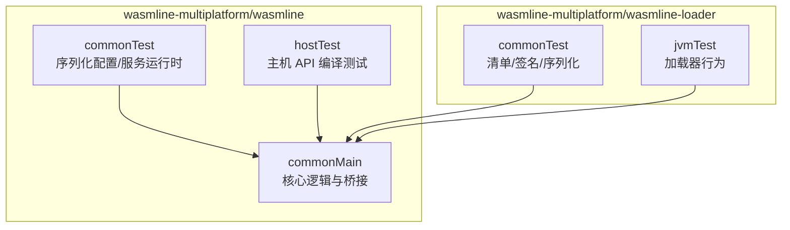
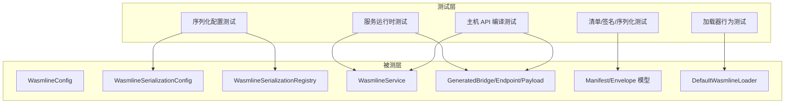
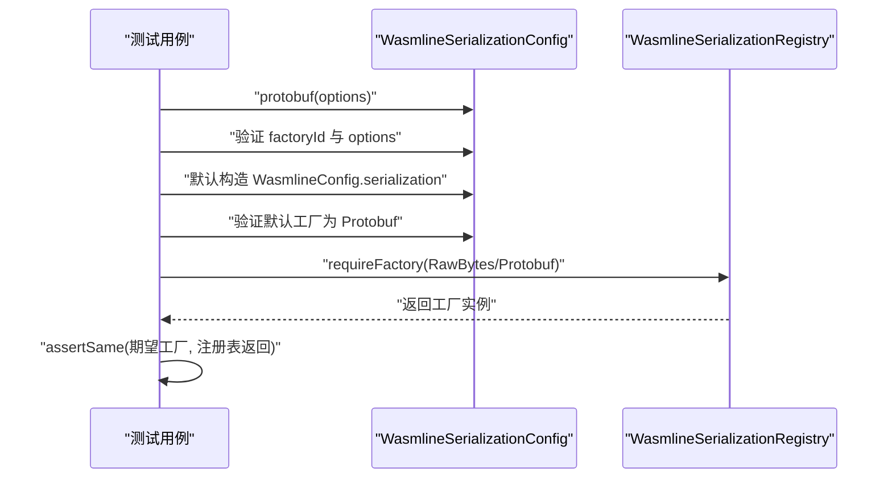
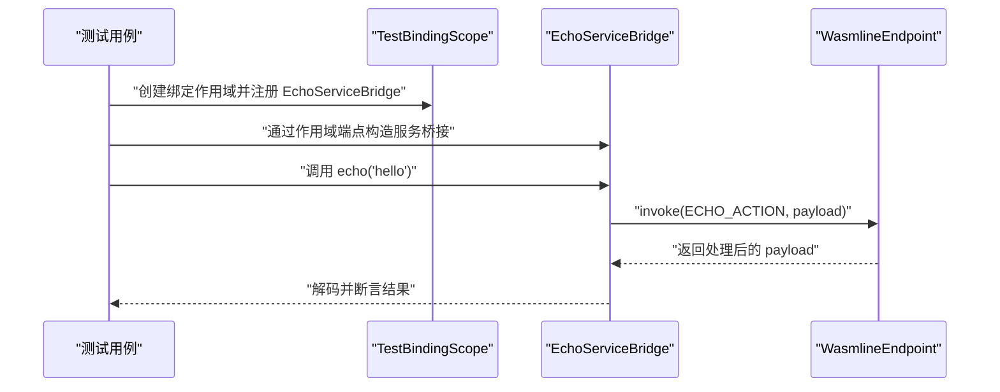
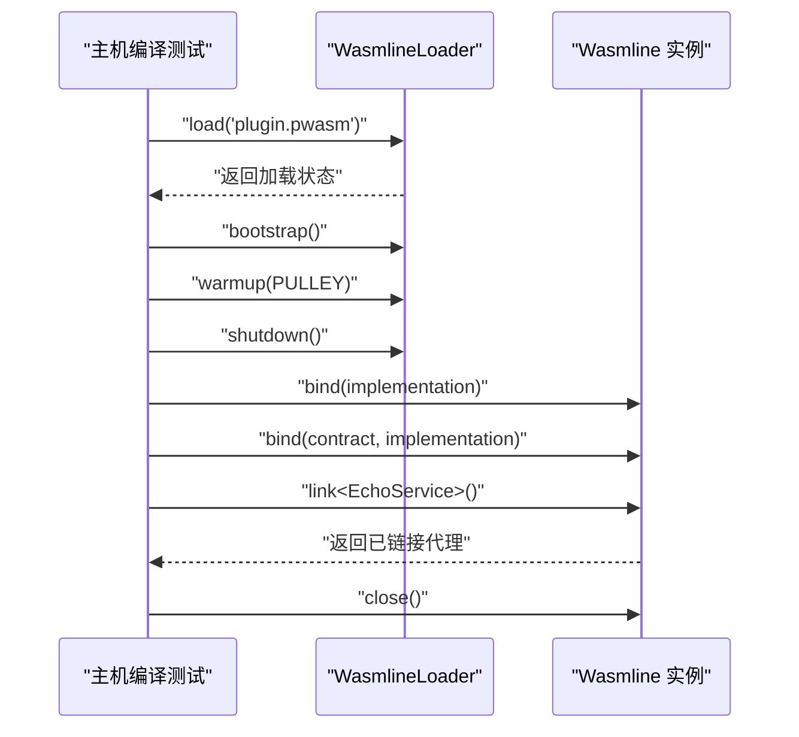
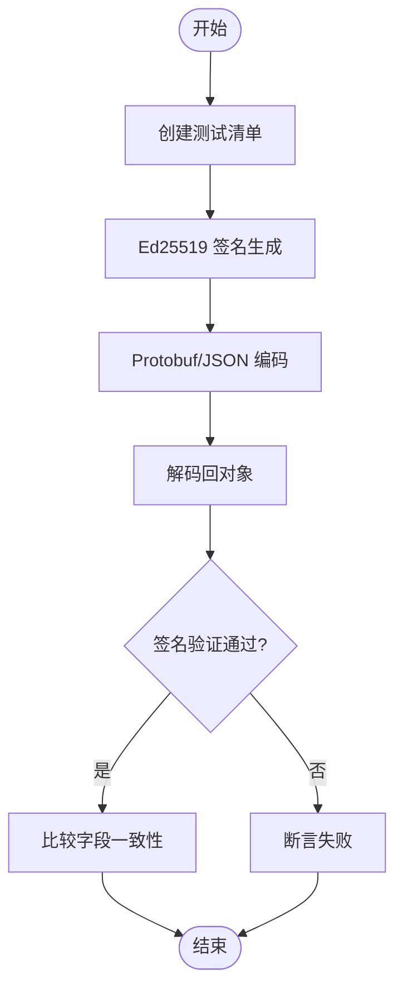
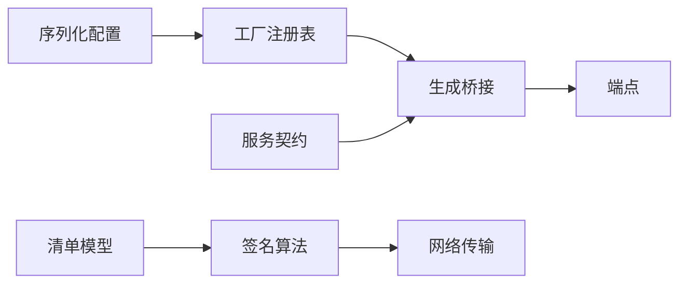

# 单元测试

<cite>
**本文引用的文件**
- [WasmlineSerializationConfigTest.kt](file://wasmline-multiplatform/wasmline/src/commonTest/kotlin/crow/wasmline/WasmlineSerializationConfigTest.kt)
- [WasmlineServiceRuntimeTest.kt](file://wasmline-multiplatform/wasmline/src/commonTest/kotlin/crow/wasmline/WasmlineServiceRuntimeTest.kt)
- [WasmlineHostApiCompileTest.kt](file://wasmline-multiplatform/wasmline/src/hostTest/kotlin/crow/wasmline/WasmlineHostApiCompileTest.kt)
- [ManifestTest.kt](file://wasmline-multiplatform/wasmline-loader/src/commonTest/kotlin/crow/wasmline/ManifestTest.kt)
- [DefaultWasmlineLoaderTest.kt](file://wasmline-multiplatform/wasmline-loader/src/jvmTest/kotlin/crow/wasmline/loader/DefaultWasmlineLoaderTest.kt)
- [WasmlineSerializationConfig.kt](file://wasmline-multiplatform/wasmline/src/commonMain/kotlin/crow/wasmline/serialization/WasmlineSerializationConfig.kt)
- [WasmlineConfig.kt](file://wasmline-multiplatform/wasmline/src/commonMain/kotlin/crow/wasmline/WasmlineConfig.kt)
- [WasmlineSerializationRegistry.kt](file://wasmline-multiplatform/wasmline/src/commonMain/kotlin/crow/wasmline/serialization/WasmlineSerializationRegistry.kt)
- [WasmlineService.kt](file://wasmline-multiplatform/wasmline/src/commonMain/kotlin/crow/wasmline/WasmlineService.kt)
- [GeneratedBridge.kt](file://wasmline-multiplatform/wasmline/src/commonMain/kotlin/crow/wasmline/internal/bridge/GeneratedBridge.kt)
- [Endpoint.kt](file://wasmline-multiplatform/wasmline/src/commonMain/kotlin/crow/wasmline/internal/bridge/Endpoint.kt)
- [Payload.kt](file://wasmline-multiplatform/wasmline/src/commonMain/kotlin/crow/wasmline/internal/bridge/Payload.kt)
</cite>

## 目录
1. [引言](#引言)
2. [项目结构](#项目结构)
3. [核心组件](#核心组件)
4. [架构总览](#架构总览)
5. [详细组件分析](#详细组件分析)
6. [依赖分析](#依赖分析)
7. [性能考虑](#性能考虑)
8. [故障排查指南](#故障排查指南)
9. [结论](#结论)
10. [附录](#附录)

## 引言
本指南面向 Wasmline 多平台模块的单元测试编写与执行，系统性说明测试组织结构（commonTest、hostTest 等）、测试框架选择与配置、断言最佳实践、测试数据准备策略，并给出覆盖范围建议与执行命令。文档同时提供针对服务运行时、序列化配置、主机 API 编译等核心功能的测试用例编写思路与调试技巧，帮助开发者高效落地高质量的单元测试。

## 项目结构
Wasmline 的多平台模块在 wasmline-multiplatform 中采用 Kotlin Multiplatform 标准目录组织，测试主要分布在以下位置：
- commonTest：跨平台通用测试，如序列化配置与服务运行时行为验证
- hostTest：主机侧 API 可编译性测试，确保主机侧接口在目标平台上可被成功绑定与链接
- jvmTest：特定于 JVM 平台的实现细节测试，如加载器行为
- commonMain：被测试的业务与桥接代码位于 commonMain 下的对应包中

图表来源
- [WasmlineSerializationConfigTest.kt:1-43](file://wasmline-multiplatform/wasmline/src/commonTest/kotlin/crow/wasmline/WasmlineSerializationConfigTest.kt#L1-L43)
- [WasmlineServiceRuntimeTest.kt:1-137](file://wasmline-multiplatform/wasmline/src/commonTest/kotlin/crow/wasmline/WasmlineServiceRuntimeTest.kt#L1-L137)
- [WasmlineHostApiCompileTest.kt:1-40](file://wasmline-multiplatform/wasmline/src/hostTest/kotlin/crow/wasmline/WasmlineHostApiCompileTest.kt#L1-L40)
- [ManifestTest.kt:1-391](file://wasmline-multiplatform/wasmline-loader/src/commonTest/kotlin/crow/wasmline/ManifestTest.kt#L1-L391)
- [DefaultWasmlineLoaderTest.kt:1-135](file://wasmline-multiplatform/wasmline-loader/src/jvmTest/kotlin/crow/wasmline/loader/DefaultWasmlineLoaderTest.kt#L1-L135)

章节来源
- [WasmlineSerializationConfigTest.kt:1-43](file://wasmline-multiplatform/wasmline/src/commonTest/kotlin/crow/wasmline/WasmlineSerializationConfigTest.kt#L1-L43)
- [WasmlineServiceRuntimeTest.kt:1-137](file://wasmline-multiplatform/wasmline/src/commonTest/kotlin/crow/wasmline/WasmlineServiceRuntimeTest.kt#L1-L137)
- [WasmlineHostApiCompileTest.kt:1-40](file://wasmline-multiplatform/wasmline/src/hostTest/kotlin/crow/wasmline/WasmlineHostApiCompileTest.kt#L1-L40)
- [ManifestTest.kt:1-391](file://wasmline-multiplatform/wasmline-loader/src/commonTest/kotlin/crow/wasmline/ManifestTest.kt#L1-L391)
- [DefaultWasmlineLoaderTest.kt:1-135](file://wasmline-multiplatform/wasmline-loader/src/jvmTest/kotlin/crow/wasmline/loader/DefaultWasmlineLoaderTest.kt#L1-L135)

## 核心组件
- 序列化配置与注册
  - WasmlineSerializationConfig：定义序列化工厂 ID 与选项，默认使用 Protobuf
  - WasmlineSerializationRegistry：内置原生字节与 Protobuf 工厂注册表
  - WasmlineConfig：统一配置入口，包含序列化、并发支持、网络客户端、可信密钥与缓存
- 服务与桥接
  - WasmlineService：服务契约标记接口
  - GeneratedBridge/Endpoint/Payload：生成桥接、端点与空载荷辅助工具
- 加载器与清单
  - ManifestTest：清单模型、签名与序列化往返测试
  - DefaultWasmlineLoaderTest：加载器在本地/远程源上的行为与错误处理

章节来源
- [WasmlineSerializationConfig.kt:1-40](file://wasmline-multiplatform/wasmline/src/commonMain/kotlin/crow/wasmline/serialization/WasmlineSerializationConfig.kt#L1-L40)
- [WasmlineConfig.kt:1-25](file://wasmline-multiplatform/wasmline/src/commonMain/kotlin/crow/wasmline/WasmlineConfig.kt#L1-L25)
- [WasmlineSerializationRegistry.kt:1-21](file://wasmline-multiplatform/wasmline/src/commonMain/kotlin/crow/wasmline/serialization/WasmlineSerializationRegistry.kt#L1-L21)
- [WasmlineService.kt:1-25](file://wasmline-multiplatform/wasmline/src/commonMain/kotlin/crow/wasmline/WasmlineService.kt#L1-L25)
- [GeneratedBridge.kt:1-45](file://wasmline-multiplatform/wasmline/src/commonMain/kotlin/crow/wasmline/internal/bridge/GeneratedBridge.kt#L1-L45)
- [Endpoint.kt:1-8](file://wasmline-multiplatform/wasmline/src/commonMain/kotlin/crow/wasmline/internal/bridge/Endpoint.kt#L1-L8)
- [Payload.kt:1-9](file://wasmline-multiplatform/wasmline/src/commonMain/kotlin/crow/wasmline/internal/bridge/Payload.kt#L1-L9)

## 架构总览
下图展示了测试与被测组件之间的关系：测试通过调用被测 API 验证行为，同时利用内部桥接与序列化机制完成端到端验证。

图表来源
- [WasmlineSerializationConfigTest.kt:1-43](file://wasmline-multiplatform/wasmline/src/commonTest/kotlin/crow/wasmline/WasmlineSerializationConfigTest.kt#L1-L43)
- [WasmlineServiceRuntimeTest.kt:1-137](file://wasmline-multiplatform/wasmline/src/commonTest/kotlin/crow/wasmline/WasmlineServiceRuntimeTest.kt#L1-L137)
- [WasmlineHostApiCompileTest.kt:1-40](file://wasmline-multiplatform/wasmline/src/hostTest/kotlin/crow/wasmline/WasmlineHostApiCompileTest.kt#L1-L40)
- [ManifestTest.kt:1-391](file://wasmline-multiplatform/wasmline-loader/src/commonTest/kotlin/crow/wasmline/ManifestTest.kt#L1-L391)
- [DefaultWasmlineLoaderTest.kt:1-135](file://wasmline-multiplatform/wasmline-loader/src/jvmTest/kotlin/crow/wasmline/loader/DefaultWasmlineLoaderTest.kt#L1-L135)
- [WasmlineConfig.kt:1-25](file://wasmline-multiplatform/wasmline/src/commonMain/kotlin/crow/wasmline/WasmlineConfig.kt#L1-L25)
- [WasmlineSerializationConfig.kt:1-40](file://wasmline-multiplatform/wasmline/src/commonMain/kotlin/crow/wasmline/serialization/WasmlineSerializationConfig.kt#L1-L40)
- [WasmlineSerializationRegistry.kt:1-21](file://wasmline-multiplatform/wasmline/src/commonMain/kotlin/crow/wasmline/serialization/WasmlineSerializationRegistry.kt#L1-L21)
- [WasmlineService.kt:1-25](file://wasmline-multiplatform/wasmline/src/commonMain/kotlin/crow/wasmline/WasmlineService.kt#L1-L25)
- [GeneratedBridge.kt:1-45](file://wasmline-multiplatform/wasmline/src/commonMain/kotlin/crow/wasmline/internal/bridge/GeneratedBridge.kt#L1-L45)
- [Endpoint.kt:1-8](file://wasmline-multiplatform/wasmline/src/commonMain/kotlin/crow/wasmline/internal/bridge/Endpoint.kt#L1-L8)
- [Payload.kt:1-9](file://wasmline-multiplatform/wasmline/src/commonMain/kotlin/crow/wasmline/internal/bridge/Payload.kt#L1-L9)

## 详细组件分析

### 测试类型与组织结构
- commonTest
  - 职责：跨平台通用逻辑验证，如序列化配置、服务桥接运行时行为
  - 典型用例：序列化工厂 ID 与选项一致性、默认序列化策略、桥接绑定与调用链路
- hostTest
  - 职责：主机侧 API 的可编译性与绑定/链接流程验证
  - 典型用例：主机侧加载器生命周期、绑定/链接 API 的可用性
- jvmTest
  - 职责：特定平台实现细节与错误路径验证
  - 典型用例：加载器对本地/远程源的拒绝原因与委托解析行为

章节来源
- [WasmlineSerializationConfigTest.kt:1-43](file://wasmline-multiplatform/wasmline/src/commonTest/kotlin/crow/wasmline/WasmlineSerializationConfigTest.kt#L1-L43)
- [WasmlineServiceRuntimeTest.kt:1-137](file://wasmline-multiplatform/wasmline/src/commonTest/kotlin/crow/wasmline/WasmlineServiceRuntimeTest.kt#L1-L137)
- [WasmlineHostApiCompileTest.kt:1-40](file://wasmline-multiplatform/wasmline/src/hostTest/kotlin/crow/wasmline/WasmlineHostApiCompileTest.kt#L1-L40)
- [DefaultWasmlineLoaderTest.kt:1-135](file://wasmline-multiplatform/wasmline-loader/src/jvmTest/kotlin/crow/wasmline/loader/DefaultWasmlineLoaderTest.kt#L1-L135)

### 序列化配置测试（commonTest）
- 测试要点
  - Protobuf 配置携带工厂 ID 与选项
  - 默认配置使用 Protobuf 工厂
  - 内置工厂已注册
- 断言策略
  - 使用相等断言校验工厂 ID 与选项映射
  - 使用“同一对象”断言确认注册表返回实例
- 数据准备
  - 构造配置对象与默认配置实例
  - 从注册表按 ID 获取工厂进行比对

图表来源
- [WasmlineSerializationConfigTest.kt:1-43](file://wasmline-multiplatform/wasmline/src/commonTest/kotlin/crow/wasmline/WasmlineSerializationConfigTest.kt#L1-L43)
- [WasmlineSerializationConfig.kt:1-40](file://wasmline-multiplatform/wasmline/src/commonMain/kotlin/crow/wasmline/serialization/WasmlineSerializationConfig.kt#L1-L40)
- [WasmlineSerializationRegistry.kt:1-21](file://wasmline-multiplatform/wasmline/src/commonMain/kotlin/crow/wasmline/serialization/WasmlineSerializationRegistry.kt#L1-L21)

章节来源
- [WasmlineSerializationConfigTest.kt:1-43](file://wasmline-multiplatform/wasmline/src/commonTest/kotlin/crow/wasmline/WasmlineSerializationConfigTest.kt#L1-L43)
- [WasmlineSerializationConfig.kt:1-40](file://wasmline-multiplatform/wasmline/src/commonMain/kotlin/crow/wasmline/serialization/WasmlineSerializationConfig.kt#L1-L40)
- [WasmlineSerializationRegistry.kt:1-21](file://wasmline-multiplatform/wasmline/src/commonMain/kotlin/crow/wasmline/serialization/WasmlineSerializationRegistry.kt#L1-L21)

### 服务运行时测试（commonTest）
- 测试要点
  - 本地端点绑定与桥接调用往返
  - 不同作用域下的重复绑定幂等性
  - 未知动作、缺失实现、未链接端点的快速失败行为
- 断言策略
  - 使用相等断言验证结果字符串
  - 使用异常断言捕获并校验错误消息片段
- 数据准备
  - 自定义绑定作用域模拟端点分发
  - 生成桥接类实现服务接口与绑定逻辑

图表来源
- [WasmlineServiceRuntimeTest.kt:1-137](file://wasmline-multiplatform/wasmline/src/commonTest/kotlin/crow/wasmline/WasmlineServiceRuntimeTest.kt#L1-L137)
- [GeneratedBridge.kt:1-45](file://wasmline-multiplatform/wasmline/src/commonMain/kotlin/crow/wasmline/internal/bridge/GeneratedBridge.kt#L1-L45)
- [Endpoint.kt:1-8](file://wasmline-multiplatform/wasmline/src/commonMain/kotlin/crow/wasmline/internal/bridge/Endpoint.kt#L1-L8)

章节来源
- [WasmlineServiceRuntimeTest.kt:1-137](file://wasmline-multiplatform/wasmline/src/commonTest/kotlin/crow/wasmline/WasmlineServiceRuntimeTest.kt#L1-L137)
- [GeneratedBridge.kt:1-45](file://wasmline-multiplatform/wasmline/src/commonMain/kotlin/crow/wasmline/internal/bridge/GeneratedBridge.kt#L1-L45)
- [Endpoint.kt:1-8](file://wasmline-multiplatform/wasmline/src/commonMain/kotlin/crow/wasmline/internal/bridge/Endpoint.kt#L1-L8)

### 主机 API 编译测试（hostTest）
- 测试要点
  - 在主机侧编译 against Wasmline API，验证加载器生命周期与绑定/链接流程
  - 使用 convenience overload 进行最小化编译验证
- 断言策略
  - 通过调用链触发编译期绑定/链接，确保编译产物可被主机侧装载
- 数据准备
  - 定义服务接口与实现类，作为绑定目标

图表来源
- [WasmlineHostApiCompileTest.kt:1-40](file://wasmline-multiplatform/wasmline/src/hostTest/kotlin/crow/wasmline/WasmlineHostApiCompileTest.kt#L1-L40)

章节来源
- [WasmlineHostApiCompileTest.kt:1-40](file://wasmline-multiplatform/wasmline/src/hostTest/kotlin/crow/wasmline/WasmlineHostApiCompileTest.kt#L1-L40)

### 清单/签名/序列化测试（wasmline-loader/commonTest）
- 测试要点
  - JSON/Protobuf 往返序列化
  - Ed25519 签名与验证，含篡改与错误密钥场景
  - 模型默认值与等价性/哈希一致性
  - 各种工件类型序列化正确性
- 断言策略
  - 使用相等断言与布尔断言验证序列化与签名结果
  - 使用异常断言验证错误路径
- 数据准备
  - 构造完整清单与最小清单，生成带签名封套

图表来源
- [ManifestTest.kt:1-391](file://wasmline-multiplatform/wasmline-loader/src/commonTest/kotlin/crow/wasmline/ManifestTest.kt#L1-L391)

章节来源
- [ManifestTest.kt:1-391](file://wasmline-multiplatform/wasmline-loader/src/commonTest/kotlin/crow/wasmline/ManifestTest.kt#L1-L391)

### 加载器行为测试（wasmline-loader/jvmTest）
- 测试要点
  - 本地/远程包源在缺少必要组件时的行为与错误提示
  - 解析器链式委托与终端状态返回
  - 艺术作品路径入口的降级加载行为
- 断言策略
  - 使用类型断言与字符串包含断言校验错误码与提示信息

章节来源
- [DefaultWasmlineLoaderTest.kt:1-135](file://wasmline-multiplatform/wasmline-loader/src/jvmTest/kotlin/crow/wasmline/loader/DefaultWasmlineLoaderTest.kt#L1-L135)

## 依赖分析
- 组件耦合
  - commonTest 依赖 commonMain 的序列化与桥接 API
  - hostTest 依赖 hostMain 的加载器与主机侧 API
  - jvmTest 依赖加载器实现细节与平台特性
- 关键依赖链
  - 序列化配置 → 工厂注册表 → 运行时桥接
  - 服务契约 → 生成桥接 → 端点调用
  - 清单模型 → 签名算法 → 网络传输与验证

图表来源
- [WasmlineSerializationConfig.kt:1-40](file://wasmline-multiplatform/wasmline/src/commonMain/kotlin/crow/wasmline/serialization/WasmlineSerializationConfig.kt#L1-L40)
- [WasmlineSerializationRegistry.kt:1-21](file://wasmline-multiplatform/wasmline/src/commonMain/kotlin/crow/wasmline/serialization/WasmlineSerializationRegistry.kt#L1-L21)
- [GeneratedBridge.kt:1-45](file://wasmline-multiplatform/wasmline/src/commonMain/kotlin/crow/wasmline/internal/bridge/GeneratedBridge.kt#L1-L45)
- [Endpoint.kt:1-8](file://wasmline-multiplatform/wasmline/src/commonMain/kotlin/crow/wasmline/internal/bridge/Endpoint.kt#L1-L8)
- [ManifestTest.kt:1-391](file://wasmline-multiplatform/wasmline-loader/src/commonTest/kotlin/crow/wasmline/ManifestTest.kt#L1-L391)

## 性能考虑
- 测试隔离与轻量初始化：尽量在测试前/后清理状态，避免共享可变资源
- 断言粒度：优先使用细粒度断言定位问题，减少全量比对带来的开销
- 平台特定测试：仅在相关平台运行对应测试（如 JVM 特有加载器行为）
- 数据驱动：对枚举或集合（如工件类型）使用循环测试，提升覆盖率

## 故障排查指南
- 快速失败场景
  - 未知动作：检查桥接是否正确注册 action
  - 缺失实现：确认 bind() 是否在链接前完成
  - 未链接端点：确保 link() 生成的桥接已与端点关联
- 错误信息定位
  - 使用包含断言匹配错误消息片段，快速定位问题来源
- 加载器错误
  - 本地/远程源缺失解析器或网络客户端时，根据提示完善配置

章节来源
- [WasmlineServiceRuntimeTest.kt:92-130](file://wasmline-multiplatform/wasmline/src/commonTest/kotlin/crow/wasmline/WasmlineServiceRuntimeTest.kt#L92-L130)
- [GeneratedBridge.kt:19-43](file://wasmline-multiplatform/wasmline/src/commonMain/kotlin/crow/wasmline/internal/bridge/GeneratedBridge.kt#L19-L43)
- [DefaultWasmlineLoaderTest.kt:11-51](file://wasmline-multiplatform/wasmline-loader/src/jvmTest/kotlin/crow/wasmline/loader/DefaultWasmlineLoaderTest.kt#L11-L51)

## 结论
通过将测试按平台与职责拆分至 commonTest、hostTest、jvmTest，结合明确的断言策略与数据准备方法，可以系统性覆盖序列化配置、服务运行时、主机 API 编译与加载器行为等核心领域。建议在 CI 中强制执行所有测试集合并保持高覆盖率，以保障多平台兼容性与稳定性。

## 附录

### 测试框架与配置
- 测试库
  - Kotlin Test：用于所有测试用例的断言与异常捕获
- 建议配置
  - 在 Gradle 中启用 Kotlin Test 并配置多平台测试任务
  - 为 JVM 专属测试启用额外平台能力

章节来源
- [WasmlineSerializationConfigTest.kt:7-10](file://wasmline-multiplatform/wasmline/src/commonTest/kotlin/crow/wasmline/WasmlineSerializationConfigTest.kt#L7-L10)
- [WasmlineServiceRuntimeTest.kt:7-11](file://wasmline-multiplatform/wasmline/src/commonTest/kotlin/crow/wasmline/WasmlineServiceRuntimeTest.kt#L7-L11)
- [ManifestTest.kt:18-25](file://wasmline-multiplatform/wasmline-loader/src/commonTest/kotlin/crow/wasmline/ManifestTest.kt#L18-L25)

### 测试断言最佳实践
- 明确断言意图：使用相等、同一、异常、布尔等断言类型清晰表达期望
- 错误消息可读性：在断言失败时输出上下文信息，便于定位
- 幂等性与隔离：每个测试独立运行，避免副作用

章节来源
- [WasmlineSerializationConfigTest.kt:13-41](file://wasmline-multiplatform/wasmline/src/commonTest/kotlin/crow/wasmline/WasmlineSerializationConfigTest.kt#L13-L41)
- [WasmlineServiceRuntimeTest.kt:67-130](file://wasmline-multiplatform/wasmline/src/commonTest/kotlin/crow/wasmline/WasmlineServiceRuntimeTest.kt#L67-L130)
- [ManifestTest.kt:97-130](file://wasmline-multiplatform/wasmline-loader/src/commonTest/kotlin/crow/wasmline/ManifestTest.kt#L97-L130)

### 测试数据准备策略
- 最小化数据集：仅包含验证所需字段，降低复杂度
- 参数化与循环：对枚举或集合进行批量测试
- 固定随机种子：在需要随机性的场景固定种子以保证可重复性

章节来源
- [ManifestTest.kt:36-74](file://wasmline-multiplatform/wasmline-loader/src/commonTest/kotlin/crow/wasmline/ManifestTest.kt#L36-L74)
- [DefaultWasmlineLoaderTest.kt:54-100](file://wasmline-multiplatform/wasmline-loader/src/jvmTest/kotlin/crow/wasmline/loader/DefaultWasmlineLoaderTest.kt#L54-L100)

### 测试覆盖率与执行命令
- 覆盖率建议
  - 关键路径：序列化配置、桥接绑定/调用、主机 API 生命周期、加载器错误路径
  - 平台覆盖：commonTest 跨平台；hostTest 针对主机侧；jvmTest 针对 JVM 行为
- 执行命令
  - Gradle：执行多平台测试任务以覆盖所有目标
  - CI：在拉取代码后自动运行测试并报告覆盖率

[本节为通用指导，不直接分析具体文件]