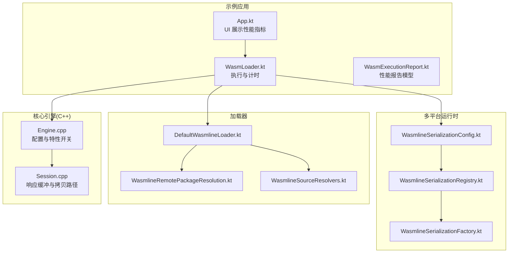
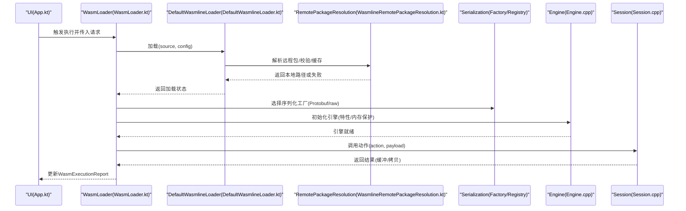
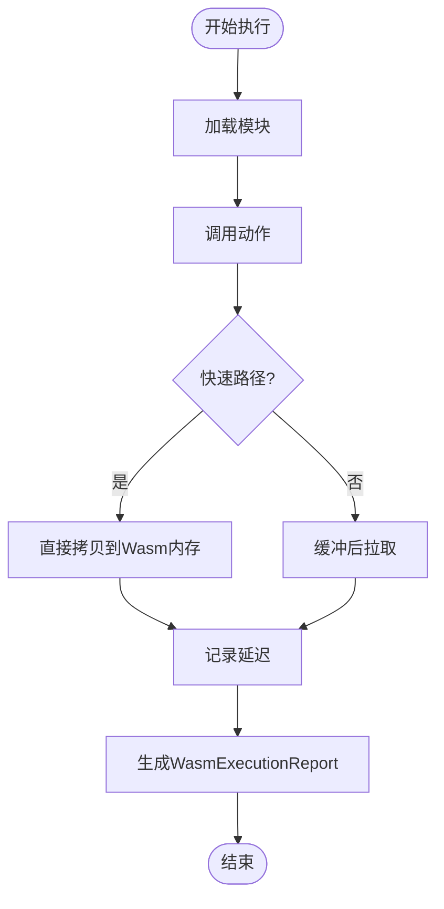
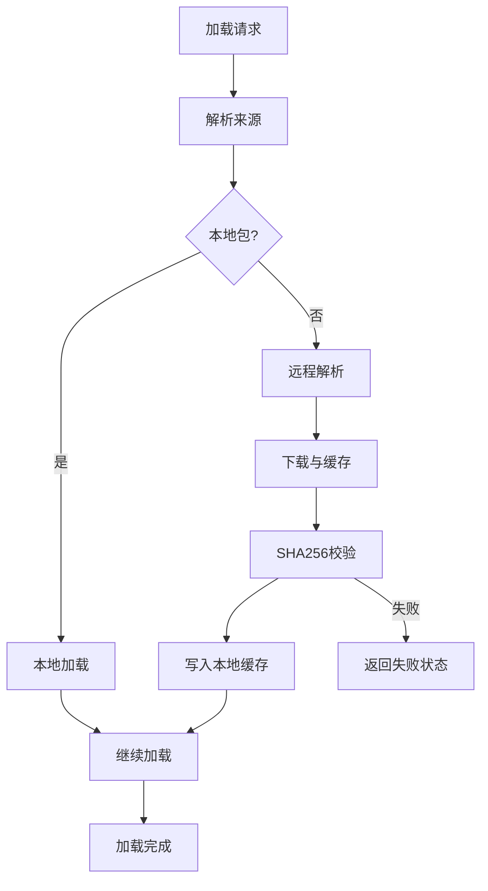
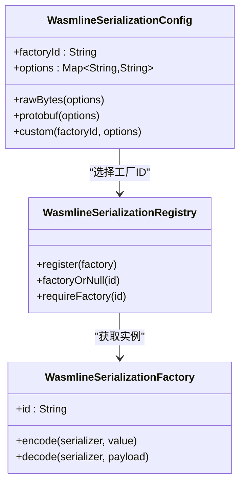
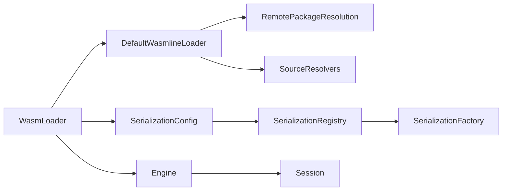

# 性能测试与基准测试

<cite>
**本文引用的文件**
- [App.kt](file://wasmline-samples/kotlin/sample-apps/multiplatform/shared/src/commonMain/kotlin/crow/wasmline/sample/App.kt)
- [WasmLoader.kt](file://wasmline-samples/kotlin/sample-apps/multiplatform/shared/src/commonMain/kotlin/crow/wasmline/sample/WasmLoader.kt)
- [WasmExecutionReport.kt](file://wasmline-samples/kotlin/sample-apps/multiplatform/shared/src/commonMain/kotlin/crow/wasmline/sample/WasmExecutionReport.kt)
- [Engine.cpp](file://wasmline-core/src/Engine.cpp)
- [Session.cpp](file://wasmline-core/src/Session.cpp)
- [DefaultWasmlineLoader.kt](file://wasmline-multiplatform/wasmline-loader/src/hostMain/kotlin/crow/wasmline/loader/DefaultWasmlineLoader.kt)
- [WasmlineRemotePackageResolution.kt](file://wasmline-multiplatform/wasmline-loader/src/hostMain/kotlin/crow/wasmline/loader/internal/WasmlineRemotePackageResolution.kt)
- [WasmlineSourceResolvers.kt](file://wasmline-multiplatform/wasmline-loader/src/commonMain/kotlin/crow/wasmline/loader/WasmlineSourceResolvers.kt)
- [WasmlineSerializationConfig.kt](file://wasmline-multiplatform/wasmline/src/commonMain/kotlin/crow/wasmline/serialization/WasmlineSerializationConfig.kt)
- [WasmlineSerializationRegistry.kt](file://wasmline-multiplatform/wasmline/src/commonMain/kotlin/crow/wasmline/serialization/WasmlineSerializationRegistry.kt)
- [WasmlineSerializationFactory.kt](file://wasmline-multiplatform/wasmline/src/commonMain/kotlin/crow/wasmline/serialization/WasmlineSerializationFactory.kt)
- [WasmlineServiceRuntimeTest.kt](file://wasmline-multiplatform/wasmline/src/commonTest/kotlin/crow/wasmline/WasmlineServiceRuntimeTest.kt)
- [WasmlineSerializationConfigTest.kt](file://wasmline-multiplatform/wasmline/src/commonTest/kotlin/crow/wasmline/WasmlineSerializationConfigTest.kt)
- [SKILL.md](file://.github/skills/wasmline/SKILL.md)
- [init.py](file://scripts/init.py)
- [test-samples.sh](file://wasmline-ci/test-samples.sh)
</cite>

## 目录
1. [引言](#引言)
2. [项目结构](#项目结构)
3. [核心组件](#核心组件)
4. [架构总览](#架构总览)
5. [详细组件分析](#详细组件分析)
6. [依赖关系分析](#依赖关系分析)
7. [性能考虑](#性能考虑)
8. [故障排查指南](#故障排查指南)
9. [结论](#结论)
10. [附录](#附录)

## 引言
本指南面向性能工程师，系统阐述 Wasmline 的性能测试与基准测试实施方法，涵盖服务运行时性能测试、加载器性能测试与序列化性能测试三大维度。文档基于仓库现有实现，定义关键性能指标（加载时间、执行延迟、内存使用、吞吐量），给出测试环境搭建与配置要点，提供回归测试自动化思路与性能阈值设定建议，并总结多平台性能对比与优化策略。

## 项目结构
Wasmline 采用多模块组织，核心与性能相关的关键模块包括：
- wasmline-core：C++ 实现的引擎与会话桥接，承载底层内存管理与调用路径。
- wasmline-multiplatform：Kotlin 多平台运行时、加载器、序列化工厂与测试。
- wasmline-samples：示例应用，包含性能度量展示与执行流程。
- wasmline-ci：CI 样例测试脚本。
- scripts 与 .github/skills：环境预检与平台初始化工具。

**图表来源**
- [App.kt](file://wasmline-samples/kotlin/sample-apps/multiplatform/shared/src/commonMain/kotlin/crow/wasmline/sample/App.kt)
- [WasmLoader.kt](file://wasmline-samples/kotlin/sample-apps/multiplatform/shared/src/commonMain/kotlin/crow/wasmline/sample/WasmLoader.kt)
- [WasmExecutionReport.kt](file://wasmline-samples/kotlin/sample-apps/multiplatform/shared/src/commonMain/kotlin/crow/wasmline/sample/WasmExecutionReport.kt)
- [DefaultWasmlineLoader.kt](file://wasmline-multiplatform/wasmline-loader/src/hostMain/kotlin/crow/wasmline/loader/DefaultWasmlineLoader.kt)
- [WasmlineRemotePackageResolution.kt](file://wasmline-multiplatform/wasmline-loader/src/hostMain/kotlin/crow/wasmline/loader/internal/WasmlineRemotePackageResolution.kt)
- [WasmlineSourceResolvers.kt](file://wasmline-multiplatform/wasmline-loader/src/commonMain/kotlin/crow/wasmline/loader/WasmlineSourceResolvers.kt)
- [WasmlineSerializationConfig.kt](file://wasmline-multiplatform/wasmline/src/commonMain/kotlin/crow/wasmline/serialization/WasmlineSerializationConfig.kt)
- [WasmlineSerializationRegistry.kt](file://wasmline-multiplatform/wasmline/src/commonMain/kotlin/crow/wasmline/serialization/WasmlineSerializationRegistry.kt)
- [WasmlineSerializationFactory.kt](file://wasmline-multiplatform/wasmline/src/commonMain/kotlin/crow/wasmline/serialization/WasmlineSerializationFactory.kt)
- [Engine.cpp](file://wasmline-core/src/Engine.cpp)
- [Session.cpp](file://wasmline-core/src/Session.cpp)

**章节来源**
- [App.kt](file://wasmline-samples/kotlin/sample-apps/multiplatform/shared/src/commonMain/kotlin/crow/wasmline/sample/App.kt)
- [WasmLoader.kt](file://wasmline-samples/kotlin/sample-apps/multiplatform/shared/src/commonMain/kotlin/crow/wasmline/sample/WasmLoader.kt)
- [WasmExecutionReport.kt](file://wasmline-samples/kotlin/sample-apps/multiplatform/shared/src/commonMain/kotlin/crow/wasmline/sample/WasmExecutionReport.kt)
- [DefaultWasmlineLoader.kt](file://wasmline-multiplatform/wasmline-loader/src/hostMain/kotlin/crow/wasmline/loader/DefaultWasmlineLoader.kt)
- [WasmlineRemotePackageResolution.kt](file://wasmline-multiplatform/wasmline-loader/src/hostMain/kotlin/crow/wasmline/loader/internal/WasmlineRemotePackageResolution.kt)
- [WasmlineSourceResolvers.kt](file://wasmline-multiplatform/wasmline-loader/src/commonMain/kotlin/crow/wasmline/loader/WasmlineSourceResolvers.kt)
- [WasmlineSerializationConfig.kt](file://wasmline-multiplatform/wasmline/src/commonMain/kotlin/crow/wasmline/serialization/WasmlineSerializationConfig.kt)
- [WasmlineSerializationRegistry.kt](file://wasmline-multiplatform/wasmline/src/commonMain/kotlin/crow/wasmline/serialization/WasmlineSerializationRegistry.kt)
- [WasmlineSerializationFactory.kt](file://wasmline-multiplatform/wasmline/src/commonMain/kotlin/crow/wasmline/serialization/WasmlineSerializationFactory.kt)
- [Engine.cpp](file://wasmline-core/src/Engine.cpp)
- [Session.cpp](file://wasmline-core/src/Session.cpp)

## 核心组件
- 性能度量与展示：示例应用中的 WasmExecutionReport 与 UI 组件负责记录与展示加载、调用与总耗时。
- 加载器性能：DefaultWasmlineLoader 负责解析来源、远程下载与缓存命中，影响加载时间与网络开销。
- 序列化性能：WasmlineSerializationConfig/Registry/Factory 决定序列化方案（如 Protobuf/raw），直接影响序列化/反序列化开销。
- 引擎与桥接：Engine.cpp 控制 Wasm 特性与内存保护；Session.cpp 的响应缓冲与拷贝路径影响调用延迟与内存占用。

**章节来源**
- [WasmExecutionReport.kt](file://wasmline-samples/kotlin/sample-apps/multiplatform/shared/src/commonMain/kotlin/crow/wasmline/sample/WasmExecutionReport.kt)
- [App.kt](file://wasmline-samples/kotlin/sample-apps/multiplatform/shared/src/commonMain/kotlin/crow/wasmline/sample/App.kt)
- [DefaultWasmlineLoader.kt](file://wasmline-multiplatform/wasmline-loader/src/hostMain/kotlin/crow/wasmline/loader/DefaultWasmlineLoader.kt)
- [WasmlineSerializationConfig.kt](file://wasmline-multiplatform/wasmline/src/commonMain/kotlin/crow/wasmline/serialization/WasmlineSerializationConfig.kt)
- [WasmlineSerializationRegistry.kt](file://wasmline-multiplatform/wasmline/src/commonMain/kotlin/crow/wasmline/serialization/WasmlineSerializationRegistry.kt)
- [WasmlineSerializationFactory.kt](file://wasmline-multiplatform/wasmline/src/commonMain/kotlin/crow/wasmline/serialization/WasmlineSerializationFactory.kt)
- [Engine.cpp](file://wasmline-core/src/Engine.cpp)
- [Session.cpp](file://wasmline-core/src/Session.cpp)

## 架构总览
下图展示一次典型执行的性能相关路径：从 UI 触发到加载器解析、远程下载与缓存、序列化配置、引擎初始化与会话调用。

**图表来源**
- [App.kt](file://wasmline-samples/kotlin/sample-apps/multiplatform/shared/src/commonMain/kotlin/crow/wasmline/sample/App.kt)
- [WasmLoader.kt](file://wasmline-samples/kotlin/sample-apps/multiplatform/shared/src/commonMain/kotlin/crow/wasmline/sample/WasmLoader.kt)
- [DefaultWasmlineLoader.kt](file://wasmline-multiplatform/wasmline-loader/src/hostMain/kotlin/crow/wasmline/loader/DefaultWasmlineLoader.kt)
- [WasmlineRemotePackageResolution.kt](file://wasmline-multiplatform/wasmline-loader/src/hostMain/kotlin/crow/wasmline/loader/internal/WasmlineRemotePackageResolution.kt)
- [WasmlineSerializationFactory.kt](file://wasmline-multiplatform/wasmline/src/commonMain/kotlin/crow/wasmline/serialization/WasmlineSerializationFactory.kt)
- [Engine.cpp](file://wasmline-core/src/Engine.cpp)
- [Session.cpp](file://wasmline-core/src/Session.cpp)

## 详细组件分析

### 服务运行时性能测试
- 关注点：调用延迟、内存占用、吞吐量。
- 实施要点：
  - 使用 WasmExecutionReport 记录 loadDurationMs、invokeDurationMs、totalDurationMs。
  - 在 Session.cpp 的响应路径中，区分“快速路径”和“慢速路径”，关注缓冲与拷贝对延迟的影响。
  - 通过 Engine.cpp 的配置项（GC、SIMD、信号处理、内存保护页）评估不同设置对延迟与内存的权衡。
- 性能指标定义与测量：
  - 加载时间：从发起加载到加载完成的时长。
  - 执行延迟：从发送调用到接收结果的时延。
  - 内存使用：结合引擎内存保护页与宿主内存增长路径进行观测。
  - 吞吐量：单位时间内成功执行次数（可通过循环调用统计）。
- 回归测试自动化：在 WasmlineServiceRuntimeTest 中扩展用例，固定输入与期望输出，断言耗时阈值。

**图表来源**
- [WasmExecutionReport.kt](file://wasmline-samples/kotlin/sample-apps/multiplatform/shared/src/commonMain/kotlin/crow/wasmline/sample/WasmExecutionReport.kt)
- [Session.cpp](file://wasmline-core/src/Session.cpp)
- [Engine.cpp](file://wasmline-core/src/Engine.cpp)

**章节来源**
- [WasmExecutionReport.kt](file://wasmline-samples/kotlin/sample-apps/multiplatform/shared/src/commonMain/kotlin/crow/wasmline/sample/WasmExecutionReport.kt)
- [Session.cpp](file://wasmline-core/src/Session.cpp)
- [Engine.cpp](file://wasmline-core/src/Engine.cpp)
- [WasmlineServiceRuntimeTest.kt](file://wasmline-multiplatform/wasmline/src/commonTest/kotlin/crow/wasmline/WasmlineServiceRuntimeTest.kt)

### 加载器性能测试
- 关注点：远程解析、网络下载、缓存命中、SHA256 校验与本地落盘。
- 实施要点：
  - 使用 DefaultWasmlineLoader 的 loadSource 分支，覆盖本地/远程包解析与递归深度限制。
  - 在 WasmlineRemotePackageResolution 中验证下载、缓存写入与校验失败分支。
  - 通过 WasmlineSourceResolvers 自定义解析器注入终端状态，模拟失败路径。
- 性能指标：
  - 下载时延：网络下载与校验。
  - 缓存命中率：重复加载命中缓存的比例。
  - 校验开销：SHA256 计算成本。
- 回归测试自动化：在 DefaultWasmlineLoaderTest 中增加远程解析、缓存写入与失败场景断言。

**图表来源**
- [DefaultWasmlineLoader.kt](file://wasmline-multiplatform/wasmline-loader/src/hostMain/kotlin/crow/wasmline/loader/DefaultWasmlineLoader.kt)
- [WasmlineRemotePackageResolution.kt](file://wasmline-multiplatform/wasmline-loader/src/hostMain/kotlin/crow/wasmline/loader/internal/WasmlineRemotePackageResolution.kt)
- [WasmlineSourceResolvers.kt](file://wasmline-multiplatform/wasmline-loader/src/commonMain/kotlin/crow/wasmline/loader/WasmlineSourceResolvers.kt)

**章节来源**
- [DefaultWasmlineLoader.kt](file://wasmline-multiplatform/wasmline-loader/src/hostMain/kotlin/crow/wasmline/loader/DefaultWasmlineLoader.kt)
- [WasmlineRemotePackageResolution.kt](file://wasmline-multiplatform/wasmline-loader/src/hostMain/kotlin/crow/wasmline/loader/internal/WasmlineRemotePackageResolution.kt)
- [WasmlineSourceResolvers.kt](file://wasmline-multiplatform/wasmline-loader/src/commonMain/kotlin/crow/wasmline/loader/WasmlineSourceResolvers.kt)
- [DefaultWasmlineLoaderTest.kt](file://wasmline-multiplatform/wasmline-loader/src/jvmTest/kotlin/crow/wasmline/loader/DefaultWasmlineLoaderTest.kt)

### 序列化性能测试
- 关注点：序列化/反序列化开销、工厂选择（Protobuf/raw）、注册表一致性。
- 实施要点：
  - 通过 WasmlineSerializationConfig 选择工厂 ID 与选项。
  - 使用 WasmlineSerializationRegistry 注册/获取工厂，确保默认工厂为 Protobuf。
  - 在 WasmlineSerializationFactory 中实现 encode/decode，支持原始字节与 Protobuf。
- 性能指标：
  - 序列化/反序列化时延：针对不同负载大小与复杂度。
  - 数据体积：序列化后字节数。
  - 兼容性：不同工厂间 round-trip 一致性。
- 回归测试自动化：在 WasmlineSerializationConfigTest 中断言默认工厂、选项携带与内置工厂注册。

**图表来源**
- [WasmlineSerializationConfig.kt](file://wasmline-multiplatform/wasmline/src/commonMain/kotlin/crow/wasmline/serialization/WasmlineSerializationConfig.kt)
- [WasmlineSerializationRegistry.kt](file://wasmline-multiplatform/wasmline/src/commonMain/kotlin/crow/wasmline/serialization/WasmlineSerializationRegistry.kt)
- [WasmlineSerializationFactory.kt](file://wasmline-multiplatform/wasmline/src/commonMain/kotlin/crow/wasmline/serialization/WasmlineSerializationFactory.kt)

**章节来源**
- [WasmlineSerializationConfig.kt](file://wasmline-multiplatform/wasmline/src/commonMain/kotlin/crow/wasmline/serialization/WasmlineSerializationConfig.kt)
- [WasmlineSerializationRegistry.kt](file://wasmline-multiplatform/wasmline/src/commonMain/kotlin/crow/wasmline/serialization/WasmlineSerializationRegistry.kt)
- [WasmlineSerializationFactory.kt](file://wasmline-multiplatform/wasmline/src/commonMain/kotlin/crow/wasmline/serialization/WasmlineSerializationFactory.kt)
- [WasmlineSerializationConfigTest.kt](file://wasmline-multiplatform/wasmline/src/commonTest/kotlin/crow/wasmline/WasmlineSerializationConfigTest.kt)

## 依赖关系分析
- 加载器依赖远程解析与缓存写入，受网络与磁盘 I/O 影响。
- 引擎配置影响运行时特性与内存占用，间接影响延迟与稳定性。
- 序列化工厂由配置驱动，注册表集中管理，避免跨边界传递对象。

**图表来源**
- [DefaultWasmlineLoader.kt](file://wasmline-multiplatform/wasmline-loader/src/hostMain/kotlin/crow/wasmline/loader/DefaultWasmlineLoader.kt)
- [WasmlineRemotePackageResolution.kt](file://wasmline-multiplatform/wasmline-loader/src/hostMain/kotlin/crow/wasmline/loader/internal/WasmlineRemotePackageResolution.kt)
- [WasmlineSourceResolvers.kt](file://wasmline-multiplatform/wasmline-loader/src/commonMain/kotlin/crow/wasmline/loader/WasmlineSourceResolvers.kt)
- [WasmLoader.kt](file://wasmline-samples/kotlin/sample-apps/multiplatform/shared/src/commonMain/kotlin/crow/wasmline/sample/WasmLoader.kt)
- [WasmlineSerializationConfig.kt](file://wasmline-multiplatform/wasmline/src/commonMain/kotlin/crow/wasmline/serialization/WasmlineSerializationConfig.kt)
- [WasmlineSerializationRegistry.kt](file://wasmline-multiplatform/wasmline/src/commonMain/kotlin/crow/wasmline/serialization/WasmlineSerializationRegistry.kt)
- [WasmlineSerializationFactory.kt](file://wasmline-multiplatform/wasmline/src/commonMain/kotlin/crow/wasmline/serialization/WasmlineSerializationFactory.kt)
- [Engine.cpp](file://wasmline-core/src/Engine.cpp)
- [Session.cpp](file://wasmline-core/src/Session.cpp)

**章节来源**
- [DefaultWasmlineLoader.kt](file://wasmline-multiplatform/wasmline-loader/src/hostMain/kotlin/crow/wasmline/loader/DefaultWasmlineLoader.kt)
- [WasmlineRemotePackageResolution.kt](file://wasmline-multiplatform/wasmline-loader/src/hostMain/kotlin/crow/wasmline/loader/internal/WasmlineRemotePackageResolution.kt)
- [WasmlineSourceResolvers.kt](file://wasmline-multiplatform/wasmline-loader/src/commonMain/kotlin/crow/wasmline/loader/WasmlineSourceResolvers.kt)
- [WasmLoader.kt](file://wasmline-samples/kotlin/sample-apps/multiplatform/shared/src/commonMain/kotlin/crow/wasmline/sample/WasmLoader.kt)
- [WasmlineSerializationConfig.kt](file://wasmline-multiplatform/wasmline/src/commonMain/kotlin/crow/wasmline/serialization/WasmlineSerializationConfig.kt)
- [WasmlineSerializationRegistry.kt](file://wasmline-multiplatform/wasmline/src/commonMain/kotlin/crow/wasmline/serialization/WasmlineSerializationRegistry.kt)
- [WasmlineSerializationFactory.kt](file://wasmline-multiplatform/wasmline/src/commonMain/kotlin/crow/wasmline/serialization/WasmlineSerializationFactory.kt)
- [Engine.cpp](file://wasmline-core/src/Engine.cpp)
- [Session.cpp](file://wasmline-core/src/Session.cpp)

## 性能考虑
- 引擎配置
  - GC 与异常支持：提升兼容性但可能增加开销。
  - SIMD 关闭：提高兼容性，避免潜在性能波动。
  - 信号陷阱关闭：避免与 Android ART 冲突，减少崩溃风险。
  - 内存保护页设为 0：降低虚拟内存占用，缓解 32 位设备 OOM 风险。
- 会话响应路径
  - 快速路径：直接拷贝，减少缓冲与跨内存访问。
  - 慢速路径：移动缓冲避免复制，适合大块数据。
- 序列化
  - Protobuf：结构化强、体积可控，适合复杂对象。
  - Raw 字节：零拷贝路径，适合简单或已编码数据。
- 平台差异
  - 不同平台的初始化脚本与运行时资产准备会影响首次加载时间。
  - 建议在 CI 中固定平台矩阵，统一环境变量与工具链版本。

**章节来源**
- [Engine.cpp](file://wasmline-core/src/Engine.cpp)
- [Session.cpp](file://wasmline-core/src/Session.cpp)
- [WasmlineSerializationFactory.kt](file://wasmline-multiplatform/wasmline/src/commonMain/kotlin/crow/wasmline/serialization/WasmlineSerializationFactory.kt)
- [SKILL.md](file://.github/skills/wasmline/SKILL.md)
- [init.py](file://scripts/init.py)

## 故障排查指南
- 加载失败
  - 检查远程解析与缓存写入是否成功，核对 SHA256 校验失败原因。
  - 确认来源解析深度限制与自定义解析器返回的终端状态。
- 执行异常
  - 关注引擎配置是否与平台兼容（特别是 Android）。
  - 检查会话响应缓冲是否被意外增长导致内存压力。
- 序列化问题
  - 确认工厂 ID 与选项一致，注册表中存在对应工厂。
  - 对比 Protobuf 与 Raw 字节两种路径的性能与体积差异。

**章节来源**
- [WasmlineRemotePackageResolution.kt](file://wasmline-multiplatform/wasmline-loader/src/hostMain/kotlin/crow/wasmline/loader/internal/WasmlineRemotePackageResolution.kt)
- [DefaultWasmlineLoader.kt](file://wasmline-multiplatform/wasmline-loader/src/hostMain/kotlin/crow/wasmline/loader/DefaultWasmlineLoader.kt)
- [WasmlineSerializationRegistry.kt](file://wasmline-multiplatform/wasmline/src/commonMain/kotlin/crow/wasmline/serialization/WasmlineSerializationRegistry.kt)
- [Engine.cpp](file://wasmline-core/src/Engine.cpp)
- [Session.cpp](file://wasmline-core/src/Session.cpp)

## 结论
本指南基于仓库现有实现，给出了服务运行时、加载器与序列化三个维度的性能测试策略与实施路径。通过 WasmExecutionReport、加载器解析链与序列化工厂的选择，可以系统地度量与优化关键性能指标。建议在 CI 中建立多平台基线与回归阈值，持续监控性能变化并迭代优化。

## 附录
- 测试环境搭建与配置
  - 使用仓库提供的环境预检与平台初始化脚本，确保工具链与运行时资产一致。
  - 在 CI 中固定平台矩阵与工具链版本，统一环境变量。
- 基准测试框架设计
  - 以 WasmExecutionReport 为核心指标载体，统一采集加载、调用与总耗时。
  - 将加载器与序列化路径纳入基准场景，覆盖缓存命中与失败路径。
- 回归性能测试自动化
  - 在现有测试用例基础上增加断言，固定输入与期望输出，设定时延阈值。
  - 利用 CI 脚本批量执行，生成趋势报告并告警。

**章节来源**
- [SKILL.md](file://.github/skills/wasmline/SKILL.md)
- [test-samples.sh](file://wasmline-ci/test-samples.sh)
- [WasmExecutionReport.kt](file://wasmline-samples/kotlin/sample-apps/multiplatform/shared/src/commonMain/kotlin/crow/wasmline/sample/WasmExecutionReport.kt)
- [DefaultWasmlineLoaderTest.kt](file://wasmline-multiplatform/wasmline-loader/src/jvmTest/kotlin/crow/wasmline/loader/DefaultWasmlineLoaderTest.kt)
- [WasmlineSerializationConfigTest.kt](file://wasmline-multiplatform/wasmline/src/commonTest/kotlin/crow/wasmline/WasmlineSerializationConfigTest.kt)