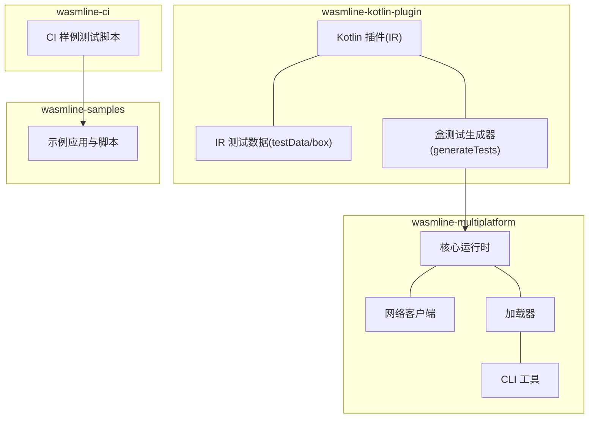
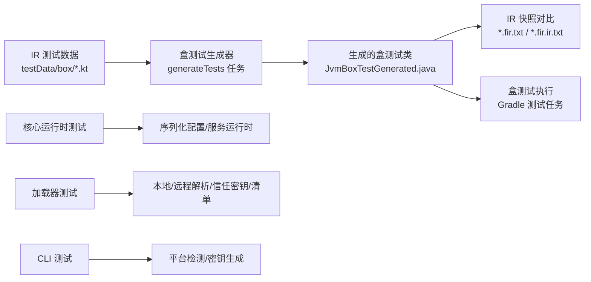
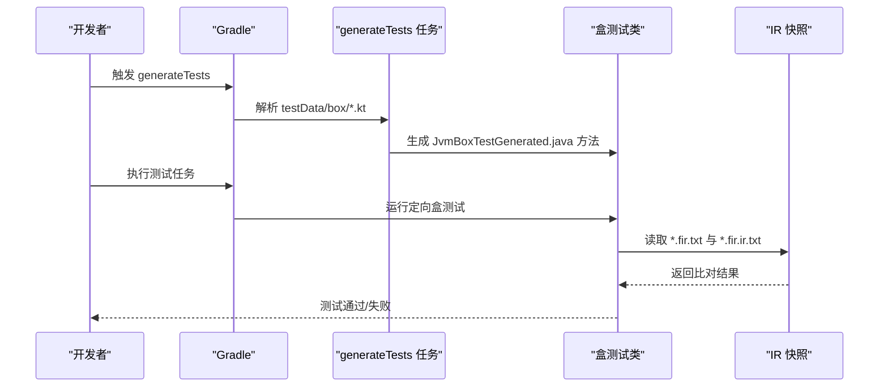
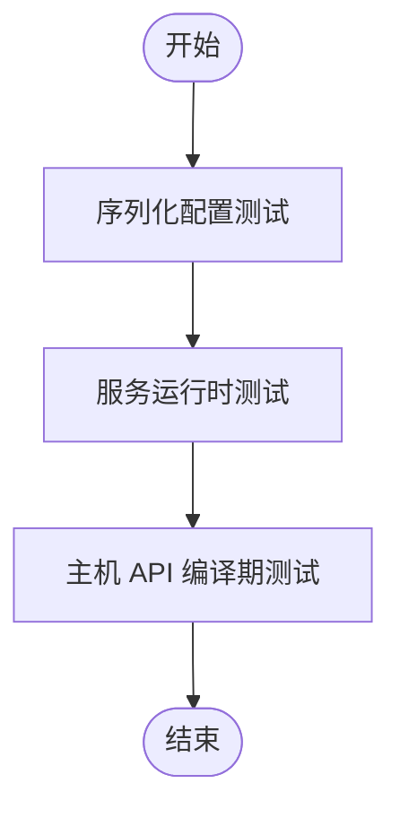
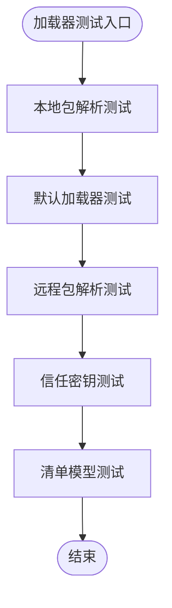
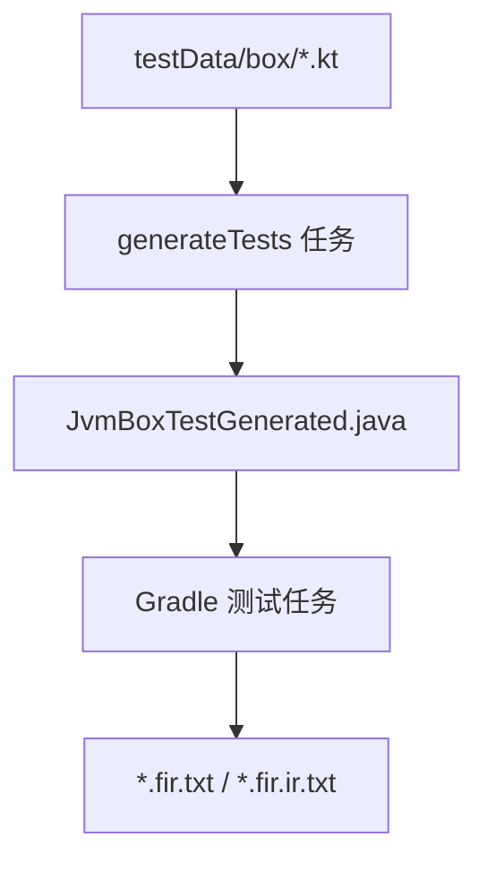

# 测试与质量保证

<cite>
**本文引用的文件**
- [README.md](file://README.md)
- [SKILL.md](file://.github/skills/wasmline/SKILL.md)
- [README_en.md](file://wasmline-multiplatform/wasmline-kotlin-plugin/testData/box/README_en.md)
- [README_zh.md](file://wasmline-multiplatform/wasmline-kotlin-plugin/testData/box/README_zh.md)
- [build.gradle.kts](file://wasmline-multiplatform/wasmline-kotlin-plugin/build.gradle.kts)
- [AbstractJvmBoxTest.kt](file://wasmline-multiplatform/wasmline-kotlin-plugin/test-fixtures/crow/wasmline/kotlin/runners/AbstractJvmBoxTest.kt)
- [AbstractJvmDiagnosticTest.kt](file://wasmline-multiplatform/wasmline-kotlin-plugin/test-fixtures/crow/wasmline/kotlin/runners/AbstractJvmDiagnosticTest.kt)
- [JvmBoxTestGenerated.java](file://wasmline-multiplatform/wasmline-kotlin-plugin/test-gen/crow/wasmline/kotlin/runners/JvmBoxTestGenerated.java)
- [JvmDiagnosticTestGenerated.java](file://wasmline-multiplatform/wasmline-kotlin-plugin/test-gen/crow/wasmline/kotlin/runners/JvmDiagnosticTestGenerated.java)
- [WasmlineSerializationConfigTest.kt](file://wasmline-multiplatform/wasmline/src/commonTest/kotlin/crow/wasmline/WasmlineSerializationConfigTest.kt)
- [WasmlineServiceRuntimeTest.kt](file://wasmline-multiplatform/wasmline/src/commonTest/kotlin/crow/wasmline/WasmlineServiceRuntimeTest.kt)
- [WasmlineHostApiCompileTest.kt](file://wasmline-multiplatform/wasmline/src/hostTest/kotlin/crow/wasmline/WasmlineHostApiCompileTest.kt)
- [DownloadPlatformDetectorTest.kt](file://wasmline-multiplatform/wasmline-cli/src/test/kotlin/crow/wasmline/cli/DownloadPlatformDetectorTest.kt)
- [GenerateKeyPairTest.kt](file://wasmline-multiplatform/wasmline-cli/src/test/kotlin/crow/wasmline/cli/GenerateKeyPairTest.kt)
- [WasmlineLocalPackageResolutionTest.kt](file://wasmline-multiplatform/wasmline-loader/src/jvmTest/kotlin/crow/wasmline/loader/internal/WasmlineLocalPackageResolutionTest.kt)
- [DefaultWasmlineLoaderTest.kt](file://wasmline-multiplatform/wasmline-loader/src/jvmTest/kotlin/crow/wasmline/loader/DefaultWasmlineLoaderTest.kt)
- [WasmlineRemotePackageResolutionTest.kt](file://wasmline-multiplatform/wasmline-loader/src/jvmTest/kotlin/crow/wasmline/loader/WasmlineRemotePackageResolutionTest.kt)
- [WasmlineTrustedKeysTest.kt](file://wasmline-multiplatform/wasmline-loader/src/commonTest/kotlin/crow/wasmline/loader/WasmlineTrustedKeysTest.kt)
- [ManifestTest.kt](file://wasmline-multiplatform/wasmline-loader/src/commonTest/kotlin/crow/wasmline/ManifestTest.kt)
- [test-samples.sh](file://wasmline-ci/test-samples.sh)
- [run-sample-common.sh](file://wasmline-samples/kotlin/run-sample-common.sh)
</cite>

## 目录
1. [引言](#引言)
2. [项目结构](#项目结构)
3. [核心组件](#核心组件)
4. [架构总览](#架构总览)
5. [详细组件分析](#详细组件分析)
6. [依赖关系分析](#依赖关系分析)
7. [性能考虑](#性能考虑)
8. [故障排除指南](#故障排除指南)
9. [结论](#结论)
10. [附录](#附录)

## 引言
本文件面向测试工程师与质量保证人员，系统化梳理 Wasmline 的测试策略与质量保证体系，覆盖单元测试、集成测试、IR 测试与盒测试（Box Test）、诊断测试、以及持续集成中的测试自动化与报告生成。文档同时给出覆盖率与质量门禁建议、性能基准与回归策略，帮助团队建立稳定高效的测试流水线。

## 项目结构
Wasmline 采用多模块的 Kotlin 多平台工程组织，测试分布在各子模块中，遵循“按功能域划分”的原则：
- wasmline-kotlin-plugin：Kotlin 编译器插件，包含 IR 测试与盒测试生成器
- wasmline-multiplatform：核心运行时与网络、加载器等模块，包含多平台测试
- wasmline-cli：命令行工具测试
- wasmline-loader：包解析与加载相关测试
- wasmline-ci：CI 脚本与样例测试驱动
- wasmline-samples：示例应用与通用脚本

**图表来源**
- [build.gradle.kts:50-55](file://wasmline-multiplatform/wasmline-kotlin-plugin/build.gradle.kts#L50-L55)
- [README_en.md:1-99](file://wasmline-multiplatform/wasmline-kotlin-plugin/testData/box/README_en.md#L1-L99)

**章节来源**
- [README.md](file://README.md)
- [build.gradle.kts:50-55](file://wasmline-multiplatform/wasmline-kotlin-plugin/build.gradle.kts#L50-L55)

## 核心组件
- Kotlin 编译器插件与 IR 测试：通过 IR 快照与盒测试验证插件在 IR 阶段的行为与生成物
- 多平台核心运行时测试：序列化配置、服务运行时行为、主机 API 编译期测试
- 加载器测试：本地/远程包解析、信任密钥、清单模型
- CLI 测试：平台检测、密钥生成等
- CI 样例测试：驱动示例应用的端到端测试流程

**章节来源**
- [WasmlineSerializationConfigTest.kt](file://wasmline-multiplatform/wasmline/src/commonTest/kotlin/crow/wasmline/WasmlineSerializationConfigTest.kt)
- [WasmlineServiceRuntimeTest.kt](file://wasmline-multiplatform/wasmline/src/commonTest/kotlin/crow/wasmline/WasmlineServiceRuntimeTest.kt)
- [WasmlineHostApiCompileTest.kt](file://wasmline-multiplatform/wasmline/src/hostTest/kotlin/crow/wasmline/WasmlineHostApiCompileTest.kt)
- [WasmlineLocalPackageResolutionTest.kt](file://wasmline-multiplatform/wasmline-loader/src/jvmTest/kotlin/crow/wasmline/loader/internal/WasmlineLocalPackageResolutionTest.kt)
- [DefaultWasmlineLoaderTest.kt](file://wasmline-multiplatform/wasmline-loader/src/jvmTest/kotlin/crow/wasmline/loader/DefaultWasmlineLoaderTest.kt)
- [WasmlineRemotePackageResolutionTest.kt](file://wasmline-multiplatform/wasmline-loader/src/jvmTest/kotlin/crow/wasmline/loader/WasmlineRemotePackageResolutionTest.kt)
- [DownloadPlatformDetectorTest.kt](file://wasmline-multiplatform/wasmline-cli/src/test/kotlin/crow/wasmline/cli/DownloadPlatformDetectorTest.kt)
- [GenerateKeyPairTest.kt](file://wasmline-multiplatform/wasmline-cli/src/test/kotlin/crow/wasmline/cli/GenerateKeyPairTest.kt)

## 架构总览
下图展示测试体系的关键路径：从 IR 测试数据到盒测试生成器，再到生成的测试类；以及多平台模块的测试分布。

**图表来源**
- [README_en.md:53-62](file://wasmline-multiplatform/wasmline-kotlin-plugin/testData/box/README_en.md#L53-L62)
- [build.gradle.kts:50-55](file://wasmline-multiplatform/wasmline-kotlin-plugin/build.gradle.kts#L50-L55)
- [JvmBoxTestGenerated.java](file://wasmline-multiplatform/wasmline-kotlin-plugin/test-gen/crow/wasmline/kotlin/runners/JvmBoxTestGenerated.java)

## 详细组件分析

### Kotlin 编译器插件与 IR 测试
- IR 测试职责：聚焦插件在 IR 阶段的行为，包括服务契约发现、桥接生成、绑定与链接调用形态等
- 快照机制：通过 FIR 与 IR 两份快照文件进行自动生成与比对，首次执行可能因快照缺失或 IR 变化导致失败，第二次执行通常可恢复
- 盒测试工作流：通过 generateTests 生成测试方法，再由 Gradle 执行定向盒测试；推荐通过反射或可观测行为验证生成声明，避免直接引用生成名称
- 作者规范：每个 fixture 仅验证单一 IR 行为，box 返回值应为固定字符串以便统一断言

**图表来源**
- [README_en.md:53-62](file://wasmline-multiplatform/wasmline-kotlin-plugin/testData/box/README_en.md#L53-L62)
- [README_zh.md:53-68](file://wasmline-multiplatform/wasmline-kotlin-plugin/testData/box/README_zh.md#L53-L68)
- [build.gradle.kts:50-55](file://wasmline-multiplatform/wasmline-kotlin-plugin/build.gradle.kts#L50-L55)

**章节来源**
- [README_en.md:1-99](file://wasmline-multiplatform/wasmline-kotlin-plugin/testData/box/README_en.md#L1-L99)
- [README_zh.md:47-98](file://wasmline-multiplatform/wasmline-kotlin-plugin/testData/box/README_zh.md#L47-L98)
- [build.gradle.kts:50-55](file://wasmline-multiplatform/wasmline-kotlin-plugin/build.gradle.kts#L50-L55)

### 诊断测试（Diagnostics Test）
- 用途：验证编译期诊断信息与错误提示，确保插件在不合法契约或绑定场景下产生预期诊断
- 执行：通过 Gradle 指定测试类运行诊断测试集

**章节来源**
- [README_en.md:53-62](file://wasmline-multiplatform/wasmline-kotlin-plugin/testData/box/README_en.md#L53-L62)

### 多平台核心运行时测试
- 序列化配置测试：验证序列化配置在不同平台的一致性
- 服务运行时测试：验证服务在多平台上的运行时行为
- 主机 API 编译期测试：验证主机侧 API 的编译期约束与行为

**图表来源**
- [WasmlineSerializationConfigTest.kt](file://wasmline-multiplatform/wasmline/src/commonTest/kotlin/crow/wasmline/WasmlineSerializationConfigTest.kt)
- [WasmlineServiceRuntimeTest.kt](file://wasmline-multiplatform/wasmline/src/commonTest/kotlin/crow/wasmline/WasmlineServiceRuntimeTest.kt)
- [WasmlineHostApiCompileTest.kt](file://wasmline-multiplatform/wasmline/src/hostTest/kotlin/crow/wasmline/WasmlineHostApiCompileTest.kt)

**章节来源**
- [WasmlineSerializationConfigTest.kt](file://wasmline-multiplatform/wasmline/src/commonTest/kotlin/crow/wasmline/WasmlineSerializationConfigTest.kt)
- [WasmlineServiceRuntimeTest.kt](file://wasmline-multiplatform/wasmline/src/commonTest/kotlin/crow/wasmline/WasmlineServiceRuntimeTest.kt)
- [WasmlineHostApiCompileTest.kt](file://wasmline-multiplatform/wasmline/src/hostTest/kotlin/crow/wasmline/WasmlineHostApiCompileTest.kt)

### 加载器测试
- 本地包解析测试：验证本地包解析逻辑
- 默认加载器测试：验证加载器整体行为
- 远程包解析测试：验证远程包解析逻辑
- 信任密钥与清单测试：验证信任密钥与清单模型

**图表来源**
- [WasmlineLocalPackageResolutionTest.kt](file://wasmline-multiplatform/wasmline-loader/src/jvmTest/kotlin/crow/wasmline/loader/internal/WasmlineLocalPackageResolutionTest.kt)
- [DefaultWasmlineLoaderTest.kt](file://wasmline-multiplatform/wasmline-loader/src/jvmTest/kotlin/crow/wasmline/loader/DefaultWasmlineLoaderTest.kt)
- [WasmlineRemotePackageResolutionTest.kt](file://wasmline-multiplatform/wasmline-loader/src/jvmTest/kotlin/crow/wasmline/loader/WasmlineRemotePackageResolutionTest.kt)
- [WasmlineTrustedKeysTest.kt](file://wasmline-multiplatform/wasmline-loader/src/commonTest/kotlin/crow/wasmline/loader/WasmlineTrustedKeysTest.kt)
- [ManifestTest.kt](file://wasmline-multiplatform/wasmline-loader/src/commonTest/kotlin/crow/wasmline/ManifestTest.kt)

**章节来源**
- [WasmlineLocalPackageResolutionTest.kt](file://wasmline-multiplatform/wasmline-loader/src/jvmTest/kotlin/crow/wasmline/loader/internal/WasmlineLocalPackageResolutionTest.kt)
- [DefaultWasmlineLoaderTest.kt](file://wasmline-multiplatform/wasmline-loader/src/jvmTest/kotlin/crow/wasmline/loader/DefaultWasmlineLoaderTest.kt)
- [WasmlineRemotePackageResolutionTest.kt](file://wasmline-multiplatform/wasmline-loader/src/jvmTest/kotlin/crow/wasmline/loader/WasmlineRemotePackageResolutionTest.kt)
- [WasmlineTrustedKeysTest.kt](file://wasmline-multiplatform/wasmline-loader/src/commonTest/kotlin/crow/wasmline/loader/WasmlineTrustedKeysTest.kt)
- [ManifestTest.kt](file://wasmline-multiplatform/wasmline-loader/src/commonTest/kotlin/crow/wasmline/ManifestTest.kt)

### CLI 测试
- 平台检测测试：验证平台检测逻辑
- 密钥生成测试：验证密钥生成流程

**章节来源**
- [DownloadPlatformDetectorTest.kt](file://wasmline-multiplatform/wasmline-cli/src/test/kotlin/crow/wasmline/cli/DownloadPlatformDetectorTest.kt)
- [GenerateKeyPairTest.kt](file://wasmline-multiplatform/wasmline-cli/src/test/kotlin/crow/wasmline/cli/GenerateKeyPairTest.kt)

### 持续集成与样例测试
- CI 样例测试脚本：驱动示例应用的测试流程
- 示例通用脚本：封装 Gradle 执行、参数渲染、平台归一化等

**章节来源**
- [test-samples.sh](file://wasmline-ci/test-samples.sh)
- [run-sample-common.sh:82-113](file://wasmline-samples/kotlin/run-sample-common.sh#L82-L113)
- [run-sample-common.sh:140-157](file://wasmline-samples/kotlin/run-sample-common.sh#L140-L157)

## 依赖关系分析
- 插件与生成器：插件模块通过 generateTests 任务消费 testData/box 下的 fixture，生成 JvmBoxTestGenerated.java，再由 Gradle 测试任务执行
- 生成器输入：以 testData 目录为输入，启用增量构建，避免无关变更触发全量生成
- 快照一致性：IR 快照文件由测试过程自动生成与比对，首次失败属正常现象，需在二次执行后确认快照稳定

**图表来源**
- [build.gradle.kts:50-55](file://wasmline-multiplatform/wasmline-kotlin-plugin/build.gradle.kts#L50-L55)
- [README_en.md:53-62](file://wasmline-multiplatform/wasmline-kotlin-plugin/testData/box/README_en.md#L53-L62)

**章节来源**
- [build.gradle.kts:50-55](file://wasmline-multiplatform/wasmline-kotlin-plugin/build.gradle.kts#L50-L55)
- [README_en.md:53-62](file://wasmline-multiplatform/wasmline-kotlin-plugin/testData/box/README_en.md#L53-L62)

## 性能考虑
- IR 快照稳定性：IR 快照随前端与插件版本变化而变化，应定期同步并审查差异，避免引入非预期 IR 变化
- 生成器增量构建：通过将 testData 目录作为任务输入，启用增量生成，减少不必要的测试生成开销
- 平台差异：多平台测试需关注平台特定行为与性能差异，必要时分平台设置性能基线

[本节为通用指导，无需具体文件引用]

## 故障排除指南
- IR 快照首次失败：首次执行盒测试时可能出现失败，属预期；再次执行后快照稳定，测试应通过
- 快照手动编辑：禁止手动编辑 *.fir.txt 与 *.fir.ir.txt，如需更新请通过测试生成与比对流程
- 生成器未生成新方法：修改 fixture 后需重新执行 generateTests，确认生成的新测试方法存在且非空
- 环境预检与约束：执行测试前需完成环境预检；在未明确测试指令前，不得自主触发测试

**章节来源**
- [SKILL.md:282-343](file://.github/skills/wasmline/SKILL.md#L282-L343)
- [README_en.md:282-288](file://wasmline-multiplatform/wasmline-kotlin-plugin/testData/box/README_en.md#L282-L288)
- [README_zh.md:64-68](file://wasmline-multiplatform/wasmline-kotlin-plugin/testData/box/README_zh.md#L64-L68)

## 结论
Wasmline 的测试体系以 Kotlin 编译器插件的 IR 测试为核心，结合盒测试与诊断测试，辅以多平台运行时、加载器与 CLI 的单元/集成测试，并通过 CI 脚本驱动样例应用测试。建议在持续改进中强化覆盖率与质量门禁，完善性能基准与回归策略，确保跨平台行为一致与 IR 行为稳定。

[本节为总结，无需具体文件引用]

## 附录

### 测试框架与配置要点
- 测试框架：多平台模块普遍使用 Kotlin/JS/JVM 测试能力；IR 插件通过 Gradle 任务与生成器配合实现盒测试
- 配置要点：通过 Gradle 任务输入输出定义启用增量构建；IR 快照文件自动生成与比对

**章节来源**
- [build.gradle.kts:50-55](file://wasmline-multiplatform/wasmline-kotlin-plugin/build.gradle.kts#L50-L55)
- [README_en.md:53-62](file://wasmline-multiplatform/wasmline-kotlin-plugin/testData/box/README_en.md#L53-L62)

### 覆盖率与质量门禁建议
- 覆盖率：建议对核心模块（运行时、加载器、CLI）设定行覆盖率门槛（例如 ≥80%），对插件 IR 测试确保关键 IR 行为均有对应快照覆盖
- 质量门禁：IR 快照变更需通过代码评审；盒测试与诊断测试通过后方可合并；CI 中强制执行关键测试集

[本节为通用指导，无需具体文件引用]

### 性能基准与回归策略
- 基准：针对关键路径（服务调用、序列化、包解析）建立基准测试，记录关键指标（启动时间、序列化耗时、解析延迟）
- 回归：将性能测试纳入 CI，对显著回归进行阻断；对平台差异设置阈值与基线

[本节为通用指导，无需具体文件引用]