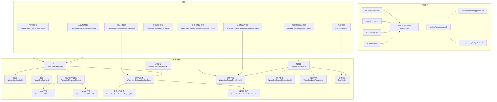
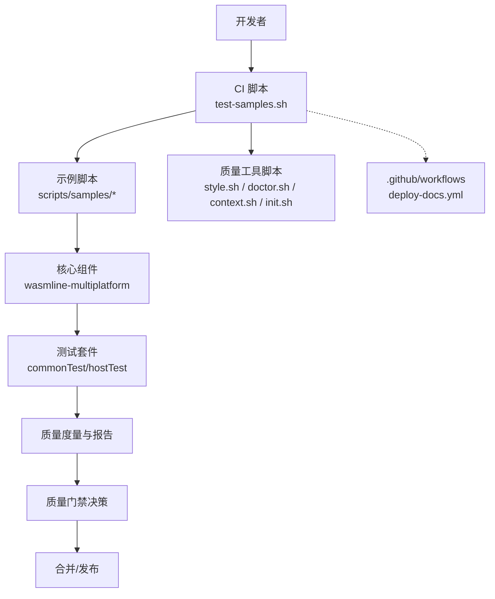
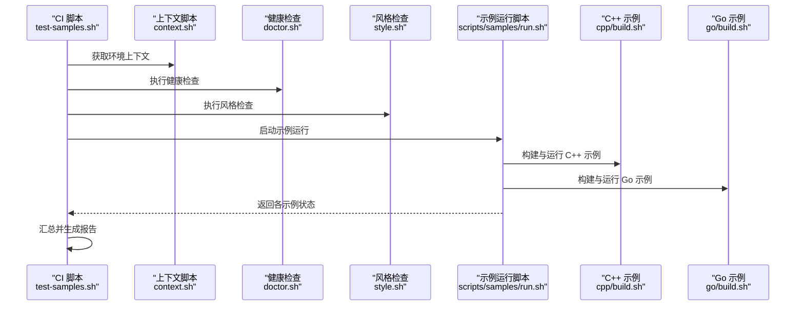
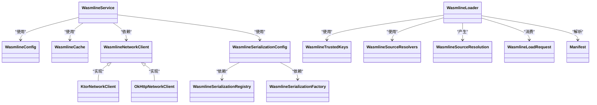
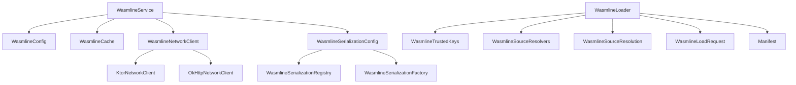

# 质量保证与持续集成

<cite>
**本文引用的文件**
- [test-samples.sh](file://wasmline-ci/test-samples.sh)
- [run.sh（示例）](file://scripts/samples/run.sh)
- [build.sh（C++ 示例）](file://scripts/samples/cpp/build.sh)
- [build.sh（Go 示例）](file://scripts/samples/go/build.sh)
- [context.sh](file://scripts/context.sh)
- [doctor.sh](file://scripts/doctor.sh)
- [style.sh](file://scripts/style.sh)
- [init.sh](file://scripts/init.sh)
- [deploy-docs.yml](file://.github/workflows/deploy-docs.yml)
- [WasmlineServiceRuntimeTest.kt](file://wasmline-multiplatform/wasmline/src/commonTest/kotlin/crow/wasmline/WasmlineServiceRuntimeTest.kt)
- [WasmlineSerializationConfigTest.kt](file://wasmline-multiplatform/wasmline/src/commonTest/kotlin/crow/wasmline/WasmlineSerializationConfigTest.kt)
- [DefaultWasmlineLoaderTest.kt](file://wasmline-multiplatform/wasmline-loader/src/jvmTest/kotlin/crow/wasmline/loader/DefaultWasmlineLoaderTest.kt)
- [WasmlineRemotePackageResolutionTest.kt](file://wasmline-multiplatform/wasmline-loader/src/jvmTest/kotlin/crow/wasmline/loader/WasmlineRemotePackageResolutionTest.kt)
- [WasmlineLocalPackageResolutionTest.kt](file://wasmline-multiplatform/wasmline-loader/src/jvmTest/kotlin/crow/wasmline/loader/WasmlineLocalPackageResolutionTest.kt)
- [WasmlineHostApiCompileTest.kt](file://wasmline-multiplatform/wasmline/src/hostTest/kotlin/crow/wasmline/WasmlineHostApiCompileTest.kt)
- [WasmlineTrustedKeysTest.kt](file://wasmline-multiplatform/wasmline-loader/src/commonTest/kotlin/crow/wasmline/loader/WasmlineTrustedKeysTest.kt)
- [ManifestTest.kt](file://wasmline-multiplatform/wasmline-loader/src/commonTest/kotlin/crow/wasmline/ManifestTest.kt)
- [WasmlinePluginConfigurator.kt](file://wasmline-multiplatform/wasmline-kotlin-plugin/test-fixtures/crow/wasmline/kotlin/services/WasmlinePluginConfigurator.kt)
- [WasmlinePlugin.kt](file://wasmline-multiplatform/wasmline-gradle-plugin/src/main/kotlin/crow/wasmline/gradle/WasmlinePlugin.kt)
- [KtorNetworkClient.kt](file://wasmline-multiplatform/wasmline-network-ktor/src/commonMain/kotlin/crow/wasmline/network/ktor/KtorNetworkClient.kt)
- [OkHttpNetworkClient.kt](file://wasmline-multiplatform/wasmline-network-okhttp/src/commonMain/kotlin/crow/wasmline/network/okhttp/OkHttpNetworkClient.kt)
- [WasmlineService.kt](file://wasmline-multiplatform/wasmline/src/commonMain/kotlin/crow/wasmline/WasmlineService.kt)
- [WasmlineConfig.kt](file://wasmline-multiplatform/wasmline/src/commonMain/kotlin/crow/wasmline/WasmlineConfig.kt)
- [WasmlineLoader.kt](file://wasmline-multiplatform/wasmline-loader/src/commonMain/kotlin/crow/wasmline/loader/WasmlineLoader.kt)
- [Wasmline.kt](file://wasmline-multiplatform/wasmline/src/hostMain/kotlin/crow/wasmline/Wasmline.kt)
- [WasmlineNetworkClient.kt](file://wasmline-multiplatform/wasmline/src/commonMain/kotlin/crow/wasmline/WasmlineNetworkClient.kt)
- [WasmlineCache.kt](file://wasmline-multiplatform/wasmline/src/commonMain/kotlin/crow/wasmline/WasmlineCache.kt)
- [WasmlineBridgeGenerator.kt](file://wasmline-multiplatform/wasmline-kotlin-plugin/src/main/kotlin/crow/wasmline/kotlin/WasmlineBridgeGenerator.kt)
- [WasmlineCompilerPluginRegistrar.kt](file://wasmline-multiplatform/wasmline-kotlin-plugin/src/main/kotlin/crow/wasmline/kotlin/WasmlineCompilerPluginRegistrar.kt)
- [WasmlineServiceContractValidator.kt](file://wasmline-multiplatform/wasmline-kotlin-plugin/src/main/kotlin/crow/wasmline/kotlin/WasmlineServiceContractValidator.kt)
- [WasmlineWasiEntryExportGenerator.kt](file://wasmline-multiplatform/wasmline-kotlin-plugin/src/main/kotlin/crow/wasmline/kotlin/WasmlineWasiEntryExportGenerator.kt)
- [WasmlineIrGenerationExtension.kt](file://wasmline-multiplatform/wasmline-kotlin-plugin/src/main/kotlin/crow/wasmline/kotlin/WasmlineIrGenerationExtension.kt)
- [WasmlineIrDiagnostics.kt](file://wasmline-multiplatform/wasmline-kotlin-plugin/src/main/kotlin/crow/wasmline/kotlin/WasmlineIrDiagnostics.kt)
- [WasmlineTypedEntryPointRewriter.kt](file://wasmline-multiplatform/wasmline-kotlin-plugin/src/main/kotlin/crow/wasmline/kotlin/WasmlineTypedEntryPointRewriter.kt)
- [WasmlineRuntimeSymbols.kt](file://wasmline-multiplatform/wasmline-kotlin-plugin/src/main/kotlin/crow/wasmline/kotlin/WasmlineRuntimeSymbols.kt)
- [WasmlineSerializationConfig.kt](file://wasmline-multiplatform/wasmline/src/commonMain/kotlin/crow/wasmline/serialization/WasmlineSerializationConfig.kt)
- [WasmlineSerializationFactory.kt](file://wasmline-multiplatform/wasmline/src/commonMain/kotlin/crow/wasmline/serialization/WasmlineSerializationFactory.kt)
- [WasmlineSerializationRegistry.kt](file://wasmline-multiplatform/wasmline/src/commonMain/kotlin/crow/wasmline/serialization/WasmlineSerializationRegistry.kt)
- [WasmlineTrustedKeys.kt](file://wasmline-multiplatform/wasmline/src/commonMain/kotlin/crow/wasmline/WasmlineTrustedKeys.kt)
- [WasmlineSourceResolvers.kt](file://wasmline-multiplatform/wasmline-loader/src/commonMain/kotlin/crow/wasmline/loader/WasmlineSourceResolvers.kt)
- [WasmlineSourceResolution.kt](file://wasmline-multiplatform/wasmline-loader/src/commonMain/kotlin/crow/wasmline/loader/WasmlineSourceResolution.kt)
- [WasmlineLoadRequest.kt](file://wasmline-multiplatform/wasmline-loader/src/commonMain/kotlin/crow/wasmline/loader/WasmlineLoadRequest.kt)
- [Manifest.kt](file://wasmline-multiplatform/wasmline-loader/src/commonMain/kotlin/crow/wasmline/loader/model/Manifest.kt)
- [BlockingFetch.ios.kt](file://wasmline-multiplatform/wasmline-network-ktor/src/iosMain/kotlin/crow/wasmline/network/ktor/BlockingFetch.ios.kt)
- [BlockingFetch.js.kt](file://wasmline-multiplatform/wasmline-network-ktor/src/jsMain/kotlin/crow/wasmline/network/ktor/BlockingFetch.js.kt)
- [BlockingFetch.wasmJs.kt](file://wasmline-multiplatform/wasmline-network-ktor/src/wasmJsMain/kotlin/crow/wasmline/network/ktor/BlockingFetch.wasmJs.kt)
- [BlockingFetch.web.kt](file://wasmline-multiplatform/wasmline-network-ktor/src/webMain/kotlin/crow/wasmline/network/ktor/BlockingFetch.web.kt)
- [WasmlineWasmBridge.kt](file://wasmline-multiplatform/wasmline/src/wasmWasiMain/kotlin/crow/wasmline/WasmlineWasmBridge.kt)
- [WasmMain.kt](file://wasmline-multiplatform/wasmline/src/wasmWasiMain/kotlin/crow/wasmline/WasmMain.kt)
- [WasmlineRouter.kt](file://wasmline-multiplatform/wasmline/src/wasmWasiMain/kotlin/crow/wasmline/WasmlineRouter.kt)
- [WasmError.kt](file://wasmline-multiplatform/wasmline/src/wasmWasiMain/kotlin/crow/wasmline/model/WasmError.kt)
- [WasmError.kt（加载器）](file://wasmline-multiplatform/wasmline-loader/src/commonMain/kotlin/crow/wasmline/loader/model/WasmError.kt)
- [WasmError.kt（网络）](file://wasmline-multiplatform/wasmline-network-ktor/src/commonMain/kotlin/crow/wasmline/network/ktor/WasmError.kt)
- [WasmError.kt（OkHttp）](file://wasmline-multiplatform/wasmline-network-okhttp/src/commonMain/kotlin/crow/wasmline/network/okhttp/WasmError.kt)
- [WasmError.kt（通用）](file://wasmline-multiplatform/wasmline/src/commonMain/kotlin/crow/wasmline/model/WasmError.kt)
</cite>

## 目录
1. 引言
2. 项目结构
3. 核心组件
4. 架构总览
5. 详细组件分析
6. 依赖分析
7. 性能考虑
8. 故障排查指南
9. 结论
10. 附录

## 引言
本文件面向 Wasmline 的质量保证与持续集成（CI）管理，系统化阐述质量体系架构、测试自动化、代码质量检查与 CI 流水线设计，并结合仓库中现有脚本与测试用例，给出可操作的质量门禁、报告与度量收集方法、问题跟踪与修复流程，以及团队协作中的最佳实践与质量文化建设建议。目标是帮助质量保证团队建立标准化、可重复、可度量的质量工程能力。

## 项目结构
Wasmline 采用多模块、多平台（Android、iOS、JVM、JS、WASM）的 Kotlin Multiplatform 架构，核心库位于 wasmline-multiplatform，质量相关脚本与测试主要分布在以下位置：
- wasmline-ci：CI 自动化测试脚本（如 test-samples.sh）
- scripts：开发与质量辅助脚本（context.sh、doctor.sh、style.sh、init.sh、samples/*）
- .github/workflows：文档部署等工作流定义
- 各模块的 commonTest/hostTest：单元测试与运行时测试
- 多平台网络、序列化、桥接、加载器等核心组件均包含跨平台测试

图表来源
- [test-samples.sh](file://wasmline-ci/test-samples.sh)
- [run.sh（示例）](file://scripts/samples/run.sh)
- [build.sh（C++ 示例）](file://scripts/samples/cpp/build.sh)
- [build.sh（Go 示例）](file://scripts/samples/go/build.sh)
- [context.sh](file://scripts/context.sh)
- [doctor.sh](file://scripts/doctor.sh)
- [style.sh](file://scripts/style.sh)
- [init.sh](file://scripts/init.sh)
- [WasmlineService.kt](file://wasmline-multiplatform/wasmline/src/commonMain/kotlin/crow/wasmline/WasmlineService.kt)
- [WasmlineConfig.kt](file://wasmline-multiplatform/wasmline/src/commonMain/kotlin/crow/wasmline/WasmlineConfig.kt)
- [WasmlineCache.kt](file://wasmline-multiplatform/wasmline/src/commonMain/kotlin/crow/wasmline/WasmlineCache.kt)
- [WasmlineNetworkClient.kt](file://wasmline-multiplatform/wasmline/src/commonMain/kotlin/crow/wasmline/WasmlineNetworkClient.kt)
- [KtorNetworkClient.kt](file://wasmline-multiplatform/wasmline-network-ktor/src/commonMain/kotlin/crow/wasmline/network/ktor/KtorNetworkClient.kt)
- [OkHttpNetworkClient.kt](file://wasmline-multiplatform/wasmline-network-okhttp/src/commonMain/kotlin/crow/wasmline/network/okhttp/OkHttpNetworkClient.kt)
- [WasmlineSerializationConfig.kt](file://wasmline-multiplatform/wasmline/src/commonMain/kotlin/crow/wasmline/serialization/WasmlineSerializationConfig.kt)
- [WasmlineSerializationRegistry.kt](file://wasmline-multiplatform/wasmline/src/commonMain/kotlin/crow/wasmline/serialization/WasmlineSerializationRegistry.kt)
- [WasmlineSerializationFactory.kt](file://wasmline-multiplatform/wasmline/src/commonMain/kotlin/crow/wasmline/serialization/WasmlineSerializationFactory.kt)
- [WasmlineLoader.kt](file://wasmline-multiplatform/wasmline-loader/src/commonMain/kotlin/crow/wasmline/loader/WasmlineLoader.kt)
- [WasmlineTrustedKeys.kt](file://wasmline-multiplatform/wasmline/src/commonMain/kotlin/crow/wasmline/WasmlineTrustedKeys.kt)
- [WasmlineSourceResolvers.kt](file://wasmline-multiplatform/wasmline-loader/src/commonMain/kotlin/crow/wasmline/loader/WasmlineSourceResolvers.kt)
- [WasmlineSourceResolution.kt](file://wasmline-multiplatform/wasmline-loader/src/commonMain/kotlin/crow/wasmline/loader/WasmlineSourceResolution.kt)
- [WasmlineLoadRequest.kt](file://wasmline-multiplatform/wasmline-loader/src/commonMain/kotlin/crow/wasmline/loader/WasmlineLoadRequest.kt)
- [Manifest.kt](file://wasmline-multiplatform/wasmline-loader/src/commonMain/kotlin/crow/wasmline/loader/model/Manifest.kt)
- [WasmlineServiceRuntimeTest.kt](file://wasmline-multiplatform/wasmline/src/commonTest/kotlin/crow/wasmline/WasmlineServiceRuntimeTest.kt)
- [WasmlineSerializationConfigTest.kt](file://wasmline-multiplatform/wasmline/src/commonTest/kotlin/crow/wasmline/WasmlineSerializationConfigTest.kt)
- [DefaultWasmlineLoaderTest.kt](file://wasmline-multiplatform/wasmline-loader/src/jvmTest/kotlin/crow/wasmline/loader/DefaultWasmlineLoaderTest.kt)
- [WasmlineRemotePackageResolutionTest.kt](file://wasmline-multiplatform/wasmline-loader/src/jvmTest/kotlin/crow/wasmline/loader/WasmlineRemotePackageResolutionTest.kt)
- [WasmlineLocalPackageResolutionTest.kt](file://wasmline-multiplatform/wasmline-loader/src/jvmTest/kotlin/crow/wasmline/loader/WasmlineLocalPackageResolutionTest.kt)
- [WasmlineHostApiCompileTest.kt](file://wasmline-multiplatform/wasmline/src/hostTest/kotlin/crow/wasmline/WasmlineHostApiCompileTest.kt)
- [WasmlineTrustedKeysTest.kt](file://wasmline-multiplatform/wasmline-loader/src/commonTest/kotlin/crow/wasmline/loader/WasmlineTrustedKeysTest.kt)
- [ManifestTest.kt](file://wasmline-multiplatform/wasmline-loader/src/commonTest/kotlin/crow/wasmline/ManifestTest.kt)

章节来源
- [test-samples.sh](file://wasmline-ci/test-samples.sh)
- [run.sh（示例）](file://scripts/samples/run.sh)
- [build.sh（C++ 示例）](file://scripts/samples/cpp/build.sh)
- [build.sh（Go 示例）](file://scripts/samples/go/build.sh)
- [context.sh](file://scripts/context.sh)
- [doctor.sh](file://scripts/doctor.sh)
- [style.sh](file://scripts/style.sh)
- [init.sh](file://scripts/init.sh)

## 核心组件
- 测试自动化与样本验证：通过 wasmline-ci/test-samples.sh 驱动 scripts/samples/* 中的构建与运行脚本，覆盖 C++ 与 Go 示例，确保跨语言与跨平台的兼容性与正确性。
- 代码质量检查：通过 scripts/style.sh 统一风格检查；scripts/doctor.sh 提供健康检查；scripts/context.sh 提供环境上下文；scripts/init.sh 初始化开发环境。
- 持续集成流水线：.github/workflows/deploy-docs.yml 展示了文档部署的工作流，可作为 CI 流水线的参考模板。
- 运行时与序列化：wasmline-multiplatform/wasmline 提供服务、配置、缓存、网络客户端接口与实现、序列化配置与工厂等；loader 模块负责包加载、源解析与清单管理。
- 测试覆盖：commonTest/hostTest 下的多个测试类覆盖服务运行时、序列化、加载器、主机编译、可信密钥与清单等关键路径。

章节来源
- [test-samples.sh](file://wasmline-ci/test-samples.sh)
- [run.sh（示例）](file://scripts/samples/run.sh)
- [build.sh（C++ 示例）](file://scripts/samples/cpp/build.sh)
- [build.sh（Go 示例）](file://scripts/samples/go/build.sh)
- [style.sh](file://scripts/style.sh)
- [doctor.sh](file://scripts/doctor.sh)
- [context.sh](file://scripts/context.sh)
- [init.sh](file://scripts/init.sh)
- [deploy-docs.yml](file://.github/workflows/deploy-docs.yml)
- [WasmlineService.kt](file://wasmline-multiplatform/wasmline/src/commonMain/kotlin/crow/wasmline/WasmlineService.kt)
- [WasmlineSerializationConfig.kt](file://wasmline-multiplatform/wasmline/src/commonMain/kotlin/crow/wasmline/serialization/WasmlineSerializationConfig.kt)
- [WasmlineLoader.kt](file://wasmline-multiplatform/wasmline-loader/src/commonMain/kotlin/crow/wasmline/loader/WasmlineLoader.kt)

## 架构总览
下图展示了质量保证与 CI 的整体交互关系：CI 脚本驱动样本测试，调用开发脚本进行环境准备与风格检查；测试覆盖核心组件的关键路径；测试结果可用于质量度量与报告生成。

图表来源
- [test-samples.sh](file://wasmline-ci/test-samples.sh)
- [run.sh（示例）](file://scripts/samples/run.sh)
- [build.sh（C++ 示例）](file://scripts/samples/cpp/build.sh)
- [build.sh（Go 示例）](file://scripts/samples/go/build.sh)
- [style.sh](file://scripts/style.sh)
- [doctor.sh](file://scripts/doctor.sh)
- [context.sh](file://scripts/context.sh)
- [init.sh](file://scripts/init.sh)
- [deploy-docs.yml](file://.github/workflows/deploy-docs.yml)
- [WasmlineService.kt](file://wasmline-multiplatform/wasmline/src/commonMain/kotlin/crow/wasmline/WasmlineService.kt)
- [WasmlineServiceRuntimeTest.kt](file://wasmline-multiplatform/wasmline/src/commonTest/kotlin/crow/wasmline/WasmlineServiceRuntimeTest.kt)

## 详细组件分析

### CI 脚本与执行流程（test-samples.sh）
- 功能定位：作为 CI 的入口，统一调度示例构建与运行，验证跨语言与跨平台行为。
- 关键步骤：
  - 环境准备：调用 scripts/context.sh 获取上下文信息，确保工具链可用。
  - 样本执行：依次执行 scripts/samples/run.sh 及其子目录下的 build.sh/run.sh（如 C++/Go），捕获返回码与日志。
  - 质量检查：在执行前后调用 scripts/doctor.sh 与 scripts/style.sh，确保代码风格与环境健康。
  - 结果汇总：根据各示例的退出状态与输出，生成测试报告摘要并决定是否通过。
- 使用方法：在 CI 环境中直接执行 wasmline-ci/test-samples.sh，或在本地开发机上运行以复现问题。

图表来源
- [test-samples.sh](file://wasmline-ci/test-samples.sh)
- [context.sh](file://scripts/context.sh)
- [doctor.sh](file://scripts/doctor.sh)
- [style.sh](file://scripts/style.sh)
- [run.sh（示例）](file://scripts/samples/run.sh)
- [build.sh（C++ 示例）](file://scripts/samples/cpp/build.sh)
- [build.sh（Go 示例）](file://scripts/samples/go/build.sh)

章节来源
- [test-samples.sh](file://wasmline-ci/test-samples.sh)
- [context.sh](file://scripts/context.sh)
- [doctor.sh](file://scripts/doctor.sh)
- [style.sh](file://scripts/style.sh)
- [run.sh（示例）](file://scripts/samples/run.sh)
- [build.sh（C++ 示例）](file://scripts/samples/cpp/build.sh)
- [build.sh（Go 示例）](file://scripts/samples/go/build.sh)

### 核心组件与测试映射
- 服务层（WasmlineService.kt）：运行时测试覆盖服务生命周期、路由与桥接行为。
- 序列化（WasmlineSerializationConfig.kt 等）：测试序列化配置、工厂与注册表的一致性与正确性。
- 加载器（WasmlineLoader.kt 等）：测试本地/远程包解析、清单校验与加载请求处理。
- 主机编译（WasmlineHostApiCompileTest.kt）：验证主机侧 API 编译与桥接生成。
- 网络客户端（KtorNetworkClient.kt、OkHttpNetworkClient.kt）：跨平台网络适配与阻塞获取实现。
- 配置与缓存（WasmlineConfig.kt、WasmlineCache.kt）：配置项与缓存策略的稳定性与一致性。

图表来源
- [WasmlineService.kt](file://wasmline-multiplatform/wasmline/src/commonMain/kotlin/crow/wasmline/WasmlineService.kt)
- [WasmlineConfig.kt](file://wasmline-multiplatform/wasmline/src/commonMain/kotlin/crow/wasmline/WasmlineConfig.kt)
- [WasmlineCache.kt](file://wasmline-multiplatform/wasmline/src/commonMain/kotlin/crow/wasmline/WasmlineCache.kt)
- [WasmlineNetworkClient.kt](file://wasmline-multiplatform/wasmline/src/commonMain/kotlin/crow/wasmline/WasmlineNetworkClient.kt)
- [KtorNetworkClient.kt](file://wasmline-multiplatform/wasmline-network-ktor/src/commonMain/kotlin/crow/wasmline/network/ktor/KtorNetworkClient.kt)
- [OkHttpNetworkClient.kt](file://wasmline-multiplatform/wasmline-network-okhttp/src/commonMain/kotlin/crow/wasmline/network/okhttp/OkHttpNetworkClient.kt)
- [WasmlineSerializationConfig.kt](file://wasmline-multiplatform/wasmline/src/commonMain/kotlin/crow/wasmline/serialization/WasmlineSerializationConfig.kt)
- [WasmlineSerializationRegistry.kt](file://wasmline-multiplatform/wasmline/src/commonMain/kotlin/crow/wasmline/serialization/WasmlineSerializationRegistry.kt)
- [WasmlineSerializationFactory.kt](file://wasmline-multiplatform/wasmline/src/commonMain/kotlin/crow/wasmline/serialization/WasmlineSerializationFactory.kt)
- [WasmlineLoader.kt](file://wasmline-multiplatform/wasmline-loader/src/commonMain/kotlin/crow/wasmline/loader/WasmlineLoader.kt)
- [WasmlineTrustedKeys.kt](file://wasmline-multiplatform/wasmline/src/commonMain/kotlin/crow/wasmline/WasmlineTrustedKeys.kt)
- [WasmlineSourceResolvers.kt](file://wasmline-multiplatform/wasmline-loader/src/commonMain/kotlin/crow/wasmline/loader/WasmlineSourceResolvers.kt)
- [WasmlineSourceResolution.kt](file://wasmline-multiplatform/wasmline-loader/src/commonMain/kotlin/crow/wasmline/loader/WasmlineSourceResolution.kt)
- [WasmlineLoadRequest.kt](file://wasmline-multiplatform/wasmline-loader/src/commonMain/kotlin/crow/wasmline/loader/WasmlineLoadRequest.kt)
- [Manifest.kt](file://wasmline-multiplatform/wasmline-loader/src/commonMain/kotlin/crow/wasmline/loader/model/Manifest.kt)

章节来源
- [WasmlineServiceRuntimeTest.kt](file://wasmline-multiplatform/wasmline/src/commonTest/kotlin/crow/wasmline/WasmlineServiceRuntimeTest.kt)
- [WasmlineSerializationConfigTest.kt](file://wasmline-multiplatform/wasmline/src/commonTest/kotlin/crow/wasmline/WasmlineSerializationConfigTest.kt)
- [DefaultWasmlineLoaderTest.kt](file://wasmline-multiplatform/wasmline-loader/src/jvmTest/kotlin/crow/wasmline/loader/DefaultWasmlineLoaderTest.kt)
- [WasmlineRemotePackageResolutionTest.kt](file://wasmline-multiplatform/wasmline-loader/src/jvmTest/kotlin/crow/wasmline/loader/WasmlineRemotePackageResolutionTest.kt)
- [WasmlineLocalPackageResolutionTest.kt](file://wasmline-multiplatform/wasmline-loader/src/jvmTest/kotlin/crow/wasmline/loader/WasmlineLocalPackageResolutionTest.kt)
- [WasmlineHostApiCompileTest.kt](file://wasmline-multiplatform/wasmline/src/hostTest/kotlin/crow/wasmline/WasmlineHostApiCompileTest.kt)
- [WasmlineTrustedKeysTest.kt](file://wasmline-multiplatform/wasmline-loader/src/commonTest/kotlin/crow/wasmline/loader/WasmlineTrustedKeysTest.kt)
- [ManifestTest.kt](file://wasmline-multiplatform/wasmline-loader/src/commonTest/kotlin/crow/wasmline/ManifestTest.kt)

### 测试报告生成与质量度量
- 报告内容建议：
  - 样本测试摘要：每个示例（C++/Go）的构建与运行状态、耗时、错误日志。
  - 质量工具输出：style.sh 的风格违规统计、doctor.sh 的环境健康评分。
  - 单元测试结果：按模块统计通过/失败用例数、覆盖率（建议接入 JaCoCo/coverage 工具）、异常堆栈。
- 度量指标建议：
  - 通过率：样本测试与单元测试通过率。
  - 失败率：按类别（构建失败、运行失败、断言失败）统计。
  - 覆盖率：按模块与函数粒度统计。
  - 响应时间：关键测试用例的平均/分位耗时。
- 收集方式：将上述输出重定向到 artifacts 或 JSON 报告文件，供 CI 平台展示与归档。

章节来源
- [test-samples.sh](file://wasmline-ci/test-samples.sh)
- [style.sh](file://scripts/style.sh)
- [doctor.sh](file://scripts/doctor.sh)
- [WasmlineServiceRuntimeTest.kt](file://wasmline-multiplatform/wasmline/src/commonTest/kotlin/crow/wasmline/WasmlineServiceRuntimeTest.kt)

### 代码质量标准与质量门禁
- 代码风格：统一由 scripts/style.sh 执行，建议将该脚本纳入 CI 的必检步骤，未通过则阻断后续流程。
- 环境健康：scripts/doctor.sh 用于检查工具链、依赖与环境变量，建议在 PR/merge 前强制执行。
- 质量门禁建议：
  - 必须通过：所有样本测试通过、风格检查通过、健康检查通过。
  - 推荐通过：单元测试通过率≥阈值（例如 95%）、关键模块覆盖率≥阈值（例如 80%）。
  - 阻断条件：任何样本测试失败、严重风格违规、健康检查不通过。
- 文档部署：.github/workflows/deploy-docs.yml 可作为质量门禁触发器之一，确保文档更新后自动部署。

章节来源
- [style.sh](file://scripts/style.sh)
- [doctor.sh](file://scripts/doctor.sh)
- [deploy-docs.yml](file://.github/workflows/deploy-docs.yml)

### 问题跟踪与修复流程
- 缺陷分类：按影响范围分为核心库缺陷、网络实现缺陷、序列化缺陷、加载器缺陷、示例缺陷等。
- 优先级评估：依据对用户的影响程度（崩溃、功能缺失、性能退化、界面异常）与修复成本进行分级。
- 修复验证：
  - 新增或修改测试用例覆盖缺陷场景。
  - 在 CI 中重新运行相关测试，确保回归不再发生。
  - 对关键路径（服务、序列化、加载器）进行手动验证。
- 记录与追踪：在 Issue/PR 中记录缺陷描述、复现步骤、测试用例路径与修复方案，形成知识沉淀。

章节来源
- [WasmlineServiceRuntimeTest.kt](file://wasmline-multiplatform/wasmline/src/commonTest/kotlin/crow/wasmline/WasmlineServiceRuntimeTest.kt)
- [DefaultWasmlineLoaderTest.kt](file://wasmline-multiplatform/wasmline-loader/src/jvmTest/kotlin/crow/wasmline/loader/DefaultWasmlineLoaderTest.kt)
- [WasmlineSerializationConfigTest.kt](file://wasmline-multiplatform/wasmline/src/commonTest/kotlin/crow/wasmline/WasmlineSerializationConfigTest.kt)

### 团队协作与质量文化建设
- 规范与培训：统一使用 scripts/* 脚本进行开发与质量检查，定期组织质量工具使用培训。
- 代码评审：将 style.sh 与 doctor.sh 的结果纳入评审要点，确保风格一致与环境健康。
- 持续改进：基于测试报告与度量数据，定期回顾质量门禁阈值与测试覆盖策略，推动质量提升。

## 依赖分析
- 组件耦合：
  - 服务层对配置、缓存、网络客户端接口存在直接依赖；网络客户端接口由 Ktor/OkHttp 实现，降低耦合度。
  - 序列化配置依赖注册表与工厂，便于扩展与替换。
  - 加载器依赖可信密钥、源解析器与清单模型，形成清晰的职责边界。
- 外部依赖与集成点：
  - 多平台网络客户端抽象，便于替换不同平台的网络实现。
  - Gradle 插件与 Kotlin 编译插件提供桥接生成与诊断扩展，增强开发体验与质量保障。

图表来源
- [WasmlineService.kt](file://wasmline-multiplatform/wasmline/src/commonMain/kotlin/crow/wasmline/WasmlineService.kt)
- [WasmlineConfig.kt](file://wasmline-multiplatform/wasmline/src/commonMain/kotlin/crow/wasmline/WasmlineConfig.kt)
- [WasmlineCache.kt](file://wasmline-multiplatform/wasmline/src/commonMain/kotlin/crow/wasmline/WasmlineCache.kt)
- [WasmlineNetworkClient.kt](file://wasmline-multiplatform/wasmline/src/commonMain/kotlin/crow/wasmline/WasmlineNetworkClient.kt)
- [KtorNetworkClient.kt](file://wasmline-multiplatform/wasmline-network-ktor/src/commonMain/kotlin/crow/wasmline/network/ktor/KtorNetworkClient.kt)
- [OkHttpNetworkClient.kt](file://wasmline-multiplatform/wasmline-network-okhttp/src/commonMain/kotlin/crow/wasmline/network/okhttp/OkHttpNetworkClient.kt)
- [WasmlineSerializationConfig.kt](file://wasmline-multiplatform/wasmline/src/commonMain/kotlin/crow/wasmline/serialization/WasmlineSerializationConfig.kt)
- [WasmlineSerializationRegistry.kt](file://wasmline-multiplatform/wasmline/src/commonMain/kotlin/crow/wasmline/serialization/WasmlineSerializationRegistry.kt)
- [WasmlineSerializationFactory.kt](file://wasmline-multiplatform/wasmline/src/commonMain/kotlin/crow/wasmline/serialization/WasmlineSerializationFactory.kt)
- [WasmlineLoader.kt](file://wasmline-multiplatform/wasmline-loader/src/commonMain/kotlin/crow/wasmline/loader/WasmlineLoader.kt)
- [WasmlineTrustedKeys.kt](file://wasmline-multiplatform/wasmline/src/commonMain/kotlin/crow/wasmline/WasmlineTrustedKeys.kt)
- [WasmlineSourceResolvers.kt](file://wasmline-multiplatform/wasmline-loader/src/commonMain/kotlin/crow/wasmline/loader/WasmlineSourceResolvers.kt)
- [WasmlineSourceResolution.kt](file://wasmline-multiplatform/wasmline-loader/src/commonMain/kotlin/crow/wasmline/loader/WasmlineSourceResolution.kt)
- [WasmlineLoadRequest.kt](file://wasmline-multiplatform/wasmline-loader/src/commonMain/kotlin/crow/wasmline/loader/WasmlineLoadRequest.kt)
- [Manifest.kt](file://wasmline-multiplatform/wasmline-loader/src/commonMain/kotlin/crow/wasmline/loader/model/Manifest.kt)

章节来源
- [WasmlineService.kt](file://wasmline-multiplatform/wasmline/src/commonMain/kotlin/crow/wasmline/WasmlineService.kt)
- [WasmlineLoader.kt](file://wasmline-multiplatform/wasmline-loader/src/commonMain/kotlin/crow/wasmline/loader/WasmlineLoader.kt)

## 性能考虑
- 测试性能：尽量并行化样本测试与单元测试，减少 CI 总时长；对大体积构建（如 C++ 示例）设置超时与缓存策略。
- 度量采集：在关键测试用例中埋点，统计平均耗时与分位数，识别性能回归。
- 资源控制：限制并发线程数与内存使用，避免 CI 节点资源争用导致不稳定。

## 故障排查指南
- CI 脚本失败：
  - 检查 wasmline-ci/test-samples.sh 的返回码与日志，确认 scripts/context.sh/doctor.sh/style.sh 是否正常。
  - 验证 scripts/samples/run.sh 及其子脚本的权限与路径。
- 样本测试失败：
  - 查看 C++/Go 示例的构建与运行日志，确认工具链版本与依赖。
  - 对比本地与 CI 环境差异，必要时调整 scripts/context.sh。
- 单元测试失败：
  - 定位具体测试类（如 WasmlineServiceRuntimeTest.kt、DefaultWasmlineLoaderTest.kt 等），复现并缩小问题范围。
  - 检查序列化、加载器、网络客户端等关键组件的变更是否引入不兼容。
- 网络与桥接问题：
  - 检查 Ktor/OkHttp 实现与 BlockingFetch.* 的平台适配，确保跨平台一致性。

章节来源
- [test-samples.sh](file://wasmline-ci/test-samples.sh)
- [context.sh](file://scripts/context.sh)
- [doctor.sh](file://scripts/doctor.sh)
- [style.sh](file://scripts/style.sh)
- [run.sh（示例）](file://scripts/samples/run.sh)
- [build.sh（C++ 示例）](file://scripts/samples/cpp/build.sh)
- [build.sh（Go 示例）](file://scripts/samples/go/build.sh)
- [WasmlineServiceRuntimeTest.kt](file://wasmline-multiplatform/wasmline/src/commonTest/kotlin/crow/wasmline/WasmlineServiceRuntimeTest.kt)
- [DefaultWasmlineLoaderTest.kt](file://wasmline-multiplatform/wasmline-loader/src/jvmTest/kotlin/crow/wasmline/loader/DefaultWasmlineLoaderTest.kt)

## 结论
通过将 CI 脚本、质量工具与测试套件有机结合，Wasmline 已具备可扩展的质量保证与持续集成基础。建议在现有基础上完善质量门禁阈值、覆盖率统计与性能度量，持续优化测试执行效率，并将质量文化建设融入日常开发流程，以实现高质量、高效率的交付。

## 附录
- 质量工具清单与使用建议：
  - scripts/style.sh：统一风格检查，建议在 PR 中强制执行。
  - scripts/doctor.sh：环境健康检查，建议在 CI 与本地开发前执行。
  - scripts/context.sh：环境上下文获取，确保工具链与依赖一致。
  - scripts/init.sh：初始化开发环境，建议在首次克隆后执行。
- CI 工作流参考：
  - .github/workflows/deploy-docs.yml：文档部署工作流，可作为质量门禁触发器的参考模板。

章节来源
- [style.sh](file://scripts/style.sh)
- [doctor.sh](file://scripts/doctor.sh)
- [context.sh](file://scripts/context.sh)
- [init.sh](file://scripts/init.sh)
- [deploy-docs.yml](file://.github/workflows/deploy-docs.yml)